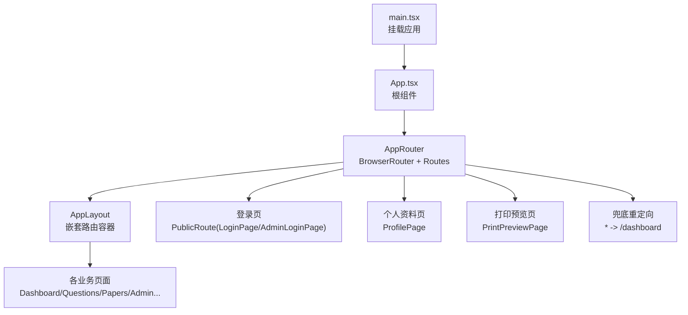
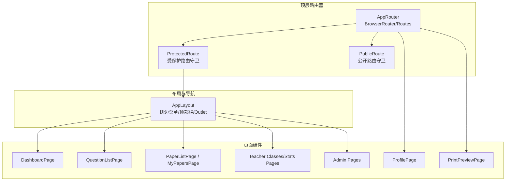
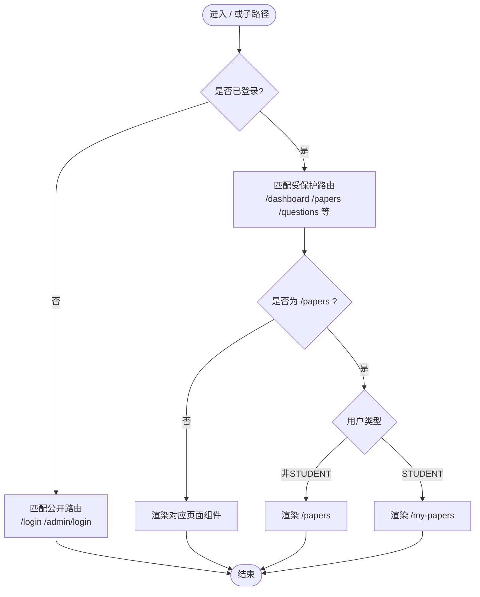
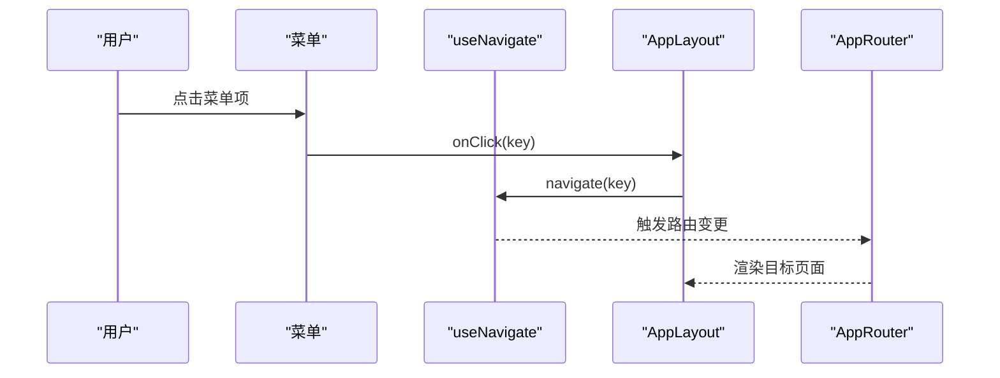
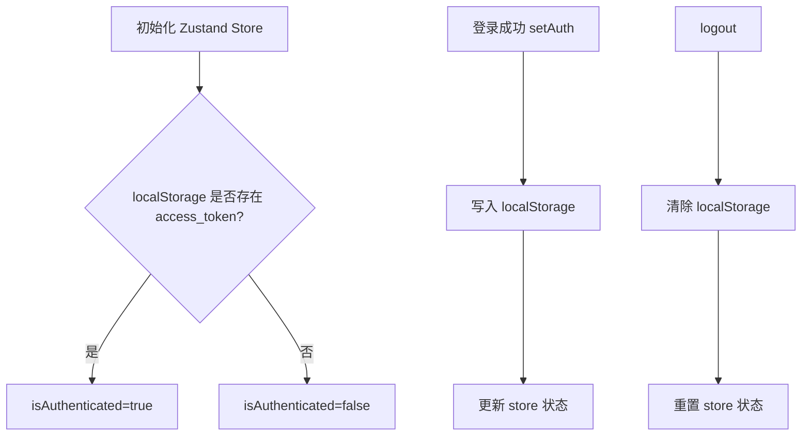
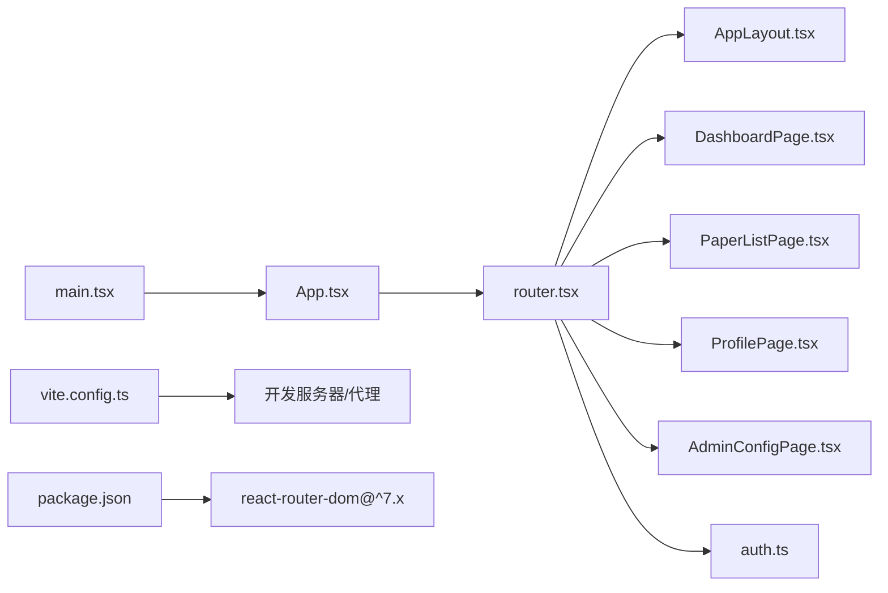

# 路由系统

<cite>
**本文引用的文件**
- [router.tsx](file://frontend/src/router.tsx)
- [App.tsx](file://frontend/src/App.tsx)
- [main.tsx](file://frontend/src/main.tsx)
- [AppLayout.tsx](file://frontend/src/components/layout/AppLayout.tsx)
- [auth.ts](file://frontend/src/store/auth.ts)
- [package.json](file://frontend/package.json)
- [vite.config.ts](file://frontend/vite.config.ts)
- [LoginPage.tsx](file://frontend/src/pages/auth/LoginPage.tsx)
- [ProfilePage.tsx](file://frontend/src/pages/auth/ProfilePage.tsx)
- [DashboardPage.tsx](file://frontend/src/pages/dashboard/DashboardPage.tsx)
- [PaperListPage.tsx](file://frontend/src/pages/papers/PaperListPage.tsx)
- [AdminConfigPage.tsx](file://frontend/src/pages/admin/AdminConfigPage.tsx)
</cite>

## 目录
1. [简介](#简介)
2. [项目结构](#项目结构)
3. [核心组件](#核心组件)
4. [架构总览](#架构总览)
5. [详细组件分析](#详细组件分析)
6. [依赖关系分析](#依赖关系分析)
7. [性能考虑](#性能考虑)
8. [故障排查指南](#故障排查指南)
9. [结论](#结论)
10. [附录](#附录)

## 简介
本文件系统性地文档化了瑞珹教育管理系统的前端路由体系，覆盖基于 React Router 的路由配置、页面组件组织与导航管理。重点阐述：
- 路由层级结构与嵌套路由
- 动态路由参数与路径设计
- 路由守卫（登录保护与公开访问）
- 不同用户角色的访问控制与菜单呈现
- 路由重定向与 404 页面处理
- 路由懒加载与代码分割策略
- 性能优化与调试技巧

## 项目结构
前端采用 Vite 构建，React 19 + React Router DOM v7，状态管理使用 Zustand。路由集中于单一文件，配合全局布局组件与认证状态管理，形成清晰的页面组织与导航体系。

图表来源
- [main.tsx:1-10](file://frontend/src/main.tsx#L1-L10)
- [App.tsx:1-6](file://frontend/src/App.tsx#L1-L6)
- [router.tsx:44-79](file://frontend/src/router.tsx#L44-L79)
- [AppLayout.tsx:67-166](file://frontend/src/components/layout/AppLayout.tsx#L67-L166)

章节来源
- [main.tsx:1-10](file://frontend/src/main.tsx#L1-L10)
- [App.tsx:1-6](file://frontend/src/App.tsx#L1-L6)
- [router.tsx:44-79](file://frontend/src/router.tsx#L44-L79)

## 核心组件
- 路由器与守卫
  - AppRouter：定义顶层路由、公共路由与受保护路由，并内置 PublicRoute/ProtectedRoute 守卫。
  - PapersPage：根据用户类型动态渲染“我的试卷”或“试卷管理”。
- 布局与导航
  - AppLayout：提供侧边菜单、顶部用户下拉、面包屑占位与 Outlet 嵌套渲染。
- 认证与权限
  - auth.ts：Zustand 状态存储，封装令牌与用户类型读取；提供 setAuth/logout/updateUserName。
- 页面组件
  - LoginPage/ProfilePage：登录与个人资料页，均使用 PublicRoute/ProtectedRoute 包裹。
  - DashboardPage/PaperListPage/AdminConfigPage：按角色展示不同内容与功能。

章节来源
- [router.tsx:26-42](file://frontend/src/router.tsx#L26-L42)
- [AppLayout.tsx:24-65](file://frontend/src/components/layout/AppLayout.tsx#L24-L65)
- [auth.ts:47-96](file://frontend/src/store/auth.ts#L47-L96)
- [LoginPage.tsx:11-217](file://frontend/src/pages/auth/LoginPage.tsx#L11-L217)
- [ProfilePage.tsx:9-168](file://frontend/src/pages/auth/ProfilePage.tsx#L9-L168)
- [DashboardPage.tsx:14-580](file://frontend/src/pages/dashboard/DashboardPage.tsx#L14-L580)
- [PaperListPage.tsx:29-263](file://frontend/src/pages/papers/PaperListPage.tsx#L29-L263)
- [AdminConfigPage.tsx:8-401](file://frontend/src/pages/admin/AdminConfigPage.tsx#L8-L401)

## 架构总览
系统采用“顶层路由器 + 布局容器 + 页面组件”的三层结构。顶层路由器负责路径匹配与守卫；布局容器负责菜单与导航；页面组件负责具体业务逻辑与数据请求。

图表来源
- [router.tsx:44-79](file://frontend/src/router.tsx#L44-L79)
- [AppLayout.tsx:67-166](file://frontend/src/components/layout/AppLayout.tsx#L67-L166)
- [DashboardPage.tsx:14-580](file://frontend/src/pages/dashboard/DashboardPage.tsx#L14-L580)
- [PaperListPage.tsx:29-263](file://frontend/src/pages/papers/PaperListPage.tsx#L29-L263)
- [ProfilePage.tsx:9-168](file://frontend/src/pages/auth/ProfilePage.tsx#L9-L168)

## 详细组件分析

### 路由器与守卫（AppRouter）
- 受保护路由
  - 使用 ProtectedRoute 包裹 AppLayout，内部嵌套路由仅对已登录用户可见。
  - 根路径“/”默认重定向到“/dashboard”，首页统一由 DashboardPage 渲染。
- 公开路由
  - 登录页与后台登录页使用 PublicRoute，已登录用户会被重定向到“/dashboard”。
- 动态页面
  - “/papers”根据用户类型动态渲染“/my-papers”或“/papers”，实现学生与教师的不同入口。
- 兜底与重定向
  - 通配符“*”重定向至“/dashboard”，避免出现空白页。
- 其他
  - “/print-preview”为独立页面，无需登录。

图表来源
- [router.tsx:49-72](file://frontend/src/router.tsx#L49-L72)
- [router.tsx:38-42](file://frontend/src/router.tsx#L38-L42)
- [router.tsx:26-36](file://frontend/src/router.tsx#L26-L36)

章节来源
- [router.tsx:26-42](file://frontend/src/router.tsx#L26-L42)
- [router.tsx:49-72](file://frontend/src/router.tsx#L49-L72)

### 布局与导航（AppLayout）
- 菜单与角色
  - 根据用户类型动态渲染菜单项与分组，支持“题库管理”“试卷管理”“答题统计”“系统配置”等。
  - 子菜单默认展开部分分组，便于教师与题管使用。
- 导航行为
  - 点击菜单项触发 useNavigate，实现无刷新跳转。
  - 用户下拉提供“个人信息”“退出登录”，退出后重定向到“/login”。

图表来源
- [AppLayout.tsx:83-96](file://frontend/src/components/layout/AppLayout.tsx#L83-L96)
- [AppLayout.tsx:125-133](file://frontend/src/components/layout/AppLayout.tsx#L125-L133)
- [router.tsx:52-70](file://frontend/src/router.tsx#L52-L70)

章节来源
- [AppLayout.tsx:24-65](file://frontend/src/components/layout/AppLayout.tsx#L24-L65)
- [AppLayout.tsx:67-166](file://frontend/src/components/layout/AppLayout.tsx#L67-L166)

### 认证与权限（auth.ts）
- 令牌与用户信息
  - 通过 localStorage 读取 access_token、user_type、user_name、user_id。
  - 初始化时根据是否存在 access_token 决定登录态。
- 登录/登出
  - setAuth：写入本地存储并更新状态，用于登录成功后的状态同步。
  - logout：清除本地存储并重置状态，配合守卫实现强制跳转。
- 页面内角色判断
  - 多个页面通过 getUserType 判断角色，动态调整界面与行为（例如 Dashboard、PaperList）。

图表来源
- [auth.ts:47-96](file://frontend/src/store/auth.ts#L47-L96)
- [auth.ts:9-14](file://frontend/src/store/auth.ts#L9-L14)

章节来源
- [auth.ts:9-14](file://frontend/src/store/auth.ts#L9-L14)
- [auth.ts:47-96](file://frontend/src/store/auth.ts#L47-L96)

### 页面组件与角色控制

#### 登录流程（LoginPage）
- 行为要点
  - 图形验证码刷新、短信验证码发送与倒计时、登录/注册表单联动。
  - 登录成功后调用 setAuth 并跳转“/dashboard”。
- 与路由的关系
  - 位于 PublicRoute 下，未登录用户可访问；已登录用户会被 PublicRoute 重定向到“/dashboard”。

章节来源
- [LoginPage.tsx:11-217](file://frontend/src/pages/auth/LoginPage.tsx#L11-L217)
- [router.tsx:50-51](file://frontend/src/router.tsx#L50-L51)

#### 仪表盘（DashboardPage）
- 行为要点
  - 根据用户类型渲染不同内容：学生、教师、题管、系统管理员分别展示不同的统计数据与快捷入口。
  - 教师仪表盘包含班级与试卷统计，题管仪表盘包含题库概览与待审列表。
- 与路由的关系
  - 作为受保护路由下的首页，统一由 AppLayout 嵌套渲染。

章节来源
- [DashboardPage.tsx:14-580](file://frontend/src/pages/dashboard/DashboardPage.tsx#L14-L580)
- [router.tsx:54](file://frontend/src/router.tsx#L54)

#### 试卷管理（PaperListPage）
- 行为要点
  - 学生视角显示“我的试卷”相关能力；教师/题管视角显示完整的试卷管理与导入导出能力。
  - 支持导出、打印、预览、删除等操作。
- 与路由的关系
  - 在“/papers”下渲染；当用户类型为 STUDENT 时，实际由 PapersPage 动态映射到“/my-papers”。

章节来源
- [PaperListPage.tsx:29-263](file://frontend/src/pages/papers/PaperListPage.tsx#L29-L263)
- [router.tsx:56](file://frontend/src/router.tsx#L56)
- [router.tsx:38-42](file://frontend/src/router.tsx#L38-L42)

#### 系统配置（AdminConfigPage）
- 行为要点
  - 提供大模型配置、OCR 设置、数据库状态与连接参数配置等。
- 与路由的关系
  - 位于受保护路由下，仅管理员可见。

章节来源
- [AdminConfigPage.tsx:8-401](file://frontend/src/pages/admin/AdminConfigPage.tsx#L8-L401)
- [router.tsx:64-68](file://frontend/src/router.tsx#L64-L68)

#### 个人资料（ProfilePage）
- 行为要点
  - 展示与更新用户基本信息、手机号等；更新后同步到认证状态。
- 与路由的关系
  - 受保护路由下的独立页面。

章节来源
- [ProfilePage.tsx:9-168](file://frontend/src/pages/auth/ProfilePage.tsx#L9-L168)
- [router.tsx:69](file://frontend/src/router.tsx#L69)

## 依赖关系分析
- 路由与页面
  - AppRouter 定义路径与守卫；AppLayout 作为嵌套路由容器；各页面组件按需渲染。
- 路由与状态
  - auth.ts 提供 isAuth/getUserType，被守卫与页面逻辑共同使用。
- 构建与代理
  - Vite 提供开发服务器与代理；package.json 指定 React Router DOM 版本。

图表来源
- [router.tsx:44-79](file://frontend/src/router.tsx#L44-L79)
- [AppLayout.tsx:67-166](file://frontend/src/components/layout/AppLayout.tsx#L67-L166)
- [auth.ts:47-96](file://frontend/src/store/auth.ts#L47-L96)
- [main.tsx:1-10](file://frontend/src/main.tsx#L1-L10)
- [vite.config.ts:1-17](file://frontend/vite.config.ts#L1-L17)
- [package.json:12-22](file://frontend/package.json#L12-L22)

章节来源
- [router.tsx:44-79](file://frontend/src/router.tsx#L44-L79)
- [auth.ts:47-96](file://frontend/src/store/auth.ts#L47-L96)
- [vite.config.ts:1-17](file://frontend/vite.config.ts#L1-L17)
- [package.json:12-22](file://frontend/package.json#L12-L22)

## 性能考虑
- 路由懒加载与代码分割
  - 当前路由配置未显式使用 React.lazy 与 Suspense 实现页面级懒加载。建议对大型页面（如 AdminConfigPage、DashboardPage）进行懒加载，以减少首屏体积与提升首屏速度。
  - 示例思路：将页面组件改为动态导入，结合 React.Suspense 在路由层包裹，确保在切换路由时异步加载模块。
- 构建缓存
  - Vite 配置了自定义 cacheDir，有助于加速二次构建。
- 请求与渲染
  - 页面组件应避免在渲染阶段发起大量请求；可采用惰性加载、分页与缓存策略降低重复请求。

## 故障排查指南
- 登录后无法进入受保护页面
  - 检查 localStorage 中 access_token 是否存在；确认 auth.ts 的 setAuth 是否正确写入。
  - 确认 ProtectedRoute 的 isAuth 逻辑与守卫包裹是否生效。
- 已登录用户仍被重定向到登录页
  - 检查 PublicRoute 的 isAuth 逻辑，确保 PublicRoute 仅在未登录时生效。
- 动态路由“/papers”未按预期跳转
  - 确认 getUserType 返回值与 PapersPage 的分支逻辑一致。
- 404 页面未显示
  - 确认通配符“*”重定向规则是否生效；检查路径拼写与大小写。
- 打印预览页无法打开
  - 确认“/print-preview”路由存在且未被守卫拦截。

章节来源
- [router.tsx:26-42](file://frontend/src/router.tsx#L26-L42)
- [router.tsx:71-72](file://frontend/src/router.tsx#L71-L72)
- [auth.ts:9-14](file://frontend/src/store/auth.ts#L9-L14)

## 结论
本路由系统以简洁清晰的方式实现了登录保护、角色驱动的菜单与页面渲染、以及基础的重定向与兜底处理。为进一步提升性能与可维护性，建议引入路由级懒加载与 Suspense、完善权限细化与细粒度守卫，并在开发工具中启用 React DevTools 与 React Router DevTools 进行调试。

## 附录

### 路由配置示例（路径与用途）
- “/login”：学生登录（PublicRoute）
- “/admin/login”：后台登录（PublicRoute）
- “/”：受保护布局（ProtectedRoute<AppLayout>）
  - “/dashboard”：仪表盘（受保护）
  - “/questions”：题库浏览（受保护）
  - “/papers”：试卷管理（受保护，动态映射）
  - “/my-papers”：我的试卷（受保护，学生）
  - “/typical-questions”：典型题讲解（受保护）
  - “/mistake-book”：错题本（受保护）
  - “/teacher/classes”：教师班级管理（受保护）
  - “/teacher/stats/paper”：试卷答题统计（受保护）
  “/teacher/stats/question”：试题答题统计（受保护）
  - “/admin/basic-config”：应用参数（受保护）
  - “/admin/config”：系统配置（受保护）
  - “/admin/sys-admin”：管理账号（受保护）
  - “/question-admin”：智能出题（受保护）
  - “/syllabus”：考纲管理（受保护）
  - “/profile”：个人资料（受保护）
- “/print-preview”：打印预览（独立页面）
- “*”：兜底重定向至“/dashboard”

章节来源
- [router.tsx:49-72](file://frontend/src/router.tsx#L49-L72)