# API路由系统

<cite>
**本文档引用的文件**
- [backend/app/main.py](file://backend/app/main.py)
- [backend/app/api/v1/api.py](file://backend/app/api/v1/api.py)
- [backend/app/api/v1/endpoints/auth_v2.py](file://backend/app/api/v1/endpoints/auth_v2.py)
- [backend/app/api/v1/endpoints/student.py](file://backend/app/api/v1/endpoints/student.py)
- [backend/app/api/v1/endpoints/classes.py](file://backend/app/api/v1/endpoints/classes.py)
- [backend/app/api/v1/endpoints/subjects.py](file://backend/app/api/v1/endpoints/subjects.py)
- [backend/app/api/v1/endpoints/questions.py](file://backend/app/api/v1/endpoints/questions.py)
- [backend/app/api/v1/endpoints/exam_papers.py](file://backend/app/api/v1/endpoints/exam_papers.py)
- [backend/app/api/v1/endpoints/grading.py](file://backend/app/api/v1/endpoints/grading.py)
- [backend/app/api/v1/endpoints/notifications.py](file://backend/app/api/v1/endpoints/notifications.py)
- [backend/app/core/config.py](file://backend/app/core/config.py)
- [backend/app/core/response.py](file://backend/app/core/response.py)
- [backend/app/core/security.py](file://backend/app/core/security.py)
- [backend/sysconfig.json](file://backend/sysconfig.json)
</cite>

## 目录
1. [简介](#简介)
2. [项目结构](#项目结构)
3. [核心组件](#核心组件)
4. [架构概览](#架构概览)
5. [详细组件分析](#详细组件分析)
6. [依赖分析](#依赖分析)
7. [性能考虑](#性能考虑)
8. [故障排除指南](#故障排除指南)
9. [结论](#结论)
10. [附录](#附录)

## 简介

瑞珹教育管理系统采用模块化的API路由架构，基于FastAPI框架构建。本系统实现了完整的教育管理功能，包括教师管理、学生管理、题库管理、试卷管理、智能判卷等核心业务模块。

系统采用版本化的API设计，当前主要版本为v1，通过统一的路由前缀 `/api/v1` 提供服务。所有API响应都经过统一包装，确保前后端交互的一致性。

## 项目结构

系统采用按功能模块划分的目录结构，每个业务模块都有独立的路由定义：

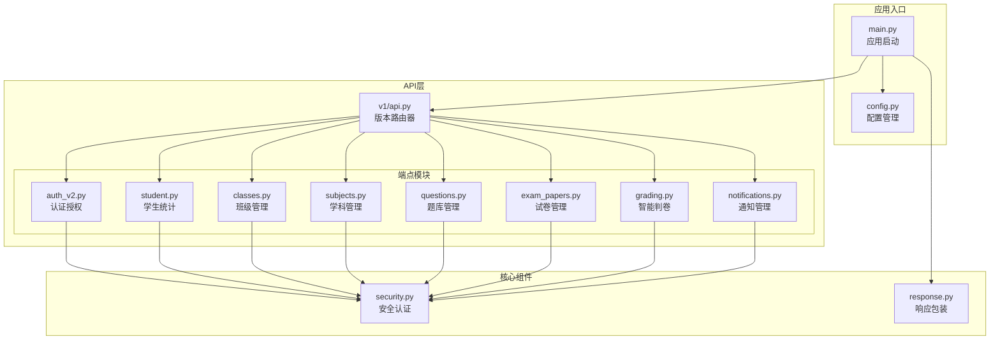

**图表来源**
- [backend/app/main.py:1-52](file://backend/app/main.py#L1-L52)
- [backend/app/api/v1/api.py:1-26](file://backend/app/api/v1/api.py#L1-L26)

**章节来源**
- [backend/app/main.py:1-52](file://backend/app/main.py#L1-L52)
- [backend/app/api/v1/api.py:1-26](file://backend/app/api/v1/api.py#L1-L26)

## 核心组件

### 应用入口与配置

系统通过主应用文件初始化，配置了统一的CORS策略和API响应包装中间件：

- **应用初始化**：设置项目名称、版本号和OpenAPI路径
- **CORS配置**：支持跨域请求，生产环境建议限制具体域名
- **响应包装**：统一将所有 `/api/*` 响应包装为 `{code, message, data}` 格式

### 版本化路由系统

API采用版本化设计，当前使用 `/api/v1` 作为统一前缀：

- **版本常量**：在配置中定义 `API_V1_STR = "/api/v1"`
- **路由聚合**：主路由器包含所有业务模块的子路由
- **标签分组**：每个模块使用特定的标签进行分类管理

### 安全认证体系

系统实现了多角色用户认证机制：

- **JWT令牌**：支持访问令牌和刷新令牌
- **角色权限**：系统管理员、教师、题库管理员、学生
- **依赖注入**：通过FastAPI的Depends实现自动认证和权限检查

**章节来源**
- [backend/app/main.py:11-30](file://backend/app/main.py#L11-L30)
- [backend/app/core/config.py:36-47](file://backend/app/core/config.py#L36-L47)
- [backend/app/core/security.py:64-103](file://backend/app/core/security.py#L64-L103)

## 架构概览

系统采用分层架构设计，从上到下分别为表现层、业务逻辑层、数据访问层：

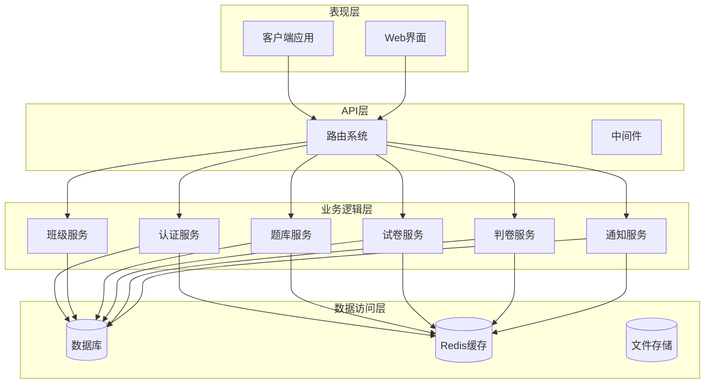

**图表来源**
- [backend/app/main.py:1-52](file://backend/app/main.py#L1-L52)
- [backend/app/api/v1/api.py:1-26](file://backend/app/api/v1/api.py#L1-L26)

## 详细组件分析

### 认证授权模块

认证模块实现了完整的用户身份验证流程，支持多种登录方式：

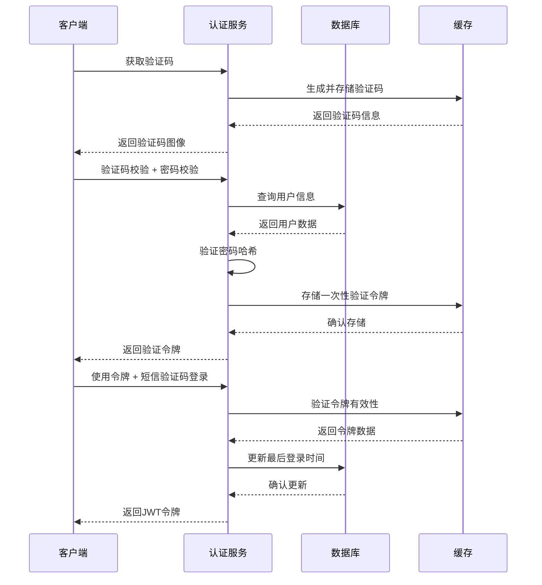

**图表来源**
- [backend/app/api/v1/endpoints/auth_v2.py:91-183](file://backend/app/api/v1/endpoints/auth_v2.py#L91-L183)

#### 登录流程特点

- **分步验证**：验证码验证 → 密码验证 → 令牌验证
- **多角色支持**：系统管理员、题库管理员、教师
- **短信验证**：支持短信验证码登录（测试环境使用固定验证码）
- **会话管理**：JWT令牌包含用户类型信息

**章节来源**
- [backend/app/api/v1/endpoints/auth_v2.py:1-476](file://backend/app/api/v1/endpoints/auth_v2.py#L1-L476)

### 学生统计模块

学生统计模块提供个性化的学习数据分析：

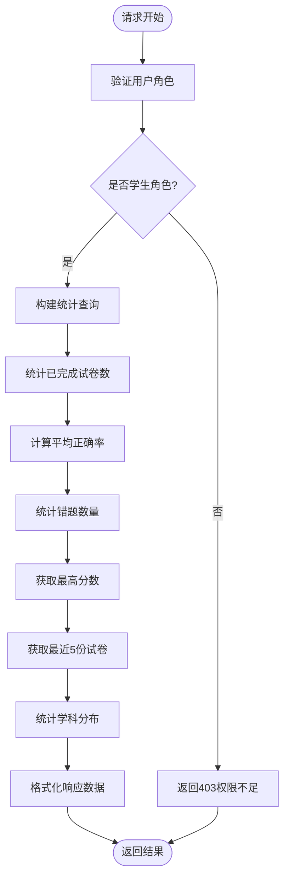

**图表来源**
- [backend/app/api/v1/endpoints/student.py:16-111](file://backend/app/api/v1/endpoints/student.py#L16-L111)

#### 统计指标说明

- **已完成试卷数**：基于判卷状态统计
- **平均正确率**：综合所有有效提交的平均值
- **错题统计**：来自错题本的题目数量汇总
- **学科分布**：按学科分类的试卷完成情况

**章节来源**
- [backend/app/api/v1/endpoints/student.py:1-112](file://backend/app/api/v1/endpoints/student.py#L1-L112)

### 班级管理模块

班级管理模块实现了完整的班级生命周期管理：

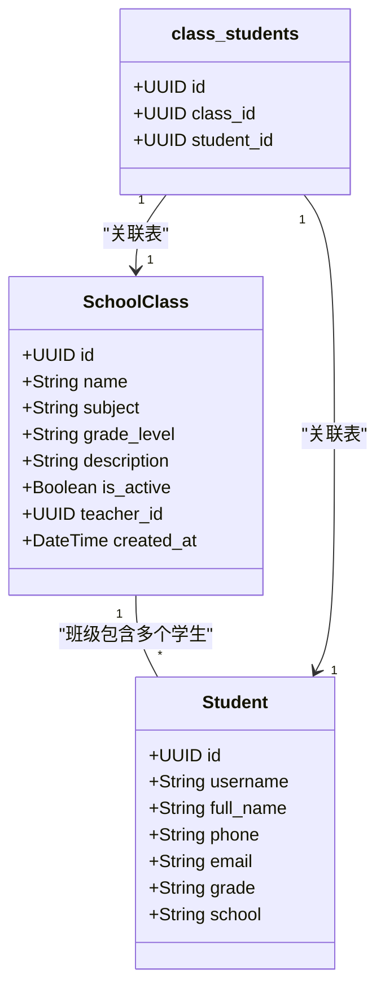

**图表来源**
- [backend/app/api/v1/endpoints/classes.py:7-11](file://backend/app/api/v1/endpoints/classes.py#L7-L11)

#### 功能特性

- **角色权限控制**：教师和系统管理员可创建和管理班级
- **学生批量管理**：支持现有学生添加和新学生创建
- **灵活查询**：支持按搜索条件过滤班级列表
- **关联关系维护**：通过关联表管理班级与学生的多对多关系

**章节来源**
- [backend/app/api/v1/endpoints/classes.py:1-243](file://backend/app/api/v1/endpoints/classes.py#L1-L243)

### 学科管理模块

学科管理模块提供学科的增删改查功能：

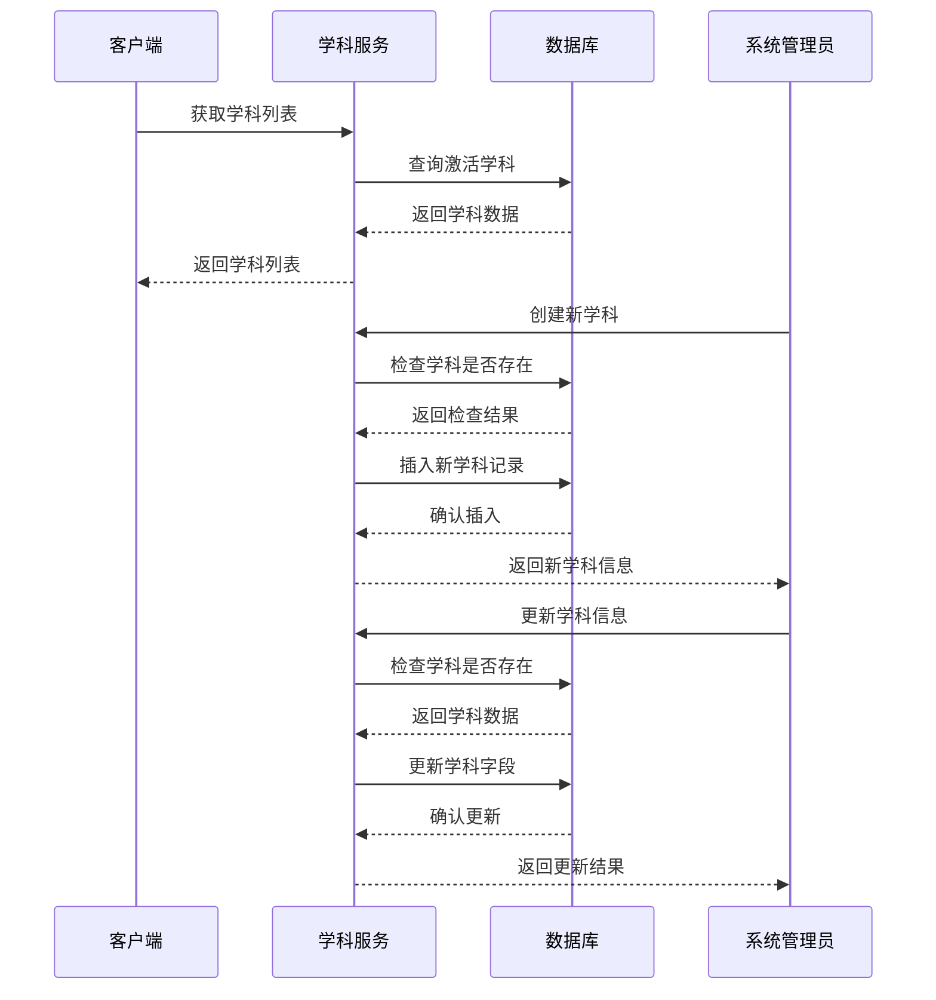

**图表来源**
- [backend/app/api/v1/endpoints/subjects.py:13-83](file://backend/app/api/v1/endpoints/subjects.py#L13-L83)

#### 权限设计

- **创建/更新/删除**：仅系统管理员可操作
- **查询**：所有认证用户可查看激活学科
- **软删除**：删除操作改为禁用状态而非物理删除

**章节来源**
- [backend/app/api/v1/endpoints/subjects.py:1-83](file://backend/app/api/v1/endpoints/subjects.py#L1-L83)

### 题库管理模块

题库管理模块提供了完整的试题生命周期管理：

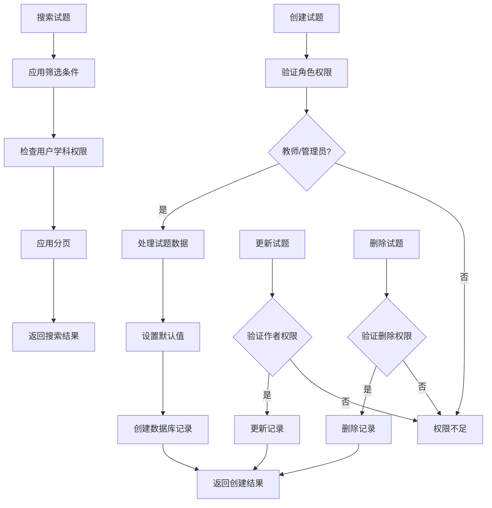

**图表来源**
- [backend/app/api/v1/endpoints/questions.py:17-434](file://backend/app/api/v1/endpoints/questions.py#L17-L434)

#### 核心功能

- **权限控制**：教师、题库管理员、系统管理员具有不同操作权限
- **搜索过滤**：支持多维度筛选（学科、难度、类型、关键词等）
- **批量操作**：支持批量导入、导出、删除
- **典型题标记**：支持标记典型题目用于教学参考

**章节来源**
- [backend/app/api/v1/endpoints/questions.py:1-434](file://backend/app/api/v1/endpoints/questions.py#L1-L434)

### 试卷管理模块

试卷管理模块实现了完整的试卷创建、管理和导出功能：

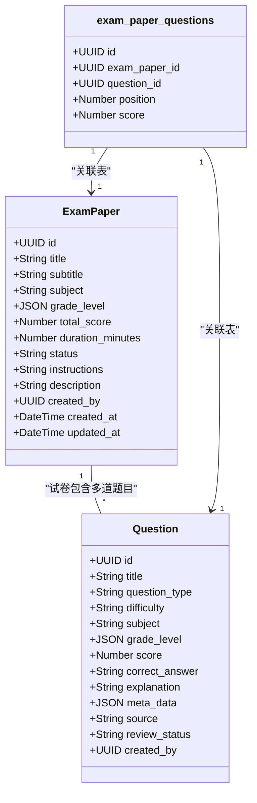

**图表来源**
- [backend/app/api/v1/endpoints/exam_papers.py:17-17](file://backend/app/api/v1/endpoints/exam_papers.py#L17-L17)

#### 导出功能

系统支持多种格式的试卷导出：

- **Word格式**：完整的排版样式，支持各种题型
- **PDF格式**：紧凑的打印格式
- **自定义样式**：根据题型进行不同的排版处理

**章节来源**
- [backend/app/api/v1/endpoints/exam_papers.py:1-847](file://backend/app/api/v1/endpoints/exam_papers.py#L1-L847)

### 智能判卷模块

智能判卷模块提供了自动化的判卷服务：

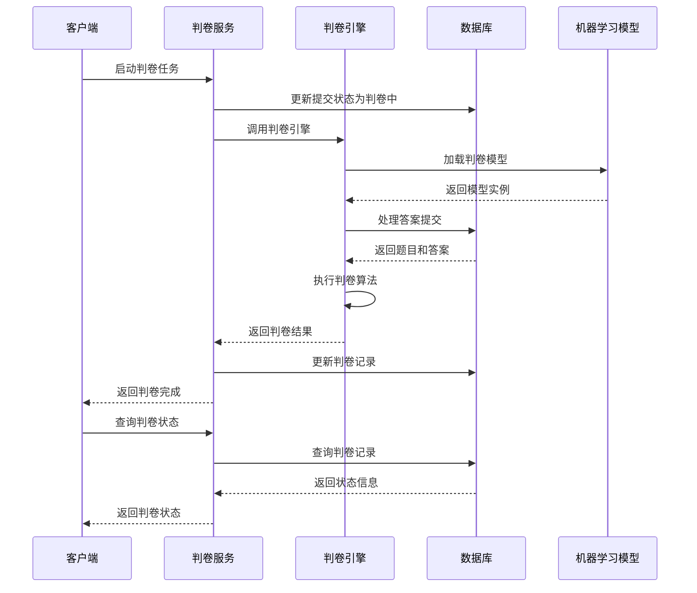

**图表来源**
- [backend/app/api/v1/endpoints/grading.py:19-55](file://backend/app/api/v1/endpoints/grading.py#L19-L55)

#### 技术特点

- **异步处理**：判卷过程异步执行，避免阻塞请求
- **状态跟踪**：完整的判卷状态管理
- **模型管理**：支持多种判卷模型的切换和管理
- **历史记录**：保存完整的判卷历史便于追溯

**章节来源**
- [backend/app/api/v1/endpoints/grading.py:1-143](file://backend/app/api/v1/endpoints/grading.py#L1-L143)

### 通知管理模块

通知管理模块提供了完整的消息通知系统：

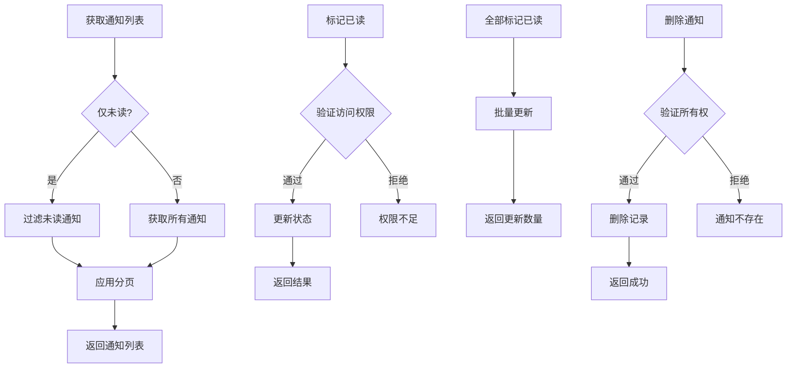

**图表来源**
- [backend/app/api/v1/endpoints/notifications.py:13-80](file://backend/app/api/v1/endpoints/notifications.py#L13-L80)

#### 功能特性

- **权限控制**：每个用户只能访问自己的通知
- **分页查询**：支持大规模通知列表的高效查询
- **批量操作**：支持批量标记已读和删除
- **未读统计**：实时统计未读通知数量

**章节来源**
- [backend/app/api/v1/endpoints/notifications.py:1-80](file://backend/app/api/v1/endpoints/notifications.py#L1-L80)

## 依赖分析

系统采用模块化的依赖管理，各组件之间的耦合度较低：

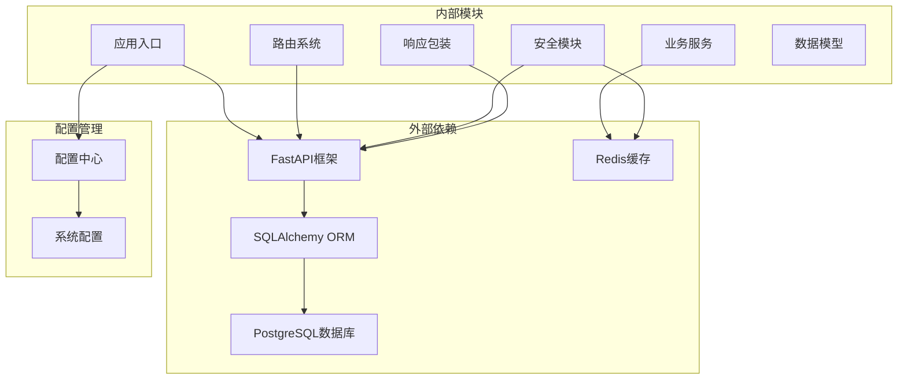

**图表来源**
- [backend/app/main.py:1-52](file://backend/app/main.py#L1-L52)
- [backend/app/core/config.py:1-98](file://backend/app/core/config.py#L1-L98)

### 关键依赖关系

- **应用启动**：main.py负责初始化应用和中间件
- **路由聚合**：api.py集中管理所有业务模块路由
- **安全认证**：security.py提供统一的认证和权限检查
- **响应包装**：response.py确保所有API响应格式一致
- **配置管理**：config.py集中管理所有系统配置

**章节来源**
- [backend/app/core/config.py:1-98](file://backend/app/core/config.py#L1-L98)
- [backend/app/core/response.py:1-124](file://backend/app/core/response.py#L1-L124)
- [backend/app/core/security.py:1-104](file://backend/app/core/security.py#L1-L104)

## 性能考虑

### 缓存策略

系统采用了多层次的缓存策略来提升性能：

- **Redis缓存**：用于存储验证码、会话信息等临时数据
- **数据库查询缓存**：对频繁查询的数据进行缓存
- **静态资源缓存**：对不经常变化的配置数据进行缓存

### 数据库优化

- **索引优化**：为常用查询字段建立适当的索引
- **连接池管理**：使用异步连接池提高数据库访问效率
- **查询优化**：避免N+1查询问题，使用JOIN和预加载

### API性能优化

- **分页机制**：所有列表查询都支持分页，限制最大返回数量
- **批量操作**：支持批量导入和导出，减少网络往返
- **异步处理**：耗时操作采用异步处理，避免阻塞主线程

## 故障排除指南

### 常见问题及解决方案

#### 认证相关问题

- **验证码错误**：检查验证码是否过期，确认缓存服务正常运行
- **JWT令牌无效**：验证令牌签名和过期时间，检查密钥配置
- **权限不足**：确认用户角色和权限范围，检查权限验证逻辑

#### 数据库连接问题

- **连接超时**：检查数据库连接池配置，增加连接数
- **查询超时**：优化慢查询，添加必要的索引
- **事务冲突**：检查并发访问，使用适当的锁机制

#### 缓存问题

- **缓存失效**：检查Redis服务状态，验证缓存键值
- **内存不足**：监控缓存使用情况，调整缓存策略
- **数据不一致**：实现缓存更新的原子性操作

**章节来源**
- [backend/app/core/response.py:14-124](file://backend/app/core/response.py#L14-L124)
- [backend/app/core/security.py:64-103](file://backend/app/core/security.py#L64-L103)

## 结论

瑞珹教育管理系统的API路由系统设计合理，具有以下特点：

1. **模块化设计**：每个业务模块都有独立的路由定义，便于维护和扩展
2. **版本化管理**：采用版本化的API设计，支持向后兼容
3. **统一响应格式**：所有API响应都经过统一包装，确保一致性
4. **完善的权限控制**：基于角色的细粒度权限管理
5. **性能优化**：采用多种优化策略提升系统性能

系统整体架构清晰，代码结构良好，为后续的功能扩展和性能优化奠定了坚实基础。

## 附录

### API端点分类表

| 模块 | 端点数量 | 主要功能 | 访问权限 |
|------|----------|----------|----------|
| 认证授权 | 12 | 用户登录、注册、权限管理 | 所有用户 |
| 学生统计 | 1 | 学习数据分析 | 学生 |
| 班级管理 | 12 | 班级CRUD、学生管理 | 教师/管理员 |
| 学科管理 | 6 | 学科增删改查 | 系统管理员 |
| 题库管理 | 18 | 试题管理、搜索过滤 | 教师/管理员 |
| 试卷管理 | 25 | 试卷创建、管理、导出 | 教师/管理员 |
| 智能判卷 | 8 | 判卷任务管理 | 教师/管理员 |
| 通知管理 | 6 | 消息通知系统 | 所有用户 |

### URL路径设计规范

- **版本前缀**：`/api/v1`
- **模块路径**：`/{module-name}`
- **资源路径**：`/{resource-id}`
- **操作路径**：`/{operation}`
- **查询参数**：`?key=value&limit=20`

### 响应格式标准

所有API响应遵循统一格式：
```json
{
  "code": 200,
  "message": "成功",
  "data": {}
}
```

### 错误处理机制

- **HTTP状态码**：使用标准HTTP状态码
- **错误消息**：提供清晰的错误描述
- **异常捕获**：全局异常处理和日志记录
- **安全防护**：防止敏感信息泄露