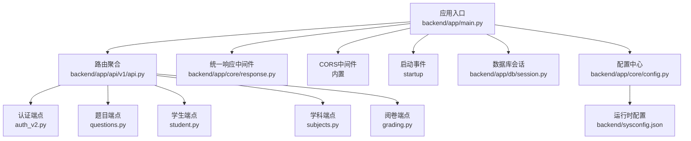
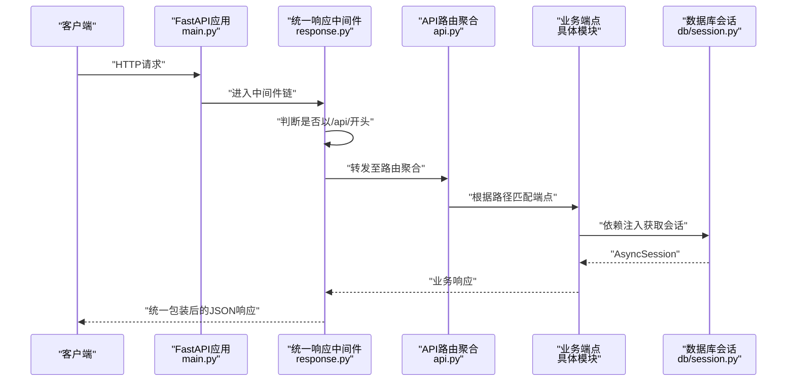
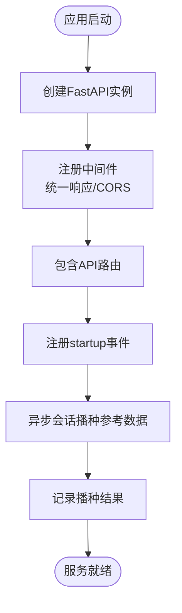
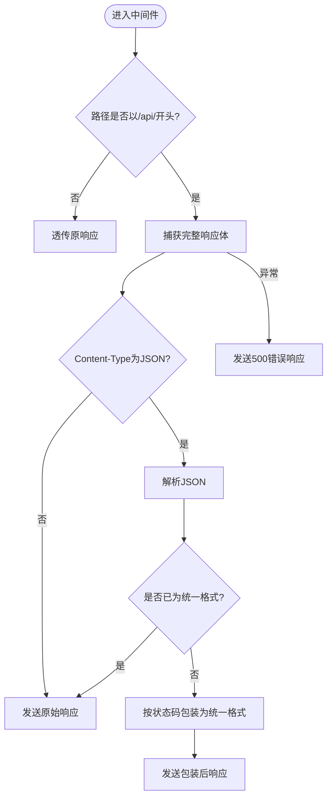
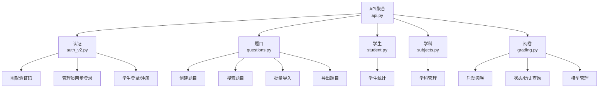
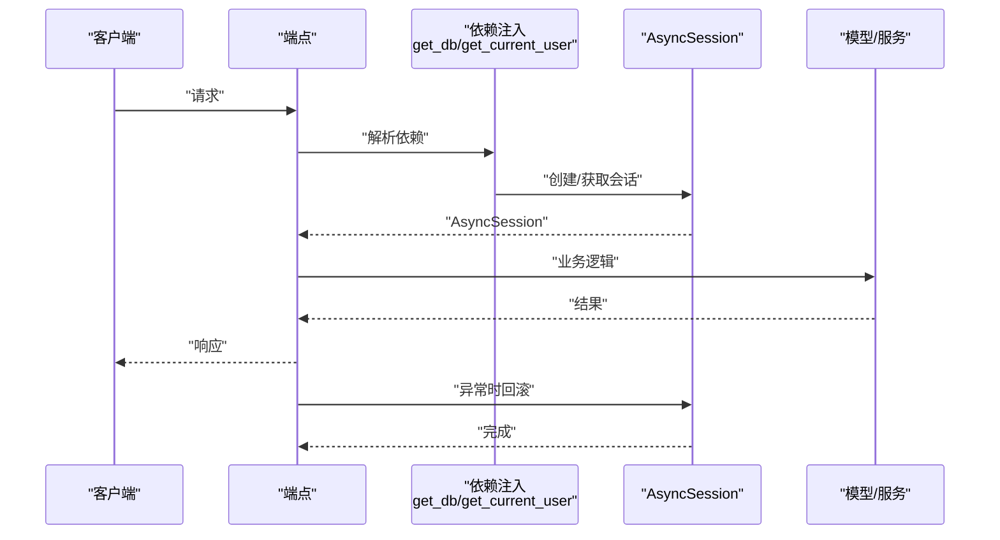
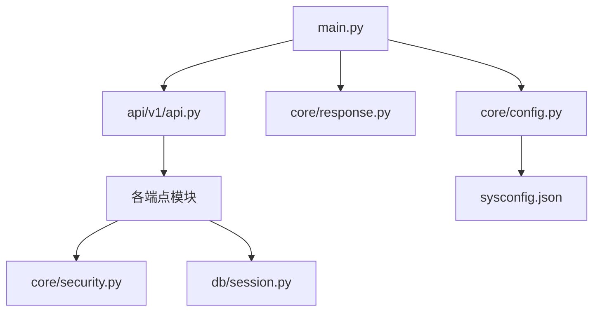

# FastAPI应用结构

<cite>
**本文档引用的文件**
- [backend/app/main.py](file://backend/app/main.py)
- [backend/app/core/config.py](file://backend/app/core/config.py)
- [backend/app/core/response.py](file://backend/app/core/response.py)
- [backend/app/api/v1/api.py](file://backend/app/api/v1/api.py)
- [backend/app/db/session.py](file://backend/app/db/session.py)
- [backend/app/core/security.py](file://backend/app/core/security.py)
- [backend/sysconfig.json](file://backend/sysconfig.json)
- [backend/requirements.txt](file://backend/requirements.txt)
- [backend/app/api/v1/endpoints/auth_v2.py](file://backend/app/api/v1/endpoints/auth_v2.py)
- [backend/app/api/v1/endpoints/questions.py](file://backend/app/api/v1/endpoints/questions.py)
- [backend/app/api/v1/endpoints/student.py](file://backend/app/api/v1/endpoints/student.py)
- [backend/app/api/v1/endpoints/subjects.py](file://backend/app/api/v1/endpoints/subjects.py)
- [backend/app/api/v1/endpoints/grading.py](file://backend/app/api/v1/endpoints/grading.py)
</cite>

## 目录
1. [简介](#简介)
2. [项目结构](#项目结构)
3. [核心组件](#核心组件)
4. [架构总览](#架构总览)
5. [详细组件分析](#详细组件分析)
6. [依赖分析](#依赖分析)
7. [性能考虑](#性能考虑)
8. [故障排除指南](#故障排除指南)
9. [结论](#结论)

## 简介
本文件面向瑞珹教育管理系统后端的FastAPI应用，系统性梳理应用初始化流程、中间件配置与路由组织方式，解释API版本控制策略、统一响应包装机制与CORS跨域处理，文档化应用启动事件处理、健康检查端点与项目配置管理，并总结FastAPI框架特性利用、依赖注入机制与异步处理模式。同时提供应用生命周期管理、错误处理策略与性能优化建议，帮助开发者快速理解并维护该应用。

## 项目结构
后端采用分层与功能模块结合的组织方式：
- 应用入口与全局配置：backend/app/main.py、backend/app/core/config.py
- 统一响应包装与安全：backend/app/core/response.py、backend/app/core/security.py
- 路由聚合：backend/app/api/v1/api.py
- 数据库会话与依赖注入：backend/app/db/session.py
- 功能端点：backend/app/api/v1/endpoints 下按业务域划分（如 auth_v2.py、questions.py、student.py、subjects.py、grading.py 等）
- 运行时配置：backend/sysconfig.json
- 依赖声明：backend/requirements.txt

图表来源
- [backend/app/main.py:1-52](file://backend/app/main.py#L1-L52)
- [backend/app/api/v1/api.py:1-26](file://backend/app/api/v1/api.py#L1-L26)
- [backend/app/core/response.py:1-124](file://backend/app/core/response.py#L1-L124)
- [backend/app/db/session.py:1-26](file://backend/app/db/session.py#L1-L26)
- [backend/app/core/config.py:1-98](file://backend/app/core/config.py#L1-L98)
- [backend/sysconfig.json:1-48](file://backend/sysconfig.json#L1-L48)

章节来源
- [backend/app/main.py:1-52](file://backend/app/main.py#L1-L52)
- [backend/app/api/v1/api.py:1-26](file://backend/app/api/v1/api.py#L1-L26)
- [backend/app/core/config.py:1-98](file://backend/app/core/config.py#L1-L98)
- [backend/app/core/response.py:1-124](file://backend/app/core/response.py#L1-L124)
- [backend/app/db/session.py:1-26](file://backend/app/db/session.py#L1-L26)
- [backend/sysconfig.json:1-48](file://backend/sysconfig.json#L1-L48)

## 核心组件
- 应用实例与基础配置
  - 应用名称、版本、OpenAPI路径由配置中心统一提供，确保一致的对外展示与版本标识。
  - 启动事件中进行参考数据播种，保证服务启动时具备必要的基础数据。
- 中间件体系
  - 统一响应包装中间件：对所有以“/api/”开头的请求进行统一包装，避免重复封装与body迭代器问题，提升兼容性与稳定性。
  - CORS中间件：允许任意来源、凭证、方法与头，便于前端联调；生产环境建议限制具体来源。
- 路由组织
  - 使用APIRouter聚合各业务模块端点，按功能域前缀与标签组织，清晰体现模块边界与职责。
- 依赖注入与数据库会话
  - 异步SQLAlchemy引擎与session工厂，提供异步依赖get_db，贯穿所有端点，确保事务一致性与异常回滚。
- 安全与认证
  - 基于JWT的令牌生成与校验、OAuth2密码流、统一当前用户对象CurrentUser，以及基于角色的权限控制装饰器require_role。

章节来源
- [backend/app/main.py:11-52](file://backend/app/main.py#L11-L52)
- [backend/app/core/response.py:14-124](file://backend/app/core/response.py#L14-L124)
- [backend/app/api/v1/api.py:1-26](file://backend/app/api/v1/api.py#L1-L26)
- [backend/app/db/session.py:18-26](file://backend/app/db/session.py#L18-L26)
- [backend/app/core/security.py:53-104](file://backend/app/core/security.py#L53-L104)

## 架构总览
下图展示了从请求进入应用到响应返回的关键路径，包括中间件拦截、路由分发与端点执行。

图表来源
- [backend/app/main.py:11-31](file://backend/app/main.py#L11-L31)
- [backend/app/core/response.py:20-101](file://backend/app/core/response.py#L20-L101)
- [backend/app/api/v1/api.py:1-26](file://backend/app/api/v1/api.py#L1-L26)
- [backend/app/db/session.py:18-26](file://backend/app/db/session.py#L18-L26)

## 详细组件分析

### 应用初始化与启动事件
- 初始化阶段
  - 创建FastAPI实例，设置标题、版本与OpenAPI路径，确保对外接口规范一致。
  - 注册统一响应中间件与CORS中间件，形成全局横切能力。
  - 包含API路由，使用统一前缀，便于版本控制与扩展。
- 启动事件
  - 在startup事件中，使用异步会话连接数据库并播种参考数据，日志记录播种结果，异常时降级跳过，避免阻塞启动。

图表来源
- [backend/app/main.py:11-43](file://backend/app/main.py#L11-L43)

章节来源
- [backend/app/main.py:11-43](file://backend/app/main.py#L11-L43)

### 中间件：统一响应包装机制
- 实现原理
  - 采用纯ASGI中间件，避免BaseHTTPMiddleware在body迭代器上的限制。
  - 仅对以“/api/”开头的请求进行包装，非API路径透传。
  - 解析JSON响应体，若已是统一格式则直接透传；否则按状态码区分成功/错误，构造统一字段。
  - 异常情况下返回标准错误响应，确保客户端始终收到一致的响应结构。
- 辅助工具
  - 提供api_response与api_error辅助函数，便于端点内快速构建标准化响应。

图表来源
- [backend/app/core/response.py:20-101](file://backend/app/core/response.py#L20-L101)

章节来源
- [backend/app/core/response.py:14-124](file://backend/app/core/response.py#L14-L124)

### API版本控制策略
- 版本前缀
  - 所有API均以前缀“/api/v1”组织，便于未来引入v2等新版本而不影响现有客户端。
- 路由聚合
  - 通过APIRouter集中include各业务模块路由，统一前缀与标签，保持接口命名与组织的一致性。

章节来源
- [backend/app/core/config.py:40](file://backend/app/core/config.py#L40)
- [backend/app/api/v1/api.py:1-26](file://backend/app/api/v1/api.py#L1-L26)

### CORS跨域处理
- 配置策略
  - 允许任意来源、凭证、方法与头，便于前端开发与联调。
  - 生产环境建议限定具体origins、methods与headers，减少安全风险。
- 生效范围
  - 作为全局中间件，对所有请求生效，无需在端点单独处理。

章节来源
- [backend/app/main.py:21-27](file://backend/app/main.py#L21-L27)

### 路由组织与端点示例
- 路由聚合
  - 按功能域include多个子路由，如认证、题目、学生统计、学科、阅卷等，标签化便于OpenAPI文档阅读。
- 端点示例
  - 认证：支持管理员验证码+短信+角色校验的两步登录流程，生成多类型JWT令牌。
  - 题目：支持创建、搜索、批量导入、导出等功能，带权限与过滤控制。
  - 学生：提供真实统计数据接口，聚合答题、错题本与试卷信息。
  - 学科：系统管理员专用的学科增删改查与可见性控制。
  - 阅卷：启动阅卷、查询状态与历史、模型列表与切换等。

图表来源
- [backend/app/api/v1/api.py:6-26](file://backend/app/api/v1/api.py#L6-L26)
- [backend/app/api/v1/endpoints/auth_v2.py:1-200](file://backend/app/api/v1/endpoints/auth_v2.py#L1-L200)
- [backend/app/api/v1/endpoints/questions.py:1-200](file://backend/app/api/v1/endpoints/questions.py#L1-L200)
- [backend/app/api/v1/endpoints/student.py:1-112](file://backend/app/api/v1/endpoints/student.py#L1-L112)
- [backend/app/api/v1/endpoints/subjects.py:1-83](file://backend/app/api/v1/endpoints/subjects.py#L1-L83)
- [backend/app/api/v1/endpoints/grading.py:1-143](file://backend/app/api/v1/endpoints/grading.py#L1-L143)

章节来源
- [backend/app/api/v1/api.py:1-26](file://backend/app/api/v1/api.py#L1-L26)
- [backend/app/api/v1/endpoints/auth_v2.py:1-200](file://backend/app/api/v1/endpoints/auth_v2.py#L1-L200)
- [backend/app/api/v1/endpoints/questions.py:1-200](file://backend/app/api/v1/endpoints/questions.py#L1-L200)
- [backend/app/api/v1/endpoints/student.py:1-112](file://backend/app/api/v1/endpoints/student.py#L1-L112)
- [backend/app/api/v1/endpoints/subjects.py:1-83](file://backend/app/api/v1/endpoints/subjects.py#L1-L83)
- [backend/app/api/v1/endpoints/grading.py:1-143](file://backend/app/api/v1/endpoints/grading.py#L1-L143)

### 依赖注入与异步处理
- 依赖注入
  - get_db提供AsyncSession，端点通过Depends(get_db)获取会话，自动处理开启、回滚与关闭。
  - get_current_user结合OAuth2密码流与JWT解码，统一当前用户对象CurrentUser，支持多角色校验。
- 异步处理
  - 数据库引擎与会话均为异步，端点普遍使用async def定义，配合await进行数据库操作，提升并发性能。

图表来源
- [backend/app/db/session.py:18-26](file://backend/app/db/session.py#L18-L26)
- [backend/app/core/security.py:64-95](file://backend/app/core/security.py#L64-L95)

章节来源
- [backend/app/db/session.py:18-26](file://backend/app/db/session.py#L18-L26)
- [backend/app/core/security.py:64-95](file://backend/app/core/security.py#L64-L95)

### 错误处理策略
- 统一响应中间件
  - 对4xx/5xx响应进行统一包装，错误消息来自后端数据的detail或字符串表示，确保客户端稳定解析。
- 端点级异常
  - 使用HTTPException抛出明确错误码与消息，结合require_role进行权限拒绝。
- 中间件异常兜底
  - 若中间件内部发生未处理异常，将返回标准500错误，避免崩溃并保持响应格式一致。

章节来源
- [backend/app/core/response.py:70-100](file://backend/app/core/response.py#L70-L100)
- [backend/app/core/security.py:98-103](file://backend/app/core/security.py#L98-L103)

### 应用生命周期管理
- 启动事件
  - 在startup事件中播种参考数据，使用异步会话确保数据库可用性；异常时记录警告并跳过，保证服务可用性。
- 健康检查
  - 提供“/health”端点返回健康状态，便于容器编排与运维监控。

章节来源
- [backend/app/main.py:33-52](file://backend/app/main.py#L33-L52)

### 项目配置管理
- 配置中心
  - Settings类集中管理项目名、版本、API前缀、数据库URL、Redis/Celery参数、上传目录与大小、OCR与模型缓存目录等。
  - 支持从sysconfig.json加载非敏感配置，并允许环境变量覆盖敏感配置。
- 运行时配置
  - sysconfig.json提供数据库、LLM、阅卷、OCR、错题本、导出上限与系统日志级别等运行参数，便于不重启调整行为。

章节来源
- [backend/app/core/config.py:36-98](file://backend/app/core/config.py#L36-L98)
- [backend/sysconfig.json:1-48](file://backend/sysconfig.json#L1-L48)

## 依赖分析
- 外部依赖
  - FastAPI、Uvicorn、SQLAlchemy 2.0、asyncpg、Pydantic、Pydantic Settings、python-jose、passlib、bcrypt、redis、celery、python-dotenv等。
- 内部耦合
  - main.py依赖配置、响应中间件与路由聚合；路由聚合依赖各端点模块；端点依赖数据库会话与安全模块；安全模块依赖配置与数据库。

图表来源
- [backend/app/main.py:1-6](file://backend/app/main.py#L1-L6)
- [backend/app/core/config.py:1-4](file://backend/app/core/config.py#L1-L4)
- [backend/app/core/response.py:1-6](file://backend/app/core/response.py#L1-L6)
- [backend/app/api/v1/api.py:1-3](file://backend/app/api/v1/api.py#L1-L3)
- [backend/app/db/session.py:1-3](file://backend/app/db/session.py#L1-L3)
- [backend/app/core/security.py:1-11](file://backend/app/core/security.py#L1-L11)
- [backend/sysconfig.json:1-48](file://backend/sysconfig.json#L1-L48)

章节来源
- [backend/requirements.txt:1-27](file://backend/requirements.txt#L1-L27)
- [backend/app/main.py:1-6](file://backend/app/main.py#L1-L6)
- [backend/app/core/config.py:1-4](file://backend/app/core/config.py#L1-L4)
- [backend/app/core/response.py:1-6](file://backend/app/core/response.py#L1-L6)
- [backend/app/api/v1/api.py:1-3](file://backend/app/api/v1/api.py#L1-L3)
- [backend/app/db/session.py:1-3](file://backend/app/db/session.py#L1-L3)
- [backend/app/core/security.py:1-11](file://backend/app/core/security.py#L1-L11)
- [backend/sysconfig.json:1-48](file://backend/sysconfig.json#L1-L48)

## 性能考虑
- 异步数据库访问
  - 使用异步SQLAlchemy与异步会话，端点普遍为异步定义，有助于提升I/O密集型场景下的吞吐量。
- 中间件优化
  - 统一响应中间件采用ASGI直发策略，避免body迭代器问题与额外序列化开销，提高稳定性与性能。
- 限流与分页
  - 端点普遍设置最大limit与分页参数，防止超大数据集查询导致内存与网络压力。
- 缓存与外部服务
  - 配置中包含Redis与Celery参数，可用于任务队列与缓存，建议结合实际业务启用以减轻主请求路径压力。

## 故障排除指南
- 健康检查
  - 通过“/health”端点确认服务可用性，若返回非健康状态，检查数据库连接与启动事件日志。
- 统一响应异常
  - 若客户端收到非预期响应格式，检查中间件是否正确包裹，关注日志中的异常堆栈。
- 权限与认证
  - 401/403错误通常源于令牌无效或角色不足，确认令牌类型与用户角色，以及require_role装饰器使用。
- 数据库事务
  - 端点异常时会触发回滚，若出现数据不一致，检查端点是否正确处理异常并提交/回滚。

章节来源
- [backend/app/main.py:50-52](file://backend/app/main.py#L50-L52)
- [backend/app/core/response.py:84-100](file://backend/app/core/response.py#L84-L100)
- [backend/app/core/security.py:98-103](file://backend/app/core/security.py#L98-L103)
- [backend/app/db/session.py:20-24](file://backend/app/db/session.py#L20-L24)

## 结论
该FastAPI应用通过清晰的分层设计与模块化路由，实现了良好的可维护性与扩展性。统一响应中间件确保了前后端交互的一致性，CORS与依赖注入提升了开发体验与安全性。结合异步数据库访问与合理的限流策略，系统在性能与稳定性之间取得平衡。建议在生产环境中收紧CORS策略、完善日志与监控，并根据业务增长逐步引入缓存与任务队列以进一步优化性能。