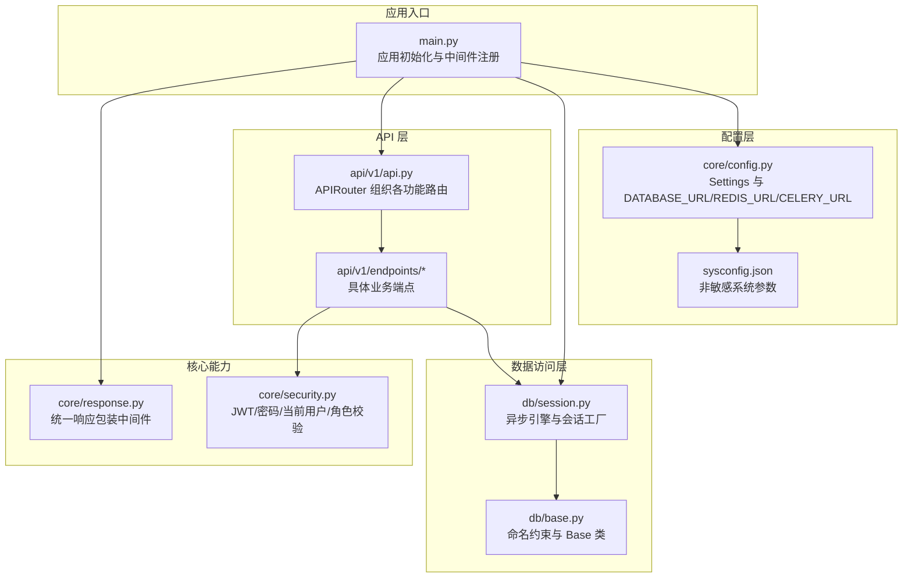
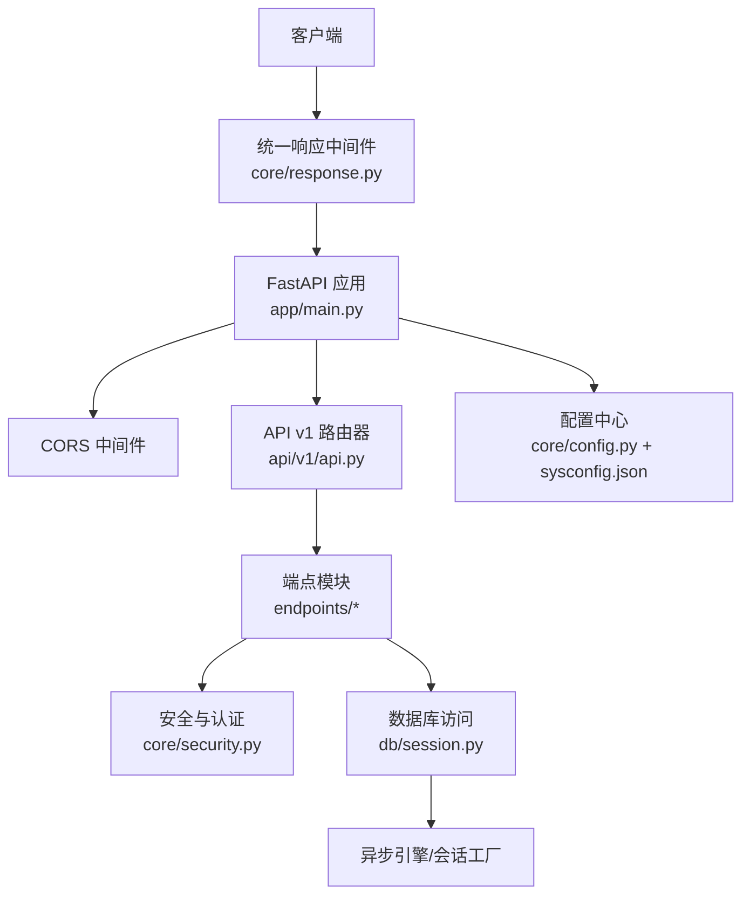
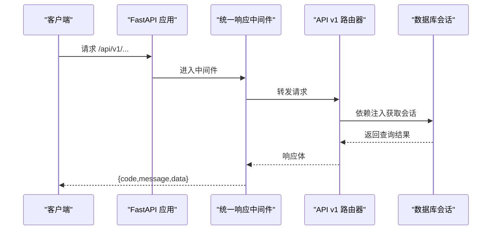
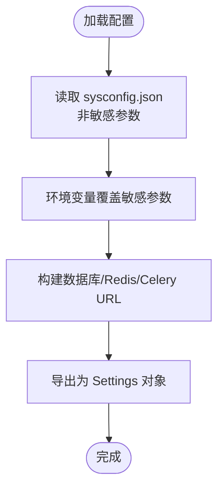
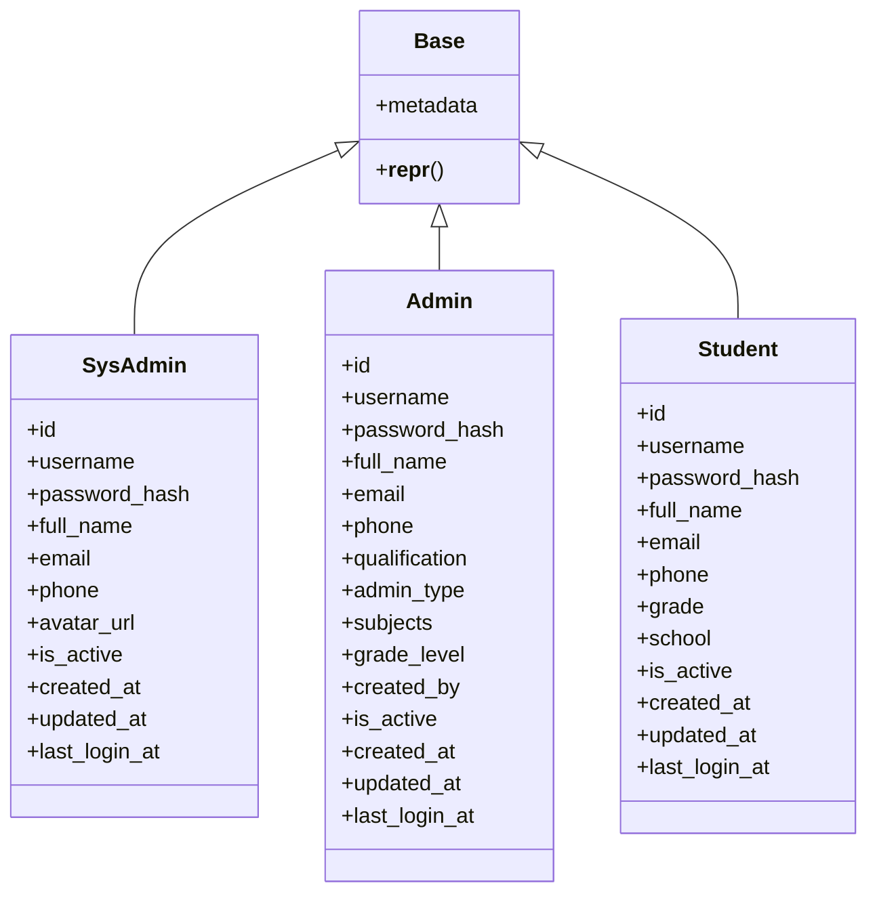
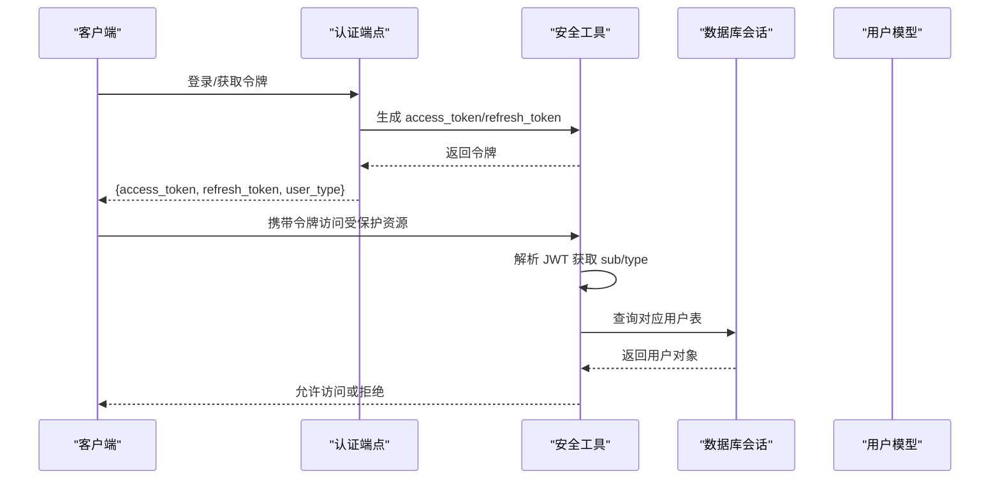
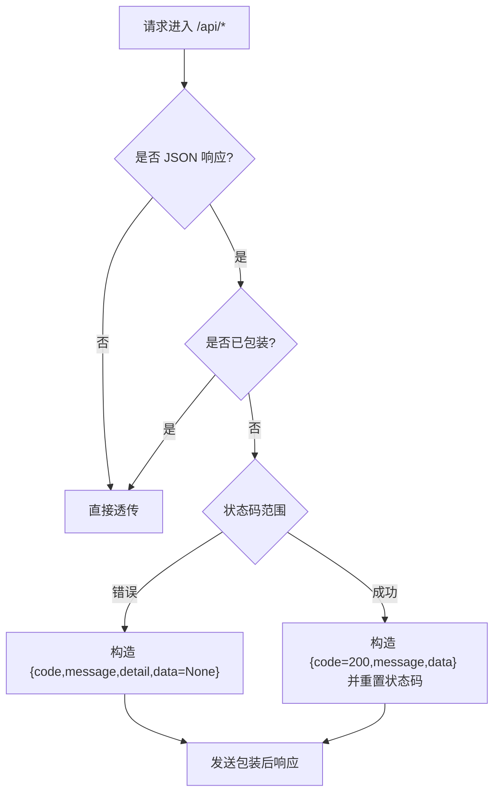
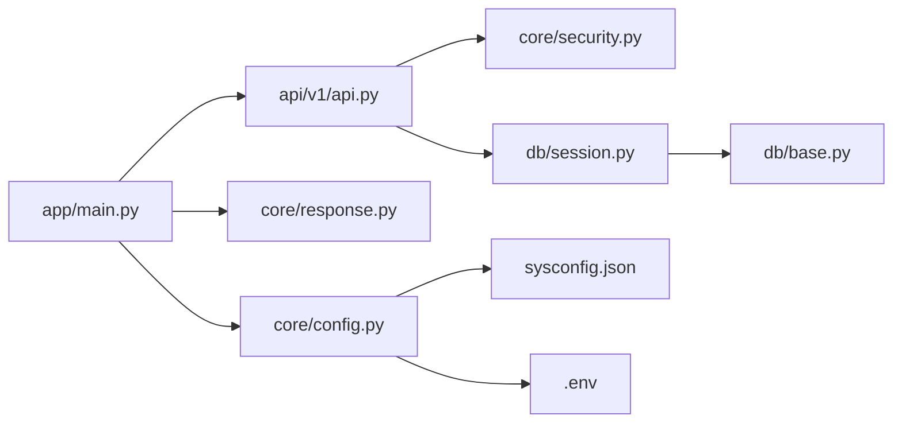

# 后端系统架构

<cite>
**本文档引用的文件**
- [backend/app/main.py](file://backend/app/main.py)
- [backend/app/core/config.py](file://backend/app/core/config.py)
- [backend/app/core/security.py](file://backend/app/core/security.py)
- [backend/app/core/response.py](file://backend/app/core/response.py)
- [backend/app/db/session.py](file://backend/app/db/session.py)
- [backend/app/db/base.py](file://backend/app/db/base.py)
- [backend/app/api/v1/api.py](file://backend/app/api/v1/api.py)
- [backend/app/api/v1/endpoints/auth_v2.py](file://backend/app/api/v1/endpoints/auth_v2.py)
- [backend/app/models/student.py](file://backend/app/models/student.py)
- [backend/app/models/admin.py](file://backend/app/models/admin.py)
- [backend/app/models/sys_admin.py](file://backend/app/models/sys_admin.py)
- [backend/sysconfig.json](file://backend/sysconfig.json)
- [backend/requirements.txt](file://backend/requirements.txt)
- [backend/Dockerfile](file://backend/Dockerfile)
</cite>

## 目录
1. [简介](#简介)
2. [项目结构](#项目结构)
3. [核心组件](#核心组件)
4. [架构总览](#架构总览)
5. [详细组件分析](#详细组件分析)
6. [依赖分析](#依赖分析)
7. [性能考虑](#性能考虑)
8. [故障排查指南](#故障排查指南)
9. [结论](#结论)
10. [附录](#附录)

## 简介
本文件为瑞珹教育管理系统后端的全面架构文档，围绕基于 FastAPI 的服务端进行系统化梳理。重点覆盖应用结构与模块化组织、中间件与响应包装机制、依赖注入与数据库连接池、安全认证（JWT）与用户角色体系、API 路由组织与跨域配置、配置管理与环境变量策略，并结合实际代码路径给出架构决策的技术考量、性能优化策略与可扩展性设计。

## 项目结构
后端采用分层与功能模块化相结合的组织方式：
- 应用入口与中间件：在应用入口集中注册统一响应包装中间件、CORS 中间件与 API 路由。
- 配置层：集中管理项目名、版本、数据库、Redis、Celery、上传目录、OCR、模型缓存等配置。
- 数据访问层：使用 SQLAlchemy 2.x 异步引擎与会话工厂，提供依赖注入式数据库会话。
- 模型层：基于 Declarative Base 定义实体表结构，支持多角色用户模型。
- API 层：按版本与功能划分路由，统一挂载到 API v1 前缀下。
- 核心安全与响应：提供 JWT 工具、当前用户解析器、角色校验装饰器与统一响应包装中间件。

图表来源
- [backend/app/main.py:11-31](file://backend/app/main.py#L11-L31)
- [backend/app/api/v1/api.py:1-26](file://backend/app/api/v1/api.py#L1-L26)
- [backend/app/core/config.py:36-98](file://backend/app/core/config.py#L36-L98)
- [backend/app/db/session.py:1-26](file://backend/app/db/session.py#L1-L26)
- [backend/app/db/base.py:17-21](file://backend/app/db/base.py#L17-L21)
- [backend/app/core/security.py:53-104](file://backend/app/core/security.py#L53-L104)
- [backend/app/core/response.py:14-124](file://backend/app/core/response.py#L14-L124)

章节来源
- [backend/app/main.py:11-52](file://backend/app/main.py#L11-L52)
- [backend/app/api/v1/api.py:1-26](file://backend/app/api/v1/api.py#L1-L26)
- [backend/app/core/config.py:36-98](file://backend/app/core/config.py#L36-L98)
- [backend/app/db/session.py:1-26](file://backend/app/db/session.py#L1-L26)
- [backend/app/db/base.py:17-21](file://backend/app/db/base.py#L17-L21)
- [backend/app/core/security.py:53-104](file://backend/app/core/security.py#L53-L104)
- [backend/app/core/response.py:14-124](file://backend/app/core/response.py#L14-L124)

## 核心组件
- 应用入口与中间件
  - 初始化 FastAPI 实例，设置标题、版本与 OpenAPI 路径。
  - 注册统一响应包装中间件，确保所有 /api/* 响应被包裹为 {code,message,data} 结构。
  - 注册 CORS 中间件，默认允许任意来源、方法与头，生产环境建议限定来源。
  - 包含 API v1 路由器，前缀为 /api/v1。
  - 启动事件中执行参考数据播种。
- 配置管理
  - Settings 使用 Pydantic Settings，从 sysconfig.json 加载非敏感配置并支持环境变量覆盖敏感项。
  - 提供 DATABASE_URL/ASYNC_DATABASE_URL、REDIS_URL、Celery Broker/Result Backend、上传目录、OCR、模型缓存等配置。
  - 支持 .env 文件加载。
- 数据库连接池与依赖注入
  - 使用 SQLAlchemy 2.x 异步引擎与会话工厂，提供 get_db 依赖注入，自动回滚与关闭会话。
  - Base 类定义命名约束，统一外键、唯一、检查约束命名风格。
- 安全认证与角色体系
  - 密码哈希与校验使用 bcrypt；JWT 使用 HS256 算法。
  - 当前用户解析器支持 SYS_ADMIN/QUESTION_ADMIN/TEACHER/STUDENT 四类用户，从 token 中提取用户类型并校验对应表存在性。
  - 角色装饰器 require_role 用于接口级权限控制。
- API 路由组织与响应包装
  - API v1 路由器按功能模块 include 各端点，统一前缀与标签。
  - ApiResponseMiddleware 以 ASGI 中间件形式拦截 /api/* 请求，自动包装响应体，避免重复包装与流式响应问题。

章节来源
- [backend/app/main.py:11-52](file://backend/app/main.py#L11-L52)
- [backend/app/core/config.py:36-98](file://backend/app/core/config.py#L36-L98)
- [backend/app/db/session.py:1-26](file://backend/app/db/session.py#L1-L26)
- [backend/app/db/base.py:17-21](file://backend/app/db/base.py#L17-L21)
- [backend/app/core/security.py:53-104](file://backend/app/core/security.py#L53-L104)
- [backend/app/core/response.py:14-124](file://backend/app/core/response.py#L14-L124)
- [backend/app/api/v1/api.py:1-26](file://backend/app/api/v1/api.py#L1-L26)

## 架构总览
系统采用“入口应用 + 配置中心 + 数据访问 + 安全与响应 + API 路由”的分层架构，核心特性如下：
- 异步数据库访问：基于 SQLAlchemy 2.x 异步引擎，提升并发吞吐。
- 统一响应格式：中间件自动包装，简化前端处理。
- 多角色认证：JWT 承载用户类型，动态查询对应用户表。
- 模块化路由：按功能拆分端点，便于维护与扩展。
- 可观测性：启动事件中执行参考数据播种，便于系统初始化。

图表来源
- [backend/app/main.py:11-31](file://backend/app/main.py#L11-L31)
- [backend/app/core/response.py:14-124](file://backend/app/core/response.py#L14-L124)
- [backend/app/api/v1/api.py:1-26](file://backend/app/api/v1/api.py#L1-L26)
- [backend/app/core/security.py:53-104](file://backend/app/core/security.py#L53-L104)
- [backend/app/db/session.py:1-26](file://backend/app/db/session.py#L1-L26)
- [backend/app/core/config.py:36-98](file://backend/app/core/config.py#L36-L98)

## 详细组件分析

### 应用入口与中间件
- 初始化 FastAPI 实例，设置标题、版本与 OpenAPI 路径。
- 注册统一响应包装中间件，仅对 /api/* 路径生效，避免非 API 路由被包装。
- 注册 CORS 中间件，生产环境建议限制 allow_origins。
- include_router 将 API v1 路由挂载到 /api/v1 前缀。
- startup 事件中通过异步会话执行参考数据播种，异常时记录警告并跳过。

图表来源
- [backend/app/main.py:11-31](file://backend/app/main.py#L11-L31)
- [backend/app/core/response.py:14-124](file://backend/app/core/response.py#L14-L124)
- [backend/app/api/v1/api.py:1-26](file://backend/app/api/v1/api.py#L1-L26)
- [backend/app/db/session.py:18-26](file://backend/app/db/session.py#L18-L26)

章节来源
- [backend/app/main.py:11-52](file://backend/app/main.py#L11-L52)
- [backend/app/core/response.py:14-124](file://backend/app/core/response.py#L14-L124)

### 配置管理系统
- Settings 从 sysconfig.json 读取数据库连接参数，同时支持环境变量覆盖敏感字段（如数据库密码、密钥）。
- 提供 DATABASE_URL/ASYNC_DATABASE_URL、REDIS_URL、Celery Broker/Result Backend、上传目录、OCR、模型缓存目录等配置属性。
- 支持 .env 文件加载，遵循 Pydantic Settings 的加载顺序与覆盖规则。

图表来源
- [backend/app/core/config.py:6-31](file://backend/app/core/config.py#L6-L31)
- [backend/app/core/config.py:36-98](file://backend/app/core/config.py#L36-L98)
- [backend/sysconfig.json:1-48](file://backend/sysconfig.json#L1-L48)

章节来源
- [backend/app/core/config.py:36-98](file://backend/app/core/config.py#L36-L98)
- [backend/sysconfig.json:1-48](file://backend/sysconfig.json#L1-L48)

### 数据库连接池与 ORM 模型设计
- 异步引擎与会话工厂
  - 使用 asyncpg 创建异步引擎，future=True，echo=False。
  - 会话工厂设置 expire_on_commit=False，配合依赖注入函数提供异步会话。
  - 依赖注入函数在异常时自动回滚并抛出，finally 中关闭会话。
- ORM 基类与命名约定
  - Base 类使用命名约定，统一外键、唯一、检查、主键约束命名，便于迁移与维护。
- 用户模型
  - SysAdmin：系统管理员，内置不可删除。
  - Admin：教师/题库管理员等，包含 admin_type、subjects、grade_level 等字段。
  - Student：学生用户，支持自注册与登录。

图表来源
- [backend/app/db/base.py:17-21](file://backend/app/db/base.py#L17-L21)
- [backend/app/models/sys_admin.py:8-22](file://backend/app/models/sys_admin.py#L8-L22)
- [backend/app/models/admin.py:9-27](file://backend/app/models/admin.py#L9-L27)
- [backend/app/models/student.py:8-23](file://backend/app/models/student.py#L8-L23)

章节来源
- [backend/app/db/session.py:1-26](file://backend/app/db/session.py#L1-L26)
- [backend/app/db/base.py:17-21](file://backend/app/db/base.py#L17-L21)
- [backend/app/models/sys_admin.py:8-22](file://backend/app/models/sys_admin.py#L8-L22)
- [backend/app/models/admin.py:9-27](file://backend/app/models/admin.py#L9-L27)
- [backend/app/models/student.py:8-23](file://backend/app/models/student.py#L8-L23)

### 安全认证机制（JWT）
- 密码处理：bcrypt 哈希与校验。
- JWT 生成与解码：HS256 算法，支持 access_token 与 refresh_token，过期时间可配置。
- 当前用户解析：OAuth2PasswordBearer，从 token 中提取用户 id 与 type，动态查询对应用户表，不存在则抛出 401。
- 角色校验：require_role 装饰器，未授权返回 403。

图表来源
- [backend/app/core/security.py:24-47](file://backend/app/core/security.py#L24-L47)
- [backend/app/core/security.py:64-95](file://backend/app/core/security.py#L64-L95)
- [backend/app/core/security.py:98-103](file://backend/app/core/security.py#L98-L103)
- [backend/app/api/v1/endpoints/auth_v2.py:149-183](file://backend/app/api/v1/endpoints/auth_v2.py#L149-L183)

章节来源
- [backend/app/core/security.py:24-47](file://backend/app/core/security.py#L24-L47)
- [backend/app/core/security.py:64-95](file://backend/app/core/security.py#L64-L95)
- [backend/app/core/security.py:98-103](file://backend/app/core/security.py#L98-L103)
- [backend/app/api/v1/endpoints/auth_v2.py:149-183](file://backend/app/api/v1/endpoints/auth_v2.py#L149-L183)

### API 路由组织与响应包装
- 路由组织：API v1 路由器按功能模块 include 各端点，统一前缀与标签，便于 OpenAPI 文档生成与维护。
- 响应包装：ApiResponseMiddleware 以 ASGI 形式拦截 /api/* 请求，自动包装响应体为 {code,message,data}，错误状态码映射 message，避免重复包装与流式响应问题。

图表来源
- [backend/app/core/response.py:20-101](file://backend/app/core/response.py#L20-L101)

章节来源
- [backend/app/api/v1/api.py:1-26](file://backend/app/api/v1/api.py#L1-L26)
- [backend/app/core/response.py:14-124](file://backend/app/core/response.py#L14-L124)

### CORS 配置
- 在应用入口注册 CORSMiddleware，默认允许任意来源、凭证、方法与头。
- 生产环境建议将 allow_origins 限定为可信域名列表，避免安全风险。

章节来源
- [backend/app/main.py:20-27](file://backend/app/main.py#L20-L27)

## 依赖分析
- 外部依赖
  - Web 框架与服务器：FastAPI + Uvicorn
  - 数据库与迁移：SQLAlchemy 2.x + asyncpg + Alembic
  - 安全与加密：python-jose + passlib[bcrypt]
  - 缓存与任务队列：Redis + Celery
  - OCR 与文档导出：pytesseract + Pillow + python-docx/fpdf2
  - 测试：pytest + httpx
- 内部模块耦合
  - main.py 依赖 core/config、core/response、api/v1/api。
  - api 路由依赖 core/security 与 db/session。
  - models 依赖 db/base。
  - config 依赖 sysconfig.json 与 .env。

图表来源
- [backend/app/main.py:1-31](file://backend/app/main.py#L1-L31)
- [backend/app/api/v1/api.py:1-26](file://backend/app/api/v1/api.py#L1-L26)
- [backend/app/core/config.py:36-98](file://backend/app/core/config.py#L36-L98)
- [backend/app/db/session.py:1-26](file://backend/app/db/session.py#L1-L26)
- [backend/app/db/base.py:17-21](file://backend/app/db/base.py#L17-L21)
- [backend/app/core/security.py:53-104](file://backend/app/core/security.py#L53-L104)

章节来源
- [backend/requirements.txt:1-27](file://backend/requirements.txt#L1-L27)
- [backend/app/main.py:1-31](file://backend/app/main.py#L1-L31)
- [backend/app/api/v1/api.py:1-26](file://backend/app/api/v1/api.py#L1-L26)
- [backend/app/core/config.py:36-98](file://backend/app/core/config.py#L36-L98)
- [backend/app/db/session.py:1-26](file://backend/app/db/session.py#L1-L26)
- [backend/app/db/base.py:17-21](file://backend/app/db/base.py#L17-L21)
- [backend/app/core/security.py:53-104](file://backend/app/core/security.py#L53-L104)

## 性能考虑
- 异步数据库访问：使用 SQLAlchemy 2.x 异步引擎，减少阻塞，提升高并发场景下的吞吐量。
- 依赖注入与会话复用：通过依赖注入提供会话，避免重复创建与销毁开销；expire_on_commit=False 减少 ORM 状态刷新成本。
- 中间件响应包装：采用 ASGI 中间件直接拼装 JSON，避免重复序列化与流式响应带来的内存压力。
- CORS 默认宽松策略：生产环境需收紧 allow_origins，降低跨域攻击面与不必要的预检请求。
- 缓存与任务队列：Redis 与 Celery 用于异步任务与缓存，建议合理设置过期与队列分区，避免阻塞主流程。
- OCR 与导出：OCR 与文档导出为 CPU/IO 密集型任务，建议通过 Celery 分发至工作进程，避免阻塞 API 主循环。

## 故障排查指南
- 健康检查
  - 根路径与 /health 接口用于快速判断服务可用性。
- 认证失败
  - 检查 JWT 解码是否成功、用户是否存在且激活、角色是否匹配。
- 数据库连接
  - 确认 DATABASE_URL/ASYNC_DATABASE_URL 正确，网络可达，PostgreSQL 服务正常。
- 响应格式异常
  - 确认请求路径以 /api/ 开头，中间件未对非 API 路由生效；检查响应体是否已包装。
- CORS 问题
  - 生产环境需限制 allow_origins，确认预检请求与凭据设置正确。
- 启动播种失败
  - 查看日志中的警告信息，确认参考数据播种脚本与数据库权限。

章节来源
- [backend/app/main.py:45-52](file://backend/app/main.py#L45-L52)
- [backend/app/core/security.py:64-95](file://backend/app/core/security.py#L64-L95)
- [backend/app/db/session.py:18-26](file://backend/app/db/session.py#L18-L26)
- [backend/app/core/response.py:14-124](file://backend/app/core/response.py#L14-L124)

## 结论
本架构以 FastAPI 为核心，结合 SQLAlchemy 异步 ORM、Pydantic 配置体系与 JWT 多角色认证，实现了清晰的分层与模块化组织。统一响应包装中间件与 CORS 配置提升了开发体验与安全性。通过依赖注入与异步数据库访问，系统具备良好的并发性能与可扩展性。建议在生产环境中收紧 CORS 策略、完善监控与日志、优化 OCR 与导出任务的异步化处理，持续迭代以满足业务增长需求。

## 附录
- 部署与运行
  - 使用 Dockerfile 构建镜像，CMD 启动 Uvicorn 服务。
- 系统边界与组件交互
  - 客户端 → 统一响应中间件 → FastAPI 应用 → API 路由 → 端点 → 安全与认证 → 数据库会话 → 异步引擎。
- 数据流向
  - 请求进入 → 中间件包装 → 路由分发 → 依赖注入获取会话 → ORM 查询 → 返回响应 → 中间件统一包装 → 客户端接收。

章节来源
- [backend/Dockerfile:1-11](file://backend/Dockerfile#L1-L11)
- [backend/app/main.py:11-31](file://backend/app/main.py#L11-L31)
- [backend/app/core/response.py:14-124](file://backend/app/core/response.py#L14-L124)
- [backend/app/api/v1/api.py:1-26](file://backend/app/api/v1/api.py#L1-L26)
- [backend/app/core/security.py:53-104](file://backend/app/core/security.py#L53-L104)
- [backend/app/db/session.py:1-26](file://backend/app/db/session.py#L1-L26)