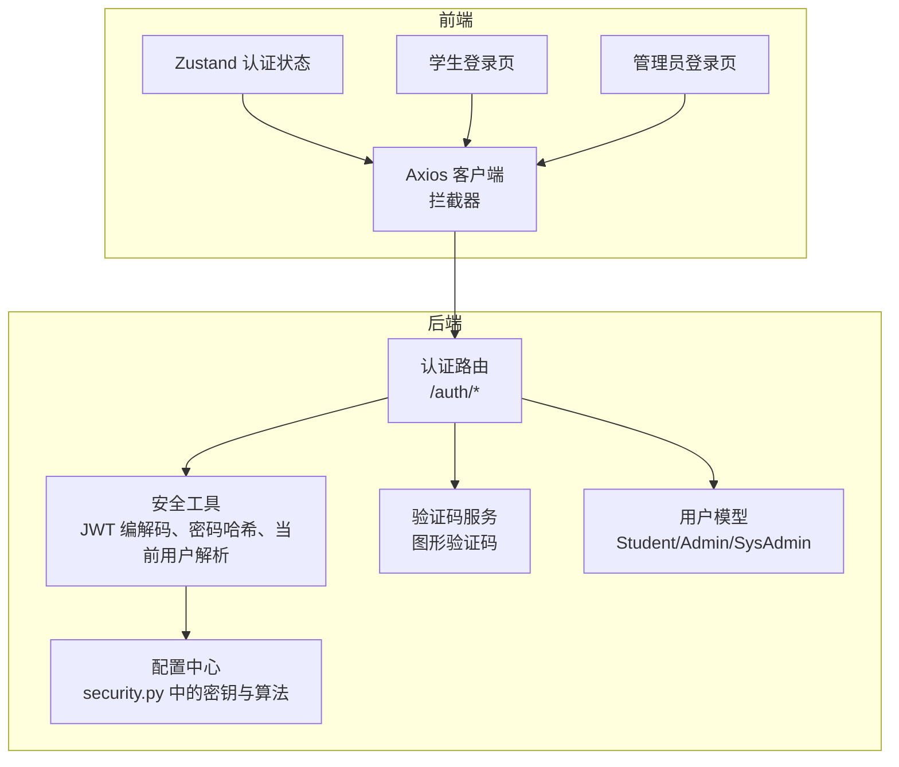
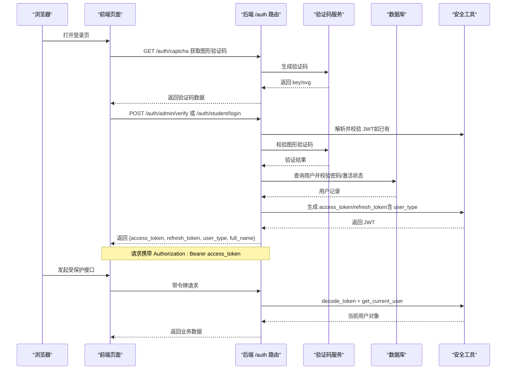
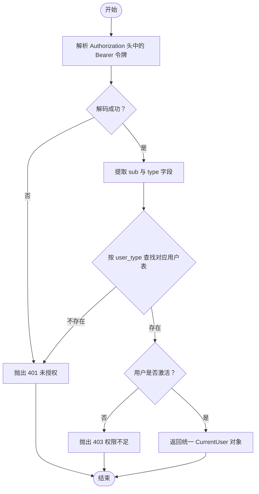
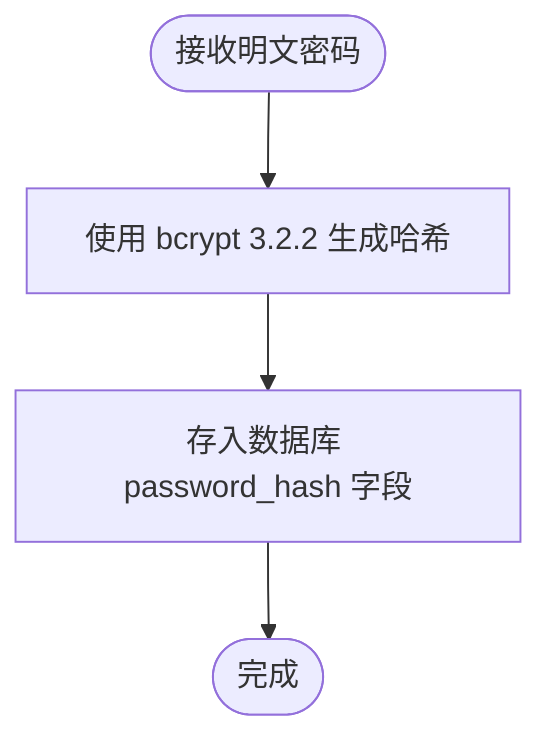
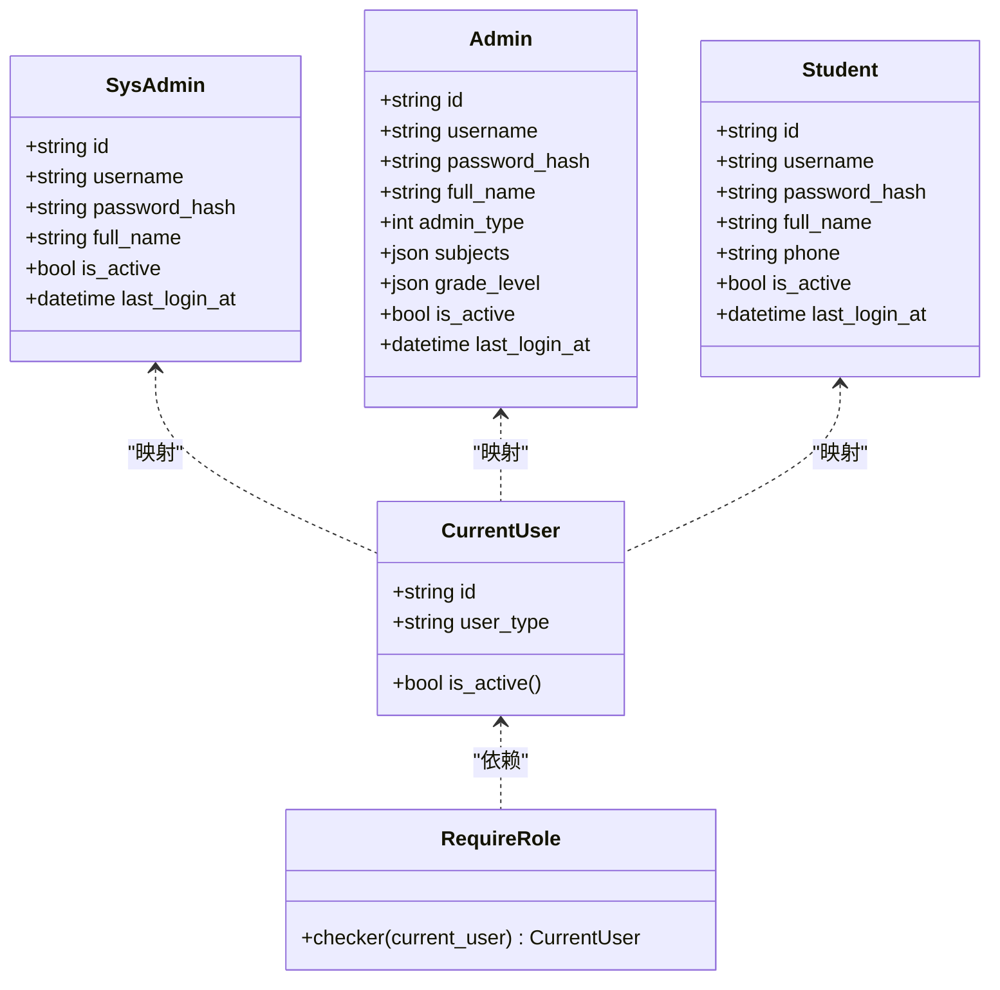
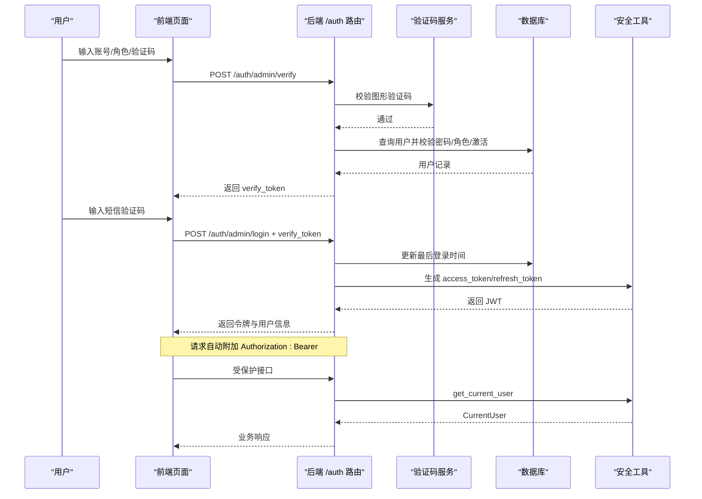
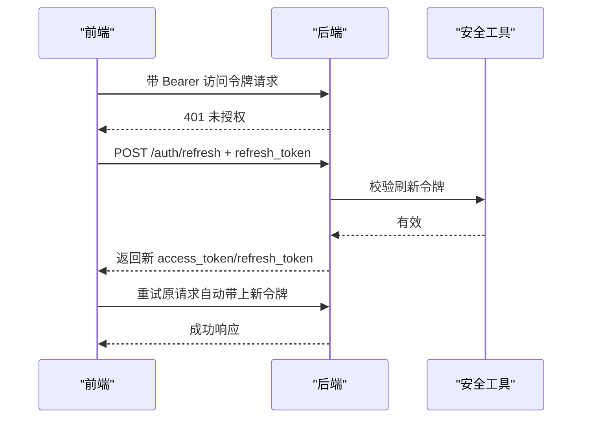
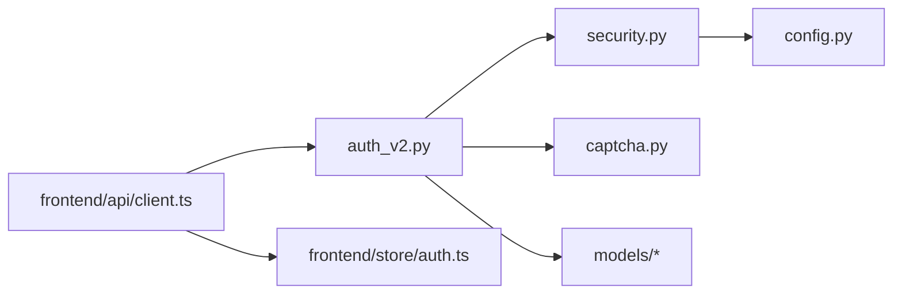

# 安全认证机制

<cite>
**本文引用的文件**
- [backend/app/core/security.py](file://backend/app/core/security.py)
- [backend/app/api/v1/endpoints/auth_v2.py](file://backend/app/api/v1/endpoints/auth_v2.py)
- [backend/app/core/config.py](file://backend/app/core/config.py)
- [backend/app/models/student.py](file://backend/app/models/student.py)
- [backend/app/models/admin.py](file://backend/app/models/admin.py)
- [backend/app/models/sys_admin.py](file://backend/app/models/sys_admin.py)
- [backend/app/models/role.py](file://backend/app/models/role.py)
- [backend/app/services/captcha.py](file://backend/app/services/captcha.py)
- [backend/requirements.txt](file://backend/requirements.txt)
- [frontend/src/store/auth.ts](file://frontend/src/store/auth.ts)
- [frontend/src/pages/auth/LoginPage.tsx](file://frontend/src/pages/auth/LoginPage.tsx)
- [frontend/src/pages/auth/AdminLoginPage.tsx](file://frontend/src/pages/auth/AdminLoginPage.tsx)
- [frontend/src/api/client.ts](file://frontend/src/api/client.ts)
</cite>

## 更新摘要
**变更内容**
- 新增bcrypt版本兼容性说明，反映从4.3.0降级到3.2.2的安全兼容性修复
- 更新密码加密存储机制章节，强调bcrypt版本降级对passlib兼容性的影响
- 补充依赖版本管理的最佳实践建议

## 目录
1. [简介](#简介)
2. [项目结构](#项目结构)
3. [核心组件](#核心组件)
4. [架构总览](#架构总览)
5. [详细组件分析](#详细组件分析)
6. [依赖分析](#依赖分析)
7. [性能考虑](#性能考虑)
8. [故障排查指南](#故障排查指南)
9. [结论](#结论)
10. [附录](#附录)

## 简介
本文件系统性梳理瑞珹教育管理系统的安全认证机制，覆盖以下关键主题：
- JWT 令牌生成与验证流程
- 密码加密存储机制（含bcrypt版本兼容性修复）
- 多角色认证体系（学生、教师、题库管理员、系统管理员）
- 登录流程、令牌刷新机制与会话管理策略
- 安全漏洞防护措施（CSRF 与 XSS 防范建议）
- 认证流程图、安全配置示例与最佳实践指南

## 项目结构
后端采用 FastAPI + SQLAlchemy 异步 ORM 架构，认证相关代码集中在核心模块与 API 层；前端使用 React + Zustand 管理认证状态，并通过 Axios 拦截器自动处理访问令牌与刷新逻辑。

**图表来源**
- [backend/app/core/security.py:1-110](file://backend/app/core/security.py#L1-L110)
- [backend/app/api/v1/endpoints/auth_v2.py:1-547](file://backend/app/api/v1/endpoints/auth_v2.py#L1-L547)
- [backend/app/core/config.py:1-98](file://backend/app/core/config.py#L1-L98)
- [backend/app/services/captcha.py:1-40](file://backend/app/services/captcha.py#L1-L40)
- [frontend/src/api/client.ts:1-55](file://frontend/src/api/client.ts#L1-L55)
- [frontend/src/store/auth.ts:1-96](file://frontend/src/store/auth.ts#L1-L96)

**章节来源**
- [backend/app/core/security.py:1-110](file://backend/app/core/security.py#L1-L110)
- [backend/app/api/v1/endpoints/auth_v2.py:1-547](file://backend/app/api/v1/endpoints/auth_v2.py#L1-L547)
- [backend/app/core/config.py:1-98](file://backend/app/core/config.py#L1-L98)
- [backend/app/services/captcha.py:1-40](file://backend/app/services/captcha.py#L1-L40)
- [frontend/src/api/client.ts:1-55](file://frontend/src/api/client.ts#L1-L55)
- [frontend/src/store/auth.ts:1-96](file://frontend/src/store/auth.ts#L1-L96)

## 核心组件
- 安全配置与密钥管理：集中于配置类，定义签名密钥、算法、JWT 过期时间等。
- JWT 工具：提供密码哈希、JWT 编码/解码、OAuth2 Bearer 提供者、统一当前用户对象与角色校验装饰器。
- 认证路由：实现图形验证码、管理员分步验证与登录、学生登录/注册、个人资料读写、管理员账户管理等。
- 用户模型：学生、教师/题库管理员、系统管理员三类用户表，含活跃状态与最后登录时间字段。
- 前端状态与拦截器：本地持久化令牌、请求头注入、401 自动刷新与登出。

**章节来源**
- [backend/app/core/config.py:36-98](file://backend/app/core/config.py#L36-L98)
- [backend/app/core/security.py:13-110](file://backend/app/core/security.py#L13-L110)
- [backend/app/api/v1/endpoints/auth_v2.py:23-547](file://backend/app/api/v1/endpoints/auth_v2.py#L23-L547)
- [backend/app/models/student.py:8-25](file://backend/app/models/student.py#L8-L25)
- [backend/app/models/admin.py:9-27](file://backend/app/models/admin.py#L9-L27)
- [backend/app/models/sys_admin.py:8-22](file://backend/app/models/sys_admin.py#L8-L22)
- [frontend/src/store/auth.ts:1-96](file://frontend/src/store/auth.ts#L1-L96)
- [frontend/src/api/client.ts:1-55](file://frontend/src/api/client.ts#L1-L55)

## 架构总览
下图展示从浏览器到后端的认证交互路径，涵盖图形验证码、管理员分步验证、学生登录/注册以及令牌刷新。

**图表来源**
- [backend/app/api/v1/endpoints/auth_v2.py:75-237](file://backend/app/api/v1/endpoints/auth_v2.py#L75-L237)
- [backend/app/services/captcha.py:12-40](file://backend/app/services/captcha.py#L12-L40)
- [backend/app/core/security.py:43-101](file://backend/app/core/security.py#L43-L101)
- [frontend/src/pages/auth/AdminLoginPage.tsx:36-84](file://frontend/src/pages/auth/AdminLoginPage.tsx#L36-L84)
- [frontend/src/pages/auth/LoginPage.tsx:55-113](file://frontend/src/pages/auth/LoginPage.tsx#L55-L113)

## 详细组件分析

### JWT 令牌生成与验证流程
- 令牌生成
  - 访问令牌：包含用户标识与类型，使用配置中的密钥与算法进行编码，过期时间由配置控制。
  - 刷新令牌：独立过期时间更长，用于在访问令牌过期时换取新的访问令牌。
- 令牌验证
  - 使用 OAuth2PasswordBearer 提供 Bearer 令牌解析。
  - 解码阶段捕获异常并返回空载荷，随后根据载荷中的用户标识与类型查询对应用户表，确保用户存在且处于激活状态。
- 统一当前用户
  - 将用户 ID 与类型封装为统一对象，便于后续权限校验与业务调用。

**图表来源**
- [backend/app/core/security.py:64-101](file://backend/app/core/security.py#L64-L101)
- [backend/app/core/security.py:50-50](file://backend/app/core/security.py#L50-L50)

**章节来源**
- [backend/app/core/security.py:24-47](file://backend/app/core/security.py#L24-L47)
- [backend/app/core/security.py:64-101](file://backend/app/core/security.py#L64-L101)
- [backend/app/core/config.py:42-46](file://backend/app/core/config.py#L42-L46)

### 密码加密存储机制
- 使用 bcrypt 上下文对明文密码进行哈希存储，验证时使用相同上下文比对。
- **更新**：为确保与 passlib 兼容性，bcrypt 版本已降级至 3.2.2，消除版本读取警告并保证密码哈希功能的稳定性。
- 学生注册支持"短信登录"模式（无密码），但管理员账户必须设置强口令并通过哈希保存。

**图表来源**
- [backend/app/core/security.py:16-21](file://backend/app/core/security.py#L16-L21)
- [backend/app/models/admin.py:14](file://backend/app/models/admin.py#L14)
- [backend/app/models/student.py:13](file://backend/app/models/student.py#L13)
- [backend/requirements.txt:12](file://backend/requirements.txt#L12)

**章节来源**
- [backend/app/core/security.py:13-21](file://backend/app/core/security.py#L13-L21)
- [backend/app/models/admin.py:14](file://backend/app/models/admin.py#L14)
- [backend/app/models/student.py:13](file://backend/app/models/student.py#L13)
- [backend/requirements.txt:12](file://backend/requirements.txt#L12)

### 多角色认证体系设计与实现
- 角色定义
  - 学生：STUDENT
  - 教师：TEACHER
  - 题库管理员：QUESTION_ADMIN
  - 系统管理员：SYS_ADMIN
- 令牌载荷扩展
  - 在访问令牌中加入 user_type 字段，便于后端统一解析与权限校验。
- 角色校验装饰器
  - require_role 可限制特定接口仅允许指定角色访问，未满足条件返回 403。
- 用户表分离
  - 不同角色对应不同用户表，登录时按角色查询对应表并校验激活状态。

**图表来源**
- [backend/app/core/security.py:53-110](file://backend/app/core/security.py#L53-L110)
- [backend/app/models/sys_admin.py:8-22](file://backend/app/models/sys_admin.py#L8-L22)
- [backend/app/models/admin.py:9-27](file://backend/app/models/admin.py#L9-L27)
- [backend/app/models/student.py:8-25](file://backend/app/models/student.py#L8-L25)

**章节来源**
- [backend/app/core/security.py:53-110](file://backend/app/core/security.py#L53-L110)
- [backend/app/models/sys_admin.py:8-22](file://backend/app/models/sys_admin.py#L8-L22)
- [backend/app/models/admin.py:9-27](file://backend/app/models/admin.py#L9-L27)
- [backend/app/models/student.py:8-25](file://backend/app/models/student.py#L8-L25)

### 登录流程与会话管理
- 学生登录/注册
  - 图形验证码校验通过后，学生可凭短信验证码登录或注册（自动生成用户名）。
  - 登录成功后下发访问令牌与刷新令牌，并持久化到本地存储。
- 管理员登录（分步）
  - 第一步：输入用户名/密码/角色，图形验证码校验通过后，系统生成一次性验证令牌并返回给前端。
  - 第二步：前端携带一次性验证令牌与短信验证码发起登录请求，后端校验通过后下发正式令牌。
- 会话管理
  - 前端通过 Axios 拦截器自动在请求头添加 Bearer 令牌。
  - 当收到 401 时，尝试使用刷新令牌换取新访问令牌；若刷新失败则清空本地令牌并跳转登录页。

**图表来源**
- [backend/app/api/v1/endpoints/auth_v2.py:91-183](file://backend/app/api/v1/endpoints/auth_v2.py#L91-L183)
- [backend/app/services/captcha.py:12-40](file://backend/app/services/captcha.py#L12-L40)
- [frontend/src/pages/auth/AdminLoginPage.tsx:36-84](file://frontend/src/pages/auth/AdminLoginPage.tsx#L36-L84)

**章节来源**
- [backend/app/api/v1/endpoints/auth_v2.py:91-183](file://backend/app/api/v1/endpoints/auth_v2.py#L91-L183)
- [frontend/src/pages/auth/AdminLoginPage.tsx:36-84](file://frontend/src/pages/auth/AdminLoginPage.tsx#L36-L84)
- [frontend/src/pages/auth/LoginPage.tsx:55-113](file://frontend/src/pages/auth/LoginPage.tsx#L55-L113)
- [frontend/src/api/client.ts:9-52](file://frontend/src/api/client.ts#L9-L52)
- [frontend/src/store/auth.ts:47-95](file://frontend/src/store/auth.ts#L47-L95)

### 令牌刷新机制
- 前端拦截器在收到 401 时，携带刷新令牌向后端发起刷新请求。
- 后端校验刷新令牌有效性并返回新的访问令牌与刷新令牌，前端替换本地存储并重试原请求。
- 若刷新失败，清除本地令牌并跳转登录页。

**图表来源**
- [frontend/src/api/client.ts:17-52](file://frontend/src/api/client.ts#L17-L52)
- [backend/app/core/security.py:37-40](file://backend/app/core/security.py#L37-L40)

**章节来源**
- [frontend/src/api/client.ts:17-52](file://frontend/src/api/client.ts#L17-L52)
- [backend/app/core/security.py:37-40](file://backend/app/core/security.py#L37-L40)

### 安全配置示例
- 关键配置项
  - SECRET_KEY：JWT 签名密钥（生产环境务必随机且保密）
  - ALGORITHM：签名算法（建议 HS256）
  - ACCESS_TOKEN_EXPIRE_MINUTES：访问令牌有效期
  - REFRESH_TOKEN_EXPIRE_DAYS：刷新令牌有效期
- 数据库与缓存
  - 数据库连接字符串与异步驱动
  - Redis 地址与端口（用于任务队列与缓存）

**章节来源**
- [backend/app/core/config.py:42-76](file://backend/app/core/config.py#L42-L76)

### CSRF 与 XSS 防护建议
- CSRF
  - 后端未显式启用 CSRF 中间件，建议在网关或反向代理层增加 CSRF 校验，或在前端对敏感操作增加二次确认与 SameSite Cookie 设置。
- XSS
  - 建议对所有用户输入进行严格的白名单过滤与输出编码；前端渲染富文本时避免 innerHTML，使用安全的渲染库。
  - 后端响应中避免直接拼接用户可控内容到 HTML。

[本节为通用安全建议，不直接分析具体文件，故无章节来源]

## 依赖分析
- 组件耦合
  - 认证路由依赖安全工具与验证码服务；安全工具依赖配置与数据库会话；前端拦截器依赖本地存储。
- 外部依赖
  - JWT 编解码、密码哈希、HTTP 异常与 OAuth2 Bearer 提供者来自第三方库。
- 角色与权限
  - require_role 装饰器通过 get_current_user 获取当前用户类型，实现基于角色的访问控制。

**图表来源**
- [backend/app/api/v1/endpoints/auth_v2.py:13-17](file://backend/app/api/v1/endpoints/auth_v2.py#L13-L17)
- [backend/app/core/security.py:10-11](file://backend/app/core/security.py#L10-L11)
- [backend/app/core/config.py:43-46](file://backend/app/core/config.py#L43-L46)
- [frontend/src/api/client.ts:1-7](file://frontend/src/api/client.ts#L1-L7)
- [frontend/src/store/auth.ts:3-14](file://frontend/src/store/auth.ts#L3-L14)

**章节来源**
- [backend/app/api/v1/endpoints/auth_v2.py:13-17](file://backend/app/api/v1/endpoints/auth_v2.py#L13-L17)
- [backend/app/core/security.py:10-11](file://backend/app/core/security.py#L10-L11)
- [backend/app/core/config.py:43-46](file://backend/app/core/config.py#L43-L46)
- [frontend/src/api/client.ts:1-7](file://frontend/src/api/client.ts#L1-L7)
- [frontend/src/store/auth.ts:3-14](file://frontend/src/store/auth.ts#L3-L14)

## 性能考虑
- JWT 解析与数据库查询
  - get_current_user 在每次受保护请求中都会进行一次数据库查询，建议在网关或应用层引入短期缓存（如 Redis）以降低查询压力。
- 密码哈希成本
  - bcrypt 默认成本较高，建议结合硬件能力评估并保持一致的成本参数，避免频繁变更导致性能抖动。
  - **更新**：bcrypt 版本降级至 3.2.2 后，密码哈希性能更加稳定，消除版本兼容性问题带来的不确定性。
- 令牌有效期
  - 访问令牌较短、刷新令牌较长的策略有助于减少无效请求与刷新频率，平衡安全与性能。

[本节提供一般性指导，不直接分析具体文件，故无章节来源]

## 故障排查指南
- 401 未授权
  - 检查请求头是否正确携带 Bearer 令牌；确认令牌未过期；核对用户是否存在且处于激活状态。
- 403 权限不足
  - 接口使用了 require_role 限制角色，确认当前用户类型是否满足要求。
- 图形验证码错误
  - 验证码已过期或大小写不匹配；前端需重新获取验证码并正确提交。
- 刷新失败
  - 刷新令牌无效或已过期；前端将清除本地令牌并跳转登录页。
- **新增**：bcrypt 版本相关问题
  - 如果遇到 bcrypt 版本读取警告或兼容性问题，确认项目中 bcrypt 版本为 3.2.2，这是为解决 passlib 兼容性问题而进行的降级。

**章节来源**
- [backend/app/core/security.py:68-100](file://backend/app/core/security.py#L68-L100)
- [backend/app/api/v1/endpoints/auth_v2.py:100-124](file://backend/app/api/v1/endpoints/auth_v2.py#L100-L124)
- [frontend/src/api/client.ts:26-52](file://frontend/src/api/client.ts#L26-L52)
- [backend/requirements.txt:12](file://backend/requirements.txt#L12)

## 结论
系统实现了基于 JWT 的多角色认证方案，结合图形验证码与短信验证提升了登录安全性；前端通过拦截器与状态管理实现了透明的令牌续签与会话维持。**更新**：通过将 bcrypt 版本降级至 3.2.2，有效解决了与 passlib 的兼容性问题，消除了版本读取警告，确保了密码哈希功能的稳定性。建议在生产环境中强化 CSRF 与 XSS 防护，并对认证路径引入缓存与速率限制以提升整体安全与性能。

## 附录
- 最佳实践清单
  - 生产环境必须设置随机且高强度的 SECRET_KEY，并妥善保管。
  - 定期轮换密钥并迁移旧令牌。
  - 对所有受保护接口启用 require_role 并最小化权限授予。
  - 引入速率限制与 IP 黑名单，防止暴力破解。
  - 对日志与审计进行脱敏处理，避免泄露敏感信息。
  - **新增**：依赖版本管理
    - 严格控制第三方库版本，特别是 bcrypt 和 passlib 等安全相关依赖。
    - 在升级依赖前充分测试兼容性，避免出现版本冲突问题。
    - 定期审查依赖版本，及时修复已知的安全漏洞。

[本节为总结性内容，不直接分析具体文件，故无章节来源]