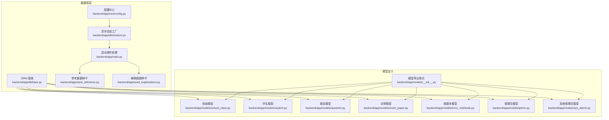
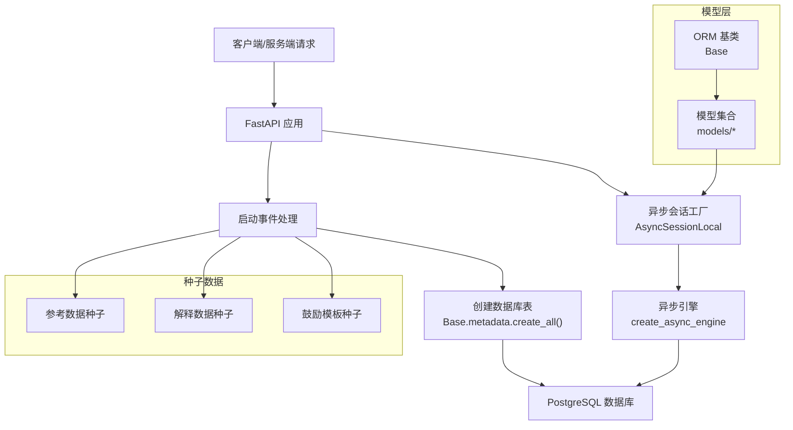
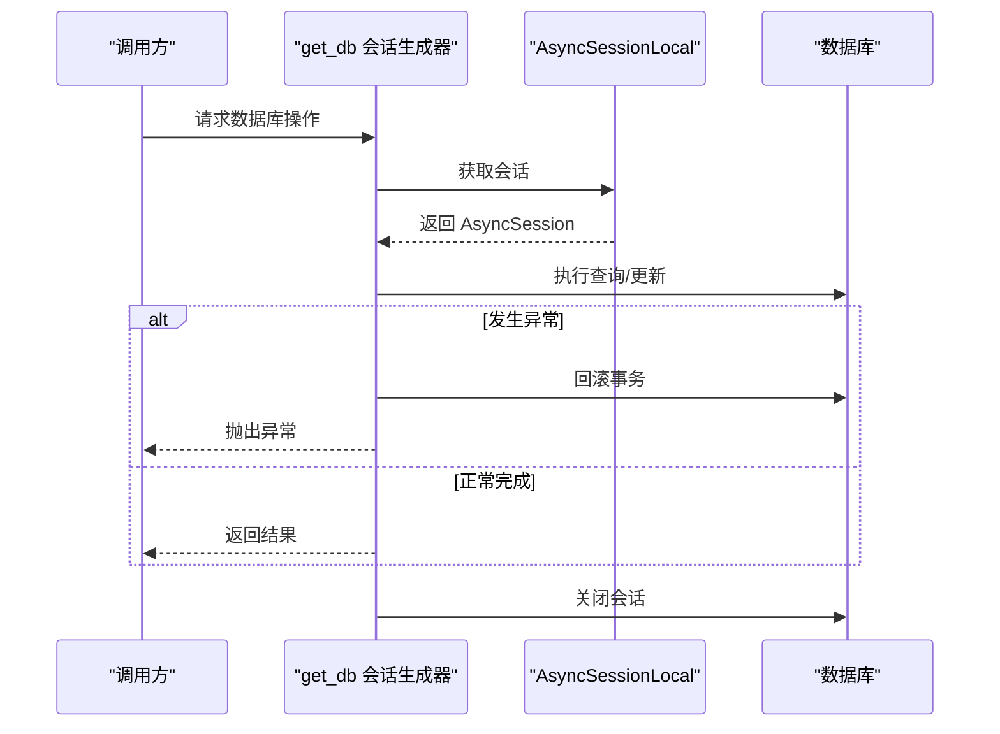
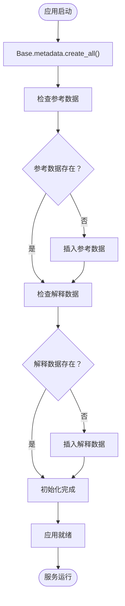
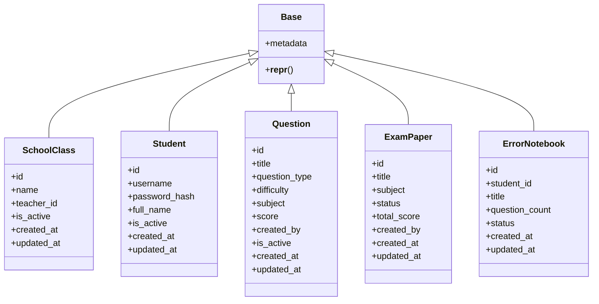
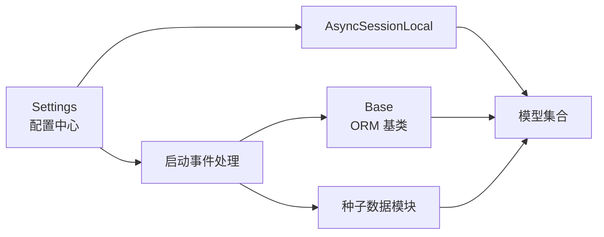

# 数据库ORM设计

<cite>
**本文档引用的文件**
- [backend/app/db/base.py](file://backend/app/db/base.py)
- [backend/app/db/session.py](file://backend/app/db/session.py)
- [backend/app/core/config.py](file://backend/app/core/config.py)
- [backend/alembic/env.py](file://backend/alembic/env.py)
- [backend/alembic.ini](file://backend/alembic.ini)
- [backend/alembic/versions/001_v22_initial.py](file://backend/alembic/versions/001_v22_initial.py)
- [backend/alembic/versions/002_add_provinces_table.py](file://backend/alembic/versions/002_add_provinces_table.py)
- [backend/app/models/__init__.py](file://backend/app/models/__init__.py)
- [backend/app/models/school_class.py](file://backend/app/models/school_class.py)
- [backend/app/models/student.py](file://backend/app/models/student.py)
- [backend/app/models/question.py](file://backend/app/models/question.py)
- [backend/app/models/exam_paper.py](file://backend/app/models/exam_paper.py)
- [backend/app/models/error_notebook.py](file://backend/app/models/error_notebook.py)
- [backend/app/models/admin.py](file://backend/app/models/admin.py)
- [backend/app/models/sys_admin.py](file://backend/app/models/sys_admin.py)
- [backend/app/main.py](file://backend/app/main.py)
- [backend/app/seed_reference.py](file://backend/app/seed_reference.py)
- [backend/app/seed_explanations.py](file://backend/app/seed_explanations.py)
- [nDocs/database-design.md](file://nDocs/database-design.md)
</cite>

## 更新摘要
**所做更改**
- 更新了数据库初始化流程部分，反映从复杂的Alembic迁移系统简化为直接使用SQLAlchemy Base.metadata.create_all()方法
- 新增了数据库初始化与种子数据管理的简化流程说明
- 更新了架构图以体现新的初始化机制
- 移除了Alembic迁移相关的复杂配置说明

## 目录
1. [简介](#简介)
2. [项目结构](#项目结构)
3. [核心组件](#核心组件)
4. [架构总览](#架构总览)
5. [详细组件分析](#详细组件分析)
6. [依赖分析](#依赖分析)
7. [性能考虑](#性能考虑)
8. [故障排查指南](#故障排查指南)
9. [结论](#结论)
10. [附录](#附录)

## 简介
本设计文档面向瑞珹教育管理系统，系统采用 PostgreSQL 作为主数据库，基于 SQLAlchemy 2.x 的异步 ORM 层进行数据持久化。文档聚焦于以下方面：
- SQLAlchemy ORM 模型基类设计与命名规范
- 数据库会话管理与连接池配置
- 模型继承体系、关系映射与外键约束设计
- **简化后的数据库初始化流程**（直接使用Base.metadata.create_all()替代复杂Alembic迁移系统）
- 查询优化策略、事务处理与并发控制
- ER 图与模型关系图，以及数据库设计最佳实践

## 项目结构
后端数据库相关的关键目录与文件如下：
- 数据库配置与会话：backend/app/db/base.py、backend/app/db/session.py、backend/app/core/config.py
- **简化后的初始化流程**：backend/app/main.py中的startup事件处理
- **种子数据管理**：backend/app/seed_reference.py、backend/app/seed_explanations.py
- 模型定义：backend/app/models/*.py，以及 backend/app/models/__init__.py 导出聚合
- 设计文档：nDocs/database-design.md 提供了完整的表结构、索引与关系说明

**图表来源**
- [backend/app/db/base.py:1-21](file://backend/app/db/base.py#L1-L21)
- [backend/app/db/session.py:1-26](file://backend/app/db/session.py#L1-L26)
- [backend/app/core/config.py:1-98](file://backend/app/core/config.py#L1-L98)
- [backend/app/main.py:37-65](file://backend/app/main.py#L37-L65)
- [backend/app/seed_reference.py:1-72](file://backend/app/seed_reference.py#L1-L72)
- [backend/app/seed_explanations.py:1-353](file://backend/app/seed_explanations.py#L1-L353)
- [backend/app/models/__init__.py:1-34](file://backend/app/models/__init__.py#L1-L34)

**章节来源**
- [backend/app/db/base.py:1-21](file://backend/app/db/base.py#L1-L21)
- [backend/app/db/session.py:1-26](file://backend/app/db/session.py#L1-L26)
- [backend/app/core/config.py:1-98](file://backend/app/core/config.py#L1-L98)
- [backend/app/main.py:37-65](file://backend/app/main.py#L37-L65)
- [backend/app/seed_reference.py:1-72](file://backend/app/seed_reference.py#L1-L72)
- [backend/app/seed_explanations.py:1-353](file://backend/app/seed_explanations.py#L1-L353)
- [backend/app/models/__init__.py:1-34](file://backend/app/models/__init__.py#L1-L34)

## 核心组件
本节从系统视角梳理数据库层的核心构件及其职责。

- **简化后的ORM基类与命名约定**
  - 使用 DeclarativeBase 定义统一的元数据命名约定，涵盖索引、唯一、检查、外键与主键等命名模式，确保迁移与约束名称的一致性与可读性。
  - 基类提供通用的字符串表示，便于调试与日志输出。

- 异步会话与连接池
  - 通过异步引擎与会话工厂实现非阻塞数据库访问，支持高并发场景下的请求处理。
  - 会话工厂配置为在事务提交后不自动过期对象，减少不必要的查询刷新，提升性能。
  - 提供依赖注入式的数据库会话生成器，异常时自动回滚并关闭会话，保证资源释放与一致性。

- 配置中心
  - 通过 Settings 类集中管理数据库连接信息（用户名、密码、主机、端口、数据库名），并提供同步与异步数据库 URL。
  - 支持从 sysconfig.json 与环境变量加载配置，便于不同环境部署。

- **简化的数据库初始化流程**
  - 通过 FastAPI startup 事件在应用启动时自动创建数据库表结构
  - 使用 Base.metadata.create_all() 方法直接创建所有模型对应的表
  - 提供种子数据初始化机制，确保系统启动时具备必要的参考数据

**章节来源**
- [backend/app/db/base.py:5-21](file://backend/app/db/base.py#L5-L21)
- [backend/app/db/session.py:1-26](file://backend/app/db/session.py#L1-L26)
- [backend/app/core/config.py:36-62](file://backend/app/core/config.py#L36-L62)
- [backend/app/main.py:37-65](file://backend/app/main.py#L37-L65)

## 架构总览
下图展示了数据库层的整体架构与交互关系，体现了简化的初始化流程：

**图表来源**
- [backend/app/db/session.py:6-15](file://backend/app/db/session.py#L6-L15)
- [backend/app/db/base.py:17-21](file://backend/app/db/base.py#L17-L21)
- [backend/app/main.py:37-65](file://backend/app/main.py#L37-L65)

## 详细组件分析

### 简化后的ORM基类设计与命名规范
- 元数据命名约定
  - 通过 naming_convention 统一约束命名风格，例如索引(ix_)、唯一(uq_)、检查(ck_)、外键(fk_)与主键(pk_)，便于维护与迁移。
- 基类扩展
  - Base 继承自 DeclarativeBase，绑定统一的 MetaData 实例，确保所有模型共享相同的命名约定。
- 通用表示
  - 为模型提供简洁的 __repr__ 输出，便于调试与日志定位。

**章节来源**
- [backend/app/db/base.py:5-21](file://backend/app/db/base.py#L5-L21)

### 异步会话管理与连接池配置
- 异步引擎
  - 使用 create_async_engine 创建异步连接，关闭 echo 以减少日志开销。
- 会话工厂
  - sessionmaker 指定 class_=AsyncSession，expire_on_commit=False 减少对象过期带来的额外查询。
- 依赖注入
  - get_db 提供异步上下文管理，异常时自动回滚并关闭会话，finally 确保资源释放。

**图表来源**
- [backend/app/db/session.py:18-26](file://backend/app/db/session.py#L18-L26)

**章节来源**
- [backend/app/db/session.py:1-26](file://backend/app/db/session.py#L1-L26)

### 配置中心与数据库URL
- 配置来源
  - 优先从 sysconfig.json 加载数据库配置，支持环境变量覆盖敏感字段（如密码）。
- URL 生成
  - 提供 DATABASE_URL 与 ASYNC_DATABASE_URL，分别用于同步与异步连接。
- Redis/队列等其他服务
  - 同步配置了 Redis 与 Celery 相关参数，便于后续集成。

**章节来源**
- [backend/app/core/config.py:6-31](file://backend/app/core/config.py#L6-L31)
- [backend/app/core/config.py:55-62](file://backend/app/core/config.py#L55-L62)

### 简化的数据库初始化流程
- **启动时自动初始化**
  - 在 FastAPI startup 事件中自动创建数据库表结构
  - 使用 Base.metadata.create_all() 方法直接创建所有模型对应的表
  - 无需复杂的Alembic迁移配置，简化了部署流程
- **种子数据管理**
  - 提供 idempotent（幂等）的种子数据初始化机制
  - 参考数据种子：backend/app/seed_reference.py
  - 解释数据种子：backend/app/seed_explanations.py
  - 鼓励模板种子：backend/app/seed_encouragement_templates.py
- **初始化流程优势**
  - 减少了迁移脚本的维护成本
  - 简化了新环境的部署流程
  - 通过幂等机制确保数据一致性

**图表来源**
- [backend/app/main.py:37-65](file://backend/app/main.py#L37-L65)
- [backend/app/seed_reference.py:61-72](file://backend/app/seed_reference.py#L61-L72)
- [backend/app/seed_explanations.py:320-353](file://backend/app/seed_explanations.py#L320-L353)

**章节来源**
- [backend/app/main.py:37-65](file://backend/app/main.py#L37-L65)
- [backend/app/seed_reference.py:1-72](file://backend/app/seed_reference.py#L1-L72)
- [backend/app/seed_explanations.py:1-353](file://backend/app/seed_explanations.py#L1-L353)

### 模型继承体系与关系映射
- 基类继承
  - 所有模型均继承自 Base，共享命名约定与元数据。
- 关系映射
  - 通过 relationship 定义双向关系，如 Question 与 ExamPaper 的多对多关联，以及 ErrorNotebook 与其子项的关系。
- 外键约束
  - 使用 ForeignKey 指定外键列，结合 CheckConstraint 定义业务约束，确保数据完整性。
- 关联表
  - 使用 Table 显式定义多对多中间表，便于扩展额外字段（如排序位置、分数权重）。

**图表来源**
- [backend/app/db/base.py:17-21](file://backend/app/db/base.py#L17-L21)
- [backend/app/models/school_class.py:7-28](file://backend/app/models/school_class.py#L7-L28)
- [backend/app/models/student.py:8-23](file://backend/app/models/student.py#L8-L23)
- [backend/app/models/question.py:10-46](file://backend/app/models/question.py#L10-L46)
- [backend/app/models/exam_paper.py:23-51](file://backend/app/models/exam_paper.py#L23-L51)
- [backend/app/models/error_notebook.py:8-32](file://backend/app/models/error_notebook.py#L8-L32)

**章节来源**
- [backend/app/models/school_class.py:1-39](file://backend/app/models/school_class.py#L1-L39)
- [backend/app/models/student.py:1-23](file://backend/app/models/student.py#L1-L23)
- [backend/app/models/question.py:1-46](file://backend/app/models/question.py#L1-L46)
- [backend/app/models/exam_paper.py:1-51](file://backend/app/models/exam_paper.py#L1-L51)
- [backend/app/models/error_notebook.py:1-32](file://backend/app/models/error_notebook.py#L1-L32)

### 外键约束与数据完整性
- 约束类型
  - 使用 CheckConstraint 对枚举字段与数值范围进行约束，确保业务规则一致性。
- 约束命名
  - 通过 naming_convention 自动生成约束名，便于迁移与维护。
- 关联删除策略
  - 通过外键与关系映射定义级联行为，避免悬挂引用。

**章节来源**
- [backend/app/models/question.py:38-43](file://backend/app/models/question.py#L38-L43)
- [backend/app/models/exam_paper.py:43-48](file://backend/app/models/exam_paper.py#L43-L48)
- [backend/app/models/error_notebook.py:22-26](file://backend/app/models/error_notebook.py#L22-L26)

### 模型导出与聚合
- 模型聚合
  - __init__.py 将所有模型与枚举类型集中导出，便于应用层统一导入。
- 导出清单
  - 包含用户域、内容域、作答域、错题本、任务与系统域等主要模型。

**章节来源**
- [backend/app/models/__init__.py:1-34](file://backend/app/models/__init__.py#L1-L34)

### 用户域模型（系统管理员、管理员、学生）
- SysAdmin
  - 系统内置管理员账户，具备最高权限。
- Admin
  - 教师或题库管理员，支持学科与年级维度的权限配置。
- Student
  - 自主注册的学生用户，包含基础信息与活跃状态。

**章节来源**
- [backend/app/models/sys_admin.py:1-22](file://backend/app/models/sys_admin.py#L1-L22)
- [backend/app/models/admin.py:1-27](file://backend/app/models/admin.py#L1-L27)
- [backend/app/models/student.py:1-23](file://backend/app/models/student.py#L1-L23)

### 内容域模型（班级、题目、试卷、错题本）
- SchoolClass
  - 班级实体，与教师（Admin）与学生（Student）建立多对多关系。
- Question
  - 题目实体，支持多种题型与难度级别，具备评分与审核状态。
- ExamPaper
  - 试卷实体，与题目通过中间表建立多对多关系，支持排序与分数权重。
- ErrorNotebook
  - 错题本实体，与题目建立一对多关系，支持生成与导出状态。

**章节来源**
- [backend/app/models/school_class.py:1-39](file://backend/app/models/school_class.py#L1-L39)
- [backend/app/models/question.py:1-46](file://backend/app/models/question.py#L1-L46)
- [backend/app/models/exam_paper.py:1-51](file://backend/app/models/exam_paper.py#L1-L51)
- [backend/app/models/error_notebook.py:1-32](file://backend/app/models/error_notebook.py#L1-L32)

## 依赖分析
- 组件耦合
  - 模型层仅依赖 Base 与 SQLAlchemy 类型，保持低耦合。
  - 会话层依赖配置中心提供的 URL，实现运行时可配置。
  - **简化后的初始化流程**依赖 FastAPI startup 事件，实现自动化的数据库初始化。
- 外部依赖
  - PostgreSQL 作为主数据库，**简化后的系统不再依赖Alembic迁移工具**。
  - Pydantic Settings 用于配置解析，种子数据模块提供幂等初始化。

**图表来源**
- [backend/app/core/config.py:55-62](file://backend/app/core/config.py#L55-L62)
- [backend/app/db/session.py:6-15](file://backend/app/db/session.py#L6-L15)
- [backend/app/db/base.py:17-21](file://backend/app/db/base.py#L17-L21)
- [backend/app/main.py:37-65](file://backend/app/main.py#L37-L65)

**章节来源**
- [backend/app/core/config.py:1-98](file://backend/app/core/config.py#L1-L98)
- [backend/app/db/session.py:1-26](file://backend/app/db/session.py#L1-L26)
- [backend/app/db/base.py:1-21](file://backend/app/db/base.py#L1-L21)
- [backend/app/main.py:37-65](file://backend/app/main.py#L37-L65)

## 性能考虑
- 异步访问
  - 使用异步引擎与会话，降低 I/O 阻塞，提升高并发场景下的吞吐量。
- 会话配置
  - expire_on_commit=False 减少对象过期导致的额外查询，提高读取性能。
- **简化的初始化性能**
  - 直接使用 create_all() 方法创建表结构，避免了Alembic迁移的额外开销
  - 种子数据采用幂等机制，避免重复初始化造成的性能损耗
- 索引与约束
  - 在高频查询字段上建立索引（如 subject、is_active、content_hash），配合 CheckConstraint 限制无效数据。

## 故障排查指南
- **初始化失败**
  - 检查数据库连接配置是否正确（sysconfig.json与环境变量）
  - 确认 PostgreSQL 服务正常运行且允许来自容器/主机的连接
  - 验证 Base.metadata.create_all() 调用是否在 startup 事件中正确执行
- **种子数据问题**
  - 检查种子数据模块的日志输出，确认幂等初始化是否正常工作
  - 验证数据库中是否已存在相应的种子数据记录
- **连接异常**
  - 核对 settings 中的数据库凭据与网络连通性
  - 确认 PostgreSQL 服务正常运行且允许来自容器/主机的连接
- **会话异常**
  - 若出现会话未关闭或回滚问题，检查 get_db 的异常处理逻辑是否被覆盖
- **数据一致性**
  - 由于使用幂等种子数据，通常不会出现数据不一致问题
  - 如需重置数据，可手动删除相应表的数据记录后重启应用

**章节来源**
- [backend/app/main.py:37-65](file://backend/app/main.py#L37-L65)
- [backend/app/db/session.py:20-26](file://backend/app/db/session.py#L20-L26)
- [backend/app/seed_reference.py:61-72](file://backend/app/seed_reference.py#L61-L72)
- [backend/app/seed_explanations.py:320-353](file://backend/app/seed_explanations.py#L320-L353)

## 结论
本设计文档系统性地阐述了瑞珹教育管理系统的数据库 ORM 设计，包括：
- 基于 DeclarativeBase 的统一模型基类与命名规范
- 异步会话与连接池配置，满足高并发需求
- 模型继承体系、关系映射与外键约束设计
- **简化的数据库初始化流程**（使用Base.metadata.create_all()替代复杂Alembic迁移系统）
- **幂等的种子数据管理机制**，确保系统启动时具备必要的参考数据
- 查询优化、事务处理与并发控制建议
- ER 图与模型关系图，以及数据库设计最佳实践

通过上述设计，系统在可维护性、可扩展性与性能之间取得了良好平衡，**简化了部署流程并降低了运维复杂度**，为后续功能迭代提供了坚实基础。

## 附录
- 数据库设计参考
  - nDocs/database-design.md 提供了完整的表结构、索引与关系说明，可作为 ER 图与模型关系图的权威依据。

**章节来源**
- [nDocs/database-design.md:1-540](file://nDocs/database-design.md#L1-L540)