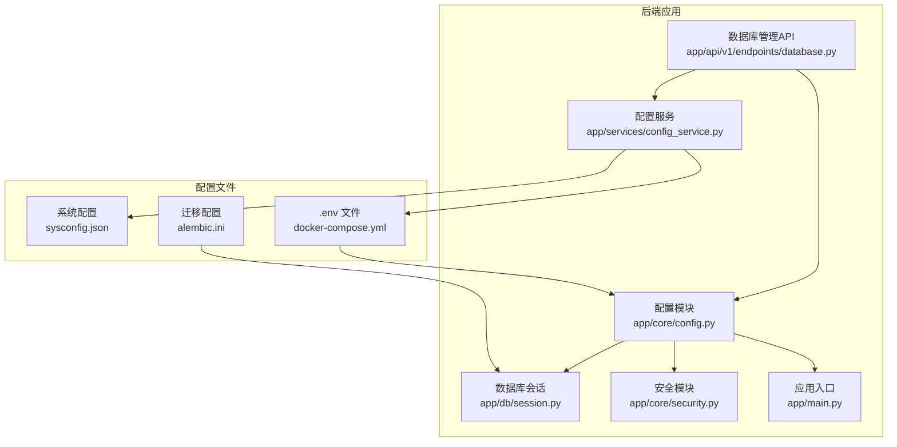
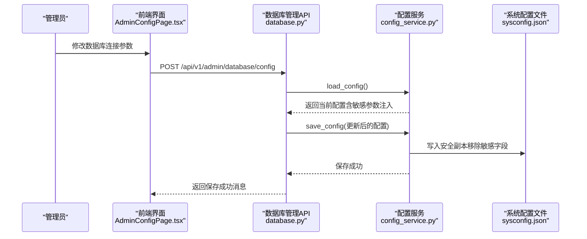
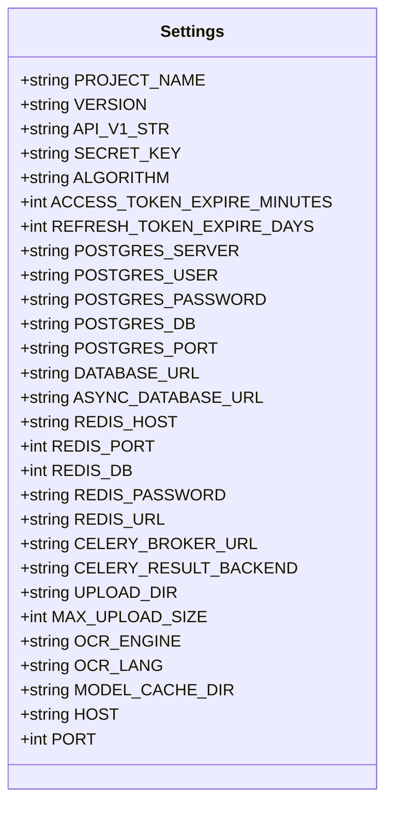
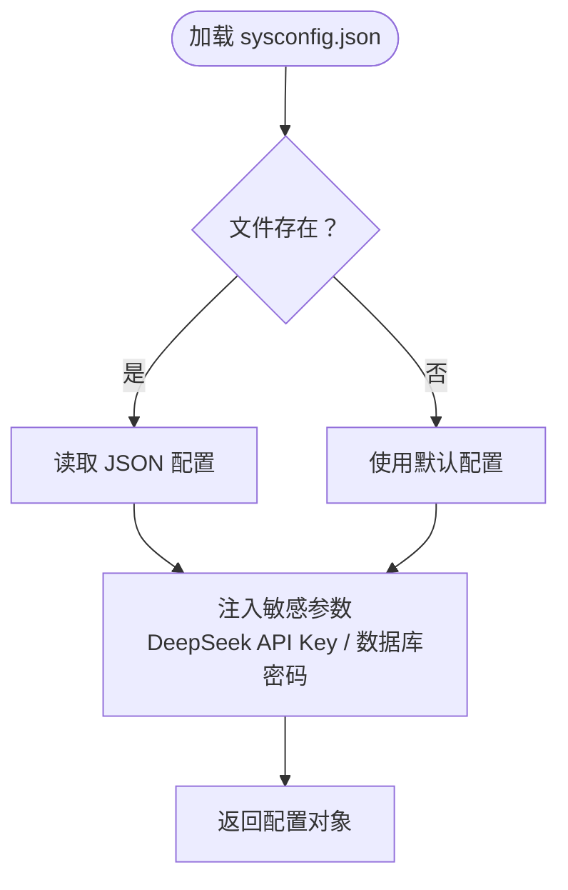
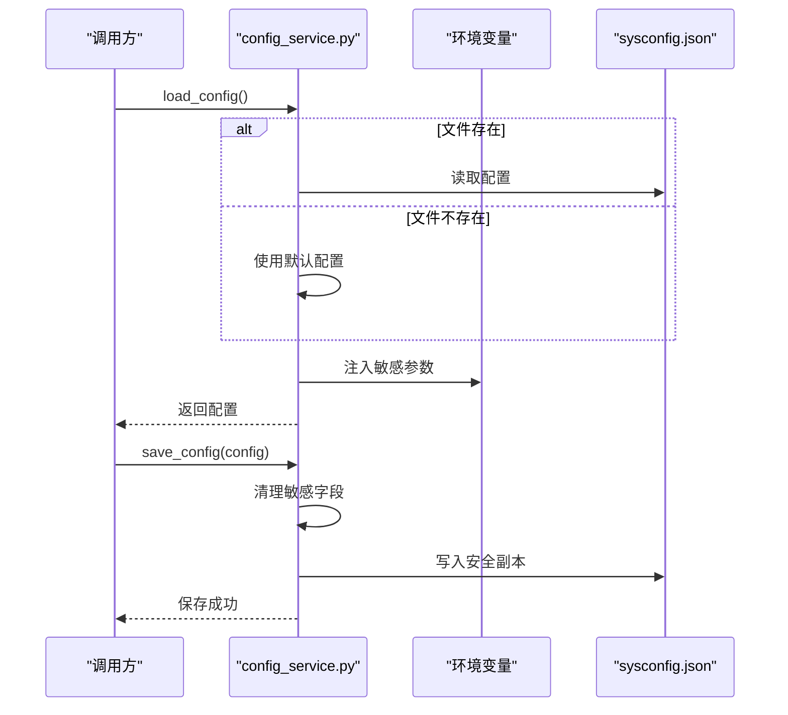
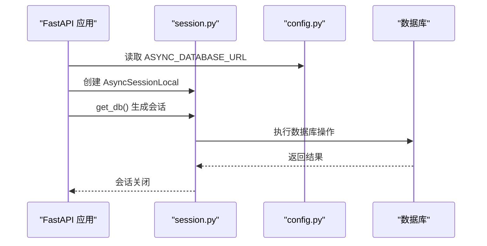
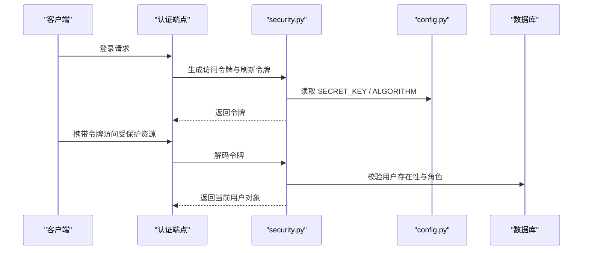
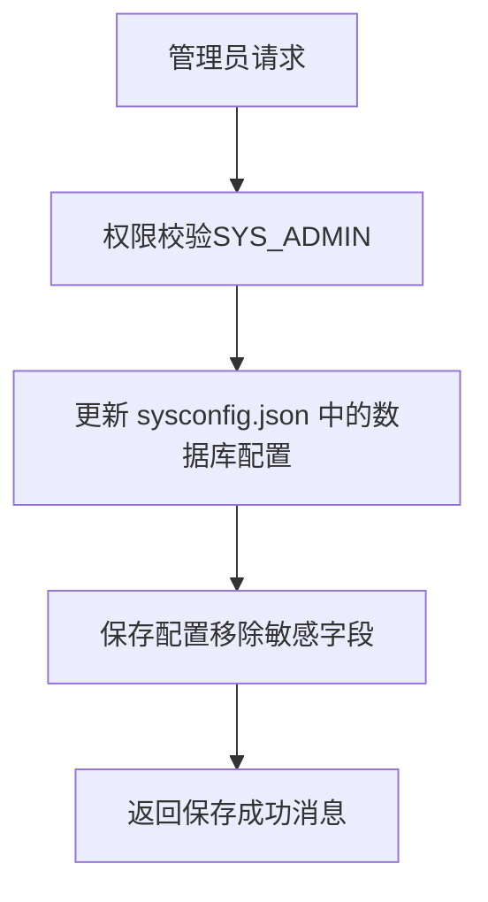
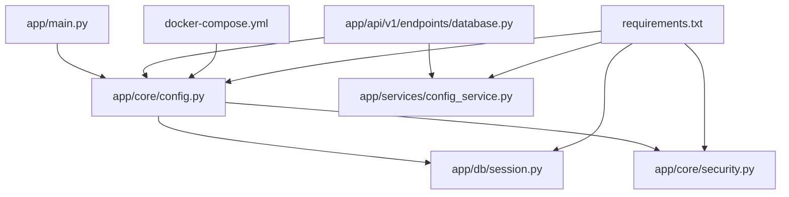

# 配置管理系统

<cite>
**本文档引用的文件**
- [backend/app/core/config.py](file://backend/app/core/config.py)
- [backend/sysconfig.json](file://backend/sysconfig.json)
- [backend/app/services/config_service.py](file://backend/app/services/config_service.py)
- [backend/app/db/session.py](file://backend/app/db/session.py)
- [backend/app/core/security.py](file://backend/app/core/security.py)
- [backend/app/api/v1/endpoints/database.py](file://backend/app/api/v1/endpoints/database.py)
- [backend/docker-compose.yml](file://backend/docker-compose.yml)
- [backend/Dockerfile](file://backend/Dockerfile)
- [backend/alembic.ini](file://backend/alembic.ini)
- [backend/requirements.txt](file://backend/requirements.txt)
- [backend/app/main.py](file://backend/app/main.py)
- [frontend/src/pages/admin/AdminConfigPage.tsx](file://frontend/src/pages/admin/AdminConfigPage.tsx)
</cite>

## 目录
1. [简介](#简介)
2. [项目结构](#项目结构)
3. [核心组件](#核心组件)
4. [架构总览](#架构总览)
5. [详细组件分析](#详细组件分析)
6. [依赖关系分析](#依赖关系分析)
7. [性能考虑](#性能考虑)
8. [故障排除指南](#故障排除指南)
9. [结论](#结论)
10. [附录](#附录)

## 简介
本文件为瑞珹教育管理系统配置管理文档，聚焦于多环境配置系统设计与实现，涵盖开发、测试与生产环境的配置差异；解释配置文件结构、环境变量读取机制与配置验证规则；文档化数据库连接配置、JWT密钥设置与第三方服务配置；说明配置热更新机制、配置安全性考虑与最佳实践，并提供配置文件模板、环境变量清单与配置迁移指南。

## 项目结构
后端采用 FastAPI + SQLAlchemy Async 架构，配置由两部分组成：
- 运行时配置：通过 Pydantic Settings 从 .env 文件与环境变量读取，覆盖项目名称、数据库连接、Redis/Celery、文件上传、OCR、模型缓存等。
- 系统配置：通过 sysconfig.json 存储非敏感系统参数，敏感参数（如密钥、数据库密码）通过环境变量注入，支持在线修改并通过 API 写回。

**图表来源**
- [backend/app/core/config.py:1-98](file://backend/app/core/config.py#L1-L98)
- [backend/app/services/config_service.py:1-155](file://backend/app/services/config_service.py#L1-L155)
- [backend/app/db/session.py:1-26](file://backend/app/db/session.py#L1-L26)
- [backend/app/core/security.py:1-104](file://backend/app/core/security.py#L1-L104)
- [backend/app/api/v1/endpoints/database.py:106-166](file://backend/app/api/v1/endpoints/database.py#L106-L166)
- [backend/app/main.py:1-52](file://backend/app/main.py#L1-L52)
- [backend/docker-compose.yml:1-33](file://backend/docker-compose.yml#L1-L33)
- [backend/alembic.ini:1-150](file://backend/alembic.ini#L1-L150)

**章节来源**
- [backend/app/core/config.py:1-98](file://backend/app/core/config.py#L1-L98)
- [backend/sysconfig.json:1-48](file://backend/sysconfig.json#L1-L48)
- [backend/app/services/config_service.py:1-155](file://backend/app/services/config_service.py#L1-L155)
- [backend/docker-compose.yml:1-33](file://backend/docker-compose.yml#L1-L33)

## 核心组件
- 运行时配置 Settings：集中定义项目名称、版本、API 前缀、JWT 密钥与算法、数据库连接、Redis/Celery、上传目录与大小限制、OCR 引擎与语言、模型缓存目录等。数据库连接字符串通过属性方法生成，支持同步与异步两种 URL。
- 系统配置 sysconfig.json：存储数据库连接参数、大模型（LLM）配置（当前引擎、端点、模型、可用模型列表）、判题策略、OCR 参数、错题本与导出限制、系统日志级别与备份开关等。
- 配置服务 config_service：负责加载/保存 sysconfig.json，注入敏感参数（DeepSeek API Key、数据库密码），提供 LLM 连接测试与模型拉取功能。
- 数据库会话 session：基于 Settings 的异步数据库 URL 创建异步引擎与会话工厂。
- 安全模块 security：使用 Settings 中的 SECRET_KEY 与 ALGORITHM 生成/解码 JWT，提供用户认证与角色校验。
- 数据库管理 API：提供在线修改数据库连接参数的能力，并写回 sysconfig.json。

**章节来源**
- [backend/app/core/config.py:36-98](file://backend/app/core/config.py#L36-L98)
- [backend/sysconfig.json:1-48](file://backend/sysconfig.json#L1-L48)
- [backend/app/services/config_service.py:65-105](file://backend/app/services/config_service.py#L65-L105)
- [backend/app/db/session.py:1-26](file://backend/app/db/session.py#L1-L26)
- [backend/app/core/security.py:24-47](file://backend/app/core/security.py#L24-L47)
- [backend/app/api/v1/endpoints/database.py:147-166](file://backend/app/api/v1/endpoints/database.py#L147-L166)

## 架构总览
下图展示配置系统的数据流与控制流：应用启动时读取 .env 与环境变量，初始化 Settings；sysconfig.json 作为系统参数持久化载体，敏感信息通过环境变量注入；数据库连接、JWT 密钥、Redis/Celery、OCR 等均来自配置；管理员可通过 API 在线修改数据库配置并写回文件。

**图表来源**
- [frontend/src/pages/admin/AdminConfigPage.tsx:295-326](file://frontend/src/pages/admin/AdminConfigPage.tsx#L295-L326)
- [backend/app/api/v1/endpoints/database.py:147-166](file://backend/app/api/v1/endpoints/database.py#L147-L166)
- [backend/app/services/config_service.py:65-105](file://backend/app/services/config_service.py#L65-L105)
- [backend/sysconfig.json:1-48](file://backend/sysconfig.json#L1-L48)

## 详细组件分析

### 运行时配置 Settings 分析
- 项目与 API 基础信息：项目名称、版本、API 前缀。
- 安全配置：JWT 密钥、算法、访问令牌与刷新令牌过期时间。
- 数据库配置：从 sysconfig.json 或环境变量读取，提供同步与异步数据库 URL 属性。
- 缓存与任务：Redis 主机、端口、数据库、密码，Celery Broker 与结果后端。
- 文件与 OCR：上传目录、最大上传大小、OCR 引擎与语言、模型缓存目录。
- 主机与端口：默认监听地址与端口。

**图表来源**
- [backend/app/core/config.py:36-98](file://backend/app/core/config.py#L36-L98)

**章节来源**
- [backend/app/core/config.py:36-98](file://backend/app/core/config.py#L36-L98)

### 系统配置 sysconfig.json 分析
- 数据库：服务器、端口、数据库名、用户。
- 大模型（LLM）：当前引擎、Ollama 与 DeepSeek 配置（端点、模型、可用模型列表）。
- 判题：最大并发判题数、判题模型类型。
- OCR：OCR 引擎、最大并发 OCR、置信度阈值。
- 错题本：练习题目数量。
- 导出限制：最大导出条目数。
- 系统：日志级别、备份开关。

**图表来源**
- [backend/app/services/config_service.py:65-78](file://backend/app/services/config_service.py#L65-L78)
- [backend/sysconfig.json:1-48](file://backend/sysconfig.json#L1-L48)

**章节来源**
- [backend/sysconfig.json:1-48](file://backend/sysconfig.json#L1-L48)
- [backend/app/services/config_service.py:24-78](file://backend/app/services/config_service.py#L24-L78)

### 配置服务 config_service 分析
- 加载配置：若文件不存在则使用默认配置；加载后注入敏感参数（DeepSeek API Key、数据库密码）。
- 保存配置：写回 sysconfig.json 前移除敏感字段，确保安全。
- LLM 连接测试：从 Ollama 拉取可用模型列表，进行最小化请求以预热模型。
- 敏感字段路径：定义敏感字段集合，用于保存前清理。

**图表来源**
- [backend/app/services/config_service.py:65-105](file://backend/app/services/config_service.py#L65-L105)

**章节来源**
- [backend/app/services/config_service.py:65-155](file://backend/app/services/config_service.py#L65-L155)

### 数据库会话与连接分析
- 异步引擎：基于 Settings.ASYNC_DATABASE_URL 创建异步数据库引擎。
- 会话工厂：使用 sessionmaker 创建 AsyncSessionLocal，支持自动回滚与关闭。
- 应用启动：在 startup 事件中执行种子数据插入，确保系统初始化。

**图表来源**
- [backend/app/db/session.py:1-26](file://backend/app/db/session.py#L1-L26)
- [backend/app/core/config.py:55-61](file://backend/app/core/config.py#L55-L61)
- [backend/app/main.py:33-42](file://backend/app/main.py#L33-L42)

**章节来源**
- [backend/app/db/session.py:1-26](file://backend/app/db/session.py#L1-L26)
- [backend/app/core/config.py:55-61](file://backend/app/core/config.py#L55-L61)
- [backend/app/main.py:33-42](file://backend/app/main.py#L33-L42)

### 安全与 JWT 分析
- 密钥与算法：从 Settings 读取 SECRET_KEY 与 ALGORITHM。
- 令牌生成：根据过期时间生成访问令牌与刷新令牌。
- 令牌解码：使用 SECRET_KEY 与 ALGORITHM 解码 JWT。
- 用户认证：OAuth2PasswordBearer 提供令牌提取，结合数据库查询验证用户身份与角色。

**图表来源**
- [backend/app/core/security.py:24-47](file://backend/app/core/security.py#L24-L47)
- [backend/app/core/security.py:64-95](file://backend/app/core/security.py#L64-L95)
- [backend/app/core/config.py:43-46](file://backend/app/core/config.py#L43-L46)

**章节来源**
- [backend/app/core/security.py:1-104](file://backend/app/core/security.py#L1-L104)
- [backend/app/core/config.py:43-46](file://backend/app/core/config.py#L43-L46)

### 数据库配置管理 API 分析
- 管理员接口：提供修改数据库连接参数的端点，仅系统管理员可调用。
- 参数更新：支持服务器、端口、数据库名、用户与密码（可选）。
- 写回策略：更新 sysconfig.json，提示重启后生效。

**图表来源**
- [backend/app/api/v1/endpoints/database.py:147-166](file://backend/app/api/v1/endpoints/database.py#L147-L166)
- [backend/app/services/config_service.py:101-105](file://backend/app/services/config_service.py#L101-L105)

**章节来源**
- [backend/app/api/v1/endpoints/database.py:147-166](file://backend/app/api/v1/endpoints/database.py#L147-L166)
- [backend/app/services/config_service.py:101-105](file://backend/app/services/config_service.py#L101-L105)

## 依赖关系分析
- 配置依赖链：app/main.py → app/core/config.py → app/db/session.py；app/core/security.py 依赖 app/core/config.py；app/api/v1/endpoints/database.py 依赖 app/services/config_service.py 与 app/core/config.py。
- 外部依赖：Pydantic Settings、python-dotenv、SQLAlchemy Async、Redis/Celery、OCR 依赖（pytesseract、Pillow）。
- 环境变量：docker-compose.yml 提供开发环境变量，Settings 从 .env 与环境变量读取。

**图表来源**
- [backend/app/main.py:1-52](file://backend/app/main.py#L1-L52)
- [backend/app/core/config.py:1-98](file://backend/app/core/config.py#L1-L98)
- [backend/app/db/session.py:1-26](file://backend/app/db/session.py#L1-L26)
- [backend/app/core/security.py:1-104](file://backend/app/core/security.py#L1-L104)
- [backend/app/api/v1/endpoints/database.py:147-166](file://backend/app/api/v1/endpoints/database.py#L147-L166)
- [backend/docker-compose.yml:1-33](file://backend/docker-compose.yml#L1-L33)
- [backend/requirements.txt:1-27](file://backend/requirements.txt#L1-L27)

**章节来源**
- [backend/app/main.py:1-52](file://backend/app/main.py#L1-L52)
- [backend/app/core/config.py:1-98](file://backend/app/core/config.py#L1-L98)
- [backend/app/db/session.py:1-26](file://backend/app/db/session.py#L1-L26)
- [backend/app/core/security.py:1-104](file://backend/app/core/security.py#L1-L104)
- [backend/app/api/v1/endpoints/database.py:147-166](file://backend/app/api/v1/endpoints/database.py#L147-L166)
- [backend/docker-compose.yml:1-33](file://backend/docker-compose.yml#L1-L33)
- [backend/requirements.txt:1-27](file://backend/requirements.txt#L1-L27)

## 性能考虑
- 数据库连接：使用异步引擎与连接池，避免阻塞；合理设置连接超时与重试策略。
- 缓存与任务：Redis 与 Celery 用于异步任务与缓存，建议在高并发场景下调整队列与 worker 数量。
- 文件上传：限制最大上传大小，使用流式处理减少内存占用。
- OCR 与模型：并发数与置信度阈值需平衡准确率与性能；模型预热可减少首次请求延迟。
- 配置读取：sysconfig.json 读取与敏感参数注入应在应用启动时完成，避免运行时重复 IO。

## 故障排除指南
- 数据库连接失败
  - 检查 Settings 中的数据库参数是否正确，确认 sysconfig.json 与环境变量优先级。
  - 使用数据库管理 API 验证连接参数是否已写回并生效。
- JWT 令牌无效
  - 确认 SECRET_KEY 与 ALGORITHM 一致，检查令牌过期时间设置。
  - 核对用户角色与权限，确保用户存在且未被禁用。
- Redis/Celery 连接问题
  - 检查 REDIS_HOST/PORT/DB/PASSWORD 与 CELERY_BROKER_URL/RESULT_BACKEND 是否正确。
- OCR 与模型
  - 确认 OCR 引擎与语言设置，检查模型可用性与置信度阈值。
  - 如使用 Ollama，先拉取可用模型再进行预热测试。

**章节来源**
- [backend/app/core/config.py:48-76](file://backend/app/core/config.py#L48-L76)
- [backend/app/core/security.py:43-47](file://backend/app/core/security.py#L43-L47)
- [backend/app/api/v1/endpoints/database.py:128-144](file://backend/app/api/v1/endpoints/database.py#L128-L144)

## 结论
本配置管理系统通过运行时配置与系统配置的分离，实现了灵活的多环境部署与在线配置管理。敏感信息通过环境变量注入并避免落盘，非敏感系统参数通过 JSON 文件持久化并支持在线修改。配合 JWT 安全机制与异步数据库连接，系统在保证安全性的同时具备良好的扩展性与运维便利性。

## 附录

### 多环境配置差异
- 开发环境
  - 使用 SQLite（由 alembic.ini 指定），便于快速迭代。
  - 默认 SECRET_KEY 与数据库凭据可在 docker-compose.yml 中设置。
  - CORS 允许所有来源，便于前端联调。
- 测试环境
  - 使用独立 Postgres 实例，配置独立的 DATABASE_PASSWORD。
  - 严格限制 CORS 与日志级别，启用备份开关。
- 生产环境
  - 使用强随机 SECRET_KEY，定期轮换。
  - 数据库使用专用凭据与只读账号，开启连接池与超时配置。
  - Redis/Celery 使用独立实例，配置密码与网络隔离。

**章节来源**
- [backend/docker-compose.yml:13-20](file://backend/docker-compose.yml#L13-L20)
- [backend/alembic.ini:89-90](file://backend/alembic.ini#L89-L90)

### 配置文件结构与优先级
- sysconfig.json：存储非敏感系统参数，支持在线修改与写回。
- .env/.env.docker：运行时配置的默认值，可被环境变量覆盖。
- 环境变量：最高优先级，用于注入敏感参数与覆盖默认值。

**章节来源**
- [backend/app/core/config.py:6-30](file://backend/app/core/config.py#L6-L30)
- [backend/app/services/config_service.py:65-78](file://backend/app/services/config_service.py#L65-L78)

### 环境变量清单
- 安全与认证
  - SECRET_KEY：JWT 密钥
  - DATABASE_PASSWORD：数据库密码（注入到 sysconfig.json）
  - DEEPSEEK_API_KEY：DeepSeek API 密钥（注入到 LLM 配置）
- 数据库
  - POSTGRES_SERVER：数据库主机
  - POSTGRES_PORT：数据库端口
  - POSTGRES_DB：数据库名
  - POSTGRES_USER：数据库用户
- 缓存与任务
  - REDIS_HOST/REDIS_PORT/REDIS_DB/REDIS_PASSWORD：Redis 连接参数
  - CELERY_BROKER_URL/CELERY_RESULT_BACKEND：Celery 连接参数
- 运行时
  - UPLOAD_DIR：上传目录
  - MAX_UPLOAD_SIZE：最大上传大小
  - OCR_ENGINE/OCR_LANG：OCR 引擎与语言
  - MODEL_CACHE_DIR：模型缓存目录
  - HOST/PORT：应用监听地址与端口

**章节来源**
- [backend/app/core/config.py:43-89](file://backend/app/core/config.py#L43-L89)
- [backend/app/services/config_service.py:13-15](file://backend/app/services/config_service.py#L13-L15)

### 配置验证规则
- 必填项：数据库连接参数（服务器、端口、数据库、用户）与 JWT 密钥必须配置。
- 类型与范围：端口为整数，上传大小为字节单位，OCR 并发与置信度阈值在合理范围内。
- 权限校验：数据库配置修改仅允许系统管理员调用。
- 敏感字段：保存 sysconfig.json 前自动清理敏感字段，避免明文落盘。

**章节来源**
- [backend/app/api/v1/endpoints/database.py:147-166](file://backend/app/api/v1/endpoints/database.py#L147-L166)
- [backend/app/services/config_service.py:87-98](file://backend/app/services/config_service.py#L87-L98)

### 配置热更新机制
- sysconfig.json 在线修改：通过数据库管理 API 更新后立即生效，无需重启。
- 环境变量变更：需要重启容器或服务以重新加载 .env 与环境变量。
- 数据库连接：修改后提示重启后生效，确保连接池与会话工厂重新初始化。

**章节来源**
- [backend/app/api/v1/endpoints/database.py:166](file://backend/app/api/v1/endpoints/database.py#L166)
- [backend/app/db/session.py:5-15](file://backend/app/db/session.py#L5-L15)

### 配置安全性考虑
- 敏感信息：JWT 密钥、数据库密码、第三方 API Key 通过环境变量注入，不落盘。
- 文件权限：sysconfig.json 仅包含非敏感参数，敏感参数在运行时注入。
- 网络隔离：生产环境数据库、Redis、Celery 与 OCR 服务应置于内网或专用子网。
- 最小权限：数据库账号按需授予只读或受限权限，避免超级权限。

**章节来源**
- [backend/app/services/config_service.py:73-78](file://backend/app/services/config_service.py#L73-L78)
- [backend/app/core/config.py:15-30](file://backend/app/core/config.py#L15-L30)

### 配置最佳实践
- 使用环境变量管理敏感参数，避免硬编码。
- 将非敏感系统参数集中管理，支持在线修改与审计。
- 在生产环境启用严格的 CORS 与 HTTPS。
- 定期轮换 SECRET_KEY，使用强随机值。
- 为数据库、Redis、Celery 与 OCR 服务配置独立凭据与网络隔离。
- 使用 Docker Compose 管理多环境变量，区分开发、测试与生产。

**章节来源**
- [backend/docker-compose.yml:13-20](file://backend/docker-compose.yml#L13-L20)
- [backend/app/core/config.py:91-94](file://backend/app/core/config.py#L91-L94)

### 配置文件模板
- sysconfig.json 模板
  - 包含 database、llm、grading、ocr、mistake_book、export_max、system 等键位。
  - 建议保留默认值，仅覆盖实际使用的参数。
- .env 模板
  - 包含 SECRET_KEY、DATABASE_PASSWORD、DEEPSEEK_API_KEY 等敏感参数。
  - 非敏感参数如 UPLOAD_DIR、OCR_ENGINE、REDIS_HOST 等可在此文件中设置默认值。

**章节来源**
- [backend/sysconfig.json:1-48](file://backend/sysconfig.json#L1-L48)
- [backend/app/services/config_service.py:24-62](file://backend/app/services/config_service.py#L24-L62)

### 配置迁移指南
- 从开发到测试/生产
  - 替换数据库类型：开发使用 SQLite，测试/生产使用 Postgres。
  - 更新数据库连接参数：在 sysconfig.json 中设置生产数据库参数。
  - 注入敏感参数：通过环境变量设置 SECRET_KEY、DATABASE_PASSWORD、DEEPSEEK_API_KEY。
  - 调整 CORS 与日志级别：生产环境限制 CORS 并降低日志级别。
- 从旧版本升级
  - 检查 sysconfig.json 新增键位（如 grading、ocr、system），按需添加默认值。
  - 若新增 LLM 引擎，更新 llm.current 与对应端点配置。
  - 重启服务以应用新配置。

**章节来源**
- [backend/alembic.ini:89-90](file://backend/alembic.ini#L89-L90)
- [backend/sysconfig.json:31-47](file://backend/sysconfig.json#L31-L47)
- [backend/app/services/config_service.py:24-62](file://backend/app/services/config_service.py#L24-L62)