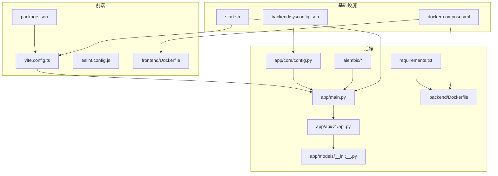
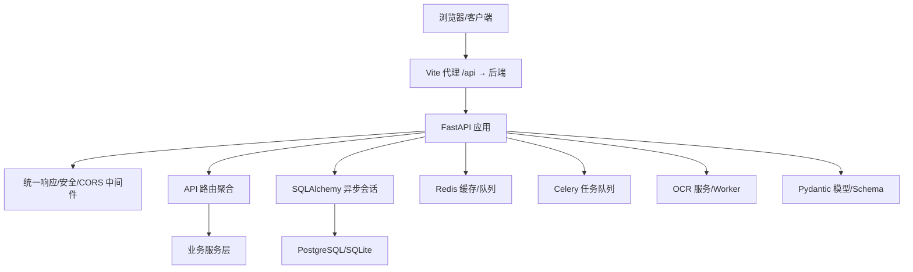
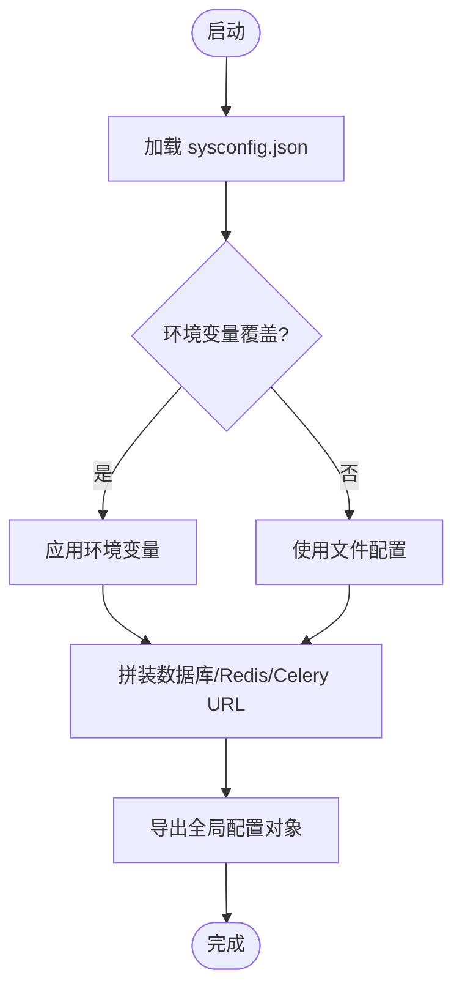
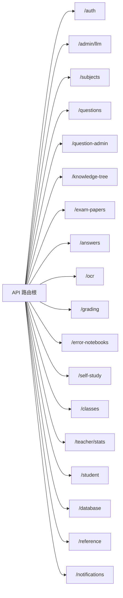
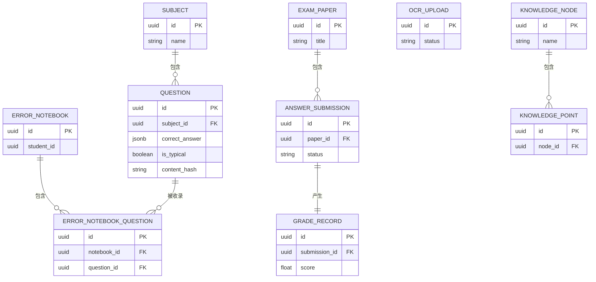
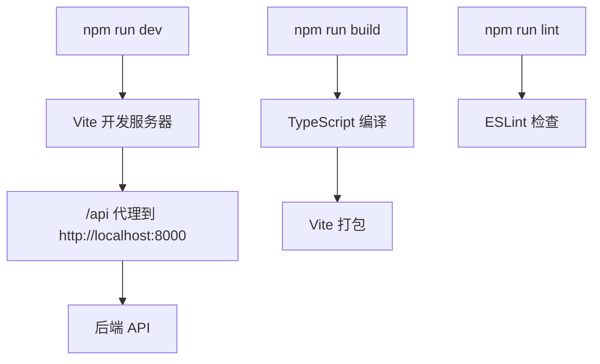
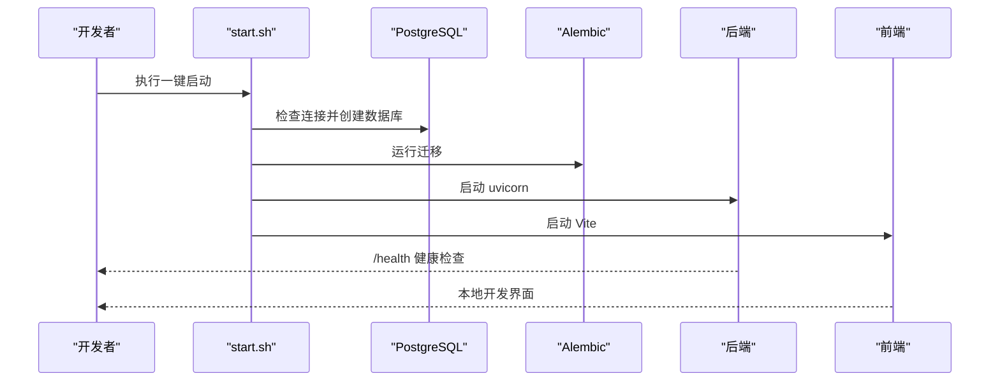
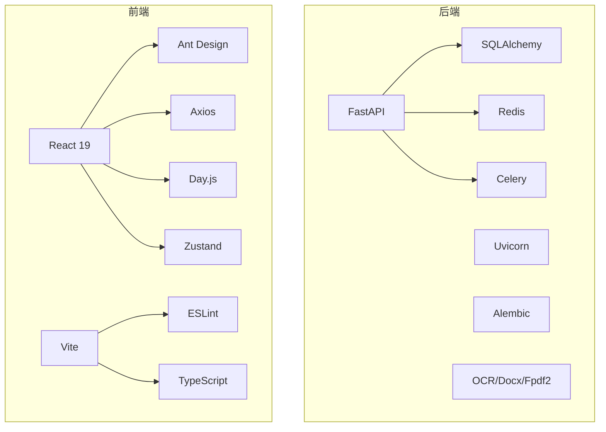

# 开发指南

<cite>
**本文引用的文件**
- [backend/app/core/config.py](file://backend/app/core/config.py)
- [backend/app/main.py](file://backend/app/main.py)
- [backend/app/api/v1/api.py](file://backend/app/api/v1/api.py)
- [backend/app/models/__init__.py](file://backend/app/models/__init__.py)
- [backend/requirements.txt](file://backend/requirements.txt)
- [backend/Dockerfile](file://backend/Dockerfile)
- [backend/alembic/versions/001_v22_initial.py](file://backend/alembic/versions/001_v22_initial.py)
- [backend/alembic/versions/002_add_provinces_table.py](file://backend/alembic/versions/002_add_provinces_table.py)
- [backend/alembic/versions/003_add_is_typical.py](file://backend/alembic/versions/003_add_is_typical.py)
- [backend/alembic/versions/004_simplify_submission_status.py](file://backend/alembic/versions/004_simplify_submission_status.py)
- [backend/alembic/versions/005_add_ocr_needs_review_status.py](file://backend/alembic/versions/005_add_ocr_needs_review_status.py)
- [backend/alembic/versions/006_add_content_hash_to_questions.py](file://backend/alembic/versions/006_add_content_hash_to_questions.py)
- [backend/alembic/env.py](file://backend/alembic/env.py)
- [backend/alembic/script.py.mako](file://backend/alembic/script.py.mako)
- [frontend/package.json](file://frontend/package.json)
- [frontend/vite.config.ts](file://frontend/vite.config.ts)
- [frontend/Dockerfile](file://frontend/Dockerfile)
- [frontend/eslint.config.js](file://frontend/eslint.config.js)
- [docker-compose.yml](file://docker-compose.yml)
- [start.sh](file://start.sh)
- [docs/project-summary.md](file://docs/project-summary.md)
- [docs/requirements-v2.2-user-refactor.md](file://docs/requirements-v2.2-user-refactor.md)
- [nDocs/backend-api-plan.md](file://nDocs/backend-api-plan.md)
- [backend/sysconfig.json](file://backend/sysconfig.json)
- [.gitignore](file://.gitignore)
</cite>

## 目录
1. [简介](#简介)
2. [项目结构](#项目结构)
3. [核心组件](#核心组件)
4. [架构总览](#架构总览)
5. [详细组件分析](#详细组件分析)
6. [依赖分析](#依赖分析)
7. [性能考虑](#性能考虑)
8. [故障排查指南](#故障排查指南)
9. [结论](#结论)
10. [附录](#附录)

## 简介
本开发指南面向瑞珹教育管理系统（edu_system）的前后端开发者与协作团队，目标是统一开发规范、明确开发流程与协作标准，帮助团队高效完成从本地开发到容器化部署的全流程工作。文档涵盖：
- 代码规范与命名约定
- 开发环境配置与 IDE 设置
- Git 工作流、分支管理与代码审查标准
- 开发工具链、构建脚本与本地开发最佳实践
- 常见问题与性能优化建议
- 项目约定、文档编写标准与 API 设计规范

## 项目结构
项目采用前后端分离架构，后端基于 FastAPI + SQLAlchemy，前端基于 React 19 + TypeScript + Vite，配合 Alembic 进行数据库迁移，Docker Compose 提供本地一体化开发环境。

**图表来源**
- [backend/app/main.py:1-52](file://backend/app/main.py#L1-L52)
- [backend/app/core/config.py:1-98](file://backend/app/core/config.py#L1-L98)
- [backend/app/api/v1/api.py:1-26](file://backend/app/api/v1/api.py#L1-L26)
- [backend/app/models/__init__.py:1-34](file://backend/app/models/__init__.py#L1-L34)
- [backend/requirements.txt:1-27](file://backend/requirements.txt#L1-L27)
- [backend/Dockerfile:1-11](file://backend/Dockerfile#L1-L11)
- [frontend/package.json:1-38](file://frontend/package.json#L1-L38)
- [frontend/vite.config.ts:1-17](file://frontend/vite.config.ts#L1-L17)
- [frontend/Dockerfile:1-11](file://frontend/Dockerfile#L1-L11)
- [docker-compose.yml:1-33](file://docker-compose.yml#L1-L33)
- [start.sh:1-359](file://start.sh#L1-L359)
- [backend/sysconfig.json:1-48](file://backend/sysconfig.json#L1-L48)

**章节来源**
- [backend/app/main.py:1-52](file://backend/app/main.py#L1-L52)
- [backend/app/core/config.py:1-98](file://backend/app/core/config.py#L1-L98)
- [backend/app/api/v1/api.py:1-26](file://backend/app/api/v1/api.py#L1-L26)
- [backend/app/models/__init__.py:1-34](file://backend/app/models/__init__.py#L1-L34)
- [backend/requirements.txt:1-27](file://backend/requirements.txt#L1-L27)
- [backend/Dockerfile:1-11](file://backend/Dockerfile#L1-L11)
- [frontend/package.json:1-38](file://frontend/package.json#L1-L38)
- [frontend/vite.config.ts:1-17](file://frontend/vite.config.ts#L1-L17)
- [frontend/Dockerfile:1-11](file://frontend/Dockerfile#L1-L11)
- [docker-compose.yml:1-33](file://docker-compose.yml#L1-L33)
- [start.sh:1-359](file://start.sh#L1-L359)
- [backend/sysconfig.json:1-48](file://backend/sysconfig.json#L1-L48)

## 核心组件
- 后端应用入口与中间件：统一响应包装、CORS、路由挂载与健康检查。
- 配置中心：集中管理数据库、Redis、Celery、OCR、模型缓存等配置，并支持环境变量覆盖。
- API 路由聚合器：按模块组织端点，便于扩展与维护。
- 数据模型聚合：统一导出实体，便于 Alembic 与 ORM 使用。
- 前端构建与代理：Vite 代理后端 API，ESLint 规范代码风格。
- 容器化与一键启动：Compose 编排后端/前端，Shell 脚本自动化初始化与迁移。

**章节来源**
- [backend/app/main.py:1-52](file://backend/app/main.py#L1-L52)
- [backend/app/core/config.py:1-98](file://backend/app/core/config.py#L1-L98)
- [backend/app/api/v1/api.py:1-26](file://backend/app/api/v1/api.py#L1-L26)
- [backend/app/models/__init__.py:1-34](file://backend/app/models/__init__.py#L1-L34)
- [frontend/vite.config.ts:1-17](file://frontend/vite.config.ts#L1-L17)
- [frontend/eslint.config.js:1-23](file://frontend/eslint.config.js#L1-L23)
- [docker-compose.yml:1-33](file://docker-compose.yml#L1-L33)
- [start.sh:1-359](file://start.sh#L1-L359)

## 架构总览
系统采用“模块化单体 + 独立 Worker 进程”的演进策略，后端以 FastAPI 提供 REST API，前端通过 Vite 开发服务器与后端交互，数据库迁移由 Alembic 管理，开发环境通过 Docker Compose 一键拉起。

**图表来源**
- [backend/app/main.py:1-52](file://backend/app/main.py#L1-L52)
- [backend/app/core/config.py:1-98](file://backend/app/core/config.py#L1-L98)
- [backend/app/api/v1/api.py:1-26](file://backend/app/api/v1/api.py#L1-L26)
- [frontend/vite.config.ts:1-17](file://frontend/vite.config.ts#L1-L17)

## 详细组件分析

### 后端配置与环境
- 配置加载顺序：优先读取非敏感配置文件，再通过环境变量覆盖敏感项。
- 数据库连接：支持同步与异步 URL，便于 ORM 与异步场景切换。
- 缓存与任务：Redis 作为缓存与消息中间件，Celery 用于异步任务编排。
- 文件上传与 OCR：上传目录、最大尺寸、OCR 引擎与语言等参数集中管理。
- 系统参数：主机、端口、密钥算法与过期时间等。

**图表来源**
- [backend/app/core/config.py:1-98](file://backend/app/core/config.py#L1-L98)
- [backend/sysconfig.json:1-48](file://backend/sysconfig.json#L1-L48)

**章节来源**
- [backend/app/core/config.py:1-98](file://backend/app/core/config.py#L1-L98)
- [backend/sysconfig.json:1-48](file://backend/sysconfig.json#L1-L48)

### API 路由与模块化
- 路由聚合器统一引入各模块端点，便于扩展与维护。
- 模块覆盖认证、题目、试卷、作答、判卷、OCR、通知、统计等全链路。
- 建议新增模块遵循“前缀/标签/端点数”三元组命名，保持一致性。

**图表来源**
- [backend/app/api/v1/api.py:1-26](file://backend/app/api/v1/api.py#L1-L26)

**章节来源**
- [backend/app/api/v1/api.py:1-26](file://backend/app/api/v1/api.py#L1-L26)

### 数据模型与迁移
- 模型聚合导出，便于 Alembic 发现与迁移。
- 迁移版本逐步完善：初始表、省市区、典型题标记、提交状态简化、OCR 审核状态、题目标记哈希等。
- 建议每次新增/修改模型字段均配套迁移版本，保持数据库演进可追溯。

**图表来源**
- [backend/app/models/__init__.py:1-34](file://backend/app/models/__init__.py#L1-L34)
- [backend/alembic/versions/001_v22_initial.py](file://backend/alembic/versions/001_v22_initial.py)
- [backend/alembic/versions/002_add_provinces_table.py](file://backend/alembic/versions/002_add_provinces_table.py)
- [backend/alembic/versions/003_add_is_typical.py](file://backend/alembic/versions/003_add_is_typical.py)
- [backend/alembic/versions/004_simplify_submission_status.py](file://backend/alembic/versions/004_simplify_submission_status.py)
- [backend/alembic/versions/005_add_ocr_needs_review_status.py](file://backend/alembic/versions/005_add_ocr_needs_review_status.py)
- [backend/alembic/versions/006_add_content_hash_to_questions.py](file://backend/alembic/versions/006_add_content_hash_to_questions.py)

**章节来源**
- [backend/app/models/__init__.py:1-34](file://backend/app/models/__init__.py#L1-L34)
- [backend/alembic/versions/001_v22_initial.py](file://backend/alembic/versions/001_v22_initial.py)
- [backend/alembic/versions/002_add_provinces_table.py](file://backend/alembic/versions/002_add_provinces_table.py)
- [backend/alembic/versions/003_add_is_typical.py](file://backend/alembic/versions/003_add_is_typical.py)
- [backend/alembic/versions/004_simplify_submission_status.py](file://backend/alembic/versions/004_simplify_submission_status.py)
- [backend/alembic/versions/005_add_ocr_needs_review_status.py](file://backend/alembic/versions/005_add_ocr_needs_review_status.py)
- [backend/alembic/versions/006_add_content_hash_to_questions.py](file://backend/alembic/versions/006_add_content_hash_to_questions.py)

### 前端开发与构建
- 依赖与脚本：React 19、Ant Design、Axios、Day.js、Zustand、React Router、Vite、ESLint、TypeScript。
- 代理配置：将 /api 前缀转发至后端 8000 端口，便于开发联调。
- ESLint 配置：推荐使用 Flat Config，启用 React Hooks 与 React Refresh 插件，保证类型安全与最佳实践。

**图表来源**
- [frontend/package.json:1-38](file://frontend/package.json#L1-L38)
- [frontend/vite.config.ts:1-17](file://frontend/vite.config.ts#L1-L17)
- [frontend/eslint.config.js:1-23](file://frontend/eslint.config.js#L1-L23)

**章节来源**
- [frontend/package.json:1-38](file://frontend/package.json#L1-L38)
- [frontend/vite.config.ts:1-17](file://frontend/vite.config.ts#L1-L17)
- [frontend/eslint.config.js:1-23](file://frontend/eslint.config.js#L1-L23)

### 本地开发与一键启动
- Shell 脚本负责：Conda 环境准备、sysconfig.json 初始化、PostgreSQL 连接检查、数据库迁移、种子数据、系统管理员创建、前后端依赖安装与启动。
- Compose 编排：后端/前端镜像构建与端口映射，命令行启动与热重载。
- 建议：首次运行前确保 PostgreSQL 服务可用，必要时调整 sysconfig.json 中数据库配置。

**图表来源**
- [start.sh:1-359](file://start.sh#L1-L359)
- [docker-compose.yml:1-33](file://docker-compose.yml#L1-L33)

**章节来源**
- [start.sh:1-359](file://start.sh#L1-L359)
- [docker-compose.yml:1-33](file://docker-compose.yml#L1-L33)

## 依赖分析
- 后端依赖：FastAPI、Uvicorn、SQLAlchemy、asyncpg、Alembic、Pydantic、Redis、Celery、OCR 与文档导出相关库。
- 前端依赖：React 19、Ant Design、Axios、Day.js、Zustand、React Router、Vite、ESLint、TypeScript。
- 建议：定期审阅依赖版本，关注安全公告与性能改进；对大体积依赖进行按需加载与懒编译优化。

**图表来源**
- [backend/requirements.txt:1-27](file://backend/requirements.txt#L1-L27)
- [frontend/package.json:1-38](file://frontend/package.json#L1-L38)

**章节来源**
- [backend/requirements.txt:1-27](file://backend/requirements.txt#L1-L27)
- [frontend/package.json:1-38](file://frontend/package.json#L1-L38)

## 性能考虑
- 数据库层
  - 使用异步会话与连接池，避免阻塞。
  - 合理建立索引，针对高频查询字段（如题目标记、试卷状态、用户标识）进行优化。
  - 控制单次查询返回量，结合分页参数与上限控制。
- 缓存与队列
  - Redis 缓存热点数据与验证码，设置合理 TTL。
  - Celery 任务队列处理耗时任务（OCR、判卷、导出），避免请求阻塞。
- 前端性能
  - 组件懒加载与分割打包，减少首屏体积。
  - 使用 React 19 的并发特性与 Suspense，提升交互流畅度。
- API 层
  - 统一响应包装，减少重复序列化开销。
  - 严格输入校验与异常处理，避免无效请求放大后端压力。

## 故障排查指南
- 启动失败
  - 检查 PostgreSQL 是否启动与可达，确认 sysconfig.json 中数据库配置。
  - 查看后端 /health 接口与日志输出，定位依赖缺失或端口占用。
- 数据库迁移
  - 若迁移失败，尝试直接建表或回退到上一个稳定版本，再逐版本修复。
  - 确认 Alembic 版本与数据库版本一致。
- 前端代理
  - 确认 Vite 代理配置指向后端地址，网络连通性正常。
  - 清理 node_modules 与缓存后重新安装依赖。
- 配置覆盖
  - 确认环境变量覆盖顺序，避免生产密钥泄露。
- 日志与备份
  - 检查系统日志级别与备份开关，确保关键操作可追踪。

**章节来源**
- [start.sh:187-196](file://start.sh#L187-L196)
- [backend/app/main.py:50-52](file://backend/app/main.py#L50-L52)
- [frontend/vite.config.ts:8-13](file://frontend/vite.config.ts#L8-L13)
- [backend/app/core/config.py:91-94](file://backend/app/core/config.py#L91-L94)

## 结论
本指南提供了从环境搭建、代码规范、开发流程到性能优化与故障排查的完整实践路径。建议团队在日常协作中严格执行分支与合并策略、代码审查标准与文档规范，持续迭代以达成 V2.0 的核心链路目标。

## 附录

### 代码规范与命名约定
- 后端
  - 模块命名：小写加下划线，如 endpoints、services、schemas。
  - 类命名：帕斯卡命名法，如 ApiService、GradingEngine。
  - 函数命名：小驼峰，如 get_user_info。
  - 文件命名：与职责对应，如 auth_v2.py、grading.py。
  - 配置：集中于 core/config.py，敏感信息通过环境变量注入。
- 前端
  - 组件命名：帕斯卡命名法，如 LoginPage、AdminConfigPage。
  - Hook 命名：useXxx，如 useReferenceValues。
  - 路由：采用 React Router，路径与页面一一对应。
  - 样式：Ant Design 组件优先，自定义样式遵循 BEM 或 CSS Modules。

**章节来源**
- [backend/app/core/config.py:1-98](file://backend/app/core/config.py#L1-L98)
- [frontend/package.json:1-38](file://frontend/package.json#L1-L38)

### 开发流程与协作标准
- 分支管理
  - main：稳定基线，仅允许通过 PR 合并。
  - develop：集成分支，每日构建与测试。
  - feature/*：功能开发分支，按模块划分。
  - hotfix/*：紧急修复分支，快速回归 main 与 develop。
- 提交信息
  - 格式：类型(作用域): 概要描述
  - 示例：feat(auth): 添加图形验证码接口
- 代码审查
  - 至少一名 reviewer 通过，确保通过 Lint、单元测试与集成测试。
  - 审查要点：可读性、安全性、性能、兼容性与文档完整性。

**章节来源**
- [docs/project-summary.md:39-59](file://docs/project-summary.md#L39-L59)
- [docs/requirements-v2.2-user-refactor.md:112-126](file://docs/requirements-v2.2-user-refactor.md#L112-L126)

### Git 工作流与分支策略
- 基于 Git 的多分支模型，结合 GitHub/GitLab 的 Pull Request 流程。
- Feature 分支从 develop 派生，完成开发后合并回 develop 并进行集成测试。
- Release 分支从 develop 派生，进行预发布测试与修复，最终合并至 main 并打标签。
- Hotfix 分支从 main 派生，修复后同时合并回 develop 与 main。

**章节来源**
- [docs/project-summary.md:39-59](file://docs/project-summary.md#L39-L59)

### 代码审查标准
- 必须通过 Lint 与静态分析。
- 单元测试与集成测试通过，覆盖率达标。
- 代码可读性高，注释清晰，边界条件处理完备。
- 安全性检查：输入校验、权限控制、敏感信息脱敏。
- 性能影响评估：避免不必要的 IO 与 CPU 开销。

**章节来源**
- [docs/project-summary.md:61-73](file://docs/project-summary.md#L61-L73)

### 开发工具链与本地最佳实践
- 后端
  - 使用 uvicorn 作为 ASGI 服务器，支持热重载与异步。
  - Alembic 管理数据库迁移，版本清晰可追溯。
  - 使用 requirements.txt 管理依赖，避免锁定文件污染。
- 前端
  - Vite 提供快速开发体验，ESLint 保障代码质量。
  - TypeScript 严格类型检查，减少运行时错误。
- 一键启动
  - start.sh 自动化初始化、迁移与启动，降低环境差异带来的问题。

**章节来源**
- [backend/Dockerfile:1-11](file://backend/Dockerfile#L1-L11)
- [frontend/Dockerfile:1-11](file://frontend/Dockerfile#L1-L11)
- [start.sh:1-359](file://start.sh#L1-L359)

### 常见问题与解决方案
- PostgreSQL 连接失败
  - 检查 sysconfig.json 与 .env 中的连接参数，确认服务已启动。
- Alembic 迁移报错
  - 回退至上一版本，修正迁移脚本后再逐版本升级。
- 前端 404 或跨域
  - 检查 Vite 代理配置与后端 CORS 设置。
- 环境变量未生效
  - 确认 .env 文件位置与加载顺序，避免覆盖冲突。

**章节来源**
- [start.sh:187-196](file://start.sh#L187-L196)
- [frontend/vite.config.ts:8-13](file://frontend/vite.config.ts#L8-L13)
- [backend/app/core/config.py:91-94](file://backend/app/core/config.py#L91-L94)

### 项目约定与文档标准
- API 设计
  - 统一前缀 /api/v1，响应格式 {code, message, data}。
  - 端点命名与模块划分清晰，遵循 RESTful 约定。
- 文档
  - 需求文档、API 设计、数据库设计与前端组件计划齐全。
  - 迭代规划与里程碑明确，便于跟踪进度与验收。

**章节来源**
- [nDocs/backend-api-plan.md:1-281](file://nDocs/backend-api-plan.md#L1-L281)
- [docs/project-summary.md:1-87](file://docs/project-summary.md#L1-L87)