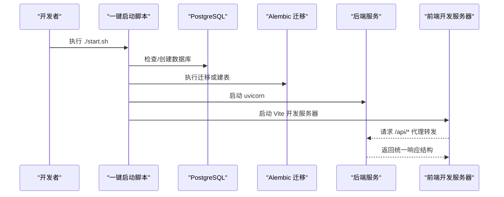
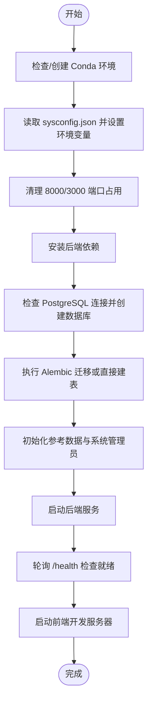
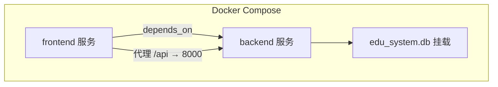
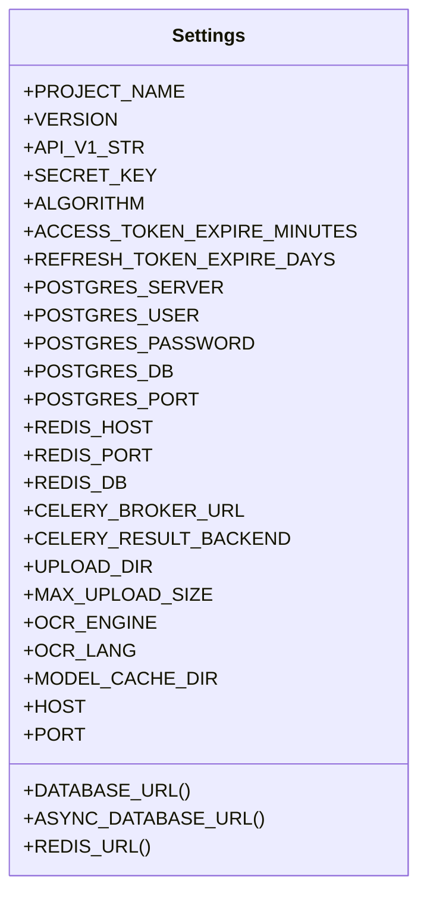
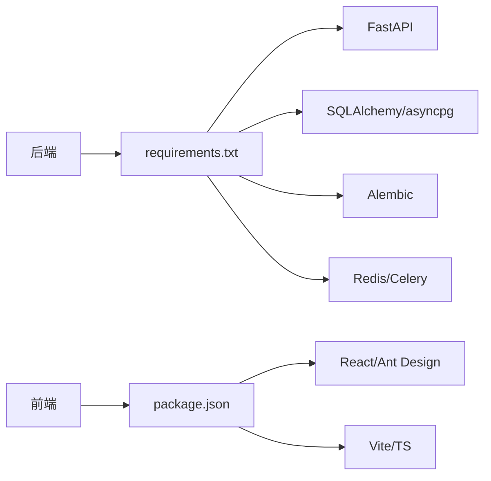

# 快速开始

<cite>
**本文引用的文件**
- [docker-compose.yml](file://docker-compose.yml)
- [start.sh](file://start.sh)
- [backend/Dockerfile](file://backend/Dockerfile)
- [frontend/Dockerfile](file://frontend/Dockerfile)
- [backend/requirements.txt](file://backend/requirements.txt)
- [backend/app/main.py](file://backend/app/main.py)
- [backend/app/core/config.py](file://backend/app/core/config.py)
- [backend/alembic.ini](file://backend/alembic.ini)
- [backend/sysconfig.json](file://backend/sysconfig.json)
- [frontend/package.json](file://frontend/package.json)
- [frontend/vite.config.ts](file://frontend/vite.config.ts)
- [backend/app/seed_reference.py](file://backend/app/seed_reference.py)
- [docs/project-summary.md](file://docs/project-summary.md)
</cite>

## 目录
1. [简介](#简介)
2. [项目结构](#项目结构)
3. [核心组件](#核心组件)
4. [架构总览](#架构总览)
5. [详细组件分析](#详细组件分析)
6. [依赖分析](#依赖分析)
7. [性能考虑](#性能考虑)
8. [故障排查指南](#故障排查指南)
9. [结论](#结论)
10. [附录](#附录)

## 简介
本指南面向新加入的开发者，帮助你在最短时间内完成瑞珹教育管理系统的本地环境搭建与一键启动。内容涵盖系统要求、依赖安装、数据库配置、Docker Compose 部署、开发与生产差异、常见初始化问题与解决方案，以及系统运行验证方法。

## 项目结构
系统由前后端双栈组成，采用统一的一键启动脚本与可选的 Docker Compose 方案：
- 后端：FastAPI + SQLAlchemy（异步）+ Alembic 迁移
- 前端：React 19 + TypeScript + Vite
- 数据库：默认 SQLite（开发），可切换 PostgreSQL
- 缓存与任务：Redis + Celery（可选）
- OCR：Tesseract/PaddleOCR（可选）

```mermaid
graph TB
subgraph "开发环境"
FE["前端应用<br/>Vite 开发服务器"] --> BE["后端 API<br/>FastAPI Uvicorn"]
DB["SQLite/PostgreSQL"] <- --> BE
REDIS["Redis"] -. 可选 .- BE
end
subgraph "容器化部署"
DC["Docker Compose"] --> FESVC["前端服务"]
DC --> BESVC["后端服务"]
BESVC --> DB
BESVC --> REDIS
end
```

图表来源
- [docker-compose.yml:1-33](file://docker-compose.yml#L1-L33)
- [backend/app/main.py:1-52](file://backend/app/main.py#L1-L52)
- [frontend/vite.config.ts:1-17](file://frontend/vite.config.ts#L1-L17)

章节来源
- [docs/project-summary.md:1-87](file://docs/project-summary.md#L1-L87)

## 核心组件
- 后端入口与健康检查
  - 应用入口与路由挂载、CORS、统一响应包装、健康检查接口
- 配置中心
  - 从 sysconfig.json 读取数据库与安全配置，支持环境变量覆盖敏感项
- 数据库与迁移
  - 默认 SQLite（开发），Alembic 支持迁移；也可配置 PostgreSQL
- 前端代理与开发服务器
  - Vite 代理 /api 到后端 8000 端口，热更新开发体验
- 一键启动脚本
  - 自动创建 Conda 环境、安装依赖、检查/初始化数据库、启动前后端并输出访问指引

章节来源
- [backend/app/main.py:1-52](file://backend/app/main.py#L1-L52)
- [backend/app/core/config.py:1-98](file://backend/app/core/config.py#L1-L98)
- [backend/alembic.ini:86-91](file://backend/alembic.ini#L86-L91)
- [frontend/vite.config.ts:1-17](file://frontend/vite.config.ts#L1-L17)
- [start.sh:1-359](file://start.sh#L1-L359)

## 架构总览
下图展示开发与容器化两种启动路径及服务交互：



图表来源
- [start.sh:187-217](file://start.sh#L187-L217)
- [backend/app/main.py:33-52](file://backend/app/main.py#L33-L52)
- [frontend/vite.config.ts:8-13](file://frontend/vite.config.ts#L8-L13)

## 详细组件分析

### 一键启动脚本（start.sh）
- 自动化流程要点
  - 创建/激活 Conda 环境，安装后端依赖（requirements.txt 与额外包）
  - 读取 sysconfig.json 并通过环境变量覆盖敏感配置
  - 检查 PostgreSQL 连接，创建数据库，执行 Alembic 迁移或直接建表
  - 初始化参考数据与系统管理员账号
  - 启动后端（8000）、等待健康检查；启动前端（3000），输出访问地址与默认账号
- 关键行为
  - 健康检查：轮询 /health 接口确认后端就绪
  - 前端等待：轮询前端端口，提示编译状态
  - 信号处理：Ctrl+C 正常关闭前后端进程



图表来源
- [start.sh:63-359](file://start.sh#L63-L359)

章节来源
- [start.sh:1-359](file://start.sh#L1-L359)

### Docker Compose 部署
- 服务定义
  - 后端服务：构建上下文 ./backend，端口映射 8000:8000，挂载代码与 SQLite 文件，设置数据库类型与密钥等环境变量，命令启动 uvicorn
  - 前端服务：构建上下文 ./frontend，端口映射 3000:3000，挂载 src 目录，依赖后端服务，命令启动 npm run dev
- 启动顺序
  - 前端 depends_on: backend，Compose 会先启动后端再启动前端
- 环境变量与配置
  - 后端支持 DATABASE_TYPE、SQLITE_DB_PATH、SECRET_KEY、ALGORITHM、ACCESS_TOKEN_EXPIRE_MINUTES、REFRESH_TOKEN_EXPIRE_DAYS 等
  - 前端通过 Vite 代理将 /api 请求转发至 http://localhost:8000



图表来源
- [docker-compose.yml:3-32](file://docker-compose.yml#L3-L32)

章节来源
- [docker-compose.yml:1-33](file://docker-compose.yml#L1-L33)
- [backend/Dockerfile:1-11](file://backend/Dockerfile#L1-L11)
- [frontend/Dockerfile:1-11](file://frontend/Dockerfile#L1-L11)

### 后端配置与数据库
- 配置加载
  - 优先从 sysconfig.json 读取非敏感配置，敏感项可通过环境变量覆盖
  - 提供 DATABASE_URL 与 ASYNC_DATABASE_URL，支持 PostgreSQL + asyncpg
- 数据库类型
  - 开发默认 SQLite（Alembic 配置中 sqlalchemy.url 指向 sqlite:///./edu_system.db）
  - 生产建议切换为 PostgreSQL（通过环境变量与 sysconfig.json 调整）
- 迁移与建表
  - 优先执行 Alembic 迁移；若失败，回退到直接创建所有表
- 参考数据
  - 启动时幂等插入基础枚举类参考数据



图表来源
- [backend/app/core/config.py:36-98](file://backend/app/core/config.py#L36-L98)

章节来源
- [backend/app/core/config.py:1-98](file://backend/app/core/config.py#L1-L98)
- [backend/alembic.ini:86-91](file://backend/alembic.ini#L86-L91)
- [backend/app/seed_reference.py:1-72](file://backend/app/seed_reference.py#L1-L72)

### 前端开发与代理
- 代理规则
  - 将 /api 前缀请求代理到 http://localhost:8000，便于本地联调
- 依赖与脚本
  - 通过 package.json 管理依赖与脚本，开发时使用 Vite
- 端口
  - 默认 3000，可在 Vite 配置中调整

章节来源
- [frontend/vite.config.ts:1-17](file://frontend/vite.config.ts#L1-L17)
- [frontend/package.json:1-38](file://frontend/package.json#L1-L38)

## 依赖分析
- 后端依赖
  - FastAPI、Uvicorn、SQLAlchemy、asyncpg、Alembic、Pydantic、python-jose、passlib、bcrypt、redis、celery、python-docx、fpdf2、pytesseract、Pillow、pytest、httpx 等
- 前端依赖
  - React、Ant Design、Axios、Day.js、React Router、XLSX、Zustand、Vite、TypeScript、ESLint 等



图表来源
- [backend/requirements.txt:1-27](file://backend/requirements.txt#L1-L27)
- [frontend/package.json:12-36](file://frontend/package.json#L12-L36)

章节来源
- [backend/requirements.txt:1-27](file://backend/requirements.txt#L1-L27)
- [frontend/package.json:1-38](file://frontend/package.json#L1-L38)

## 性能考虑
- 开发阶段
  - 使用 SQLite 降低部署复杂度；如需更贴近生产，可切换 PostgreSQL
  - 前端热更新提升迭代效率；后端 reload 便于调试
- 生产建议
  - 使用 PostgreSQL 替代 SQLite，启用连接池与只读副本
  - 前端构建产物用于生产，后端使用生产 WSGI 服务器
  - Redis 作为缓存与任务队列，Celery 处理异步任务
  - 合理设置 OCR 与判卷并发阈值，避免资源争用

## 故障排查指南
- 端口被占用
  - 一键脚本会尝试清理 8000/3000 端口占用；若失败，手动释放或修改映射端口
- PostgreSQL 连接失败
  - 确认 PostgreSQL 已启动并监听指定主机/端口；检查 sysconfig.json 与环境变量中的数据库配置
  - 若使用 Docker Compose，默认后端服务不包含数据库容器，需自行添加或改为使用 SQLite
- Alembic 迁移失败
  - 脚本会回退到直接建表；如仍失败，检查数据库权限与网络连通性
- 健康检查超时
  - 后端启动后会等待 /health 可达；若超时，查看后端日志定位异常
- 前端无法访问
  - Vite 首次启动需要编译，等待片刻；若长时间不可用，检查代理配置与后端是否可达
- 默认管理员账号
  - 若系统管理员不存在，脚本会自动创建；登录信息会在启动日志中输出

章节来源
- [start.sh:159-332](file://start.sh#L159-L332)
- [backend/app/main.py:50-52](file://backend/app/main.py#L50-L52)

## 结论
通过一键启动脚本与 Docker Compose，你可以快速完成前后端联调与系统验证。开发阶段推荐使用 SQLite 与本地依赖，生产阶段建议切换 PostgreSQL、Redis/Celery，并完善安全与监控配置。遇到问题时，优先检查端口占用、数据库连接与健康检查状态。

## 附录

### 环境要求
- 操作系统：Linux/macOS/Windows（WSL2）
- Python：3.12（Conda 环境由脚本自动创建）
- Node.js：22（随前端镜像安装）
- 数据库：PostgreSQL（生产）或 SQLite（开发）
- 可选：Redis、OCR 依赖（根据功能启用）

章节来源
- [start.sh:63-90](file://start.sh#L63-L90)
- [backend/Dockerfile:1-11](file://backend/Dockerfile#L1-L11)
- [frontend/Dockerfile:1-11](file://frontend/Dockerfile#L1-L11)

### 一键启动流程（开发环境）
- 执行脚本
  - 在仓库根目录执行 ./start.sh，脚本将自动完成环境准备、依赖安装、数据库初始化与服务启动
- 访问地址
  - 前端：http://localhost:3000
  - 后端：http://localhost:8000/docs
  - 管理端登录页：http://localhost:3000/admin/login
- 默认账号
  - 系统管理员：SYSAdmin / SYSPass（首次启动自动生成）

章节来源
- [start.sh:334-356](file://start.sh#L334-L356)

### Docker Compose 部署（开发/演示）
- 启动命令
  - docker-compose up -d
- 服务与端口
  - 后端：8000:8000
  - 前端：3000:3000
- 环境变量
  - DATABASE_TYPE、SQLITE_DB_PATH、SECRET_KEY、ALGORITHM、ACCESS_TOKEN_EXPIRE_MINUTES、REFRESH_TOKEN_EXPIRE_DAYS
- 注意事项
  - 如需 PostgreSQL，需在 compose 中新增数据库服务或挂载外部数据库

章节来源
- [docker-compose.yml:3-32](file://docker-compose.yml#L3-L32)

### 开发环境 vs 生产环境
- 开发环境
  - SQLite + 本地依赖 + 热更新 + 开启调试日志
- 生产环境
  - PostgreSQL + Redis + Celery + 生产 WSGI 服务器 + HTTPS + 严格的密钥与访问控制

章节来源
- [backend/alembic.ini:86-91](file://backend/alembic.ini#L86-L91)
- [backend/app/core/config.py:63-98](file://backend/app/core/config.py#L63-L98)
- [docs/project-summary.md:61-72](file://docs/project-summary.md#L61-L72)