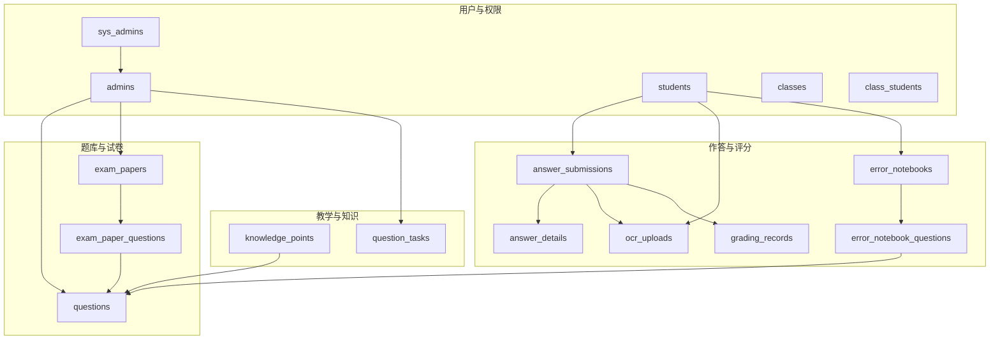
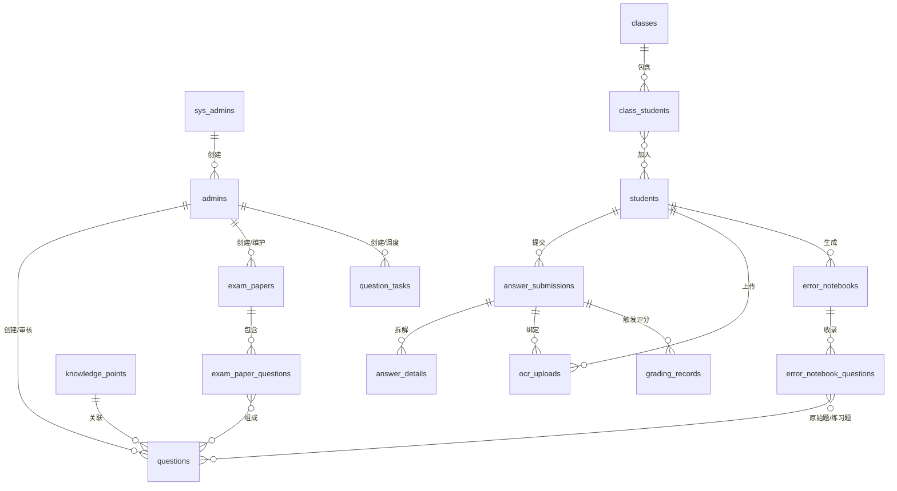

# 实体关系设计

<cite>
**本文引用的文件**
- [backend/app/models/__init__.py](file://backend/app/models/__init__.py)
- [backend/app/models/sys_admin.py](file://backend/app/models/sys_admin.py)
- [backend/app/models/admin.py](file://backend/app/models/admin.py)
- [backend/app/models/student.py](file://backend/app/models/student.py)
- [backend/app/models/school_class.py](file://backend/app/models/school_class.py)
- [backend/app/models/knowledge_point.py](file://backend/app/models/knowledge_point.py)
- [backend/app/models/question.py](file://backend/app/models/question.py)
- [backend/app/models/exam_paper.py](file://backend/app/models/exam_paper.py)
- [backend/app/models/answer_submission.py](file://backend/app/models/answer_submission.py)
- [backend/app/models/answer_detail.py](file://backend/app/models/answer_detail.py)
- [backend/app/models/ocr_upload.py](file://backend/app/models/ocr_upload.py)
- [backend/app/models/grading_record.py](file://backend/app/models/grading_record.py)
- [backend/app/models/error_notebook.py](file://backend/app/models/error_notebook.py)
- [backend/app/models/error_notebook_question.py](file://backend/app/models/error_notebook_question.py)
- [backend/app/models/question_task.py](file://backend/app/models/question_task.py)
- [backend/alembic/versions/001_v22_initial.py](file://backend/alembic/versions/001_v22_initial.py)
</cite>

## 目录
1. [引言](#引言)
2. [项目结构](#项目结构)
3. [核心组件](#核心组件)
4. [架构总览](#架构总览)
5. [详细组件分析](#详细组件分析)
6. [依赖分析](#依赖分析)
7. [性能考虑](#性能考虑)
8. [故障排查指南](#故障排查指南)
9. [结论](#结论)
10. [附录](#附录)

## 引言
本文件面向瑞珹教育管理系统，基于初始数据库架构与模型定义，系统性梳理并文档化实体关系设计。重点覆盖以下方面：
- 实体模型与表结构映射
- 关系类型（一对一、一对多、多对多）
- 外键约束、级联行为与参照完整性
- ER 图与实体关系矩阵
- 数据模型的设计原则与扩展建议

## 项目结构
后端采用 SQLAlchemy ORM 模型组织，实体集中在 models 目录；数据库初始化与演进通过 Alembic 迁移脚本完成。核心模型与对应表如下所示：

图表来源
- [backend/alembic/versions/001_v22_initial.py:10-426](file://backend/alembic/versions/001_v22_initial.py#L10-L426)
- [backend/app/models/sys_admin.py:8-22](file://backend/app/models/sys_admin.py#L8-L22)
- [backend/app/models/admin.py:9-27](file://backend/app/models/admin.py#L9-L27)
- [backend/app/models/student.py:8-23](file://backend/app/models/student.py#L8-L23)
- [backend/app/models/school_class.py:7-39](file://backend/app/models/school_class.py#L7-L39)
- [backend/app/models/knowledge_point.py:7-27](file://backend/app/models/knowledge_point.py#L7-L27)
- [backend/app/models/question.py:10-46](file://backend/app/models/question.py#L10-L46)
- [backend/app/models/exam_paper.py:23-51](file://backend/app/models/exam_paper.py#L23-L51)
- [backend/app/models/answer_submission.py:9-37](file://backend/app/models/answer_submission.py#L9-L37)
- [backend/app/models/answer_detail.py:9-33](file://backend/app/models/answer_detail.py#L9-L33)
- [backend/app/models/ocr_upload.py:8-36](file://backend/app/models/ocr_upload.py#L8-L36)
- [backend/app/models/grading_record.py:8-31](file://backend/app/models/grading_record.py#L8-L31)
- [backend/app/models/error_notebook.py:8-32](file://backend/app/models/error_notebook.py#L8-L32)
- [backend/app/models/error_notebook_question.py:8-29](file://backend/app/models/error_notebook_question.py#L8-L29)

章节来源
- [backend/app/models/__init__.py:1-34](file://backend/app/models/__init__.py#L1-L34)
- [backend/alembic/versions/001_v22_initial.py:10-426](file://backend/alembic/versions/001_v22_initial.py#L10-L426)

## 核心组件
本节聚焦关键实体及其职责与约束要点：
- 系统管理员：sys_admins，用于系统级账号管理，不可删除
- 管理员：admins，由系统管理员创建，负责题库、试卷与任务管理
- 学生：students，自注册用户，参与答题与错题本生成
- 班级：classes，教师管理班级，学生加入班级
- 知识点：knowledge_points，支持父子层级与学科/年级维度
- 题目：questions，包含题目元数据、难度、分值、来源与审核状态
- 试卷：exam_papers，包含状态、时长、总分等，并与题目建立多对多关系
- 作答提交：answer_submissions，记录学生提交、OCR上传、评分状态
- 作答详情：answer_details，按题记录得分与反馈
- OCR 上传：ocr_uploads，记录扫描文件与处理结果
- 评分记录：grading_records，记录评分过程与结果
- 错题本：error_notebooks，按学生与试卷生成，记录错题与练习题
- 错题本题目：error_notebook_questions，记录原始题与练习题映射
- 题目任务：question_tasks，异步任务调度与进度跟踪

章节来源
- [backend/app/models/sys_admin.py:8-22](file://backend/app/models/sys_admin.py#L8-L22)
- [backend/app/models/admin.py:9-27](file://backend/app/models/admin.py#L9-L27)
- [backend/app/models/student.py:8-23](file://backend/app/models/student.py#L8-L23)
- [backend/app/models/school_class.py:7-39](file://backend/app/models/school_class.py#L7-L39)
- [backend/app/models/knowledge_point.py:7-27](file://backend/app/models/knowledge_point.py#L7-L27)
- [backend/app/models/question.py:10-46](file://backend/app/models/question.py#L10-L46)
- [backend/app/models/exam_paper.py:23-51](file://backend/app/models/exam_paper.py#L23-L51)
- [backend/app/models/answer_submission.py:9-37](file://backend/app/models/answer_submission.py#L9-L37)
- [backend/app/models/answer_detail.py:9-33](file://backend/app/models/answer_detail.py#L9-L33)
- [backend/app/models/ocr_upload.py:8-36](file://backend/app/models/ocr_upload.py#L8-L36)
- [backend/app/models/grading_record.py:8-31](file://backend/app/models/grading_record.py#L8-L31)
- [backend/app/models/error_notebook.py:8-32](file://backend/app/models/error_notebook.py#L8-L32)
- [backend/app/models/error_notebook_question.py:8-29](file://backend/app/models/error_notebook_question.py#L8-L29)
- [backend/app/models/question_task.py:8-25](file://backend/app/models/question_task.py#L8-L25)

## 架构总览
下图展示核心实体间的关系映射与流向，涵盖用户、教学、题库、试卷、作答与评分、错题本等模块。

图表来源
- [backend/alembic/versions/001_v22_initial.py:10-426](file://backend/alembic/versions/001_v22_initial.py#L10-L426)
- [backend/app/models/sys_admin.py:8-22](file://backend/app/models/sys_admin.py#L8-L22)
- [backend/app/models/admin.py:9-27](file://backend/app/models/admin.py#L9-L27)
- [backend/app/models/student.py:8-23](file://backend/app/models/student.py#L8-L23)
- [backend/app/models/school_class.py:7-39](file://backend/app/models/school_class.py#L7-L39)
- [backend/app/models/knowledge_point.py:7-27](file://backend/app/models/knowledge_point.py#L7-L27)
- [backend/app/models/question.py:10-46](file://backend/app/models/question.py#L10-L46)
- [backend/app/models/exam_paper.py:23-51](file://backend/app/models/exam_paper.py#L23-L51)
- [backend/app/models/answer_submission.py:9-37](file://backend/app/models/answer_submission.py#L9-L37)
- [backend/app/models/answer_detail.py:9-33](file://backend/app/models/answer_detail.py#L9-L33)
- [backend/app/models/ocr_upload.py:8-36](file://backend/app/models/ocr_upload.py#L8-L36)
- [backend/app/models/grading_record.py:8-31](file://backend/app/models/grading_record.py#L8-L31)
- [backend/app/models/error_notebook.py:8-32](file://backend/app/models/error_notebook.py#L8-L32)
- [backend/app/models/error_notebook_question.py:8-29](file://backend/app/models/error_notebook_question.py#L8-L29)

## 详细组件分析

### 用户与权限实体
- sys_admins：系统内置管理员，唯一用户名，不可删除
- admins：管理员账户，由 sys_admins 创建，区分角色类型与学科/年级范围
- students：学生账户，自注册，记录基础信息与登录时间
- classes/class_students：班级与学生加入关系，实现一对多到多对多的过渡

章节来源
- [backend/app/models/sys_admin.py:8-22](file://backend/app/models/sys_admin.py#L8-L22)
- [backend/app/models/admin.py:9-27](file://backend/app/models/admin.py#L9-L27)
- [backend/app/models/student.py:8-23](file://backend/app/models/student.py#L8-L23)
- [backend/app/models/school_class.py:7-39](file://backend/app/models/school_class.py#L7-L39)
- [backend/alembic/versions/001_v22_initial.py:11-75](file://backend/alembic/versions/001_v22_initial.py#L11-L75)

### 教学与知识实体
- knowledge_points：知识点树形结构，支持父子继承与学科/年级索引
- question_tasks：题目相关异步任务，记录进度与结果

章节来源
- [backend/app/models/knowledge_point.py:7-27](file://backend/app/models/knowledge_point.py#L7-L27)
- [backend/app/models/question_task.py:8-25](file://backend/app/models/question_task.py#L8-L25)
- [backend/alembic/versions/001_v22_initial.py:77-170](file://backend/alembic/versions/001_v22_initial.py#L77-L170)

### 题库与试卷实体
- questions：题目主表，包含类型、难度、分值、来源、审核状态与创建者
- exam_papers：试卷表，含状态、总分、时长、创建者
- exam_paper_questions：多对多关联表，记录位置与分数权重

章节来源
- [backend/app/models/question.py:10-46](file://backend/app/models/question.py#L10-L46)
- [backend/app/models/exam_paper.py:23-51](file://backend/app/models/exam_paper.py#L23-L51)
- [backend/alembic/versions/001_v22_initial.py:102-151](file://backend/alembic/versions/001_v22_initial.py#L102-L151)

### 作答与评分实体
- answer_submissions：作答提交，关联学生、试卷、OCR 上传，记录状态与得分
- answer_details：按题作答详情，记录正确性、得分与反馈
- ocr_uploads：OCR 文件上传与处理结果
- grading_records：评分记录，记录模型、状态与结果

章节来源
- [backend/app/models/answer_submission.py:9-37](file://backend/app/models/answer_submission.py#L9-L37)
- [backend/app/models/answer_detail.py:9-33](file://backend/app/models/answer_detail.py#L9-L33)
- [backend/app/models/ocr_upload.py:8-36](file://backend/app/models/ocr_upload.py#L8-L36)
- [backend/app/models/grading_record.py:8-31](file://backend/app/models/grading_record.py#L8-L31)
- [backend/alembic/versions/001_v22_initial.py:194-244](file://backend/alembic/versions/001_v22_initial.py#L194-L244)

### 错题本实体
- error_notebooks：按学生与试卷生成的错题本，记录状态与题目数量
- error_notebook_questions：错题本中的题目条目，支持原始题与练习题映射

章节来源
- [backend/app/models/error_notebook.py:8-32](file://backend/app/models/error_notebook.py#L8-L32)
- [backend/app/models/error_notebook_question.py:8-29](file://backend/app/models/error_notebook_question.py#L8-L29)
- [backend/alembic/versions/001_v22_initial.py:246-271](file://backend/alembic/versions/001_v22_initial.py#L246-L271)

## 依赖分析
- 外键依赖链
  - sys_admins → admins：admins.created_by
  - admins → questions / exam_papers / question_tasks：创建者
  - students → answer_submissions / ocr_uploads / error_notebooks：主体
  - exam_papers ↔ questions：通过 exam_paper_questions 关联
  - answer_submissions → answer_details / ocr_uploads / grading_records：下游实体
  - error_notebooks → error_notebook_questions：包含关系
  - error_notebook_questions → questions：原始题/练习题
  - knowledge_points → questions：知识点关联
  - classes → class_students：班级-学生关系
- 级联与参照完整性
  - 迁移脚本未显式声明 ON DELETE CASCADE，因此默认为 RESTRICT 或类似策略（需结合数据库默认行为确认）。在业务层应避免直接删除被引用的主记录，防止违反外键约束。
- 索引与唯一性
  - 多处字段设置唯一约束或唯一组合约束，如 usernames、question-knowledge_point 唯一、enq 原始题唯一等，确保数据一致性。

章节来源
- [backend/alembic/versions/001_v22_initial.py:10-426](file://backend/alembic/versions/001_v22_initial.py#L10-L426)

## 性能考虑
- 查询热点与索引
  - questions.subject、questions.is_active、questions.content_hash、exam_papers.status、answer_submissions.student_id、ocr_uploads.exam_paper_id 等字段在模型中已建立索引或查询条件使用频繁，建议在生产环境保持相应数据库索引以优化查询。
- 关联查询
  - 多对多关系通过中间表连接，建议在批量读取时使用 selectin 加载策略，减少 N+1 查询。
- 分页与过滤
  - 对于大表（如 questions、answer_submissions），建议在接口层增加分页与条件过滤，避免一次性加载过多数据。
- 写入压力
  - 评分与 OCR 流程可能产生大量写入，建议在业务层进行幂等控制与批量入库优化。

## 故障排查指南
- 常见约束错误
  - 作答详情：score_obtained 非负检查
  - 作答提交：submission_type 与 status 枚举校验
  - 试卷：total_score 与 duration_minutes 非负检查
  - 题目：score 正数、类型与难度枚举校验
  - OCR 上传：file_size 正数、状态枚举校验
  - 错题本：question_count 非负、状态枚举校验
  - 评分记录：状态枚举校验
- 外键冲突
  - 删除被引用记录会因外键约束失败。请先清理下游实体（如答案、评分、错题本条目）后再删除上游记录。
- 数据不一致
  - 多对多中间表（如 exam_paper_questions）的 position/score 字段需保证非负；若出现异常，请检查上游写入逻辑与迁移脚本。

章节来源
- [backend/app/models/answer_detail.py:23-27](file://backend/app/models/answer_detail.py#L23-L27)
- [backend/app/models/answer_submission.py:27-31](file://backend/app/models/answer_submission.py#L27-L31)
- [backend/app/models/exam_paper.py:44-48](file://backend/app/models/exam_paper.py#L44-L48)
- [backend/app/models/question.py:38-43](file://backend/app/models/question.py#L38-L43)
- [backend/app/models/ocr_upload.py:29-33](file://backend/app/models/ocr_upload.py#L29-L33)
- [backend/app/models/error_notebook.py:22-26](file://backend/app/models/error_notebook.py#L22-L26)
- [backend/app/models/grading_record.py:25-28](file://backend/app/models/grading_record.py#L25-L28)

## 结论
本设计以“用户—教学—题库—试卷—作答—评分—错题本”为主线，构建了清晰的实体关系与约束体系。通过中间表实现多对多关联，配合外键与枚举约束保障数据完整性。建议在后续迭代中持续完善索引策略、批量写入与幂等控制，以提升系统整体性能与稳定性。

## 附录

### 实体关系矩阵（示例）
以下为部分核心实体关系矩阵示意（仅展示关键字段与关系方向）：

- sys_admins → admins：1 对多（admins.created_by）
- admins → questions：1 对多（created_by）
- admins → exam_papers：1 对多（created_by）
- students → answer_submissions：1 对多
- students → ocr_uploads：1 对多
- students → error_notebooks：1 对多
- classes → class_students：1 对多
- class_students → students：多对1
- exam_papers ↔ questions：多对多（通过 exam_paper_questions）
- answer_submissions → answer_details：1 对多
- answer_submissions → ocr_uploads：多对1（可选）
- answer_submissions → grading_records：1 对多
- error_notebooks → error_notebook_questions：1 对多
- error_notebook_questions → questions：多对1（原始题/练习题）

章节来源
- [backend/alembic/versions/001_v22_initial.py:10-426](file://backend/alembic/versions/001_v22_initial.py#L10-L426)
- [backend/app/models/admin.py:22-22](file://backend/app/models/admin.py#L22-L22)
- [backend/app/models/question.py:28-28](file://backend/app/models/question.py#L28-L28)
- [backend/app/models/exam_paper.py:36-36](file://backend/app/models/exam_paper.py#L36-L36)
- [backend/app/models/answer_submission.py:13-14](file://backend/app/models/answer_submission.py#L13-L14)
- [backend/app/models/ocr_upload.py:12-13](file://backend/app/models/ocr_upload.py#L12-L13)
- [backend/app/models/error_notebook.py:12-15](file://backend/app/models/error_notebook.py#L12-L15)
- [backend/app/models/school_class.py:13-13](file://backend/app/models/school_class.py#L13-L13)
- [backend/app/models/exam_paper.py:14-15](file://backend/app/models/exam_paper.py#L14-L15)
- [backend/app/models/answer_detail.py:13-14](file://backend/app/models/answer_detail.py#L13-L14)
- [backend/app/models/grading_record.py:12-12](file://backend/app/models/grading_record.py#L12-L12)
- [backend/app/models/error_notebook_question.py:12-14](file://backend/app/models/error_notebook_question.py#L12-L14)