# 数据库设计

<cite>
**本文引用的文件**
- [backend/app/db/base.py](file://backend/app/db/base.py)
- [backend/app/models/__init__.py](file://backend/app/models/__init__.py)
- [backend/alembic/env.py](file://backend/alembic/env.py)
- [backend/alembic/script.py.mako](file://backend/alembic/script.py.mako)
- [backend/alembic/versions/001_v22_initial.py](file://backend/alembic/versions/001_v22_initial.py)
- [backend/alembic/versions/002_add_provinces_table.py](file://backend/alembic/versions/002_add_provinces_table.py)
- [backend/alembic/versions/003_add_is_typical.py](file://backend/alembic/versions/003_add_is_typical.py)
- [backend/alembic/versions/004_simplify_submission_status.py](file://backend/alembic/versions/004_simplify_submission_status.py)
- [backend/alembic/versions/005_add_ocr_needs_review_status.py](file://backend/alembic/versions/005_add_ocr_needs_review_status.py)
- [backend/alembic/versions/006_add_content_hash_to_questions.py](file://backend/alembic/versions/006_add_content_hash_to_questions.py)
- [backend/app/models/question.py](file://backend/app/models/question.py)
- [backend/app/models/exam_paper.py](file://backend/app/models/exam_paper.py)
- [backend/app/models/knowledge_node.py](file://backend/app/models/knowledge_node.py)
- [backend/app/models/syllabus.py](file://backend/app/models/syllabus.py)
- [backend/app/models/answer_submission.py](file://backend/app/models/answer_submission.py)
- [backend/app/models/error_notebook.py](file://backend/app/models/error_notebook.py)
- [backend/app/models/knowledge_point.py](file://backend/app/models/knowledge_point.py)
- [backend/app/models/student.py](file://backend/app/models/student.py)
- [backend/app/models/admin.py](file://backend/app/models/admin.py)
</cite>

## 目录
1. [简介](#简介)
2. [项目结构](#项目结构)
3. [核心组件](#核心组件)
4. [架构总览](#架构总览)
5. [详细组件分析](#详细组件分析)
6. [依赖分析](#依赖分析)
7. [性能考虑](#性能考虑)
8. [故障排查指南](#故障排查指南)
9. [结论](#结论)
10. [附录](#附录)

## 简介
本文件为“瑞珹教育管理系统”的数据库设计与实现文档，聚焦于系统的核心数据模型、ER 实体关系图、表结构与关系映射、主键/外键约束、索引策略、数据完整性规则、数据库迁移管理（Alembic）、数据访问模式与缓存策略、数据验证与业务规则、以及数据安全与访问控制机制。文档以代码为依据，结合迁移脚本与模型定义，形成可追溯、可维护、可演进的数据库设计方案。

## 项目结构
后端采用 SQLAlchemy 声明式 ORM，统一基类定义命名规范；所有模型在初始化时集中注册，供 Alembic 迁移识别；迁移版本通过脚手架模板生成，确保版本演进有序可控。

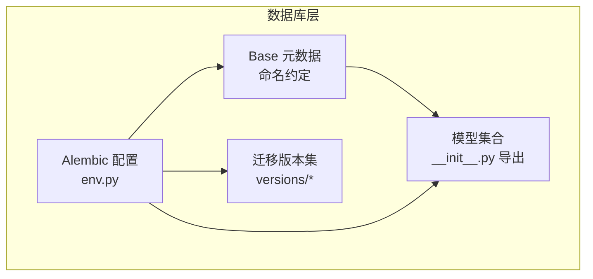

**图表来源**
- [backend/app/db/base.py:1-21](file://backend/app/db/base.py#L1-L21)
- [backend/app/models/__init__.py:1-34](file://backend/app/models/__init__.py#L1-L34)
- [backend/alembic/env.py:1-80](file://backend/alembic/env.py#L1-L80)
- [backend/alembic/script.py.mako:1-29](file://backend/alembic/script.py.mako#L1-L29)

**章节来源**
- [backend/app/db/base.py:1-21](file://backend/app/db/base.py#L1-L21)
- [backend/app/models/__init__.py:1-34](file://backend/app/models/__init__.py#L1-L34)
- [backend/alembic/env.py:1-80](file://backend/alembic/env.py#L1-L80)
- [backend/alembic/script.py.mako:1-29](file://backend/alembic/script.py.mako#L1-L29)

## 核心组件
- 统一基类与命名约定：定义约束命名前缀（索引、唯一、检查、外键、主键），保证数据库对象命名一致性。
- 模型注册：集中导出所有模型，确保 Alembic 能扫描到全部表结构。
- 迁移配置：从配置读取数据库连接串，支持离线/在线迁移；目标元数据指向 Base.metadata。
- 初始版本：完整重建初始 schema，包含用户、班级、知识点、题目、试卷、答题、评分、错题本、通知、教学大纲、任务等核心表。

**章节来源**
- [backend/app/db/base.py:5-18](file://backend/app/db/base.py#L5-L18)
- [backend/app/models/__init__.py:27-34](file://backend/app/models/__init__.py#L27-L34)
- [backend/alembic/env.py:15-31](file://backend/alembic/env.py#L15-L31)
- [backend/alembic/versions/001_v22_initial.py:10-426](file://backend/alembic/versions/001_v22_initial.py#L10-L426)

## 架构总览
系统数据库采用关系型设计，围绕“用户—班级—教学大纲—知识点—题目—试卷—答题—评分—错题本—通知—任务”构建核心业务闭环。下图展示关键实体与关系：

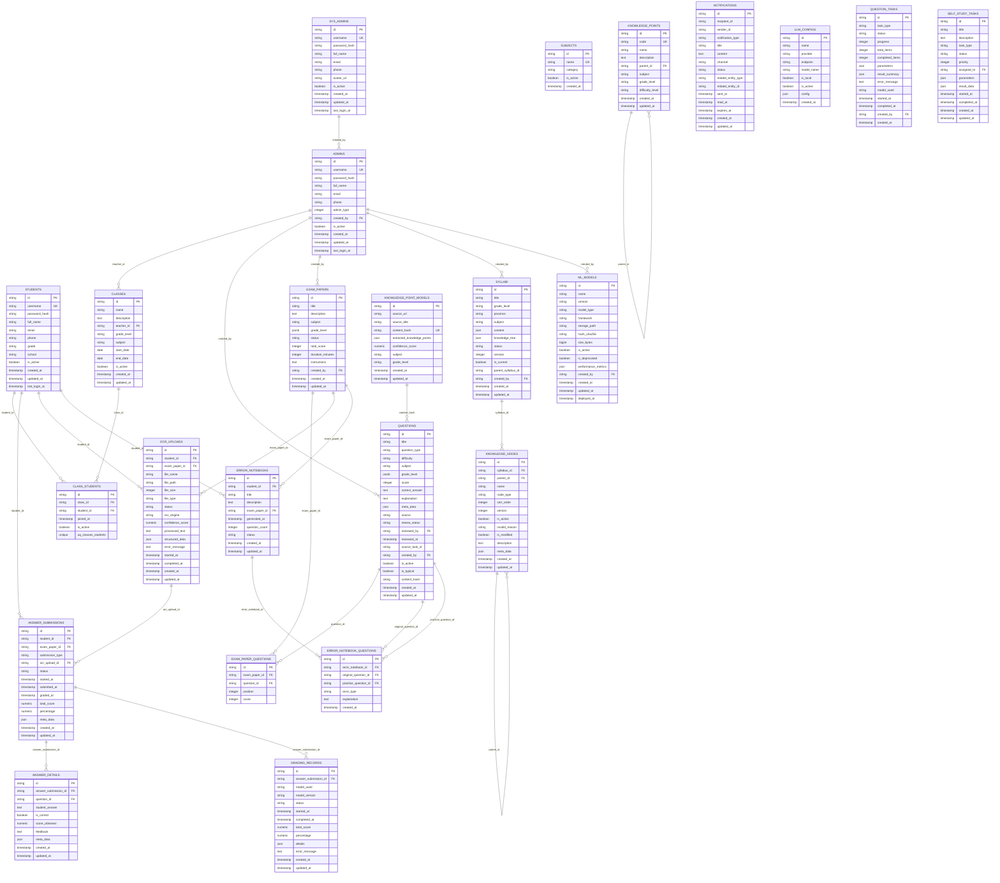

**图表来源**
- [backend/alembic/versions/001_v22_initial.py:10-426](file://backend/alembic/versions/001_v22_initial.py#L10-L426)
- [backend/app/models/exam_paper.py:9-20](file://backend/app/models/exam_paper.py#L9-L20)
- [backend/app/models/question.py:10-46](file://backend/app/models/question.py#L10-L46)
- [backend/app/models/answer_submission.py:9-37](file://backend/app/models/answer_submission.py#L9-L37)
- [backend/app/models/error_notebook.py:8-32](file://backend/app/models/error_notebook.py#L8-L32)
- [backend/app/models/knowledge_point.py:7-27](file://backend/app/models/knowledge_point.py#L7-L27)
- [backend/app/models/knowledge_node.py:9-26](file://backend/app/models/knowledge_node.py#L9-L26)
- [backend/app/models/syllabus.py:9-26](file://backend/app/models/syllabus.py#L9-L26)
- [backend/app/models/student.py:8-23](file://backend/app/models/student.py#L8-L23)
- [backend/app/models/admin.py:9-27](file://backend/app/models/admin.py#L9-L27)

## 详细组件分析

### 用户与角色模型
- 学生（STUDENTS）：自注册用户，具备基础信息与激活状态，用于参与答题与学习。
- 管理员（ADMINS）：由系统管理员创建，区分教师、题库管理员等类型，具备学科与年级范围。
- 系统管理员（SYS_ADMINS）：最高权限用户，负责创建其他管理员。

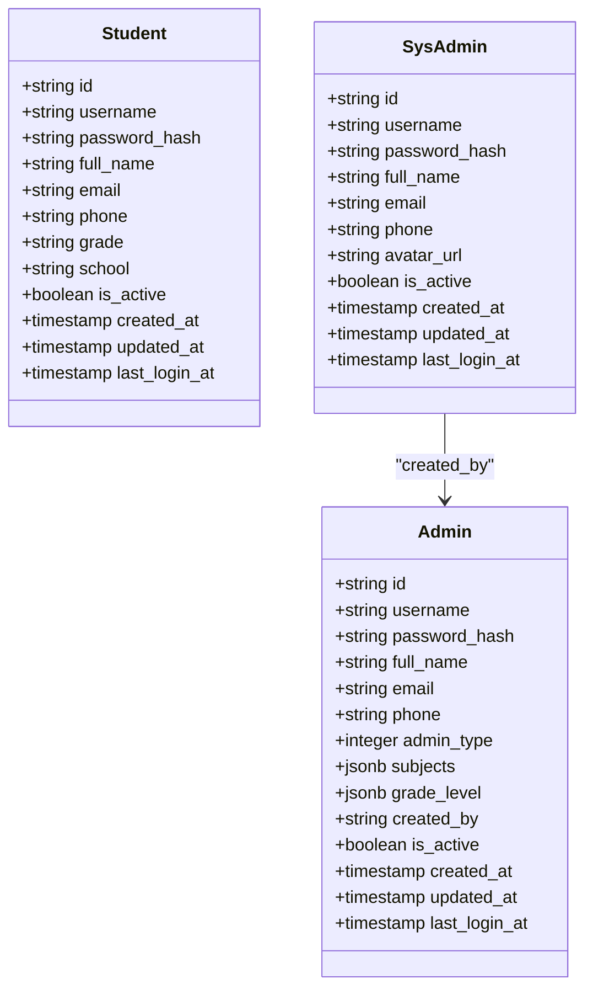

**图表来源**
- [backend/app/models/student.py:8-23](file://backend/app/models/student.py#L8-L23)
- [backend/app/models/admin.py:9-27](file://backend/app/models/admin.py#L9-L27)
- [backend/alembic/versions/001_v22_initial.py:11-59](file://backend/alembic/versions/001_v22_initial.py#L11-L59)

**章节来源**
- [backend/app/models/student.py:8-23](file://backend/app/models/student.py#L8-L23)
- [backend/app/models/admin.py:9-27](file://backend/app/models/admin.py#L9-L27)
- [backend/alembic/versions/001_v22_initial.py:11-59](file://backend/alembic/versions/001_v22_initial.py#L11-L59)

### 班级与分组
- 班级（CLASSES）：记录教师、年级、科目、起止日期等，作为教学组织单位。
- 班级-学生关联（CLASS_STUDENTS）：多对多中间表，唯一约束防止重复加入。

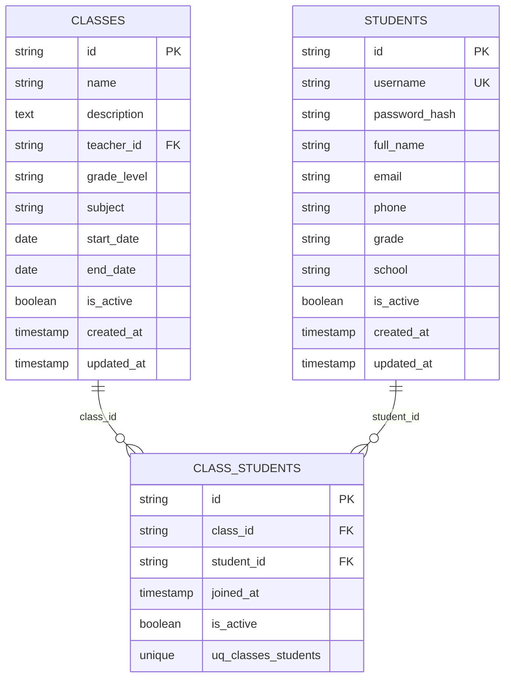

**图表来源**
- [backend/alembic/versions/001_v22_initial.py:61-161](file://backend/alembic/versions/001_v22_initial.py#L61-L161)

**章节来源**
- [backend/alembic/versions/001_v22_initial.py:61-161](file://backend/alembic/versions/001_v22_initial.py#L61-L161)

### 教学大纲与知识树
- 教学大纲（SYLLABI）：记录标题、地区、学科、内容与知识树结构，支持版本与当前状态。
- 知识节点（KNOWLEDGE_NODES）：按教学大纲分层组织，支持父子关系与版本控制。

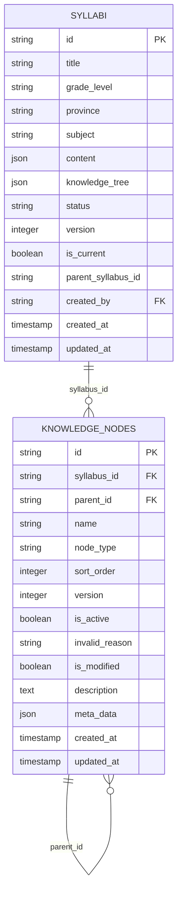

**图表来源**
- [backend/app/models/syllabus.py:9-26](file://backend/app/models/syllabus.py#L9-L26)
- [backend/app/models/knowledge_node.py:9-26](file://backend/app/models/knowledge_node.py#L9-L26)
- [backend/alembic/versions/001_v22_initial.py:307-362](file://backend/alembic/versions/001_v22_initial.py#L307-L362)

**章节来源**
- [backend/app/models/syllabus.py:9-26](file://backend/app/models/syllabus.py#L9-L26)
- [backend/app/models/knowledge_node.py:9-26](file://backend/app/models/knowledge_node.py#L9-L26)
- [backend/alembic/versions/001_v22_initial.py:307-362](file://backend/alembic/versions/001_v22_initial.py#L307-L362)

### 知识点与题目
- 知识点（KNOWLEDGE_POINTS）：唯一编码、层级父子关系、学科与年级索引。
- 题目（QUESTIONS）：类型、难度、分数、来源、审核状态、创建者、激活状态、典型标记与内容哈希。

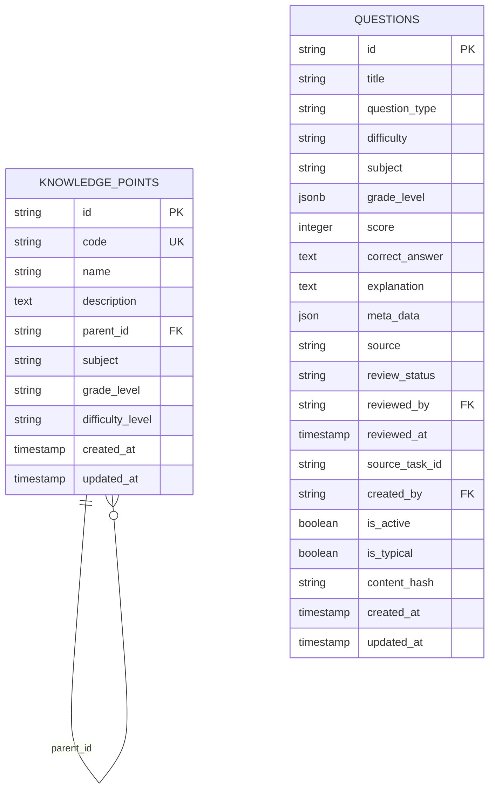

**图表来源**
- [backend/app/models/knowledge_point.py:7-27](file://backend/app/models/knowledge_point.py#L7-L27)
- [backend/app/models/question.py:10-46](file://backend/app/models/question.py#L10-L46)
- [backend/alembic/versions/001_v22_initial.py:77-124](file://backend/alembic/versions/001_v22_initial.py#L77-L124)

**章节来源**
- [backend/app/models/knowledge_point.py:7-27](file://backend/app/models/knowledge_point.py#L7-L27)
- [backend/app/models/question.py:10-46](file://backend/app/models/question.py#L10-L46)
- [backend/alembic/versions/001_v22_initial.py:77-124](file://backend/alembic/versions/001_v22_initial.py#L77-L124)

### 试卷与题目关联
- 试卷（EXAM_PAPERS）：状态、总分、时长、说明、创建者。
- 关联表（EXAM_PAPER_QUESTIONS）：记录题目在试卷中的顺序与分值。

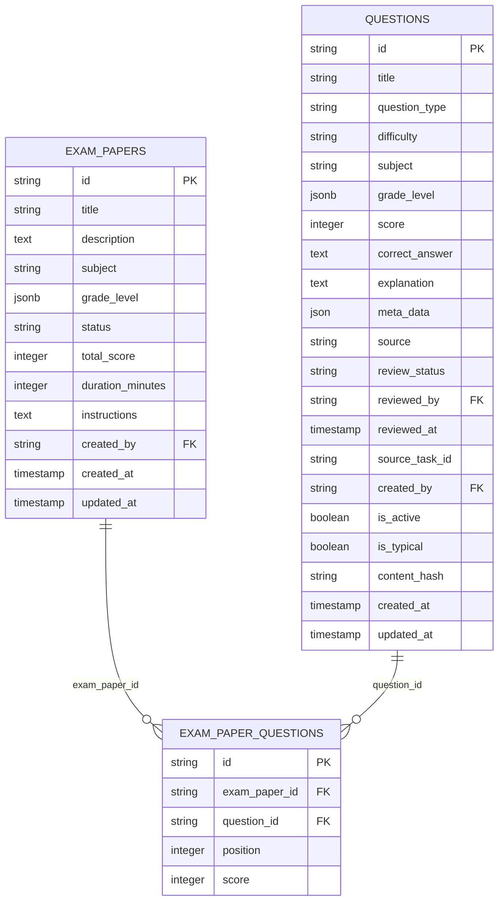

**图表来源**
- [backend/app/models/exam_paper.py:23-51](file://backend/app/models/exam_paper.py#L23-L51)
- [backend/app/models/question.py:36-36](file://backend/app/models/question.py#L36-L36)
- [backend/alembic/versions/001_v22_initial.py:126-151](file://backend/alembic/versions/001_v22_initial.py#L126-L151)

**章节来源**
- [backend/app/models/exam_paper.py:23-51](file://backend/app/models/exam_paper.py#L23-L51)
- [backend/app/models/question.py:36-36](file://backend/app/models/question.py#L36-L36)
- [backend/alembic/versions/001_v22_initial.py:126-151](file://backend/alembic/versions/001_v22_initial.py#L126-L151)

### 答题与评分
- 答题提交（ANSWER_SUBMISSIONS）：支持在线与 OCR 提交方式，记录开始、提交、评分时间与结果。
- 答题详情（ANSWER_DETAILS）：每题作答、正确性、得分与反馈。
- 评分记录（GRADING_RECORDS）：评分引擎使用、状态与明细。

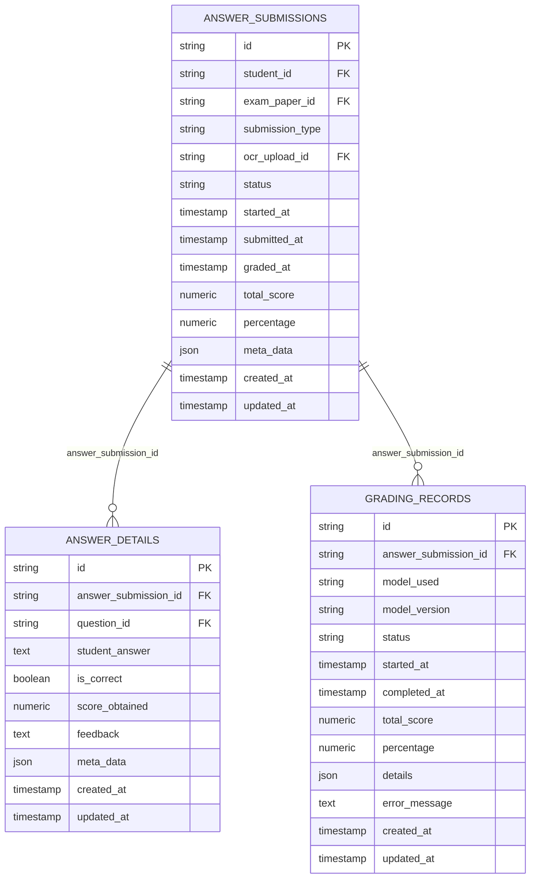

**图表来源**
- [backend/app/models/answer_submission.py:9-37](file://backend/app/models/answer_submission.py#L9-L37)
- [backend/alembic/versions/001_v22_initial.py:194-244](file://backend/alembic/versions/001_v22_initial.py#L194-L244)

**章节来源**
- [backend/app/models/answer_submission.py:9-37](file://backend/app/models/answer_submission.py#L9-L37)
- [backend/alembic/versions/001_v22_initial.py:194-244](file://backend/alembic/versions/001_v22_initial.py#L194-L244)

### OCR 上传与错题本
- OCR 上传（OCR_UPLOADS）：记录文件元数据、处理状态、置信度与结构化结果。
- 错题本（ERROR_NOTEBOOKS）：按学生与试卷生成，记录错题与练习题映射。

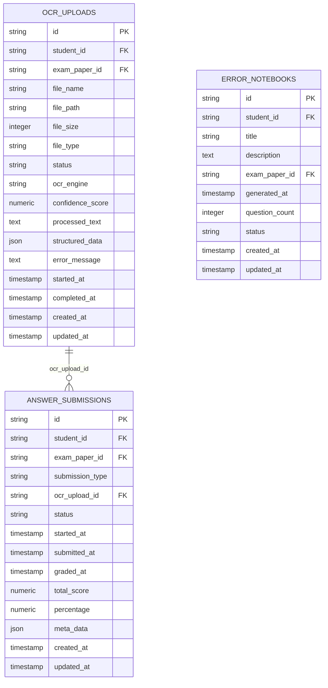

**图表来源**
- [backend/alembic/versions/001_v22_initial.py:172-192](file://backend/alembic/versions/001_v22_initial.py#L172-L192)
- [backend/alembic/versions/001_v22_initial.py:246-271](file://backend/alembic/versions/001_v22_initial.py#L246-L271)

**章节来源**
- [backend/alembic/versions/001_v22_initial.py:172-192](file://backend/alembic/versions/001_v22_initial.py#L172-L192)
- [backend/alembic/versions/001_v22_initial.py:246-271](file://backend/alembic/versions/001_v22_initial.py#L246-L271)

### 通知与任务
- 通知（NOTIFICATIONS）：多渠道发送、过期与已读追踪。
- 自主学习任务（SELF_STUDY_TASKS）：任务类型、优先级、参数与结果。
- 问题任务（QUESTION_TASKS）：采集、清洗、标注等异步任务。
- 知识点模型（KNOWLEDGE_POINT_MODELS）：内容哈希唯一，抽取的知识点与置信度。
- 机器学习模型（ML_MODELS）：版本化存储与部署追踪。

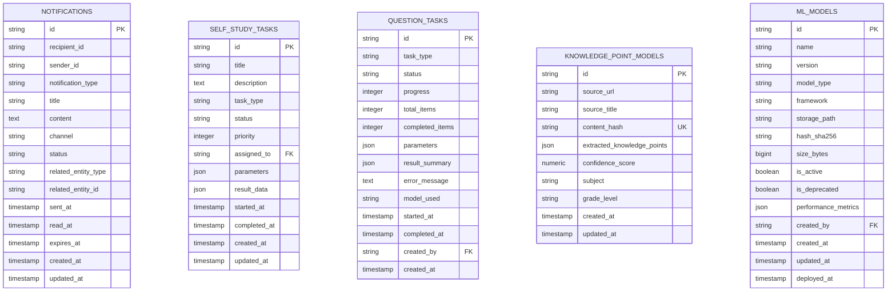

**图表来源**
- [backend/alembic/versions/001_v22_initial.py:273-324](file://backend/alembic/versions/001_v22_initial.py#L273-L324)
- [backend/alembic/versions/001_v22_initial.py:399-415](file://backend/alembic/versions/001_v22_initial.py#L399-L415)
- [backend/alembic/versions/001_v22_initial.py:364-377](file://backend/alembic/versions/001_v22_initial.py#L364-L377)
- [backend/alembic/versions/001_v22_initial.py:379-397](file://backend/alembic/versions/001_v22_initial.py#L379-L397)

**章节来源**
- [backend/alembic/versions/001_v22_initial.py:273-324](file://backend/alembic/versions/001_v22_initial.py#L273-L324)
- [backend/alembic/versions/001_v22_initial.py:399-415](file://backend/alembic/versions/001_v22_initial.py#L399-L415)
- [backend/alembic/versions/001_v22_initial.py:364-377](file://backend/alembic/versions/001_v22_initial.py#L364-L377)
- [backend/alembic/versions/001_v22_initial.py:379-397](file://backend/alembic/versions/001_v22_initial.py#L379-L397)

## 依赖分析
- Alembic 通过 env.py 将 Base.metadata 注入上下文，扫描 app/models 下所有模型，确保迁移覆盖全量表。
- 版本脚本遵循脚手架模板，升级/降级逻辑清晰，便于回滚与重放。
- 模型间外键关系在迁移中显式声明，保证引用完整性。

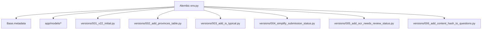

**图表来源**
- [backend/alembic/env.py:7-31](file://backend/alembic/env.py#L7-L31)
- [backend/app/models/__init__.py:1-34](file://backend/app/models/__init__.py#L1-L34)
- [backend/alembic/versions/001_v22_initial.py:10-426](file://backend/alembic/versions/001_v22_initial.py#L10-L426)
- [backend/alembic/versions/002_add_provinces_table.py](file://backend/alembic/versions/002_add_provinces_table.py)
- [backend/alembic/versions/003_add_is_typical.py](file://backend/alembic/versions/003_add_is_typical.py)
- [backend/alembic/versions/004_simplify_submission_status.py](file://backend/alembic/versions/004_simplify_submission_status.py)
- [backend/alembic/versions/005_add_ocr_needs_review_status.py](file://backend/alembic/versions/005_add_ocr_needs_review_status.py)
- [backend/alembic/versions/006_add_content_hash_to_questions.py](file://backend/alembic/versions/006_add_content_hash_to_questions.py)

**章节来源**
- [backend/alembic/env.py:7-31](file://backend/alembic/env.py#L7-L31)
- [backend/app/models/__init__.py:1-34](file://backend/app/models/__init__.py#L1-L34)
- [backend/alembic/versions/001_v22_initial.py:10-426](file://backend/alembic/versions/001_v22_initial.py#L10-L426)

## 性能考虑
- 索引策略
  - 多处字段建立索引以提升查询效率：如题目 subject、created_by、is_active、is_typical、content_hash；试卷 subject、created_by；知识点 code、subject、grade_level、parent_id；答题提交 student_id、exam_paper_id、ocr_upload_id；错题本 student_id、exam_paper_id；通知 recipient_id、related_entity_id。
  - 唯一约束用于强一致：用户名唯一、知识点编码唯一、内容哈希唯一、班级-学生组合唯一。
- 数据类型选择
  - JSON/JSONB 用于灵活结构化数据存储；Numeric 用于精确分数计算；Boolean 用于开关与状态位。
- 约束与校验
  - 使用 CheckConstraint 对枚举值与非负数进行约束，减少脏数据进入。
- 缓存策略
  - 建议在应用层对高频查询（如教学大纲、知识点树、用户权限）引入缓存；对静态资源（如学科、难度等级）进行本地缓存或前端缓存。
- 批处理与异步
  - OCR、评分、任务等操作建议异步执行并落库状态，避免阻塞请求。

[本节为通用性能建议，不直接分析具体文件，故无章节来源]

## 故障排查指南
- 迁移失败
  - 检查数据库连接串是否正确（env.py 中从配置读取并修正驱动）。
  - 确认目标元数据已注册（models/__init__.py 导入全部模型）。
  - 按版本顺序执行升级/降级，必要时查看版本脚本差异。
- 数据异常
  - 校验枚举字段（如题目类型、难度、试卷状态、答题提交类型、错题本状态）是否符合约束。
  - 检查非负数值字段（分数、时长、计数）是否为负。
- 审核与溯源
  - 关注 review_status、reviewed_by、reviewed_at 字段，确保题目审核流程可追溯。
  - 关注 created_by、created_at、updated_at，定位数据变更时间线。

**章节来源**
- [backend/alembic/env.py:15-31](file://backend/alembic/env.py#L15-L31)
- [backend/app/models/question.py:39-43](file://backend/app/models/question.py#L39-L43)
- [backend/app/models/exam_paper.py:44-48](file://backend/app/models/exam_paper.py#L44-L48)
- [backend/app/models/answer_submission.py:28-31](file://backend/app/models/answer_submission.py#L28-L31)
- [backend/app/models/error_notebook.py:22-26](file://backend/app/models/error_notebook.py#L22-L26)

## 结论
本数据库设计以 SQLAlchemy ORM 为基础，借助 Alembic 进行版本化演进，围绕“用户—班级—教学大纲—知识点—题目—试卷—答题—评分—错题本—通知—任务”构建完整业务闭环。通过统一命名约定、索引与约束策略、结构化数据类型与检查约束，确保了数据一致性与可维护性。配合异步与缓存策略，可在高并发场景下保持良好性能。后续版本可通过增量迁移逐步扩展功能边界。

[本节为总结性内容，不直接分析具体文件，故无章节来源]

## 附录

### 主键/外键与索引清单
- 主键：所有表均以字符串 UUID 为主键，长度统一为 36。
- 外键：明确指向父表 id，如 admins.created_by → sys_admins.id；questions.created_by → admins.id；classes.teacher_id → admins.id；等等。
- 唯一约束：username（学生/管理员）、code（知识点）、content_hash（知识点模型）、class_students(class_id, student_id)。
- 索引：subject、created_by、is_active、is_typical、content_hash、student_id、exam_paper_id、ocr_upload_id、parent_id 等。

**章节来源**
- [backend/alembic/versions/001_v22_initial.py:11-426](file://backend/alembic/versions/001_v22_initial.py#L11-L426)
- [backend/app/models/question.py:17-31](file://backend/app/models/question.py#L17-L31)
- [backend/app/models/exam_paper.py:29-36](file://backend/app/models/exam_paper.py#L29-L36)
- [backend/app/models/knowledge_point.py:11-14](file://backend/app/models/knowledge_point.py#L11-L14)
- [backend/app/models/answer_submission.py:13-16](file://backend/app/models/answer_submission.py#L13-L16)
- [backend/app/models/error_notebook.py:12-15](file://backend/app/models/error_notebook.py#L12-L15)

### 数据完整性规则
- 枚举约束：题目类型、难度、试卷状态、答题提交类型、错题本状态等。
- 非负约束：分数、时长、计数等。
- 时间戳默认与更新：created_at 默认当前时间，updated_at 支持自动更新。

**章节来源**
- [backend/app/models/question.py:39-43](file://backend/app/models/question.py#L39-L43)
- [backend/app/models/exam_paper.py:44-48](file://backend/app/models/exam_paper.py#L44-L48)
- [backend/app/models/answer_submission.py:28-31](file://backend/app/models/answer_submission.py#L28-L31)
- [backend/app/models/error_notebook.py:22-26](file://backend/app/models/error_notebook.py#L22-L26)

### 数据验证与业务规则
- 题目来源与审核：source、review_status、reviewed_by、reviewed_at。
- 典型题标记：is_typical 便于题库治理与推荐。
- 内容去重：content_hash 用于题目内容去重与一致性校验。
- 评分精度：Numeric(5,2) 保证百分比与分数精度。

**章节来源**
- [backend/app/models/question.py:23-31](file://backend/app/models/question.py#L23-L31)
- [backend/alembic/versions/006_add_content_hash_to_questions.py](file://backend/alembic/versions/006_add_content_hash_to_questions.py)
- [backend/alembic/versions/003_add_is_typical.py](file://backend/alembic/versions/003_add_is_typical.py)

### 数据安全与访问控制
- 用户凭据：密码以哈希形式存储，禁止明文保存。
- 角色权限：管理员类型字段与学科/年级范围限制其操作边界。
- 审计轨迹：创建者、创建时间、更新时间、登录时间等字段便于审计与追踪。
- 传输安全：生产环境使用 PostgreSQL 连接串，建议启用 TLS 与最小权限账户。

**章节来源**
- [backend/app/models/student.py:12-13](file://backend/app/models/student.py#L12-L13)
- [backend/app/models/admin.py:13-19](file://backend/app/models/admin.py#L13-L19)
- [backend/alembic/env.py:17-20](file://backend/alembic/env.py#L17-L20)