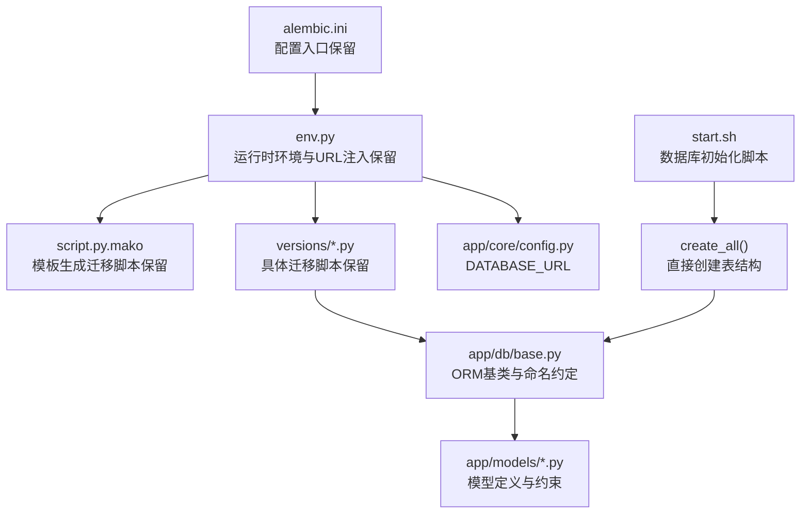
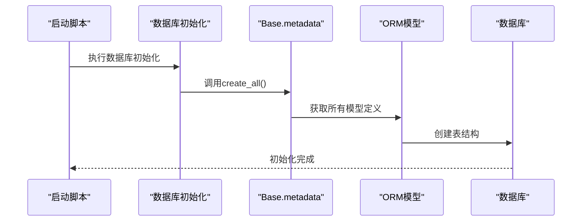
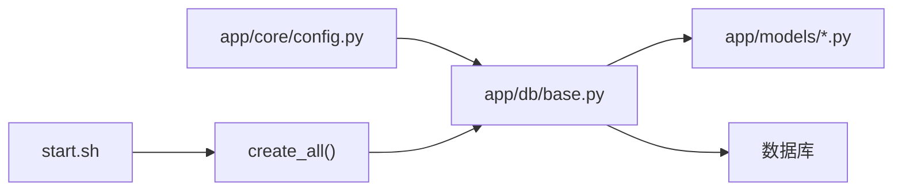

# 数据库迁移管理

<cite>
**本文引用的文件**
- [backend/alembic.ini](file://backend/alembic.ini)
- [backend/alembic/env.py](file://backend/alembic/env.py)
- [backend/alembic/script.py.mako](file://backend/alembic/script.py.mako)
- [backend/alembic/versions/001_v22_initial.py](file://backend/alembic/versions/001_v22_initial.py)
- [backend/alembic/versions/002_add_provinces_table.py](file://backend/alembic/versions/002_add_provinces_table.py)
- [backend/alembic/versions/003_add_is_typical.py](file://backend/alembic/versions/003_add_is_typical.py)
- [backend/alembic/versions/004_simplify_submission_status.py](file://backend/alembic/versions/004_simplify_submission_status.py)
- [backend/alembic/versions/005_add_ocr_needs_review_status.py](file://backend/alembic/versions/005_add_ocr_needs_review_status.py)
- [backend/alembic/versions/006_add_content_hash_to_questions.py](file://backend/alembic/versions/006_add_content_hash_to_questions.py)
- [backend/app/db/base.py](file://backend/app/db/base.py)
- [backend/app/models/question.py](file://backend/app/models/question.py)
- [backend/app/models/answer_submission.py](file://backend/app/models/answer_submission.py)
- [backend/app/models/ocr_upload.py](file://backend/app/models/ocr_upload.py)
- [backend/app/core/config.py](file://backend/app/core/config.py)
- [backend/start.sh](file://backend/start.sh)
</cite>

## 更新摘要
**所做更改**
- 更新架构概述以反映从Alembic迁移系统到直接SQLAlchemy建表的架构变更
- 修改数据库初始化流程说明，强调当前使用create_all()方法
- 更新迁移执行与回滚流程，说明Alembic仍存在但不再使用的现状
- 添加关于Alembic目录保留原因的说明
- 更新最佳实践部分以适应新的直接建表方式

## 目录
1. [简介](#简介)
2. [项目结构](#项目结构)
3. [核心组件](#核心组件)
4. [架构总览](#架构总览)
5. [详细组件分析](#详细组件分析)
6. [依赖关系分析](#依赖关系分析)
7. [性能考量](#性能考量)
8. [故障排查指南](#故障排查指南)
9. [结论](#结论)
10. [附录](#附录)

## 简介
本文件面向瑞珹教育管理系统（后端基于 SQLAlchemy）的数据库迁移管理，系统性阐述当前采用的直接SQLAlchemy建表方式与最佳实践。虽然项目中仍保留Alembic迁移系统的完整文件结构，但实际部署流程已改为直接使用SQLAlchemy的create_all()方法进行数据库初始化。内容涵盖数据库表结构的直接创建、版本控制策略、数据库演进管理，以及针对安全修改表结构、添加索引与数据迁移的建议。同时提供常用数据库初始化命令与常见问题的解决方案。

## 项目结构
后端数据库相关的核心目录与文件如下：
- 配置与环境：alembic.ini、alembic/env.py、alembic/script.py.mako（保留但不再使用）
- 版本脚本：alembic/versions/*.py（保留但不再使用）
- ORM 基类与命名约定：app/db/base.py
- 核心模型与约束示例：app/models/*.py
- 数据库连接配置：app/core/config.py
- 启动脚本：start.sh（包含数据库初始化逻辑）

**图表来源**
- [backend/alembic.ini:1-150](file://backend/alembic.ini#L1-L150)
- [backend/alembic/env.py:1-80](file://backend/alembic/env.py#L1-L80)
- [backend/alembic/script.py.mako:1-29](file://backend/alembic/script.py.mako#L1-L29)
- [backend/alembic/versions/001_v22_initial.py:1-426](file://backend/alembic/versions/001_v22_initial.py#L1-L426)
- [backend/app/db/base.py:1-21](file://backend/app/db/base.py#L1-L21)
- [backend/app/core/config.py:1-98](file://backend/app/core/config.py#L1-L98)
- [backend/start.sh:200-212](file://backend/start.sh#L200-L212)

**章节来源**
- [backend/alembic.ini:1-150](file://backend/alembic.ini#L1-L150)
- [backend/alembic/env.py:1-80](file://backend/alembic/env.py#L1-L80)
- [backend/alembic/script.py.mako:1-29](file://backend/alembic/script.py.mako#L1-L29)
- [backend/app/db/base.py:1-21](file://backend/app/db/base.py#L1-L21)
- [backend/app/core/config.py:1-98](file://backend/app/core/config.py#L1-L98)
- [backend/start.sh:200-212](file://backend/start.sh#L200-L212)

## 核心组件
- **保留的Alembic组件**
  - alembic.ini：定义脚本位置、路径分隔符、日志级别、数据库URL等配置（仍可使用但非当前流程）
  - script.py.mako：迁移脚本模板，包含升级/降级函数占位与 revision 元信息（模板仍可用）
- **运行环境**
  - env.py：在迁移执行前注入真实数据库URL（从应用配置读取），并注册目标元数据（target_metadata）以便自动检测模型变更（仍可使用但非当前流程）
- **版本脚本**
  - versions/*.py：按时间顺序递增的迁移脚本，每个脚本定义 upgrade()/downgrade()（仍可使用但非当前流程）
- **ORM 基类与命名约定**
  - app/db/base.py：统一命名约定（索引、唯一、检查、外键、主键），确保迁移生成的约束名一致
- **核心模型与约束**
  - app/models/*.py：模型中定义的列、索引、检查约束等，与迁移脚本共同构成数据库演进的依据
- **实际数据库初始化**
  - start.sh：包含数据库初始化逻辑，使用create_all()方法直接创建所有表结构

**章节来源**
- [backend/alembic.ini:1-150](file://backend/alembic.ini#L1-L150)
- [backend/alembic/env.py:1-80](file://backend/alembic/env.py#L1-L80)
- [backend/alembic/script.py.mako:1-29](file://backend/alembic/script.py.mako#L1-L29)
- [backend/app/db/base.py:1-21](file://backend/app/db/base.py#L1-L21)
- [backend/app/models/question.py:1-46](file://backend/app/models/question.py#L1-L46)
- [backend/app/models/answer_submission.py:1-37](file://backend/app/models/answer_submission.py#L1-L37)
- [backend/app/models/ocr_upload.py:1-36](file://backend/app/models/ocr_upload.py#L1-L36)
- [backend/start.sh:200-212](file://backend/start.sh#L200-L212)

## 架构总览
**更新** 当前系统采用直接SQLAlchemy建表方式，Alembic迁移系统仍保留在代码库中但不再使用。

下图展示当前的整体工作流：从启动脚本调用create_all()方法，直接基于ORM模型创建数据库表结构。

**图表来源**
- [backend/start.sh:200-212](file://backend/start.sh#L200-L212)
- [backend/app/db/base.py:17-21](file://backend/app/db/base.py#L17-L21)

## 详细组件分析

### 数据库初始化流程
**更新** 项目当前使用直接SQLAlchemy建表方式，Alembic迁移系统已不再使用。

- **启动脚本中的初始化**：在start.sh中，通过asyncio异步执行create_all()方法，直接创建所有数据库表结构
- **模型注册机制**：初始化过程中会导入所有模型（from app.models import *），确保Base.metadata能够识别所有表结构
- **连接管理**：使用AsyncSessionLocal创建数据库连接，确保初始化过程的异步特性

**章节来源**
- [backend/start.sh:200-212](file://backend/start.sh#L200-L212)

### ORM模型与约束管理
- **命名约定**：app/db/base.py 定义了统一的命名约定（索引、唯一、检查、外键、主键），确保数据库约束名称一致且可预测
- **模型约束**：app/models/*.py 中的CheckConstraint与索引定义与数据库初始化过程协同，保证表结构与业务规则一致
- **约束演进**：所有约束定义都在模型层面集中管理，无需通过迁移脚本维护

**章节来源**
- [backend/app/db/base.py:5-18](file://backend/app/db/base.py#L5-L18)
- [backend/app/models/answer_submission.py:28-31](file://backend/app/models/answer_submission.py#L28-L31)
- [backend/app/models/ocr_upload.py:29-33](file://backend/app/models/ocr_upload.py#L29-L33)

### Alembic系统现状
**更新** Alembic迁移系统仍存在于代码库中，但已不再作为主要的数据库管理工具。

- **保留原因**：Alembic文件结构仍可用于：
  - 作为参考模板，学习迁移脚本的编写方式
  - 在需要时快速切换回迁移驱动的管理模式
  - 为未来的架构演进提供备选方案
- **当前状态**：所有数据库初始化都通过create_all()方法直接完成，Alembic的迁移命令不会被执行

**章节来源**
- [backend/alembic.ini:1-150](file://backend/alembic.ini#L1-L150)
- [backend/alembic/env.py:1-80](file://backend/alembic/env.py#L1-L80)
- [backend/alembic/script.py.mako:1-29](file://backend/alembic/script.py.mako#L1-L29)

## 依赖关系分析
**更新** 依赖关系已简化，移除了Alembic迁移的复杂依赖链。

- **配置层**：app/core/config.py 提供数据库连接配置
- **模型层**：app/db/base.py 与 app/models/*.py 定义了完整的数据库结构
- **初始化层**：start.sh 通过create_all()方法直接创建表结构，无需版本脚本依赖

**图表来源**
- [backend/app/core/config.py:55-61](file://backend/app/core/config.py#L55-L61)
- [backend/app/db/base.py:14-18](file://backend/app/db/base.py#L14-L18)
- [backend/start.sh:200-212](file://backend/start.sh#L200-L212)

**章节来源**
- [backend/app/core/config.py:55-61](file://backend/app/core/config.py#L55-L61)
- [backend/app/db/base.py:14-18](file://backend/app/db/base.py#L14-L18)
- [backend/start.sh:200-212](file://backend/start.sh#L200-L212)

## 性能考量
- **初始化性能**：create_all()方法一次性创建所有表结构，适合开发和小型生产环境
- **索引设计**：为高频查询列（如 subject、created_by、is_active、content_hash）建立索引，可显著提升查询性能
- **约束管理**：合理的检查约束可减少脏数据，但过多的约束可能影响写入性能
- **大表处理**：对于大型数据库，create_all()可能需要更长的初始化时间，建议在生产环境中考虑分批处理策略
- **并发初始化**：启动脚本使用异步方式执行数据库初始化，避免阻塞主应用启动流程

## 故障排查指南
- **数据库连接问题**
  - 现象：数据库初始化失败，提示连接错误
  - 排查：确认app/core/config.py中的数据库配置正确，检查PostgreSQL服务状态
  - 参考
    - [backend/app/core/config.py:55-61](file://backend/app/core/config.py#L55-L61)
- **模型导入错误**
  - 现象：初始化过程中提示找不到模型定义
  - 排查：确认start.sh中的模型导入语句正确，检查app/models/__init__.py中的导出列表
  - 参考
    - [backend/start.sh:204](file://backend/start.sh#L204)
    - [backend/app/models/__init__.py:1-44](file://backend/app/models/__init__.py#L1-L44)
- **权限不足**
  - 现象：创建表时权限不足
  - 排查：确认数据库用户具有CREATE TABLE权限，检查数据库角色配置
- **Alembic相关问题**
  - 现象：Alembic命令执行失败或产生意外结果
  - 排查：Alembic已不再使用，建议直接使用create_all()方法或重新配置Alembic（如果需要）

## 结论
**更新** 本项目的数据库管理架构已从传统的Alembic迁移系统转变为直接SQLAlchemy建表方式。虽然Alembic文件结构仍保留在代码库中，但实际部署流程已简化为通过create_all()方法直接创建数据库表结构。这种架构变更降低了复杂性，提高了开发效率，特别适合快速原型开发和中小型项目。对于需要更精细数据库版本控制的场景，Alembic仍可作为备选方案使用。

## 附录

### 数据库初始化命令
**更新** 当前使用直接SQLAlchemy建表方式，Alembic命令仅供参考。

- **直接初始化（推荐）**
  - 使用命令：在start.sh中执行数据库初始化逻辑
  - 该方式通过create_all()方法直接创建所有表结构
- **Alembic迁移命令（保留）**
  - 生成迁移脚本：alembic revision --autogenerate -m "<描述>"（仍可使用但非当前流程）
  - 应用迁移：alembic upgrade head（仍可使用但非当前流程）
  - 回滚迁移：alembic downgrade -1 或 downgrade <目标版本>（仍可使用但非当前流程）

**章节来源**
- [backend/start.sh:200-212](file://backend/start.sh#L200-L212)
- [backend/alembic/env.py:63-80](file://backend/alembic/env.py#L63-L80)

### 最佳实践清单
**更新** 针对直接SQLAlchemy建表方式的最佳实践。

- **模型驱动设计**：所有数据库结构变更都应在ORM模型层面完成，确保create_all()能够正确识别
- **命名一致性**：统一使用app/db/base.py的命名约定，避免手写SQL导致命名不一致
- **索引优化**：为高频查询列建立索引，提升查询性能
- **约束管理**：在模型层面定义所有约束，确保数据库完整性
- **异步初始化**：利用启动脚本的异步特性，避免阻塞应用启动
- **Alembic保留策略**：虽然不再使用，但仍建议保留以备将来需要
- **审计与备份**：在执行重大结构变更前进行数据库备份，并记录变更日志
- **测试环境**：在开发和测试环境中验证模型变更，确保create_all()能够正确执行

### Alembic系统保留说明
**更新** 关于Alembic文件结构保留的技术说明。

- **兼容性考虑**：保留Alembic文件结构便于未来可能的架构调整
- **学习价值**：为开发者提供迁移脚本编写的参考模板
- **应急备用**：在需要时可以快速切换回迁移驱动的管理模式
- **当前状态**：所有数据库初始化都通过create_all()方法直接完成，Alembic命令不会被执行