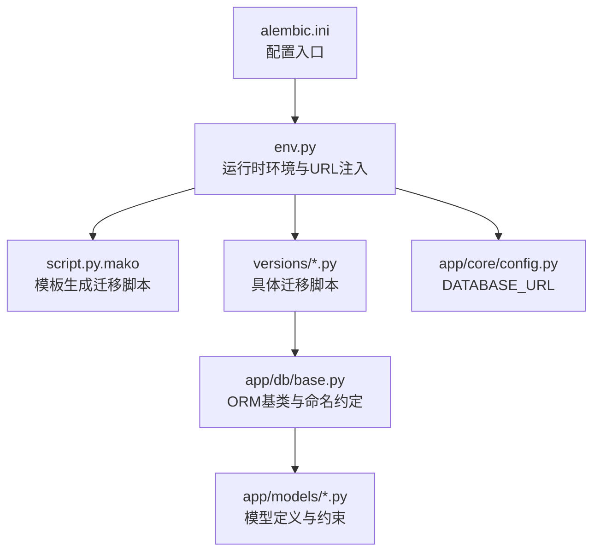
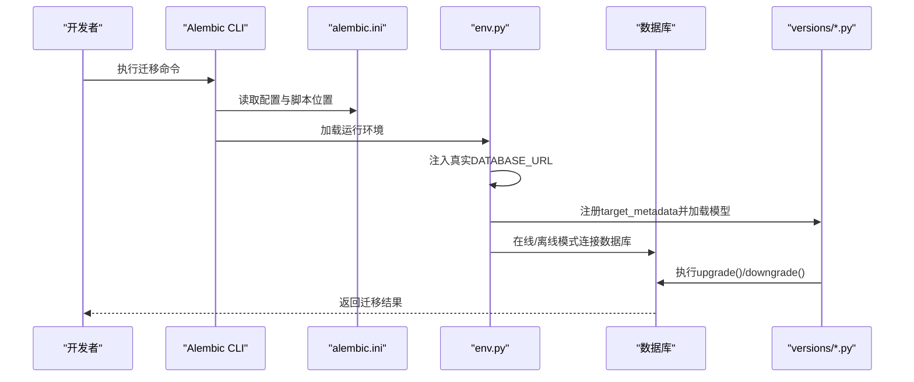
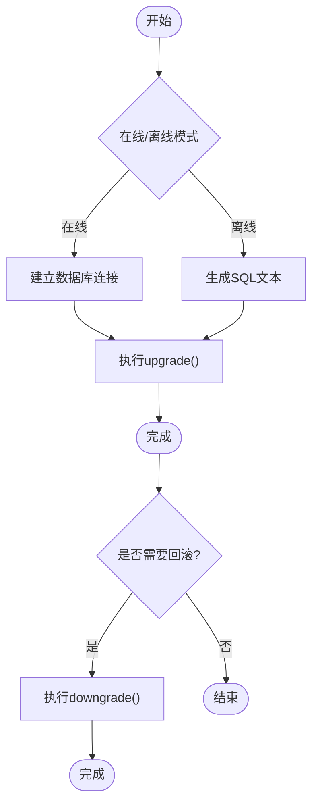
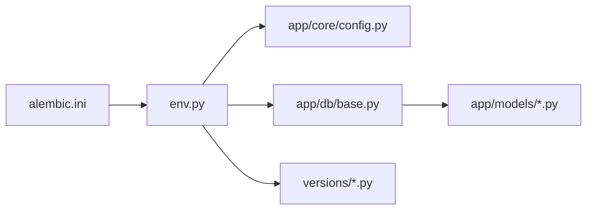

# 数据库迁移管理

<cite>
**本文引用的文件**
- [backend/alembic.ini](file://backend/alembic.ini)
- [backend/alembic/env.py](file://backend/alembic/env.py)
- [backend/alembic/script.py.mako](file://backend/alembic/script.py.mako)
- [backend/alembic/versions/001_v22_initial.py](file://backend/alembic/versions/001_v22_initial.py)
- [backend/alembic/versions/002_add_provinces_table.py](file://backend/alembic/versions/002_add_provinces_table.py)
- [backend/alembic/versions/003_add_is_typical.py](file://backend/alembic/versions/003_add_is_typical.py)
- [backend/alembic/versions/004_simplify_submission_status.py](file://backend/alembic/versions/004_simplify_submission_status.py)
- [backend/alembic/versions/005_add_ocr_needs_review_status.py](file://backend/alembic/versions/005_add_ocr_needs_review_status.py)
- [backend/alembic/versions/006_add_content_hash_to_questions.py](file://backend/alembic/versions/006_add_content_hash_to_questions.py)
- [backend/app/db/base.py](file://backend/app/db/base.py)
- [backend/app/models/question.py](file://backend/app/models/question.py)
- [backend/app/models/answer_submission.py](file://backend/app/models/answer_submission.py)
- [backend/app/models/ocr_upload.py](file://backend/app/models/ocr_upload.py)
- [backend/app/core/config.py](file://backend/app/core/config.py)
</cite>

## 目录
1. [简介](#简介)
2. [项目结构](#项目结构)
3. [核心组件](#核心组件)
4. [架构总览](#架构总览)
5. [详细组件分析](#详细组件分析)
6. [依赖关系分析](#依赖关系分析)
7. [性能考量](#性能考量)
8. [故障排查指南](#故障排查指南)
9. [结论](#结论)
10. [附录](#附录)

## 简介
本文件面向瑞珹教育管理系统（后端基于 SQLAlchemy/Alembic）的数据库迁移管理，系统性阐述 Alembic 迁移框架在本项目中的使用方式与最佳实践。内容涵盖迁移文件的创建、执行与回滚流程，版本控制策略、迁移依赖关系与数据库演进管理，以及针对安全修改表结构、添加索引与数据迁移的建议。同时提供常用迁移命令与常见问题的解决方案，帮助团队在开发与生产环境中稳定推进数据库演进。

## 项目结构
后端迁移相关的核心目录与文件如下：
- 配置与环境：alembic.ini、alembic/env.py、alembic/script.py.mako
- 版本脚本：alembic/versions/*.py（按顺序编号）
- ORM 基类与命名约定：app/db/base.py
- 核心模型与约束示例：app/models/*.py
- 数据库连接配置：app/core/config.py

图表来源
- [backend/alembic.ini:1-150](file://backend/alembic.ini#L1-L150)
- [backend/alembic/env.py:1-80](file://backend/alembic/env.py#L1-L80)
- [backend/alembic/script.py.mako:1-29](file://backend/alembic/script.py.mako#L1-L29)
- [backend/alembic/versions/001_v22_initial.py:1-426](file://backend/alembic/versions/001_v22_initial.py#L1-L426)
- [backend/app/db/base.py:1-21](file://backend/app/db/base.py#L1-L21)
- [backend/app/core/config.py:1-98](file://backend/app/core/config.py#L1-L98)

章节来源
- [backend/alembic.ini:1-150](file://backend/alembic.ini#L1-L150)
- [backend/alembic/env.py:1-80](file://backend/alembic/env.py#L1-L80)
- [backend/alembic/script.py.mako:1-29](file://backend/alembic/script.py.mako#L1-L29)
- [backend/app/db/base.py:1-21](file://backend/app/db/base.py#L1-L21)
- [backend/app/core/config.py:1-98](file://backend/app/core/config.py#L1-L98)

## 核心组件
- 配置与模板
  - alembic.ini：定义脚本位置、路径分隔符、日志级别、数据库URL等；支持通过 hooks 自动格式化生成的迁移脚本。
  - script.py.mako：迁移脚本模板，包含升级/降级函数占位与 revision 元信息。
- 运行环境
  - env.py：在迁移执行前注入真实数据库URL（从应用配置读取），并注册目标元数据（target_metadata）以便自动检测模型变更。
- 版本脚本
  - versions/*.py：按时间顺序递增的迁移脚本，每个脚本定义 upgrade()/downgrade()，描述数据库结构变化与回滚策略。
- ORM 基类与命名约定
  - app/db/base.py：统一命名约定（索引、唯一、检查、外键、主键），确保迁移生成的约束名一致。
- 核心模型与约束
  - app/models/*.py：模型中定义的列、索引、检查约束等，与迁移脚本共同构成数据库演进的依据。

章节来源
- [backend/alembic.ini:1-150](file://backend/alembic.ini#L1-L150)
- [backend/alembic/env.py:1-80](file://backend/alembic/env.py#L1-L80)
- [backend/alembic/script.py.mako:1-29](file://backend/alembic/script.py.mako#L1-L29)
- [backend/app/db/base.py:1-21](file://backend/app/db/base.py#L1-L21)
- [backend/app/models/question.py:1-46](file://backend/app/models/question.py#L1-L46)
- [backend/app/models/answer_submission.py:1-37](file://backend/app/models/answer_submission.py#L1-L37)
- [backend/app/models/ocr_upload.py:1-36](file://backend/app/models/ocr_upload.py#L1-L36)

## 架构总览
下图展示 Alembic 在本项目中的整体工作流：从配置到运行环境注入真实数据库URL，再到版本脚本执行与回滚。

图表来源
- [backend/alembic.ini:1-150](file://backend/alembic.ini#L1-L150)
- [backend/alembic/env.py:1-80](file://backend/alembic/env.py#L1-L80)
- [backend/alembic/versions/001_v22_initial.py:1-426](file://backend/alembic/versions/001_v22_initial.py#L1-L426)

## 详细组件分析

### 迁移文件创建与模板
- 使用模板生成迁移脚本时，Alembic 会根据 script.py.mako 的模板填充升级/降级逻辑与版本元信息。模板提供了占位符，便于在升级/降级函数中编写 SQL 或 SQLAlchemy DDL 操作。
- 建议在生成脚本后，利用 alembic.ini 中的 hooks 对生成的脚本进行格式化（如 black、ruff），保证风格一致。

章节来源
- [backend/alembic/script.py.mako:1-29](file://backend/alembic/script.py.mako#L1-L29)
- [backend/alembic.ini:93-114](file://backend/alembic.ini#L93-L114)

### 运行环境与数据库URL注入
- env.py 在迁移执行前从应用配置读取 DATABASE_URL，并将其注入到 Alembic 主配置中，确保迁移始终作用于实际数据库而非默认 SQLite。
- 在线模式通过真实连接执行迁移，离线模式仅生成 SQL 文本但不连接数据库。

章节来源
- [backend/alembic/env.py:15-21](file://backend/alembic/env.py#L15-L21)
- [backend/alembic/env.py:39-80](file://backend/alembic/env.py#L39-L80)
- [backend/app/core/config.py:55-61](file://backend/app/core/config.py#L55-L61)

### 版本脚本与依赖关系
- 版本脚本按顺序编号，每个脚本包含 revision、down_revision、branch_labels、depends_on 等元信息，明确依赖链路。
- 示例迁移展示了从初始完整架构到逐步演进的过程：新增参考表、字段、索引与检查约束，以及对既有数据的映射与约束更新。

章节来源
- [backend/alembic/versions/001_v22_initial.py:1-426](file://backend/alembic/versions/001_v22_initial.py#L1-L426)
- [backend/alembic/versions/002_add_provinces_table.py:1-42](file://backend/alembic/versions/002_add_provinces_table.py#L1-L42)
- [backend/alembic/versions/003_add_is_typical.py:1-17](file://backend/alembic/versions/003_add_is_typical.py#L1-L17)
- [backend/alembic/versions/004_simplify_submission_status.py:1-53](file://backend/alembic/versions/004_simplify_submission_status.py#L1-L53)
- [backend/alembic/versions/005_add_ocr_needs_review_status.py:1-33](file://backend/alembic/versions/005_add_ocr_needs_review_status.py#L1-L33)
- [backend/alembic/versions/006_add_content_hash_to_questions.py:1-25](file://backend/alembic/versions/006_add_content_hash_to_questions.py#L1-L25)

### 数据库演进与约束管理
- 命名约定：app/db/base.py 定义了统一的命名约定（索引、唯一、检查、外键、主键），确保迁移生成的约束名称一致且可预测。
- 模型约束：app/models/*.py 中的 CheckConstraint 与索引定义与迁移脚本协同，保证数据库结构与业务规则一致。
- 约束演进示例：
  - 状态枚举规范化：将中文状态映射为英文枚举，并更新检查约束。
  - 新增状态：在 OCR 上传表中引入 NEEDS_REVIEW 状态并更新检查约束。
  - 字段与索引：为 questions 表新增 content_hash 并建立索引，提升查询效率。

章节来源
- [backend/app/db/base.py:5-18](file://backend/app/db/base.py#L5-L18)
- [backend/app/models/answer_submission.py:28-31](file://backend/app/models/answer_submission.py#L28-L31)
- [backend/app/models/ocr_upload.py:29-33](file://backend/app/models/ocr_upload.py#L29-L33)
- [backend/alembic/versions/004_simplify_submission_status.py:20-42](file://backend/alembic/versions/004_simplify_submission_status.py#L20-L42)
- [backend/alembic/versions/005_add_ocr_needs_review_status.py:16-23](file://backend/alembic/versions/005_add_ocr_needs_review_status.py#L16-L23)
- [backend/alembic/versions/006_add_content_hash_to_questions.py:17-24](file://backend/alembic/versions/006_add_content_hash_to_questions.py#L17-L24)

### 迁移执行与回滚流程
- 执行迁移：在在线模式下，env.py 通过真实数据库连接执行 upgrade()；离线模式下仅生成 SQL 文本。
- 回滚迁移：通过 downgrade() 将数据库结构恢复到上一个版本。
- 依赖链：每个版本脚本的 down_revision 指向其前置版本，确保回滚顺序正确。

图表来源
- [backend/alembic/env.py:39-80](file://backend/alembic/env.py#L39-L80)
- [backend/alembic/versions/001_v22_initial.py:10-426](file://backend/alembic/versions/001_v22_initial.py#L10-L426)

## 依赖关系分析
- 配置层：alembic.ini 提供全局配置，env.py 注入 DATABASE_URL，确保迁移指向正确的数据库实例。
- 模型层：app/db/base.py 与 app/models/*.py 定义了数据库结构与约束，env.py 通过 target_metadata 使其参与迁移。
- 脚本层：versions/*.py 作为演进的最小单元，彼此通过 down_revision 建立线性依赖链。

图表来源
- [backend/alembic.ini:1-150](file://backend/alembic.ini#L1-L150)
- [backend/alembic/env.py:15-31](file://backend/alembic/env.py#L15-L31)
- [backend/app/core/config.py:55-61](file://backend/app/core/config.py#L55-L61)
- [backend/app/db/base.py:14-18](file://backend/app/db/base.py#L14-L18)
- [backend/alembic/versions/001_v22_initial.py:1-426](file://backend/alembic/versions/001_v22_initial.py#L1-L426)

章节来源
- [backend/alembic.ini:1-150](file://backend/alembic.ini#L1-L150)
- [backend/alembic/env.py:15-31](file://backend/alembic/env.py#L15-L31)
- [backend/app/db/base.py:14-18](file://backend/app/db/base.py#L14-L18)
- [backend/alembic/versions/001_v22_initial.py:1-426](file://backend/alembic/versions/001_v22_initial.py#L1-L426)

## 性能考量
- 索引设计：为高频查询列（如 subject、created_by、is_active、content_hash）建立索引，可显著提升查询性能。迁移中应同步创建索引并在回滚时删除，保持对称性。
- 约束与检查：合理的检查约束可减少脏数据，但过多的约束可能影响写入性能。建议在批量导入或历史数据修复时临时禁用约束，完成后重建。
- 大表变更：对大表进行结构变更（如添加列、重命名）时，优先考虑分批处理与后台任务，避免长时间锁表。
- 日志与监控：通过 alembic.ini 的日志配置输出迁移过程的关键信息，便于定位性能瓶颈与异常。

## 故障排查指南
- 数据库URL错误
  - 现象：迁移无法连接数据库或连接到错误实例。
  - 排查：确认 env.py 是否成功注入 DATABASE_URL，检查 app/core/config.py 的连接参数是否正确。
  - 参考
    - [backend/alembic/env.py:15-21](file://backend/alembic/env.py#L15-L21)
    - [backend/app/core/config.py:55-61](file://backend/app/core/config.py#L55-L61)
- 约束冲突
  - 现象：升级失败提示违反唯一/检查约束。
  - 排查：检查迁移脚本中的约束定义与现有数据是否匹配；必要时先清理或转换数据，再执行约束创建。
  - 参考
    - [backend/alembic/versions/004_simplify_submission_status.py:20-42](file://backend/alembic/versions/004_simplify_submission_status.py#L20-L42)
    - [backend/alembic/versions/005_add_ocr_needs_review_status.py:16-23](file://backend/alembic/versions/005_add_ocr_needs_review_status.py#L16-L23)
- 回滚失败
  - 现象：downgrade() 执行失败，提示依赖或外键约束。
  - 排查：确认 down_revision 顺序正确；逐个版本回滚，确保前置依赖被正确移除；注意删除索引与约束的顺序。
  - 参考
    - [backend/alembic/versions/006_add_content_hash_to_questions.py:17-24](file://backend/alembic/versions/006_add_content_hash_to_questions.py#L17-L24)
- 索引缺失导致慢查询
  - 现象：查询性能下降。
  - 排查：核对迁移脚本是否创建了必要的索引；在模型定义与迁移脚本之间保持一致性。
  - 参考
    - [backend/app/models/question.py:17-31](file://backend/app/models/question.py#L17-L31)
    - [backend/alembic/versions/006_add_content_hash_to_questions.py:18-19](file://backend/alembic/versions/006_add_content_hash_to_questions.py#L18-L19)

## 结论
本项目的 Alembic 迁移体系通过清晰的配置、模板与版本脚本，结合统一的命名约定与模型约束，实现了数据库结构的有序演进。遵循本文档的最佳实践与排错建议，可在开发与生产环境中安全、可控地推进数据库变更，降低风险并提升稳定性。

## 附录

### 常用迁移命令
- 生成迁移脚本（基于模型差异）
  - 使用命令：alembic revision --autogenerate -m "<描述>"
  - 注意：需确保 env.py 已正确注入 DATABASE_URL，且 app/db/base.py 与 app/models/*.py 已注册。
  - 参考
    - [backend/alembic/env.py:31](file://backend/alembic/env.py#L31)
    - [backend/alembic/script.py.mako:1-29](file://backend/alembic/script.py.mako#L1-L29)
- 应用迁移
  - 使用命令：alembic upgrade head
  - 参考
    - [backend/alembic/env.py:63-80](file://backend/alembic/env.py#L63-L80)
- 回滚迁移
  - 使用命令：alembic downgrade -1 或 downgrade <目标版本>
  - 参考
    - [backend/alembic/versions/001_v22_initial.py:417-426](file://backend/alembic/versions/001_v22_initial.py#L417-L426)

### 最佳实践清单
- 保持迁移脚本原子性：每个版本只做一次结构性变更，避免跨多个功能的复杂改动。
- 对称设计：添加索引/约束时，回滚脚本中对应删除，确保版本间对称。
- 数据迁移：涉及数据清洗或转换时，先在测试环境验证，再在生产环境分批执行。
- 版本依赖：严格维护 down_revision 顺序，避免跳过中间版本导致回滚失败。
- 命名一致性：统一使用 app/db/base.py 的命名约定，避免手写 SQL 导致命名不一致。
- 审计与备份：在执行重大结构变更前进行数据库备份，并记录迁移日志。