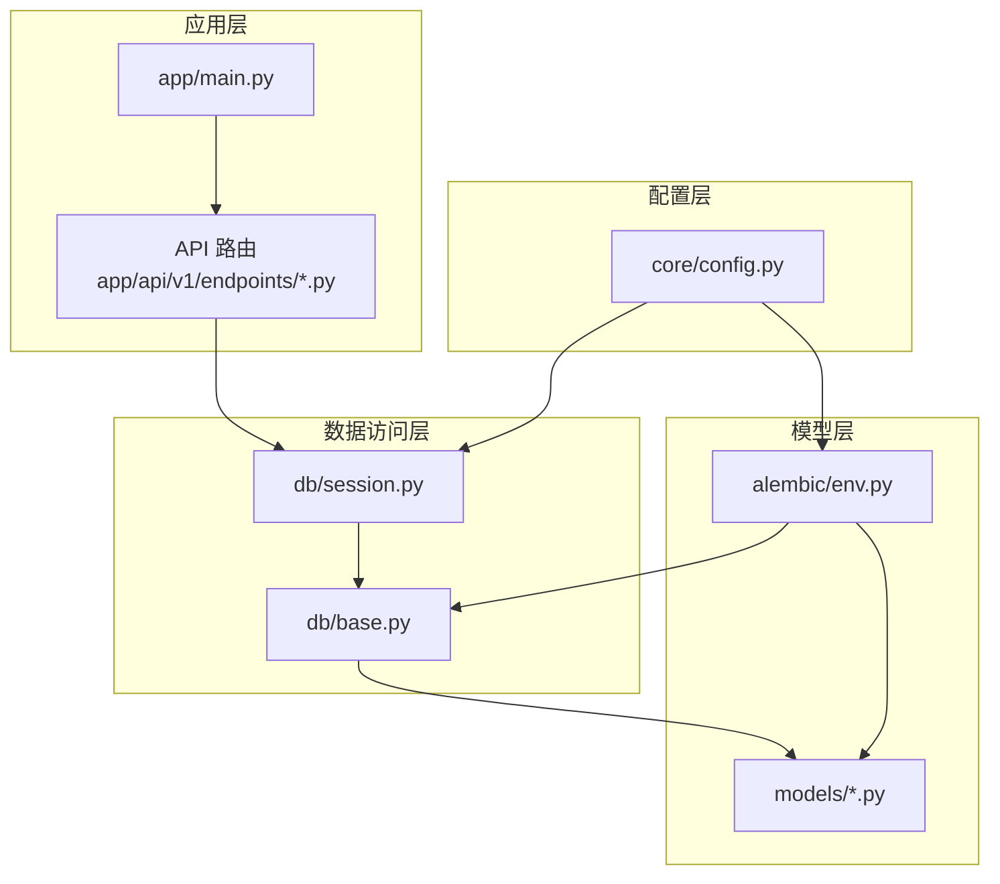
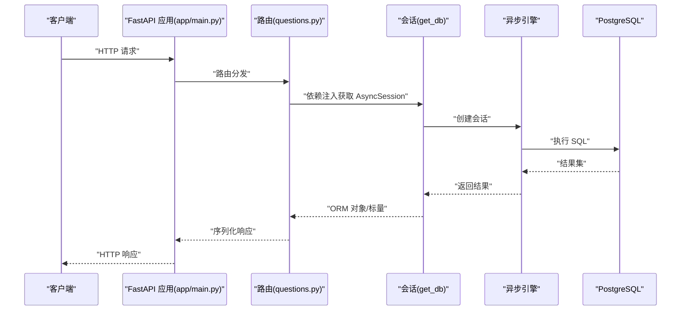
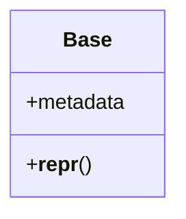
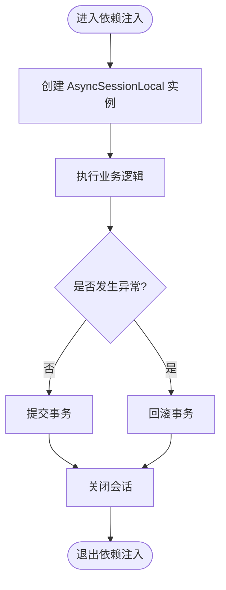
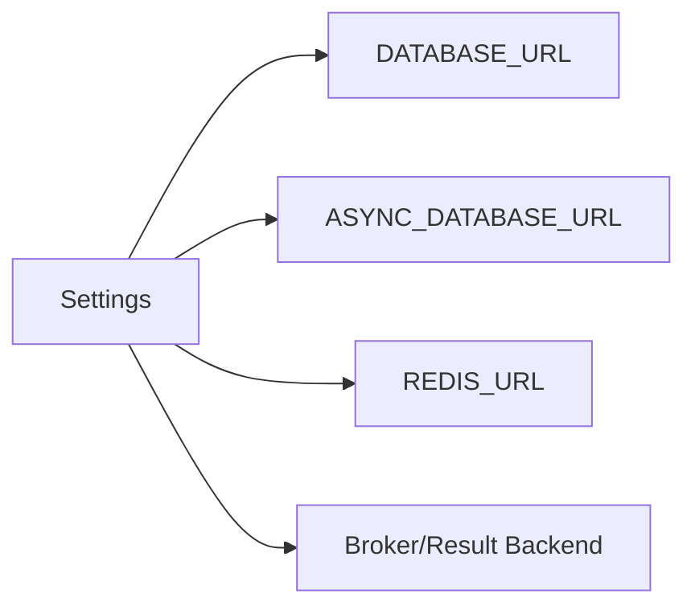
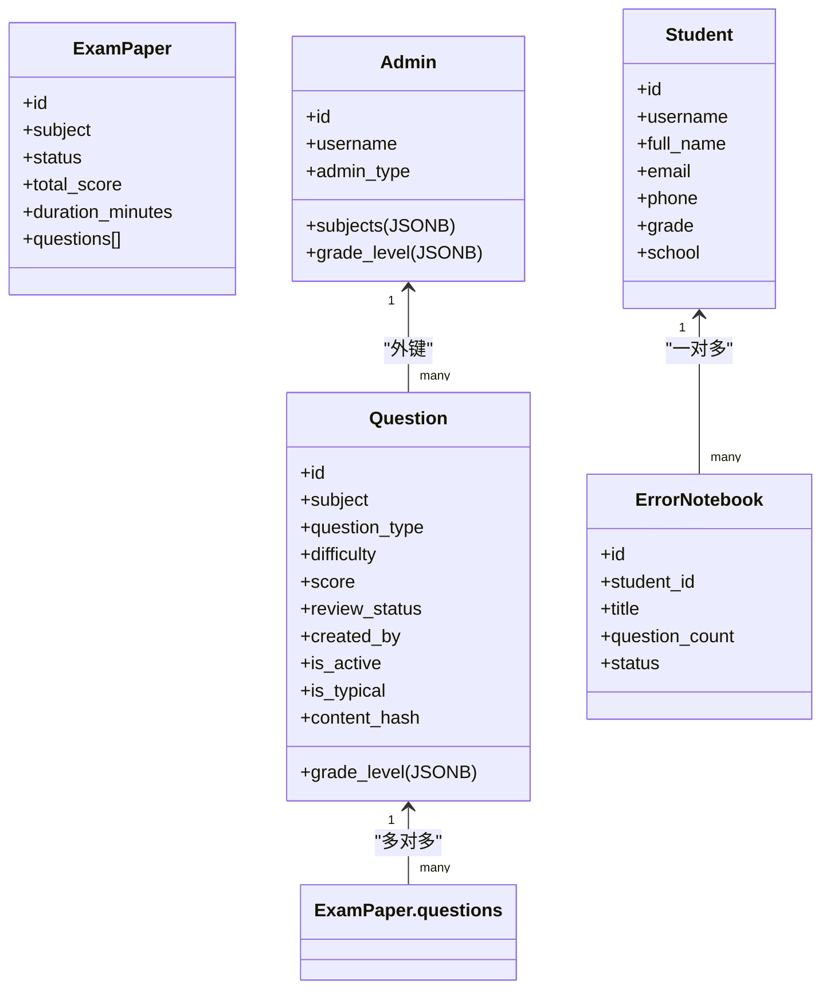
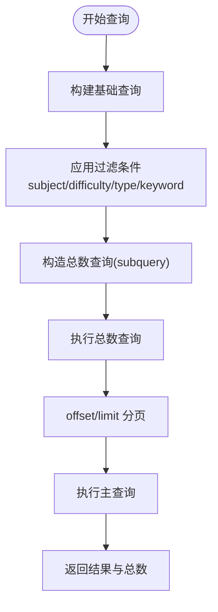
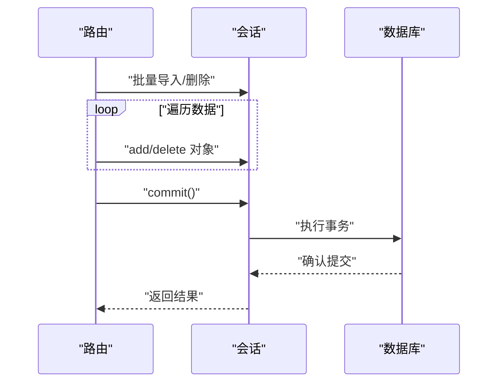
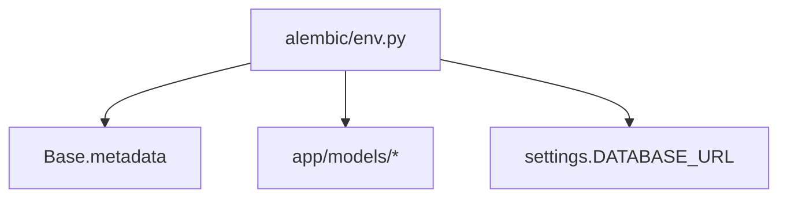
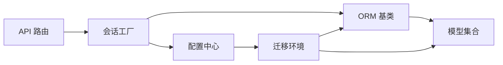

# 数据访问模式

<cite>
**本文引用的文件**
- [backend/app/db/base.py](file://backend/app/db/base.py)
- [backend/app/db/session.py](file://backend/app/db/session.py)
- [backend/app/core/config.py](file://backend/app/core/config.py)
- [backend/app/models/__init__.py](file://backend/app/models/__init__.py)
- [backend/app/models/school_class.py](file://backend/app/models/school_class.py)
- [backend/app/models/student.py](file://backend/app/models/student.py)
- [backend/app/models/question.py](file://backend/app/models/question.py)
- [backend/app/models/admin.py](file://backend/app/models/admin.py)
- [backend/app/models/exam_paper.py](file://backend/app/models/exam_paper.py)
- [backend/app/models/error_notebook.py](file://backend/app/models/error_notebook.py)
- [backend/app/api/v1/endpoints/questions.py](file://backend/app/api/v1/endpoints/questions.py)
- [backend/app/api/v1/endpoints/student.py](file://backend/app/api/v1/endpoints/student.py)
- [backend/alembic/env.py](file://backend/alembic/env.py)
- [backend/app/main.py](file://backend/app/main.py)
</cite>

## 目录
1. [简介](#简介)
2. [项目结构](#项目结构)
3. [核心组件](#核心组件)
4. [架构总览](#架构总览)
5. [详细组件分析](#详细组件分析)
6. [依赖分析](#依赖分析)
7. [性能考虑](#性能考虑)
8. [故障排查指南](#故障排查指南)
9. [结论](#结论)
10. [附录](#附录)

## 简介
本文件面向瑞珹教育管理系统后端的数据访问层，系统采用 SQLAlchemy ORM（异步）与 FastAPI 框架构建，数据库为 PostgreSQL，并通过 Alembic 进行迁移管理。本文档聚焦以下主题：
- SQLAlchemy ORM 使用模式：模型定义、查询操作、关系处理
- 数据访问层设计原则：会话管理、事务处理、连接池配置
- 常用数据操作模式：CRUD、批量处理、复杂查询
- 性能优化策略：查询优化、缓存策略、索引使用建议

## 项目结构
后端采用分层组织方式：
- 核心配置：应用配置与数据库连接字符串生成
- 数据库层：ORM 基类、异步引擎与会话工厂、依赖注入
- 模型层：所有业务实体与关系映射
- API 层：路由与端点，封装 CRUD、批量与复杂查询
- 迁移层：Alembic 环境配置与元数据绑定

图表来源
- [backend/app/main.py:1-52](file://backend/app/main.py#L1-L52)
- [backend/app/db/session.py:1-26](file://backend/app/db/session.py#L1-L26)
- [backend/app/db/base.py:1-21](file://backend/app/db/base.py#L1-L21)
- [backend/app/models/__init__.py:1-34](file://backend/app/models/__init__.py#L1-L34)
- [backend/alembic/env.py:1-80](file://backend/alembic/env.py#L1-L80)
- [backend/app/core/config.py:1-98](file://backend/app/core/config.py#L1-L98)

章节来源
- [backend/app/main.py:1-52](file://backend/app/main.py#L1-L52)
- [backend/app/db/session.py:1-26](file://backend/app/db/session.py#L1-L26)
- [backend/app/db/base.py:1-21](file://backend/app/db/base.py#L1-L21)
- [backend/app/models/__init__.py:1-34](file://backend/app/models/__init__.py#L1-L34)
- [backend/alembic/env.py:1-80](file://backend/alembic/env.py#L1-L80)
- [backend/app/core/config.py:1-98](file://backend/app/core/config.py#L1-L98)

## 核心组件
- ORM 基类与命名约定：统一约束命名与元数据管理，便于迁移与维护
- 异步会话与依赖注入：基于 FastAPI 的依赖注入机制，确保每个请求拥有独立会话，异常时自动回滚并关闭
- 配置中心：集中管理数据库连接串（同步与异步）、Redis、Celery 等外部服务
- 模型集合：涵盖用户、班级、题目、试卷、错题本等核心业务实体及关系映射
- 迁移环境：绑定模型元数据，支持离线/在线迁移

章节来源
- [backend/app/db/base.py:1-21](file://backend/app/db/base.py#L1-L21)
- [backend/app/db/session.py:1-26](file://backend/app/db/session.py#L1-L26)
- [backend/app/core/config.py:1-98](file://backend/app/core/config.py#L1-L98)
- [backend/app/models/__init__.py:1-34](file://backend/app/models/__init__.py#L1-L34)
- [backend/alembic/env.py:1-80](file://backend/alembic/env.py#L1-L80)

## 架构总览
系统采用“配置 → 会话 → 模型 → API”的清晰分层，API 端点通过依赖注入获取会话，执行查询或写入操作，最终返回标准化响应。

图表来源
- [backend/app/main.py:1-52](file://backend/app/main.py#L1-L52)
- [backend/app/api/v1/endpoints/questions.py:1-434](file://backend/app/api/v1/endpoints/questions.py#L1-L434)
- [backend/app/db/session.py:18-26](file://backend/app/db/session.py#L18-L26)
- [backend/app/core/config.py:55-62](file://backend/app/core/config.py#L55-L62)

## 详细组件分析

### ORM 基类与命名约定
- 统一命名约定：通过 MetaData 的命名规范，自动生成索引、唯一约束、检查约束、外键与主键名称，提升迁移一致性
- 公共基类：继承 DeclarativeBase，集中管理 metadata，简化模型定义

图表来源
- [backend/app/db/base.py:17-21](file://backend/app/db/base.py#L17-L21)

章节来源
- [backend/app/db/base.py:1-21](file://backend/app/db/base.py#L1-L21)

### 异步会话与依赖注入
- 异步引擎：基于 asyncpg 驱动，future=True 提升兼容性
- 会话工厂：sessionmaker(class_=AsyncSession, expire_on_commit=False)，避免提交后过期导致的懒加载问题
- 依赖注入：get_db 提供上下文管理，异常时自动回滚并关闭，finally 确保资源释放

图表来源
- [backend/app/db/session.py:18-26](file://backend/app/db/session.py#L18-L26)

章节来源
- [backend/app/db/session.py:1-26](file://backend/app/db/session.py#L1-L26)

### 配置中心与连接字符串
- 同步/异步数据库 URL：分别用于 Alembic 迁移与运行时 ORM
- 环境变量覆盖：支持从 .env 与 sysconfig.json 加载敏感信息
- 外部服务：Redis/Celery/上传目录等统一管理

图表来源
- [backend/app/core/config.py:55-75](file://backend/app/core/config.py#L55-L75)

章节来源
- [backend/app/core/config.py:1-98](file://backend/app/core/config.py#L1-L98)

### 模型定义与关系处理
- 主键与字段：统一 UUID 字符串主键；时间字段使用 timezone-aware，默认值与更新触发器
- 关系映射：一对多/多对多通过 relationship 与关联表实现
- 约束与索引：显式 CheckConstraint 与列级 index 提升数据完整性与查询效率
- JSON/JSONB：用于灵活结构化数据存储（如题目难度/范围、教师科目/年级）

图表来源
- [backend/app/models/question.py:10-46](file://backend/app/models/question.py#L10-L46)
- [backend/app/models/exam_paper.py:23-51](file://backend/app/models/exam_paper.py#L23-L51)
- [backend/app/models/admin.py:9-27](file://backend/app/models/admin.py#L9-L27)
- [backend/app/models/student.py:8-23](file://backend/app/models/student.py#L8-L23)
- [backend/app/models/error_notebook.py:8-32](file://backend/app/models/error_notebook.py#L8-L32)

章节来源
- [backend/app/models/question.py:1-46](file://backend/app/models/question.py#L1-L46)
- [backend/app/models/exam_paper.py:1-51](file://backend/app/models/exam_paper.py#L1-L51)
- [backend/app/models/admin.py:1-27](file://backend/app/models/admin.py#L1-L27)
- [backend/app/models/student.py:1-23](file://backend/app/models/student.py#L1-L23)
- [backend/app/models/error_notebook.py:1-32](file://backend/app/models/error_notebook.py#L1-L32)

### 查询操作与复杂查询
- 条件过滤：支持多维筛选（学科、难度、类型、关键字等），结合 JSON/JSONB 字段查询
- 分页与总数：先构造子查询统计总数，再应用 offset/limit 返回分页结果
- 计数与聚合：使用 func.count、func.avg、func.max 等进行统计分析
- 多表联接：通过 join 实现报表与统计场景

图表来源
- [backend/app/api/v1/endpoints/questions.py:39-104](file://backend/app/api/v1/endpoints/questions.py#L39-L104)
- [backend/app/api/v1/endpoints/student.py:16-112](file://backend/app/api/v1/endpoints/student.py#L16-L112)

章节来源
- [backend/app/api/v1/endpoints/questions.py:1-434](file://backend/app/api/v1/endpoints/questions.py#L1-L434)
- [backend/app/api/v1/endpoints/student.py:1-112](file://backend/app/api/v1/endpoints/student.py#L1-L112)

### 批量处理与写入
- 批量导入：限制单次最大条数，逐条构造对象并批量提交
- 批量删除：通过 IN 条件一次性删除多个记录
- 写入一致性：在依赖注入作用域内完成增删改，保证事务边界

图表来源
- [backend/app/api/v1/endpoints/questions.py:127-155](file://backend/app/api/v1/endpoints/questions.py#L127-L155)
- [backend/app/api/v1/endpoints/questions.py:350-363](file://backend/app/api/v1/endpoints/questions.py#L350-L363)

章节来源
- [backend/app/api/v1/endpoints/questions.py:127-155](file://backend/app/api/v1/endpoints/questions.py#L127-L155)
- [backend/app/api/v1/endpoints/questions.py:350-363](file://backend/app/api/v1/endpoints/questions.py#L350-L363)

### 迁移与元数据绑定
- Alembic 环境：动态设置 sqlalchemy.url，绑定 Base.metadata，支持离线/在线迁移
- 模型注册：导入 models 包以确保所有模型被注册到 Base

图表来源
- [backend/alembic/env.py:1-80](file://backend/alembic/env.py#L1-L80)

章节来源
- [backend/alembic/env.py:1-80](file://backend/alembic/env.py#L1-L80)

## 依赖分析
- 组件耦合：API 依赖会话工厂；会话工厂依赖配置；模型依赖基类；迁移依赖模型与配置
- 外部依赖：PostgreSQL（异步驱动）、Alembic、FastAPI
- 循环依赖：当前结构未见循环依赖迹象

图表来源
- [backend/app/api/v1/endpoints/questions.py:1-434](file://backend/app/api/v1/endpoints/questions.py#L1-L434)
- [backend/app/db/session.py:1-26](file://backend/app/db/session.py#L1-L26)
- [backend/app/db/base.py:1-21](file://backend/app/db/base.py#L1-L21)
- [backend/app/models/__init__.py:1-34](file://backend/app/models/__init__.py#L1-L34)
- [backend/alembic/env.py:1-80](file://backend/alembic/env.py#L1-L80)
- [backend/app/core/config.py:1-98](file://backend/app/core/config.py#L1-L98)

章节来源
- [backend/app/api/v1/endpoints/questions.py:1-434](file://backend/app/api/v1/endpoints/questions.py#L1-L434)
- [backend/app/db/session.py:1-26](file://backend/app/db/session.py#L1-L26)
- [backend/app/db/base.py:1-21](file://backend/app/db/base.py#L1-L21)
- [backend/app/models/__init__.py:1-34](file://backend/app/models/__init__.py#L1-L34)
- [backend/alembic/env.py:1-80](file://backend/alembic/env.py#L1-L80)
- [backend/app/core/config.py:1-98](file://backend/app/core/config.py#L1-L98)

## 性能考虑
- 查询优化
  - 选择性过滤：优先使用高选择性的列（如 subject、created_by、content_hash）作为过滤条件
  - JSON/JSONB 查询：利用 contains、astext 等函数，必要时配合索引
  - 聚合与分页：先统计总数再分页，避免全表扫描
- 索引建议
  - 高频过滤列：subject、created_by、is_active、is_typical、content_hash
  - 复合条件：多列组合过滤时评估复合索引收益
- 缓存策略
  - 常用配置与字典：Redis 缓存（配置中心提供 REDIS_URL）
  - 结果缓存：对稳定报表与统计结果进行短期缓存
- 连接池与会话
  - 异步驱动：使用 asyncpg，减少阻塞
  - 会话生命周期：依赖注入确保短生命周期，避免长事务
- 批量操作
  - 批量导入/删除限制单次数量，降低锁竞争与内存占用

## 故障排查指南
- 会话相关
  - 现象：依赖注入失败或会话泄漏
  - 排查：确认 get_db 在 try/except/finally 中正确使用，异常时会自动回滚并关闭
- 迁移相关
  - 现象：迁移找不到模型或 URL 错误
  - 排查：确认 alembic/env.py 已导入 models 并正确设置 sqlalchemy.url
- 权限与数据可见性
  - 现象：教师只能看到自身学科数据
  - 排查：检查端点中对 Admin.subjects 的读取与过滤逻辑
- 导入/导出上限
  - 现象：批量导入/导出超过限制
  - 排查：端点中限制了最大条数，需调整前端或后端阈值

章节来源
- [backend/app/db/session.py:18-26](file://backend/app/db/session.py#L18-L26)
- [backend/alembic/env.py:15-20](file://backend/alembic/env.py#L15-L20)
- [backend/app/api/v1/endpoints/questions.py:127-155](file://backend/app/api/v1/endpoints/questions.py#L127-L155)
- [backend/app/api/v1/endpoints/questions.py:171-214](file://backend/app/api/v1/endpoints/questions.py#L171-L214)

## 结论
本系统采用清晰的分层与依赖注入，结合 SQLAlchemy 异步 ORM 与 Alembic 迁移，实现了可维护、可扩展的数据访问层。通过统一的命名约定、严格的约束与索引策略、以及完善的批量与复杂查询模式，满足教育管理场景下的高可用与高性能需求。

## 附录
- 启动流程：应用启动时通过依赖注入获取会话，执行参考数据播种
- 配置加载：优先从 sysconfig.json 读取非敏感配置，敏感信息可通过环境变量覆盖

章节来源
- [backend/app/main.py:33-42](file://backend/app/main.py#L33-L42)
- [backend/app/core/config.py:6-31](file://backend/app/core/config.py#L6-L31)