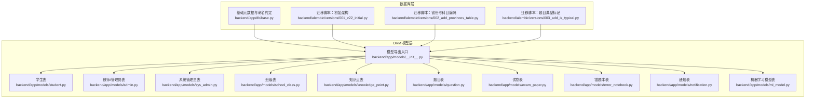
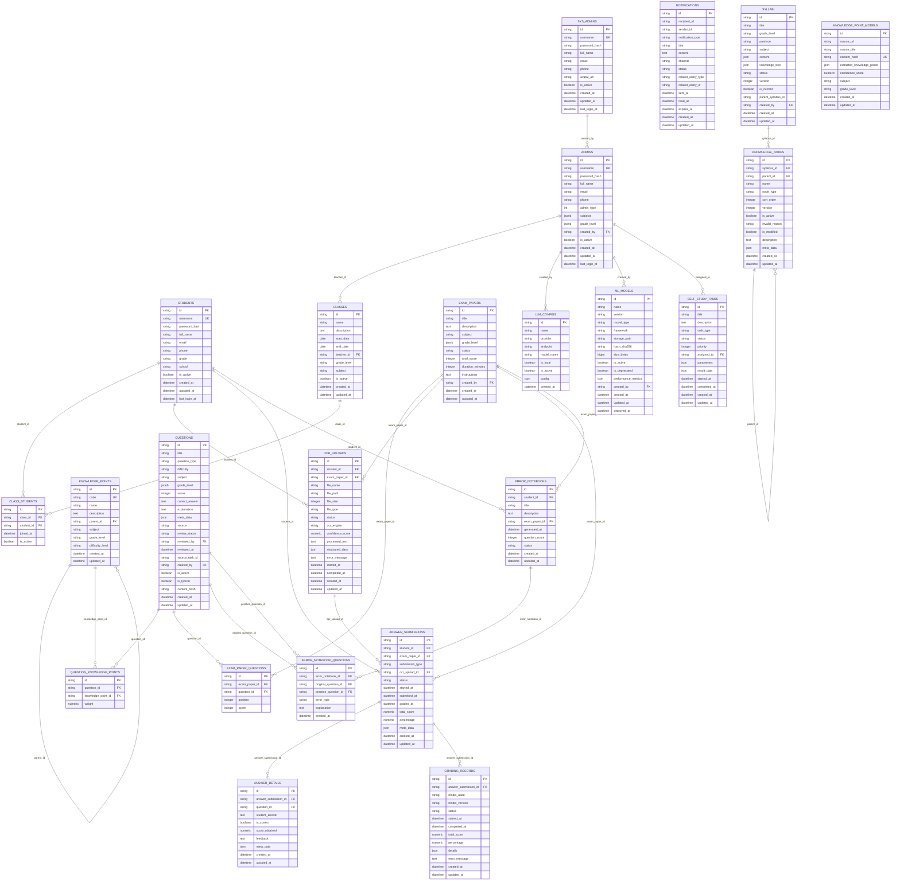
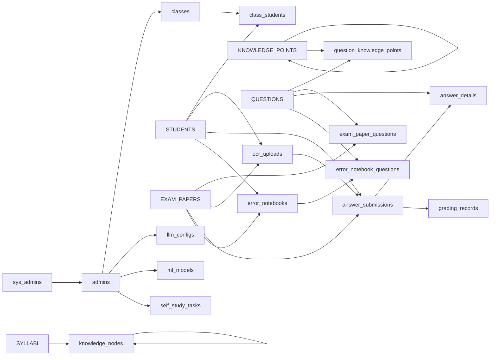

# 表结构定义

<cite>
**本文引用的文件**
- [backend/app/db/base.py](file://backend/app/db/base.py)
- [backend/app/models/__init__.py](file://backend/app/models/__init__.py)
- [backend/alembic/versions/001_v22_initial.py](file://backend/alembic/versions/001_v22_initial.py)
- [backend/alembic/versions/002_add_provinces_table.py](file://backend/alembic/versions/002_add_provinces_table.py)
- [backend/alembic/versions/003_add_is_typical.py](file://backend/alembic/versions/003_add_is_typical.py)
- [backend/app/models/school_class.py](file://backend/app/models/school_class.py)
- [backend/app/models/question.py](file://backend/app/models/question.py)
- [backend/app/models/student.py](file://backend/app/models/student.py)
- [backend/app/models/admin.py](file://backend/app/models/admin.py)
- [backend/app/models/sys_admin.py](file://backend/app/models/sys_admin.py)
- [backend/app/models/exam_paper.py](file://backend/app/models/exam_paper.py)
- [backend/app/models/knowledge_point.py](file://backend/app/models/knowledge_point.py)
- [backend/app/models/error_notebook.py](file://backend/app/models/error_notebook.py)
- [backend/app/models/notification.py](file://backend/app/models/notification.py)
- [backend/app/models/ml_model.py](file://backend/app/models/ml_model.py)
</cite>

## 目录
1. [简介](#简介)
2. [项目结构](#项目结构)
3. [核心组件](#核心组件)
4. [架构总览](#架构总览)
5. [详细组件分析](#详细组件分析)
6. [依赖关系分析](#依赖关系分析)
7. [性能考虑](#性能考虑)
8. [故障排查指南](#故障排查指南)
9. [结论](#结论)
10. [附录](#附录)

## 简介
本文件为“瑞珹教育管理系统”的数据库表结构定义文档，覆盖系统核心业务实体与关联关系。文档从字段定义、数据类型、约束条件（主键、外键、唯一、非空、检查约束）以及默认值出发，解释关键字段设计目的与使用场景，并提供表结构示例与字段说明，帮助开发者快速理解各表用途与数据组织方式。

## 项目结构
后端采用 SQLAlchemy ORM 映射，统一的命名约定与元数据配置位于基础类中；具体业务表在 Alembic 迁移脚本中创建，模型文件中补充了部分应用层约束与索引。

图表来源
- [backend/app/db/base.py:1-21](file://backend/app/db/base.py#L1-L21)
- [backend/app/models/__init__.py:1-34](file://backend/app/models/__init__.py#L1-L34)
- [backend/alembic/versions/001_v22_initial.py:1-426](file://backend/alembic/versions/001_v22_initial.py#L1-L426)
- [backend/alembic/versions/002_add_provinces_table.py:1-42](file://backend/alembic/versions/002_add_provinces_table.py#L1-L42)
- [backend/alembic/versions/003_add_is_typical.py:1-17](file://backend/alembic/versions/003_add_is_typical.py#L1-L17)

章节来源
- [backend/app/db/base.py:1-21](file://backend/app/db/base.py#L1-L21)
- [backend/app/models/__init__.py:1-34](file://backend/app/models/__init__.py#L1-L34)
- [backend/alembic/versions/001_v22_initial.py:1-426](file://backend/alembic/versions/001_v22_initial.py#L1-L426)

## 核心组件
本节概述系统中的关键数据表及其职责边界，便于快速定位业务域。

- 用户域
  - sys_admins：系统内置超级管理员账户
  - admins：业务管理员（教师、题管等），由系统管理员创建
  - students：学生用户，支持自注册
- 教学与知识域
  - classes：班级信息
  - knowledge_points：知识点树形结构
  - syllabi 与 knowledge_nodes：教学大纲与节点
  - subjects：学科信息（含可选 code）
  - provinces：省份参考表
- 题库与试卷域
  - questions：题目信息与审核状态
  - exam_papers：试卷信息与状态
  - exam_paper_questions：试卷-题目多对多关联及排序/分数
  - question_knowledge_points：题目-知识点权重关联
- 作答与评分域
  - ocr_uploads：OCR上传与识别结果
  - answer_submissions：答题提交记录
  - answer_details：每题作答详情与评分
  - grading_records：评分任务记录
- 学习与错题域
  - error_notebooks：错题本
  - error_notebook_questions：错题本-原题/练习题映射
  - self_study_tasks：自主学习任务
- 平台与能力域
  - notifications：站内/邮件/微信等通知
  - llm_configs：大模型配置
  - ml_models：机器学习模型管理
  - question_tasks：题库相关异步任务

章节来源
- [backend/app/models/__init__.py:1-34](file://backend/app/models/__init__.py#L1-L34)
- [backend/alembic/versions/001_v22_initial.py:10-415](file://backend/alembic/versions/001_v22_initial.py#L10-L415)

## 架构总览
下图展示核心表之间的关系与外键约束，体现系统的数据流向与完整性保障。

图表来源
- [backend/alembic/versions/001_v22_initial.py:10-415](file://backend/alembic/versions/001_v22_initial.py#L10-L415)
- [backend/alembic/versions/002_add_provinces_table.py:11-30](file://backend/alembic/versions/002_add_provinces_table.py#L11-L30)
- [backend/alembic/versions/003_add_is_typical.py:11-12](file://backend/alembic/versions/003_add_is_typical.py#L11-L12)
- [backend/app/models/school_class.py:7-39](file://backend/app/models/school_class.py#L7-L39)
- [backend/app/models/question.py:10-46](file://backend/app/models/question.py#L10-L46)
- [backend/app/models/student.py:8-23](file://backend/app/models/student.py#L8-L23)
- [backend/app/models/admin.py:9-27](file://backend/app/models/admin.py#L9-L27)
- [backend/app/models/sys_admin.py:8-22](file://backend/app/models/sys_admin.py#L8-L22)
- [backend/app/models/exam_paper.py:23-51](file://backend/app/models/exam_paper.py#L23-L51)
- [backend/app/models/knowledge_point.py:7-27](file://backend/app/models/knowledge_point.py#L7-L27)
- [backend/app/models/error_notebook.py:8-32](file://backend/app/models/error_notebook.py#L8-L32)
- [backend/app/models/notification.py:7-34](file://backend/app/models/notification.py#L7-L34)
- [backend/app/models/ml_model.py:8-35](file://backend/app/models/ml_model.py#L8-L35)

## 详细组件分析

### 基础设施与命名约定
- 元数据与命名规范
  - 使用统一的命名约定，涵盖索引(ix_)、唯一(uq_)、检查(ck_)、外键(fk_)、主键(pk_)
  - 通过 DeclarativeBase 统一管理约束命名，便于迁移与维护
- 设计目的
  - 规范化约束命名，降低跨数据库平台差异带来的维护成本
  - 为后续版本演进提供稳定的迁移基线

章节来源
- [backend/app/db/base.py:5-21](file://backend/app/db/base.py#L5-L21)

### 用户域

#### sys_admins（系统管理员）
- 字段与约束
  - id：主键，字符串，长度36
  - username：唯一，非空
  - password_hash：非空
  - full_name：非空
  - email/phone/avatar_url：可空
  - is_active：布尔，默认 true
  - created_at/updated_at：时间戳，默认当前时间
  - last_login_at：可空
- 设计目的
  - 支持系统级账号管理，不可删除的内置账户
- 使用场景
  - 创建/管理业务管理员，维护系统全局配置

章节来源
- [backend/alembic/versions/001_v22_initial.py:11-25](file://backend/alembic/versions/001_v22_initial.py#L11-L25)
- [backend/app/models/sys_admin.py:8-22](file://backend/app/models/sys_admin.py#L8-L22)

#### admins（业务管理员）
- 字段与约束
  - id：主键
  - username：唯一，非空
  - password_hash/full_name：非空
  - email/phone：可空
  - admin_type：整数，非空（角色枚举）
  - subjects/grade_level：JSONB，可空（支持多学科/年级）
  - created_by：外键指向 sys_admins
  - is_active：布尔，默认 true
  - created_at/updated_at/last_login_at：时间戳
- 设计目的
  - 支持多角色权限体系（教师、题管、校长、教务等）
- 使用场景
  - 班级管理、题库审核、教学资源维护

章节来源
- [backend/alembic/versions/001_v22_initial.py:27-42](file://backend/alembic/versions/001_v22_initial.py#L27-L42)
- [backend/app/models/admin.py:9-27](file://backend/app/models/admin.py#L9-L27)

#### students（学生）
- 字段与约束
  - id：主键
  - username：唯一，非空
  - password_hash/full_name：非空
  - email/phone/grade/school：可空
  - is_active：布尔，默认 true
  - created_at/updated_at/last_login_at：时间戳
- 设计目的
  - 自注册用户，支持基本档案与活跃状态控制
- 使用场景
  - 登录认证、加入班级、参与考试与练习

章节来源
- [backend/alembic/versions/001_v22_initial.py:44-59](file://backend/alembic/versions/001_v22_initial.py#L44-L59)
- [backend/app/models/student.py:8-23](file://backend/app/models/student.py#L8-L23)

### 教学与知识域

#### classes（班级）
- 字段与约束
  - id：主键
  - name：非空
  - description：文本，可空
  - teacher_id：外键指向 admins
  - grade_level/subject/start_date/end_date：可空
  - is_active：布尔，默认 true
  - created_at/updated_at：时间戳
- 关联
  - 与 students 通过中间表 class_students 多对多关联
- 设计目的
  - 班级作为教学组织单元，承载师生关系与教学活动
- 使用场景
  - 发布作业、布置考试、查看学习进度

章节来源
- [backend/alembic/versions/001_v22_initial.py:61-75](file://backend/alembic/versions/001_v22_initial.py#L61-L75)
- [backend/app/models/school_class.py:7-39](file://backend/app/models/school_class.py#L7-L39)

#### class_students（班级-学生关联）
- 字段与约束
  - id：主键
  - class_id/student_id：外键，联合唯一
  - joined_at：时间戳，默认当前时间
  - is_active：布尔，默认 true
- 设计目的
  - 记录学生加入/退出班级的时间点与状态
- 使用场景
  - 班级成员管理、统计与审计

章节来源
- [backend/alembic/versions/001_v22_initial.py:153-161](file://backend/alembic/versions/001_v22_initial.py#L153-L161)
- [backend/app/models/school_class.py:31-39](file://backend/app/models/school_class.py#L31-L39)

#### knowledge_points（知识点）
- 字段与约束
  - id：主键
  - code：唯一，非空
  - name/description：非空/可空
  - parent_id：自引用外键，形成树形结构
  - subject/grade_level/difficulty_level：可空
  - created_at/updated_at：时间戳
- 设计目的
  - 支持知识点层级与学科/年级维度
- 使用场景
  - 题目标签、教学大纲拆解、智能推荐

章节来源
- [backend/alembic/versions/001_v22_initial.py:77-90](file://backend/alembic/versions/001_v22_initial.py#L77-L90)
- [backend/app/models/knowledge_point.py:7-27](file://backend/app/models/knowledge_point.py#L7-L27)

#### question_knowledge_points（题目-知识点关联）
- 字段与约束
  - id：主键
  - question_id/knowledge_point_id：外键，联合唯一
  - weight：数值，带精度
- 设计目的
  - 为题目分配知识点权重，支撑智能组卷与诊断
- 使用场景
  - 题目归类、知识点覆盖率统计

章节来源
- [backend/alembic/versions/001_v22_initial.py:163-170](file://backend/alembic/versions/001_v22_initial.py#L163-L170)

#### syllabi 与 knowledge_nodes（教学大纲与节点）
- syllabi
  - 字段：标题、年级、省份、学科、内容JSON、知识树JSON、状态、版本、是否当前、父大纲、创建者、时间戳
  - 约束：状态默认 DRAFT，版本默认 1，是否当前默认 true
- knowledge_nodes
  - 字段：所属大纲、父节点、名称、节点类型、排序、版本、是否激活、失效原因、是否修改、描述、元数据、时间戳
  - 约束：节点类型默认 POINT，排序/版本/修改标志均有默认值
- 设计目的
  - 支持区域化/版本化的课程标准落地
- 使用场景
  - 生成教学计划、构建知识图谱

章节来源
- [backend/alembic/versions/001_v22_initial.py:307-324](file://backend/alembic/versions/001_v22_initial.py#L307-L324)
- [backend/alembic/versions/001_v22_initial.py:345-362](file://backend/alembic/versions/001_v22_initial.py#L345-L362)

#### subjects 与 provinces（学科与省份）
- subjects
  - 字段：名称、分类、是否激活、创建时间
  - 约束：名称唯一；迁移中可选增加 code 字段并唯一
- provinces
  - 字段：编号、名称、排序、是否激活、创建时间
  - 约束：编号唯一
- 设计目的
  - 提供标准化的学科与地区维度
- 使用场景
  - 区分考区、匹配教学大纲

章节来源
- [backend/alembic/versions/001_v22_initial.py:92-100](file://backend/alembic/versions/001_v22_initial.py#L92-L100)
- [backend/alembic/versions/002_add_provinces_table.py:11-30](file://backend/alembic/versions/002_add_provinces_table.py#L11-L30)

### 题库与试卷域

#### questions（题目）
- 字段与约束
  - id：主键
  - 标题、类型、难度、学科、分数、正确答案、解析、元数据
  - 来源、审核状态、审核人、审核时间、来源任务
  - created_by：外键指向 admins
  - is_active/is_typical/content_hash：布尔/字符串，可空
  - created_at/updated_at：时间戳
  - 检查约束：类型枚举、难度枚举、分数>0
- 设计目的
  - 统一题目生命周期与质量控制
- 使用场景
  - 组卷、错题本、AI标注与去重

章节来源
- [backend/alembic/versions/001_v22_initial.py:102-124](file://backend/alembic/versions/001_v22_initial.py#L102-L124)
- [backend/alembic/versions/003_add_is_typical.py:11-12](file://backend/alembic/versions/003_add_is_typical.py#L11-L12)
- [backend/app/models/question.py:10-46](file://backend/app/models/question.py#L10-L46)

#### exam_papers（试卷）
- 字段与约束
  - id：主键
  - 标题、描述、学科、年级范围、状态、总分、时长、说明
  - created_by：外键指向 admins
  - created_at/updated_at：时间戳
  - 检查约束：总分≥0、时长≥0、状态枚举
- 关联
  - 与 questions 通过 exam_paper_questions 多对多关联
- 设计目的
  - 支持试卷全生命周期管理
- 使用场景
  - 考试发布、阅卷、统计

章节来源
- [backend/alembic/versions/001_v22_initial.py:126-141](file://backend/alembic/versions/001_v22_initial.py#L126-L141)
- [backend/app/models/exam_paper.py:23-51](file://backend/app/models/exam_paper.py#L23-L51)

#### exam_paper_questions（试卷-题目关联）
- 字段与约束
  - id：主键
  - exam_paper_id/question_id：外键，联合唯一
  - position/score：非负整数
- 设计目的
  - 记录题目在试卷中的顺序与分值
- 使用场景
  - 生成答题卡、计算总分

章节来源
- [backend/alembic/versions/001_v22_initial.py:143-151](file://backend/alembic/versions/001_v22_initial.py#L143-L151)
- [backend/app/models/exam_paper.py:9-20](file://backend/app/models/exam_paper.py#L9-L20)

### 作答与评分域

#### ocr_uploads（OCR上传）
- 字段与约束
  - id：主键
  - 关联：学生、试卷
  - 文件名/路径/大小/类型、状态、引擎、置信度、结构化数据、错误信息
  - 时间：开始/完成、创建/更新
- 设计目的
  - 记录扫描件处理过程与结果
- 使用场景
  - 批改前的数据准备

章节来源
- [backend/alembic/versions/001_v22_initial.py:172-192](file://backend/alembic/versions/001_v22_initial.py#L172-L192)

#### answer_submissions（答题提交）
- 字段与约束
  - id：主键
  - 关联：学生、试卷、OCR上传
  - 类型、状态、开始/提交/阅卷时间、得分/百分比、元数据
  - created_at/updated_at：时间戳
- 设计目的
  - 统一记录一次作答全流程
- 使用场景
  - 作答追踪、成绩统计

章节来源
- [backend/alembic/versions/001_v22_initial.py:194-211](file://backend/alembic/versions/001_v22_initial.py#L194-L211)

#### answer_details（作答详情）
- 字段与约束
  - id：主键
  - 关联：答题提交、题目
  - 学生答案、是否正确、得分、反馈、元数据
  - created_at/updated_at：时间戳
  - 约束：提交-题目唯一
- 设计目的
  - 逐题记录作答与评分
- 使用场景
  - 错题分析、个性化反馈

章节来源
- [backend/alembic/versions/001_v22_initial.py:213-226](file://backend/alembic/versions/001_v22_initial.py#L213-L226)

#### grading_records（评分记录）
- 字段与约束
  - id：主键
  - 关联：答题提交
  - 使用模型/版本、状态、开始/完成、总分/百分比、明细、错误信息
  - created_at/updated_at：时间戳
- 设计目的
  - 记录评分任务执行情况
- 使用场景
  - AI评分溯源、异常监控

章节来源
- [backend/alembic/versions/001_v22_initial.py:228-244](file://backend/alembic/versions/001_v22_initial.py#L228-L244)

### 学习与错题域

#### error_notebooks（错题本）
- 字段与约束
  - id：主键
  - 关联：学生、试卷
  - 标题、描述、生成时间、题目数量、状态
  - created_at/updated_at：时间戳
  - 检查约束：题目数量≥0、状态枚举
- 设计目的
  - 支撑个性化复习
- 使用场景
  - 生成错题本、导出打印

章节来源
- [backend/alembic/versions/001_v22_initial.py:246-259](file://backend/alembic/versions/001_v22_initial.py#L246-L259)
- [backend/app/models/error_notebook.py:8-32](file://backend/app/models/error_notebook.py#L8-L32)

#### error_notebook_questions（错题本-题目）
- 字段与约束
  - id：主键
  - 关联：错题本、原题、练习题
  - 错误类型、解析
  - created_at：时间戳
  - 约束：错题本-原题唯一
- 设计目的
  - 建立错题与巩固练习的映射
- 使用场景
  - 推荐同类题、生成强化训练

章节来源
- [backend/alembic/versions/001_v22_initial.py:261-271](file://backend/alembic/versions/001_v22_initial.py#L261-L271)

#### self_study_tasks（自主学习任务）
- 字段与约束
  - id：主键
  - 标题、描述、类型、状态、优先级、参数、结果数据
  - 关联：指派给管理员
  - 时间：开始/完成、创建/更新
- 设计目的
  - 支持教师发起学习任务
- 使用场景
  - 个性化学习路径编排

章节来源
- [backend/alembic/versions/001_v22_initial.py:399-415](file://backend/alembic/versions/001_v22_initial.py#L399-L415)

### 平台与能力域

#### notifications（通知）
- 字段与约束
  - id：主键
  - 接收者/发送者、类型、标题、内容、渠道、状态、关联实体
  - 时间：发送/已读/过期、创建/更新
  - 检查约束：类型/渠道/状态枚举
- 设计目的
  - 多通道消息推送与追踪
- 使用场景
  - 考试提醒、阅卷完成、系统公告

章节来源
- [backend/alembic/versions/001_v22_initial.py:273-291](file://backend/alembic/versions/001_v22_initial.py#L273-L291)
- [backend/app/models/notification.py:7-34](file://backend/app/models/notification.py#L7-L34)

#### llm_configs（大模型配置）
- 字段与约束
  - id：主键
  - 名称、提供商、端点、模型名、是否本地/激活、配置JSON、创建时间
- 设计目的
  - 统一管理外部大模型接入参数
- 使用场景
  - AI评语、智能纠错、内容生成

章节来源
- [backend/alembic/versions/001_v22_initial.py:293-305](file://backend/alembic/versions/001_v22_initial.py#L293-L305)

#### ml_models（机器学习模型）
- 字段与约束
  - id：主键
  - 名称/版本、类型/框架、存储路径、哈希/大小、是否激活/弃用、性能指标
  - 关联：创建者
  - 时间：创建/更新/部署
  - 约束：唯一(name, version)、模型类型枚举、大小>0
- 设计目的
  - 版本化管理与部署追踪
- 使用场景
  - OCR/评分/题库生成等模型治理

章节来源
- [backend/alembic/versions/001_v22_initial.py:379-397](file://backend/alembic/versions/001_v22_initial.py#L379-L397)
- [backend/app/models/ml_model.py:8-35](file://backend/app/models/ml_model.py#L8-L35)

## 依赖关系分析
- 外键依赖
  - admins.created_by → sys_admins.id
  - classes.teacher_id → admins.id
  - class_students.class_id → classes.id
  - class_students.student_id → students.id
  - knowledge_points.parent_id → knowledge_points.id
  - question_knowledge_points.question_id → questions.id
  - question_knowledge_points.knowledge_point_id → knowledge_points.id
  - questions.reviewed_by → admins.id
  - questions.created_by → admins.id
  - exam_paper_questions.exam_paper_id → exam_papers.id
  - exam_paper_questions.question_id → questions.id
  - ocr_uploads.student_id → students.id
  - ocr_uploads.exam_paper_id → exam_papers.id
  - answer_submissions.student_id → students.id
  - answer_submissions.exam_paper_id → exam_papers.id
  - answer_submissions.ocr_upload_id → ocr_uploads.id
  - answer_details.answer_submission_id → answer_submissions.id
  - answer_details.question_id → questions.id
  - grading_records.answer_submission_id → answer_submissions.id
  - error_notebooks.student_id → students.id
  - error_notebooks.exam_paper_id → exam_papers.id
  - error_notebook_questions.error_notebook_id → error_notebooks.id
  - error_notebook_questions.original_question_id → questions.id
  - error_notebook_questions.practice_question_id → questions.id
  - llm_configs.created_by → admins.id
  - knowledge_nodes.syllabus_id → syllabi.id
  - knowledge_nodes.parent_id → knowledge_nodes.id
  - ml_models.created_by → admins.id
  - self_study_tasks.assigned_to → admins.id
- 约束与索引
  - 多表包含唯一约束（用户名、code、content_hash、联合唯一）
  - 多处外键索引（如 teacher_id、question_id、student_id 等）
  - 应用层检查约束（如题目类型/难度、分数非负、状态枚举）

图表来源
- [backend/alembic/versions/001_v22_initial.py:10-415](file://backend/alembic/versions/001_v22_initial.py#L10-L415)

章节来源
- [backend/alembic/versions/001_v22_initial.py:10-415](file://backend/alembic/versions/001_v22_initial.py#L10-L415)

## 性能考虑
- 索引策略
  - 高频过滤字段（如 username、code、content_hash、subject、grade_level、created_by）建立索引或唯一索引，提升查询效率
  - 外键字段（如 teacher_id、student_id、question_id、paper_id）建议保持索引以加速连接
- 默认值与触发
  - created_at/updated_at 使用服务器默认值，减少应用层开销
  - is_active 默认 true，便于快速启用新记录
- 数据类型选择
  - JSON/JSONB 用于灵活元数据存储，注意查询与索引策略
  - 数值精度（numeric）用于分数与置信度，确保评分一致性
- 分区与归档
  - 建议按时间维度对历史表（如 answer_details、grading_records、notifications）进行分区或归档，降低热数据压力

## 故障排查指南
- 常见约束错误
  - 唯一冲突：检查 username/code/content_hash 的唯一性
  - 外键缺失：确认关联对象是否存在且 is_active 合理
  - 检查约束失败：核对枚举值（如状态、类型、渠道）是否符合约束
- 时间字段异常
  - created_at/updated_at 未更新：确认是否使用 server_default 与 onupdate
  - last_login_at 为空：检查登录流程是否写入
- 数据不一致
  - total_score 与 exam_paper_questions.score 不一致：核对组卷逻辑与保存流程
  - 错题本题目数量与实际不符：检查统计聚合逻辑

章节来源
- [backend/app/models/question.py:38-43](file://backend/app/models/question.py#L38-L43)
- [backend/app/models/exam_paper.py:43-48](file://backend/app/models/exam_paper.py#L43-L48)
- [backend/app/models/error_notebook.py:22-26](file://backend/app/models/error_notebook.py#L22-L26)
- [backend/app/models/notification.py:26-31](file://backend/app/models/notification.py#L26-L31)

## 结论
本表结构定义文档基于 Alembic 迁移与 SQLAlchemy 模型，系统化梳理了用户、教学、题库、作答、错题与平台能力等核心领域。通过统一的命名约定、严格的约束与合理的索引策略，为系统的稳定性与扩展性提供了坚实基础。建议在后续迭代中持续完善索引与分区策略，并加强数据字典与变更日志的维护。

## 附录

### 关键字段设计说明
- id
  - 类型：字符串（UUID，长度36）
  - 设计目的：全局唯一标识，跨服务与迁移稳定
  - 使用场景：所有表主键，外键引用
- created_at/updated_at
  - 类型：时间戳（带时区）
  - 设计目的：审计与排序，支持 onupdate 自动刷新
  - 使用场景：数据生命周期管理、报表统计
- is_active
  - 类型：布尔
  - 设计目的：软删除与开关控制
  - 使用场景：用户停用、功能开关、数据隔离

章节来源
- [backend/app/db/base.py:5-21](file://backend/app/db/base.py#L5-L21)
- [backend/app/models/student.py:19](file://backend/app/models/student.py#L19)
- [backend/app/models/admin.py:23](file://backend/app/models/admin.py#L23)
- [backend/app/models/sys_admin.py:18](file://backend/app/models/sys_admin.py#L18)
- [backend/app/models/school_class.py:18](file://backend/app/models/school_class.py#L18)
- [backend/app/models/question.py:29](file://backend/app/models/question.py#L29)
- [backend/app/models/exam_paper.py:36](file://backend/app/models/exam_paper.py#L36)
- [backend/app/models/error_notebook.py:18](file://backend/app/models/error_notebook.py#L18)
- [backend/app/models/notification.py:17](file://backend/app/models/notification.py#L17)
- [backend/app/models/ml_model.py:19](file://backend/app/models/ml_model.py#L19)