# OCR识别系统

<cite>
**本文档引用的文件**
- [backend/app/api/v1/endpoints/ocr.py](file://backend/app/api/v1/endpoints/ocr.py)
- [backend/app/services/ocr_service.py](file://backend/app/services/ocr_service.py)
- [backend/app/models/ocr_upload.py](file://backend/app/models/ocr_upload.py)
- [backend/app/schemas/ocr.py](file://backend/app/schemas/ocr.py)
- [backend/alembic/versions/005_add_ocr_needs_review_status.py](file://backend/alembic/versions/005_add_ocr_needs_review_status.py)
- [backend/app/core/config.py](file://backend/app/core/config.py)
- [nDocs/ocr-integration-plan.md](file://nDocs/ocr-integration-plan.md)
- [frontend/src/pages/exam-mistakes/PhotoScanTab.tsx](file://frontend/src/pages/exam-mistakes/PhotoScanTab.tsx)
</cite>

## 目录
1. [简介](#简介)
2. [项目结构](#项目结构)
3. [核心组件](#核心组件)
4. [架构概览](#架构概览)
5. [详细组件分析](#详细组件分析)
6. [依赖关系分析](#依赖关系分析)
7. [性能考虑](#性能考虑)
8. [故障排除指南](#故障排除指南)
9. [结论](#结论)

## 简介

瑞珹教育管理系统中的OCR识别系统是一个基于Tesseract OCR的图像识别解决方案，专门用于处理学生上传的答卷图片，将其转换为结构化的文本数据。该系统当前处于V3.0阶段，采用Tesseract OCR作为主要识别引擎，支持中文和英文识别，具备人工审核功能以确保识别准确性。

系统的主要目标是：
- 将学生拍摄的答卷图片转换为可编辑的文本格式
- 提取结构化的题目信息，包括选择题、填空题和主观题
- 提供置信度评估和人工审核机制
- 支持批量处理和异步处理能力

## 项目结构

OCR识别系统在瑞珹教育管理系统中采用模块化设计，主要包含以下核心模块：

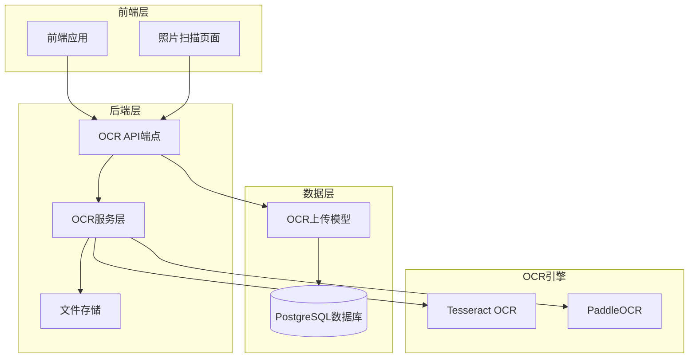

**图表来源**
- [backend/app/api/v1/endpoints/ocr.py:1-291](file://backend/app/api/v1/endpoints/ocr.py#L1-L291)
- [backend/app/services/ocr_service.py:1-126](file://backend/app/services/ocr_service.py#L1-L126)
- [backend/app/models/ocr_upload.py:1-36](file://backend/app/models/ocr_upload.py#L1-L36)

**章节来源**
- [backend/app/api/v1/endpoints/ocr.py:1-291](file://backend/app/api/v1/endpoints/ocr.py#L1-L291)
- [backend/app/services/ocr_service.py:1-126](file://backend/app/services/ocr_service.py#L1-L126)
- [backend/app/models/ocr_upload.py:1-36](file://backend/app/models/ocr_upload.py#L1-L36)

## 核心组件

### OCR API端点

OCR系统提供了完整的RESTful API接口，支持图片上传、状态查询、结果获取等功能：

| 端点 | 方法 | 功能 | 权限要求 |
|------|------|------|----------|
| `/ocr/upload/file` | POST | 文件上传并执行OCR处理 | 学生用户 |
| `/ocr/upload` | POST | 创建OCR上传记录 | 学生用户 |
| `/ocr/status/{upload_id}` | GET | 查询OCR处理状态 | 学生/教师/管理员 |
| `/ocr/result/{upload_id}` | GET | 获取OCR识别结果 | 学生/教师/管理员 |
| `/ocr` | GET | 获取OCR上传列表 | 学生/教师/管理员 |
| `/ocr/{upload_id}` | PUT | 更新OCR上传记录 | 学生用户 |
| `/ocr/{upload_id}` | DELETE | 删除OCR上传记录 | 学生用户 |
| `/ocr/config` | GET | 获取OCR配置 | 系统管理员 |
| `/ocr/config` | PUT | 更新OCR配置 | 系统管理员 |

### OCR服务层

OCR服务层是系统的核心处理模块，负责图像预处理、文本识别和结果后处理：

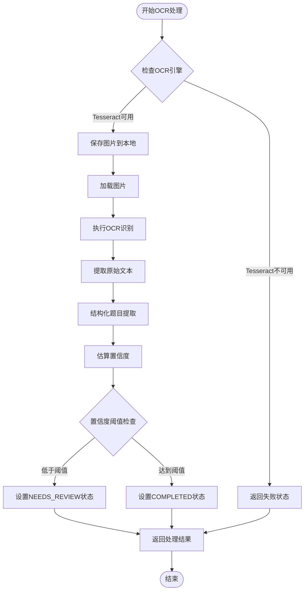

**图表来源**
- [backend/app/services/ocr_service.py:61-126](file://backend/app/services/ocr_service.py#L61-L126)

### 数据模型

OCR系统使用专门的数据模型来存储识别结果和处理状态：

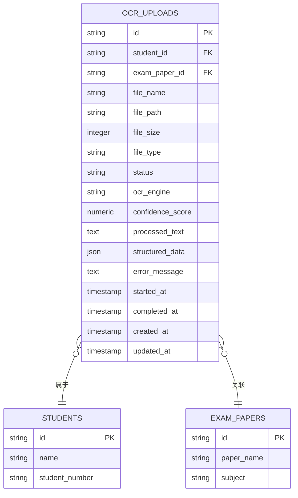

**图表来源**
- [backend/app/models/ocr_upload.py:8-36](file://backend/app/models/ocr_upload.py#L8-L36)

**章节来源**
- [backend/app/api/v1/endpoints/ocr.py:18-291](file://backend/app/api/v1/endpoints/ocr.py#L18-L291)
- [backend/app/services/ocr_service.py:1-126](file://backend/app/services/ocr_service.py#L1-L126)
- [backend/app/models/ocr_upload.py:1-36](file://backend/app/models/ocr_upload.py#L1-L36)

## 架构概览

OCR识别系统采用分层架构设计，实现了清晰的关注点分离：

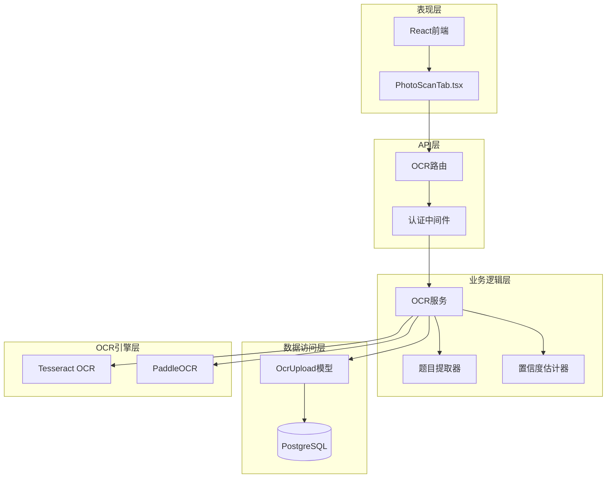

**图表来源**
- [backend/app/api/v1/endpoints/ocr.py:15-291](file://backend/app/api/v1/endpoints/ocr.py#L15-L291)
- [backend/app/services/ocr_service.py:1-126](file://backend/app/services/ocr_service.py#L1-L126)
- [frontend/src/pages/exam-mistakes/PhotoScanTab.tsx:1-186](file://frontend/src/pages/exam-mistakes/PhotoScanTab.tsx#L1-L186)

系统架构特点：
- **异步处理**：支持异步OCR处理，避免阻塞主线程
- **多引擎支持**：当前使用Tesseract，预留PaddleOCR扩展
- **状态管理**：完整的处理状态跟踪（PENDING、PROCESSING、COMPLETED、FAILED、NEEDS_REVIEW）
- **人工审核**：低置信度自动标记为需要人工审核
- **结构化输出**：将识别结果转换为结构化的题目数据

## 详细组件分析

### 图像上传处理流程

图像上传处理是OCR系统的第一步，负责接收用户上传的图片并进行初步处理：

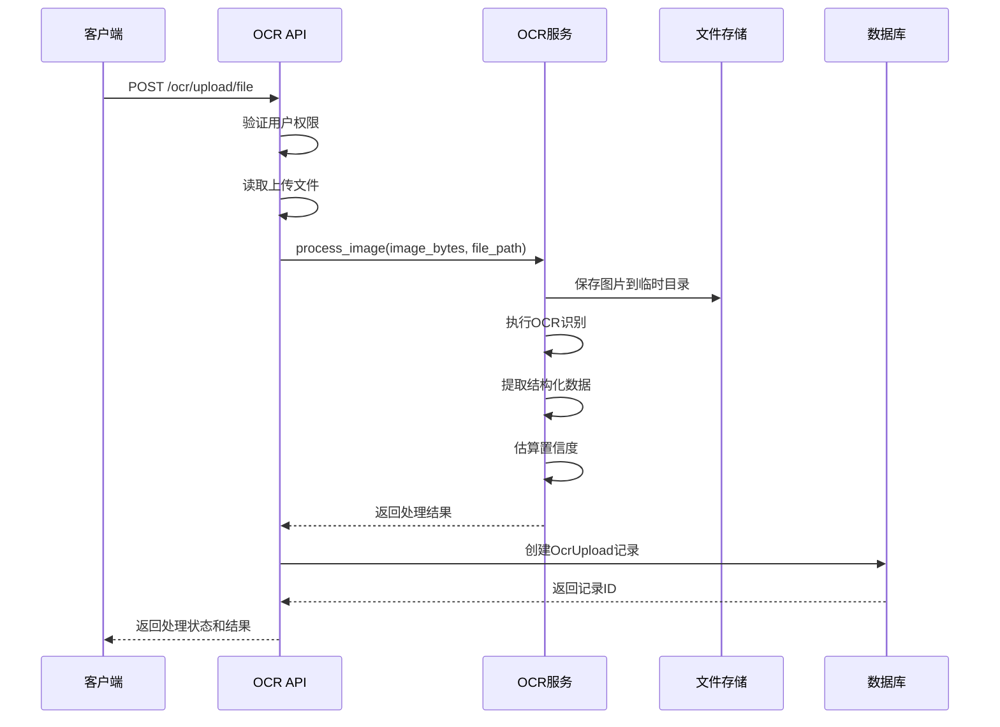

**图表来源**
- [backend/app/api/v1/endpoints/ocr.py:18-64](file://backend/app/api/v1/endpoints/ocr.py#L18-L64)
- [backend/app/services/ocr_service.py:61-126](file://backend/app/services/ocr_service.py#L61-L126)

### 文本识别算法

OCR系统采用启发式算法来提取结构化的题目信息：

#### 题目提取算法

系统使用正则表达式模式来识别不同类型的题目：

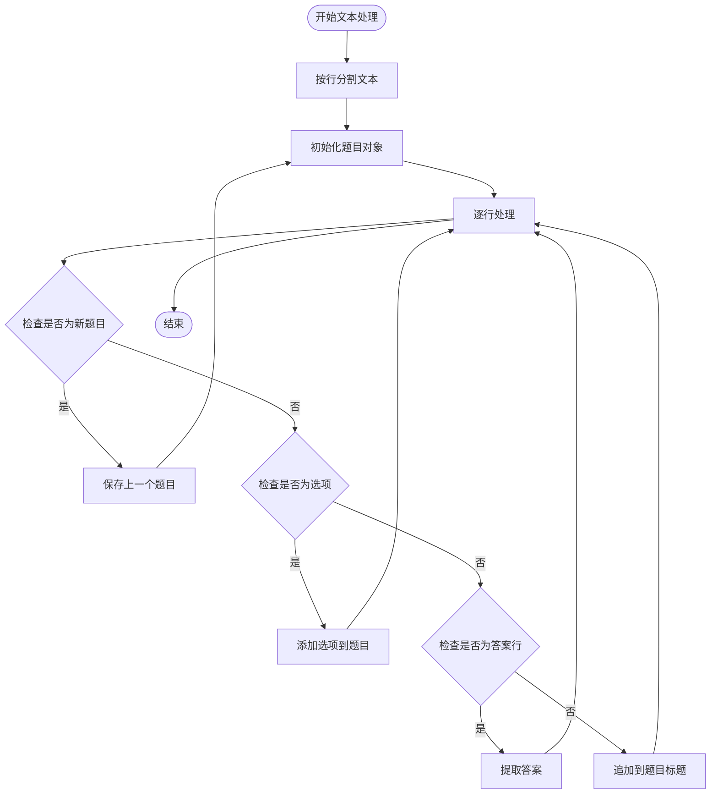

**图表来源**
- [backend/app/services/ocr_service.py:20-42](file://backend/app/services/ocr_service.py#L20-L42)

#### 置信度评估算法

系统通过多种特征来评估OCR识别的置信度：

| 评估特征 | 计算方法 | 权重 |
|----------|----------|------|
| 中文字符比例 | 中文字符数/总字符数 | 50% |
| 文本行数 | min(行数/5, 1.0) | 50% |
| 总字符长度 | 根据长度调整分数 | 可变 |

**章节来源**
- [backend/app/services/ocr_service.py:20-58](file://backend/app/services/ocr_service.py#L20-L58)

### 结构化数据提取流程

系统将OCR识别的原始文本转换为结构化的题目数据：

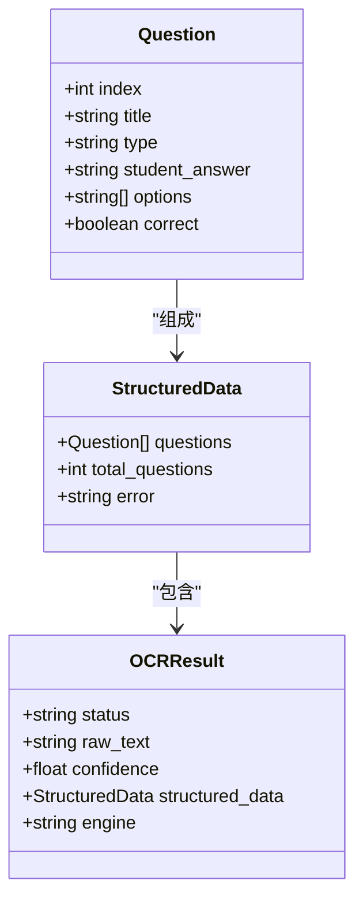

**图表来源**
- [backend/app/services/ocr_service.py:105-125](file://backend/app/services/ocr_service.py#L105-L125)

### OCR引擎配置

系统支持灵活的OCR引擎配置，当前默认使用PaddleOCR，但预留Tesseract支持：

| 配置项 | 默认值 | 描述 |
|--------|--------|------|
| OCR_ENGINE | paddleocr | OCR引擎类型 |
| OCR_LANG | ch | 语言设置 |
| MAX_UPLOAD_SIZE | 10MB | 最大文件大小 |
| CONFIDENCE_THRESHOLD | 0.7 | 置信度阈值 |

**章节来源**
- [backend/app/core/config.py:81-84](file://backend/app/core/config.py#L81-L84)
- [backend/app/api/v1/endpoints/ocr.py:239-267](file://backend/app/api/v1/endpoints/ocr.py#L239-L267)

### 批量处理机制

系统目前支持单张图片处理，批量处理功能正在开发中：

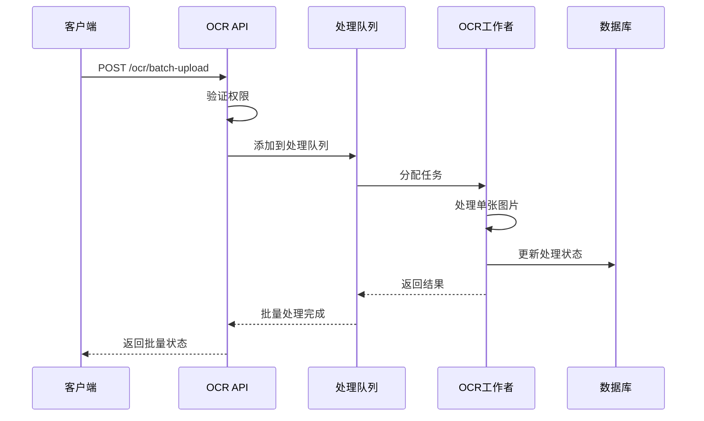

**图表来源**
- [backend/app/api/v1/endpoints/ocr.py:270-291](file://backend/app/api/v1/endpoints/ocr.py#L270-L291)

## 依赖关系分析

OCR系统的关键依赖关系如下：

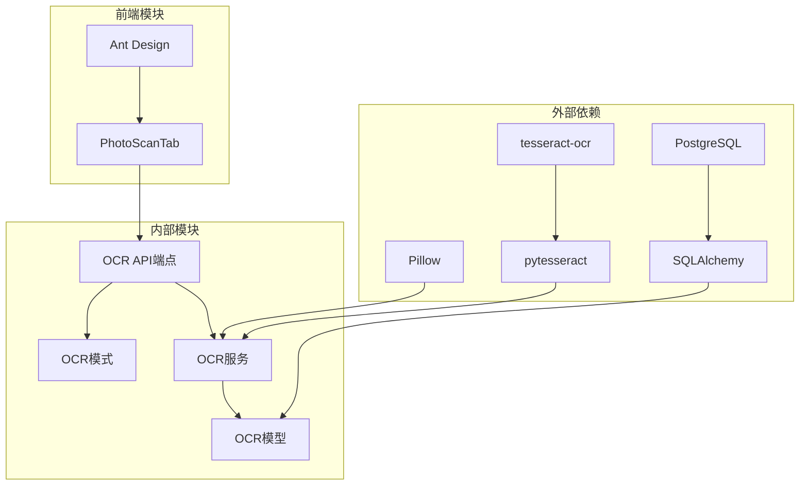

**图表来源**
- [backend/app/services/ocr_service.py:9-14](file://backend/app/services/ocr_service.py#L9-L14)
- [backend/app/models/ocr_upload.py:1-5](file://backend/app/models/ocr_upload.py#L1-L5)

系统依赖特点：
- **OCR引擎**：依赖Tesseract OCR进行文本识别
- **图像处理**：使用Pillow库处理图片格式
- **数据库**：使用PostgreSQL存储识别结果
- **ORM框架**：使用SQLAlchemy进行数据库操作
- **前端框架**：使用React和Ant Design构建用户界面

**章节来源**
- [backend/app/services/ocr_service.py:1-15](file://backend/app/services/ocr_service.py#L1-L15)
- [backend/app/models/ocr_upload.py:1-5](file://backend/app/models/ocr_upload.py#L1-L5)

## 性能考虑

### OCR引擎性能优化

系统在性能方面采用了多项优化策略：

1. **异步处理**：OCR处理采用异步方式，避免阻塞主线程
2. **缓存机制**：支持模型缓存，减少重复加载时间
3. **内存管理**：及时释放图片处理后的内存资源
4. **并发控制**：通过配置项控制最大并发OCR处理数量

### 置信度阈值优化

系统使用动态阈值来平衡准确性和效率：

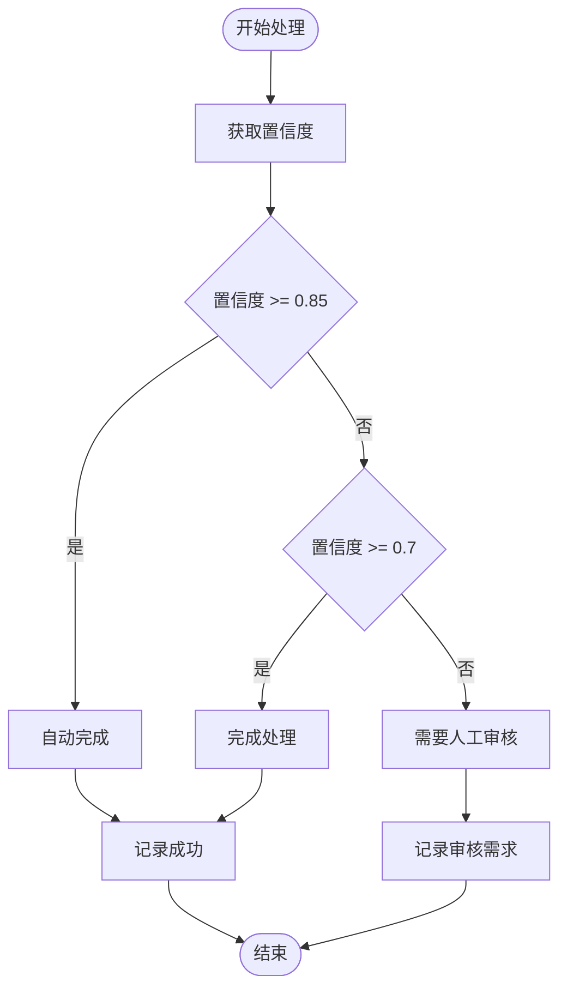

**图表来源**
- [backend/app/services/ocr_service.py:17](file://backend/app/services/ocr_service.py#L17)
- [backend/app/services/ocr_service.py:102](file://backend/app/services/ocr_service.py#L102)

### 扩展性设计

系统为未来的性能提升预留了扩展空间：

1. **PaddleOCR集成**：已规划的GPU加速版本
2. **分布式处理**：支持多节点并行处理
3. **CDN存储**：计划使用CDN加速图片传输
4. **缓存策略**：支持Redis缓存热点数据

## 故障排除指南

### 常见问题及解决方案

#### OCR引擎不可用

**问题症状**：系统返回"OCR引擎不可用"错误

**可能原因**：
- Tesseract未安装
- Python包导入失败
- 系统依赖缺失

**解决步骤**：
1. 检查Tesseract安装状态
2. 验证Python依赖包
3. 确认系统环境变量

#### 图片处理失败

**问题症状**：图片上传后处理失败

**可能原因**：
- 图片格式不支持
- 图片损坏
- 磁盘空间不足

**解决步骤**：
1. 验证图片格式（JPG、PNG等）
2. 检查图片完整性
3. 清理磁盘空间

#### 置信度过低

**问题症状**：识别结果被标记为需要人工审核

**可能原因**：
- 图片质量差
- 字体识别困难
- 光线条件不佳

**解决步骤**：
1. 重新拍摄高质量图片
2. 改善拍摄光线条件
3. 使用标准字体书写

### 错误处理策略

系统采用多层次的错误处理机制：

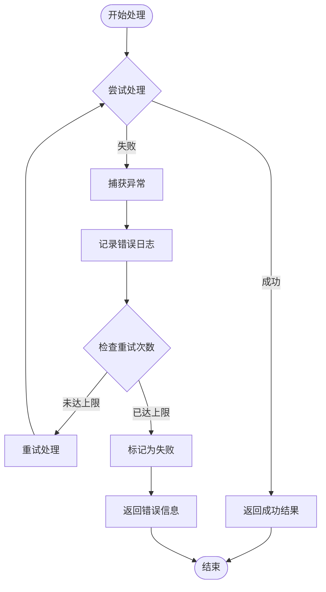

**图表来源**
- [backend/app/services/ocr_service.py:85-96](file://backend/app/services/ocr_service.py#L85-L96)

**章节来源**
- [backend/app/services/ocr_service.py:71-96](file://backend/app/services/ocr_service.py#L71-L96)

## 结论

瑞珹教育管理系统的OCR识别系统是一个功能完整、设计合理的图像识别解决方案。系统采用模块化架构，支持异步处理和人工审核，能够有效满足教育场景下的图片识别需求。

### 主要优势

1. **技术成熟**：基于成熟的Tesseract OCR引擎
2. **结构化输出**：能够提取结构化的题目数据
3. **人工审核**：低置信度自动标记，确保准确性
4. **扩展性强**：预留PaddleOCR集成和分布式处理能力

### 发展方向

1. **引擎升级**：从Tesseract升级到PaddleOCR，提升识别准确率
2. **性能优化**：实现GPU加速和分布式处理
3. **功能完善**：实现完整的批量处理和异步队列机制
4. **存储优化**：采用CDN和对象存储提升性能

该系统为瑞珹教育管理系统的智能化发展奠定了坚实基础，能够有效提升教学质量和学习体验。