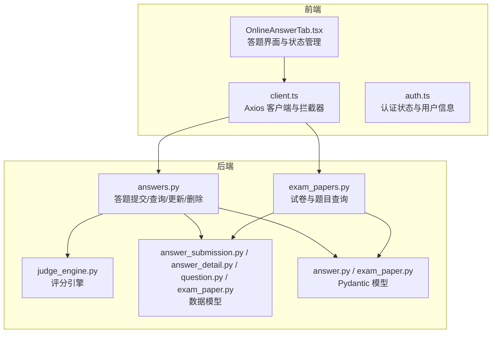
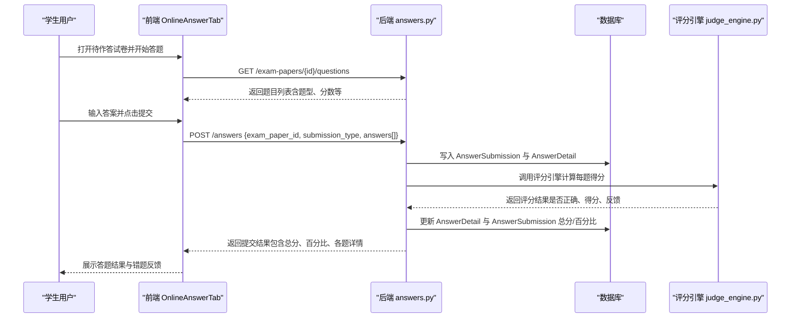
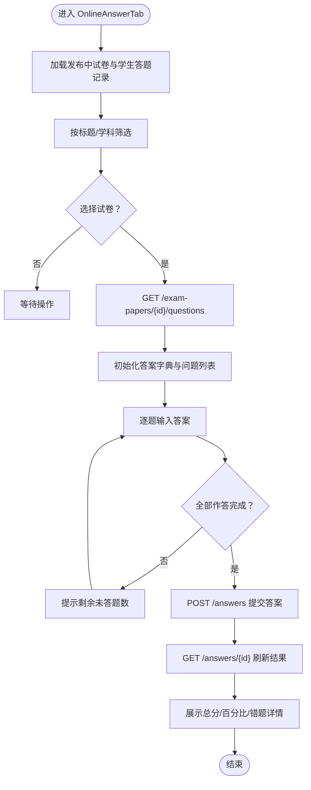
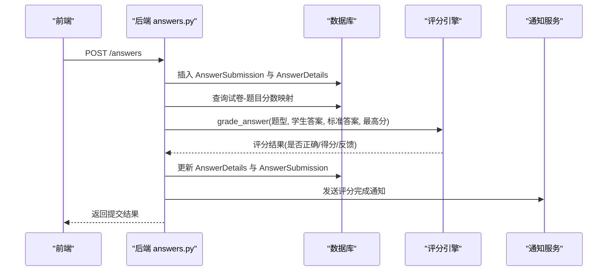
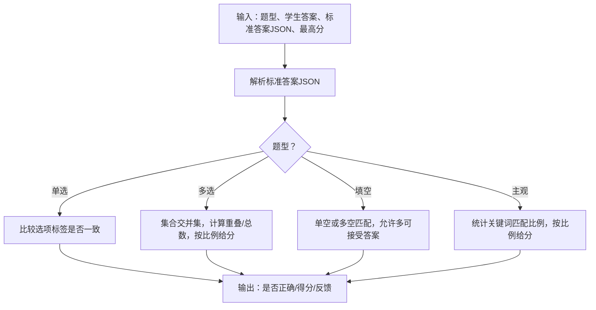
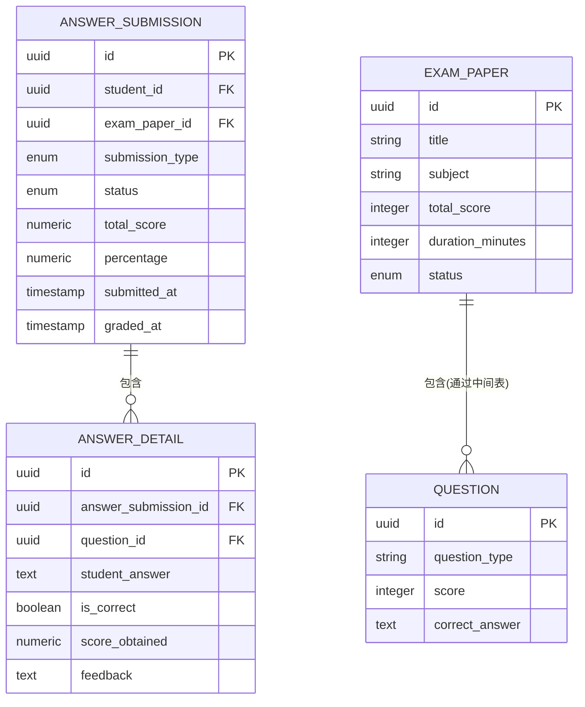
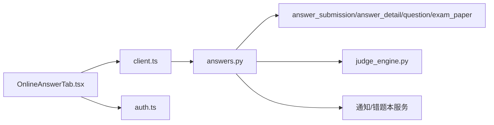

# 在线作答系统

<cite>
**本文引用的文件**
- [backend/app/api/v1/endpoints/answers.py](file://backend/app/api/v1/endpoints/answers.py)
- [frontend/src/pages/exam-mistakes/OnlineAnswerTab.tsx](file://frontend/src/pages/exam-mistakes/OnlineAnswerTab.tsx)
- [backend/app/models/answer_detail.py](file://backend/app/models/answer_detail.py)
- [backend/app/models/answer_submission.py](file://backend/app/models/answer_submission.py)
- [backend/app/schemas/answer.py](file://backend/app/schemas/answer.py)
- [backend/app/services/judge_engine.py](file://backend/app/services/judge_engine.py)
- [backend/app/models/question.py](file://backend/app/models/question.py)
- [backend/app/api/v1/endpoints/exam_papers.py](file://backend/app/api/v1/endpoints/exam_papers.py)
- [backend/app/models/exam_paper.py](file://backend/app/models/exam_paper.py)
- [frontend/src/api/client.ts](file://frontend/src/api/client.ts)
- [frontend/src/store/auth.ts](file://frontend/src/store/auth.ts)
</cite>

## 目录
1. [引言](#引言)
2. [项目结构](#项目结构)
3. [核心组件](#核心组件)
4. [架构总览](#架构总览)
5. [详细组件分析](#详细组件分析)
6. [依赖分析](#依赖分析)
7. [性能考虑](#性能考虑)
8. [故障排查指南](#故障排查指南)
9. [结论](#结论)
10. [附录](#附录)

## 引言
本文件面向“瑞珹教育管理系统”的在线作答子系统，聚焦以下目标：
- 实时答题流程与答案提交/保存机制
- 答题界面状态管理、时间控制与防作弊策略
- 答案格式验证、自动保存与离线处理能力
- 具体代码示例路径，展示答题流程、状态同步与数据持久化
- 用户体验优化与性能监控机制

## 项目结构
在线作答系统由前后端协同组成：
- 前端负责答题界面渲染、状态管理、网络请求与本地存储
- 后端提供答题接口、评分引擎、数据模型与安全校验
- 数据层通过关系型数据库持久化答题记录与题目信息

**图表来源**
- [frontend/src/pages/exam-mistakes/OnlineAnswerTab.tsx:1-317](file://frontend/src/pages/exam-mistakes/OnlineAnswerTab.tsx#L1-L317)
- [frontend/src/api/client.ts:1-55](file://frontend/src/api/client.ts#L1-L55)
- [frontend/src/store/auth.ts:1-96](file://frontend/src/store/auth.ts#L1-L96)
- [backend/app/api/v1/endpoints/answers.py:1-421](file://backend/app/api/v1/endpoints/answers.py#L1-L421)
- [backend/app/api/v1/endpoints/exam_papers.py:1-847](file://backend/app/api/v1/endpoints/exam_papers.py#L1-L847)
- [backend/app/services/judge_engine.py:1-130](file://backend/app/services/judge_engine.py#L1-L130)
- [backend/app/models/answer_submission.py:1-37](file://backend/app/models/answer_submission.py#L1-L37)
- [backend/app/models/answer_detail.py:1-33](file://backend/app/models/answer_detail.py#L1-L33)
- [backend/app/models/question.py:1-46](file://backend/app/models/question.py#L1-L46)
- [backend/app/models/exam_paper.py:1-51](file://backend/app/models/exam_paper.py#L1-L51)
- [backend/app/schemas/answer.py:1-50](file://backend/app/schemas/answer.py#L1-L50)
- [backend/app/schemas/exam_paper.py:1-44](file://backend/app/schemas/exam_paper.py#L1-L44)

**章节来源**
- [frontend/src/pages/exam-mistakes/OnlineAnswerTab.tsx:1-317](file://frontend/src/pages/exam-mistakes/OnlineAnswerTab.tsx#L1-L317)
- [backend/app/api/v1/endpoints/answers.py:1-421](file://backend/app/api/v1/endpoints/answers.py#L1-L421)
- [backend/app/api/v1/endpoints/exam_papers.py:1-847](file://backend/app/api/v1/endpoints/exam_papers.py#L1-L847)

## 核心组件
- 前端答题页 OnlineAnswerTab：负责加载试卷、拉取题目、收集答案、提交与结果显示；维护答题状态、计数与交互反馈
- 后端答题接口 answers.py：接收答案提交，写入答题提交与详情表，即时评分，生成通知与错题本
- 评分引擎 judge_engine.py：按题型解析标准答案，计算得分与反馈
- 数据模型 answer_submission/answer_detail/question/exam_paper：定义答题与试卷的数据结构与约束
- 前端 Axios 客户端 client.ts：统一请求头注入、响应解包与 Token 刷新
- 认证状态 auth.ts：提供用户类型、ID 等上下文信息

**章节来源**
- [frontend/src/pages/exam-mistakes/OnlineAnswerTab.tsx:1-317](file://frontend/src/pages/exam-mistakes/OnlineAnswerTab.tsx#L1-L317)
- [backend/app/api/v1/endpoints/answers.py:1-421](file://backend/app/api/v1/endpoints/answers.py#L1-L421)
- [backend/app/services/judge_engine.py:1-130](file://backend/app/services/judge_engine.py#L1-L130)
- [backend/app/models/answer_submission.py:1-37](file://backend/app/models/answer_submission.py#L1-L37)
- [backend/app/models/answer_detail.py:1-33](file://backend/app/models/answer_detail.py#L1-L33)
- [backend/app/models/question.py:1-46](file://backend/app/models/question.py#L1-L46)
- [backend/app/models/exam_paper.py:1-51](file://backend/app/models/exam_paper.py#L1-L51)
- [frontend/src/api/client.ts:1-55](file://frontend/src/api/client.ts#L1-L55)
- [frontend/src/store/auth.ts:1-96](file://frontend/src/store/auth.ts#L1-L96)

## 架构总览
在线作答系统采用“前端页面 + 后端 API + 数据库”三层架构。前端通过 Axios 客户端发起请求，后端 FastAPI 路由处理业务逻辑，SQLAlchemy ORM 进行数据持久化。

**图表来源**
- [frontend/src/pages/exam-mistakes/OnlineAnswerTab.tsx:55-84](file://frontend/src/pages/exam-mistakes/OnlineAnswerTab.tsx#L55-L84)
- [backend/app/api/v1/endpoints/answers.py:115-197](file://backend/app/api/v1/endpoints/answers.py#L115-L197)
- [backend/app/services/judge_engine.py:126-130](file://backend/app/services/judge_engine.py#L126-L130)

## 详细组件分析

### 前端：OnlineAnswerTab 答题界面
- 加载与筛选：拉取发布中的试卷与当前学生的答题记录，过滤标题与学科，区分“待作答”和“我的试卷”
- 开始答题：根据所选试卷调用接口获取题目列表，初始化答案字典与结果状态
- 答题与提交：逐题收集答案，提交前校验是否全部作答；提交后刷新结果并提示得分
- 结果展示：显示总分、百分比、正确/错误数量，并列出错题与教师反馈
- 交互与状态：使用 useState 维护表格筛选、选中行、答题过程中的题目与答案、提交状态与抽屉预览

**图表来源**
- [frontend/src/pages/exam-mistakes/OnlineAnswerTab.tsx:40-84](file://frontend/src/pages/exam-mistakes/OnlineAnswerTab.tsx#L40-L84)

**章节来源**
- [frontend/src/pages/exam-mistakes/OnlineAnswerTab.tsx:1-317](file://frontend/src/pages/exam-mistakes/OnlineAnswerTab.tsx#L1-L317)

### 后端：答题提交与评分流程
- 接口职责
  - POST /answers：学生提交答案，写入答题提交与详情，立即触发评分，异步生成通知与错题本
  - GET /answers/{id}：按 ID 查询答题提交，支持学生本人或教师/管理员查看
  - PUT /answers/{id}：学生在未锁定状态下更新答案（错题本生成后禁止修改）
  - DELETE /answers/{id}：删除未锁定的答题提交
  - GET /answers/student/{student_id}/exam/{exam_paper_id}：查询某学生某试卷的答题提交
  - GET /answers/student/{student_id}：分页查询某学生答题记录
  - GET /answers/exam/{exam_paper_id}：教师/管理员查询某试卷所有答题记录
- 评分流程
  - 读取答题提交与其详情
  - 从关联表读取每题在试卷中的分数映射（优先于题目默认分值）
  - 调用评分引擎，逐题计算是否正确、得分与反馈
  - 更新提交记录的总分、百分比与评分时间
  - 记录评分审计明细

**图表来源**
- [backend/app/api/v1/endpoints/answers.py:115-197](file://backend/app/api/v1/endpoints/answers.py#L115-L197)
- [backend/app/services/judge_engine.py:126-130](file://backend/app/services/judge_engine.py#L126-L130)

**章节来源**
- [backend/app/api/v1/endpoints/answers.py:115-197](file://backend/app/api/v1/endpoints/answers.py#L115-L197)

### 评分引擎：答案格式验证与打分
- 标准答案解析：兼容 JSON 与旧版纯文本，JSON 中可包含选项、关键词、多空格等结构
- 题型适配：
  - 单选/多选：严格匹配或集合交并集，支持部分分
  - 填空：支持单空/多空，允许多种可接受答案
  - 主观题：基于关键词匹配比例给分，建议人工复核
- 输出：是否正确、实际得分、最高分、反馈说明

**图表来源**
- [backend/app/services/judge_engine.py:20-130](file://backend/app/services/judge_engine.py#L20-L130)

**章节来源**
- [backend/app/services/judge_engine.py:1-130](file://backend/app/services/judge_engine.py#L1-L130)

### 数据模型与约束
- 答题提交 AnswerSubmission：包含提交类型（在线/OCR）、状态（已评分/已生成/重新判）、时间戳、总分、百分比
- 答题详情 AnswerDetail：每题的答案、是否正确、得分、反馈、元数据
- 试卷 ExamPaper：标题、学科、总分、时长、状态、说明等
- 题目 Question：题型、难度、分数、标准答案、解析、知识点等
- 关系：答题提交与详情一对多；试卷与题目多对多（通过中间表维护顺序与分数）

**图表来源**
- [backend/app/models/answer_submission.py:9-37](file://backend/app/models/answer_submission.py#L9-L37)
- [backend/app/models/answer_detail.py:9-33](file://backend/app/models/answer_detail.py#L9-L33)
- [backend/app/models/exam_paper.py:23-51](file://backend/app/models/exam_paper.py#L23-L51)
- [backend/app/models/question.py:10-46](file://backend/app/models/question.py#L10-L46)

**章节来源**
- [backend/app/models/answer_submission.py:1-37](file://backend/app/models/answer_submission.py#L1-L37)
- [backend/app/models/answer_detail.py:1-33](file://backend/app/models/answer_detail.py#L1-L33)
- [backend/app/models/exam_paper.py:1-51](file://backend/app/models/exam_paper.py#L1-L51)
- [backend/app/models/question.py:1-46](file://backend/app/models/question.py#L1-L46)

### 答题界面状态管理、时间控制与防作弊策略
- 状态管理
  - 前端通过 useState 维护“待作答试卷列表、已作答结果、当前答题纸、题目列表、答案字典、提交状态、预览抽屉”等
  - 通过筛选与选中行联动，支持批量加入待作答区
- 时间控制
  - 试卷模型包含时长字段，可在前端展示倒计时或进度条；后端未实现强制倒计时拦截，需在前端实现计时与超时提示
- 防作弊策略
  - 当前代码未实现摄像头/切屏/复制粘贴检测等机制
  - 可在前端增加“离开当前页确认”与“答题窗口限制”提示；后端可通过会话与答题锁（如“已生成错题本不可改”）防止篡改

**章节来源**
- [frontend/src/pages/exam-mistakes/OnlineAnswerTab.tsx:16-317](file://frontend/src/pages/exam-mistakes/OnlineAnswerTab.tsx#L16-L317)
- [backend/app/models/exam_paper.py:32-33](file://backend/app/models/exam_paper.py#L32-L33)
- [backend/app/api/v1/endpoints/answers.py:252-257](file://backend/app/api/v1/endpoints/answers.py#L252-L257)

### 答案格式验证、自动保存与离线处理
- 答案格式验证
  - 前端在提交前检查是否全部作答；后端对题目存在性进行校验
  - 评分引擎对标准答案进行 JSON 解析与题型适配，避免格式不一致导致的异常
- 自动保存与离线处理
  - 当前实现以“提交即保存”为主，未见本地 IndexedDB/LocalStorage 自动保存与断网重传逻辑
  - 建议：在前端将答案写入本地缓存，定时/失焦自动保存；网络恢复后补发未完成提交

**章节来源**
- [frontend/src/pages/exam-mistakes/OnlineAnswerTab.tsx:64-84](file://frontend/src/pages/exam-mistakes/OnlineAnswerTab.tsx#L64-L84)
- [backend/app/services/judge_engine.py:20-29](file://backend/app/services/judge_engine.py#L20-L29)

### 用户体验优化与性能监控
- 用户体验
  - 提交按钮禁用/高亮、未答题提示、结果卡片与错题列表清晰展示
  - 支持预览试卷、批量加入待作答区、筛选与排序
- 性能监控
  - 后端评分采用一次性事务写入与异步通知，避免重复评分
  - 建议：在接口层增加请求耗时日志与评分耗时指标；前端对大题量页面增加分页/懒加载

**章节来源**
- [frontend/src/pages/exam-mistakes/OnlineAnswerTab.tsx:160-234](file://frontend/src/pages/exam-mistakes/OnlineAnswerTab.tsx#L160-L234)
- [backend/app/api/v1/endpoints/answers.py:24-113](file://backend/app/api/v1/endpoints/answers.py#L24-L113)

## 依赖分析
- 前端依赖
  - Axios 客户端负责统一请求头与 Token 刷新
  - Zustand 状态管理提供认证上下文
- 后端依赖
  - FastAPI 路由与 SQLAlchemy ORM
  - 评分引擎独立模块，便于扩展与测试
  - 通知服务与错题本服务在提交后触发

**图表来源**
- [frontend/src/pages/exam-mistakes/OnlineAnswerTab.tsx:1-317](file://frontend/src/pages/exam-mistakes/OnlineAnswerTab.tsx#L1-L317)
- [frontend/src/api/client.ts:1-55](file://frontend/src/api/client.ts#L1-L55)
- [frontend/src/store/auth.ts:1-96](file://frontend/src/store/auth.ts#L1-L96)
- [backend/app/api/v1/endpoints/answers.py:1-421](file://backend/app/api/v1/endpoints/answers.py#L1-L421)
- [backend/app/services/judge_engine.py:1-130](file://backend/app/services/judge_engine.py#L1-L130)

**章节来源**
- [frontend/src/api/client.ts:1-55](file://frontend/src/api/client.ts#L1-L55)
- [frontend/src/store/auth.ts:1-96](file://frontend/src/store/auth.ts#L1-L96)
- [backend/app/api/v1/endpoints/answers.py:1-421](file://backend/app/api/v1/endpoints/answers.py#L1-L421)

## 性能考虑
- 评分性能
  - 评分引擎按题型分支处理，复杂度与题量线性相关；建议对主观题设置关键词上限与评分阈值
- 数据库性能
  - 答题详情与提交均建立索引；评分时按提交 ID 查询详情，建议在高并发场景开启连接池与只读副本
- 前端性能
  - 大题量页面建议分页/虚拟滚动；提交按钮禁用与 Loading 提示减少无效请求

## 故障排查指南
- 提交失败
  - 检查网络拦截器是否正确注入 Token；查看响应包裹 data 字段是否为空
  - 后端抛出异常时返回 5xx，前端提示“提交失败”
- 权限不足
  - 学生只能查看/修改自己的答题；教师/管理员可查看全卷
- 题目不存在
  - 提交时若题目不存在，后端返回 404 并提示具体题号
- 错题本已生成
  - 已生成错题本的提交不允许修改或删除

**章节来源**
- [frontend/src/api/client.ts:17-52](file://frontend/src/api/client.ts#L17-L52)
- [backend/app/api/v1/endpoints/answers.py:213-257](file://backend/app/api/v1/endpoints/answers.py#L213-L257)
- [backend/app/api/v1/endpoints/answers.py:376-417](file://backend/app/api/v1/endpoints/answers.py#L376-L417)

## 结论
在线作答系统已完成核心闭环：前端答题界面、后端提交与评分、数据持久化与通知联动。建议后续增强：
- 前端自动保存与离线重试
- 试卷时长与倒计时提醒
- 防作弊策略（如切屏/复制检测）
- 性能监控与大题量优化

## 附录
- 常用接口示例路径
  - 提交答案：POST /answers
  - 查询提交：GET /answers/{id}
  - 更新提交：PUT /answers/{id}
  - 删除提交：DELETE /answers/{id}
  - 获取某学生某卷提交：GET /answers/student/{student_id}/exam/{exam_paper_id}
  - 获取某学生提交列表：GET /answers/student/{student_id}
  - 获取某卷提交列表（教师/管理员）：GET /answers/exam/{exam_paper_id}
  - 获取试卷题目：GET /exam-papers/{id}/questions

**章节来源**
- [backend/app/api/v1/endpoints/answers.py:115-421](file://backend/app/api/v1/endpoints/answers.py#L115-L421)
- [backend/app/api/v1/endpoints/exam_papers.py:569-586](file://backend/app/api/v1/endpoints/exam_papers.py#L569-L586)