# 核心功能模块

<cite>
**本文引用的文件**
- [backend/app/main.py](file://backend/app/main.py)
- [backend/app/api/v1/api.py](file://backend/app/api/v1/api.py)
- [backend/app/core/config.py](file://backend/app/core/config.py)
- [backend/app/db/session.py](file://backend/app/db/session.py)
- [backend/app/models/__init__.py](file://backend/app/models/__init__.py)
- [backend/app/api/v1/endpoints/auth_v2.py](file://backend/app/api/v1/endpoints/auth_v2.py)
- [backend/app/api/v1/endpoints/questions.py](file://backend/app/api/v1/endpoints/questions.py)
- [backend/app/api/v1/endpoints/exam_papers.py](file://backend/app/api/v1/endpoints/exam_papers.py)
- [backend/app/api/v1/endpoints/answers.py](file://backend/app/api/v1/endpoints/answers.py)
- [backend/app/api/v1/endpoints/grading.py](file://backend/app/api/v1/endpoints/grading.py)
- [backend/app/api/v1/endpoints/ocr.py](file://backend/app/api/v1/endpoints/ocr.py)
- [backend/app/api/v1/endpoints/error_notebooks.py](file://backend/app/api/v1/endpoints/error_notebooks.py)
- [backend/app/api/v1/endpoints/knowledge_tree.py](file://backend/app/api/v1/endpoints/knowledge_tree.py)
- [backend/app/services/judge_engine.py](file://backend/app/services/judge_engine.py)
- [backend/app/services/mistake_service.py](file://backend/app/services/mistake_service.py)
- [backend/app/services/ocr_service.py](file://backend/app/services/ocr_service.py)
- [backend/app/models/question.py](file://backend/app/models/question.py)
- [backend/app/models/answer_submission.py](file://backend/app/models/answer_submission.py)
- [backend/app/models/error_notebook.py](file://backend/app/models/error_notebook.py)
</cite>

## 目录
1. [引言](#引言)
2. [项目结构](#项目结构)
3. [核心组件](#核心组件)
4. [架构总览](#架构总览)
5. [详细组件分析](#详细组件分析)
6. [依赖分析](#依赖分析)
7. [性能考虑](#性能考虑)
8. [故障排查指南](#故障排查指南)
9. [结论](#结论)
10. [附录](#附录)

## 引言
本文件面向瑞珹教育管理系统的核心功能模块，围绕用户认证系统、试题管理系统、试卷生成系统、在线作答系统、自动判卷系统、OCR识别系统与错题本系统进行深入解析。文档从系统架构、模块职责、数据流与业务逻辑入手，结合判卷引擎算法、OCR处理流程、错题本匹配与知识树管理机制，给出模块间交互关系、扩展性设计与性能优化建议，并提供可定位到源码路径的示例说明与配置要点。

## 项目结构
后端采用 FastAPI + SQLAlchemy Async 的异步架构，API 路由集中于 v1 版本，核心模块按领域拆分：认证、题库、试卷、作答、判卷、OCR、错题本、知识树等。数据库连接通过异步引擎与会话工厂管理；配置通过 Settings 统一加载 sysconfig.json 与环境变量；路由在统一入口聚合。

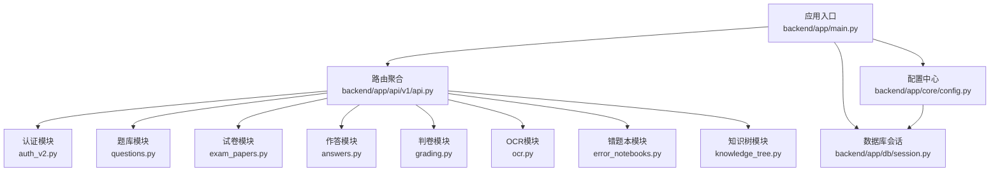

图示来源
- [backend/app/main.py:1-52](file://backend/app/main.py#L1-L52)
- [backend/app/api/v1/api.py:1-26](file://backend/app/api/v1/api.py#L1-L26)

章节来源
- [backend/app/main.py:1-52](file://backend/app/main.py#L1-L52)
- [backend/app/api/v1/api.py:1-26](file://backend/app/api/v1/api.py#L1-L26)
- [backend/app/core/config.py:1-98](file://backend/app/core/config.py#L1-L98)
- [backend/app/db/session.py:1-26](file://backend/app/db/session.py#L1-L26)

## 核心组件
- 用户认证系统：支持管理员（教师/题库管理员/系统管理员）与学生登录注册，图形验证码与短信验证码双因子校验，JWT 签发与刷新，角色与权限控制。
- 试题管理系统：题目的增删改查、批量导入导出、典型题标记、按学科/难度/知识点筛选、去重占位接口。
- 试卷生成系统：试卷创建、关联题目、导出 Word/PDF、按学生作答历史查询、状态变更与统计。
- 在线作答系统：学生提交答案即时判卷、生成错题本、通知推送、作答记录与详情管理。
- 自动判卷系统：规则引擎评分、评分明细审计、判卷历史查询、模型切换占位。
- OCR识别系统：图片上传、Tesseract 文字识别、问题结构化解析、置信度评估、结果存储与状态查询。
- 错题本系统：基于错题自动生成、手动录入、练习题生成（LLM）、导出文本、统计分析。
- 知识树系统：考纲版本化管理、节点增删改、分支激活/失效、版本回滚与版本链查询。

章节来源
- [backend/app/api/v1/endpoints/auth_v2.py:1-476](file://backend/app/api/v1/endpoints/auth_v2.py#L1-L476)
- [backend/app/api/v1/endpoints/questions.py:1-434](file://backend/app/api/v1/endpoints/questions.py#L1-L434)
- [backend/app/api/v1/endpoints/exam_papers.py:1-844](file://backend/app/api/v1/endpoints/exam_papers.py#L1-L844)
- [backend/app/api/v1/endpoints/answers.py:1-421](file://backend/app/api/v1/endpoints/answers.py#L1-L421)
- [backend/app/api/v1/endpoints/grading.py:1-143](file://backend/app/api/v1/endpoints/grading.py#L1-L143)
- [backend/app/api/v1/endpoints/ocr.py:1-291](file://backend/app/api/v1/endpoints/ocr.py#L1-L291)
- [backend/app/api/v1/endpoints/error_notebooks.py:1-437](file://backend/app/api/v1/endpoints/error_notebooks.py#L1-L437)
- [backend/app/api/v1/endpoints/knowledge_tree.py:1-357](file://backend/app/api/v1/endpoints/knowledge_tree.py#L1-L357)

## 架构总览
系统采用分层架构：API 层负责路由与鉴权；服务层封装业务逻辑（判卷、OCR、错题本、LLM）；模型层定义数据结构与约束；数据库层通过异步连接池提供高并发能力。模块间通过统一响应包装与中间件实现一致的返回格式与跨域策略。

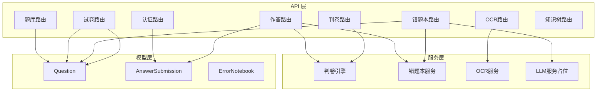

图示来源
- [backend/app/api/v1/endpoints/auth_v2.py:1-476](file://backend/app/api/v1/endpoints/auth_v2.py#L1-L476)
- [backend/app/api/v1/endpoints/answers.py:1-421](file://backend/app/api/v1/endpoints/answers.py#L1-L421)
- [backend/app/api/v1/endpoints/grading.py:1-143](file://backend/app/api/v1/endpoints/grading.py#L1-L143)
- [backend/app/api/v1/endpoints/ocr.py:1-291](file://backend/app/api/v1/endpoints/ocr.py#L1-L291)
- [backend/app/api/v1/endpoints/error_notebooks.py:1-437](file://backend/app/api/v1/endpoints/error_notebooks.py#L1-L437)
- [backend/app/services/judge_engine.py:1-130](file://backend/app/services/judge_engine.py#L1-L130)
- [backend/app/services/mistake_service.py:1-114](file://backend/app/services/mistake_service.py#L1-L114)
- [backend/app/services/ocr_service.py:1-126](file://backend/app/services/ocr_service.py#L1-L126)
- [backend/app/models/question.py:1-46](file://backend/app/models/question.py#L1-L46)
- [backend/app/models/answer_submission.py:1-37](file://backend/app/models/answer_submission.py#L1-L37)
- [backend/app/models/error_notebook.py:1-32](file://backend/app/models/error_notebook.py#L1-L32)

## 详细组件分析

### 用户认证系统
- 登录流程
  - 图形验证码校验与短信验证码校验（演示默认值为固定值，生产需接入真实通道）
  - 管理员登录两阶段：身份验证（角色/密码/图形验证码）与登录（短信验证码+一次性校验令牌）
  - 学生登录/注册：手机号唯一性校验，注册后以短信登录
  - JWT 签发：包含用户类型与过期时间，支持刷新
- 权限控制：基于角色的访问控制，不同端点对用户类型与角色有明确限制
- 安全配置：密钥、算法、过期时间、CORS、Redis/Celery 等

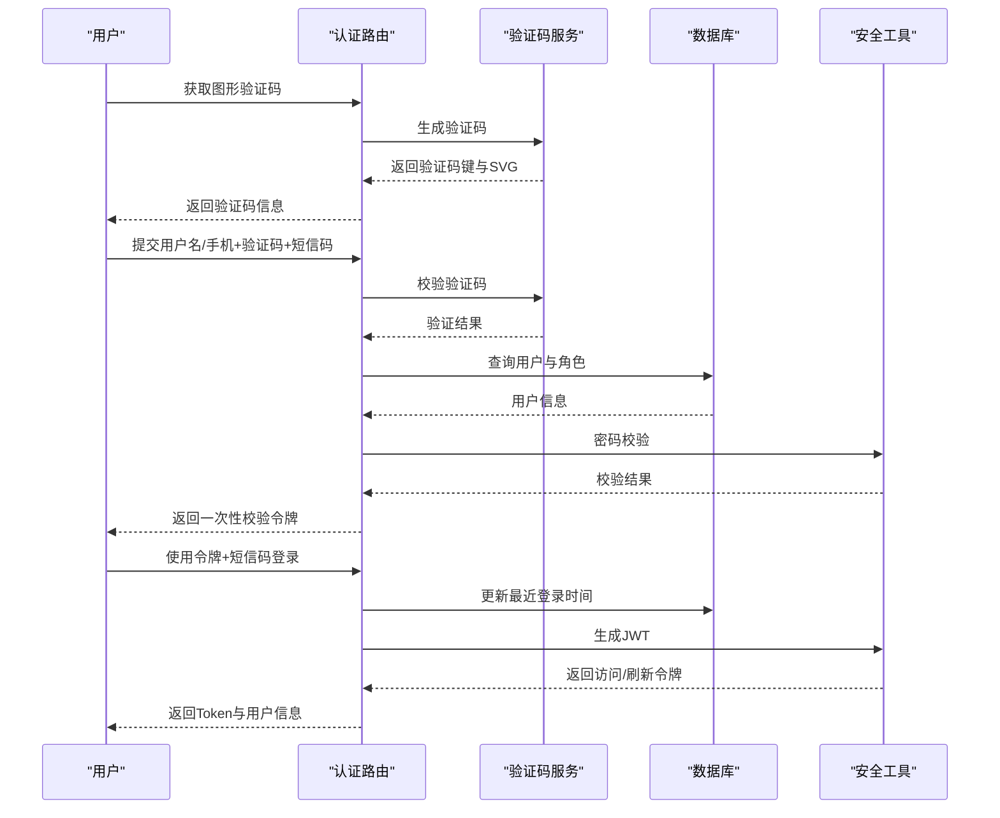

图示来源
- [backend/app/api/v1/endpoints/auth_v2.py:75-183](file://backend/app/api/v1/endpoints/auth_v2.py#L75-L183)
- [backend/app/core/config.py:36-98](file://backend/app/core/config.py#L36-L98)

章节来源
- [backend/app/api/v1/endpoints/auth_v2.py:1-476](file://backend/app/api/v1/endpoints/auth_v2.py#L1-L476)
- [backend/app/core/config.py:1-98](file://backend/app/core/config.py#L1-L98)

### 试题管理系统
- 功能要点
  - 创建/查询/更新/删除/批量删除
  - 搜索过滤：学科、年级、范围、来源、题型、难度、关键字、知识点、典型题标记
  - 批量导入：限制最大条数
  - 典型题标记：仅特定角色可操作
  - 教师可见范围：按教师分配学科过滤
- 数据模型
  - Question 表含题型、难度、科目、分值、标准答案、元数据、来源、审核状态、典型标记等字段

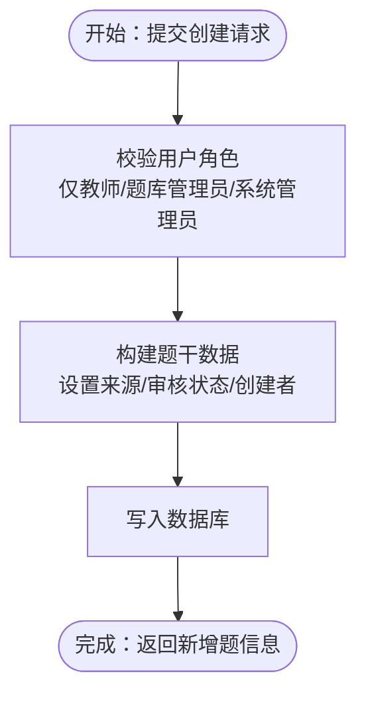

图示来源
- [backend/app/api/v1/endpoints/questions.py:17-36](file://backend/app/api/v1/endpoints/questions.py#L17-L36)
- [backend/app/models/question.py:10-46](file://backend/app/models/question.py#L10-L46)

章节来源
- [backend/app/api/v1/endpoints/questions.py:1-434](file://backend/app/api/v1/endpoints/questions.py#L1-L434)
- [backend/app/models/question.py:1-46](file://backend/app/models/question.py#L1-L46)

### 试卷生成系统
- 功能要点
  - 创建试卷并可同时导入题目
  - 关联题目、排序、移除、查询
  - 导出 Word/PDF：按题型分组、填空/主观留白
  - 学生视角：查看我的试卷、最新作答状态与分数
  - 教师/管理员：按条件检索、统计题目数量
- 数据模型
  - ExamPaper 与 Question 通过中间表关联，支持每题独立分值

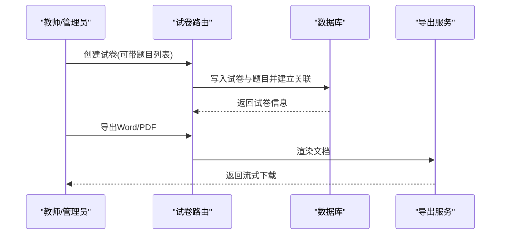

图示来源
- [backend/app/api/v1/endpoints/exam_papers.py:20-64](file://backend/app/api/v1/endpoints/exam_papers.py#L20-L64)
- [backend/app/api/v1/endpoints/exam_papers.py:632-735](file://backend/app/api/v1/endpoints/exam_papers.py#L632-L735)

章节来源
- [backend/app/api/v1/endpoints/exam_papers.py:1-844](file://backend/app/api/v1/endpoints/exam_papers.py#L1-L844)

### 在线作答系统
- 流程
  - 学生提交答案：创建提交记录与答案详情
  - 即时判卷：调用判卷引擎计算得分、反馈与百分比
  - 错题本生成：当得分小于满分时触发
  - 通知推送：判卷完成与错题本就绪通知
- 权限与状态
  - 仅学生可提交；错题本生成后禁止修改/删除
  - 状态机：提交后立即进入已判卷，支持“重新判”状态变更

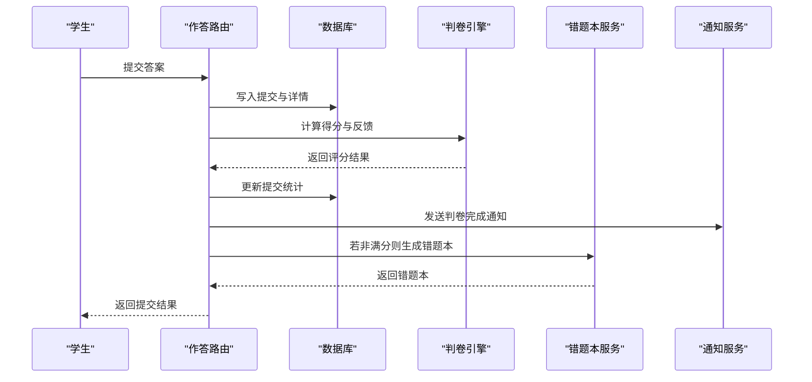

图示来源
- [backend/app/api/v1/endpoints/answers.py:115-191](file://backend/app/api/v1/endpoints/answers.py#L115-L191)
- [backend/app/services/judge_engine.py:126-130](file://backend/app/services/judge_engine.py#L126-L130)
- [backend/app/services/mistake_service.py:13-75](file://backend/app/services/mistake_service.py#L13-L75)

章节来源
- [backend/app/api/v1/endpoints/answers.py:1-421](file://backend/app/api/v1/endpoints/answers.py#L1-L421)

### 自动判卷系统
- 规则引擎评分
  - 支持单选、多选、填空、主观题评分
  - 多选题按正确集合与作答集合的交并比计算部分分
  - 主观题按关键词匹配比例给分并提示人工复核
- 判卷记录
  - 记录模型、版本、状态、耗时、明细（每题正确与否、得分、满分）
  - 支持历史查询与当前模型查看

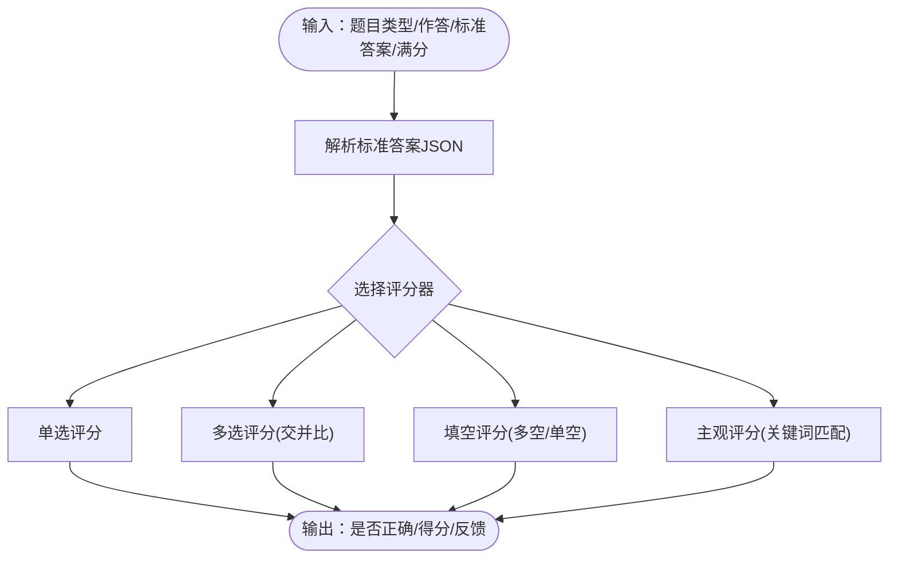

图示来源
- [backend/app/services/judge_engine.py:126-130](file://backend/app/services/judge_engine.py#L126-L130)
- [backend/app/api/v1/endpoints/grading.py:19-55](file://backend/app/api/v1/endpoints/grading.py#L19-L55)

章节来源
- [backend/app/services/judge_engine.py:1-130](file://backend/app/services/judge_engine.py#L1-130)
- [backend/app/api/v1/endpoints/grading.py:1-143](file://backend/app/api/v1/endpoints/grading.py#L1-L143)

### OCR识别系统
- 流程
  - 图片上传（文件/表单），保存至临时目录
  - 调用 Tesseract 进行 OCR，提取问题、选项、答案行
  - 置信度评估（中文字符占比、行数等启发式指标）
  - 结构化结果写入数据库，状态为“需要复核/完成”
- 配置
  - OCR 引擎与语言、阈值等可通过配置中心读取

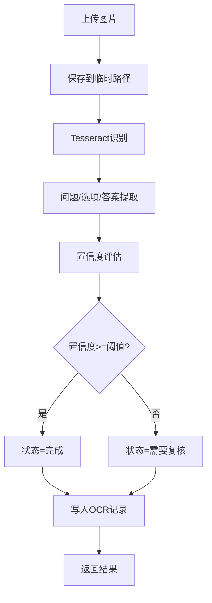

图示来源
- [backend/app/api/v1/endpoints/ocr.py:18-64](file://backend/app/api/v1/endpoints/ocr.py#L18-L64)
- [backend/app/services/ocr_service.py:61-125](file://backend/app/services/ocr_service.py#L61-L125)

章节来源
- [backend/app/api/v1/endpoints/ocr.py:1-291](file://backend/app/api/v1/endpoints/ocr.py#L1-L291)
- [backend/app/services/ocr_service.py:1-126](file://backend/app/services/ocr_service.py#L1-L126)

### 错题本系统
- 自动生成
  - 基于学生错题详情去重，构建错题本与条目
  - 错误类型分类：未作答、概念错误、记忆错误、理解偏差
  - 可选生成强化练习题（LLM）
- 手动录入
  - 快速创建错题本与单条错题，便于扫描/手写录入
- 导出与统计
  - 文本导出（后续可扩展 Word/PDF）
  - 学生/班级统计

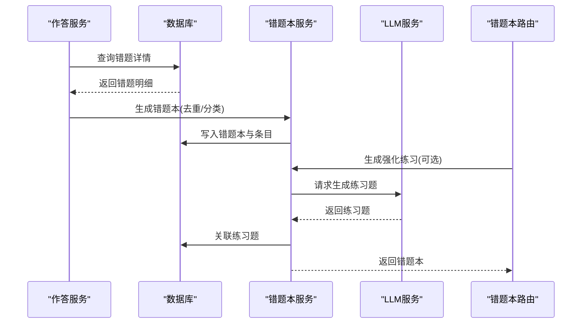

图示来源
- [backend/app/services/mistake_service.py:13-75](file://backend/app/services/mistake_service.py#L13-L75)
- [backend/app/api/v1/endpoints/error_notebooks.py:22-59](file://backend/app/api/v1/endpoints/error_notebooks.py#L22-L59)
- [backend/app/api/v1/endpoints/error_notebooks.py:199-313](file://backend/app/api/v1/endpoints/error_notebooks.py#L199-L313)

章节来源
- [backend/app/services/mistake_service.py:1-114](file://backend/app/services/mistake_service.py#L1-L114)
- [backend/app/api/v1/endpoints/error_notebooks.py:1-437](file://backend/app/api/v1/endpoints/error_notebooks.py#L1-L437)

### 知识树系统
- 能力
  - 考纲版本化：复制当前版本为新版本，保留有效节点
  - 节点管理：增删改、排序、分支激活/失效、批量设置
  - 版本回滚：沿版本链回退到指定历史版本
- 数据结构
  - 节点树形结构，支持父-子关系与排序序号

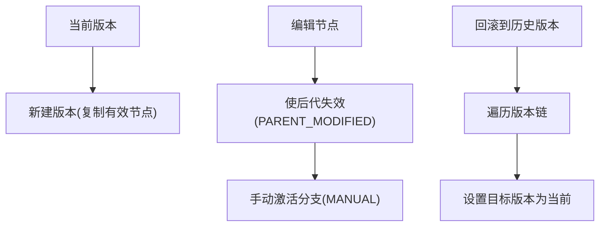

图示来源
- [backend/app/api/v1/endpoints/knowledge_tree.py:199-250](file://backend/app/api/v1/endpoints/knowledge_tree.py#L199-L250)
- [backend/app/api/v1/endpoints/knowledge_tree.py:253-319](file://backend/app/api/v1/endpoints/knowledge_tree.py#L253-L319)

章节来源
- [backend/app/api/v1/endpoints/knowledge_tree.py:1-357](file://backend/app/api/v1/endpoints/knowledge_tree.py#L1-L357)

## 依赖分析
- 组件耦合
  - 作答模块强依赖判卷引擎与错题本服务
  - 错题本模块依赖题库与作答详情
  - 试卷模块依赖题库与作答提交
  - OCR 模块依赖 OCR 服务与数据库
- 外部依赖
  - 数据库：PostgreSQL（异步驱动）
  - 缓存/消息：Redis（Celery Broker/Backend）
  - OCR：Tesseract（可选安装）
  - 文件上传：本地目录（可配置）

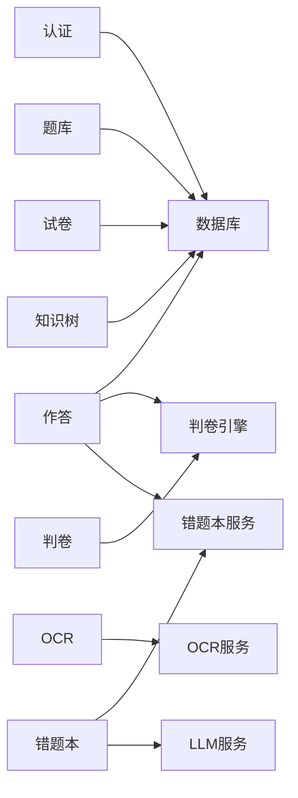

图示来源
- [backend/app/db/session.py:1-26](file://backend/app/db/session.py#L1-L26)
- [backend/app/core/config.py:73-98](file://backend/app/core/config.py#L73-L98)

章节来源
- [backend/app/db/session.py:1-26](file://backend/app/db/session.py#L1-L26)
- [backend/app/core/config.py:1-98](file://backend/app/core/config.py#L1-L98)

## 性能考虑
- 数据库
  - 异步连接池与事务边界控制，避免长事务阻塞
  - 合理索引：subject、is_active、created_by、is_typical 等
  - 分页与总数查询分离，限制最大分页条数
- 服务
  - 判卷批量化执行，减少多次往返
  - OCR 大文件写盘与清理策略，避免磁盘膨胀
  - 错题本生成去重与批量写入，降低锁竞争
- API
  - 统一响应包装与中间件，减少重复逻辑
  - CORS 与安全头配置，避免跨域与安全问题

## 故障排查指南
- 认证失败
  - 检查验证码是否过期、短信验证码是否正确
  - 核对用户是否存在、是否启用、角色是否匹配
- 作答异常
  - 查看判卷记录状态与明细，确认标准答案格式
  - 检查错题本生成是否被跳过（满分情况）
- OCR 失败
  - 确认 Tesseract 是否安装、语言包是否齐全
  - 检查上传文件格式与清晰度
- 错题本为空
  - 确认是否有错题详情、是否已生成
  - 检查筛选条件（试卷/日期范围）

章节来源
- [backend/app/api/v1/endpoints/auth_v2.py:90-146](file://backend/app/api/v1/endpoints/auth_v2.py#L90-L146)
- [backend/app/api/v1/endpoints/answers.py:24-113](file://backend/app/api/v1/endpoints/answers.py#L24-L113)
- [backend/app/services/ocr_service.py:61-96](file://backend/app/services/ocr_service.py#L61-L96)
- [backend/app/api/v1/endpoints/error_notebooks.py:22-59](file://backend/app/api/v1/endpoints/error_notebooks.py#L22-L59)

## 结论
本系统通过清晰的模块划分与统一的鉴权与配置体系，实现了从题库、试卷、作答到判卷、OCR、错题本与知识树的完整闭环。判卷引擎与 OCR 流程具备良好的扩展性，错题本与知识树为个性化学习提供了基础支撑。建议在生产环境中完善短信通道、OCR 语言包与缓存策略，并持续优化查询与批处理性能。

## 附录
- 配置项概览（来自配置中心）
  - 数据库：主机、端口、库名、用户、密码
  - 安全：密钥、算法、访问/刷新令牌过期时间
  - 缓存/消息：Redis 主机、端口、DB、密码、Broker/Backend
  - 文件上传：上传目录、最大大小
  - OCR：引擎、语言
  - 模型缓存：模型缓存目录
- 常用端点定位
  - 认证：/api/v1/auth/admin/verify、/api/v1/auth/admin/login、/api/v1/auth/student/login、/api/v1/auth/student/register
  - 题库：/api/v1/questions、/api/v1/question-admin
  - 试卷：/api/v1/exam-papers
  - 作答：/api/v1/answers
  - 判卷：/api/v1/grading
  - OCR：/api/v1/ocr
  - 错题本：/api/v1/error-notebooks
  - 知识树：/api/v1/knowledge-tree

章节来源
- [backend/app/core/config.py:36-98](file://backend/app/core/config.py#L36-L98)
- [backend/app/api/v1/api.py:6-26](file://backend/app/api/v1/api.py#L6-L26)