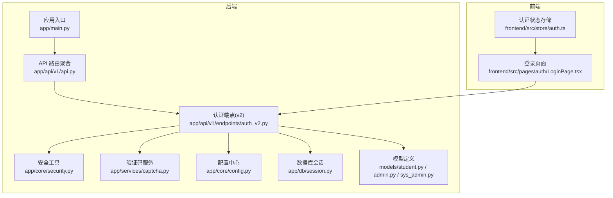
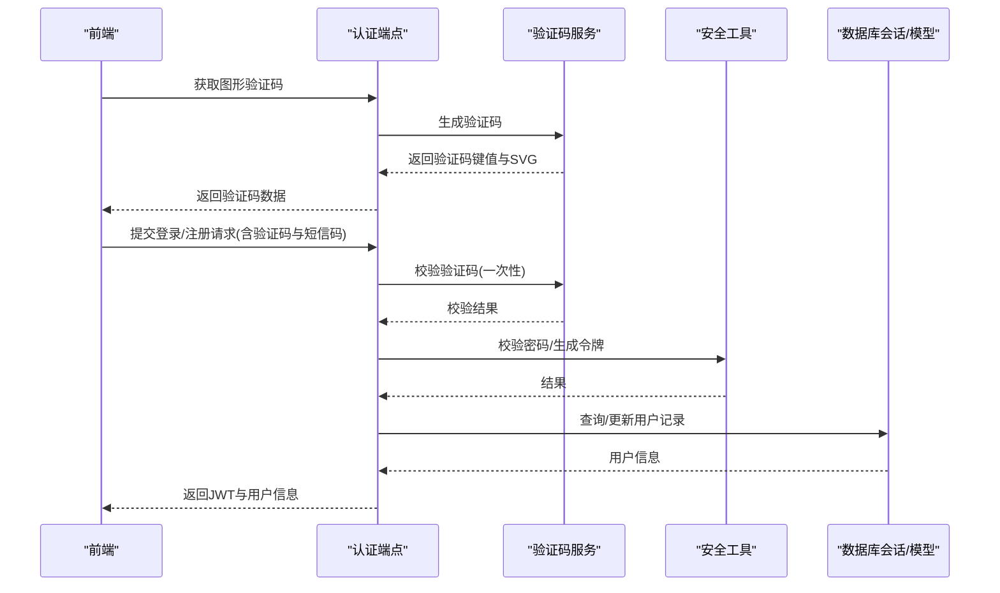
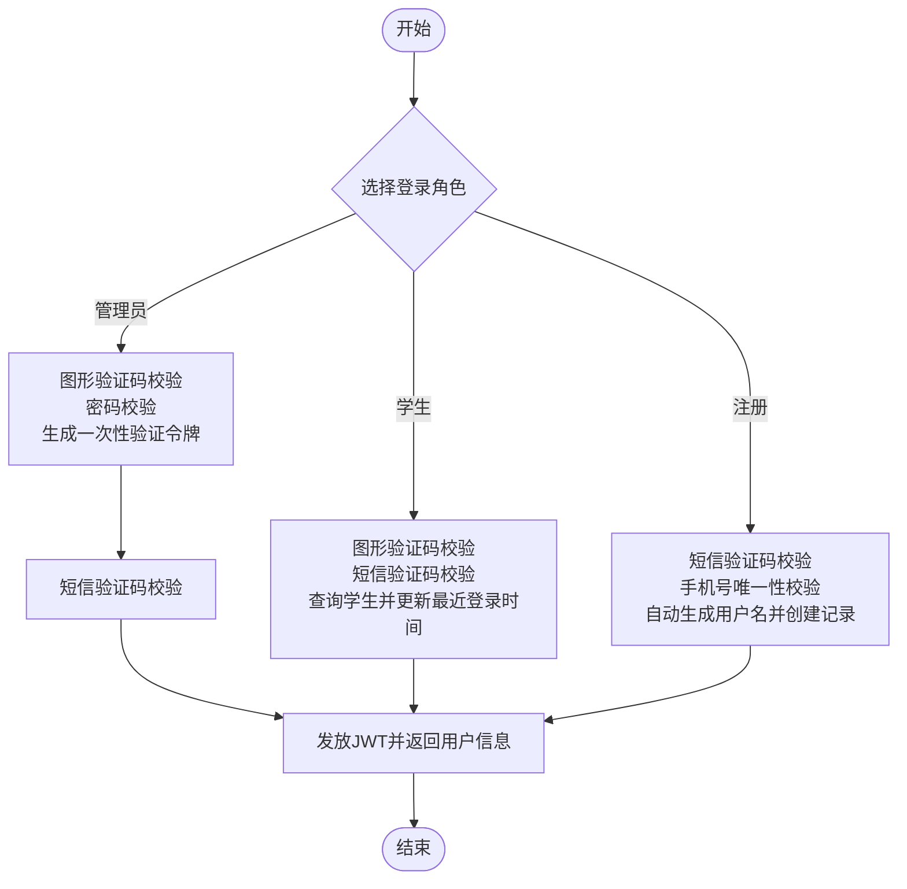
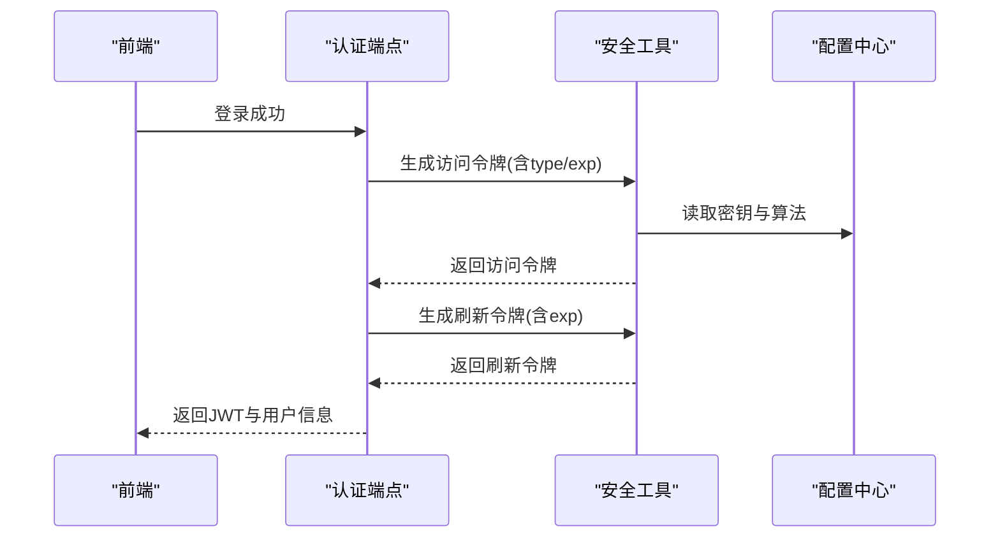
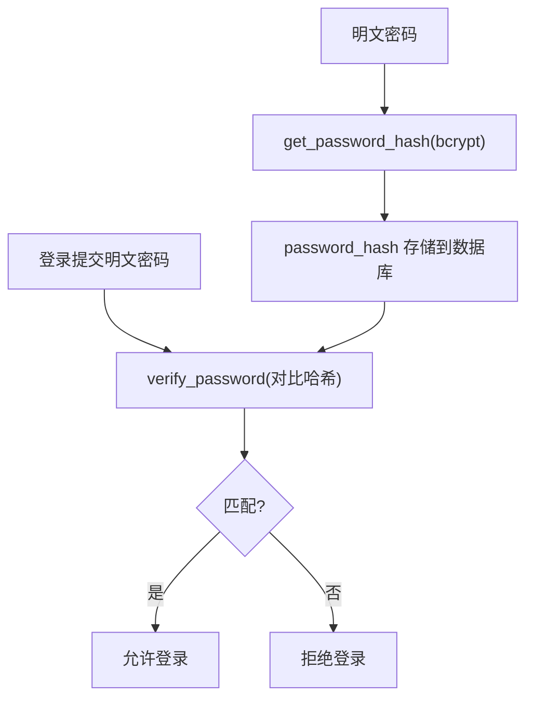
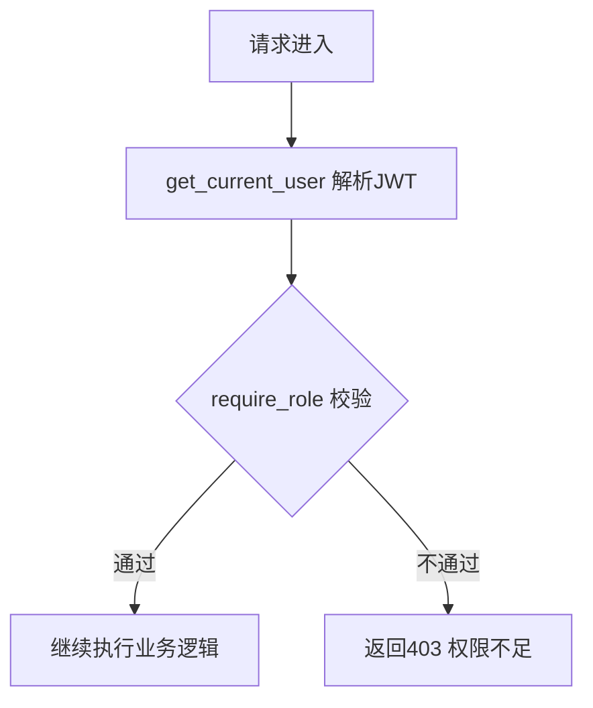
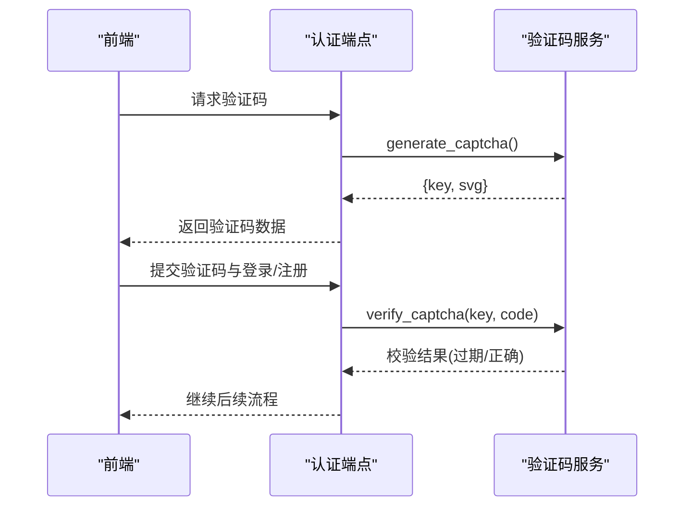
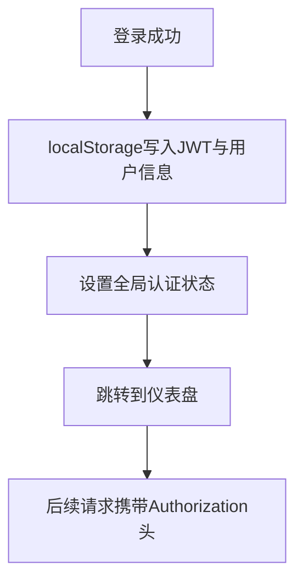
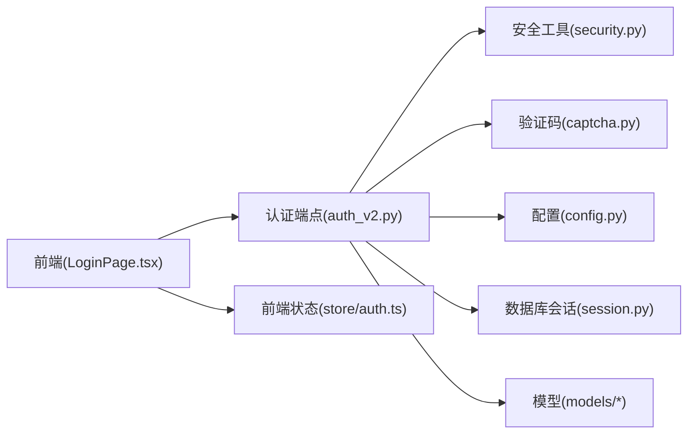

# 用户认证系统

<cite>
**本文档引用的文件**
- [backend/app/api/v1/endpoints/auth_v2.py](file://backend/app/api/v1/endpoints/auth_v2.py)
- [backend/app/core/security.py](file://backend/app/core/security.py)
- [backend/app/services/captcha.py](file://backend/app/services/captcha.py)
- [backend/app/core/config.py](file://backend/app/core/config.py)
- [backend/app/models/student.py](file://backend/app/models/student.py)
- [backend/app/models/admin.py](file://backend/app/models/admin.py)
- [backend/app/models/sys_admin.py](file://backend/app/models/sys_admin.py)
- [backend/app/api/v1/api.py](file://backend/app/api/v1/api.py)
- [backend/app/main.py](file://backend/app/main.py)
- [frontend/src/pages/auth/LoginPage.tsx](file://frontend/src/pages/auth/LoginPage.tsx)
- [frontend/src/store/auth.ts](file://frontend/src/store/auth.ts)
</cite>

## 目录
1. [简介](#简介)
2. [项目结构](#项目结构)
3. [核心组件](#核心组件)
4. [架构总览](#架构总览)
5. [详细组件分析](#详细组件分析)
6. [依赖分析](#依赖分析)
7. [性能考虑](#性能考虑)
8. [故障排除指南](#故障排除指南)
9. [结论](#结论)
10. [附录](#附录)

## 简介
本文件面向瑞珹教育管理系统中的用户认证子系统，聚焦于多角色认证机制（学生、教师、题库管理员、系统管理员）的设计与实现，涵盖以下关键主题：
- 多角色认证流程：管理员分角色登录（教师、题库管理员、系统管理员），学生登录与注册
- JWT 令牌生成、验证与刷新策略
- 密码加密与哈希算法
- 角色权限控制与中间件
- 验证码生成与校验机制
- 会话管理与本地存储策略
- 安全防护与扩展性设计

## 项目结构
后端采用 FastAPI + SQLAlchemy Async 架构，认证相关代码集中在 v1 API 的认证模块中，并通过统一配置中心集中管理密钥与算法参数。前端使用 React + Zustand 管理认证状态与本地存储。

图表来源
- [backend/app/main.py:11-31](file://backend/app/main.py#L11-L31)
- [backend/app/api/v1/api.py:6-8](file://backend/app/api/v1/api.py#L6-L8)
- [backend/app/api/v1/endpoints/auth_v2.py:13-19](file://backend/app/api/v1/endpoints/auth_v2.py#L13-L19)
- [backend/app/core/security.py:13-13](file://backend/app/core/security.py#L13-L13)
- [backend/app/services/captcha.py:8-9](file://backend/app/services/captcha.py#L8-L9)
- [backend/app/core/config.py:43-46](file://backend/app/core/config.py#L43-L46)
- [backend/app/db/session.py:6-15](file://backend/app/db/session.py#L6-L15)
- [backend/app/models/student.py:8-23](file://backend/app/models/student.py#L8-L23)
- [backend/app/models/admin.py:9-27](file://backend/app/models/admin.py#L9-L27)
- [backend/app/models/sys_admin.py:8-22](file://backend/app/models/sys_admin.py#L8-L22)
- [frontend/src/pages/auth/LoginPage.tsx:33-71](file://frontend/src/pages/auth/LoginPage.tsx#L33-L71)
- [frontend/src/store/auth.ts:47-95](file://frontend/src/store/auth.ts#L47-L95)

章节来源
- [backend/app/main.py:11-31](file://backend/app/main.py#L11-L31)
- [backend/app/api/v1/api.py:6-8](file://backend/app/api/v1/api.py#L6-L8)

## 核心组件
- 认证端点（FastAPI 路由）
  - 管理员分角色登录：图形验证码校验 → 密码校验 → 一次性验证令牌生成 → 短信验证码校验 → 登录发放 JWT
  - 学生登录：图形验证码校验 → 短信验证码校验 → 查询学生账户 → 更新最近登录时间 → 发放 JWT
  - 学生注册：短信验证码校验 → 唯一性校验 → 自动生成用户名 → 创建学生记录 → 发放 JWT
  - 管理员管理（系统管理员专用）：创建/查询/更新/删除管理员账户
  - 个人资料：按用户类型从对应表读取/更新资料
- 安全工具
  - 密码哈希与校验（bcrypt）
  - JWT 令牌生成与解码（HS256）
  - 当前用户解析与角色权限中间件
- 验证码服务
  - 图形验证码生成与一次性校验（内存存储，带过期时间）
- 配置中心
  - 密钥、算法、令牌有效期、数据库与缓存连接等
- 数据模型
  - 学生、管理员（含角色）、系统管理员三类用户表
- 前端认证
  - 登录/注册流程与验证码轮询
  - 本地存储访问令牌、刷新令牌与用户信息

章节来源
- [backend/app/api/v1/endpoints/auth_v2.py:25-53](file://backend/app/api/v1/endpoints/auth_v2.py#L25-L53)
- [backend/app/core/security.py:16-47](file://backend/app/core/security.py#L16-L47)
- [backend/app/services/captcha.py:12-39](file://backend/app/services/captcha.py#L12-L39)
- [backend/app/core/config.py:43-46](file://backend/app/core/config.py#L43-L46)
- [backend/app/models/student.py:8-23](file://backend/app/models/student.py#L8-L23)
- [backend/app/models/admin.py:9-27](file://backend/app/models/admin.py#L9-L27)
- [backend/app/models/sys_admin.py:8-22](file://backend/app/models/sys_admin.py#L8-L22)
- [frontend/src/pages/auth/LoginPage.tsx:33-113](file://frontend/src/pages/auth/LoginPage.tsx#L33-L113)
- [frontend/src/store/auth.ts:47-95](file://frontend/src/store/auth.ts#L47-L95)

## 架构总览
认证系统采用“前端表单 + 后端路由 + 安全工具 + 模型持久化”的分层设计。管理员与学生分别走不同的认证路径，但最终均通过 JWT 进行状态维持；系统管理员具备对管理员账户的增删改查能力。

图表来源
- [backend/app/api/v1/endpoints/auth_v2.py:75-237](file://backend/app/api/v1/endpoints/auth_v2.py#L75-L237)
- [backend/app/services/captcha.py:12-39](file://backend/app/services/captcha.py#L12-L39)
- [backend/app/core/security.py:16-47](file://backend/app/core/security.py#L16-L47)
- [backend/app/db/session.py:18-26](file://backend/app/db/session.py#L18-L26)

## 详细组件分析

### 多角色认证机制（管理员/教师/题库管理员/系统管理员）
- 角色定义
  - 教师：admin_type=0
  - 题库管理员：admin_type=1
  - 系统管理员：SysAdmin 表
- 登录流程
  - 管理员登录：图形验证码 → 密码校验 → 生成一次性验证令牌 → 短信验证码校验 → 登录发放 JWT
  - 学生登录：图形验证码 → 短信验证码 → 查询学生 → 更新最近登录时间 → 发放 JWT
  - 学生注册：短信验证码 → 手机唯一性校验 → 自动生成用户名 → 创建学生记录 → 发放 JWT
- 权限控制
  - 通过 require_role 中间件限制仅系统管理员可进行管理员账户管理操作

图表来源
- [backend/app/api/v1/endpoints/auth_v2.py:91-237](file://backend/app/api/v1/endpoints/auth_v2.py#L91-L237)
- [backend/app/models/student.py:8-23](file://backend/app/models/student.py#L8-L23)
- [backend/app/models/admin.py:9-27](file://backend/app/models/admin.py#L9-L27)
- [backend/app/models/sys_admin.py:8-22](file://backend/app/models/sys_admin.py#L8-L22)

章节来源
- [backend/app/api/v1/endpoints/auth_v2.py:83-183](file://backend/app/api/v1/endpoints/auth_v2.py#L83-L183)
- [backend/app/api/v1/endpoints/auth_v2.py:188-237](file://backend/app/api/v1/endpoints/auth_v2.py#L188-L237)
- [backend/app/api/v1/endpoints/auth_v2.py:242-361](file://backend/app/api/v1/endpoints/auth_v2.py#L242-L361)

### JWT 令牌生成、验证与刷新
- 令牌生成
  - 访问令牌：包含 sub（用户ID）、type（用户类型）、exp（过期时间），默认有效期约 8 天
  - 刷新令牌：包含 sub、exp，默认有效期 30 天
- 令牌验证
  - 使用当前用户解析器从 Authorization 头中提取并解码 JWT，校验用户在对应表中存在
- 刷新策略
  - 当前实现未提供专门的刷新接口，建议在生产环境增加刷新端点并结合黑名单/白名单策略

图表来源
- [backend/app/api/v1/endpoints/auth_v2.py:55-71](file://backend/app/api/v1/endpoints/auth_v2.py#L55-L71)
- [backend/app/core/security.py:24-40](file://backend/app/core/security.py#L24-L40)
- [backend/app/core/config.py:43-46](file://backend/app/core/config.py#L43-L46)

章节来源
- [backend/app/core/security.py:24-47](file://backend/app/core/security.py#L24-L47)
- [backend/app/core/config.py:43-46](file://backend/app/core/config.py#L43-L46)

### 密码加密与哈希算法
- 使用 bcrypt 对明文密码进行哈希处理，确保存储安全
- 登录时通过 verify_password 对比哈希值

图表来源
- [backend/app/core/security.py:16-21](file://backend/app/core/security.py#L16-L21)

章节来源
- [backend/app/core/security.py:16-21](file://backend/app/core/security.py#L16-L21)

### 角色权限控制系统
- require_role 中间件根据当前用户类型判断是否具备所需角色
- 系统管理员可对管理员账户进行创建、查询、更新、删除操作

图表来源
- [backend/app/core/security.py:98-103](file://backend/app/core/security.py#L98-L103)
- [backend/app/api/v1/endpoints/auth_v2.py:249](file://backend/app/api/v1/endpoints/auth_v2.py#L249)

章节来源
- [backend/app/core/security.py:98-103](file://backend/app/core/security.py#L98-L103)
- [backend/app/api/v1/endpoints/auth_v2.py:242-361](file://backend/app/api/v1/endpoints/auth_v2.py#L242-L361)

### 验证码生成与验证机制
- 图形验证码
  - 生成 4 位字符（字母+数字），返回 key 与 SVG（data URI）
  - 内存存储，5 分钟过期，一次性使用
- 短信验证码
  - 当前版本使用占位码（111111）便于演示，实际部署应接入真实短信通道

图表来源
- [backend/app/api/v1/endpoints/auth_v2.py:75-78](file://backend/app/api/v1/endpoints/auth_v2.py#L75-L78)
- [backend/app/services/captcha.py:12-39](file://backend/app/services/captcha.py#L12-L39)

章节来源
- [backend/app/services/captcha.py:12-39](file://backend/app/services/captcha.py#L12-L39)
- [backend/app/api/v1/endpoints/auth_v2.py:75-78](file://backend/app/api/v1/endpoints/auth_v2.py#L75-L78)

### 会话管理策略与前端集成
- 后端无服务器端会话存储，完全基于 JWT
- 前端使用 localStorage 存储 access_token、refresh_token、用户类型、姓名与 ID
- 登录成功后自动跳转至仪表盘，并在全局状态中保存认证信息

图表来源
- [frontend/src/pages/auth/LoginPage.tsx:55-71](file://frontend/src/pages/auth/LoginPage.tsx#L55-L71)
- [frontend/src/store/auth.ts:47-95](file://frontend/src/store/auth.ts#L47-L95)

章节来源
- [frontend/src/pages/auth/LoginPage.tsx:55-71](file://frontend/src/pages/auth/LoginPage.tsx#L55-L71)
- [frontend/src/store/auth.ts:47-95](file://frontend/src/store/auth.ts#L47-L95)

### 安全防护措施
- 密钥与算法
  - 通过配置中心集中管理 SECRET_KEY 与 ALGORITHM（HS256）
- 令牌有效期
  - 访问令牌约 8 天，刷新令牌 30 天，降低长期暴露风险
- 验证码机制
  - 图形验证码一次性使用且带过期时间，防止暴力破解
- 密码安全
  - 使用 bcrypt 哈希，避免明文存储
- 角色隔离
  - require_role 限制敏感操作仅系统管理员可执行

章节来源
- [backend/app/core/config.py:43-46](file://backend/app/core/config.py#L43-L46)
- [backend/app/core/security.py:16-21](file://backend/app/core/security.py#L16-L21)
- [backend/app/api/v1/endpoints/auth_v2.py:91-183](file://backend/app/api/v1/endpoints/auth_v2.py#L91-L183)

### 扩展性设计与最佳实践
- 可扩展的角色与权限
  - 在 Admin 模型中通过 admin_type 字段扩展更多角色
  - require_role 支持多角色组合校验
- 刷新令牌与黑名单
  - 建议新增刷新端点与令牌黑名单/白名单机制，提升安全性
- 短信验证码
  - 替换占位码为真实短信通道，支持频率限制与重复使用检测
- 会话与并发
  - 前端可引入刷新令牌轮询与自动续期策略，减少用户体验中断
- 日志与监控
  - 建议在认证关键节点增加审计日志与异常告警

章节来源
- [backend/app/models/admin.py:19-20](file://backend/app/models/admin.py#L19-L20)
- [backend/app/core/security.py:98-103](file://backend/app/core/security.py#L98-L103)
- [backend/app/api/v1/endpoints/auth_v2.py:153](file://backend/app/api/v1/endpoints/auth_v2.py#L153)

## 依赖分析
认证系统主要依赖关系如下：
- 认证端点依赖安全工具（密码哈希、JWT）、验证码服务、配置中心与数据库会话
- 前端依赖认证端点与本地存储

图表来源
- [backend/app/api/v1/endpoints/auth_v2.py:13-19](file://backend/app/api/v1/endpoints/auth_v2.py#L13-L19)
- [backend/app/core/security.py:13-13](file://backend/app/core/security.py#L13-L13)
- [backend/app/services/captcha.py:8-9](file://backend/app/services/captcha.py#L8-L9)
- [backend/app/core/config.py:43-46](file://backend/app/core/config.py#L43-L46)
- [backend/app/db/session.py:6-15](file://backend/app/db/session.py#L6-L15)
- [frontend/src/pages/auth/LoginPage.tsx:33-71](file://frontend/src/pages/auth/LoginPage.tsx#L33-L71)
- [frontend/src/store/auth.ts:47-95](file://frontend/src/store/auth.ts#L47-L95)

章节来源
- [backend/app/api/v1/endpoints/auth_v2.py:13-19](file://backend/app/api/v1/endpoints/auth_v2.py#L13-L19)
- [backend/app/core/security.py:13-13](file://backend/app/core/security.py#L13-L13)
- [backend/app/services/captcha.py:8-9](file://backend/app/services/captcha.py#L8-L9)
- [backend/app/core/config.py:43-46](file://backend/app/core/config.py#L43-L46)
- [backend/app/db/session.py:6-15](file://backend/app/db/session.py#L6-L15)
- [frontend/src/pages/auth/LoginPage.tsx:33-71](file://frontend/src/pages/auth/LoginPage.tsx#L33-L71)
- [frontend/src/store/auth.ts:47-95](file://frontend/src/store/auth.ts#L47-L95)

## 性能考虑
- 异步数据库访问：使用 SQLAlchemy Async 减少阻塞
- JWT 解析轻量：仅需解码与少量数据库存在性校验
- 验证码内存存储：开发环境适用，生产建议迁移到 Redis 以支持多实例共享
- 前端本地存储：避免频繁网络往返，注意令牌大小与浏览器限制

## 故障排除指南
- 图形验证码错误或过期
  - 检查验证码是否在 5 分钟内使用且一次性有效
  - 参考路径：[验证码校验:32-39](file://backend/app/services/captcha.py#L32-L39)
- 密码错误
  - 确认 bcrypt 哈希一致；检查用户是否存在且未被停用
  - 参考路径：[密码校验:16-17](file://backend/app/core/security.py#L16-L17)
- 权限不足
  - 确认当前用户类型是否满足 require_role 要求
  - 参考路径：[角色中间件:98-103](file://backend/app/core/security.py#L98-L103)
- 用户不存在或被停用
  - 检查用户在对应表中是否存在且 is_active 为真
  - 参考路径：[管理员/学生查询与状态检查:104-128](file://backend/app/api/v1/endpoints/auth_v2.py#L104-L128)
- 令牌过期或无效
  - 检查 ACCESS_TOKEN_EXPIRE_MINUTES 设置与客户端是否及时刷新
  - 参考路径：[令牌生成与配置:24-40](file://backend/app/core/security.py#L24-L40)，[配置中心:43-46](file://backend/app/core/config.py#L43-L46)

章节来源
- [backend/app/services/captcha.py:32-39](file://backend/app/services/captcha.py#L32-L39)
- [backend/app/core/security.py:16-17](file://backend/app/core/security.py#L16-L17)
- [backend/app/core/security.py:98-103](file://backend/app/core/security.py#L98-L103)
- [backend/app/api/v1/endpoints/auth_v2.py:104-128](file://backend/app/api/v1/endpoints/auth_v2.py#L104-L128)
- [backend/app/core/security.py:24-40](file://backend/app/core/security.py#L24-L40)
- [backend/app/core/config.py:43-46](file://backend/app/core/config.py#L43-L46)

## 结论
本认证系统围绕多角色用户与 JWT 实现了清晰的登录/注册流程，配合 bcrypt 哈希与一次性图形验证码提供了基础的安全保障。建议在生产环境中补充短信通道对接、刷新令牌机制、Redis 验证码存储与更严格的权限控制，以进一步提升安全性与可维护性。

## 附录
- 关键实现路径参考
  - 管理员登录与验证：[管理员登录端点:91-183](file://backend/app/api/v1/endpoints/auth_v2.py#L91-L183)
  - 学生登录与注册：[学生登录/注册端点:188-237](file://backend/app/api/v1/endpoints/auth_v2.py#L188-L237)
  - JWT 生成与解析：[安全工具:24-95](file://backend/app/core/security.py#L24-L95)
  - 验证码服务：[验证码服务:12-39](file://backend/app/services/captcha.py#L12-L39)
  - 配置中心：[配置中心:43-46](file://backend/app/core/config.py#L43-L46)
  - 前端登录与状态管理：[登录页:55-71](file://frontend/src/pages/auth/LoginPage.tsx#L55-L71)，[认证状态存储:47-95](file://frontend/src/store/auth.ts#L47-L95)