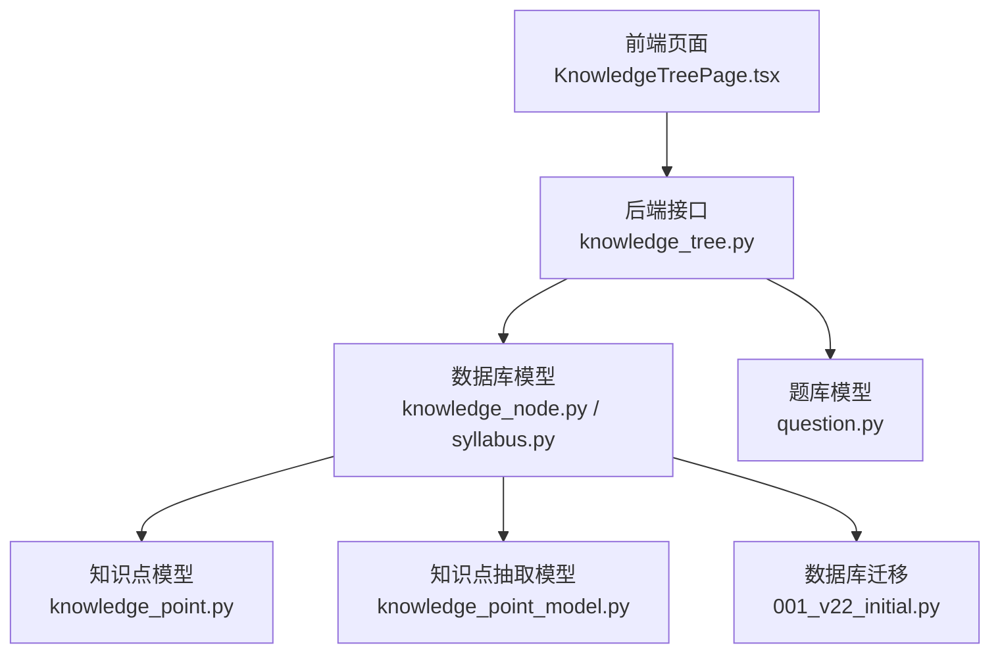
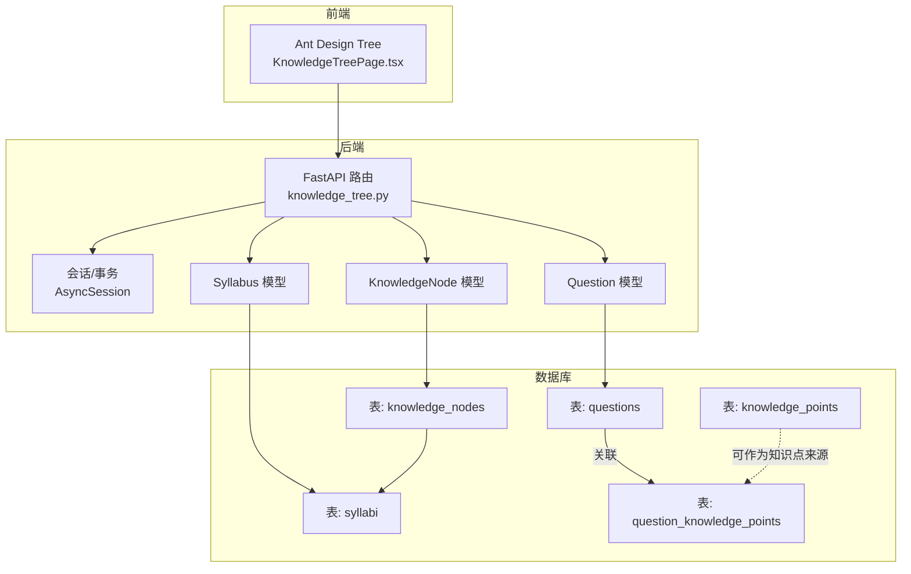
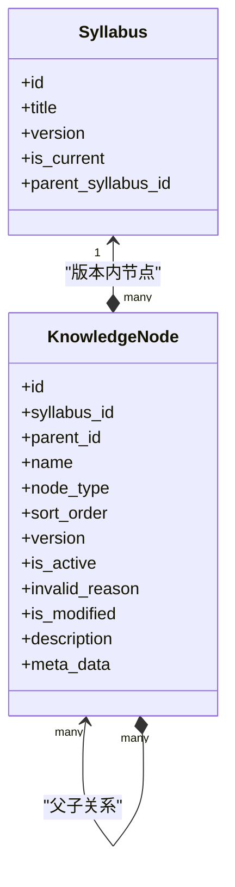
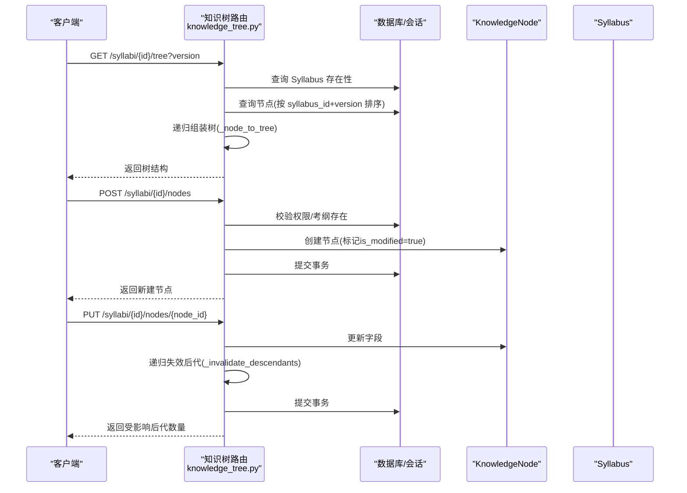
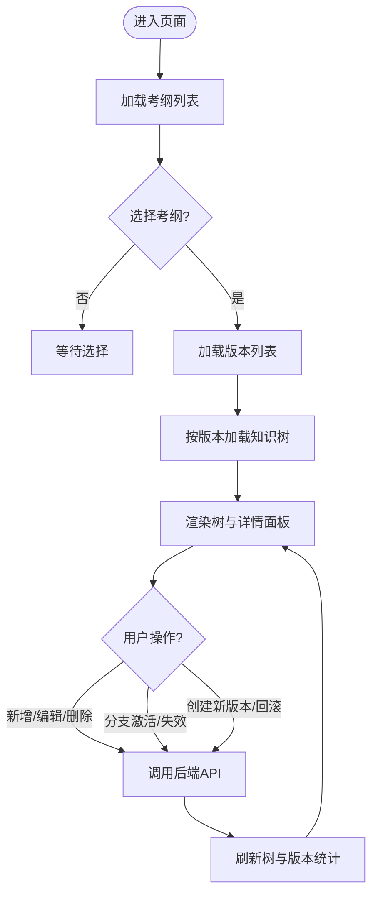
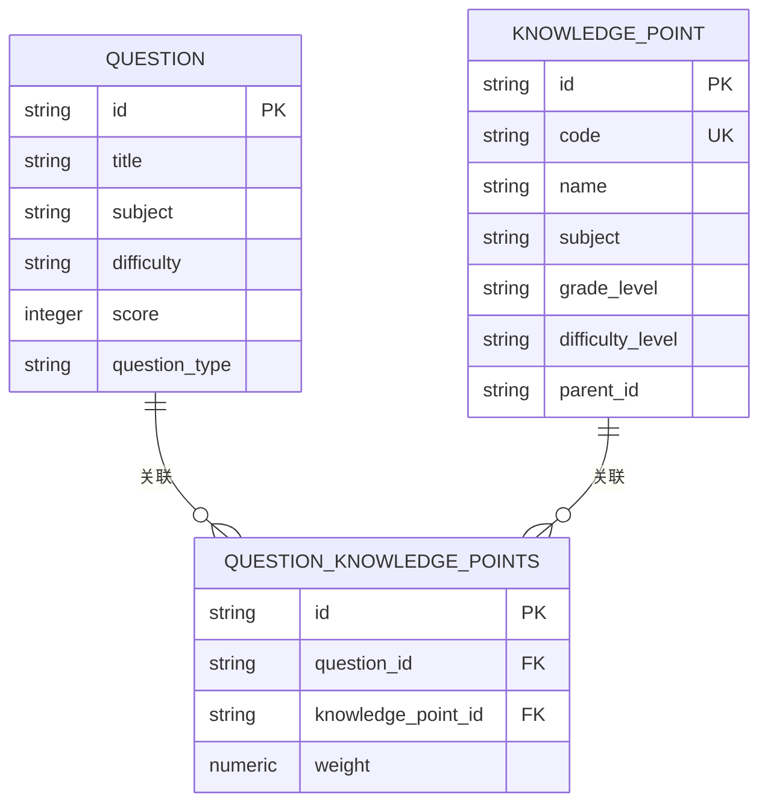
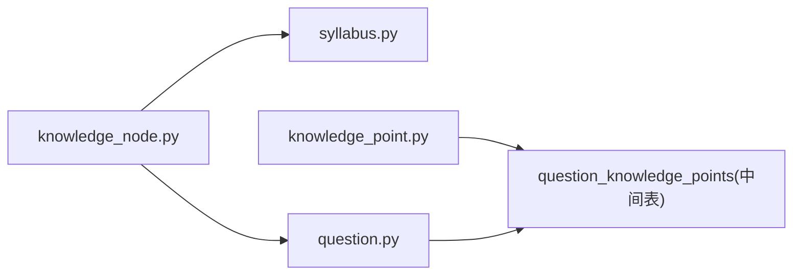

# 知识树管理系统

<cite>
**本文引用的文件**
- [backend/app/api/v1/endpoints/knowledge_tree.py](file://backend/app/api/v1/endpoints/knowledge_tree.py)
- [backend/app/models/knowledge_node.py](file://backend/app/models/knowledge_node.py)
- [backend/app/models/syllabus.py](file://backend/app/models/syllabus.py)
- [backend/app/models/knowledge_point.py](file://backend/app/models/knowledge_point.py)
- [backend/app/models/knowledge_point_model.py](file://backend/app/models/knowledge_point_model.py)
- [backend/app/models/question.py](file://backend/app/models/question.py)
- [frontend/src/pages/admin/KnowledgeTreePage.tsx](file://frontend/src/pages/admin/KnowledgeTreePage.tsx)
- [backend/alembic/versions/001_v22_initial.py](file://backend/alembic/versions/001_v22_initial.py)
</cite>

## 目录
1. [简介](#简介)
2. [项目结构](#项目结构)
3. [核心组件](#核心组件)
4. [架构总览](#架构总览)
5. [详细组件分析](#详细组件分析)
6. [依赖关系分析](#依赖关系分析)
7. [性能考量](#性能考量)
8. [故障排查指南](#故障排查指南)
9. [结论](#结论)
10. [附录](#附录)

## 简介
本文件面向“瑞珹教育管理系统”的“知识树管理系统”，系统性阐述知识树的层级结构、节点关系管理与树形数据组织方式；说明知识树的创建、编辑与维护机制（含父子节点关系与排序权重），以及知识点与试题的关联关系、学习路径规划与能力评估的实现思路；并提供知识树构建、遍历算法与查询优化的实践建议，解释动态更新与一致性保障机制。

## 项目结构
后端采用 FastAPI + SQLAlchemy 异步 ORM，前端使用 Ant Design React 组件库。知识树管理位于后端 API 的 v1 版本中，前端提供可视化管理界面。

图表来源
- [frontend/src/pages/admin/KnowledgeTreePage.tsx:1-439](file://frontend/src/pages/admin/KnowledgeTreePage.tsx#L1-L439)
- [backend/app/api/v1/endpoints/knowledge_tree.py:1-357](file://backend/app/api/v1/endpoints/knowledge_tree.py#L1-L357)
- [backend/app/models/knowledge_node.py:1-26](file://backend/app/models/knowledge_node.py#L1-L26)
- [backend/app/models/syllabus.py:1-26](file://backend/app/models/syllabus.py#L1-L26)
- [backend/app/models/knowledge_point.py:1-27](file://backend/app/models/knowledge_point.py#L1-L27)
- [backend/app/models/knowledge_point_model.py:1-29](file://backend/app/models/knowledge_point_model.py#L1-L29)
- [backend/app/models/question.py:1-46](file://backend/app/models/question.py#L1-L46)
- [backend/alembic/versions/001_v22_initial.py:1-426](file://backend/alembic/versions/001_v22_initial.py#L1-L426)

章节来源
- [backend/app/api/v1/endpoints/knowledge_tree.py:1-357](file://backend/app/api/v1/endpoints/knowledge_tree.py#L1-L357)
- [frontend/src/pages/admin/KnowledgeTreePage.tsx:1-439](file://frontend/src/pages/admin/KnowledgeTreePage.tsx#L1-L439)

## 核心组件
- 知识树节点模型：支持层级父子关系、排序权重、版本化、有效性标记与失效原因标注。
- 考纲模型：支持版本链式管理（父子关系）、当前版本标记与版本号。
- 知识点模型：用于具体知识点的编码、层级与学科/年级等维度。
- 知识点抽取模型：记录从内容抽取的知识点集合与置信度。
- 题目模型：承载题目元数据、难度、分值、来源与与知识点的关联。
- 前端知识树管理页：提供可视化增删改查、分支激活/失效、版本切换与回滚。

章节来源
- [backend/app/models/knowledge_node.py:1-26](file://backend/app/models/knowledge_node.py#L1-L26)
- [backend/app/models/syllabus.py:1-26](file://backend/app/models/syllabus.py#L1-L26)
- [backend/app/models/knowledge_point.py:1-27](file://backend/app/models/knowledge_point.py#L1-L27)
- [backend/app/models/knowledge_point_model.py:1-29](file://backend/app/models/knowledge_point_model.py#L1-L29)
- [backend/app/models/question.py:1-46](file://backend/app/models/question.py#L1-L46)
- [frontend/src/pages/admin/KnowledgeTreePage.tsx:1-439](file://frontend/src/pages/admin/KnowledgeTreePage.tsx#L1-L439)

## 架构总览
后端通过 API 提供知识树 CRUD、分支激活/失效、版本创建与回滚；前端负责渲染树形结构、版本时间线与交互操作。

图表来源
- [backend/app/api/v1/endpoints/knowledge_tree.py:1-357](file://backend/app/api/v1/endpoints/knowledge_tree.py#L1-L357)
- [backend/app/models/knowledge_node.py:1-26](file://backend/app/models/knowledge_node.py#L1-L26)
- [backend/app/models/syllabus.py:1-26](file://backend/app/models/syllabus.py#L1-L26)
- [backend/app/models/question.py:1-46](file://backend/app/models/question.py#L1-L46)
- [backend/alembic/versions/001_v22_initial.py:345-362](file://backend/alembic/versions/001_v22_initial.py#L345-L362)

## 详细组件分析

### 知识树节点模型与版本化设计
- 节点字段要点：层级父子关系（自引用外键）、节点类型（领域/知识点）、排序权重、版本号、有效性标记、失效原因、是否已修改、描述与元数据。
- 版本化策略：每个节点绑定所在考纲版本号；当父节点修改时，递归使所有后代节点失效，并标注失效原因；版本切换时复制当前有效节点到新版本。
- 一致性保障：更新节点时统一设置更新时间戳；批量失效与分支激活采用递归处理，确保树的一致性。

图表来源
- [backend/app/models/knowledge_node.py:1-26](file://backend/app/models/knowledge_node.py#L1-L26)
- [backend/app/models/syllabus.py:1-26](file://backend/app/models/syllabus.py#L1-L26)

章节来源
- [backend/app/models/knowledge_node.py:1-26](file://backend/app/models/knowledge_node.py#L1-L26)
- [backend/app/models/syllabus.py:1-26](file://backend/app/models/syllabus.py#L1-L26)

### 知识树 API 流程
- 获取知识树：按考纲与版本筛选节点，按排序权重升序排列，再递归组装为嵌套树结构。
- 创建节点：校验用户权限与考纲存在性，写入节点并标记为已修改。
- 更新节点：支持重命名、描述与排序；更新后递归使所有后代节点失效。
- 分支激活/失效：递归设置节点及其子树的有效性，并清除失效原因或标注为手动失效。
- 删除节点：先将分支设为无效，再对根节点标注手动失效。
- 新版本：复制当前有效节点到新版本，保持父子关系与排序权重。
- 回滚版本：在版本链上定位目标版本，将其设为当前版本，其他版本取消当前标记。

图表来源
- [backend/app/api/v1/endpoints/knowledge_tree.py:37-128](file://backend/app/api/v1/endpoints/knowledge_tree.py#L37-L128)

章节来源
- [backend/app/api/v1/endpoints/knowledge_tree.py:1-357](file://backend/app/api/v1/endpoints/knowledge_tree.py#L1-L357)

### 前端知识树管理页
- 功能概览：选择考纲与版本、加载树、展开/折叠、右键菜单、新增/编辑/删除节点、分支激活/失效、创建新版本、回滚到指定版本。
- 渲染逻辑：根据节点有效性、失效原因、是否已修改、节点类型渲染图标与标签；统计各版本活跃/总数节点。
- 交互流程：调用后端 API 完成树的增删改查与版本管理，刷新树视图并更新版本统计。

图表来源
- [frontend/src/pages/admin/KnowledgeTreePage.tsx:49-181](file://frontend/src/pages/admin/KnowledgeTreePage.tsx#L49-L181)

章节来源
- [frontend/src/pages/admin/KnowledgeTreePage.tsx:1-439](file://frontend/src/pages/admin/KnowledgeTreePage.tsx#L1-L439)

### 知识点与试题的关联关系
- 知识点模型：包含唯一编码、名称、父节点、学科、年级、难度等级等，支持层级结构。
- 题目模型：包含题目元数据、难度、分值、来源、审核状态等；与知识点通过中间表建立多对多关联。
- 权重分配：中间表记录权重，用于学习路径规划与能力评估时对知识点重要程度进行量化。

图表来源
- [backend/alembic/versions/001_v22_initial.py:163-170](file://backend/alembic/versions/001_v22_initial.py#L163-L170)
- [backend/app/models/knowledge_point.py:1-27](file://backend/app/models/knowledge_point.py#L1-L27)
- [backend/app/models/question.py:1-46](file://backend/app/models/question.py#L1-L46)

章节来源
- [backend/alembic/versions/001_v22_initial.py:163-170](file://backend/alembic/versions/001_v22_initial.py#L163-L170)
- [backend/app/models/knowledge_point.py:1-27](file://backend/app/models/knowledge_point.py#L1-L27)
- [backend/app/models/question.py:1-46](file://backend/app/models/question.py#L1-L46)

### 学习路径规划与能力评估思路
- 学习路径规划：基于知识树的层级与排序权重，结合知识点与试题的权重，生成从基础到高阶的学习序列；可按学科/年级维度拆分路径。
- 能力评估：以知识点权重为依据，统计学生在各知识点上的掌握程度，形成能力画像；结合错题本与练习结果迭代调整权重与路径。

（本节为概念性说明，不直接分析具体文件）

## 依赖关系分析
- 知识树节点依赖于考纲版本，同一版本内的节点构成一棵完整的树。
- 知识点模型与题库中间表共同支撑知识点与试题的关联，权重用于路径与评估。
- 前端依赖后端提供的树结构与版本信息，渲染树形控件与版本时间线。

图表来源
- [backend/app/models/knowledge_node.py:1-26](file://backend/app/models/knowledge_node.py#L1-L26)
- [backend/app/models/syllabus.py:1-26](file://backend/app/models/syllabus.py#L1-L26)
- [backend/app/models/knowledge_point.py:1-27](file://backend/app/models/knowledge_point.py#L1-L27)
- [backend/app/models/question.py:1-46](file://backend/app/models/question.py#L1-L46)
- [backend/alembic/versions/001_v22_initial.py:163-170](file://backend/alembic/versions/001_v22_initial.py#L163-L170)

章节来源
- [backend/app/models/knowledge_node.py:1-26](file://backend/app/models/knowledge_node.py#L1-L26)
- [backend/app/models/syllabus.py:1-26](file://backend/app/models/syllabus.py#L1-L26)
- [backend/app/models/knowledge_point.py:1-27](file://backend/app/models/knowledge_point.py#L1-L27)
- [backend/app/models/question.py:1-46](file://backend/app/models/question.py#L1-L46)
- [backend/alembic/versions/001_v22_initial.py:163-170](file://backend/alembic/versions/001_v22_initial.py#L163-L170)

## 性能考量
- 查询优化
  - 在节点模型上为 syllabus_id、parent_id、sort_order 建立索引，提升按版本与层级查询效率。
  - 树构建时先按 sort_order 排序，再递归组装，避免重复扫描。
- 写入优化
  - 批量复制有效节点到新版本时，尽量减少多次 flush/commit 的次数，合并提交。
  - 失效/激活递归操作应控制深度，必要时分批处理。
- 缓存策略
  - 对常用版本的树结构进行短期缓存，降低重复查询压力。
- 前端体验
  - 默认展开全部节点可能造成大量 DOM，建议按需展开或虚拟滚动。

（本节为通用性能建议，不直接分析具体文件）

## 故障排查指南
- 权限不足
  - 现象：创建/更新/删除/版本操作返回权限错误。
  - 排查：确认当前用户角色为管理员或系统管理员。
- 考纲不存在
  - 现象：查询版本或树时报错。
  - 排查：确认 syllabus_id 是否正确且存在。
- 节点不存在
  - 现象：更新/删除节点时报错。
  - 排查：确认 node_id 是否正确。
- 父节点修改导致子节点失效
  - 现象：更新父节点后，子树被自动设为失效。
  - 说明：这是预期行为，确保版本一致性；可在合适时机重新激活子树。
- 回滚失败
  - 现象：回滚到目标版本失败。
  - 排查：确认目标版本存在于当前版本链上，且当前用户有权限。

章节来源
- [backend/app/api/v1/endpoints/knowledge_tree.py:75-128](file://backend/app/api/v1/endpoints/knowledge_tree.py#L75-L128)
- [backend/app/api/v1/endpoints/knowledge_tree.py:260-319](file://backend/app/api/v1/endpoints/knowledge_tree.py#L260-L319)

## 结论
本系统通过版本化的知识树节点模型与严格的递归失效/激活机制，实现了知识树的动态更新与一致性保障；配合知识点与试题的权重关联，为学习路径规划与能力评估提供了数据基础。前后端协同，前端以可视化方式高效管理知识树，后端以清晰的 API 实现版本链与树操作，整体架构清晰、扩展性强。

## 附录

### 数据模型与迁移要点
- 初始迁移创建了知识树节点、考纲、知识点、题库与中间表等核心表，定义了索引与约束。
- 知识树节点与考纲之间通过版本号关联，形成版本链。
- 知识点与题目的关联通过中间表实现，支持权重配置。

章节来源
- [backend/alembic/versions/001_v22_initial.py:345-362](file://backend/alembic/versions/001_v22_initial.py#L345-L362)
- [backend/alembic/versions/001_v22_initial.py:308-324](file://backend/alembic/versions/001_v22_initial.py#L308-L324)
- [backend/alembic/versions/001_v22_initial.py:77-90](file://backend/alembic/versions/001_v22_initial.py#L77-L90)
- [backend/alembic/versions/001_v22_initial.py:163-170](file://backend/alembic/versions/001_v22_initial.py#L163-L170)