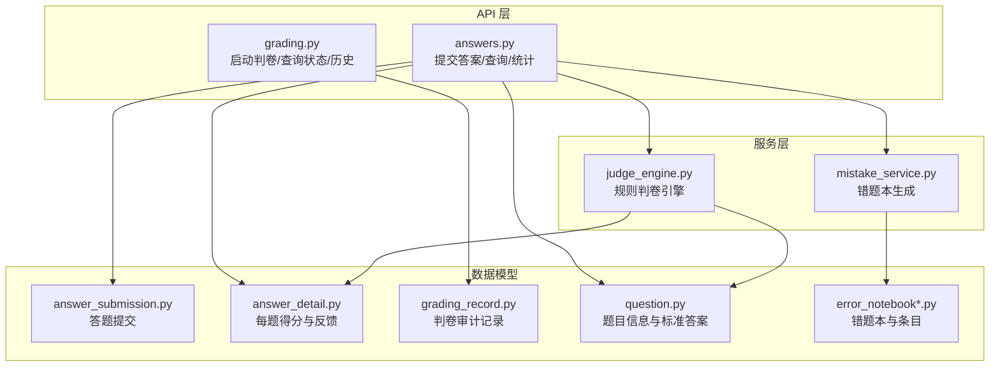
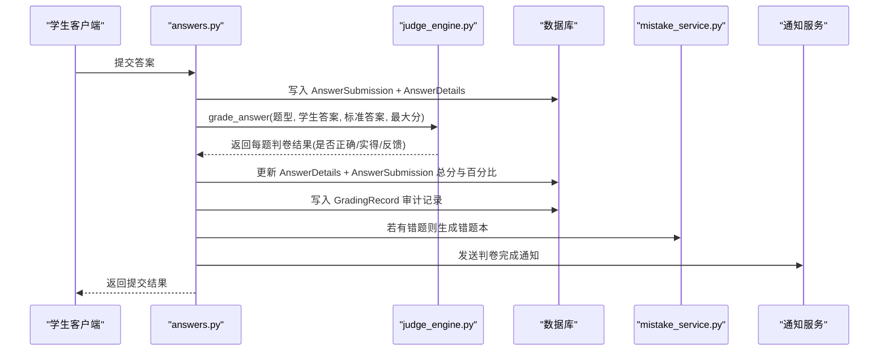
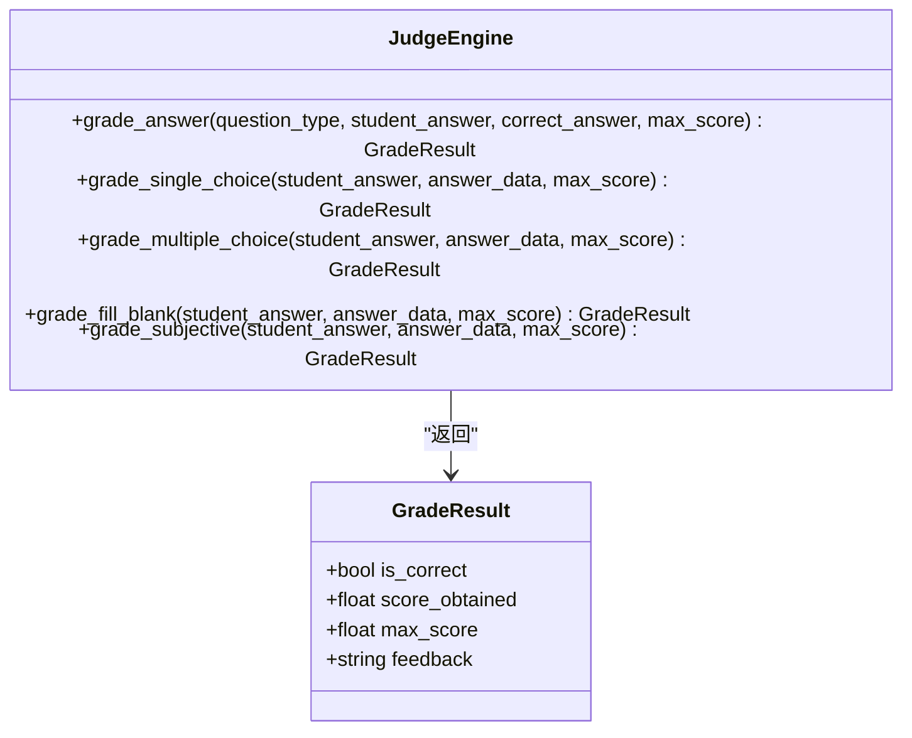
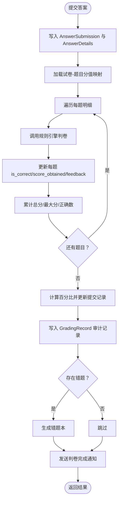
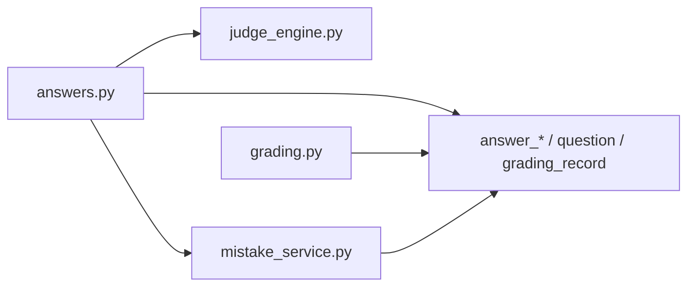

# 自动判卷引擎

<cite>
**本文引用的文件**
- [backend/app/services/judge_engine.py](file://backend/app/services/judge_engine.py)
- [backend/app/api/v1/endpoints/answers.py](file://backend/app/api/v1/endpoints/answers.py)
- [backend/app/api/v1/endpoints/grading.py](file://backend/app/api/v1/endpoints/grading.py)
- [backend/app/models/grading_record.py](file://backend/app/models/grading_record.py)
- [backend/app/models/answer_detail.py](file://backend/app/models/answer_detail.py)
- [backend/app/models/answer_submission.py](file://backend/app/models/answer_submission.py)
- [backend/app/models/question.py](file://backend/app/models/question.py)
- [backend/app/models/error_notebook.py](file://backend/app/models/error_notebook.py)
- [backend/app/models/error_notebook_question.py](file://backend/app/models/error_notebook_question.py)
- [backend/app/schemas/grading.py](file://backend/app/schemas/grading.py)
- [backend/alembic/versions/001_v22_initial.py](file://backend/alembic/versions/001_v22_initial.py)
- [nDocs/grading-implementation-plan.md](file://nDocs/grading-implementation-plan.md)
</cite>

## 目录
1. [引言](#引言)
2. [项目结构](#项目结构)
3. [核心组件](#核心组件)
4. [架构总览](#架构总览)
5. [详细组件分析](#详细组件分析)
6. [依赖分析](#依赖分析)
7. [性能考虑](#性能考虑)
8. [故障排查指南](#故障排查指南)
9. [结论](#结论)
10. [附录](#附录)

## 引言
本文件面向“瑞珹教育管理系统”的自动判卷引擎，系统化阐述基于规则的判卷算法（单选、多选、填空、主观），以及判卷反馈、分数计算与部分得分策略；同时覆盖判卷结果记录、错误分析与人工复核流程，并提供可定位到源码的示例路径，帮助开发者快速理解与扩展判卷能力。

## 项目结构
判卷引擎由“规则引擎服务”“API 控制器”“数据模型与审计记录”“错题本服务”等模块协同组成，整体围绕“提交答案 → 自动判卷 → 记录审计 → 错题本生成 → 通知”闭环展开。

图表来源
- [backend/app/api/v1/endpoints/answers.py](file://backend/app/api/v1/endpoints/answers.py)
- [backend/app/api/v1/endpoints/grading.py](file://backend/app/api/v1/endpoints/grading.py)
- [backend/app/services/judge_engine.py](file://backend/app/services/judge_engine.py)
- [backend/app/services/mistake_service.py](file://backend/app/services/mistake_service.py)
- [backend/app/models/answer_submission.py](file://backend/app/models/answer_submission.py)
- [backend/app/models/answer_detail.py](file://backend/app/models/answer_detail.py)
- [backend/app/models/grading_record.py](file://backend/app/models/grading_record.py)
- [backend/app/models/question.py](file://backend/app/models/question.py)
- [backend/app/models/error_notebook.py](file://backend/app/models/error_notebook.py)
- [backend/app/models/error_notebook_question.py](file://backend/app/models/error_notebook_question.py)

章节来源
- [backend/app/api/v1/endpoints/answers.py](file://backend/app/api/v1/endpoints/answers.py)
- [backend/app/api/v1/endpoints/grading.py](file://backend/app/api/v1/endpoints/grading.py)
- [backend/app/services/judge_engine.py](file://backend/app/services/judge_engine.py)
- [backend/app/services/mistake_service.py](file://backend/app/services/mistake_service.py)
- [backend/app/models/answer_submission.py](file://backend/app/models/answer_submission.py)
- [backend/app/models/answer_detail.py](file://backend/app/models/answer_detail.py)
- [backend/app/models/grading_record.py](file://backend/app/models/grading_record.py)
- [backend/app/models/question.py](file://backend/app/models/question.py)
- [backend/app/models/error_notebook.py](file://backend/app/models/error_notebook.py)
- [backend/app/models/error_notebook_question.py](file://backend/app/models/error_notebook_question.py)

## 核心组件
- 规则判卷引擎：统一入口函数根据题型调用对应判卷函数，返回是否正确、实得分数、最大分值与反馈文本。
- 答案提交与判卷编排：提交答案后立即触发判卷，更新提交记录与每题明细，并生成判卷审计记录。
- 错题本服务：按未正确作答的题目去重生成错题本，并标注错误类型与说明。
- 数据模型：包含答题提交、每题明细、判卷审计记录、题目与错题本相关表。

章节来源
- [backend/app/services/judge_engine.py](file://backend/app/services/judge_engine.py)
- [backend/app/api/v1/endpoints/answers.py](file://backend/app/api/v1/endpoints/answers.py)
- [backend/app/services/mistake_service.py](file://backend/app/services/mistake_service.py)
- [backend/app/models/answer_submission.py](file://backend/app/models/answer_submission.py)
- [backend/app/models/answer_detail.py](file://backend/app/models/answer_detail.py)
- [backend/app/models/grading_record.py](file://backend/app/models/grading_record.py)
- [backend/app/models/question.py](file://backend/app/models/question.py)
- [backend/app/models/error_notebook.py](file://backend/app/models/error_notebook.py)
- [backend/app/models/error_notebook_question.py](file://backend/app/models/error_notebook_question.py)

## 架构总览
下图展示了从“提交答案”到“生成判卷记录与错题本”的端到端流程。

图表来源
- [backend/app/api/v1/endpoints/answers.py](file://backend/app/api/v1/endpoints/answers.py)
- [backend/app/services/judge_engine.py](file://backend/app/services/judge_engine.py)
- [backend/app/services/mistake_service.py](file://backend/app/services/mistake_service.py)
- [backend/app/models/grading_record.py](file://backend/app/models/grading_record.py)
- [backend/app/models/answer_detail.py](file://backend/app/models/answer_detail.py)
- [backend/app/models/answer_submission.py](file://backend/app/models/answer_submission.py)

## 详细组件分析

### 规则判卷引擎（基于题型）
- 统一入口函数接收题型、学生答案、标准答案与最大分值，解析标准答案后委派给具体判卷函数。
- 支持题型：单选、多选、填空、主观。
- 反馈与部分得分策略：
  - 单选：完全一致才得满分，否则零分。
  - 多选：按交集占正确集合的比例计算部分分，支持字符串或数组两种正确答案格式。
  - 填空：支持单空多答案与多空多答案模式，分别按匹配比例或逐空匹配计算。
  - 主观：以关键词匹配率给出建议分（如≥0.8建议0.9倍分，≥0.4为0.5倍，否则0.1倍），并提示人工复核。

章节来源
- [backend/app/services/judge_engine.py](file://backend/app/services/judge_engine.py)

#### 判卷算法类图

图表来源
- [backend/app/services/judge_engine.py](file://backend/app/services/judge_engine.py)

### 答案提交与判卷编排
- 提交答案接口在事务中写入答题提交与每题明细，随后调用判卷编排函数。
- 编排函数会：
  - 读取该提交的所有题目明细；
  - 优先使用“试卷-题目”映射中的分值，否则回退到题目默认分值；
  - 逐题调用规则引擎判卷，累计实得分与最大分，更新每题 is_correct、score_obtained、feedback；
  - 计算百分比并更新提交记录；
  - 写入判卷审计记录（含每题明细、总数、正确数）；
  - 成功后触发错题本生成与判卷完成通知。

章节来源
- [backend/app/api/v1/endpoints/answers.py](file://backend/app/api/v1/endpoints/answers.py)

#### 提交与判卷流程图

图表来源
- [backend/app/api/v1/endpoints/answers.py](file://backend/app/api/v1/endpoints/answers.py)
- [backend/app/models/grading_record.py](file://backend/app/models/grading_record.py)
- [backend/app/models/answer_detail.py](file://backend/app/models/answer_detail.py)
- [backend/app/models/answer_submission.py](file://backend/app/models/answer_submission.py)

### 错题本与人工复核
- 错题本生成：按学生筛选未正确作答的题目，去重后构建错题本与条目，标注错误类型与说明。
- 错误类型分类依据：
  - 未作答、概念错误（单选/多选且得分为0）、部分正确（单选/多选非零但不全对）、记忆错误（填空）、理解偏差（其他）。
- 与判卷反馈联动：错题本条目的 explanation 字段包含“学生答案”“正确答案/反馈”，便于教师复核。

章节来源
- [backend/app/services/mistake_service.py](file://backend/app/services/mistake_service.py)
- [backend/app/models/error_notebook.py](file://backend/app/models/error_notebook.py)
- [backend/app/models/error_notebook_question.py](file://backend/app/models/error_notebook_question.py)

### 数据模型与审计
- 答题提交：记录提交类型、状态、总分、百分比、时间戳等。
- 每题明细：记录学生答案、是否正确、实得分数、反馈、元数据等。
- 判卷审计：记录模型名称/版本、状态、开始/结束时间、总分、百分比、每题明细与统计信息。
- 题目：包含题型、难度、科目、默认分值、标准答案与元数据等。

章节来源
- [backend/app/models/answer_submission.py](file://backend/app/models/answer_submission.py)
- [backend/app/models/answer_detail.py](file://backend/app/models/answer_detail.py)
- [backend/app/models/grading_record.py](file://backend/app/models/grading_record.py)
- [backend/app/models/question.py](file://backend/app/models/question.py)

### API 与权限控制
- 启动判卷：仅教师/管理员或本人可操作；写入 PROCESSING 审计记录，完成后更新为 COMPLETED。
- 查询状态/结果：按 ID 获取判卷记录。
- 历史查询：按学生或按试卷分页查询判卷历史。
- 模型管理：查看可用判卷模型、切换当前模型（当前为规则引擎）。

章节来源
- [backend/app/api/v1/endpoints/grading.py](file://backend/app/api/v1/endpoints/grading.py)
- [backend/app/schemas/grading.py](file://backend/app/schemas/grading.py)

## 依赖分析
- 规则引擎依赖：仅依赖标准库与类型注解，耦合度低，易于扩展新题型。
- 答案编排依赖：依赖数据库模型与规则引擎；通过事务保证一致性。
- 错题本依赖：依赖答案明细与题目模型，按未正确作答去重。
- API 依赖：依赖安全中间件与数据库会话；对不同用户角色进行权限校验。

图表来源
- [backend/app/api/v1/endpoints/answers.py](file://backend/app/api/v1/endpoints/answers.py)
- [backend/app/api/v1/endpoints/grading.py](file://backend/app/api/v1/endpoints/grading.py)
- [backend/app/services/judge_engine.py](file://backend/app/services/judge_engine.py)
- [backend/app/services/mistake_service.py](file://backend/app/services/mistake_service.py)
- [backend/app/models/answer_submission.py](file://backend/app/models/answer_submission.py)
- [backend/app/models/answer_detail.py](file://backend/app/models/answer_detail.py)
- [backend/app/models/grading_record.py](file://backend/app/models/grading_record.py)
- [backend/app/models/question.py](file://backend/app/models/question.py)

## 性能考虑
- 单次判卷批量化：在一次事务中批量读取明细、逐题判卷、批量写入，减少往返开销。
- 分值映射优先：优先使用“试卷-题目”分值映射，避免重复计算默认分值。
- 文本处理优化：统一大小写与空白处理，集合运算用于多选与填空匹配，提升效率。
- 异步与并发：当前为同步判卷；后续可通过消息队列异步化（见规划文档）以削峰填谷。

[本节为通用性能建议，不直接分析特定文件，故无章节来源]

## 故障排查指南
- 判卷异常：检查规则引擎对题型分支与标准答案解析是否正确；确认每题的 max_score 来源（试卷-题目映射优先）。
- 错题本为空：确认是否存在 is_correct=False 的题目；检查去重逻辑是否命中同一 question_id。
- 权限错误：确认当前用户角色与资源归属；教师/管理员可访问全部，学生仅可访问本人。
- 审计缺失：确认判卷流程是否进入事务并写入 GradingRecord；检查异常捕获与日志。

章节来源
- [backend/app/api/v1/endpoints/answers.py](file://backend/app/api/v1/endpoints/answers.py)
- [backend/app/api/v1/endpoints/grading.py](file://backend/app/api/v1/endpoints/grading.py)
- [backend/app/services/judge_engine.py](file://backend/app/services/judge_engine.py)
- [backend/app/services/mistake_service.py](file://backend/app/services/mistake_service.py)

## 结论
本判卷引擎以规则驱动为核心，覆盖主流客观题与主观题评分场景，具备完善的审计记录与错题本联动。通过清晰的模块划分与事务保障，确保判卷过程可追溯、可复核。后续可在多选题公式修正、主观题评分细化、LLM 语义评分与异步化等方面持续演进。

[本节为总结性内容，不直接分析特定文件，故无章节来源]

## 附录

### 题型判卷要点与示例路径
- 单选题
  - 判卷逻辑：完全一致才得满分，否则零分。
  - 示例路径：[grade_single_choice](file://backend/app/services/judge_engine.py)
- 多选题
  - 判卷逻辑：按交集占正确集合的比例计算部分分，支持字符串或数组格式。
  - 示例路径：[grade_multiple_choice](file://backend/app/services/judge_engine.py)
- 填空题
  - 判卷逻辑：单空多答案或多个空位的多答案模式，分别按匹配比例或逐空匹配。
  - 示例路径：[grade_fill_blank](file://backend/app/services/judge_engine.py)
- 主观题
  - 判卷逻辑：关键词匹配率分级赋分并提示人工复核。
  - 示例路径：[grade_subjective](file://backend/app/services/judge_engine.py)

### 判卷流程与结果处理
- 端到端流程：提交答案 → 规则判卷 → 更新明细与提交记录 → 写入审计记录 → 错题本生成 → 通知。
- 示例路径：
  - [提交答案与自动判卷](file://backend/app/api/v1/endpoints/answers.py)
  - [启动判卷与状态查询](file://backend/app/api/v1/endpoints/grading.py)
  - [判卷审计记录模型](file://backend/app/models/grading_record.py)
  - [每题明细模型](file://backend/app/models/answer_detail.py)
  - [答题提交模型](file://backend/app/models/answer_submission.py)
  - [题目模型](file://backend/app/models/question.py)

### 错误分析与人工复核
- 错题本生成与去重：按未正确作答题目去重，标注错误类型与说明。
- 示例路径：
  - [错题本服务](file://backend/app/services/mistake_service.py)
  - [错题本模型](file://backend/app/models/error_notebook.py)
  - [错题本条目模型](file://backend/app/models/error_notebook_question.py)

### 数据库初始化与约束
- 初始 Schema 包含答题提交、每题明细、判卷审计、错题本等相关表。
- 示例路径：
  - [初始迁移脚本](file://backend/alembic/versions/001_v22_initial.py)

### 规划与扩展
- 当前为纯规则引擎，主观题评分策略简单，后续计划引入 LLM 语义评分与异步化。
- 示例路径：
  - [判卷实现规划（含主观题与 LLM 规划）](file://nDocs/grading-implementation-plan.md)