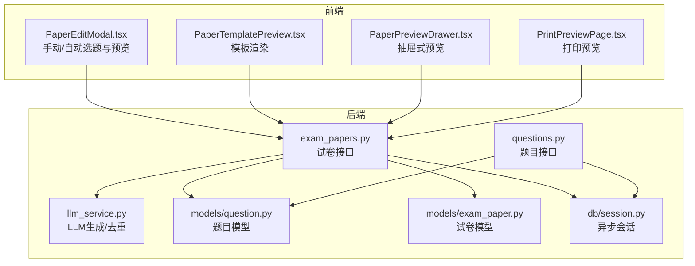
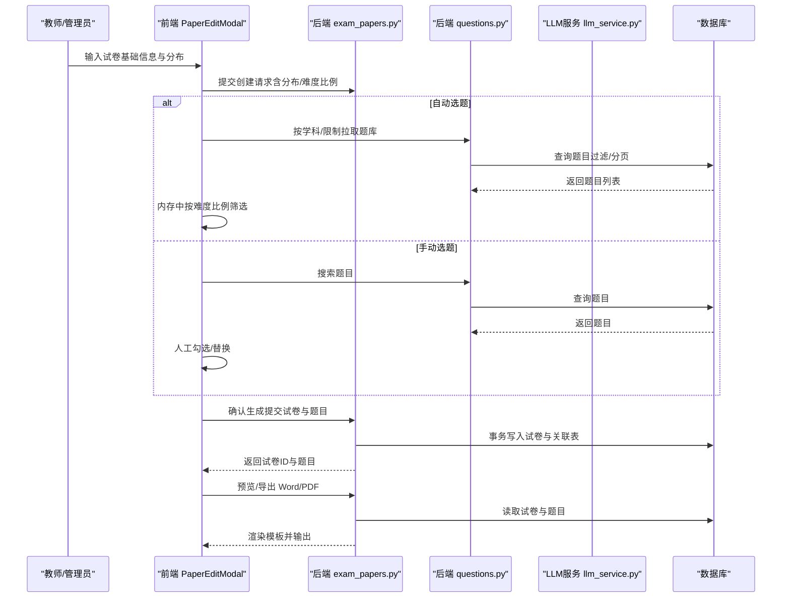
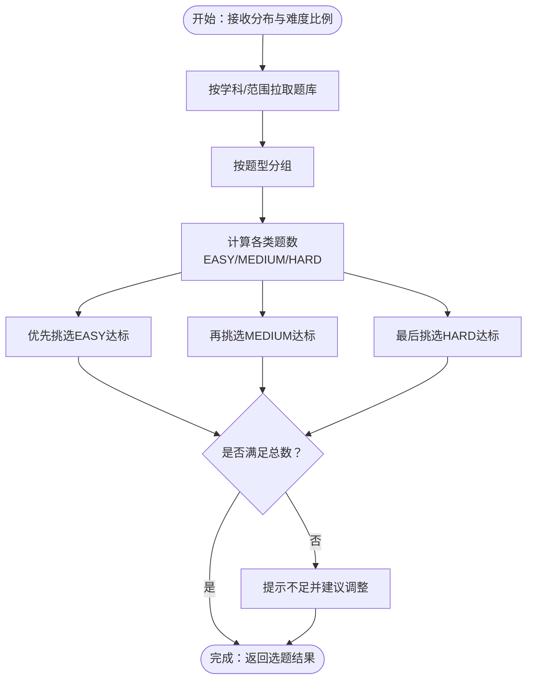
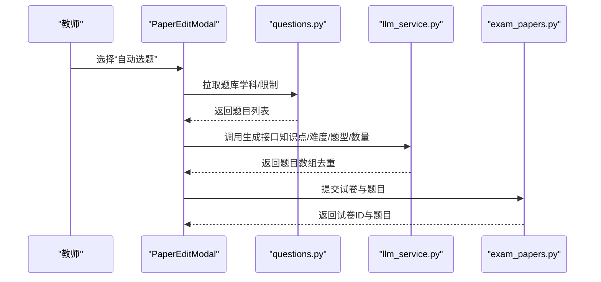
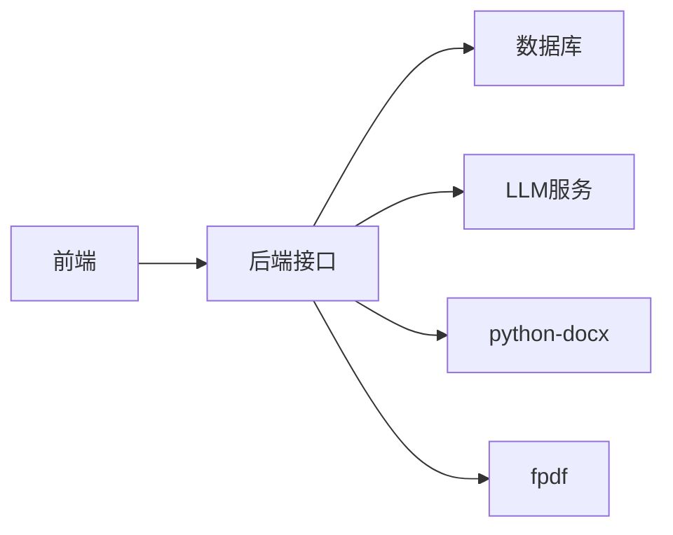

# 试卷生成系统

<cite>
**本文引用的文件**
- [backend/app/api/v1/endpoints/exam_papers.py](file://backend/app/api/v1/endpoints/exam_papers.py)
- [backend/app/models/exam_paper.py](file://backend/app/models/exam_paper.py)
- [backend/app/models/question.py](file://backend/app/models/question.py)
- [backend/app/schemas/exam_paper.py](file://backend/app/schemas/exam_paper.py)
- [backend/app/services/llm_service.py](file://backend/app/services/llm_service.py)
- [backend/app/api/v1/endpoints/questions.py](file://backend/app/api/v1/endpoints/questions.py)
- [frontend/src/pages/papers/PaperEditModal.tsx](file://frontend/src/pages/papers/PaperEditModal.tsx)
- [frontend/src/pages/papers/PaperTemplatePreview.tsx](file://frontend/src/pages/papers/PaperTemplatePreview.tsx)
- [frontend/src/pages/papers/PaperPreviewDrawer.tsx](file://frontend/src/pages/papers/PaperPreviewDrawer.tsx)
- [frontend/src/pages/papers/PrintPreviewPage.tsx](file://frontend/src/pages/papers/PrintPreviewPage.tsx)
- [backend/app/db/session.py](file://backend/app/db/session.py)
- [nDocs/database-design.md](file://nDocs/database-design.md)
</cite>

## 目录
1. [简介](#简介)
2. [项目结构](#项目结构)
3. [核心组件](#核心组件)
4. [架构总览](#架构总览)
5. [详细组件分析](#详细组件分析)
6. [依赖分析](#依赖分析)
7. [性能考虑](#性能考虑)
8. [故障排查指南](#故障排查指南)
9. [结论](#结论)
10. [附录](#附录)

## 简介
本文件面向瑞珹教育管理系统中的“试卷生成系统”，围绕智能组卷算法、题目筛选策略、试卷结构设计与模板渲染进行深入说明，并对三种组卷模式（手动组卷、随机组卷、智能组卷）的实现原理进行拆解。文档还涵盖模板系统、题目权重与难度平衡机制、性能优化与并发处理策略，并提供关键流程的图示与参考路径，便于开发者快速定位实现细节。

## 项目结构
后端采用 FastAPI + SQLAlchemy 异步数据库会话；前端使用 React + Ant Design，围绕“新建/编辑试卷”工作流提供交互。核心围绕以下模块展开：
- 后端接口层：负责试卷与题目的增删改查、导出 Word/PDF、预览等
- 数据模型层：定义试卷、题目及关联表结构
- 服务层：封装 LLM 题目生成与去重逻辑
- 前端页面：提供手动/自动选题、难度与题型分布配置、模板预览与打印预览



图表来源
- [backend/app/api/v1/endpoints/exam_papers.py:1-847](file://backend/app/api/v1/endpoints/exam_papers.py#L1-L847)
- [backend/app/api/v1/endpoints/questions.py:1-434](file://backend/app/api/v1/endpoints/questions.py#L1-L434)
- [backend/app/models/exam_paper.py:1-51](file://backend/app/models/exam_paper.py#L1-L51)
- [backend/app/models/question.py:1-46](file://backend/app/models/question.py#L1-L46)
- [backend/app/services/llm_service.py:1-350](file://backend/app/services/llm_service.py#L1-L350)
- [frontend/src/pages/papers/PaperEditModal.tsx:1-497](file://frontend/src/pages/papers/PaperEditModal.tsx#L1-L497)
- [frontend/src/pages/papers/PaperTemplatePreview.tsx:1-132](file://frontend/src/pages/papers/PaperTemplatePreview.tsx#L1-L132)
- [frontend/src/pages/papers/PaperPreviewDrawer.tsx:1-40](file://frontend/src/pages/papers/PaperPreviewDrawer.tsx#L1-L40)
- [frontend/src/pages/papers/PrintPreviewPage.tsx:1-70](file://frontend/src/pages/papers/PrintPreviewPage.tsx#L1-L70)
- [backend/app/db/session.py:1-26](file://backend/app/db/session.py#L1-L26)

章节来源
- [backend/app/api/v1/endpoints/exam_papers.py:1-847](file://backend/app/api/v1/endpoints/exam_papers.py#L1-L847)
- [backend/app/models/exam_paper.py:1-51](file://backend/app/models/exam_paper.py#L1-L51)
- [backend/app/models/question.py:1-46](file://backend/app/models/question.py#L1-L46)
- [backend/app/services/llm_service.py:1-350](file://backend/app/services/llm_service.py#L1-L350)
- [frontend/src/pages/papers/PaperEditModal.tsx:1-497](file://frontend/src/pages/papers/PaperEditModal.tsx#L1-L497)
- [frontend/src/pages/papers/PaperTemplatePreview.tsx:1-132](file://frontend/src/pages/papers/PaperTemplatePreview.tsx#L1-L132)
- [frontend/src/pages/papers/PaperPreviewDrawer.tsx:1-40](file://frontend/src/pages/papers/PaperPreviewDrawer.tsx#L1-L40)
- [frontend/src/pages/papers/PrintPreviewPage.tsx:1-70](file://frontend/src/pages/papers/PrintPreviewPage.tsx#L1-L70)
- [backend/app/db/session.py:1-26](file://backend/app/db/session.py#L1-L26)

## 核心组件
- 试卷模型与关联表：支持按题型与难度分组、顺序与分数标注
- 题目模型：支持题型、难度、学科、年级范围、典型题标记与来源
- 试卷接口：提供创建、更新、删除、查询、排序、导出 Word/PDF、预览等功能
- 题目接口：提供搜索、批量导入/导出、典型题标记等
- LLM 服务：封装 Ollama/DeepSeek 的题目生成与去重
- 前端组卷流程：手动/自动选题、难度与题型分布、模板预览与打印预览

章节来源
- [backend/app/models/exam_paper.py:1-51](file://backend/app/models/exam_paper.py#L1-L51)
- [backend/app/models/question.py:1-46](file://backend/app/models/question.py#L1-L46)
- [backend/app/api/v1/endpoints/exam_papers.py:1-847](file://backend/app/api/v1/endpoints/exam_papers.py#L1-L847)
- [backend/app/api/v1/endpoints/questions.py:1-434](file://backend/app/api/v1/endpoints/questions.py#L1-L434)
- [backend/app/services/llm_service.py:1-350](file://backend/app/services/llm_service.py#L1-L350)
- [frontend/src/pages/papers/PaperEditModal.tsx:1-497](file://frontend/src/pages/papers/PaperEditModal.tsx#L1-L497)

## 架构总览
系统采用前后端分离架构，前端负责交互与模板渲染，后端提供 REST 接口与业务逻辑。数据库采用异步 SQLAlchemy 会话，支持高并发读写。LLM 服务作为外部集成点，统一抽象两种供应商（Ollama/DeepSeek）。



图表来源
- [frontend/src/pages/papers/PaperEditModal.tsx:69-147](file://frontend/src/pages/papers/PaperEditModal.tsx#L69-L147)
- [backend/app/api/v1/endpoints/exam_papers.py:20-64](file://backend/app/api/v1/endpoints/exam_papers.py#L20-L64)
- [backend/app/api/v1/endpoints/questions.py:39-104](file://backend/app/api/v1/endpoints/questions.py#L39-L104)
- [backend/app/services/llm_service.py:54-104](file://backend/app/services/llm_service.py#L54-L104)

## 详细组件分析

### 组件A：智能组卷算法与题目筛选策略
- 题型与难度分布：前端以“题型分布 + 难度比例”双维度输入，后端在创建时接收并持久化
- 内存筛选策略：自动选题时，后端先按学科与限制拉取题库，前端在内存中按“题型×难度比例”进行匹配与补足
- 难度平衡：按 EASY/MEDIUM/HARD 三档比例计算每类题数，优先满足“难度档缺口”，不足则给出警告
- 权重与计分：默认按“总分/题数”均分，也可由用户指定每题分值



图表来源
- [frontend/src/pages/papers/PaperEditModal.tsx:98-137](file://frontend/src/pages/papers/PaperEditModal.tsx#L98-L137)
- [frontend/src/pages/papers/PaperEditModal.tsx:105-129](file://frontend/src/pages/papers/PaperEditModal.tsx#L105-L129)

章节来源
- [frontend/src/pages/papers/PaperEditModal.tsx:69-147](file://frontend/src/pages/papers/PaperEditModal.tsx#L69-L147)
- [frontend/src/pages/papers/PaperEditModal.tsx:105-129](file://frontend/src/pages/papers/PaperEditModal.tsx#L105-L129)

### 组件B：三种组卷模式实现原理
- 手动组卷
  - 步骤：填写基础信息 → 选择“手动选题” → 搜索题目 → 勾选/替换 → 预览确认 → 生成试卷
  - 关键点：前端维护选题集合与难度筛选，后端按顺序与分值写入关联表
- 随机组卷
  - 步骤：填写基础信息 → 选择“自动选题” → 后端按学科/范围拉取题库 → 内存中按比例随机抽取
  - 关键点：当前实现为“按比例筛选”，非严格随机；若需严格随机，可在内存抽取阶段增加洗牌逻辑
- 智能组卷（基于 LLM）
  - 步骤：填写基础信息 → 选择“自动选题” → LLM 服务根据知识点/难度/题型生成题目 → 去重后返回
  - 关键点：提示词模板与答案格式约束，支持 Ollama/DeepSeek 两种供应商



图表来源
- [frontend/src/pages/papers/PaperEditModal.tsx:98-137](file://frontend/src/pages/papers/PaperEditModal.tsx#L98-L137)
- [backend/app/services/llm_service.py:54-104](file://backend/app/services/llm_service.py#L54-L104)
- [backend/app/api/v1/endpoints/questions.py:39-104](file://backend/app/api/v1/endpoints/questions.py#L39-L104)

章节来源
- [frontend/src/pages/papers/PaperEditModal.tsx:149-158](file://frontend/src/pages/papers/PaperEditModal.tsx#L149-L158)
- [frontend/src/pages/papers/PaperEditModal.tsx:160-187](file://frontend/src/pages/papers/PaperEditModal.tsx#L160-L187)
- [backend/app/services/llm_service.py:54-104](file://backend/app/services/llm_service.py#L54-L104)

### 组件C：试卷结构设计与模板系统
- 结构设计
  - 试卷实体包含标题、副标题、描述、学科、适用范围、总分、时长、状态、说明等
  - 题目与试卷通过中间表关联，支持顺序(position)与分值(score)标注
- 模板渲染
  - 前端模板按题型分段（填空/单选/多选/解答），支持替换按钮与占位符
  - 后端导出 Word/PDF 时按题型分组、插入选项/填空线/主观答题区
- 预览
  - 抽屉式预览与打印预览页面分别用于后台管理和学生打印场景

```mermaid
classDiagram
class ExamPaper {
+id
+title
+subtitle
+description
+subject
+grade_level
+total_score
+duration_minutes
+status
+instructions
+questions[]
}
class Question {
+id
+title
+question_type
+difficulty
+subject
+grade_level
+score
+correct_answer
+explanation
+meta_data
+source
+review_status
+is_active
+is_typical
}
class ExamPaper_Question {
+id
+exam_paper_id
+question_id
+position
+score
}
ExamPaper "1" -- "*" Question : "many-to-many"
ExamPaper ||--o{ ExamPaper_Question : "关联"
Question ||--o{ ExamPaper_Question : "关联"
```

图表来源
- [backend/app/models/exam_paper.py:9-20](file://backend/app/models/exam_paper.py#L9-L20)
- [backend/app/models/exam_paper.py:23-51](file://backend/app/models/exam_paper.py#L23-L51)
- [backend/app/models/question.py:10-46](file://backend/app/models/question.py#L10-L46)

章节来源
- [backend/app/models/exam_paper.py:1-51](file://backend/app/models/exam_paper.py#L1-L51)
- [backend/app/models/question.py:1-46](file://backend/app/models/question.py#L1-L46)
- [frontend/src/pages/papers/PaperTemplatePreview.tsx:1-132](file://frontend/src/pages/papers/PaperTemplatePreview.tsx#L1-L132)
- [backend/app/api/v1/endpoints/exam_papers.py:635-738](file://backend/app/api/v1/endpoints/exam_papers.py#L635-L738)
- [backend/app/api/v1/endpoints/exam_papers.py:741-800](file://backend/app/api/v1/endpoints/exam_papers.py#L741-L800)

### 组件D：题目权重分配与难度平衡机制
- 权重分配
  - 默认按“总分/题数”均分；用户也可为每道题单独设置分值
- 难度平衡
  - 依据“题型×难度比例”计算每类题数，优先满足低难度缺口，再逐步提升
  - 若题库不足，前端给出明确提示并建议调整分布
- 典型题与来源
  - 支持典型题标记与来源字段，便于后续统计与质量控制

章节来源
- [frontend/src/pages/papers/PaperEditModal.tsx:172-178](file://frontend/src/pages/papers/PaperEditModal.tsx#L172-L178)
- [frontend/src/pages/papers/PaperEditModal.tsx:110-129](file://frontend/src/pages/papers/PaperEditModal.tsx#L110-L129)
- [backend/app/models/question.py:19-31](file://backend/app/models/question.py#L19-L31)

### 组件E：模板渲染与导出（Word/PDF）
- Word 导出
  - 标题/副标题/信息行/注意事项/按题型分段/选项/填空线/主观答题区
- PDF 导出
  - 使用内置中文字体，适配 CJK 显示；结构与 Word 类似

章节来源
- [backend/app/api/v1/endpoints/exam_papers.py:635-738](file://backend/app/api/v1/endpoints/exam_papers.py#L635-L738)
- [backend/app/api/v1/endpoints/exam_papers.py:741-800](file://backend/app/api/v1/endpoints/exam_papers.py#L741-L800)

## 依赖分析
- 组件耦合
  - 前端与后端通过 REST API 通信；模板渲染与导出由后端统一处理，降低前端复杂度
  - 试卷与题目通过中间表关联，保证扩展性与顺序控制
- 外部依赖
  - LLM 服务依赖 Ollama 或 DeepSeek；导出依赖 python-docx 与 fpdf
- 并发与事务
  - 使用 SQLAlchemy 异步会话；创建试卷与题目写入在单事务中执行，确保一致性



图表来源
- [backend/app/api/v1/endpoints/exam_papers.py:635-738](file://backend/app/api/v1/endpoints/exam_papers.py#L635-L738)
- [backend/app/api/v1/endpoints/exam_papers.py:741-800](file://backend/app/api/v1/endpoints/exam_papers.py#L741-L800)
- [backend/app/db/session.py:1-26](file://backend/app/db/session.py#L1-L26)

章节来源
- [backend/app/db/session.py:1-26](file://backend/app/db/session.py#L1-L26)
- [backend/app/api/v1/endpoints/exam_papers.py:1-847](file://backend/app/api/v1/endpoints/exam_papers.py#L1-L847)

## 性能考虑
- 查询与分页
  - 题目搜索与导出限制最大条数，避免超大结果集
- 内存筛选
  - 自动选题在前端内存中按比例筛选，减少多次数据库往返；建议对题库规模较大时增加服务端分页与缓存
- 导出性能
  - Word/PDF 导出使用流式响应，避免一次性加载大文件到内存
- 并发与事务
  - 异步会话与单事务写入，减少锁竞争；建议在高并发场景下引入连接池参数调优与限流策略

章节来源
- [backend/app/api/v1/endpoints/questions.py:54-104](file://backend/app/api/v1/endpoints/questions.py#L54-L104)
- [backend/app/api/v1/endpoints/questions.py:171-214](file://backend/app/api/v1/endpoints/questions.py#L171-L214)
- [backend/app/api/v1/endpoints/exam_papers.py:635-738](file://backend/app/api/v1/endpoints/exam_papers.py#L635-L738)
- [backend/app/api/v1/endpoints/exam_papers.py:741-800](file://backend/app/api/v1/endpoints/exam_papers.py#L741-L800)
- [backend/app/db/session.py:1-26](file://backend/app/db/session.py#L1-L26)

## 故障排查指南
- LLM 连接失败
  - 现象：提示无法连接 Ollama/DeepSeek
  - 排查：检查服务地址、网络连通性、API Key 与模型名
- 题库不足
  - 现象：按比例筛选后某难度/题型不足
  - 排查：调整难度比例或题型分布，或补充题库
- 导出异常
  - 现象：Word/PDF 导出失败或乱码
  - 排查：确认字体可用、内容编码、流式响应头设置

章节来源
- [backend/app/services/llm_service.py:100-103](file://backend/app/services/llm_service.py#L100-L103)
- [backend/app/services/llm_service.py:176-178](file://backend/app/services/llm_service.py#L176-L178)
- [frontend/src/pages/papers/PaperEditModal.tsx:125-128](file://frontend/src/pages/papers/PaperEditModal.tsx#L125-L128)
- [backend/app/api/v1/endpoints/exam_papers.py:741-800](file://backend/app/api/v1/endpoints/exam_papers.py#L741-L800)

## 结论
该系统通过清晰的前后端分工与标准化的数据模型，实现了灵活的组卷模式与稳定的模板渲染能力。智能组卷依托 LLM 服务，具备良好的扩展性；难度与题型的双重控制保障了试卷结构的合理性。建议在高并发场景下进一步完善服务端分页与缓存策略，并对随机组卷的算法进行增强以满足更严格的均衡需求。

## 附录
- 数据库设计要点
  - 试卷与题目多对多关联，支持顺序与分值
  - 题目模型包含来源、审核状态、典型题标记等字段，便于质量控制
- 前端参考路径
  - 组卷流程与模板预览：[PaperEditModal.tsx:69-147](file://frontend/src/pages/papers/PaperEditModal.tsx#L69-L147)、[PaperTemplatePreview.tsx:1-132](file://frontend/src/pages/papers/PaperTemplatePreview.tsx#L1-L132)
  - 预览与打印：[PaperPreviewDrawer.tsx:1-40](file://frontend/src/pages/papers/PaperPreviewDrawer.tsx#L1-L40)、[PrintPreviewPage.tsx:1-70](file://frontend/src/pages/papers/PrintPreviewPage.tsx#L1-L70)
- 后端参考路径
  - 试卷接口：[exam_papers.py:1-847](file://backend/app/api/v1/endpoints/exam_papers.py#L1-L847)
  - 题目接口：[questions.py:1-434](file://backend/app/api/v1/endpoints/questions.py#L1-L434)
  - LLM 服务：[llm_service.py:1-350](file://backend/app/services/llm_service.py#L1-L350)
  - 数据模型：[exam_paper.py:1-51](file://backend/app/models/exam_paper.py#L1-L51)、[question.py:1-46](file://backend/app/models/question.py#L1-L46)
  - 数据库会话：[session.py:1-26](file://backend/app/db/session.py#L1-L26)
  - 数据库设计说明：[database-design.md:98-150](file://nDocs/database-design.md#L98-L150)