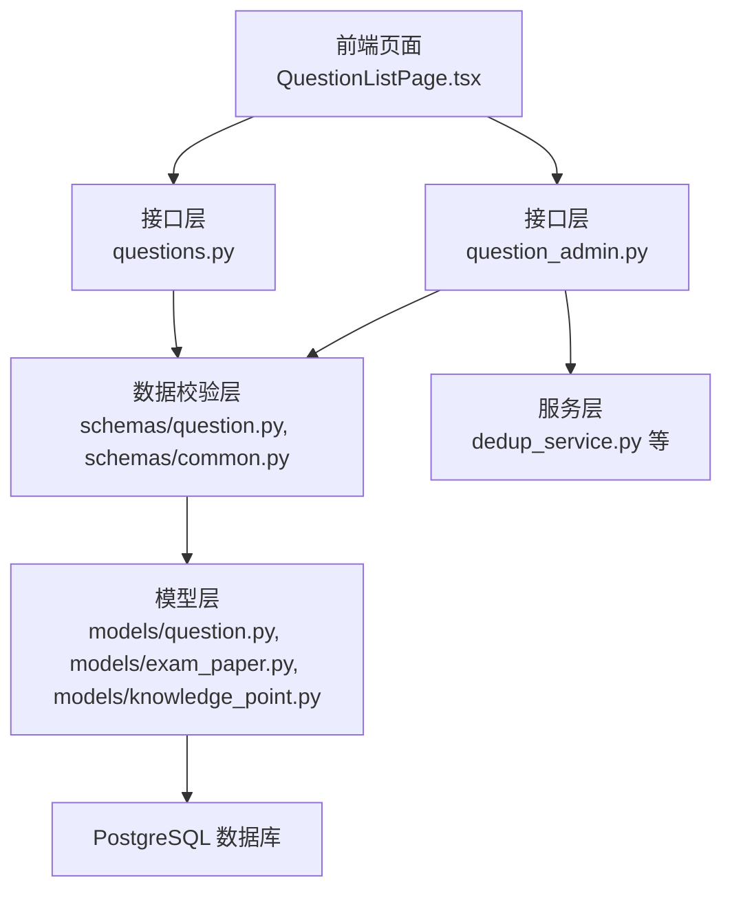
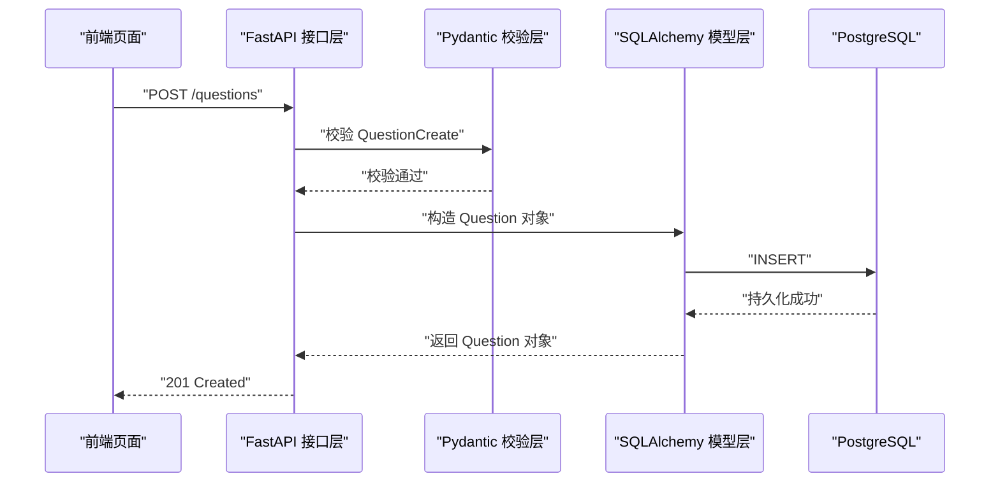
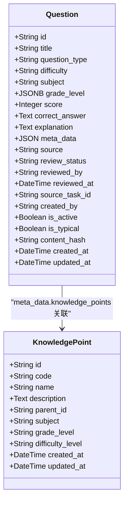
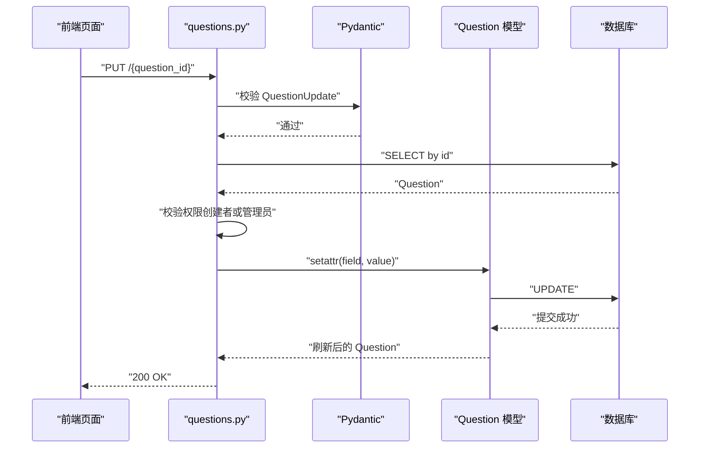
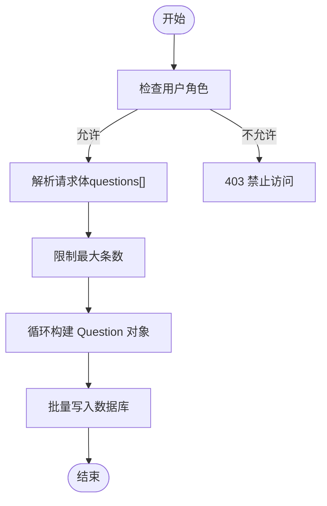
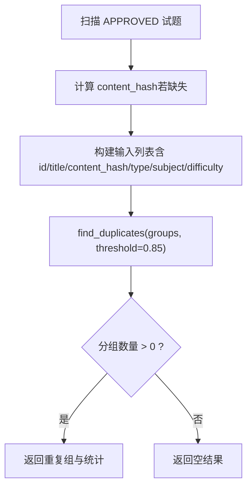
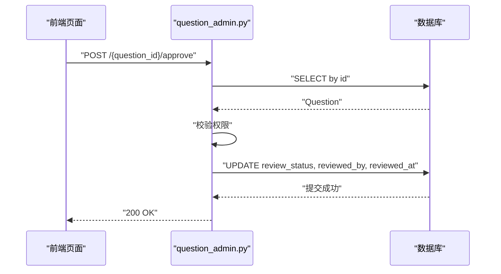
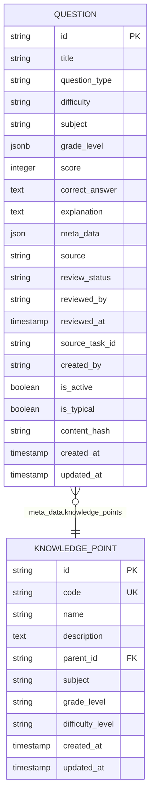
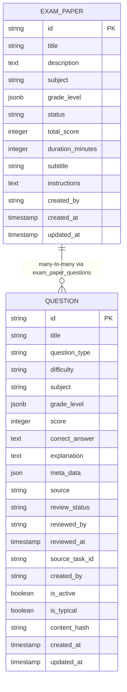
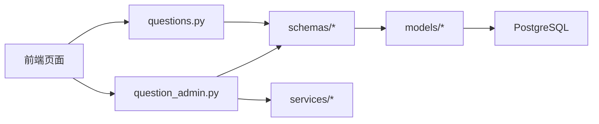

# 试题管理系统

<cite>
**本文引用的文件**
- [backend/app/models/question.py](file://backend/app/models/question.py)
- [backend/app/schemas/question.py](file://backend/app/schemas/question.py)
- [backend/app/api/v1/endpoints/questions.py](file://backend/app/api/v1/endpoints/questions.py)
- [backend/app/api/v1/endpoints/question_admin.py](file://backend/app/api/v1/endpoints/question_admin.py)
- [backend/app/schemas/common.py](file://backend/app/schemas/common.py)
- [backend/app/models/exam_paper.py](file://backend/app/models/exam_paper.py)
- [backend/app/models/knowledge_point.py](file://backend/app/models/knowledge_point.py)
- [backend/app/models/admin.py](file://backend/app/models/admin.py)
- [backend/app/services/dedup_service.py](file://backend/app/services/dedup_service.py)
- [backend/alembic/versions/006_add_content_hash_to_questions.py](file://backend/alembic/versions/006_add_content_hash_to_questions.py)
- [frontend/src/pages/questions/QuestionListPage.tsx](file://frontend/src/pages/questions/QuestionListPage.tsx)
</cite>

## 目录
1. [简介](#简介)
2. [项目结构](#项目结构)
3. [核心组件](#核心组件)
4. [架构总览](#架构总览)
5. [详细组件分析](#详细组件分析)
6. [依赖分析](#依赖分析)
7. [性能考虑](#性能考虑)
8. [故障排查指南](#故障排查指南)
9. [结论](#结论)
10. [附录](#附录)

## 简介
本文件面向“瑞珹教育管理系统”的“试题管理系统”，围绕后端数据库模型、Pydantic 数据校验层、FastAPI 接口层以及前端页面交互，系统性阐述试题的创建、编辑、删除、查询、批量导入导出、去重策略与版本化能力，并给出题型数据结构设计、分类体系、知识点关联、难度等级与标签管理机制，以及业务规则与数据完整性保障。

## 项目结构
后端采用 FastAPI + SQLAlchemy 架构，按领域模块组织：models 定义表结构与约束；schemas 定义 Pydantic 校验模型；api/v1/endpoints 提供 REST 接口；services 提供业务服务（如去重、LLM、OCR 等）。前端使用 React + Ant Design，提供题库管理界面与批量操作入口。

图表来源
- [frontend/src/pages/questions/QuestionListPage.tsx:1-342](file://frontend/src/pages/questions/QuestionListPage.tsx#L1-L342)
- [backend/app/api/v1/endpoints/questions.py:1-434](file://backend/app/api/v1/endpoints/questions.py#L1-L434)
- [backend/app/api/v1/endpoints/question_admin.py:1-837](file://backend/app/api/v1/endpoints/question_admin.py#L1-L837)
- [backend/app/schemas/question.py:1-75](file://backend/app/schemas/question.py#L1-L75)
- [backend/app/schemas/common.py:1-87](file://backend/app/schemas/common.py#L1-L87)
- [backend/app/models/question.py:1-46](file://backend/app/models/question.py#L1-L46)
- [backend/app/models/exam_paper.py:1-51](file://backend/app/models/exam_paper.py#L1-L51)
- [backend/app/models/knowledge_point.py:1-27](file://backend/app/models/knowledge_point.py#L1-L27)
- [backend/app/services/dedup_service.py:1-127](file://backend/app/services/dedup_service.py#L1-L127)

章节来源
- [backend/app/models/question.py:1-46](file://backend/app/models/question.py#L1-L46)
- [backend/app/schemas/question.py:1-75](file://backend/app/schemas/question.py#L1-L75)
- [backend/app/api/v1/endpoints/questions.py:1-434](file://backend/app/api/v1/endpoints/questions.py#L1-L434)
- [backend/app/api/v1/endpoints/question_admin.py:1-837](file://backend/app/api/v1/endpoints/question_admin.py#L1-L837)
- [frontend/src/pages/questions/QuestionListPage.tsx:1-342](file://frontend/src/pages/questions/QuestionListPage.tsx#L1-L342)

## 核心组件
- 数据模型（Question）
  - 字段覆盖标题、题型、难度、学科、适用范围、分值、参考答案、解析、元数据、来源、审核状态、创建者、激活状态、典型标记、内容哈希、时间戳等。
  - 约束：题型与难度枚举校验，分值必须为正数；索引覆盖内容哈希、激活状态、创建者等。
- 数据校验（Pydantic）
  - QuestionCreate/QuestionUpdate/QuestionResponse 定义字段长度、数值范围、枚举匹配与 JSON 正则校验。
  - CorrectAnswerUnion 联合类型支持单选、多选、填空、主观四种答案结构。
- 接口层（questions.py）
  - CRUD：创建、查询、更新、删除；分页与过滤；导出与批量导入；典型题标记与查询。
  - 权限控制：仅教师、题库管理员、系统管理员可操作；教师仅可见自身学科。
- 接口层（question_admin.py）
  - 审核流：待审列表、批量通过/驳回、统计。
  - LLM 生成、网页抓取、OCR 识别、去重扫描与合并（部分实现）。
- 去重服务（dedup_service.py）
  - 基于 SimHash 的文本指纹计算与汉明距离相似度，支持精确重复与近似重复分组。
- 前端页面（QuestionListPage.tsx）
  - 支持筛选、分页、批量操作、导出、导入弹窗、典型题开关等。

章节来源
- [backend/app/models/question.py:10-46](file://backend/app/models/question.py#L10-L46)
- [backend/app/schemas/question.py:10-75](file://backend/app/schemas/question.py#L10-L75)
- [backend/app/schemas/common.py:23-87](file://backend/app/schemas/common.py#L23-L87)
- [backend/app/api/v1/endpoints/questions.py:17-434](file://backend/app/api/v1/endpoints/questions.py#L17-L434)
- [backend/app/api/v1/endpoints/question_admin.py:220-837](file://backend/app/api/v1/endpoints/question_admin.py#L220-L837)
- [backend/app/services/dedup_service.py:1-127](file://backend/app/services/dedup_service.py#L1-L127)
- [frontend/src/pages/questions/QuestionListPage.tsx:1-342](file://frontend/src/pages/questions/QuestionListPage.tsx#L1-L342)

## 架构总览
后端采用分层架构：前端通过 REST API 与后端交互，接口层负责鉴权与参数组装，校验层确保入参合法性，模型层映射到数据库表并通过约束保障数据一致性，服务层提供算法与第三方集成能力。

图表来源
- [backend/app/api/v1/endpoints/questions.py:17-36](file://backend/app/api/v1/endpoints/questions.py#L17-L36)
- [backend/app/schemas/question.py:33-36](file://backend/app/schemas/question.py#L33-L36)
- [backend/app/models/question.py:10-46](file://backend/app/models/question.py#L10-L46)

## 详细组件分析

### 1) 试题数据模型与题型结构
- 表结构要点
  - 主键 id、标题 title、题型 question_type、难度 difficulty、学科 subject、适用范围 grade_level（JSONB）、分值 score、参考答案 correct_answer（Text）、解析 explanation（Text）、元数据 meta_data（JSON）、来源 source、审核状态 review_status、审核人 reviewed_by、审核时间 reviewed_at、来源任务 source_task_id、创建者 created_by、激活状态 is_active、典型标记 is_typical、内容哈希 content_hash、时间戳 created_at/updated_at。
  - 约束：题型与难度枚举校验，分值>0；索引：content_hash、is_active、created_by。
- 题型与答案结构
  - 单选：选项集合 + 正确答案（字符串，选项标签）。
  - 多选：选项集合 + 正确答案（标签数组）。
  - 填空：无选项，正确答案为候选答案数组。
  - 主观：无选项，正确答案为关键词与最高分对象。
- 元数据与知识点
  - meta_data 中可存放知识要点数组，用于检索与导出；前端提供“知识点”过滤条件。

图表来源
- [backend/app/models/question.py:10-46](file://backend/app/models/question.py#L10-L46)
- [backend/app/models/knowledge_point.py:7-27](file://backend/app/models/knowledge_point.py#L7-L27)
- [backend/app/schemas/common.py:23-87](file://backend/app/schemas/common.py#L23-L87)

章节来源
- [backend/app/models/question.py:10-46](file://backend/app/models/question.py#L10-L46)
- [backend/app/schemas/common.py:51-87](file://backend/app/schemas/common.py#L51-L87)
- [backend/app/models/knowledge_point.py:7-27](file://backend/app/models/knowledge_point.py#L7-L27)

### 2) 试题 CRUD 与查询流程
- 创建
  - 校验 QuestionCreate，填充默认 source 与 review_status，写入 created_by，持久化后返回 QuestionResponse。
- 查询
  - 支持按学科、年级、范围、来源、题型、难度、关键字、知识点、审核状态、是否典型等过滤；教师仅能看其学科；分页与总数统计。
- 更新
  - 校验 QuestionUpdate，仅创建者或系统管理员可修改；权限不足抛 403。
- 删除
  - 仅允许教师、题库管理员、系统管理员；404/403 场景明确。
- 典型题
  - 标记 is_typical，仅管理员可操作；典型题查询接口返回精选列表。

图表来源
- [backend/app/api/v1/endpoints/questions.py:292-328](file://backend/app/api/v1/endpoints/questions.py#L292-L328)
- [backend/app/schemas/question.py:38-61](file://backend/app/schemas/question.py#L38-L61)
- [backend/app/models/question.py:10-46](file://backend/app/models/question.py#L10-L46)

章节来源
- [backend/app/api/v1/endpoints/questions.py:17-347](file://backend/app/api/v1/endpoints/questions.py#L17-L347)
- [backend/app/schemas/question.py:10-75](file://backend/app/schemas/question.py#L10-L75)

### 3) 批量导入与导出
- 批量导入
  - 接收 JSON 数组，逐条构造 Question 对象并入库，限制最大条数；适合 Excel/JSON 文件导入。
- 导出
  - 按 ID 导出指定试题；按条件导出（学科、年级、题型、难度、关键字、知识点），受配置导出上限限制；Python 层过滤知识点字段以兼容 SQLite。
- 前端交互
  - 支持“导出选中/导出全部”，自动下载 JSON 文件。

图表来源
- [backend/app/api/v1/endpoints/questions.py:127-155](file://backend/app/api/v1/endpoints/questions.py#L127-L155)
- [backend/app/api/v1/endpoints/questions.py:158-214](file://backend/app/api/v1/endpoints/questions.py#L158-L214)
- [frontend/src/pages/questions/QuestionListPage.tsx:140-165](file://frontend/src/pages/questions/QuestionListPage.tsx#L140-L165)

章节来源
- [backend/app/api/v1/endpoints/questions.py:127-214](file://backend/app/api/v1/endpoints/questions.py#L127-L214)
- [frontend/src/pages/questions/QuestionListPage.tsx:140-165](file://frontend/src/pages/questions/QuestionListPage.tsx#L140-L165)

### 4) 试题去重策略与版本管理
- 去重策略
  - SimHash 文本指纹 + 汉明距离阈值（默认 0.85）进行相似度分组；支持精确重复与近似重复；支持按知识点/难度过滤。
  - 历史数据迁移：通过 Alembic 迁移添加 content_hash 字段并建立索引。
- 版本管理
  - 与题库版本相关联的实体（如 syllabus）具备版本号与当前版本标识，便于追踪考纲与题型分布演进。
- 实现现状
  - 去重扫描接口已实现；去重合并接口处于占位状态，需后续完善。

图表来源
- [backend/app/api/v1/endpoints/question_admin.py:730-797](file://backend/app/api/v1/endpoints/question_admin.py#L730-L797)
- [backend/app/services/dedup_service.py:63-113](file://backend/app/services/dedup_service.py#L63-L113)
- [backend/alembic/versions/006_add_content_hash_to_questions.py:17-24](file://backend/alembic/versions/006_add_content_hash_to_questions.py#L17-L24)

章节来源
- [backend/app/api/v1/endpoints/question_admin.py:498-797](file://backend/app/api/v1/endpoints/question_admin.py#L498-L797)
- [backend/app/services/dedup_service.py:1-127](file://backend/app/services/dedup_service.py#L1-127)
- [backend/alembic/versions/006_add_content_hash_to_questions.py:1-25](file://backend/alembic/versions/006_add_content_hash_to_questions.py#L1-L25)

### 5) 审核与业务规则
- 审核流
  - 待审列表、批量通过/驳回、统计报表；审核状态包含 APPROVED/PENDING/REJECTED/NEEDS_REVIEW。
- 权限矩阵
  - 创建/编辑/删除：教师、题库管理员、系统管理员；典型题标记：教师、题库管理员、系统管理员。
  - 教师仅可见自身学科；跨学科需题库管理员或系统管理员身份。
- 数据完整性
  - 数据库层通过 CheckConstraint 与字段类型约束；Pydantic 层通过字段校验与枚举约束；接口层通过权限中间件与业务校验。

图表来源
- [backend/app/api/v1/endpoints/question_admin.py:268-284](file://backend/app/api/v1/endpoints/question_admin.py#L268-L284)

章节来源
- [backend/app/api/v1/endpoints/question_admin.py:220-412](file://backend/app/api/v1/endpoints/question_admin.py#L220-L412)
- [backend/app/models/question.py:38-43](file://backend/app/models/question.py#L38-L43)
- [backend/app/schemas/question.py:10-75](file://backend/app/schemas/question.py#L10-L75)

### 6) 知识点体系与分类
- 知识点模型
  - code 唯一索引；父子关系；学科与年级维度；难度层级；时间戳。
- 与试题关联
  - 试题 meta_data 中存储知识要点数组；前端支持按知识点过滤；后端导出时在 Python 层做知识点匹配过滤。
- 考纲版本
  - syllabus 支持版本号、当前版本标识、父版本等，便于题库演进与对比。

图表来源
- [backend/app/models/knowledge_point.py:7-27](file://backend/app/models/knowledge_point.py#L7-L27)
- [backend/app/models/question.py:10-46](file://backend/app/models/question.py#L10-L46)

章节来源
- [backend/app/models/knowledge_point.py:7-27](file://backend/app/models/knowledge_point.py#L7-L27)
- [backend/app/models/question.py:10-46](file://backend/app/models/question.py#L10-L46)
- [backend/app/api/v1/endpoints/questions.py:171-214](file://backend/app/api/v1/endpoints/questions.py#L171-L214)

### 7) 与试卷的关系
- 试题与试卷为多对多关系，通过中间表 exam_paper_questions 维护位置与分数。
- 试卷模型包含状态（草稿/发布/归档）、总分、时长、描述等；与试题的关联用于组卷与排版。

图表来源
- [backend/app/models/exam_paper.py:9-51](file://backend/app/models/exam_paper.py#L9-L51)
- [backend/app/models/question.py:10-46](file://backend/app/models/question.py#L10-L46)

章节来源
- [backend/app/models/exam_paper.py:9-51](file://backend/app/models/exam_paper.py#L9-L51)
- [backend/app/models/question.py:10-46](file://backend/app/models/question.py#L10-L46)

## 依赖分析
- 组件耦合
  - 接口层依赖校验层与模型层；模型层依赖数据库；服务层独立于接口层，便于替换与扩展。
- 外部依赖
  - LLM/Ollama 用于 OCR 识别与生成；SQLite/JSONB 查询在 Python 层做二次过滤以提升兼容性。
- 可能的循环依赖
  - 当前模块间为单向依赖，未见循环。

图表来源
- [frontend/src/pages/questions/QuestionListPage.tsx:1-342](file://frontend/src/pages/questions/QuestionListPage.tsx#L1-L342)
- [backend/app/api/v1/endpoints/questions.py:1-434](file://backend/app/api/v1/endpoints/questions.py#L1-L434)
- [backend/app/api/v1/endpoints/question_admin.py:1-837](file://backend/app/api/v1/endpoints/question_admin.py#L1-L837)
- [backend/app/schemas/question.py:1-75](file://backend/app/schemas/question.py#L1-L75)
- [backend/app/models/question.py:1-46](file://backend/app/models/question.py#L1-L46)

章节来源
- [backend/app/api/v1/endpoints/questions.py:1-434](file://backend/app/api/v1/endpoints/questions.py#L1-L434)
- [backend/app/api/v1/endpoints/question_admin.py:1-837](file://backend/app/api/v1/endpoints/question_admin.py#L1-L837)
- [frontend/src/pages/questions/QuestionListPage.tsx:1-342](file://frontend/src/pages/questions/QuestionListPage.tsx#L1-L342)

## 性能考虑
- 查询优化
  - content_hash 建有索引，便于去重扫描；is_active/created_by 建有索引，加速筛选与分页。
  - JSONB 查询使用 contains/cast/astext 等函数，建议在高频过滤字段上评估物化列或复合索引。
- 导出上限
  - 后端读取配置限制导出数量，避免超大数据集一次性导出导致内存压力。
- 去重复杂度
  - SimHash + 汉明距离分组的时间复杂度与数据规模线性相关，建议分批扫描与缓存 content_hash。

## 故障排查指南
- 常见错误与定位
  - 403 权限不足：确认用户角色与资源归属；教师仅能操作本人创建或学科内的试题。
  - 404 试题不存在：确认 question_id 是否有效或已被删除。
  - 校验失败：检查题型/难度枚举、分值范围、正确答案 JSON 结构。
  - 导出上限：检查系统配置 export_max，必要时调整。
- 去重问题
  - 若 content_hash 缺失，先执行去重扫描以补全指纹；确认阈值设置是否合理。
- 前端交互
  - 批量导出/导入失败：检查网络与后端日志；确认导出上限与文件格式。

章节来源
- [backend/app/api/v1/endpoints/questions.py:292-347](file://backend/app/api/v1/endpoints/questions.py#L292-L347)
- [backend/app/api/v1/endpoints/question_admin.py:730-797](file://backend/app/api/v1/endpoints/question_admin.py#L730-L797)
- [frontend/src/pages/questions/QuestionListPage.tsx:140-165](file://frontend/src/pages/questions/QuestionListPage.tsx#L140-L165)

## 结论
本系统围绕“试题”这一核心实体，建立了完善的模型、校验与接口层，覆盖了创建、编辑、删除、查询、批量处理、审核与去重等关键能力。题型结构通过联合类型与 JSONB 元数据实现灵活扩展；知识点与考纲版本支持教学体系化管理；权限与约束保障数据安全与一致性。建议后续完善去重合并流程、增强导出性能与前端交互体验，并持续优化 JSONB 查询与索引策略。

## 附录
- 代码示例路径（不含具体代码内容）
  - 创建试题：[backend/app/api/v1/endpoints/questions.py:17-36](file://backend/app/api/v1/endpoints/questions.py#L17-L36)
  - 更新试题：[backend/app/api/v1/endpoints/questions.py:292-328](file://backend/app/api/v1/endpoints/questions.py#L292-L328)
  - 删除试题：[backend/app/api/v1/endpoints/questions.py:331-347](file://backend/app/api/v1/endpoints/questions.py#L331-L347)
  - 批量导入：[backend/app/api/v1/endpoints/questions.py:127-155](file://backend/app/api/v1/endpoints/questions.py#L127-L155)
  - 导出试题：[backend/app/api/v1/endpoints/questions.py:158-214](file://backend/app/api/v1/endpoints/questions.py#L158-L214)
  - 去重扫描：[backend/app/api/v1/endpoints/question_admin.py:730-797](file://backend/app/api/v1/endpoints/question_admin.py#L730-L797)
  - 审核通过：[backend/app/api/v1/endpoints/question_admin.py:268-284](file://backend/app/api/v1/endpoints/question_admin.py#L268-L284)
  - 前端导出/导入：[frontend/src/pages/questions/QuestionListPage.tsx:140-165](file://frontend/src/pages/questions/QuestionListPage.tsx#L140-L165)