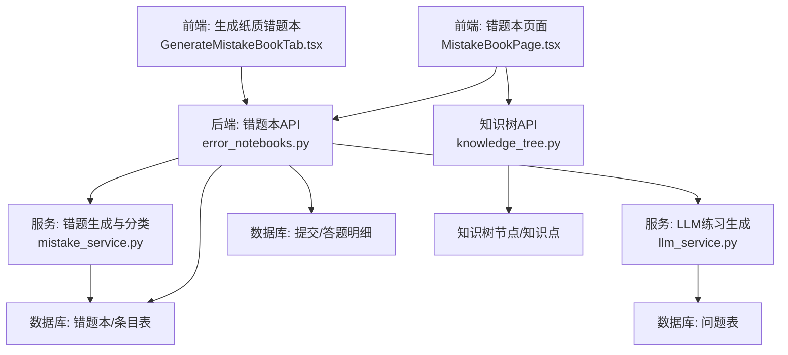
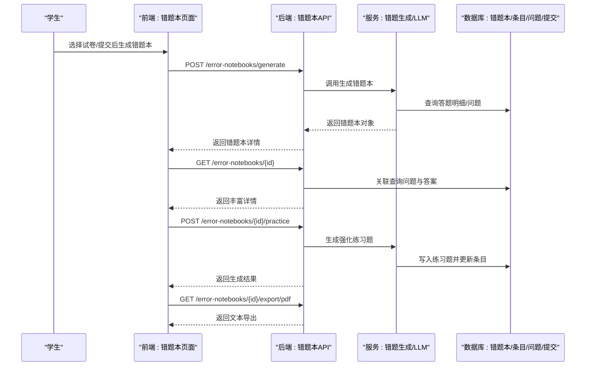
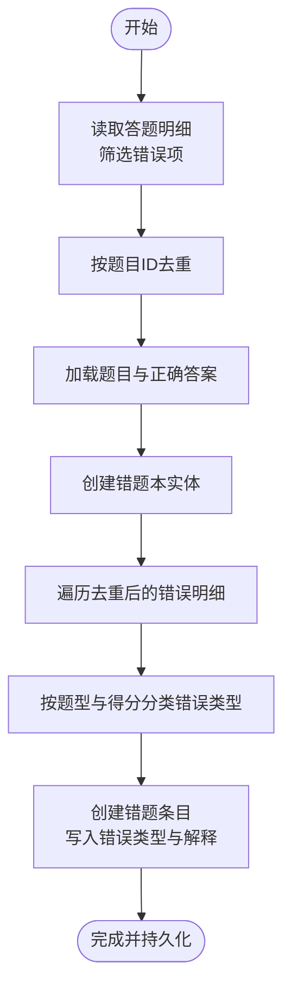
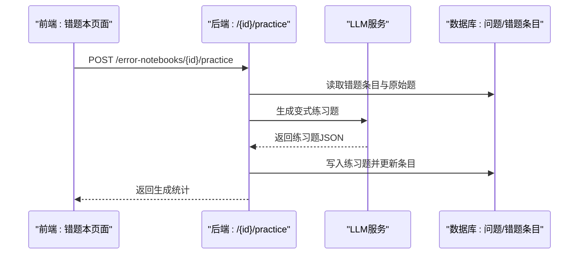
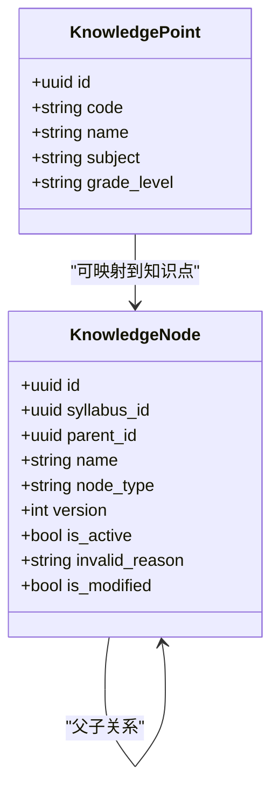
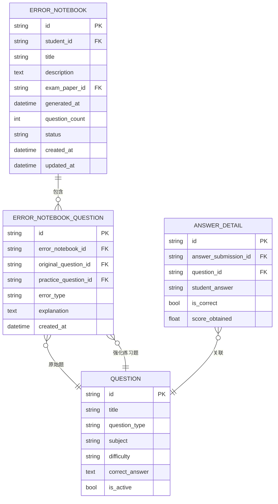
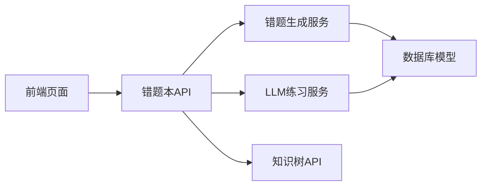

# 错题本系统

<cite>
**本文引用的文件**
- [backend/app/models/error_notebook.py](file://backend/app/models/error_notebook.py)
- [backend/app/models/error_notebook_question.py](file://backend/app/models/error_notebook_question.py)
- [backend/app/schemas/error_notebook.py](file://backend/app/schemas/error_notebook.py)
- [backend/app/api/v1/endpoints/error_notebooks.py](file://backend/app/api/v1/endpoints/error_notebooks.py)
- [backend/app/services/mistake_service.py](file://backend/app/services/mistake_service.py)
- [backend/app/services/llm_service.py](file://backend/app/services/llm_service.py)
- [backend/app/models/knowledge_node.py](file://backend/app/models/knowledge_node.py)
- [backend/app/models/knowledge_point.py](file://backend/app/models/knowledge_point.py)
- [backend/app/api/v1/endpoints/knowledge_tree.py](file://backend/app/api/v1/endpoints/knowledge_tree.py)
- [frontend/src/pages/mistake-book/MistakeBookPage.tsx](file://frontend/src/pages/mistake-book/MistakeBookPage.tsx)
- [frontend/src/pages/exam-mistakes/GenerateMistakeBookTab.tsx](file://frontend/src/pages/exam-mistakes/GenerateMistakeBookTab.tsx)
- [backend/app/api/v1/endpoints/stats.py](file://backend/app/api/v1/endpoints/stats.py)
- [backend/app/models/reward_goal.py](file://backend/app/models/reward_goal.py)
- [backend/alembic/versions/008_add_explanation_sessions.py](file://backend/alembic/versions/008_add_explanation_sessions.py)
- [backend/alembic/versions/009_add_parent_encouragement.py](file://backend/alembic/versions/009_add_parent_encouragement.py)
- [docs/requirements-v2.1.1.md](file://docs/requirements-v2.1.1.md)
</cite>

## 目录
1. [简介](#简介)
2. [项目结构](#项目结构)
3. [核心组件](#核心组件)
4. [架构总览](#架构总览)
5. [详细组件分析](#详细组件分析)
6. [依赖分析](#依赖分析)
7. [性能考虑](#性能考虑)
8. [故障排查指南](#故障排查指南)
9. [结论](#结论)
10. [附录](#附录)

## 简介
本文件面向“瑞珹教育管理系统”的错题本系统，围绕错题收集机制、知识点匹配与智能推荐、个性化复习策略、错题分类与错误原因分析、学习轨迹追踪、错题本创建与管理、导出能力，以及与“版本化知识树”的关联机制展开。文档提供代码级架构图、流程图与序列图，并给出可操作的实现路径与优化建议。

## 项目结构
后端采用 FastAPI + SQLAlchemy 异步 ORM，前端使用 React + Ant Design。错题本相关模块主要分布在：
- 后端模型层：错题本与错题条目、LLM 练习生成、知识树节点与知识点
- 后端服务层：错题生成与分类、LLM 练习生成
- 后端接口层：错题本的生成、查询、删除、导出、统计、手动录入
- 前端页面：错题本列表、打印、预览、批量操作、快速录入、拍照扫描入口

图表来源
- [frontend/src/pages/mistake-book/MistakeBookPage.tsx:14-664](file://frontend/src/pages/mistake-book/MistakeBookPage.tsx#L14-L664)
- [frontend/src/pages/exam-mistakes/GenerateMistakeBookTab.tsx:23-147](file://frontend/src/pages/exam-mistakes/GenerateMistakeBookTab.tsx#L23-L147)
- [backend/app/api/v1/endpoints/error_notebooks.py:1-437](file://backend/app/api/v1/endpoints/error_notebooks.py#L1-L437)
- [backend/app/services/mistake_service.py:1-114](file://backend/app/services/mistake_service.py#L1-L114)
- [backend/app/services/llm_service.py:1-491](file://backend/app/services/llm_service.py#L1-L491)
- [backend/app/api/v1/endpoints/knowledge_tree.py:1-357](file://backend/app/api/v1/endpoints/knowledge_tree.py#L1-L357)

章节来源
- [backend/app/models/error_notebook.py:8-32](file://backend/app/models/error_notebook.py#L8-L32)
- [backend/app/models/error_notebook_question.py:8-29](file://backend/app/models/error_notebook_question.py#L8-L29)
- [backend/app/schemas/error_notebook.py:7-57](file://backend/app/schemas/error_notebook.py#L7-L57)
- [backend/app/api/v1/endpoints/error_notebooks.py:22-59](file://backend/app/api/v1/endpoints/error_notebooks.py#L22-L59)
- [backend/app/services/mistake_service.py:13-86](file://backend/app/services/mistake_service.py#L13-L86)
- [backend/app/services/llm_service.py:194-260](file://backend/app/services/llm_service.py#L194-L260)
- [backend/app/models/knowledge_node.py:9-26](file://backend/app/models/knowledge_node.py#L9-L26)
- [backend/app/models/knowledge_point.py:7-27](file://backend/app/models/knowledge_point.py#L7-L27)
- [backend/app/api/v1/endpoints/knowledge_tree.py:37-64](file://backend/app/api/v1/endpoints/knowledge_tree.py#L37-L64)
- [frontend/src/pages/mistake-book/MistakeBookPage.tsx:52-152](file://frontend/src/pages/mistake-book/MistakeBookPage.tsx#L52-L152)
- [frontend/src/pages/exam-mistakes/GenerateMistakeBookTab.tsx:40-71](file://frontend/src/pages/exam-mistakes/GenerateMistakeBookTab.tsx#L40-L71)

## 核心组件
- 错题本模型与条目
  - 错题本表包含学号、标题、描述、来源试卷、生成时间、题目数量、状态、创建/更新时间等字段；约束保证状态与非负数量。
  - 错题条目表记录错题本与原始题目的映射、强化练习题、错误类型、解释文本等。
- 错题生成与分类
  - 依据答题明细与提交状态，筛选错误题目，去重后构建错题本；错误类型按题型与得分进行分类。
- LLM 练习生成
  - 基于原始题目、正确答案、学生错误答案、错误类型、题型、难度、学科、年级生成变式练习题。
- 知识树关联
  - 知识树节点支持版本化、失效联动、分支批量激活/失效、版本回滚与新版本创建；可用于标注错题涉及的知识点。
- 前端交互
  - 列表、筛选、预览、打印、批量操作、快速录入、拍照扫描入口；支持导出文本版错题本。

章节来源
- [backend/app/models/error_notebook.py:8-32](file://backend/app/models/error_notebook.py#L8-L32)
- [backend/app/models/error_notebook_question.py:8-29](file://backend/app/models/error_notebook_question.py#L8-L29)
- [backend/app/services/mistake_service.py:13-86](file://backend/app/services/mistake_service.py#L13-L86)
- [backend/app/services/llm_service.py:194-260](file://backend/app/services/llm_service.py#L194-L260)
- [backend/app/models/knowledge_node.py:9-26](file://backend/app/models/knowledge_node.py#L9-L26)
- [backend/app/models/knowledge_point.py:7-27](file://backend/app/models/knowledge_point.py#L7-L27)
- [frontend/src/pages/mistake-book/MistakeBookPage.tsx:14-664](file://frontend/src/pages/mistake-book/MistakeBookPage.tsx#L14-L664)

## 架构总览
错题本系统由“前端页面 + 后端API + 服务层 + 数据库”组成，核心流程如下：

图表来源
- [backend/app/api/v1/endpoints/error_notebooks.py:22-59](file://backend/app/api/v1/endpoints/error_notebooks.py#L22-L59)
- [backend/app/services/mistake_service.py:13-75](file://backend/app/services/mistake_service.py#L13-L75)
- [backend/app/services/llm_service.py:227-260](file://backend/app/services/llm_service.py#L227-L260)
- [frontend/src/pages/mistake-book/MistakeBookPage.tsx:67-87](file://frontend/src/pages/mistake-book/MistakeBookPage.tsx#L67-L87)

## 详细组件分析

### 错题收集与生成
- 数据来源
  - 从答题明细中筛选错误项（is_correct=false），按题目去重，确保每个错题只出现一次。
- 生成逻辑
  - 构建错题本实体，写入题目数量与状态；为每条错题生成条目，填充错误类型与解释。
- 错误类型分类
  - 未作答、完全错误（单/多选得分为0）、部分正确、填空记忆错误、理解偏差等。

图表来源
- [backend/app/services/mistake_service.py:13-75](file://backend/app/services/mistake_service.py#L13-L75)
- [backend/app/services/mistake_service.py:78-86](file://backend/app/services/mistake_service.py#L78-L86)

章节来源
- [backend/app/services/mistake_service.py:13-86](file://backend/app/services/mistake_service.py#L13-L86)

### 错题分类体系与错误原因分析
- 分类维度
  - 题型（单选/多选/填空/主观）、得分（0分/部分分）、是否作答、填空答案是否命中关键词。
- 错误原因标签
  - 未作答、概念错误、部分正确、记忆错误、理解偏差。
- 建议扩展
  - 引入“错误关键词”与“知识点标签”匹配，结合知识树节点进行归因分析。

章节来源
- [backend/app/services/mistake_service.py:78-86](file://backend/app/services/mistake_service.py#L78-L86)

### 个性化复习推荐与强化练习
- 推荐策略
  - 基于原始题目、错误类型、题型、难度、学科、年级，调用 LLM 生成变式练习题。
  - 练习题与原始题保持相同知识点与难度，仅改变场景/数据/表述。
- 实现要点
  - 统一的提示词模板与答案格式规范，确保输出结构化 JSON。
  - 支持本地 Ollama 与云端 DeepSeek 两种 Provider。

图表来源
- [backend/app/api/v1/endpoints/error_notebooks.py:199-305](file://backend/app/api/v1/endpoints/error_notebooks.py#L199-L305)
- [backend/app/services/llm_service.py:194-260](file://backend/app/services/llm_service.py#L194-L260)

章节来源
- [backend/app/api/v1/endpoints/error_notebooks.py:199-305](file://backend/app/api/v1/endpoints/error_notebooks.py#L199-L305)
- [backend/app/services/llm_service.py:194-260](file://backend/app/services/llm_service.py#L194-L260)

### 学习轨迹追踪与统计
- 学生维度统计
  - 提供错题本数量与错题总数统计接口，便于跟踪学习进度。
- 教师维度统计
  - 提供试卷维度与全局维度的题目正确率、作答分布等统计，辅助教学改进。
- 奖励与激励
  - 奖励目标模型支持“清除错题数”等指标，可与错题本清理行为联动。

章节来源
- [backend/app/api/v1/endpoints/error_notebooks.py:362-375](file://backend/app/api/v1/endpoints/error_notebooks.py#L362-L375)
- [backend/app/api/v1/endpoints/stats.py:17-137](file://backend/app/api/v1/endpoints/stats.py#L17-L137)
- [backend/app/models/reward_goal.py:28-34](file://backend/app/models/reward_goal.py#L28-L34)

### 错题本创建、管理与导出
- 创建
  - 通过“生成纸质错题练习本”按钮触发，支持按试卷或全量错题生成。
- 管理
  - 支持删除、批量删除、批量生成练习、筛选、预览、打印。
- 导出
  - 提供 PDF/Word 文本导出，包含错题、错误类型、解析与强化练习信息。

章节来源
- [frontend/src/pages/mistake-book/MistakeBookPage.tsx:67-152](file://frontend/src/pages/mistake-book/MistakeBookPage.tsx#L67-L152)
- [frontend/src/pages/exam-mistakes/GenerateMistakeBookTab.tsx:47-71](file://frontend/src/pages/exam-mistakes/GenerateMistakeBookTab.tsx#L47-L71)
- [backend/app/api/v1/endpoints/error_notebooks.py:315-360](file://backend/app/api/v1/endpoints/error_notebooks.py#L315-L360)

### 与知识点树的关联机制
- 版本化知识树
  - 节点支持失效联动（父节点修改导致子树失效）、分支批量激活/失效、版本回滚与新版本创建。
- 关联建议
  - 将错题条目与知识点节点建立关联，支持按知识点维度统计错误分布与生成针对性练习。
  - 使用知识树 API 获取指定版本树，用于错题归因与复习规划。

图表来源
- [backend/app/models/knowledge_node.py:9-26](file://backend/app/models/knowledge_node.py#L9-L26)
- [backend/app/models/knowledge_point.py:7-27](file://backend/app/models/knowledge_point.py#L7-L27)
- [backend/app/api/v1/endpoints/knowledge_tree.py:37-64](file://backend/app/api/v1/endpoints/knowledge_tree.py#L37-L64)

章节来源
- [docs/requirements-v2.1.1.md:103-126](file://docs/requirements-v2.1.1.md#L103-L126)
- [backend/app/api/v1/endpoints/knowledge_tree.py:97-197](file://backend/app/api/v1/endpoints/knowledge_tree.py#L97-L197)

### 数据模型与关系

图表来源
- [backend/app/models/error_notebook.py:8-32](file://backend/app/models/error_notebook.py#L8-L32)
- [backend/app/models/error_notebook_question.py:8-29](file://backend/app/models/error_notebook_question.py#L8-L29)
- [backend/app/models/error_notebook.py:29-29](file://backend/app/models/error_notebook.py#L29-L29)
- [backend/app/models/error_notebook_question.py:26-26](file://backend/app/models/error_notebook_question.py#L26-L26)

章节来源
- [backend/app/models/error_notebook.py:8-32](file://backend/app/models/error_notebook.py#L8-L32)
- [backend/app/models/error_notebook_question.py:8-29](file://backend/app/models/error_notebook_question.py#L8-L29)

## 依赖分析
- 组件耦合
  - 错题本 API 依赖服务层（生成与 LLM），服务层依赖数据库模型与配置。
  - 前端页面通过 API 与后端交互，依赖参考值（题型、错误类型）与用户态。
- 外部依赖
  - LLM 服务依赖 Ollama 或 DeepSeek，需网络连通与超时控制。
  - 知识树 API 依赖版本化节点与权限校验。

图表来源
- [frontend/src/pages/mistake-book/MistakeBookPage.tsx:14-664](file://frontend/src/pages/mistake-book/MistakeBookPage.tsx#L14-L664)
- [backend/app/api/v1/endpoints/error_notebooks.py:1-437](file://backend/app/api/v1/endpoints/error_notebooks.py#L1-L437)
- [backend/app/services/mistake_service.py:1-114](file://backend/app/services/mistake_service.py#L1-L114)
- [backend/app/services/llm_service.py:1-491](file://backend/app/services/llm_service.py#L1-L491)
- [backend/app/api/v1/endpoints/knowledge_tree.py:1-357](file://backend/app/api/v1/endpoints/knowledge_tree.py#L1-L357)

章节来源
- [backend/app/api/v1/endpoints/error_notebooks.py:1-19](file://backend/app/api/v1/endpoints/error_notebooks.py#L1-L19)
- [backend/app/services/llm_service.py:1-10](file://backend/app/services/llm_service.py#L1-L10)

## 性能考虑
- 查询优化
  - 错题生成时按题目 ID 去重，避免重复查询；批量读取题目与答题明细，减少往返。
- LLM 调用
  - 控制提示词长度与温度参数，合理设置超时；对返回内容进行严格解析与去重。
- 前端渲染
  - 列表分页、筛选与懒加载，避免一次性渲染大量卡片。
- 数据库索引
  - 建议为错题本与条目表的关键字段（如 student_id、exam_paper_id、状态）建立索引，提升查询效率。

## 故障排查指南
- 生成错题本失败
  - 检查是否有错误答题明细；确认提交状态是否为“已生成”，避免重复生成。
- LLM 练习生成失败
  - 检查 LLM Provider 配置与网络连通性；查看返回错误信息与原始内容片段。
- 导出异常
  - 确认条目与原始题均存在；检查解释文本与强化练习字段是否完整。
- 权限不足
  - 确认当前用户角色与资源归属；教师仅能访问其创建的试卷统计。

章节来源
- [backend/app/api/v1/endpoints/error_notebooks.py:22-59](file://backend/app/api/v1/endpoints/error_notebooks.py#L22-L59)
- [backend/app/api/v1/endpoints/error_notebooks.py:199-312](file://backend/app/api/v1/endpoints/error_notebooks.py#L199-L312)
- [backend/app/services/llm_service.py:82-103](file://backend/app/services/llm_service.py#L82-L103)
- [backend/app/api/v1/endpoints/stats.py:23-45](file://backend/app/api/v1/endpoints/stats.py#L23-L45)

## 结论
错题本系统通过“答题明细驱动的错题收集 + LLM 变式练习 + 知识树关联 + 多维统计”的闭环，实现了从错因分析到个性化复习的完整路径。建议后续增强“知识点标签匹配”“错误关键词归因”“奖励目标联动清理”等功能，进一步提升个性化学习效果与学习动机。

## 附录
- 术语
  - 错题本：按学生与来源（试卷/手动）组织的错题集合。
  - 强化练习：与原始错题同知识点、同难度的变式题目。
  - 知识点树：按考纲版本化的知识节点树，支持失效联动与版本管理。
- 参考
  - 版本化知识树需求与 API 设计参见文档与知识树 API 实现。

章节来源
- [docs/requirements-v2.1.1.md:103-126](file://docs/requirements-v2.1.1.md#L103-L126)
- [backend/app/api/v1/endpoints/knowledge_tree.py:37-64](file://backend/app/api/v1/endpoints/knowledge_tree.py#L37-L64)