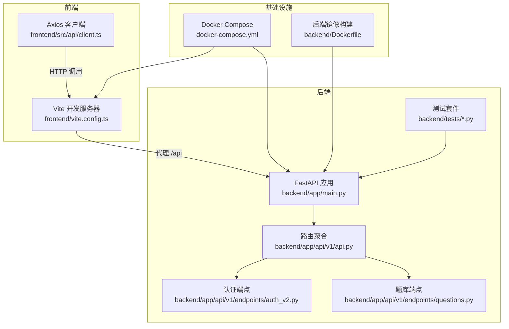
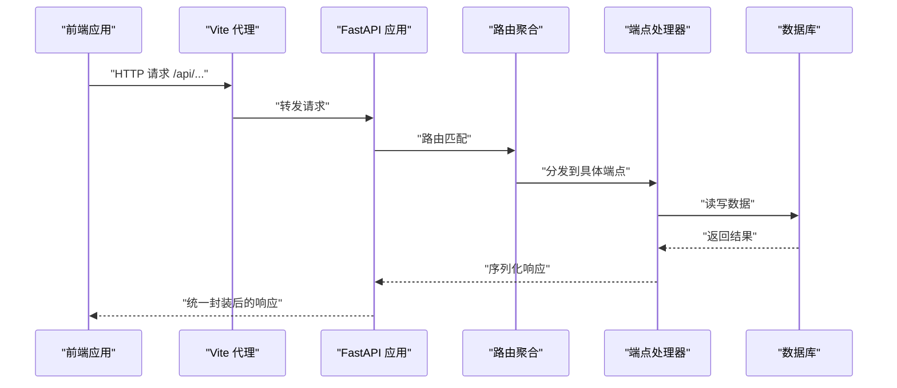
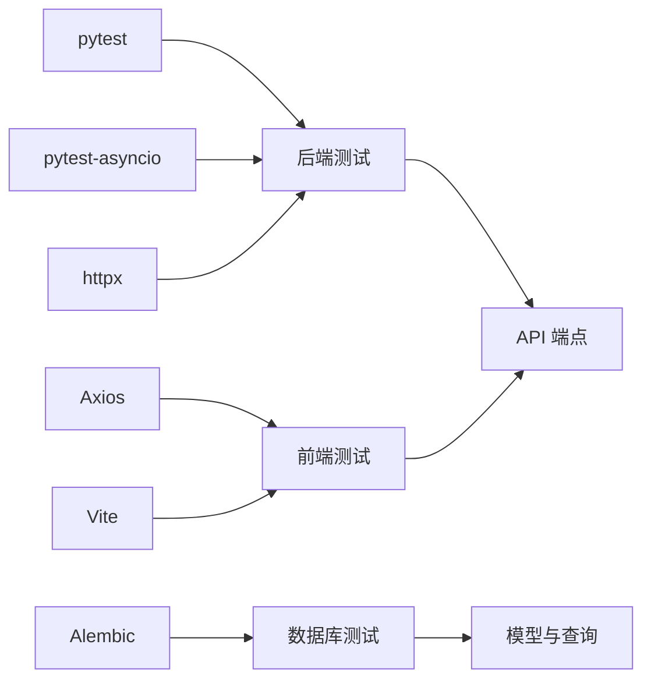

# 测试策略

<cite>
**本文引用的文件**
- [backend/app/main.py](file://backend/app/main.py)
- [backend/app/api/v1/api.py](file://backend/app/api/v1/api.py)
- [backend/app/api/v1/endpoints/auth_v2.py](file://backend/app/api/v1/endpoints/auth_v2.py)
- [backend/app/api/v1/endpoints/questions.py](file://backend/app/api/v1/endpoints/questions.py)
- [backend/requirements.txt](file://backend/requirements.txt)
- [backend/tests/smoke_test.py](file://backend/tests/smoke_test.py)
- [backend/tests/test_llm.py](file://backend/tests/test_llm.py)
- [docker-compose.yml](file://docker-compose.yml)
- [frontend/vite.config.ts](file://frontend/vite.config.ts)
- [frontend/src/api/client.ts](file://frontend/src/api/client.ts)
- [backend/Dockerfile](file://backend/Dockerfile)
</cite>

## 目录
1. [引言](#引言)
2. [项目结构](#项目结构)
3. [核心组件](#核心组件)
4. [架构总览](#架构总览)
5. [详细组件分析](#详细组件分析)
6. [依赖分析](#依赖分析)
7. [性能考虑](#性能考虑)
8. [故障排查指南](#故障排查指南)
9. [结论](#结论)
10. [附录](#附录)

## 引言
本测试策略文档面向“瑞珹教育管理系统”，旨在建立覆盖单元测试、集成测试、端到端测试与性能测试的完整测试体系。文档明确测试框架选择（后端 pytest、前端 Vite/React 开发环境）、测试用例设计原则、测试数据管理与隔离策略，并给出 API 测试、前端组件测试与数据库测试的实施方案。同时，文档涵盖测试自动化流程、持续集成配置建议、测试覆盖率目标以及调试技巧与测试环境管理。

## 项目结构
系统采用前后端分离架构：后端基于 FastAPI 提供 REST API；前端基于 React/Vite 构建，通过代理访问后端接口；数据库使用 SQLite（开发）并通过 Alembic 管理迁移。测试相关的关键位置如下：
- 后端测试位于 backend/tests，包含冒烟测试与 LLM 配置连通性测试示例
- 前端通过 Vite 开发服务器运行，代理将 /api 请求转发至后端
- docker-compose 提供一键启动后端与前端服务，便于本地与 CI 环境复现

图表来源
- [backend/app/main.py:1-52](file://backend/app/main.py#L1-L52)
- [backend/app/api/v1/api.py:1-26](file://backend/app/api/v1/api.py#L1-L26)
- [backend/app/api/v1/endpoints/auth_v2.py:1-200](file://backend/app/api/v1/endpoints/auth_v2.py#L1-L200)
- [backend/app/api/v1/endpoints/questions.py:1-200](file://backend/app/api/v1/endpoints/questions.py#L1-L200)
- [frontend/vite.config.ts:1-17](file://frontend/vite.config.ts#L1-L17)
- [frontend/src/api/client.ts:1-55](file://frontend/src/api/client.ts#L1-L55)
- [docker-compose.yml:1-33](file://docker-compose.yml#L1-L33)
- [backend/Dockerfile:1-11](file://backend/Dockerfile#L1-L11)

章节来源
- [backend/app/main.py:1-52](file://backend/app/main.py#L1-L52)
- [backend/app/api/v1/api.py:1-26](file://backend/app/api/v1/api.py#L1-L26)
- [frontend/vite.config.ts:1-17](file://frontend/vite.config.ts#L1-L17)
- [docker-compose.yml:1-33](file://docker-compose.yml#L1-L33)

## 核心组件
- 后端应用入口与中间件：统一响应包装、CORS、路由挂载与启动时参考数据播种
- API 路由聚合：集中注册各模块端点（认证、题库、阅卷、错题本等）
- 认证模块：支持图形验证码、短信验证码、多角色登录与令牌刷新
- 题库模块：题目的增删改查、批量导入、导出与搜索
- 测试套件：冒烟测试覆盖核心路径，LLM 配置连通性测试演示后端测试客户端用法
- 前端 Axios 客户端：自动注入 Authorization 头、统一封装响应数据、401 刷新令牌

章节来源
- [backend/app/main.py:1-52](file://backend/app/main.py#L1-L52)
- [backend/app/api/v1/api.py:1-26](file://backend/app/api/v1/api.py#L1-L26)
- [backend/app/api/v1/endpoints/auth_v2.py:1-200](file://backend/app/api/v1/endpoints/auth_v2.py#L1-L200)
- [backend/app/api/v1/endpoints/questions.py:1-200](file://backend/app/api/v1/endpoints/questions.py#L1-L200)
- [backend/tests/smoke_test.py:1-172](file://backend/tests/smoke_test.py#L1-L172)
- [backend/tests/test_llm.py:1-23](file://backend/tests/test_llm.py#L1-L23)
- [frontend/src/api/client.ts:1-55](file://frontend/src/api/client.ts#L1-L55)

## 架构总览
下图展示测试视角下的系统交互：前端通过代理访问后端 API，后端经路由分发到具体端点，端点调用业务逻辑与数据库层，测试通过 TestClient 或浏览器驱动进行验证。

图表来源
- [frontend/vite.config.ts:1-17](file://frontend/vite.config.ts#L1-L17)
- [backend/app/main.py:1-52](file://backend/app/main.py#L1-L52)
- [backend/app/api/v1/api.py:1-26](file://backend/app/api/v1/api.py#L1-L26)
- [backend/app/api/v1/endpoints/auth_v2.py:1-200](file://backend/app/api/v1/endpoints/auth_v2.py#L1-L200)
- [backend/app/api/v1/endpoints/questions.py:1-200](file://backend/app/api/v1/endpoints/questions.py#L1-L200)

## 详细组件分析

### 单元测试策略
- 目标：验证核心业务逻辑与服务层行为，确保在隔离环境下快速反馈
- 实施要点：
  - 使用后端测试框架 pytest 与 httpx/TestClient 进行端点级测试
  - 对认证、题库、阅卷等模块编写独立测试文件，按功能拆分
  - 使用数据库会话模拟与事务回滚，避免污染测试数据
  - 对外部依赖（如 OCR、LLM）使用假实现或内存缓存，保证可重复性
- 示例参考：
  - 冒烟测试覆盖登录、题库、试卷、答题、错题本、题库管理与知识树等关键路径
  - LLM 配置连通性测试演示如何通过 TestClient 获取验证码、登录并调用配置端点

章节来源
- [backend/tests/smoke_test.py:1-172](file://backend/tests/smoke_test.py#L1-L172)
- [backend/tests/test_llm.py:1-23](file://backend/tests/test_llm.py#L1-L23)
- [backend/requirements.txt:24-27](file://backend/requirements.txt#L24-L27)

### 集成测试策略
- 目标：验证模块间协作、数据库迁移与中间件行为
- 实施要点：
  - 使用 docker-compose 在隔离容器中启动后端与前端，确保网络与端口一致
  - 以 Alembic 版本迁移为基准，确保测试前数据库处于预期状态
  - 验证 CORS、统一响应包装、JWT 中间件与路由聚合是否正常工作
- 关键验证点：
  - 健康检查端点可达
  - 跨域请求与响应封装符合预期
  - 路由聚合正确加载所有端点

章节来源
- [docker-compose.yml:1-33](file://docker-compose.yml#L1-L33)
- [backend/app/main.py:1-52](file://backend/app/main.py#L1-L52)
- [backend/app/api/v1/api.py:1-26](file://backend/app/api/v1/api.py#L1-L26)

### 端到端测试策略
- 目标：模拟真实用户场景，从登录到生成错题本的完整流程
- 实施要点：
  - 前端通过 Vite 代理访问后端，Axios 客户端自动处理鉴权与响应解包
  - 使用浏览器驱动（如 Playwright/Cypress）或后端 TestClient 组合方式
  - 场景包括：图形验证码获取与校验、短信验证码校验、多角色登录、题库增删改查、组卷与自动阅卷、错题本自动生成、题库管理与知识树维护
- 数据与环境：
  - 使用独立测试数据库或临时文件，避免与开发数据冲突
  - 通过环境变量控制数据库类型与路径，便于 CI 中切换

章节来源
- [frontend/vite.config.ts:1-17](file://frontend/vite.config.ts#L1-L17)
- [frontend/src/api/client.ts:1-55](file://frontend/src/api/client.ts#L1-L55)
- [backend/app/api/v1/endpoints/auth_v2.py:1-200](file://backend/app/api/v1/endpoints/auth_v2.py#L1-L200)
- [backend/app/api/v1/endpoints/questions.py:1-200](file://backend/app/api/v1/endpoints/questions.py#L1-L200)
- [backend/tests/smoke_test.py:1-172](file://backend/tests/smoke_test.py#L1-L172)

### 性能测试策略
- 目标：评估系统在高并发下的吞吐与延迟表现
- 实施要点：
  - 使用 Locust/JMeter 等工具对热点端点（如登录、题库查询、批量导入）进行压力测试
  - 关注数据库连接池、异步 I/O 与中间件开销
  - 结合容器监控（CPU/内存/IO）定位瓶颈
- 关注指标：
  - P50/P95/P99 延迟
  - 错误率与超时率
  - 并发用户数与吞吐量

（本节为通用指导，不直接分析具体文件）

### API 测试实施方案
- 测试框架：pytest + httpx.TestClient
- 覆盖范围：
  - 认证：图形验证码、短信验证码、多角色登录、令牌刷新
  - 题库：创建、查询、批量导入、导出、搜索
  - 试卷：创建、关联题目、发布、提交答案、自动阅卷
  - 错题本：自动生成与查询
  - 题库管理：抽取知识点、LLM 生成、爬取、审批、去重
  - 知识树：节点创建、编辑、分支激活、版本管理
- 数据管理：
  - 使用独立测试数据库或内存数据库（SQLite）
  - 在测试前执行迁移，测试后清理或回滚
- 安全与鉴权：
  - 验证 JWT 有效性与过期处理
  - 检查权限控制（角色限制、资源归属）

章节来源
- [backend/tests/smoke_test.py:1-172](file://backend/tests/smoke_test.py#L1-L172)
- [backend/tests/test_llm.py:1-23](file://backend/tests/test_llm.py#L1-L23)
- [backend/app/api/v1/endpoints/auth_v2.py:1-200](file://backend/app/api/v1/endpoints/auth_v2.py#L1-L200)
- [backend/app/api/v1/endpoints/questions.py:1-200](file://backend/app/api/v1/endpoints/questions.py#L1-L200)

### 前端组件测试实施方案
- 测试框架：Vite + React 开发环境，结合浏览器驱动或测试库（如 React Testing Library）
- 覆盖范围：
  - 登录页与表单校验
  - 通知组件与布局组件
  - 页面级流程（如组卷、错题本、题库管理）
- 数据流：
  - Axios 客户端自动注入 Authorization 头
  - 统一响应解包与 401 自动刷新令牌
- 代理与跨域：
  - Vite 代理将 /api 请求转发至后端，确保测试环境与生产一致

章节来源
- [frontend/vite.config.ts:1-17](file://frontend/vite.config.ts#L1-L17)
- [frontend/src/api/client.ts:1-55](file://frontend/src/api/client.ts#L1-L55)

### 数据库测试实施方案
- 目标：验证模型、迁移与查询逻辑
- 实施要点：
  - 使用 Alembic 执行迁移，确保测试数据库结构与线上一致
  - 在测试中插入最小化样本数据，验证查询过滤、排序与分页
  - 对复杂查询（如题库搜索、知识树树形结构）编写针对性测试
- 隔离与清理：
  - 每个测试用例使用独立事务并在结束后回滚
  - 使用临时数据库文件或容器内卷积，避免持久污染

章节来源
- [backend/requirements.txt:7](file://backend/requirements.txt#L7)
- [backend/app/api/v1/endpoints/questions.py:1-200](file://backend/app/api/v1/endpoints/questions.py#L1-L200)

### 测试自动化与持续集成
- 自动化流程建议：
  - 后端：pytest + pytest-asyncio，结合覆盖率工具（如 coverage.py）统计覆盖率
  - 前端：Vite 开发服务器 + 浏览器驱动测试，或 React Testing Library 单元测试
  - 数据库：Alembic 迁移前置，测试后回滚或重建
- CI 配置建议：
  - 使用 docker-compose 启动后端与前端服务，确保网络与端口一致
  - 在 CI 中设置独立数据库文件与环境变量，避免冲突
  - 将测试报告与覆盖率上传至 CI 平台

章节来源
- [backend/requirements.txt:24-27](file://backend/requirements.txt#L24-L27)
- [docker-compose.yml:1-33](file://docker-compose.yml#L1-L33)
- [backend/Dockerfile:1-11](file://backend/Dockerfile#L1-L11)

### 测试覆盖率要求
- 建议目标：
  - 行覆盖率：≥ 80%
  - 分支覆盖率：≥ 70%
  - 指令覆盖率：≥ 85%
- 覆盖范围：
  - 后端：核心业务逻辑与服务层
  - 前端：页面与关键 Hook/Store
  - 数据库：模型与查询逻辑

（本节为通用指导，不直接分析具体文件）

### 测试最佳实践
- 用例设计：
  - 每个功能点至少覆盖正向、边界与异常场景
  - 使用参数化测试提高用例密度
- 数据管理：
  - 使用工厂模式或固定样例数据，确保可重复性
  - 对外部依赖进行模拟或替身对象
- 环境管理：
  - 本地与 CI 使用一致的 docker-compose 配置
  - 通过环境变量控制数据库类型与路径

（本节为通用指导，不直接分析具体文件）

### 调试技巧
- 后端：
  - 使用 TestClient 快速验证端点行为
  - 在启动事件中打印日志，确认参考数据播种与中间件加载
- 前端：
  - 通过浏览器开发者工具查看代理转发与响应解包
  - 检查 Axios 拦截器是否正确注入 Authorization 头
- 数据库：
  - 在测试前执行迁移，确保结构一致
  - 使用最小样例数据定位问题

章节来源
- [backend/app/main.py:33-43](file://backend/app/main.py#L33-L43)
- [frontend/src/api/client.ts:9-52](file://frontend/src/api/client.ts#L9-L52)

## 依赖分析
- 后端依赖：
  - FastAPI、SQLAlchemy、Alembic、Pydantic、pytest、httpx 等
  - 用于构建 API、ORM、迁移与测试
- 前端依赖：
  - React、Ant Design、Axios、Vite 等
  - 用于构建界面、HTTP 客户端与开发代理
- 测试依赖：
  - pytest、pytest-asyncio、httpx 用于后端测试
  - Vite 与浏览器驱动用于前端端到端测试

图表来源
- [backend/requirements.txt:24-27](file://backend/requirements.txt#L24-L27)
- [frontend/vite.config.ts:1-17](file://frontend/vite.config.ts#L1-L17)
- [frontend/src/api/client.ts:1-55](file://frontend/src/api/client.ts#L1-L55)

章节来源
- [backend/requirements.txt:1-27](file://backend/requirements.txt#L1-L27)

## 性能考虑
- I/O 密集优化：
  - 使用异步 SQLAlchemy 与连接池，减少阻塞
  - 对高频查询添加索引与缓存（如 Redis）
- 网络与代理：
  - Vite 代理减少跨域问题，提升本地联调效率
- 数据库：
  - 在测试中使用 SQLite 或内存数据库，降低 I/O 开销
  - 控制批量操作的大小（如批量导入上限）

（本节为通用指导，不直接分析具体文件）

## 故障排查指南
- 常见问题与定位：
  - 401 未授权：检查前端 Axios 是否正确注入 Authorization 头，后端 JWT 解析与过期时间
  - CORS 失败：确认后端 CORS 中间件配置与允许的源
  - 响应未解包：确认后端统一响应包装与前端拦截器处理逻辑
  - 数据库迁移失败：检查 Alembic 版本与数据库路径，确保测试前执行迁移
- 日志与健康检查：
  - 后端启动事件中记录参考数据播种日志
  - 使用健康检查端点确认服务可用性

章节来源
- [frontend/src/api/client.ts:17-52](file://frontend/src/api/client.ts#L17-L52)
- [backend/app/main.py:20-27](file://backend/app/main.py#L20-L27)
- [backend/app/main.py:50-52](file://backend/app/main.py#L50-L52)

## 结论
通过后端 pytest 与前端 Vite/React 的组合，配合 docker-compose 的一键部署能力，本项目可以构建完善的测试体系。建议以冒烟测试为基础，逐步扩展到单元、集成与端到端测试，并在 CI 中引入覆盖率与性能测试，持续保障系统质量与稳定性。

## 附录
- 测试环境搭建步骤（建议）：
  - 后端：安装依赖、执行 Alembic 迁移、启动 uvicorn
  - 前端：安装依赖、启动 Vite 开发服务器、配置代理
  - 全栈：使用 docker-compose 同时启动后端与前端服务
- 测试数据隔离建议：
  - 使用独立数据库文件或容器卷
  - 在测试前执行迁移，测试后回滚或重建

（本节为通用指导，不直接分析具体文件）