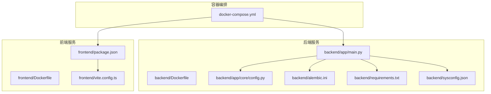
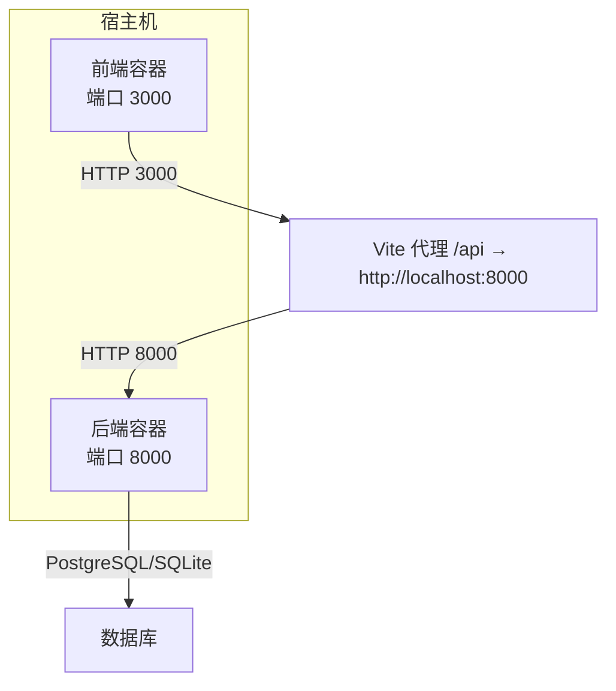
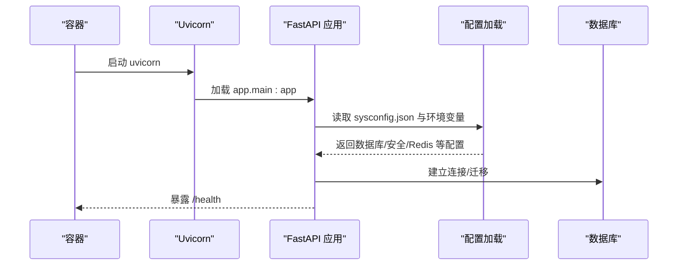
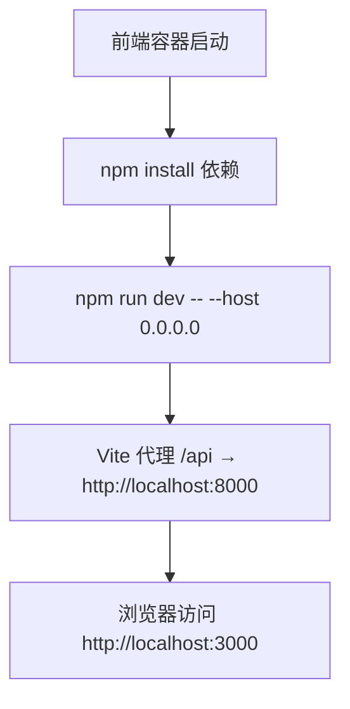
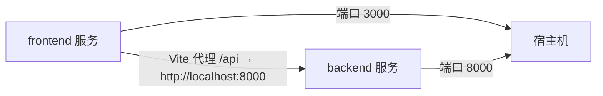
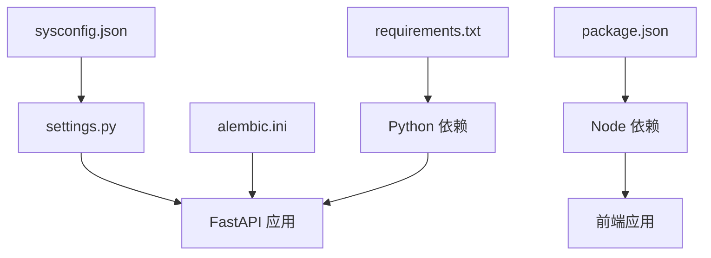

# 容器化配置

<cite>
**本文引用的文件**
- [docker-compose.yml](file://docker-compose.yml)
- [backend/Dockerfile](file://backend/Dockerfile)
- [frontend/Dockerfile](file://frontend/Dockerfile)
- [backend/requirements.txt](file://backend/requirements.txt)
- [backend/app/core/config.py](file://backend/app/core/config.py)
- [backend/sysconfig.json](file://backend/sysconfig.json)
- [backend/alembic.ini](file://backend/alembic.ini)
- [backend/app/main.py](file://backend/app/main.py)
- [frontend/package.json](file://frontend/package.json)
- [frontend/vite.config.ts](file://frontend/vite.config.ts)
- [start.sh](file://start.sh)
</cite>

## 目录
1. [简介](#简介)
2. [项目结构](#项目结构)
3. [核心组件](#核心组件)
4. [架构总览](#架构总览)
5. [详细组件分析](#详细组件分析)
6. [依赖关系分析](#依赖关系分析)
7. [性能与资源考虑](#性能与资源考虑)
8. [故障排除指南](#故障排除指南)
9. [结论](#结论)
10. [附录](#附录)

## 简介
本文件面向瑞珹教育管理系统（后端基于 FastAPI，前端基于 React/Vite）的容器化部署，系统性说明 Docker Compose 编排结构、服务配置参数、容器间网络通信、数据卷挂载、环境变量传递与健康检查策略，并对前后端 Dockerfile 构建流程、镜像优化与多阶段构建给出建议。同时提供容器编排最佳实践、资源限制与监控建议、部署步骤、故障排除与安全加固要点。

## 项目结构
当前仓库包含后端、前端、容器编排与一键启动脚本：
- 后端：FastAPI 应用，使用异步 SQLAlchemy、Redis/Celery、Alembic 迁移等
- 前端：React + Vite 开发环境，通过代理访问后端 API
- 容器编排：docker-compose.yml 定义后端与前端两个服务
- 一键启动：start.sh 负责本地开发环境准备、数据库迁移与服务启动

图表来源
- [docker-compose.yml:1-33](file://docker-compose.yml#L1-L33)
- [backend/Dockerfile:1-11](file://backend/Dockerfile#L1-L11)
- [frontend/Dockerfile:1-11](file://frontend/Dockerfile#L1-L11)
- [backend/app/main.py:1-52](file://backend/app/main.py#L1-L52)
- [backend/app/core/config.py:1-98](file://backend/app/core/config.py#L1-L98)
- [backend/alembic.ini:1-150](file://backend/alembic.ini#L1-L150)
- [backend/requirements.txt:1-27](file://backend/requirements.txt#L1-L27)
- [backend/sysconfig.json:1-48](file://backend/sysconfig.json#L1-L48)
- [frontend/package.json:1-38](file://frontend/package.json#L1-L38)
- [frontend/vite.config.ts:1-17](file://frontend/vite.config.ts#L1-L17)

章节来源
- [docker-compose.yml:1-33](file://docker-compose.yml#L1-L33)
- [backend/Dockerfile:1-11](file://backend/Dockerfile#L1-L11)
- [frontend/Dockerfile:1-11](file://frontend/Dockerfile#L1-L11)
- [backend/app/main.py:1-52](file://backend/app/main.py#L1-L52)
- [frontend/vite.config.ts:1-17](file://frontend/vite.config.ts#L1-L17)

## 核心组件
- 后端服务（backend）
  - 基于 Python 3.12 slim 镜像，安装 requirements.txt，复制源码，使用 Uvicorn 启动
  - 端口映射：8000
  - 数据卷：挂载后端目录与 SQLite 数据库文件
  - 环境变量：数据库类型、SQLite 路径、密钥与 JWT 参数
  - 命令：uvicorn 启动 FastAPI 应用，支持热重载
- 前端服务（frontend）
  - 基于 Node 22 Alpine 镜像，安装 package.json，复制源码，使用 npm run dev 启动
  - 端口映射：3000
  - 数据卷：挂载前端 src 目录
  - 命令：npm run dev -- --host 0.0.0.0
  - 依赖：React、Ant Design、Axios、Vite 等
- 一键启动脚本（start.sh）
  - 创建/读取 sysconfig.json，检查并安装依赖，迁移数据库，启动后端与前端，健康检查

章节来源
- [docker-compose.yml:3-32](file://docker-compose.yml#L3-L32)
- [backend/Dockerfile:1-11](file://backend/Dockerfile#L1-L11)
- [frontend/Dockerfile:1-11](file://frontend/Dockerfile#L1-L11)
- [backend/requirements.txt:1-27](file://backend/requirements.txt#L1-L27)
- [frontend/package.json:1-38](file://frontend/package.json#L1-L38)
- [start.sh:1-359](file://start.sh#L1-L359)

## 架构总览
容器编排采用单机多服务模式，后端与前端通过本地回环地址通信；后端负责 API 提供与数据库交互，前端通过 Vite 代理转发到后端 API。

图表来源
- [docker-compose.yml:8-31](file://docker-compose.yml#L8-L31)
- [frontend/vite.config.ts:8-13](file://frontend/vite.config.ts#L8-L13)
- [backend/app/main.py:50-52](file://backend/app/main.py#L50-L52)

## 详细组件分析

### 后端服务（backend）
- 镜像与构建
  - 基础镜像：python:3.12-slim
  - 工作目录：/app
  - 依赖安装：pip 安装 requirements.txt
  - 复制源码：COPY . .
  - 入口命令：uvicorn app.main:app --host 0.0.0.0 --port 8000
- 环境变量与配置
  - 通过 settings 读取 sysconfig.json 并支持环境变量覆盖
  - 支持 PostgreSQL/AsyncPG 连接字符串生成
  - 支持 Redis/Celery、上传目录、OCR、模型缓存等配置项
- 数据库与迁移
  - alembic.ini 默认使用 SQLite 路径 edu_system.db
  - sysconfig.json 默认指向 localhost:5432/postgres
  - 启动时会进行 Alembic 迁移或直接建表
- 健康检查
  - 提供 /health 接口返回健康状态

图表来源
- [backend/Dockerfile:1-11](file://backend/Dockerfile#L1-L11)
- [backend/app/main.py:33-52](file://backend/app/main.py#L33-L52)
- [backend/app/core/config.py:36-98](file://backend/app/core/config.py#L36-L98)
- [backend/alembic.ini:89-90](file://backend/alembic.ini#L89-L90)
- [backend/sysconfig.json:1-48](file://backend/sysconfig.json#L1-L48)

章节来源
- [backend/Dockerfile:1-11](file://backend/Dockerfile#L1-L11)
- [backend/app/core/config.py:1-98](file://backend/app/core/config.py#L1-L98)
- [backend/alembic.ini:89-90](file://backend/alembic.ini#L89-L90)
- [backend/sysconfig.json:1-48](file://backend/sysconfig.json#L1-L48)
- [backend/app/main.py:50-52](file://backend/app/main.py#L50-L52)

### 前端服务（frontend）
- 镜像与构建
  - 基础镜像：node:22-alpine
  - 工作目录：/app
  - 依赖安装：npm install
  - 复制源码：COPY . .
  - 入口命令：npm run dev -- --host 0.0.0.0
- 开发代理
  - Vite 代理将 /api 请求转发至 http://localhost:8000
  - 便于在容器内联调后端接口
- 依赖与脚本
  - 依赖：React、Ant Design、Axios、React Router、Zustand 等
  - 脚本：dev/build/lint/preview

图表来源
- [frontend/Dockerfile:1-11](file://frontend/Dockerfile#L1-L11)
- [frontend/vite.config.ts:8-13](file://frontend/vite.config.ts#L8-L13)
- [frontend/package.json:6-11](file://frontend/package.json#L6-L11)

章节来源
- [frontend/Dockerfile:1-11](file://frontend/Dockerfile#L1-L11)
- [frontend/vite.config.ts:1-17](file://frontend/vite.config.ts#L1-L17)
- [frontend/package.json:1-38](file://frontend/package.json#L1-L38)

### 容器编排与网络通信
- 服务定义
  - backend：构建上下文 ./backend，端口 8000，数据卷挂载后端目录与 SQLite 文件，环境变量设置数据库类型与密钥
  - frontend：构建上下文 ./frontend，端口 3000，数据卷挂载前端 src，依赖 backend
- 网络通信
  - 前端通过 Vite 代理访问后端 API（localhost:8000），容器内网络默认互通
- 健康检查
  - 后端提供 /health 接口，可在生产环境中结合 Compose healthcheck 字段启用

图表来源
- [docker-compose.yml:3-32](file://docker-compose.yml#L3-L32)
- [frontend/vite.config.ts:8-13](file://frontend/vite.config.ts#L8-L13)

章节来源
- [docker-compose.yml:1-33](file://docker-compose.yml#L1-L33)

### 数据卷挂载与持久化
- 后端
  - 挂载后端源码目录以便热更新
  - 挂载 SQLite 数据库文件 edu_system.db 实现持久化
- 前端
  - 挂载 src 目录以支持开发时热更新
- 建议
  - 生产环境建议将 SQLite 改为外部 PostgreSQL，并使用命名卷管理数据库数据

章节来源
- [docker-compose.yml:10-12](file://docker-compose.yml#L10-L12)
- [backend/alembic.ini:89-90](file://backend/alembic.ini#L89-L90)

### 环境变量传递
- 后端
  - DATABASE_TYPE、SQLITE_DB_PATH、SECRET_KEY、ALGORITHM、ACCESS_TOKEN_EXPIRE_MINUTES、REFRESH_TOKEN_EXPIRE_DAYS
  - settings 支持从 sysconfig.json 与环境变量覆盖数据库凭据
- 前端
  - 通过 Vite 代理与后端交互，无需额外前端环境变量
- 建议
  - 生产环境使用 .env 或 Compose secrets 管理敏感变量

章节来源
- [docker-compose.yml:13-20](file://docker-compose.yml#L13-L20)
- [backend/app/core/config.py:6-30](file://backend/app/core/config.py#L6-L30)

### 健康检查配置
- 后端提供 /health 接口，可用于 Compose healthcheck 字段
- 建议
  - 在生产环境中添加 healthcheck 字段，设置超时、重试与间隔

章节来源
- [backend/app/main.py:50-52](file://backend/app/main.py#L50-L52)

## 依赖关系分析
- 后端依赖
  - FastAPI、Uvicorn、SQLAlchemy、asyncpg、Alembic、Pydantic、Redis、Celery、python-dotenv、OCR/PDF 导出等
- 前端依赖
  - React、Ant Design、Axios、React Router、Vite、TypeScript 等
- 配置依赖
  - sysconfig.json 与 settings 之间的配置加载链路
  - alembic.ini 与数据库 URL 生成

图表来源
- [backend/requirements.txt:1-27](file://backend/requirements.txt#L1-L27)
- [frontend/package.json:12-36](file://frontend/package.json#L12-L36)
- [backend/sysconfig.json:1-48](file://backend/sysconfig.json#L1-L48)
- [backend/app/core/config.py:36-98](file://backend/app/core/config.py#L36-L98)
- [backend/alembic.ini:89-90](file://backend/alembic.ini#L89-L90)

章节来源
- [backend/requirements.txt:1-27](file://backend/requirements.txt#L1-L27)
- [frontend/package.json:1-38](file://frontend/package.json#L1-L38)
- [backend/app/core/config.py:1-98](file://backend/app/core/config.py#L1-L98)

## 性能与资源考虑
- 镜像优化
  - 使用 slim 基础镜像减少体积
  - 复制 requirements.txt 后一次性安装依赖，避免缓存污染
  - 前端使用 Alpine 基础镜像，减少体积
- 多阶段构建建议
  - 后端：构建阶段安装依赖与编译，运行阶段仅复制最小产物
  - 前端：构建阶段生成静态产物，运行阶段使用轻量 Nginx 提供静态文件
- 资源限制
  - 在 Compose 中为后端设置 CPU/内存限制，避免前端开发时占用过多资源
- 监控
  - 后端暴露 /health，结合外部探针实现健康检查
  - 前端通过浏览器开发者工具与网络面板观察代理与请求

[本节为通用指导，不涉及具体文件分析]

## 故障排除指南
- 端口冲突
  - 启动前清理 8000/3000 端口残留进程
- 数据库连接
  - 确认 PostgreSQL 已启动且可连通
  - 检查 sysconfig.json 中数据库配置与环境变量覆盖
- 迁移失败
  - 若 Alembic 迁移失败，脚本会尝试直接建表；生产环境建议手动处理迁移
- 前端无法访问
  - 确认后端已就绪并通过 /health 健康检查
  - 检查 Vite 代理配置是否正确指向后端地址
- 容器健康检查
  - 在生产环境中为后端添加 healthcheck 字段，确保自动重启与可观测性

章节来源
- [start.sh:159-196](file://start.sh#L159-L196)
- [start.sh:198-217](file://start.sh#L198-L217)
- [start.sh:288-303](file://start.sh#L288-L303)
- [frontend/vite.config.ts:8-13](file://frontend/vite.config.ts#L8-L13)
- [backend/app/main.py:50-52](file://backend/app/main.py#L50-L52)

## 结论
当前容器化配置适合本地开发与快速验证，具备良好的模块化与可扩展性。建议在生产环境中引入外部 PostgreSQL、命名卷、健康检查、资源限制与安全加固措施，并采用多阶段构建优化镜像体积与安全性。

[本节为总结性内容，不涉及具体文件分析]

## 附录

### 部署步骤指南
- 准备
  - 确保 Docker 与 Docker Compose 已安装
  - 准备外部 PostgreSQL（可选），或保留 SQLite（开发）
- 启动
  - 使用 docker-compose up -d 启动后端与前端
  - 访问 http://localhost:3000 查看前端，http://localhost:8000/docs 查看 API 文档
- 停止
  - 使用 docker-compose down 停止并移除容器

章节来源
- [docker-compose.yml:1-33](file://docker-compose.yml#L1-L33)

### 容器安全配置建议
- 环境变量与密钥
  - 使用 .env 或 Compose secrets 管理敏感变量
  - 不要在镜像中硬编码密钥
- 权限与用户
  - 为容器指定非 root 用户运行
- 网络隔离
  - 将后端与前端置于独立网络，限制不必要的端口暴露
- 健康检查与日志
  - 添加 healthcheck，开启应用日志输出，便于审计与排障

[本节为通用指导，不涉及具体文件分析]