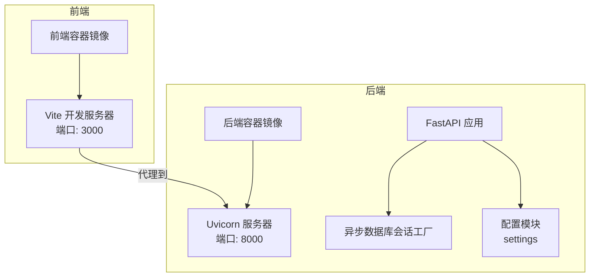
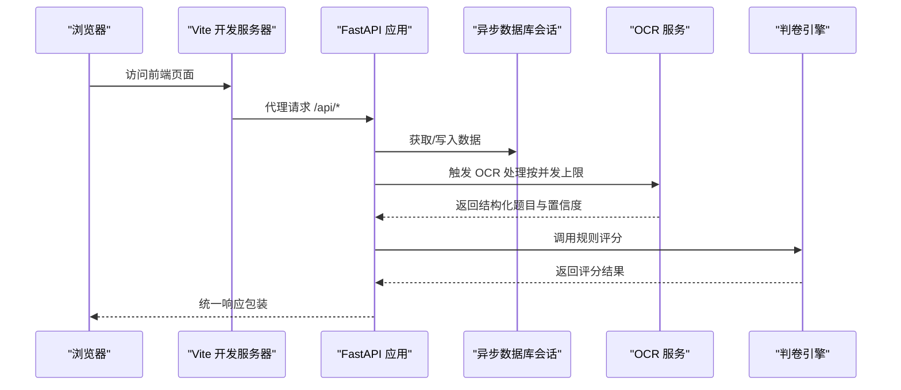
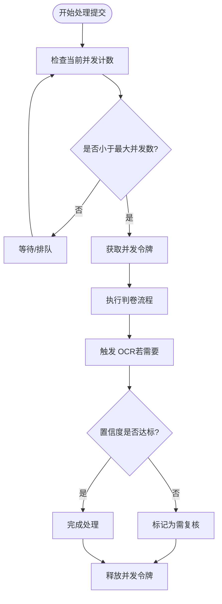
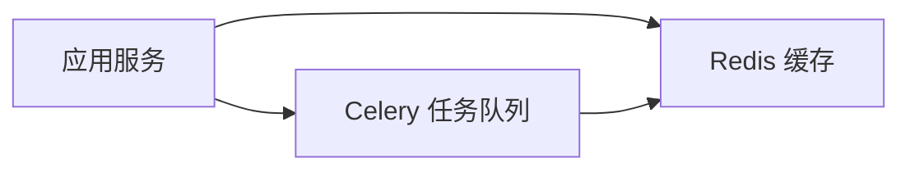
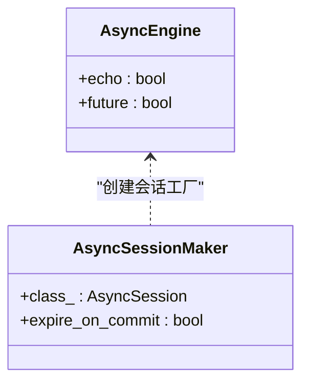
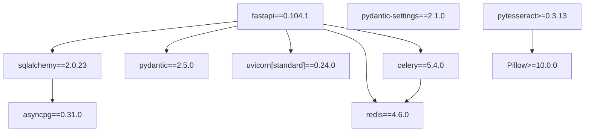

# 性能配置优化

<cite>
**本文引用的文件**
- [backend/app/core/config.py](file://backend/app/core/config.py)
- [backend/sysconfig.json](file://backend/sysconfig.json)
- [backend/app/db/session.py](file://backend/app/db/session.py)
- [backend/app/main.py](file://backend/app/main.py)
- [backend/requirements.txt](file://backend/requirements.txt)
- [backend/Dockerfile](file://backend/Dockerfile)
- [frontend/vite.config.ts](file://frontend/vite.config.ts)
- [frontend/Dockerfile](file://frontend/Dockerfile)
- [frontend/package.json](file://frontend/package.json)
- [backend/app/api/v1/endpoints/answers.py](file://backend/app/api/v1/endpoints/answers.py)
- [backend/app/models/grading_record.py](file://backend/app/models/grading_record.py)
- [backend/app/services/judge_engine.py](file://backend/app/services/judge_engine.py)
- [backend/app/services/ocr_service.py](file://backend/app/services/ocr_service.py)
- [frontend/src/pages/admin/AdminConfigPage.tsx](file://frontend/src/pages/admin/AdminConfigPage.tsx)
</cite>

## 目录
1. [简介](#简介)
2. [项目结构](#项目结构)
3. [核心组件](#核心组件)
4. [架构总览](#架构总览)
5. [详细组件分析](#详细组件分析)
6. [依赖分析](#依赖分析)
7. [性能考虑](#性能考虑)
8. [故障排查指南](#故障排查指南)
9. [结论](#结论)
10. [附录](#附录)

## 简介
本文件面向瑞珹教育管理系统，聚焦后端与前端的性能配置与优化策略，覆盖并发处理（判卷并发数、OCR 并发数）、缓存与数据库连接池、内存使用优化、前端构建性能优化（代码分割、懒加载、压缩）、性能监控与基准测试、调优策略、不同负载场景配置建议、瓶颈识别方法、系统扩容与 A/B 测试及回归检测机制。

## 项目结构
系统采用前后端分离架构：
- 后端基于 FastAPI + SQLAlchemy Async + Uvicorn，使用异步数据库会话与中间件统一响应包装。
- 前端基于 Vite + React，开发时通过代理转发到后端服务。
- 配置来源包含环境变量与非敏感系统配置文件，数据库连接字符串由配置模块动态生成。

图表来源
- [backend/app/main.py:11-31](file://backend/app/main.py#L11-L31)
- [backend/app/db/session.py:5-15](file://backend/app/db/session.py#L5-L15)
- [backend/app/core/config.py:36-97](file://backend/app/core/config.py#L36-L97)
- [frontend/vite.config.ts:6-14](file://frontend/vite.config.ts#L6-L14)
- [backend/Dockerfile:10](file://backend/Dockerfile#L10)
- [frontend/Dockerfile:10](file://frontend/Dockerfile#L10)

章节来源
- [backend/app/main.py:1-52](file://backend/app/main.py#L1-L52)
- [frontend/vite.config.ts:1-17](file://frontend/vite.config.ts#L1-L17)
- [backend/Dockerfile:1-11](file://backend/Dockerfile#L1-L11)
- [frontend/Dockerfile:1-11](file://frontend/Dockerfile#L1-L11)

## 核心组件
- 配置中心：集中管理数据库、Redis、Celery、OCR、模型缓存目录、上传目录与大小限制等参数，并支持环境变量覆盖。
- 数据库层：异步引擎与会话工厂，统一事务与回滚逻辑。
- 业务服务：判卷引擎（规则评分）、OCR 服务（Tesseract 集成）。
- 前端构建：Vite 默认配置，开发代理与缓存目录设置。

章节来源
- [backend/app/core/config.py:36-97](file://backend/app/core/config.py#L36-L97)
- [backend/app/db/session.py:1-26](file://backend/app/db/session.py#L1-L26)
- [backend/app/services/judge_engine.py:1-130](file://backend/app/services/judge_engine.py#L1-L130)
- [backend/app/services/ocr_service.py:1-126](file://backend/app/services/ocr_service.py#L1-L126)
- [frontend/vite.config.ts:1-17](file://frontend/vite.config.ts#L1-L17)

## 架构总览
系统运行时交互流程如下：

图表来源
- [backend/app/main.py:11-31](file://backend/app/main.py#L11-L31)
- [backend/app/db/session.py:18-26](file://backend/app/db/session.py#L18-L26)
- [backend/app/services/ocr_service.py:61-126](file://backend/app/services/ocr_service.py#L61-L126)
- [backend/app/services/judge_engine.py:126-130](file://backend/app/services/judge_engine.py#L126-L130)

## 详细组件分析

### 并发处理配置（判卷并发数、OCR 并发数）
- 判卷并发数：系统配置中定义了判卷最大并发数，用于控制同时处理的答题提交数量，避免 CPU/内存资源争抢。
- OCR 并发数：系统配置中定义了 OCR 最大并发数，用于限制同时进行的图像识别任务数量，结合 OCR 引擎与图像质量估算共同决定吞吐量。
- 当前实现要点：
  - 判卷流程在单条提交内顺序执行各题评分，但整体并发受“判卷最大并发数”限制。
  - OCR 流程为单张图片处理，返回结构化题目与置信度；置信度低于阈值标记为需要复核。
  - 可扩展方向：将判卷与 OCR 的处理拆分为队列任务，配合 Celery/Redis 实现异步并发调度。

图表来源
- [backend/sysconfig.json:31-39](file://backend/sysconfig.json#L31-L39)
- [backend/app/api/v1/endpoints/answers.py:24-112](file://backend/app/api/v1/endpoints/answers.py#L24-L112)
- [backend/app/services/ocr_service.py:61-126](file://backend/app/services/ocr_service.py#L61-L126)

章节来源
- [backend/sysconfig.json:31-39](file://backend/sysconfig.json#L31-L39)
- [backend/app/api/v1/endpoints/answers.py:24-112](file://backend/app/api/v1/endpoints/answers.py#L24-L112)
- [backend/app/services/ocr_service.py:17-126](file://backend/app/services/ocr_service.py#L17-L126)

### 缓存配置
- Redis 连接：后端配置支持通过环境变量设置 Redis 主机、端口、DB、密码，以及 Celery 的消息代理与结果后端。
- 使用建议：
  - 将热点查询结果、用户会话、限流令牌、OCR 结果缓存短期有效，降低数据库压力。
  - 对评分审计记录与结构化数据使用短 TTL，避免缓存污染。

图表来源
- [backend/app/core/config.py:63-76](file://backend/app/core/config.py#L63-L76)

章节来源
- [backend/app/core/config.py:63-76](file://backend/app/core/config.py#L63-L76)

### 数据库连接池配置
- 异步引擎：使用 SQLAlchemy Async Engine，默认未显式设置连接池参数。
- 建议：
  - 显式设置连接池大小、空闲回收、超时等参数，以适配高并发场景。
  - 在生产环境启用连接池监控与健康检查，防止连接泄漏。

图表来源
- [backend/app/db/session.py:5-15](file://backend/app/db/session.py#L5-L15)

章节来源
- [backend/app/db/session.py:1-26](file://backend/app/db/session.py#L1-L26)

### 内存使用优化
- 模型缓存目录：可配置模型缓存路径，避免重复下载与加载。
- 上传与 OCR：限制上传大小，OCR 处理前先落盘再读取，避免内存峰值过高。
- 前端缓存：Vite 缓存目录可配置，减少重复编译开销。

章节来源
- [backend/app/core/config.py:77-87](file://backend/app/core/config.py#L77-L87)
- [backend/app/core/config.py:78](file://backend/app/core/config.py#L78)
- [frontend/vite.config.ts:15](file://frontend/vite.config.ts#L15)

### 前端构建性能优化
- 代码分割与懒加载：React Router 支持路由级懒加载，减少首屏体积。
- 压缩与产物优化：Vite 默认启用压缩与打包优化，建议在生产构建时开启预构建与依赖预打包。
- 开发体验：本地开发通过代理转发到后端，提升联调效率。

章节来源
- [frontend/package.json:1-38](file://frontend/package.json#L1-L38)
- [frontend/vite.config.ts:1-17](file://frontend/vite.config.ts#L1-L17)

### 性能监控指标
- 后端指标建议：
  - 请求延迟（P50/P90/P99）、错误率、并发活跃度、数据库连接池使用率、Redis 命中率。
  - OCR 处理耗时分布、置信度分布、重试与失败统计。
  - 判卷耗时、评分一致性与异常明细。
- 前端指标建议：
  - 首屏渲染时间、首次内容绘制、路由切换延迟、静态资源体积与加载时间。

（本节为通用指导，不直接分析具体文件）

### 性能基准测试
- 基准场景：
  - 单机并发：从低到高逐步增加并发，观察延迟与错误率拐点。
  - 批量导入：模拟大量答题提交与 OCR 图片导入，评估吞吐与稳定性。
  - 数据库压力：长事务与复杂查询组合，评估连接池与索引效果。
- 工具建议：Locust/JMeter（后端），Lighthouse/自研埋点（前端）。

（本节为通用指导，不直接分析具体文件）

### 性能调优策略
- 数据库层：索引优化、慢查询日志、连接池参数、只读副本、分库分表。
- 缓存层：热点数据预热、多级缓存、淘汰策略、缓存穿透防护。
- 业务层：批处理、异步化、限流与熔断、幂等设计。
- 前端层：资源压缩、CDN、预加载、骨架屏、SSR/CSR 混合策略。

（本节为通用指导，不直接分析具体文件）

### 不同负载场景下的配置建议
- 低负载：保守并发，较小连接池，启用基础缓存。
- 中负载：适度提高并发与连接池，开启 Redis 缓存与 OCR 预热。
- 高负载：启用异步队列（Celery/Redis），水平扩展后端实例，数据库读写分离与连接池扩容。

（本节为通用指导，不直接分析具体文件）

### 性能瓶颈识别方法
- 后端：CPU/IO 抖动、数据库锁等待、慢查询、Redis 命中率低、网络抖动。
- 前端：首屏白屏、路由切换卡顿、资源体积过大、缓存未命中。
- 方法：火焰图、APM、日志聚合、指标告警、压测回归。

（本节为通用指导，不直接分析具体文件）

### 系统扩容配置
- 容器化：前后端分别镜像化，通过编排平台横向扩展副本数。
- 数据库：主从复制、只读副本、连接池上限与超时调整。
- 缓存：集群化部署、多节点与备份策略。
- 任务队列：Worker 数量与并发上限随负载动态调整。

章节来源
- [backend/Dockerfile:1-11](file://backend/Dockerfile#L1-L11)
- [frontend/Dockerfile:1-11](file://frontend/Dockerfile#L1-L11)

### A/B 测试与性能回归检测机制
- A/B 测试：对判卷策略、OCR 引擎、缓存策略进行双轨实验，对比延迟与准确率。
- 回归检测：建立自动化基准测试流水线，设定阈值告警，发现显著波动即报警。

（本节为通用指导，不直接分析具体文件）

## 依赖分析
后端依赖与版本关系如下：

图表来源
- [backend/requirements.txt:1-27](file://backend/requirements.txt#L1-L27)

章节来源
- [backend/requirements.txt:1-27](file://backend/requirements.txt#L1-L27)

## 性能考虑
- 并发与资源：合理设置判卷与 OCR 并发上限，避免 CPU/IO 抖动；对 OCR 图像进行尺寸与格式预处理，降低识别成本。
- 数据库：异步连接池参数与索引优化，避免长事务与热点表争用；对评分审计记录建立合适索引。
- 缓存：对高频查询与 OCR 结果设置短 TTL，结合 LRU 淘汰策略；对评分一致性数据做缓存校验。
- 前端：启用代码分割与懒加载，减少首屏 JS 体积；生产构建开启压缩与预构建；CDN 加速静态资源。
- 容器与部署：前后端容器化，按需扩缩容；监控与日志统一采集，建立告警机制。

（本节为通用指导，不直接分析具体文件）

## 故障排查指南
- 数据库连接问题：检查连接池参数、超时设置与后端日志；确认数据库可达性与账号权限。
- OCR 失败：检查 Tesseract 是否安装、语言包是否齐全、图像格式与清晰度；关注置信度阈值与复核流程。
- 判卷异常：核对评分规则与题目类型映射，检查评分审计记录的完整性与错误信息。
- 前端代理：确认 Vite 代理目标地址与跨域配置，确保 API 路径一致。

章节来源
- [backend/app/services/ocr_service.py:85-96](file://backend/app/services/ocr_service.py#L85-L96)
- [backend/app/models/grading_record.py:1-31](file://backend/app/models/grading_record.py#L1-L31)
- [frontend/vite.config.ts:8-14](file://frontend/vite.config.ts#L8-L14)

## 结论
通过明确并发上限、完善缓存与连接池配置、优化前端构建与资源加载、建立监控与基准测试体系，可在不同负载下稳定提升系统性能。建议优先从数据库与 OCR 两个高成本环节入手，结合异步化与队列化逐步扩大吞吐能力，并持续进行 A/B 与回归检测以保障稳定性。

## 附录
- 关键配置项速查
  - 判卷最大并发：参见系统配置中的判卷并发字段。
  - OCR 最大并发：参见系统配置中的 OCR 并发字段。
  - 数据库连接串：由配置模块根据数据库参数拼装。
  - Redis 连接与 Celery 后端：由配置模块提供。
  - 上传大小限制与模型缓存目录：由配置模块提供。
  - 前端代理与缓存目录：由 Vite 配置提供。

章节来源
- [backend/sysconfig.json:31-39](file://backend/sysconfig.json#L31-L39)
- [backend/app/core/config.py:55-87](file://backend/app/core/config.py#L55-L87)
- [frontend/vite.config.ts:6-16](file://frontend/vite.config.ts#L6-L16)