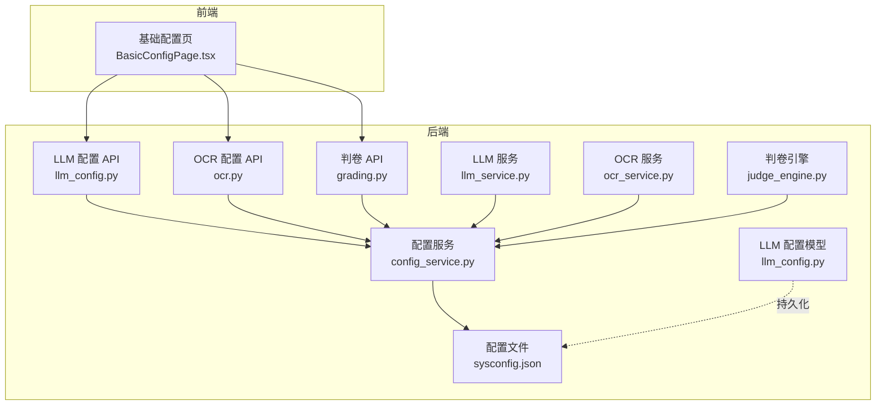
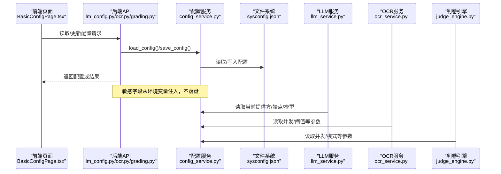
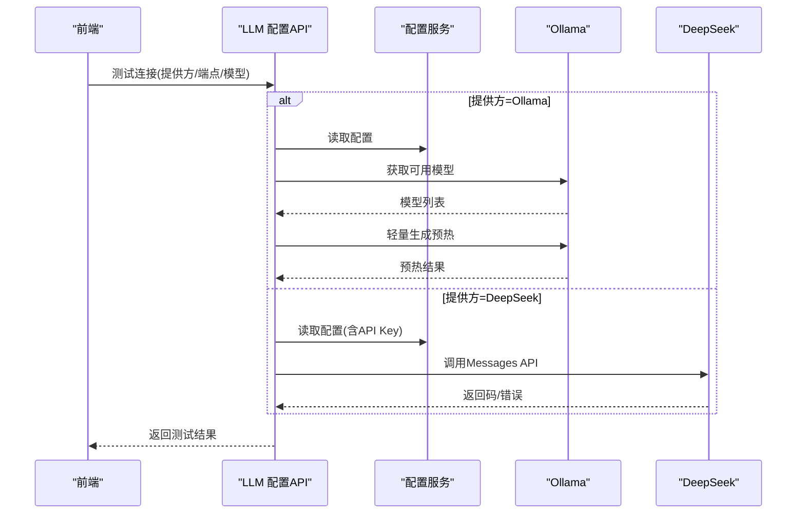
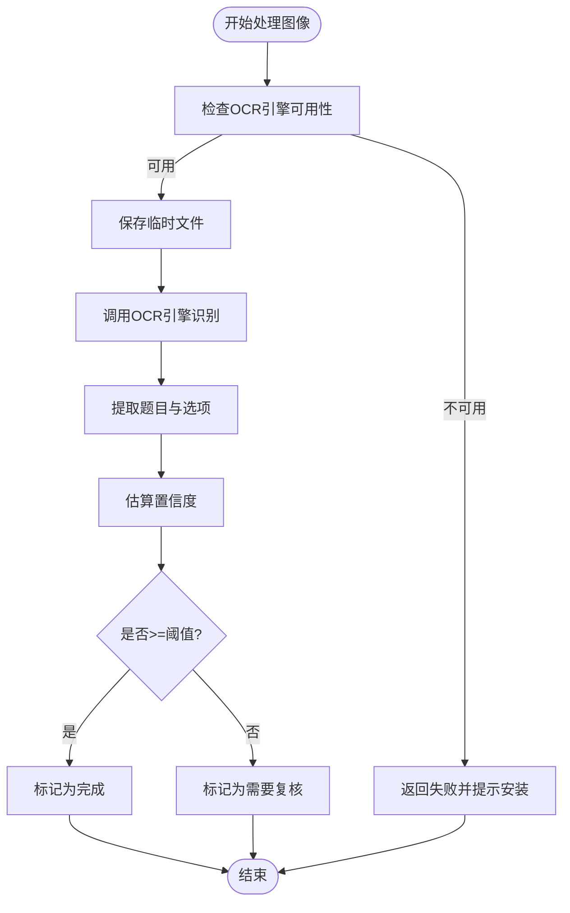
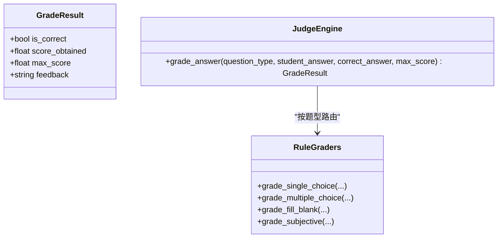
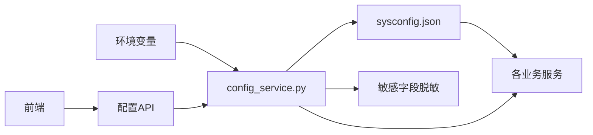

# 服务配置管理

<cite>
**本文引用的文件**
- [backend/app/core/config.py](file://backend/app/core/config.py)
- [backend/app/services/config_service.py](file://backend/app/services/config_service.py)
- [backend/sysconfig.json](file://backend/sysconfig.json)
- [backend/app/api/v1/endpoints/llm_config.py](file://backend/app/api/v1/endpoints/llm_config.py)
- [backend/app/api/v1/endpoints/ocr.py](file://backend/app/api/v1/endpoints/ocr.py)
- [backend/app/api/v1/endpoints/grading.py](file://backend/app/api/v1/endpoints/grading.py)
- [backend/app/services/llm_service.py](file://backend/app/services/llm_service.py)
- [backend/app/services/ocr_service.py](file://backend/app/services/ocr_service.py)
- [backend/app/services/judge_engine.py](file://backend/app/services/judge_engine.py)
- [backend/app/models/llm_config.py](file://backend/app/models/llm_config.py)
- [frontend/src/pages/admin/BasicConfigPage.tsx](file://frontend/src/pages/admin/BasicConfigPage.tsx)
</cite>

## 目录
1. [简介](#简介)
2. [项目结构](#项目结构)
3. [核心组件](#核心组件)
4. [架构总览](#架构总览)
5. [详细组件分析](#详细组件分析)
6. [依赖关系分析](#依赖关系分析)
7. [性能考量](#性能考量)
8. [故障排查指南](#故障排查指南)
9. [结论](#结论)
10. [附录](#附录)

## 简介
本文件面向瑞珹教育管理系统的服务配置管理，系统性梳理并文档化以下服务配置参数与行为：
- LLM 配置：模型选择、API 端点、可用模型列表、当前提供方
- OCR 配置：引擎选择、并发数、置信度阈值
- 判卷配置：并发数量、判卷模式
- 错题本配置：练习题目数量
- 导出上限配置
- 安全性与敏感信息保护
- 动态更新机制、配置缓存策略与验证规则
- 配置示例、最佳实践与常见问题

## 项目结构
后端通过“配置文件 + 运行时注入”的方式管理配置；前端提供可视化配置页面，调用后端 API 实现配置的读取与更新。

图表来源
- [backend/app/services/config_service.py:65-106](file://backend/app/services/config_service.py#L65-L106)
- [backend/app/api/v1/endpoints/llm_config.py:17-53](file://backend/app/api/v1/endpoints/llm_config.py#L17-L53)
- [backend/app/api/v1/endpoints/ocr.py:239-268](file://backend/app/api/v1/endpoints/ocr.py#L239-L268)
- [backend/app/api/v1/endpoints/grading.py:126-143](file://backend/app/api/v1/endpoints/grading.py#L126-L143)
- [backend/app/services/llm_service.py:64-104](file://backend/app/services/llm_service.py#L64-L104)
- [backend/app/services/ocr_service.py:61-126](file://backend/app/services/ocr_service.py#L61-L126)
- [backend/app/models/llm_config.py:8-20](file://backend/app/models/llm_config.py#L8-L20)

章节来源
- [backend/app/services/config_service.py:65-106](file://backend/app/services/config_service.py#L65-L106)
- [backend/app/api/v1/endpoints/llm_config.py:17-53](file://backend/app/api/v1/endpoints/llm_config.py#L17-L53)
- [backend/app/api/v1/endpoints/ocr.py:239-268](file://backend/app/api/v1/endpoints/ocr.py#L239-L268)
- [backend/app/api/v1/endpoints/grading.py:126-143](file://backend/app/api/v1/endpoints/grading.py#L126-L143)
- [backend/app/services/llm_service.py:64-104](file://backend/app/services/llm_service.py#L64-L104)
- [backend/app/services/ocr_service.py:61-126](file://backend/app/services/ocr_service.py#L61-L126)
- [backend/app/models/llm_config.py:8-20](file://backend/app/models/llm_config.py#L8-L20)

## 核心组件
- 配置文件与默认值：sysconfig.json 提供默认配置，config.py 从环境变量覆盖敏感字段。
- 配置服务：统一读写 sysconfig.json，并对敏感字段进行脱敏处理。
- LLM 配置 API：支持切换提供方（Ollama/DeepSeek）、测试连接、刷新可用模型列表。
- OCR 配置 API：预留接口（当前返回占位配置）。
- 判卷配置 API：提供并发数与判卷模式查询与更新。
- 服务层读取：各业务服务按需读取配置，实现动态生效。

章节来源
- [backend/sysconfig.json:1-48](file://backend/sysconfig.json#L1-L48)
- [backend/app/core/config.py:65-106](file://backend/app/core/config.py#L65-L106)
- [backend/app/services/config_service.py:65-106](file://backend/app/services/config_service.py#L65-L106)
- [backend/app/api/v1/endpoints/llm_config.py:17-53](file://backend/app/api/v1/endpoints/llm_config.py#L17-L53)
- [backend/app/api/v1/endpoints/ocr.py:239-268](file://backend/app/api/v1/endpoints/ocr.py#L239-L268)
- [backend/app/api/v1/endpoints/grading.py:126-143](file://backend/app/api/v1/endpoints/grading.py#L126-L143)

## 架构总览
下图展示配置的读取、更新与验证流程，以及与各服务模块的交互。

图表来源
- [backend/app/api/v1/endpoints/llm_config.py:17-53](file://backend/app/api/v1/endpoints/llm_config.py#L17-L53)
- [backend/app/api/v1/endpoints/ocr.py:239-268](file://backend/app/api/v1/endpoints/ocr.py#L239-L268)
- [backend/app/api/v1/endpoints/grading.py:126-143](file://backend/app/api/v1/endpoints/grading.py#L126-L143)
- [backend/app/services/config_service.py:65-106](file://backend/app/services/config_service.py#L65-L106)
- [backend/app/services/llm_service.py:64-104](file://backend/app/services/llm_service.py#L64-L104)
- [backend/app/services/ocr_service.py:61-126](file://backend/app/services/ocr_service.py#L61-L126)
- [backend/app/services/judge_engine.py:1-130](file://backend/app/services/judge_engine.py#L1-L130)

## 详细组件分析

### LLM 配置管理
- 配置项
  - 当前提供方：ollama 或 deepseek
  - Ollama
    - 端点：HTTP API 端点
    - 模型名：当前使用的模型
    - 可用模型列表：由 Ollama 接口动态拉取
  - DeepSeek
    - 端点：兼容 Anthropic Messages 的端点
    - API Key：从环境变量注入，不存储于配置文件
    - 模型名：默认 deepseek-chat，支持列表
- 默认值与取值范围
  - 当前提供方：默认 deepseek
  - Ollama 端点：默认本地端点
  - Ollama 模型：默认示例模型
  - DeepSeek 端点：默认官方端点
  - DeepSeek 可用模型：包含多种模型标识
- 动态更新与验证
  - 支持切换提供方并保存
  - 支持测试连接：拉取可用模型列表并尝试轻量生成以预热模型
  - 若模型不在可用列表，返回提示
- 与服务集成
  - 生成题目与变式练习时，按当前提供方调用对应端点
  - 解析 LLM 返回的 JSON 结构，进行去重与截断

图表来源
- [backend/app/api/v1/endpoints/llm_config.py:61-106](file://backend/app/api/v1/endpoints/llm_config.py#L61-L106)
- [backend/app/services/config_service.py:108-155](file://backend/app/services/config_service.py#L108-L155)
- [backend/app/services/llm_service.py:64-104](file://backend/app/services/llm_service.py#L64-L104)

章节来源
- [backend/app/api/v1/endpoints/llm_config.py:17-53](file://backend/app/api/v1/endpoints/llm_config.py#L17-L53)
- [backend/app/api/v1/endpoints/llm_config.py:61-106](file://backend/app/api/v1/endpoints/llm_config.py#L61-L106)
- [backend/app/services/config_service.py:108-155](file://backend/app/services/config_service.py#L108-L155)
- [backend/app/services/llm_service.py:64-104](file://backend/app/services/llm_service.py#L64-L104)

### OCR 配置管理
- 配置项
  - 引擎：当前 OCR 引擎（tesseract/paddleocr 等）
  - 并发：最大并发 OCR 处理数
  - 置信度阈值：用于判定是否需要人工复核
- 默认值与取值范围
  - 引擎：默认 tesseract
  - 并发：默认 7
  - 置信度阈值：默认 0.7
- 动态更新与验证
  - 预留配置读取/更新接口（当前返回占位配置）
  - 服务层使用内置阈值进行状态判定
- 与服务集成
  - 图像处理流程：识别文本、提取题目、估算置信度、生成结构化结果
  - 状态：NEEDS_REVIEW 或 COMPLETED

图表来源
- [backend/app/services/ocr_service.py:61-126](file://backend/app/services/ocr_service.py#L61-L126)
- [backend/app/api/v1/endpoints/ocr.py:239-268](file://backend/app/api/v1/endpoints/ocr.py#L239-L268)

章节来源
- [backend/app/services/ocr_service.py:17-126](file://backend/app/services/ocr_service.py#L17-L126)
- [backend/app/api/v1/endpoints/ocr.py:239-268](file://backend/app/api/v1/endpoints/ocr.py#L239-L268)

### 判卷配置管理
- 配置项
  - 最大并发判卷数：限制同时判卷的任务数
  - 判卷模式：规则匹配、LLM 语义评分、混合模式
- 默认值与取值范围
  - 最大并发判卷数：默认 3
  - 判卷模式：默认 hybrid
- 动态更新与验证
  - 通过 API 更新并发数与模式
  - 前端提供下拉选择与数值输入校验
- 与服务集成
  - 规则引擎按题型执行评分逻辑，输出得分与反馈
  - 支持主观题关键词匹配与部分分计算

图表来源
- [backend/app/services/judge_engine.py:12-130](file://backend/app/services/judge_engine.py#L12-L130)

章节来源
- [backend/app/api/v1/endpoints/grading.py:126-143](file://backend/app/api/v1/endpoints/grading.py#L126-L143)
- [backend/app/services/judge_engine.py:12-130](file://backend/app/services/judge_engine.py#L12-L130)
- [frontend/src/pages/admin/BasicConfigPage.tsx:174-214](file://frontend/src/pages/admin/BasicConfigPage.tsx#L174-L214)

### 错题本配置管理
- 配置项
  - 每道错题配加强练习题数量
- 默认值与取值范围
  - 默认 1，前端限制 1~20
- 动态更新与验证
  - 通过 API 更新并持久化
- 与服务集成
  - 生成变式练习题时按该数量返回

章节来源
- [backend/app/api/v1/endpoints/llm_config.py:151-176](file://backend/app/api/v1/endpoints/llm_config.py#L151-L176)
- [backend/app/services/llm_service.py:227-318](file://backend/app/services/llm_service.py#L227-L318)
- [frontend/src/pages/admin/BasicConfigPage.tsx:194-201](file://frontend/src/pages/admin/BasicConfigPage.tsx#L194-L201)

### 导出上限配置管理
- 配置项
  - 试题导出上限
- 默认值与取值范围
  - 默认 200，前端限制 0~1000
- 动态更新与验证
  - 通过 API 更新并持久化
  - 设为 0 时禁用导出功能

章节来源
- [backend/app/api/v1/endpoints/llm_config.py:138-149](file://backend/app/api/v1/endpoints/llm_config.py#L138-L149)
- [backend/sysconfig.json:43-43](file://backend/sysconfig.json#L43-L43)
- [frontend/src/pages/admin/BasicConfigPage.tsx:203-212](file://frontend/src/pages/admin/BasicConfigPage.tsx#L203-L212)

### 配置模型与持久化
- LLM 配置模型：支持持久化 LLM 配置（提供方、端点、模型、是否激活等）
- 用途：与运行时配置互补，便于审计与版本化管理

章节来源
- [backend/app/models/llm_config.py:8-20](file://backend/app/models/llm_config.py#L8-L20)

## 依赖关系分析
- 配置读取链路
  - sysconfig.json → config_service.load_config() → 各服务读取
  - 敏感字段（数据库密码、DeepSeek API Key）从环境变量注入，不写回配置文件
- 配置写入链路
  - config_service.save_config() 写入 sysconfig.json，敏感字段被清空
- 权限控制
  - 配置更新需 SYS_ADMIN 角色
  - LLM 配置测试无需管理员权限

图表来源
- [backend/app/services/config_service.py:65-106](file://backend/app/services/config_service.py#L65-L106)
- [backend/app/core/config.py:6-31](file://backend/app/core/config.py#L6-L31)

章节来源
- [backend/app/services/config_service.py:65-106](file://backend/app/services/config_service.py#L65-L106)
- [backend/app/core/config.py:6-31](file://backend/app/core/config.py#L6-L31)

## 性能考量
- LLM
  - 预热模型：测试连接时进行轻量生成，减少首次调用延迟
  - 超时控制：Ollama/DeepSeek 请求设置合理超时
- OCR
  - 并发控制：通过配置限制并发数，避免资源争用
  - 置信度阈值：平衡自动化与人工复核成本
- 判卷
  - 并发限制：防止高负载导致响应时间过长
  - 模式选择：规则匹配更快，混合模式更准确但更慢

## 故障排查指南
- LLM 连接失败
  - 检查端点可达性与模型是否存在
  - 对 DeepSeek：确认 API Key 是否正确注入
- OCR 失败
  - 确认 OCR 引擎安装与语言包
  - 调整置信度阈值或提升图像质量
- 判卷异常
  - 检查并发数设置与题型解析
  - 主观题建议人工复核
- 配置未生效
  - 确认配置已保存且 sysconfig.json 已更新
  - 检查敏感字段是否通过环境变量正确注入

章节来源
- [backend/app/services/config_service.py:108-155](file://backend/app/services/config_service.py#L108-L155)
- [backend/app/services/ocr_service.py:61-126](file://backend/app/services/ocr_service.py#L61-L126)
- [backend/app/services/judge_engine.py:12-130](file://backend/app/services/judge_engine.py#L12-L130)

## 结论
本配置管理体系以 sysconfig.json 为核心，结合运行时注入与 API 控制，实现了 LLM、OCR、判卷、错题本与导出上限等关键服务的参数化管理。通过严格的敏感信息保护、权限控制与动态更新机制，系统在保证安全性的同时具备良好的可维护性与扩展性。

## 附录

### 配置项一览与默认值
- LLM
  - 当前提供方：deepseek
  - Ollama 端点：http://127.0.0.1:11434/v1
  - Ollama 模型：nemotron-3-super:120b
  - DeepSeek 端点：https://api.deepseek.com/anthropic/v1/messages
  - DeepSeek 可用模型：["deepseek-chat", "deepseek-reasoner", "deepseek-v4-pro[1m]", "deepseek-v4-flash"]
- OCR
  - 引擎：tesseract
  - 并发：7
  - 置信度阈值：0.7
- 判卷
  - 最大并发判卷数：3
  - 判卷模式：hybrid
- 错题本
  - 练习题目数量：1
- 导出上限
  - 默认：200

章节来源
- [backend/sysconfig.json:8-47](file://backend/sysconfig.json#L8-L47)
- [backend/app/api/v1/endpoints/llm_config.py:151-176](file://backend/app/api/v1/endpoints/llm_config.py#L151-L176)
- [backend/app/api/v1/endpoints/ocr.py:239-268](file://backend/app/api/v1/endpoints/ocr.py#L239-L268)
- [backend/app/api/v1/endpoints/grading.py:126-143](file://backend/app/api/v1/endpoints/grading.py#L126-L143)
- [frontend/src/pages/admin/BasicConfigPage.tsx:174-214](file://frontend/src/pages/admin/BasicConfigPage.tsx#L174-L214)

### 安全性与敏感信息保护
- 敏感字段
  - 数据库密码：通过环境变量覆盖
  - DeepSeek API Key：仅从环境变量读取，不写入 sysconfig.json
- 配置写入策略
  - 写入前对敏感字段进行脱敏处理
- 权限控制
  - 配置更新需 SYS_ADMIN 角色
  - LLM 测试连接无需管理员权限

章节来源
- [backend/app/services/config_service.py:81-106](file://backend/app/services/config_service.py#L81-L106)
- [backend/app/core/config.py:6-31](file://backend/app/core/config.py#L6-L31)
- [backend/app/api/v1/endpoints/llm_config.py:17-53](file://backend/app/api/v1/endpoints/llm_config.py#L17-L53)