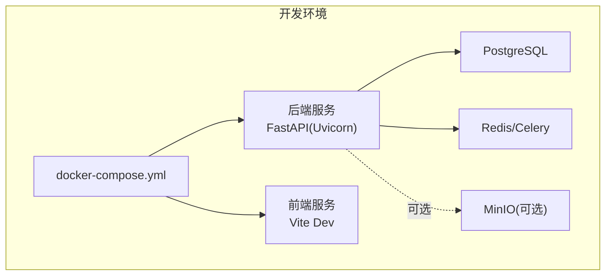
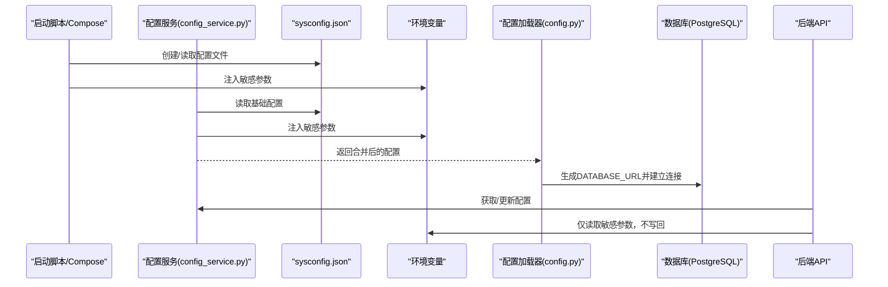
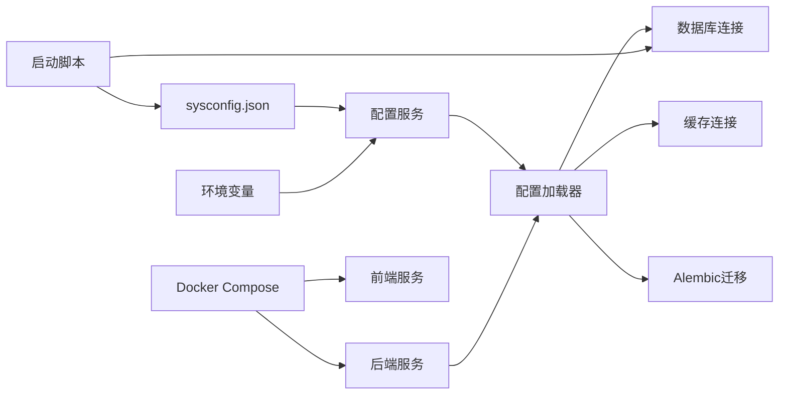

# 环境配置管理

<cite>
**本文档引用的文件**
- [sysconfig.json](file://backend/sysconfig.json)
- [docker-compose.yml](file://docker-compose.yml)
- [config.py](file://backend/app/core/config.py)
- [config_service.py](file://backend/app/services/config_service.py)
- [llm_config.py](file://backend/app/api/v1/endpoints/llm_config.py)
- [database.py](file://backend/app/api/v1/endpoints/database.py)
- [start.sh](file://start.sh)
- [Dockerfile（后端）](file://backend/Dockerfile)
- [Dockerfile（前端）](file://frontend/Dockerfile)
- [requirements.txt](file://backend/requirements.txt)
- [alembic.ini](file://backend/alembic.ini)
- [env.py](file://backend/alembic/env.py)
</cite>

## 目录
1. [简介](#简介)
2. [项目结构](#项目结构)
3. [核心组件](#核心组件)
4. [架构概览](#架构概览)
5. [详细组件分析](#详细组件分析)
6. [依赖分析](#依赖分析)
7. [性能考虑](#性能考虑)
8. [故障排除指南](#故障排除指南)
9. [结论](#结论)
10. [附录](#附录)

## 简介
本文件面向瑞珹教育管理系统，提供完整的环境配置管理文档。内容涵盖多环境配置支持（开发、测试、生产）、配置文件结构与优先级、环境变量管理、配置验证与热更新策略、安全性最佳实践、版本管理与迁移，以及故障排除指南。重点围绕系统配置文件 sysconfig.json 的结构与作用，以及 Docker Compose 中的环境变量传递、服务依赖与网络配置。

## 项目结构
系统采用前后端分离架构，通过 Docker Compose 编排后端 FastAPI 服务与前端 Vite 开发服务器，并通过共享卷挂载实现本地开发热更新。后端通过 Alembic 管理数据库迁移，配置由 sysconfig.json 提供非敏感参数，敏感参数通过环境变量注入。

图表来源
- [docker-compose.yml:1-33](file://docker-compose.yml#L1-L33)
- [Dockerfile（后端）:1-11](file://backend/Dockerfile#L1-L11)
- [Dockerfile（前端）:1-11](file://frontend/Dockerfile#L1-L11)

章节来源
- [docker-compose.yml:1-33](file://docker-compose.yml#L1-L33)
- [Dockerfile（后端）:1-11](file://backend/Dockerfile#L1-L11)
- [Dockerfile（前端）:1-11](file://frontend/Dockerfile#L1-L11)

## 核心组件
- 配置文件 sysconfig.json：定义数据库连接、LLM 提供商与模型、阅卷并发与模型、OCR 引擎与阈值、错题本练习数量、导出上限、系统日志级别与备份开关等非敏感配置。
- 配置服务 config_service.py：负责读取/写入 sysconfig.json，注入敏感参数（如 DEEPSEEK_API_KEY、DATABASE_PASSWORD），并提供配置校验与模型连通性测试。
- 配置加载器 config.py：从 sysconfig.json 加载非敏感参数，并允许通过环境变量覆盖敏感参数；同时定义数据库、缓存、上传、OCR、模型缓存等通用配置。
- Docker Compose：定义后端与前端服务、环境变量、卷挂载与服务依赖关系。
- 启动脚本 start.sh：在无容器环境下自动创建 sysconfig.json、检查依赖、初始化数据库、执行迁移、创建管理员账户并启动服务。
- Alembic：基于 settings.DATABASE_URL 动态重写 SQLAlchemy 连接字符串，支持离线/在线迁移。

章节来源
- [sysconfig.json:1-48](file://backend/sysconfig.json#L1-L48)
- [config_service.py:1-155](file://backend/app/services/config_service.py#L1-L155)
- [config.py:1-98](file://backend/app/core/config.py#L1-L98)
- [start.sh:1-359](file://start.sh#L1-L359)
- [alembic.ini:1-150](file://backend/alembic.ini#L1-L150)
- [env.py:1-80](file://backend/alembic/env.py#L1-L80)

## 架构概览
下图展示配置在系统中的流向与交互：应用启动时，配置服务从 sysconfig.json 读取基础配置，随后注入来自环境变量的敏感参数；后端服务根据最终配置生成数据库连接串、缓存连接串等；前端通过 API 获取配置并进行连通性测试；Docker Compose 将环境变量注入容器。

图表来源
- [config_service.py:65-78](file://backend/app/services/config_service.py#L65-L78)
- [config.py:36-97](file://backend/app/core/config.py#L36-L97)
- [sysconfig.json:1-48](file://backend/sysconfig.json#L1-L48)

章节来源
- [config_service.py:1-155](file://backend/app/services/config_service.py#L1-L155)
- [config.py:1-98](file://backend/app/core/config.py#L1-L98)

## 详细组件分析

### 配置文件 sysconfig.json 结构与用途
- database：数据库连接参数（server、port、database、user）。密码通过环境变量 DATABASE_PASSWORD 注入，不在 JSON 中存储。
- llm：大模型提供商配置，包含当前选择的提供商（current）、Ollama 与 DeepSeek 的 endpoint、model、available_models 列表。
- grading：阅卷并发数与模型类型。
- ocr：OCR 引擎、并发数与置信度阈值。
- mistake_book：错题本练习题目数量。
- export_max：导出上限。
- system：日志级别与备份开关。

章节来源
- [sysconfig.json:1-48](file://backend/sysconfig.json#L1-L48)

### 配置加载与优先级
- 非敏感参数：优先从 sysconfig.json 读取，若文件缺失则使用默认值。
- 敏感参数：始终从环境变量读取，不写回 sysconfig.json。
- 环境变量覆盖顺序：
  - DATABASE_PASSWORD：用于数据库密码。
  - SECRET_KEY：用于 JWT 密钥。
  - DEEPSEEK_API_KEY：用于 DeepSeek 提供商 API 访问。
  - 其他通用参数：如 REDIS_*、OCR_*、MODEL_CACHE_DIR 等，均通过环境变量覆盖。

章节来源
- [config.py:6-30](file://backend/app/core/config.py#L6-L30)
- [config_service.py:65-78](file://backend/app/services/config_service.py#L65-L78)

### Docker Compose 环境变量与服务编排
- 后端服务 backend：
  - 环境变量：DATABASE_TYPE、SQLITE_DB_PATH、SECRET_KEY、ALGORITHM、ACCESS_TOKEN_EXPIRE_MINUTES、REFRESH_TOKEN_EXPIRE_DAYS。
  - 命令：uvicorn 启动应用，端口映射 8000:8000。
  - 卷挂载：后端代码与数据库文件挂载到容器内，便于开发调试。
- 前端服务 frontend：
  - 环境变量：无显式注入，主要通过宿主机端口 3000:3000 对外提供。
  - 依赖：depends_on: backend，确保后端先启动。
  - 命令：npm run dev，端口映射 3000:3000。
- 网络：默认使用 Docker bridge 网络，容器间可通过服务名互访。

章节来源
- [docker-compose.yml:1-33](file://docker-compose.yml#L1-L33)
- [Dockerfile（后端）:1-11](file://backend/Dockerfile#L1-L11)
- [Dockerfile（前端）:1-11](file://frontend/Dockerfile#L1-L11)

### 配置验证与热更新策略
- 配置验证：
  - LLM 连通性测试：支持 Ollama 与 DeepSeek 的连通性与模型可用性检测，并可触发模型预热。
  - 数据库配置更新：通过 API 更新 sysconfig.json 中的 database 段，需重启后端以使新连接生效。
- 热更新策略：
  - sysconfig.json 的修改不会自动热加载，需重启后端服务。
  - 环境变量变更需重启容器或服务以生效。
  - 建议通过配置中心或外部密钥管理服务在生产环境集中管理敏感参数。

章节来源
- [llm_config.py:108-155](file://backend/app/api/v1/endpoints/llm_config.py#L108-L155)
- [database.py:147-166](file://backend/app/api/v1/endpoints/database.py#L147-L166)
- [config_service.py:101-105](file://backend/app/services/config_service.py#L101-L105)

### 配置安全性最佳实践
- 敏感参数不落盘：DATABASE_PASSWORD、DEEPSEEK_API_KEY、SECRET_KEY 仅从环境变量读取。
- 最小权限原则：数据库用户与 API Key 权限最小化。
- 端口与网络隔离：生产环境建议限制暴露端口，使用独立网络与防火墙策略。
- 定期轮换密钥：通过环境变量轮换 SECRET_KEY，避免硬编码。

章节来源
- [config.py:14-30](file://backend/app/core/config.py#L14-L30)
- [config_service.py:3-5](file://backend/app/services/config_service.py#L3-L5)
- [llm_config.py:13-20](file://backend/app/api/v1/endpoints/llm_config.py#L13-L20)

### 配置迁移与版本管理
- sysconfig.json：作为非敏感配置的基线，随代码版本管理；敏感参数通过环境变量注入。
- Alembic 迁移：基于 settings.DATABASE_URL 动态重写 sqlalchemy.url，确保迁移使用正确的数据库连接。
- 启动脚本：在无容器环境下自动生成 sysconfig.json 默认模板，检查依赖并执行数据库初始化与迁移。

章节来源
- [alembic.ini:86-90](file://backend/alembic.ini#L86-L90)
- [env.py:15-20](file://backend/alembic/env.py#L15-L20)
- [start.sh:91-136](file://start.sh#L91-L136)

## 依赖分析
- 配置服务依赖 sysconfig.json 与环境变量，向后端 API 提供统一配置接口。
- 配置加载器依赖 sysconfig.json 与环境变量，生成数据库、缓存、上传等连接串。
- Alembic 依赖 settings.DATABASE_URL，间接依赖配置加载器。
- 启动脚本依赖 sysconfig.json 与数据库连接，负责初始化与迁移。
- Docker Compose 依赖后端/前端镜像与环境变量，负责服务编排与网络。

图表来源
- [config_service.py:22-78](file://backend/app/services/config_service.py#L22-L78)
- [config.py:36-97](file://backend/app/core/config.py#L36-L97)
- [alembic.ini:86-90](file://backend/alembic.ini#L86-L90)
- [env.py:15-20](file://backend/alembic/env.py#L15-L20)
- [start.sh:91-136](file://start.sh#L91-L136)
- [docker-compose.yml:1-33](file://docker-compose.yml#L1-L33)

章节来源
- [config_service.py:1-155](file://backend/app/services/config_service.py#L1-L155)
- [config.py:1-98](file://backend/app/core/config.py#L1-L98)
- [alembic.ini:1-150](file://backend/alembic.ini#L1-L150)
- [env.py:1-80](file://backend/alembic/env.py#L1-L80)
- [start.sh:1-359](file://start.sh#L1-L359)
- [docker-compose.yml:1-33](file://docker-compose.yml#L1-L33)

## 性能考虑
- 并发控制：通过 grading.max_concurrent_grading 与 ocr.max_concurrent_ocr 控制资源占用，避免过载。
- 模型预热：LLM 测试流程包含轻量请求以触发模型加载，减少首次调用延迟。
- 数据库连接：使用异步驱动连接 PostgreSQL，提升高并发场景下的吞吐。
- 缓存与队列：通过 Redis/Celery 支持异步任务与缓存，降低主业务线阻塞。

章节来源
- [sysconfig.json:31-39](file://backend/sysconfig.json#L31-L39)
- [llm_config.py:128-155](file://backend/app/api/v1/endpoints/llm_config.py#L128-L155)
- [config.py:55-80](file://backend/app/core/config.py#L55-L80)

## 故障排除指南
- 无法连接数据库
  - 检查 sysconfig.json 的 database 段与环境变量 DATABASE_PASSWORD 是否正确。
  - 使用启动脚本或命令行工具验证 psql 连接。
- Alembic 迁移失败
  - 确认 settings.DATABASE_URL 正确，Alembic 已根据 DATABASE_URL 重写 sqlalchemy.url。
  - 尝试手动创建表或修复迁移脚本。
- LLM 连接失败
  - 使用 /config/test 接口测试 Ollama 或 DeepSeek 的 endpoint 与模型可用性。
  - 确认 DEEPSEEK_API_KEY 已正确注入且网络可达。
- 前端无法访问后端
  - 检查 docker-compose 的 depends_on 与端口映射，确保后端先启动且端口未被占用。
- 配置未生效
  - sysconfig.json 修改需重启后端；环境变量变更需重启容器或服务。

章节来源
- [database.py:96-144](file://backend/app/api/v1/endpoints/database.py#L96-L144)
- [llm_config.py:61-105](file://backend/app/api/v1/endpoints/llm_config.py#L61-L105)
- [alembic.ini:86-90](file://backend/alembic.ini#L86-L90)
- [env.py:15-20](file://backend/alembic/env.py#L15-L20)
- [docker-compose.yml:30-32](file://docker-compose.yml#L30-L32)
- [start.sh:187-196](file://start.sh#L187-L196)

## 结论
本系统通过 sysconfig.json 与环境变量实现了清晰的配置分层：非敏感参数集中管理，敏感参数安全注入。Docker Compose 提供了便捷的多环境编排能力，结合启动脚本与 Alembic 迁移，能够快速搭建开发与生产环境。建议在生产环境中引入配置中心与密钥管理服务，配合严格的权限与审计策略，进一步提升安全性与可维护性。

## 附录
- 多环境建议
  - 开发环境：使用 SQLite 或本地 PostgreSQL，开启 DEBUG 日志，启用备份。
  - 测试环境：使用独立数据库实例，最小化权限，启用必要的日志级别。
  - 生产环境：使用强密码与 TLS，限制端口暴露，启用只读数据库副本与备份策略。
- 配置清单
  - 非敏感：database、llm.current、llm.ollama.endpoint、llm.deepseek.endpoint、grading、ocr、mistake_book、export_max、system.log_level、system.backup_enabled。
  - 敏感：DATABASE_PASSWORD、SECRET_KEY、DEEPSEEK_API_KEY。

章节来源
- [sysconfig.json:1-48](file://backend/sysconfig.json#L1-L48)
- [config.py:14-30](file://backend/app/core/config.py#L14-L30)
- [config_service.py:3-5](file://backend/app/services/config_service.py#L3-L5)