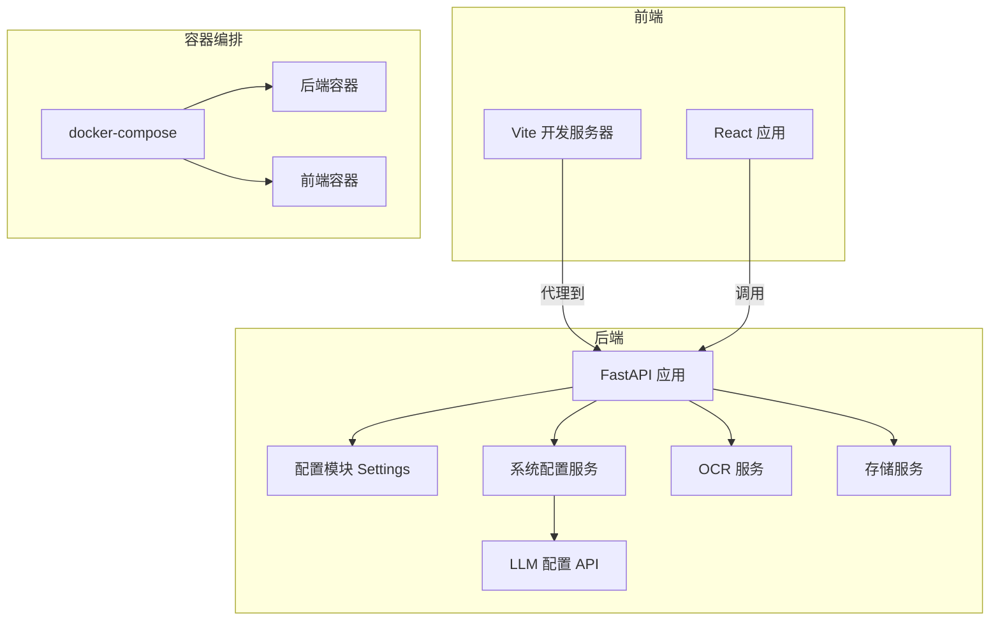
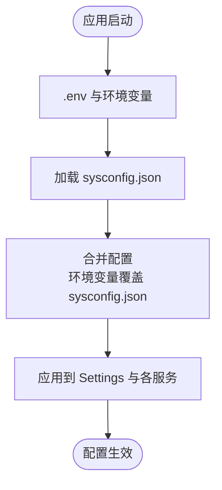
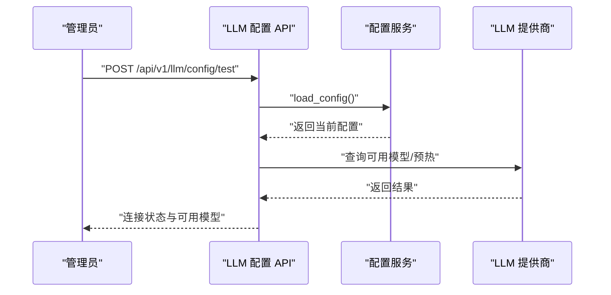
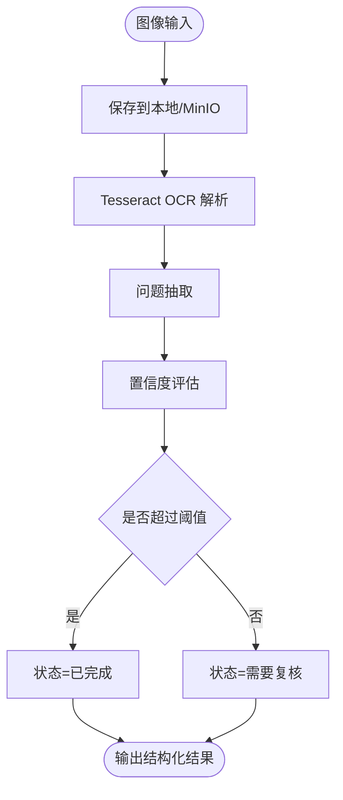
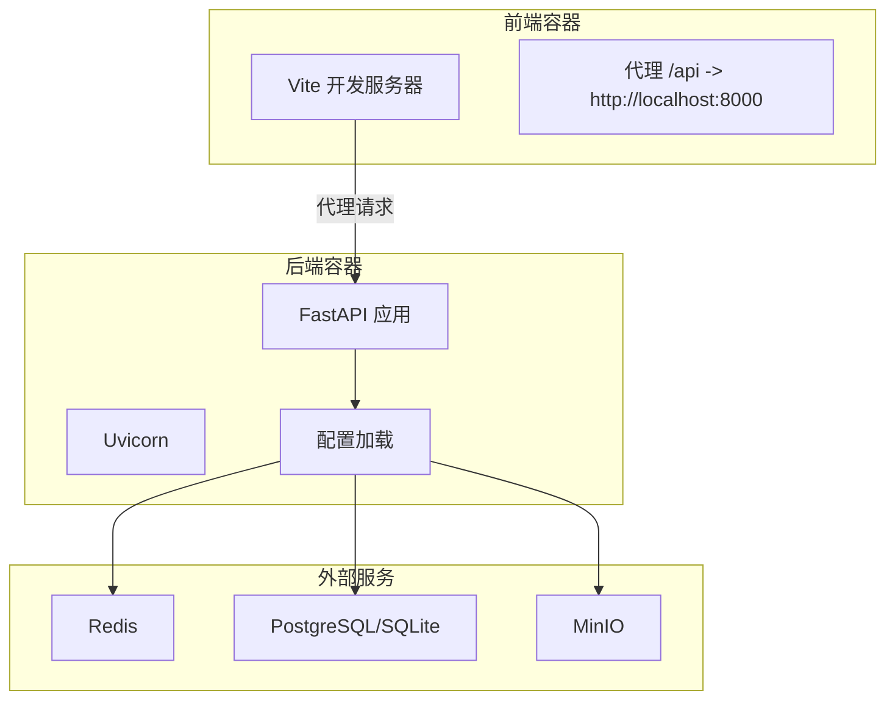
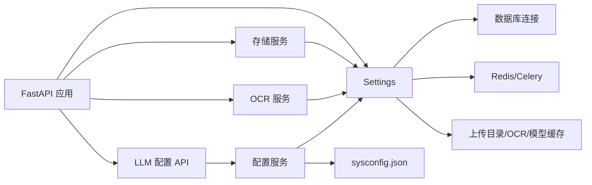

# 系统配置管理

<cite>
**本文档引用的文件**
- [backend/app/core/config.py](file://backend/app/core/config.py)
- [backend/sysconfig.json](file://backend/sysconfig.json)
- [backend/app/services/config_service.py](file://backend/app/services/config_service.py)
- [backend/app/api/v1/endpoints/llm_config.py](file://backend/app/api/v1/endpoints/llm_config.py)
- [backend/app/services/ocr_service.py](file://backend/app/services/ocr_service.py)
- [backend/app/services/storage.py](file://backend/app/services/storage.py)
- [backend/Dockerfile](file://backend/Dockerfile)
- [frontend/Dockerfile](file://frontend/Dockerfile)
- [docker-compose.yml](file://docker-compose.yml)
- [backend/app/main.py](file://backend/app/main.py)
- [backend/requirements.txt](file://backend/requirements.txt)
- [frontend/vite.config.ts](file://frontend/vite.config.ts)
- [frontend/package.json](file://frontend/package.json)
</cite>

## 目录
1. [简介](#简介)
2. [项目结构](#项目结构)
3. [核心组件](#核心组件)
4. [架构总览](#架构总览)
5. [详细组件分析](#详细组件分析)
6. [依赖关系分析](#依赖关系分析)
7. [性能考虑](#性能考虑)
8. [故障排除指南](#故障排除指南)
9. [结论](#结论)
10. [附录](#附录)

## 简介
本文件为瑞珹教育管理系统提供系统配置管理文档，覆盖多环境配置支持（开发、测试、生产）、配置文件结构与环境变量管理、LLM/OCR/存储配置与性能调优参数、Docker容器化与服务依赖、配置验证与热更新机制、配置安全性与最佳实践、故障排除与迁移策略，以及前后端配置协调机制。

## 项目结构
系统采用前后端分离架构，通过 Docker Compose 编排运行。后端基于 FastAPI + SQLAlchemy，前端基于 Vite + React。配置主要分为两类：
- 运行时配置：由后端 Settings 类统一读取，支持从环境变量覆盖敏感值。
- 系统配置：以 JSON 文件形式存储非敏感业务参数，支持运行时修改并通过 API 写回。

**图表来源**
- [backend/app/main.py:1-52](file://backend/app/main.py#L1-L52)
- [backend/app/core/config.py:36-98](file://backend/app/core/config.py#L36-L98)
- [backend/app/services/config_service.py:65-105](file://backend/app/services/config_service.py#L65-L105)
- [backend/app/api/v1/endpoints/llm_config.py:17-52](file://backend/app/api/v1/endpoints/llm_config.py#L17-L52)
- [frontend/vite.config.ts:8-13](file://frontend/vite.config.ts#L8-L13)
- [docker-compose.yml:3-32](file://docker-compose.yml#L3-L32)

**章节来源**
- [backend/app/main.py:1-52](file://backend/app/main.py#L1-L52)
- [docker-compose.yml:1-33](file://docker-compose.yml#L1-L33)

## 核心组件
- 运行时配置中心：后端通过 Settings 类集中管理项目名、版本、数据库、Redis、Celery、上传目录、OCR引擎、模型缓存目录等参数，并支持从 .env 和环境变量覆盖。
- 系统配置中心：sysconfig.json 存储数据库连接、LLM提供商与模型、阅卷并发、OCR并发与阈值、错题本练习数量、导出上限、系统日志级别与备份开关等非敏感参数；敏感值（如密钥、数据库密码、DeepSeek API Key）通过环境变量注入，不写入 JSON。
- 配置服务：提供配置读取、写回、敏感字段剥离、LLM连接测试与模型拉取能力。
- 容器化与编排：后端与前端分别构建镜像，通过 docker-compose 启动，前端代理后端 API。

**章节来源**
- [backend/app/core/config.py:36-98](file://backend/app/core/config.py#L36-L98)
- [backend/sysconfig.json:1-48](file://backend/sysconfig.json#L1-L48)
- [backend/app/services/config_service.py:65-105](file://backend/app/services/config_service.py#L65-L105)

## 架构总览
系统配置分层如下：
- 环境层：.env 与环境变量（优先级最高）
- 系统配置层：sysconfig.json（非敏感参数）
- 默认层：代码中的默认值（最低优先级）

**图表来源**
- [backend/app/core/config.py:6-30](file://backend/app/core/config.py#L6-L30)
- [backend/app/services/config_service.py:65-78](file://backend/app/services/config_service.py#L65-L78)

**章节来源**
- [backend/app/core/config.py:36-98](file://backend/app/core/config.py#L36-L98)
- [backend/app/services/config_service.py:65-78](file://backend/app/services/config_service.py#L65-L78)

## 详细组件分析

### 多环境配置支持
- 开发环境：docker-compose 将后端映射到 8000 端口，前端映射到 3000 端口，启用热重载；.env 未显式挂载，可通过环境变量覆盖。
- 测试/生产环境：建议通过环境变量与 .env 文件注入配置，避免硬编码；数据库可切换为 Postgres 或 SQLite（通过环境变量控制）。
- 环境变量优先级：环境变量 > sysconfig.json > 默认值。

**章节来源**
- [docker-compose.yml:13-20](file://docker-compose.yml#L13-L20)
- [backend/app/core/config.py:91-94](file://backend/app/core/config.py#L91-L94)

### 配置文件结构与环境变量管理
- sysconfig.json 结构要点：
  - database：server、port、database、user
  - llm：current 当前提供商，ollama/deepseek 的 endpoint/model/available_models
  - grading：max_concurrent_grading、grading_model
  - ocr：ocr_engine、max_concurrent_ocr、ocr_confidence_threshold
  - mistake_book：practice_question_count
  - export_max：导出上限
  - system：log_level、backup_enabled
- 环境变量覆盖：
  - SECRET_KEY、POSTGRES_*、DATABASE_PASSWORD、REDIS_*、CELERY_*、UPLOAD_DIR、OCR_*、MODEL_CACHE_DIR 等
  - 敏感值不写入 sysconfig.json，仅在运行时注入

**章节来源**
- [backend/sysconfig.json:1-48](file://backend/sysconfig.json#L1-L48)
- [backend/app/core/config.py:15-30](file://backend/app/core/config.py#L15-L30)
- [backend/app/core/config.py:48-87](file://backend/app/core/config.py#L48-L87)

### LLM 配置与性能调优
- 支持提供商：Ollama 与 DeepSeek（Anthropic 兼容接口）
- 配置项：
  - 当前提供商 current
  - Ollama：endpoint、model、available_models
  - DeepSeek：endpoint、api_key（从环境变量注入）、model、available_models
- 性能调优参数：
  - grading.max_concurrent_grading：阅卷并发数
  - grading.grading_model：规则/混合模型选择
  - export_max：导出上限
- 运行时校验：
  - 拉取可用模型列表
  - 发送轻量提示触发模型预热
  - 返回可用模型与连接状态

**图表来源**
- [backend/app/api/v1/endpoints/llm_config.py:61-105](file://backend/app/api/v1/endpoints/llm_config.py#L61-L105)
- [backend/app/services/config_service.py:108-155](file://backend/app/services/config_service.py#L108-L155)

**章节来源**
- [backend/app/api/v1/endpoints/llm_config.py:17-52](file://backend/app/api/v1/endpoints/llm_config.py#L17-L52)
- [backend/app/api/v1/endpoints/llm_config.py:138-148](file://backend/app/api/v1/endpoints/llm_config.py#L138-L148)
- [backend/app/services/config_service.py:108-155](file://backend/app/services/config_service.py#L108-L155)

### OCR 配置与性能调优
- 引擎：默认 Tesseract（支持中文简体 + 英文），可通过环境变量切换
- 关键参数：
  - OCR_ENGINE：引擎名称
  - OCR_LANG：语言
  - ocr_confidence_threshold：置信度阈值（用于自动审核）
  - max_concurrent_ocr：并发限制
- 置信度评估：基于中文字符比例与行数的启发式算法
- 输出结构：原始文本、置信度、问题抽取结果、状态（自动/需要复核）

**图表来源**
- [backend/app/services/ocr_service.py:61-125](file://backend/app/services/ocr_service.py#L61-L125)

**章节来源**
- [backend/app/services/ocr_service.py:17-58](file://backend/app/services/ocr_service.py#L17-L58)
- [backend/app/services/ocr_service.py:61-125](file://backend/app/services/ocr_service.py#L61-L125)

### 存储配置与 MinIO 集成
- 优先使用 MinIO 分布式对象存储，若不可用则回退到本地文件系统
- MinIO 环境变量：MINIO_ENDPOINT、MINIO_ACCESS_KEY、MINIO_SECRET_KEY
- 上传目录：UPLOAD_DIR（默认 ./uploads）
- 文件访问：生成预签名 URL（MinIO）或本地相对路径

**章节来源**
- [backend/app/services/storage.py:10-55](file://backend/app/services/storage.py#L10-L55)
- [backend/app/core/config.py:78-79](file://backend/app/core/config.py#L78-L79)

### Docker 容器化配置与服务依赖
- 后端镜像：基于 Python slim，安装 requirements.txt，CMD 启动 Uvicorn
- 前端镜像：基于 Node Alpine，安装依赖后启动 Vite 开发服务器
- docker-compose：
  - 映射后端 8000:8000，前端 3000:3000
  - 后端挂载代码与 SQLite 数据库文件
  - 前端依赖后端服务，通过代理转发 /api 到后端
  - 后端环境变量示例：SECRET_KEY、ACCESS_TOKEN_EXPIRE_MINUTES 等

**图表来源**
- [backend/Dockerfile:1-11](file://backend/Dockerfile#L1-L11)
- [frontend/Dockerfile:1-11](file://frontend/Dockerfile#L1-L11)
- [docker-compose.yml:3-32](file://docker-compose.yml#L3-L32)

**章节来源**
- [backend/Dockerfile:1-11](file://backend/Dockerfile#L1-L11)
- [frontend/Dockerfile:1-11](file://frontend/Dockerfile#L1-L11)
- [docker-compose.yml:1-33](file://docker-compose.yml#L1-L33)

### 配置验证、热更新与安全性
- 配置验证：
  - LLM 连接测试：拉取模型列表、发送轻量提示触发预热
  - OCR 引擎可用性：捕获导入异常并返回错误信息
- 热更新机制：
  - sysconfig.json 修改后，通过配置 API 写回，无需重启即可生效
  - 环境变量变更需重启容器或服务
- 安全性：
  - 敏感值（密钥、数据库密码、DeepSeek API Key）不写入 sysconfig.json，仅从环境变量注入
  - 前端仅接收脱敏后的 DeepSeek API Key（显示为占位符）

**章节来源**
- [backend/app/services/config_service.py:87-98](file://backend/app/services/config_service.py#L87-L98)
- [backend/app/api/v1/endpoints/llm_config.py:17-25](file://backend/app/api/v1/endpoints/llm_config.py#L17-L25)
- [backend/app/services/ocr_service.py:9-14](file://backend/app/services/ocr_service.py#L9-L14)

### 前后端配置协调机制
- 前端代理：Vite 代理 /api 到后端 8000 端口，便于开发调试
- 环境变量：后端通过 Settings 读取，前端通过构建脚本与运行时环境影响 API 地址（开发时由代理解决）
- 版本与路由：后端统一 API 路由前缀，前端按约定调用

**章节来源**
- [frontend/vite.config.ts:8-13](file://frontend/vite.config.ts#L8-L13)
- [backend/app/main.py:30-30](file://backend/app/main.py#L30-L30)

## 依赖关系分析

**图表来源**
- [backend/app/core/config.py:36-98](file://backend/app/core/config.py#L36-L98)
- [backend/app/services/config_service.py:22-22](file://backend/app/services/config_service.py#L22-L22)
- [backend/app/api/v1/endpoints/llm_config.py:1-10](file://backend/app/api/v1/endpoints/llm_config.py#L1-L10)
- [backend/app/services/ocr_service.py:1-10](file://backend/app/services/ocr_service.py#L1-L10)
- [backend/app/services/storage.py:1-10](file://backend/app/services/storage.py#L1-L10)
- [backend/app/main.py:1-30](file://backend/app/main.py#L1-L30)

**章节来源**
- [backend/requirements.txt:1-27](file://backend/requirements.txt#L1-L27)
- [frontend/package.json:1-38](file://frontend/package.json#L1-L38)

## 性能考虑
- 并发控制：OCR 与阅卷并发数通过配置项限制，避免资源争抢
- 模型预热：LLM 连接测试会触发模型加载，减少首次调用延迟
- 存储优化：优先使用 MinIO 提升大文件吞吐，本地回退保证可用性
- 日志级别：通过 system.log_level 控制日志输出，平衡可观测性与性能

## 故障排除指南
- LLM 连接失败：
  - 检查 Ollama/DeepSeek 端点与模型名称
  - 使用配置测试接口验证连通性与模型可用性
- OCR 无法解析：
  - 确认 Tesseract 是否安装（中文简体 + 英文语言包）
  - 调整置信度阈值或人工复核
- 存储异常：
  - 检查 MinIO 端点与凭据
  - 确认上传目录权限
- 健康检查：
  - 访问后端 /health 接口确认服务状态

**章节来源**
- [backend/app/api/v1/endpoints/llm_config.py:108-135](file://backend/app/api/v1/endpoints/llm_config.py#L108-L135)
- [backend/app/services/ocr_service.py:71-78](file://backend/app/services/ocr_service.py#L71-L78)
- [backend/app/services/storage.py:11-22](file://backend/app/services/storage.py#L11-L22)
- [backend/app/main.py:50-52](file://backend/app/main.py#L50-L52)

## 结论
本配置体系通过“环境变量优先 + JSON 非敏感参数 + 运行时注入”的设计，在保证安全性的前提下实现了灵活的多环境支持与动态配置管理。结合 Docker 编排与代理机制，开发与生产的配置差异得以最小化，同时保留了足够的扩展空间。

## 附录

### 配置最佳实践
- 生产环境必须设置 SECRET_KEY、DATABASE_PASSWORD、DEEPSEEK_API_KEY 等敏感值
- 使用 .env 文件管理非敏感配置，避免直接修改源码
- 定期通过配置测试接口验证 LLM/OCR/存储链路
- 对外暴露的配置仅展示脱敏数据，避免泄露敏感字段

### 配置迁移策略
- 从旧版本升级时，先备份 sysconfig.json，再逐步迁移新增字段
- 通过配置 API 逐项更新，避免一次性大规模变更
- 在测试环境先行验证，再推广至生产