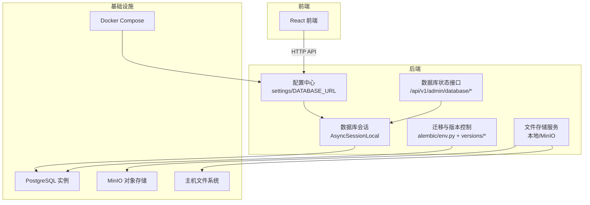
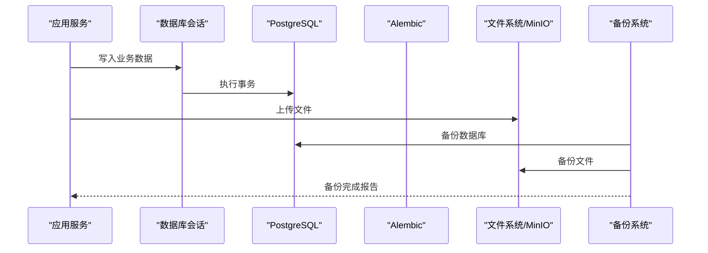
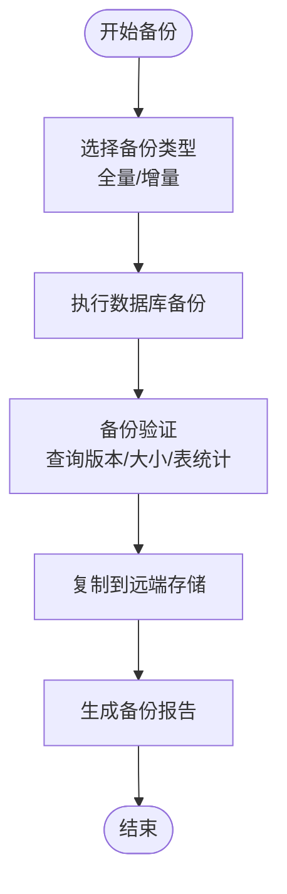
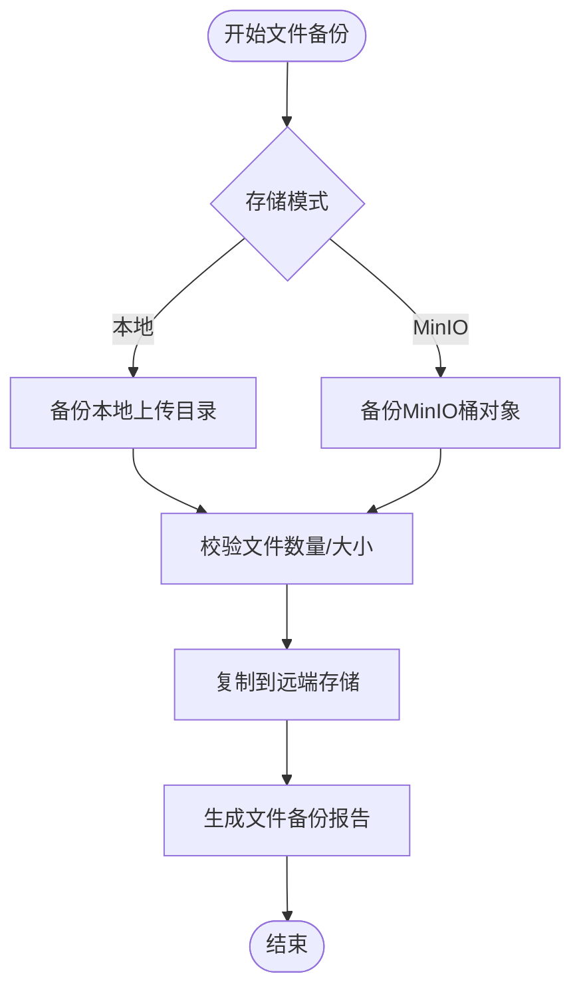
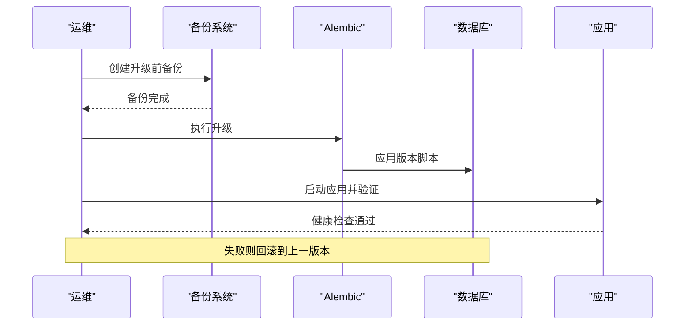
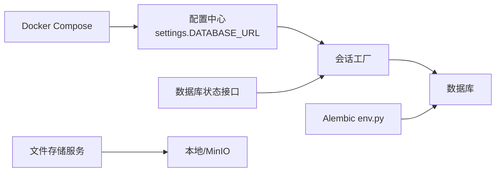

# 备份恢复

<cite>
**本文引用的文件**
- [backend/app/core/config.py](file://backend/app/core/config.py)
- [backend/alembic.ini](file://backend/alembic.ini)
- [backend/alembic/env.py](file://backend/alembic/env.py)
- [backend/alembic/versions/001_v22_initial.py](file://backend/alembic/versions/001_v22_initial.py)
- [backend/alembic/versions/002_add_provinces_table.py](file://backend/alembic/versions/002_add_provinces_table.py)
- [backend/alembic/versions/003_add_is_typical.py](file://backend/alembic/versions/003_add_is_typical.py)
- [backend/alembic/versions/005_add_ocr_needs_review_status.py](file://backend/alembic/versions/005_add_ocr_needs_review_status.py)
- [backend/app/db/session.py](file://backend/app/db/session.py)
- [backend/app/api/v1/endpoints/database.py](file://backend/app/api/v1/endpoints/database.py)
- [backend/app/services/storage.py](file://backend/app/services/storage.py)
- [backend/app/services/config_service.py](file://backend/app/services/config_service.py)
- [backend/sysconfig.json](file://backend/sysconfig.json)
- [docker-compose.yml](file://docker-compose.yml)
- [backend/Dockerfile](file://backend/Dockerfile)
- [start.sh](file://start.sh)
</cite>

## 目录
1. [简介](#简介)
2. [项目结构](#项目结构)
3. [核心组件](#核心组件)
4. [架构总览](#架构总览)
5. [详细组件分析](#详细组件分析)
6. [依赖分析](#依赖分析)
7. [性能考虑](#性能考虑)
8. [故障排查指南](#故障排查指南)
9. [结论](#结论)
10. [附录](#附录)

## 简介
本文件面向“瑞珹教育管理系统”的备份与恢复场景，基于现有代码库梳理数据库与文件的备份策略、增量备份配置思路、备份频率与存储位置建议、备份验证流程、灾难恢复计划（RTO/RPO）、恢复测试程序、数据迁移与版本升级/回滚策略、备份脚本与自动化、备份监控方法，以及数据一致性与安全性的保障措施。由于当前仓库中未包含现成的备份脚本与外部存储配置，本文在不虚构实现的前提下，提供可落地的实践建议与流程图示。

## 项目结构
系统由后端（FastAPI + SQLAlchemy + Alembic）与前端组成，数据库连接通过配置中心统一注入；文件上传支持本地目录与MinIO对象存储两种模式；开发与部署采用Docker与一键启动脚本。

图表来源
- [backend/app/core/config.py:55-61](file://backend/app/core/config.py#L55-L61)
- [backend/app/db/session.py:6-15](file://backend/app/db/session.py#L6-L15)
- [backend/alembic/env.py:15-20](file://backend/alembic/env.py#L15-L20)
- [backend/app/api/v1/endpoints/database.py:96-144](file://backend/app/api/v1/endpoints/database.py#L96-L144)
- [backend/app/services/storage.py:11-22](file://backend/app/services/storage.py#L11-L22)
- [docker-compose.yml:1-33](file://docker-compose.yml#L1-L33)

章节来源
- [backend/app/core/config.py:36-61](file://backend/app/core/config.py#L36-L61)
- [backend/app/db/session.py:1-26](file://backend/app/db/session.py#L1-L26)
- [backend/alembic/env.py:15-20](file://backend/alembic/env.py#L15-L20)
- [backend/app/api/v1/endpoints/database.py:96-144](file://backend/app/api/v1/endpoints/database.py#L96-L144)
- [backend/app/services/storage.py:1-55](file://backend/app/services/storage.py#L1-L55)
- [docker-compose.yml:1-33](file://docker-compose.yml#L1-L33)

## 核心组件
- 数据库连接与URL：通过配置中心生成同步/异步数据库URL，用于会话工厂与迁移工具。
- 数据库会话：异步引擎与会话工厂，提供事务与回滚能力。
- 迁移与版本：Alembic环境覆盖真实数据库URL，版本脚本定义表结构演进。
- 数据库状态接口：提供数据库版本、大小、表统计等信息，辅助备份验证。
- 文件存储：本地目录或MinIO，支持上传与预签名URL访问。
- 配置与系统参数：sysconfig.json集中存放非敏感系统参数，敏感项通过环境变量注入。

章节来源
- [backend/app/core/config.py:55-61](file://backend/app/core/config.py#L55-L61)
- [backend/app/db/session.py:6-15](file://backend/app/db/session.py#L6-L15)
- [backend/alembic/env.py:15-20](file://backend/alembic/env.py#L15-L20)
- [backend/app/api/v1/endpoints/database.py:96-144](file://backend/app/api/v1/endpoints/database.py#L96-L144)
- [backend/app/services/storage.py:1-55](file://backend/app/services/storage.py#L1-L55)
- [backend/app/services/config_service.py:65-78](file://backend/app/services/config_service.py#L65-L78)

## 架构总览
下图展示备份与恢复的关键交互：应用层通过数据库会话写入数据，Alembic负责结构迁移；文件存储可选MinIO或本地；备份策略需覆盖数据库与文件两部分。

图表来源
- [backend/app/db/session.py:18-26](file://backend/app/db/session.py#L18-L26)
- [backend/alembic/env.py:63-74](file://backend/alembic/env.py#L63-L74)
- [backend/app/services/storage.py:25-45](file://backend/app/services/storage.py#L25-L45)

## 详细组件分析

### 数据库备份策略
- 连接与URL：异步数据库URL用于运行时连接，迁移使用真实数据库URL覆盖。
- 备份范围：全量结构与数据；结合版本脚本进行结构一致性校验。
- 备份频率：生产环境建议每日全量+每小时增量日志备份（如启用WAL归档），测试/开发可按需降低频次。
- 存储位置：异地对象存储（如S3/MinIO）或专用磁带库；本地保留短期热备副本。
- 备份验证：通过数据库状态接口核对表数量与行数，执行简单查询验证连通性与完整性。
- RTO/RPO：根据业务峰值写入量与恢复窗口设定目标，建议RPO≤1小时，RTO≤4小时。
- 恢复测试：定期在隔离环境执行还原与冒烟测试，验证DDL/DML一致性与应用连通性。

图表来源
- [backend/app/api/v1/endpoints/database.py:96-144](file://backend/app/api/v1/endpoints/database.py#L96-L144)
- [backend/alembic/env.py:15-20](file://backend/alembic/env.py#L15-L20)

章节来源
- [backend/app/core/config.py:55-61](file://backend/app/core/config.py#L55-L61)
- [backend/app/db/session.py:6-15](file://backend/app/db/session.py#L6-L15)
- [backend/app/api/v1/endpoints/database.py:96-144](file://backend/app/api/v1/endpoints/database.py#L96-L144)

### 文件备份方案
- 存储模式：本地目录或MinIO桶；两者均需纳入备份策略。
- 备份内容：上传目录下的所有文件；MinIO桶内对象。
- 备份频率：按文件变更频率与重要性设定；对高频更新的桶建议周期性快照。
- 存储位置：与数据库备份相同的远端存储；确保访问密钥与网络策略一致。
- 验证流程：下载代表性文件，比对哈希或长度；通过预签名URL验证可访问性。
- RTO/RPO：结合对象存储SLA与带宽，评估恢复时间与数据丢失量。

图表来源
- [backend/app/services/storage.py:7-8](file://backend/app/services/storage.py#L7-L8)
- [backend/app/services/storage.py:30-45](file://backend/app/services/storage.py#L30-L45)

章节来源
- [backend/app/services/storage.py:1-55](file://backend/app/services/storage.py#L1-L55)

### 增量备份配置
- 结构增量：通过Alembic版本脚本记录结构变更；每次升级前先备份当前结构与数据。
- 数据增量：启用数据库WAL归档（PostgreSQL）以支持时间点恢复；或使用逻辑增量（如基于触发器/变更数据捕获，需额外工具）。
- 版本一致性：在执行增量备份前，确保Alembic版本与数据库一致；失败时回退到最近一次全量备份。
- 验证：恢复到临时实例，执行版本升级与基本查询，确认结构与数据一致。

章节来源
- [backend/alembic/env.py:15-20](file://backend/alembic/env.py#L15-L20)
- [backend/alembic/versions/001_v22_initial.py:10-426](file://backend/alembic/versions/001_v22_initial.py#L10-L426)

### 备份频率、存储位置与验证流程
- 频率：生产库每日全量+每小时增量日志；文件桶每日快照；测试库每周全量。
- 存储：本地热备+远端冷备；远端使用加密传输与访问控制。
- 验证：数据库侧执行版本查询、表统计与采样查询；文件侧校验对象存在性与可下载性。

章节来源
- [backend/app/api/v1/endpoints/database.py:96-144](file://backend/app/api/v1/endpoints/database.py#L96-L144)
- [backend/app/services/storage.py:48-54](file://backend/app/services/storage.py#L48-L54)

### 灾难恢复计划（RTO/RPO）
- RTO：应用与数据库恢复至可用状态的时间目标；建议≤4小时。
- RPO：允许的最大数据丢失量；建议≤1小时。
- 恢复步骤：优先恢复数据库（含结构与数据），再恢复文件存储，最后启动应用并执行健康检查与冒烟测试。

章节来源
- [backend/app/api/v1/endpoints/database.py:23-85](file://backend/app/api/v1/endpoints/database.py#L23-L85)

### 恢复测试程序
- 测试环境：隔离的数据库与文件存储实例。
- 步骤：还原最新备份→执行Alembic升级→启动应用→执行数据库状态查询与关键业务接口调用→记录结果与问题。
- 验收标准：数据库连通、表结构一致、文件可访问、接口返回正常。

章节来源
- [backend/alembic/env.py:63-74](file://backend/alembic/env.py#L63-L74)
- [backend/app/api/v1/endpoints/database.py:23-85](file://backend/app/api/v1/endpoints/database.py#L23-L85)

### 数据迁移、版本升级与回滚策略
- 迁移工具：Alembic负责结构迁移；env.py覆盖真实数据库URL。
- 升级流程：备份→升级→验证→发布；升级失败立即回滚到上一版本。
- 回滚策略：降级到上一个版本的Alembic版本；必要时使用全量备份恢复。
- 版本脚本：每个版本脚本独立维护，升级/降级均需经过严格测试。

图表来源
- [backend/alembic/env.py:63-74](file://backend/alembic/env.py#L63-L74)
- [start.sh:198-217](file://start.sh#L198-L217)

章节来源
- [backend/alembic/env.py:15-20](file://backend/alembic/env.py#L15-L20)
- [backend/alembic/versions/001_v22_initial.py:10-426](file://backend/alembic/versions/001_v22_initial.py#L10-L426)
- [start.sh:198-217](file://start.sh#L198-L217)

### 备份脚本编写、自动化与监控
- 脚本建议：封装数据库全量/增量备份命令、文件桶快照、校验与告警。
- 自动化：定时任务（Cron）或编排工具触发；与CI/CD集成，确保每次升级前自动备份。
- 监控：监控备份成功率、耗时、存储容量与告警；对失败及时通知。

（本节为通用实践建议，不直接分析具体文件）

### 数据一致性保证与备份安全性
- 一致性：使用数据库事务与快照备份；对长事务进行监控与限制。
- 安全性：备份数据加密存储；最小权限访问；定期轮换密钥；审计备份操作。

（本节为通用实践建议，不直接分析具体文件）

## 依赖分析
- 配置中心提供数据库URL，被会话工厂与迁移工具共同使用。
- 数据库状态接口依赖会话工厂与数据库驱动，用于运行态验证。
- 文件存储服务依赖配置中心与MinIO客户端，决定存储介质。
- Docker Compose与一键启动脚本负责服务编排与环境准备。

图表来源
- [backend/app/core/config.py:55-61](file://backend/app/core/config.py#L55-L61)
- [backend/app/db/session.py:6-15](file://backend/app/db/session.py#L6-L15)
- [backend/alembic/env.py:15-20](file://backend/alembic/env.py#L15-L20)
- [backend/app/api/v1/endpoints/database.py:96-144](file://backend/app/api/v1/endpoints/database.py#L96-L144)
- [backend/app/services/storage.py:11-22](file://backend/app/services/storage.py#L11-L22)
- [docker-compose.yml:1-33](file://docker-compose.yml#L1-L33)

章节来源
- [backend/app/core/config.py:36-61](file://backend/app/core/config.py#L36-L61)
- [backend/app/db/session.py:1-26](file://backend/app/db/session.py#L1-L26)
- [backend/alembic/env.py:15-20](file://backend/alembic/env.py#L15-L20)
- [backend/app/api/v1/endpoints/database.py:96-144](file://backend/app/api/v1/endpoints/database.py#L96-L144)
- [backend/app/services/storage.py:1-55](file://backend/app/services/storage.py#L1-L55)
- [docker-compose.yml:1-33](file://docker-compose.yml#L1-L33)

## 性能考虑
- 备份窗口：避开业务高峰期；对大表采用分区/并行策略。
- 存储I/O：使用高性能存储与压缩；远端传输使用并发与断点续传。
- 验证效率：采用快速校验（如哈希）与抽样查询，减少验证时间。

（本节为通用实践建议，不直接分析具体文件）

## 故障排查指南
- 数据库连接失败：检查配置中心中的数据库URL与凭据；确认PostgreSQL服务状态。
- 迁移失败：查看Alembic日志与版本脚本；必要时回退到上一版本。
- 文件不可访问：检查MinIO桶权限与网络；确认预签名URL有效期。
- 备份未完成：检查磁盘空间、网络与权限；查看备份日志与告警。

章节来源
- [backend/app/core/config.py:55-61](file://backend/app/core/config.py#L55-L61)
- [backend/alembic/env.py:63-74](file://backend/alembic/env.py#L63-L74)
- [backend/app/services/storage.py:48-54](file://backend/app/services/storage.py#L48-L54)

## 结论
本文件基于现有代码库梳理了数据库与文件的备份与恢复要点，并给出了可操作的策略与流程。对于尚未实现的备份脚本与外部存储配置，建议按照本文的频率、验证与监控建议逐步落地，确保在生产环境中满足RTO/RPO目标并具备可靠的恢复能力。

## 附录
- 关键配置与入口
  - 数据库URL与会话工厂：[backend/app/core/config.py:55-61](file://backend/app/core/config.py#L55-L61)、[backend/app/db/session.py:6-15](file://backend/app/db/session.py#L6-L15)
  - Alembic迁移与版本：[backend/alembic/env.py:15-20](file://backend/alembic/env.py#L15-L20)、[backend/alembic/versions/001_v22_initial.py:10-426](file://backend/alembic/versions/001_v22_initial.py#L10-L426)
  - 数据库状态接口：[backend/app/api/v1/endpoints/database.py:96-144](file://backend/app/api/v1/endpoints/database.py#L96-L144)
  - 文件存储服务：[backend/app/services/storage.py:1-55](file://backend/app/services/storage.py#L1-L55)
  - 系统配置与默认值：[backend/app/services/config_service.py:65-78](file://backend/app/services/config_service.py#L65-L78)、[backend/sysconfig.json:1-48](file://backend/sysconfig.json#L1-L48)
  - 开发/部署编排：[docker-compose.yml:1-33](file://docker-compose.yml#L1-L33)、[backend/Dockerfile](file://backend/Dockerfile)、[start.sh:198-217](file://start.sh#L198-L217)