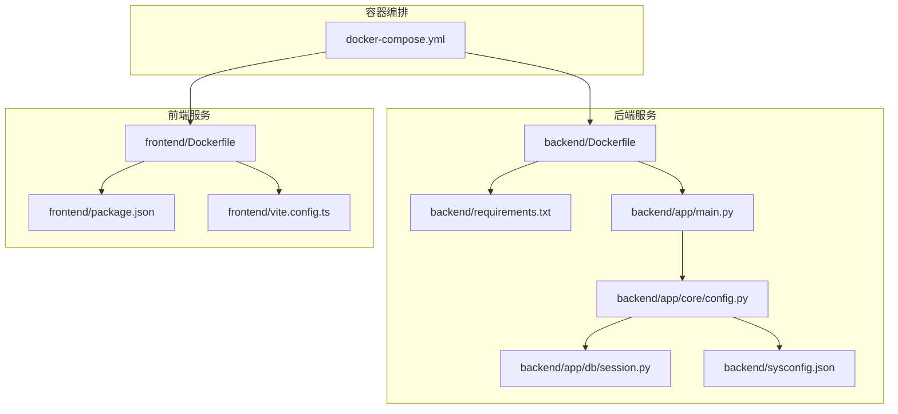
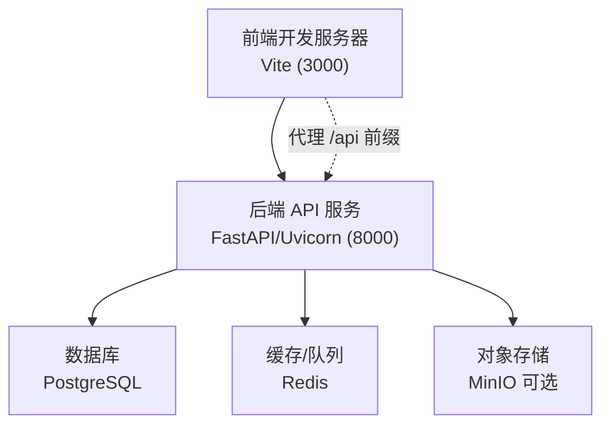
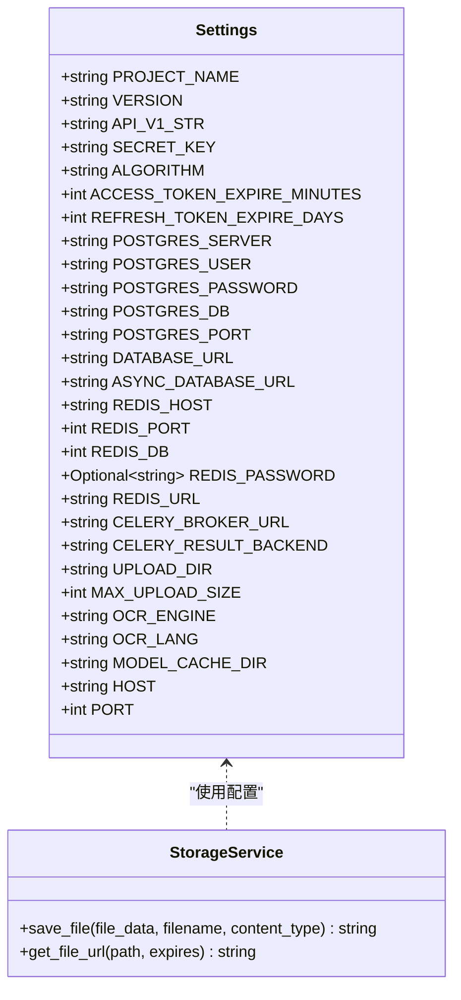
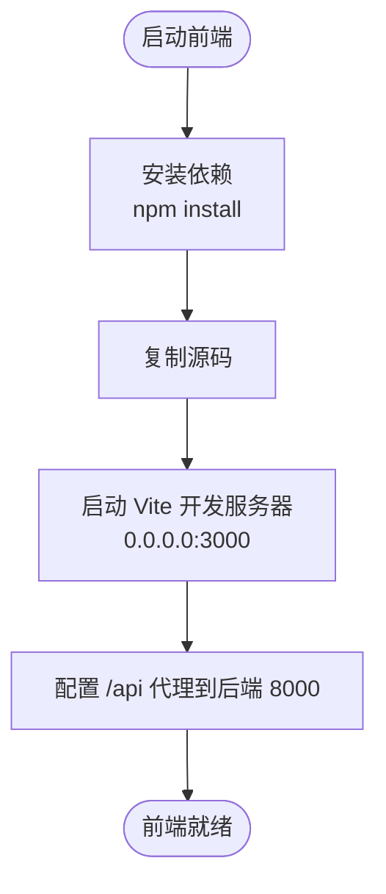
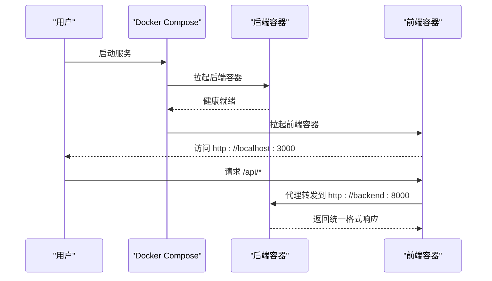
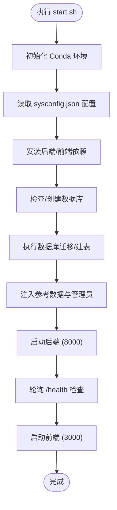
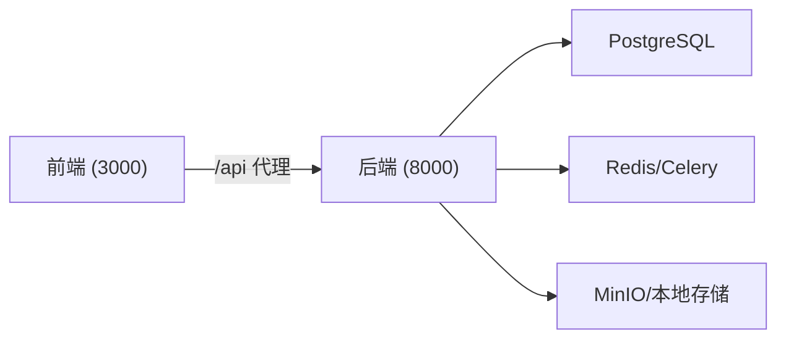

# 容器化部署

<cite>
**本文引用的文件**
- [docker-compose.yml](file://docker-compose.yml)
- [start.sh](file://start.sh)
- [backend/Dockerfile](file://backend/Dockerfile)
- [frontend/Dockerfile](file://frontend/Dockerfile)
- [backend/requirements.txt](file://backend/requirements.txt)
- [backend/app/main.py](file://backend/app/main.py)
- [backend/app/core/config.py](file://backend/app/core/config.py)
- [backend/app/db/session.py](file://backend/app/db/session.py)
- [backend/app/services/storage.py](file://backend/app/services/storage.py)
- [frontend/package.json](file://frontend/package.json)
- [frontend/vite.config.ts](file://frontend/vite.config.ts)
- [backend/sysconfig.json](file://backend/sysconfig.json)
</cite>

## 目录
1. [简介](#简介)
2. [项目结构](#项目结构)
3. [核心组件](#核心组件)
4. [架构总览](#架构总览)
5. [组件详解](#组件详解)
6. [依赖关系分析](#依赖关系分析)
7. [性能与资源考虑](#性能与资源考虑)
8. [故障排查指南](#故障排查指南)
9. [结论](#结论)
10. [附录](#附录)

## 简介
本文件面向瑞珹教育管理系统（后端基于 FastAPI，前端基于 React/Vite）的容器化部署，围绕 Docker Compose 编排、镜像构建、服务间依赖与启动顺序、开发与生产差异配置、一键启动脚本使用与调试技巧进行系统化说明。读者无需深入技术背景即可理解如何在本地快速拉起整套系统，并掌握在容器环境中进行调试与优化的方法。

## 项目结构
系统采用前后端分离的多服务编排模式，通过 Docker Compose 将后端 API 服务与前端开发服务器组合在同一网络内，便于代理调用与联调。

**图表来源**
- [docker-compose.yml:1-33](file://docker-compose.yml#L1-L33)
- [backend/Dockerfile:1-11](file://backend/Dockerfile#L1-L11)
- [frontend/Dockerfile:1-11](file://frontend/Dockerfile#L1-L11)
- [backend/requirements.txt:1-27](file://backend/requirements.txt#L1-L27)
- [backend/app/main.py:1-52](file://backend/app/main.py#L1-L52)
- [backend/app/core/config.py:1-98](file://backend/app/core/config.py#L1-L98)
- [backend/app/db/session.py:1-26](file://backend/app/db/session.py#L1-L26)
- [backend/sysconfig.json:1-48](file://backend/sysconfig.json#L1-L48)
- [frontend/package.json:1-38](file://frontend/package.json#L1-L38)
- [frontend/vite.config.ts:1-17](file://frontend/vite.config.ts#L1-L17)

**章节来源**
- [docker-compose.yml:1-33](file://docker-compose.yml#L1-L33)
- [backend/Dockerfile:1-11](file://backend/Dockerfile#L1-L11)
- [frontend/Dockerfile:1-11](file://frontend/Dockerfile#L1-L11)

## 核心组件
- 后端 FastAPI 服务
  - 基于 Python 3.12 slim 镜像，安装 requirements.txt 中声明的依赖，以 Uvicorn 启动应用入口。
  - 通过配置模块加载数据库、Redis、Celery、上传目录等参数；提供统一响应包装中间件与健康检查接口。
- 前端 React 应用
  - 基于 Node.js 22 Alpine 镜像，安装 package.json 中依赖，使用 Vite 开发服务器，端口 3000。
  - 通过 Vite 代理将 /api 前缀转发到后端 8000 端口，实现跨域联调。
- Docker Compose 编排
  - 后端映射 8000 端口，挂载后端源码与 SQLite 数据库文件；设置安全与认证相关环境变量。
  - 前端映射 3000 端口，挂载前端 src 目录实现热更新；声明对后端的依赖，保证启动顺序。
  - 命令行分别指定开发模式下的启动参数（后端 reload，前端 dev host）。

**章节来源**
- [backend/Dockerfile:1-11](file://backend/Dockerfile#L1-L11)
- [backend/requirements.txt:1-27](file://backend/requirements.txt#L1-L27)
- [backend/app/main.py:1-52](file://backend/app/main.py#L1-L52)
- [backend/app/core/config.py:1-98](file://backend/app/core/config.py#L1-L98)
- [frontend/Dockerfile:1-11](file://frontend/Dockerfile#L1-L11)
- [frontend/package.json:1-38](file://frontend/package.json#L1-L38)
- [frontend/vite.config.ts:1-17](file://frontend/vite.config.ts#L1-L17)
- [docker-compose.yml:1-33](file://docker-compose.yml#L1-L33)

## 架构总览
下图展示容器化部署的整体交互：前端开发服务器通过 Vite 代理访问后端 API；后端根据配置模块动态拼接数据库连接串，使用异步 SQLAlchemy 会话；文件上传支持本地目录或 MinIO 存储。

**图表来源**
- [frontend/vite.config.ts:1-17](file://frontend/vite.config.ts#L1-L17)
- [backend/app/core/config.py:55-76](file://backend/app/core/config.py#L55-L76)
- [backend/app/db/session.py:1-26](file://backend/app/db/session.py#L1-L26)
- [backend/app/services/storage.py:1-55](file://backend/app/services/storage.py#L1-L55)

## 组件详解

### 后端服务（FastAPI）
- 镜像与构建
  - 基于官方 Python 3.12 slim 镜像，工作目录设为 /app。
  - 先复制依赖清单并一次性安装，再复制全部源码。
  - 默认 CMD 直接启动 Uvicorn，监听 0.0.0.0:8000。
- 配置加载与数据库连接
  - 配置模块从 sysconfig.json 读取数据库参数，并允许通过环境变量覆盖敏感字段。
  - 提供同步与异步数据库连接串，异步会话工厂用于业务层依赖注入。
- 健康检查与统一响应
  - 提供 /health 接口返回健康状态。
  - 通过中间件统一包装 API 响应格式，便于前端消费。
- 文件存储
  - 支持 MinIO 或本地目录两种存储后端，自动降级。

**图表来源**
- [backend/app/core/config.py:36-98](file://backend/app/core/config.py#L36-L98)
- [backend/app/services/storage.py:1-55](file://backend/app/services/storage.py#L1-L55)

**章节来源**
- [backend/Dockerfile:1-11](file://backend/Dockerfile#L1-L11)
- [backend/requirements.txt:1-27](file://backend/requirements.txt#L1-L27)
- [backend/app/main.py:1-52](file://backend/app/main.py#L1-L52)
- [backend/app/core/config.py:1-98](file://backend/app/core/config.py#L1-L98)
- [backend/app/db/session.py:1-26](file://backend/app/db/session.py#L1-L26)
- [backend/app/services/storage.py:1-55](file://backend/app/services/storage.py#L1-L55)

### 前端服务（React/Vite）
- 镜像与构建
  - 基于 Node.js 22 Alpine 镜像，工作目录 /app。
  - 复制包清单后安装依赖，再复制源码。
  - 默认 CMD 启动 Vite 开发服务器，绑定 0.0.0.0。
- 代理与端口
  - Vite 服务器端口 3000，默认代理 /api 到后端 8000，解决开发期跨域问题。
- 依赖与脚本
  - package.json 定义了 dev/build/lint/preview 脚本，开发期使用 dev。

**图表来源**
- [frontend/Dockerfile:1-11](file://frontend/Dockerfile#L1-L11)
- [frontend/package.json:1-38](file://frontend/package.json#L1-L38)
- [frontend/vite.config.ts:1-17](file://frontend/vite.config.ts#L1-L17)

**章节来源**
- [frontend/Dockerfile:1-11](file://frontend/Dockerfile#L1-L11)
- [frontend/package.json:1-38](file://frontend/package.json#L1-L38)
- [frontend/vite.config.ts:1-17](file://frontend/vite.config.ts#L1-L17)

### Docker Compose 编排与启动流程
- 服务定义
  - backend：构建上下文为 ./backend，端口映射 8000:8000，挂载后端源码与 SQLite 数据库文件，设置安全与认证相关环境变量，命令行启动 Uvicorn 并启用热重载。
  - frontend：构建上下文为 ./frontend，端口映射 3000:3000，挂载前端 src 目录，声明 depends_on: backend，命令行启动 Vite 开发服务器。
- 启动顺序
  - 由于 frontend 显式 depends_on backend，Compose 会在后端容器就绪后再启动前端容器，减少前端首次请求 502/连接失败的概率。
- 卷挂载与网络
  - 后端挂载源码与数据库文件，便于开发期直接修改代码与持久化数据。
  - 前端挂载 src 目录，实现热更新。
  - 两者共享 Compose 默认网络，Vite 代理可直接通过服务名访问后端 API。

**图表来源**
- [docker-compose.yml:1-33](file://docker-compose.yml#L1-L33)
- [frontend/vite.config.ts:8-13](file://frontend/vite.config.ts#L8-L13)

**章节来源**
- [docker-compose.yml:1-33](file://docker-compose.yml#L1-L33)

### 开发环境与生产环境差异
- 开发环境
  - 后端启用 Uvicorn 热重载，挂载后端源码与数据库文件，便于边改边看。
  - 前端挂载 src 目录，Vite 代理到后端 8000。
  - 环境变量包含密钥与认证参数示例，需在生产环境替换。
- 生产环境建议
  - 后端
    - 固定镜像版本，禁用热重载，使用非 root 用户与只读根文件系统。
    - 使用外部数据库（如 PostgreSQL），通过环境变量配置连接串。
    - 配置健康检查与重启策略，暴露 /health 端点。
    - 设置只读卷挂载，敏感配置通过密文管理。
  - 前端
    - 使用 Nginx/反向代理提供静态资源，开启 Gzip/缓存头。
    - 将 /api 前缀代理到后端服务域名，避免硬编码 IP。
  - 通用
    - 使用独立网络隔离服务，限制暴露端口。
    - 配置日志聚合与监控告警。

**章节来源**
- [docker-compose.yml:8-32](file://docker-compose.yml#L8-L32)
- [backend/app/main.py:50-52](file://backend/app/main.py#L50-L52)
- [backend/app/core/config.py:55-76](file://backend/app/core/config.py#L55-L76)

### 一键启动脚本使用指南
- 功能概览
  - 自动检测/创建 Conda 环境，安装后端依赖与前端依赖。
  - 读取 sysconfig.json 获取数据库配置，校验并创建数据库。
  - 执行 Alembic 迁移或直接建表，注入参考数据与系统管理员账号。
  - 启动后端（8000）与前端（3000），并轮询健康检查与页面可用性。
- 使用步骤
  - 确保系统已安装 PostgreSQL，并在 sysconfig.json 中配置正确连接信息。
  - 执行脚本，等待后端健康检查通过与前端页面可用。
  - 在浏览器打开前端地址与后端 API 文档地址进行验证。
- 注意事项
  - 若端口被占用，脚本会尝试清理残留进程。
  - 如后端启动超时，检查后端日志与数据库连通性。

**图表来源**
- [start.sh:1-359](file://start.sh#L1-L359)
- [backend/sysconfig.json:1-48](file://backend/sysconfig.json#L1-L48)

**章节来源**
- [start.sh:1-359](file://start.sh#L1-L359)

### 容器调试技巧
- 查看日志
  - 使用 Compose 日志流查看后端/前端输出，定位启动异常与运行期错误。
- 进入容器
  - 进入后端容器执行数据库迁移、数据查询或临时修复。
  - 进入前端容器检查依赖安装与代理配置。
- 端口与网络
  - 确认宿主机端口未被占用；若使用自定义网络，注意服务间 DNS 名称（如 backend）。
- 健康检查
  - 通过 /health 接口判断后端是否真正可用；前端页面可用性可通过轮询判断。
- 代理与跨域
  - 确认 Vite 代理规则正确，/api 前缀能转发到后端 8000。

**章节来源**
- [docker-compose.yml:30-32](file://docker-compose.yml#L30-L32)
- [backend/app/main.py:50-52](file://backend/app/main.py#L50-L52)
- [frontend/vite.config.ts:8-13](file://frontend/vite.config.ts#L8-L13)

## 依赖关系分析
- 组件耦合
  - 前端对后端 API 的依赖通过 /api 代理实现，耦合点集中在路由前缀与目标主机。
  - 后端对数据库、缓存/队列、对象存储的依赖通过配置模块集中管理，降低硬编码风险。
- 启动顺序
  - Compose 通过 depends_on 控制容器启动顺序；实际业务可用性需结合健康检查。
- 外部依赖
  - PostgreSQL 与 Redis/Celery 作为后端运行时依赖，需在生产环境中独立部署或使用服务网格。

**图表来源**
- [frontend/vite.config.ts:8-13](file://frontend/vite.config.ts#L8-L13)
- [backend/app/core/config.py:55-76](file://backend/app/core/config.py#L55-L76)
- [backend/app/services/storage.py:1-55](file://backend/app/services/storage.py#L1-L55)

**章节来源**
- [frontend/vite.config.ts:1-17](file://frontend/vite.config.ts#L1-L17)
- [backend/app/core/config.py:1-98](file://backend/app/core/config.py#L1-L98)
- [backend/app/services/storage.py:1-55](file://backend/app/services/storage.py#L1-L55)

## 性能与资源考虑
- 镜像体积与启动速度
  - 使用 slim/alpine 基础镜像，减少镜像体积与下载时间。
  - 依赖安装阶段合并 COPY 与 RUN，利用 Docker 缓存提升二次构建效率。
- 运行时性能
  - 后端使用异步 SQLAlchemy 与连接池，建议在生产环境配置连接池大小与超时。
  - 前端构建产物由反向代理提供，减少容器内静态资源处理开销。
- 存储与并发
  - 对象存储优先使用 MinIO，便于横向扩展与备份；本地存储仅适用于开发测试。
  - OCR 与阅卷等计算密集型任务建议通过 Celery 异步化，配合 Redis 作为消息中间件。

[本节为通用指导，不涉及具体文件分析]

## 故障排查指南
- 后端无法启动
  - 检查数据库连接串与凭据；确认数据库已创建且可连通。
  - 查看 /health 接口返回，定位启动事件中的异常。
- 前端代理失败
  - 确认 Vite 代理配置指向后端服务名与端口；检查 Compose 网络与服务名。
- 端口冲突
  - 脚本会尝试清理 8000/3000 端口占用；必要时手动释放或调整映射。
- 权限与卷挂载
  - 确认挂载目录权限；SQLite 文件挂载需确保写权限。
- 健康检查与超时
  - 后端启动后会进行健康检查；若超时，检查依赖服务（数据库、缓存）状态。

**章节来源**
- [start.sh:159-196](file://start.sh#L159-L196)
- [backend/app/main.py:50-52](file://backend/app/main.py#L50-L52)
- [frontend/vite.config.ts:8-13](file://frontend/vite.config.ts#L8-L13)

## 结论
通过 Docker Compose 将后端 FastAPI 与前端 Vite 组织为统一编排单元，既满足开发期的热更新与联调需求，也为生产环境提供了清晰的改造方向。建议在生产中固定镜像版本、拆分数据库与缓存、引入健康检查与代理层，并通过配置中心与密文管理替换示例环境变量。

[本节为总结性内容，不涉及具体文件分析]

## 附录
- 关键配置要点
  - 后端环境变量：数据库类型、数据库路径、密钥算法与过期时间等。
  - 前端代理：/api 前缀代理至后端 8000。
  - sysconfig.json：数据库连接、LLM/OCR/导出等系统参数。
- 建议的生产配置项
  - 数据库：使用外部 PostgreSQL 实例，配置连接池与只读副本。
  - 缓存/队列：使用 Redis 集群，Celery 任务队列独立部署。
  - 存储：MinIO 集群，开启备份与快照。
  - 网络与安全：最小权限原则、TLS 终止、WAF/限流。

**章节来源**
- [docker-compose.yml:13-20](file://docker-compose.yml#L13-L20)
- [frontend/vite.config.ts:8-13](file://frontend/vite.config.ts#L8-L13)
- [backend/sysconfig.json:1-48](file://backend/sysconfig.json#L1-L48)