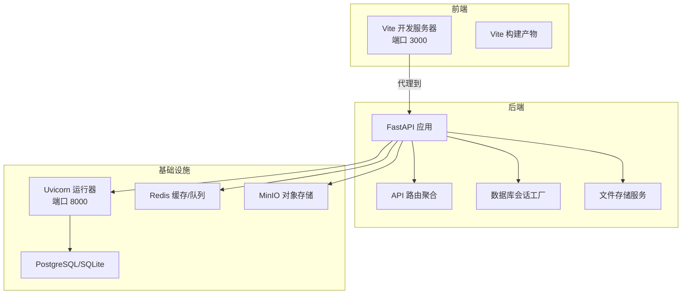
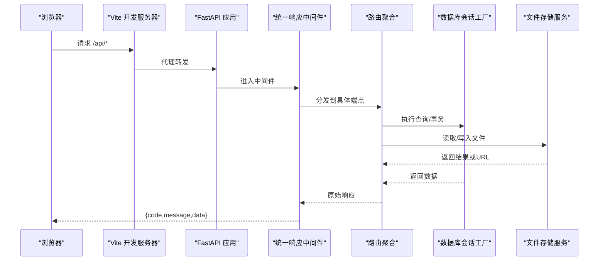
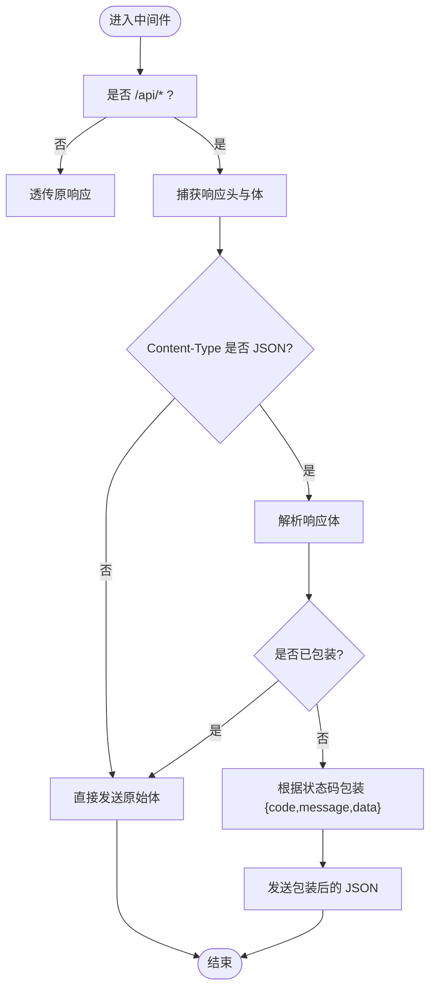
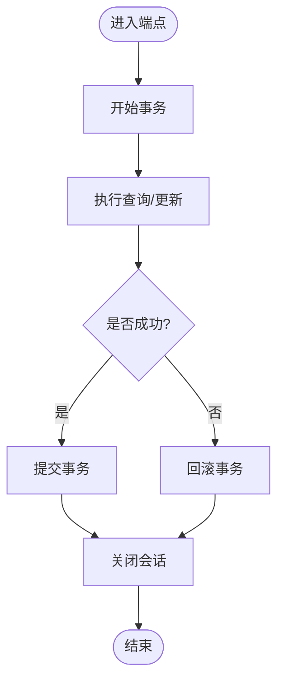
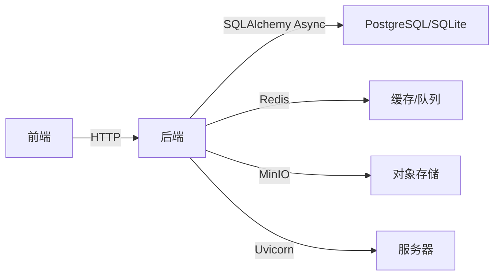

# 性能优化

<cite>
**本文引用的文件**
- [backend/app/main.py](file://backend/app/main.py)
- [backend/app/core/config.py](file://backend/app/core/config.py)
- [backend/app/db/session.py](file://backend/app/db/session.py)
- [backend/app/core/response.py](file://backend/app/core/response.py)
- [backend/app/api/v1/api.py](file://backend/app/api/v1/api.py)
- [backend/app/services/storage.py](file://backend/app/services/storage.py)
- [docker-compose.yml](file://docker-compose.yml)
- [backend/Dockerfile](file://backend/Dockerfile)
- [frontend/Dockerfile](file://frontend/Dockerfile)
- [frontend/vite.config.ts](file://frontend/vite.config.ts)
- [frontend/package.json](file://frontend/package.json)
</cite>

## 目录
1. [简介](#简介)
2. [项目结构](#项目结构)
3. [核心组件](#核心组件)
4. [架构总览](#架构总览)
5. [详细组件分析](#详细组件分析)
6. [依赖分析](#依赖分析)
7. [性能考虑](#性能考虑)
8. [故障排查指南](#故障排查指南)
9. [结论](#结论)
10. [附录](#附录)

## 简介
本文件面向“瑞珹教育管理系统”的性能优化与运维实践，围绕后端（FastAPI + SQLAlchemy Async + PostgreSQL/SQLite）、前端（React + Vite）以及容器化部署进行系统性梳理。重点覆盖以下方面：
- 应用性能优化策略：中间件、路由组织、请求处理路径
- 数据库查询优化：异步连接池、事务边界、批量与单次查询权衡
- 缓存机制配置：Redis/Celery 集成与模型缓存目录
- 前端资源优化：构建产物、代理与开发体验
- 服务器性能调优、负载均衡与 CDN 使用建议
- 内存管理、并发处理与响应时间优化
- 性能测试方法、瓶颈分析工具与优化效果评估
- 容量规划、扩缩容策略与成本优化方案

## 项目结构
系统采用前后端分离架构，通过 Docker Compose 启动本地开发环境，后端提供 REST API，前端通过 Vite 开发服务器与后端交互。

图表来源
- [docker-compose.yml:1-33](file://docker-compose.yml#L1-L33)
- [backend/app/main.py:1-52](file://backend/app/main.py#L1-L52)
- [backend/app/api/v1/api.py:1-26](file://backend/app/api/v1/api.py#L1-L26)
- [backend/app/db/session.py:1-26](file://backend/app/db/session.py#L1-L26)
- [backend/app/services/storage.py:1-55](file://backend/app/services/storage.py#L1-L55)

章节来源
- [docker-compose.yml:1-33](file://docker-compose.yml#L1-L33)
- [backend/app/main.py:1-52](file://backend/app/main.py#L1-L52)
- [frontend/vite.config.ts:1-17](file://frontend/vite.config.ts#L1-L17)

## 核心组件
- 应用入口与中间件
  - 统一响应包装中间件：对 /api/* 路径返回体进行统一 {code,message,data} 包装，避免重复封装与错误码不一致问题。
  - CORS 中间件：允许跨域访问，生产环境建议限制具体来源。
- 配置中心
  - 数据库连接串（同步/异步）、Redis、Celery、上传目录、OCR 与模型缓存目录等集中管理。
- 数据库层
  - 异步引擎与会话工厂，支持事务边界控制与异常回滚。
- 文件存储
  - 支持 MinIO 或本地文件系统，提供预签名 URL 生成能力。
- 前端工程
  - Vite 开发服务器与代理；React 生态依赖与构建脚本。

章节来源
- [backend/app/core/response.py:1-124](file://backend/app/core/response.py#L1-L124)
- [backend/app/core/config.py:1-98](file://backend/app/core/config.py#L1-L98)
- [backend/app/db/session.py:1-26](file://backend/app/db/session.py#L1-L26)
- [backend/app/services/storage.py:1-55](file://backend/app/services/storage.py#L1-L55)
- [frontend/vite.config.ts:1-17](file://frontend/vite.config.ts#L1-L17)
- [frontend/package.json:1-38](file://frontend/package.json#L1-L38)

## 架构总览
后端基于 FastAPI 提供 REST 接口，路由按功能模块聚合，统一响应中间件确保输出一致性。数据库采用 SQLAlchemy Async，支持异步查询与事务控制。文件上传可选 MinIO 或本地存储，并提供预签名 URL。前端通过 Vite 代理到后端，开发时热更新提升效率。

图表来源
- [backend/app/core/response.py:1-124](file://backend/app/core/response.py#L1-L124)
- [backend/app/api/v1/api.py:1-26](file://backend/app/api/v1/api.py#L1-L26)
- [backend/app/db/session.py:1-26](file://backend/app/db/session.py#L1-L26)
- [backend/app/services/storage.py:1-55](file://backend/app/services/storage.py#L1-L55)

## 详细组件分析

### 统一响应中间件
- 设计目标：避免在各端点重复封装响应，统一错误码与消息格式，减少客户端解析复杂度。
- 实现要点：
  - 仅对 /api/* 路径生效，非 API 路径透传。
  - 拦截响应体，判断 JSON 类型并进行包装；若已包装则透传。
  - 异常兜底：未开始响应时返回标准错误体，避免客户端接收半成品响应。
- 性能影响：
  - 通过 ASGI send() 直接发送，避免额外 JSONResponse 序列化开销。
  - 仅在 JSON 响应上做解包与重打包，其他类型透传。

图表来源
- [backend/app/core/response.py:1-124](file://backend/app/core/response.py#L1-L124)

章节来源
- [backend/app/core/response.py:1-124](file://backend/app/core/response.py#L1-L124)

### 路由聚合与端点组织
- 路由聚合：将各业务模块端点统一挂载到 api_router，便于维护与扩展。
- 端点分布：认证、学科、题目、试卷、阅卷、错题本、自学习、知识树、班级、统计、学生、通知等模块化组织。
- 性能建议：
  - 将高频端点置于更短路径前缀下，减少匹配开销。
  - 控制每个端点的查询复杂度，必要时拆分接口或引入分页/筛选参数。

章节来源
- [backend/app/api/v1/api.py:1-26](file://backend/app/api/v1/api.py#L1-L26)

### 数据库会话与事务
- 异步引擎：使用异步驱动连接数据库，降低阻塞等待。
- 会话工厂：expire_on_commit=False 减少后续查询的过期检查开销。
- 事务边界：端点内显式开启/提交/回滚，异常时自动回滚，保证一致性。
- 性能建议：
  - 批量插入/更新时合并 SQL，减少往返次数。
  - 大查询使用分页与索引，避免全表扫描。
  - 长事务尽量缩短，避免锁竞争。

图表来源
- [backend/app/db/session.py:1-26](file://backend/app/db/session.py#L1-L26)

章节来源
- [backend/app/db/session.py:1-26](file://backend/app/db/session.py#L1-L26)

### 文件存储与预签名 URL
- 存储选择：优先 MinIO，降级到本地文件系统，统一对外接口。
- URL 生成：MinIO 场景返回预签名 URL；本地场景返回相对路径。
- 性能建议：
  - 大文件上传启用分片与断点续传（如需）。
  - 静态资源走 CDN，减少后端带宽压力。
  - 对热点文件设置合理缓存头与过期策略。

章节来源
- [backend/app/services/storage.py:1-55](file://backend/app/services/storage.py#L1-L55)

### 前端开发与构建
- 开发代理：Vite 将 /api 代理到后端，简化跨域与调试。
- 依赖生态：React、Ant Design、Axios、React Router、Zustand 等。
- 构建脚本：TypeScript 编译与 Vite 构建，生成静态资源。
- 性能建议：
  - 启用代码分割与路由级懒加载，减少首屏体积。
  - 图片与静态资源压缩与按需加载。
  - 生产环境启用缓存与 Gzip/Brotli 压缩。

章节来源
- [frontend/vite.config.ts:1-17](file://frontend/vite.config.ts#L1-L17)
- [frontend/package.json:1-38](file://frontend/package.json#L1-L38)

## 依赖分析
- 后端依赖
  - FastAPI：提供高性能 ASGI 应用框架。
  - SQLAlchemy Async：异步 ORM，支持高并发查询。
  - Uvicorn：ASGI 服务器，生产可替换为更高性能的服务器。
  - Redis/Celery：用于缓存与异步任务队列。
- 前端依赖
  - React + Ant Design：组件化 UI，利于性能优化与复用。
  - Vite：快速开发与构建工具链。
- 容器化
  - Docker Compose：本地联调后端与前端。
  - Dockerfile：最小镜像，减少启动与运行时开销。

图表来源
- [backend/app/core/config.py:63-86](file://backend/app/core/config.py#L63-L86)
- [backend/app/services/storage.py:10-22](file://backend/app/services/storage.py#L10-L22)
- [docker-compose.yml:1-33](file://docker-compose.yml#L1-L33)

章节来源
- [backend/app/core/config.py:63-86](file://backend/app/core/config.py#L63-L86)
- [backend/app/services/storage.py:10-22](file://backend/app/services/storage.py#L10-L22)
- [docker-compose.yml:1-33](file://docker-compose.yml#L1-L33)

## 性能考虑

### 应用性能优化策略
- 中间件与路由
  - 统一响应中间件减少重复封装，提升一致性与可维护性。
  - 路由聚合降低耦合，便于按模块扩展与限流。
- 并发与异步
  - 使用异步数据库连接，提高并发吞吐。
  - 控制并发数与超时，避免资源争用。
- 错误处理
  - 异常兜底中间件确保错误响应标准化，避免客户端解析异常。

章节来源
- [backend/app/core/response.py:1-124](file://backend/app/core/response.py#L1-L124)
- [backend/app/api/v1/api.py:1-26](file://backend/app/api/v1/api.py#L1-L26)
- [backend/app/db/session.py:1-26](file://backend/app/db/session.py#L1-L26)

### 数据库查询优化
- 连接与会话
  - 异步引擎与会话工厂配合，减少阻塞。
  - expire_on_commit=False 降低后续查询开销。
- 查询策略
  - 使用分页与索引，避免全表扫描。
  - 批量写入合并 SQL，减少往返。
  - 长事务缩短，避免锁竞争。
- 索引与模式
  - 在高频过滤字段建立索引。
  - 避免 N+1 查询，使用 selectinload/join 等优化关联查询。

章节来源
- [backend/app/db/session.py:1-26](file://backend/app/db/session.py#L1-L26)

### 缓存机制配置
- Redis
  - 作为缓存与 Celery 结果后端，建议独立实例或集群。
  - 对热点数据设置 TTL，避免无限增长。
- 模型缓存
  - 模型缓存目录集中管理，避免重复下载与加载。
- 前端缓存
  - 静态资源版本化与长缓存策略，结合 CDN 提升命中率。

章节来源
- [backend/app/core/config.py:63-86](file://backend/app/core/config.py#L63-L86)
- [frontend/vite.config.ts:1-17](file://frontend/vite.config.ts#L1-L17)

### 前端资源优化、代码分割与懒加载
- 代码分割
  - 按路由拆分包，减少首屏体积。
  - 动态导入组件与页面，延迟加载非关键资源。
- 构建优化
  - 生产构建启用压缩与 Tree Shaking。
  - 图片与字体资源压缩与 WebP/AVIF 转换。
- 开发体验
  - Vite 代理简化跨域，热更新提升迭代速度。

章节来源
- [frontend/vite.config.ts:1-17](file://frontend/vite.config.ts#L1-L17)
- [frontend/package.json:1-38](file://frontend/package.json#L1-L38)

### 服务器性能调优、负载均衡与 CDN
- 服务器
  - 生产环境使用多进程或多实例部署，结合反向代理。
  - 调整 Uvicorn 工作进程与线程数，匹配 CPU 核心数。
- 负载均衡
  - 使用 Nginx/HAProxy 做健康检查与流量分发。
- CDN
  - 静态资源与图片走 CDN，降低源站压力。
  - 对动态接口设置合理的缓存策略与失效机制。

章节来源
- [backend/app/main.py:1-52](file://backend/app/main.py#L1-L52)
- [docker-compose.yml:1-33](file://docker-compose.yml#L1-L33)

### 内存管理、并发处理与响应时间优化
- 内存
  - 控制单请求对象生命周期，及时释放临时变量。
  - 对大对象使用流式处理，避免一次性加载。
- 并发
  - 异步数据库与 I/O 密集场景优先使用异步。
  - 合理设置连接池大小与超时，避免资源枯竭。
- 响应时间
  - 通过中间件与路由日志记录耗时，定位慢点。
  - 对热点接口增加只读副本或缓存层。

章节来源
- [backend/app/core/response.py:1-124](file://backend/app/core/response.py#L1-L124)
- [backend/app/db/session.py:1-26](file://backend/app/db/session.py#L1-L26)

### 性能测试方法、瓶颈分析工具与优化效果评估
- 测试方法
  - 压力测试：JMeter/K6/Loader.io，模拟并发用户与峰值流量。
  - 端到端测试：Playwright/Lighthouse，评估首屏与交互性能。
- 瓶颈分析
  - 后端：APM（如 Py-Spy/Scout APM）采样 CPU 与火焰图。
  - 数据库：EXPLAIN/ANALYZE 分析慢查询，补充索引。
  - 前端：Chrome DevTools Performance/Network 面板分析资源与渲染。
- 效果评估
  - 关键指标：P95/P99 延迟、吞吐量、错误率、缓存命中率。
  - A/B 对比：灰度发布对比优化前后差异。

章节来源
- [backend/app/core/response.py:1-124](file://backend/app/core/response.py#L1-L124)
- [backend/app/db/session.py:1-26](file://backend/app/db/session.py#L1-L26)

### 容量规划、扩缩容策略与成本优化
- 容量规划
  - 依据 QPS、并发用户数与峰值内存/磁盘占用估算资源。
  - 数据库读写分离与分库分表策略，按业务维度拆分。
- 扩缩容
  - 自动扩缩容：Kubernetes HPA/VPA，结合 CPU/内存与自定义指标。
  - 状态管理：无状态后端，有状态数据（数据库/对象存储）独立扩缩。
- 成本优化
  - 云资源：预留实例/Spot 实例，冷热数据分层存储。
  - CDN 与对象存储：按流量与请求计费，优化命中率与缓存策略。

章节来源
- [backend/app/core/config.py:63-86](file://backend/app/core/config.py#L63-L86)
- [backend/app/services/storage.py:1-55](file://backend/app/services/storage.py#L1-L55)

## 故障排查指南
- 健康检查
  - 根路径与健康检查接口用于容器编排与负载均衡探活。
- 日志与监控
  - 中间件异常兜底确保错误响应标准化，便于前端与运维定位。
  - 建议接入统一日志与告警平台，设置延迟与错误率阈值。
- 数据库连接
  - 检查连接池大小与超时设置，避免连接泄漏与饥饿。
- 文件存储
  - MinIO 可用性与网络延迟，本地存储磁盘空间与权限。

章节来源
- [backend/app/main.py:45-52](file://backend/app/main.py#L45-L52)
- [backend/app/core/response.py:91-101](file://backend/app/core/response.py#L91-L101)
- [backend/app/db/session.py:18-26](file://backend/app/db/session.py#L18-L26)
- [backend/app/services/storage.py:10-22](file://backend/app/services/storage.py#L10-L22)

## 结论
本项目在架构层面已具备良好的异步与中间件基础，建议在以下方向持续优化：
- 数据库：完善索引、分页与只读副本，减少主库压力。
- 缓存：Redis/Celery 规范化配置，热点数据预热与失效策略。
- 前端：路由级懒加载与静态资源 CDN，提升首屏与交互性能。
- 运维：容器化与自动化部署，结合 APM 与监控体系进行持续优化。

## 附录
- 开发与运行
  - 本地开发：Docker Compose 启动后端与前端，Vite 代理到后端。
  - 生产部署：容器镜像构建与多实例部署，结合负载均衡与 CDN。
- 配置参考
  - 数据库、Redis、上传目录、OCR 与模型缓存目录集中于配置中心，便于环境切换。

章节来源
- [docker-compose.yml:1-33](file://docker-compose.yml#L1-L33)
- [backend/Dockerfile:1-11](file://backend/Dockerfile#L1-L11)
- [frontend/Dockerfile:1-11](file://frontend/Dockerfile#L1-L11)
- [backend/app/core/config.py:1-98](file://backend/app/core/config.py#L1-L98)