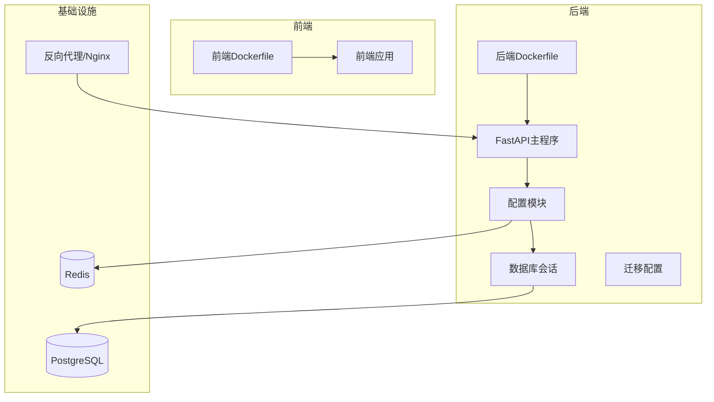
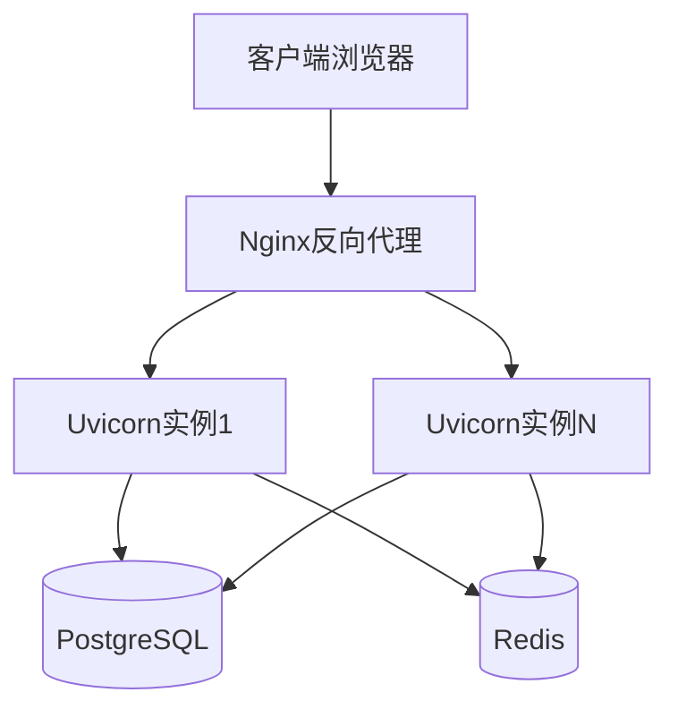
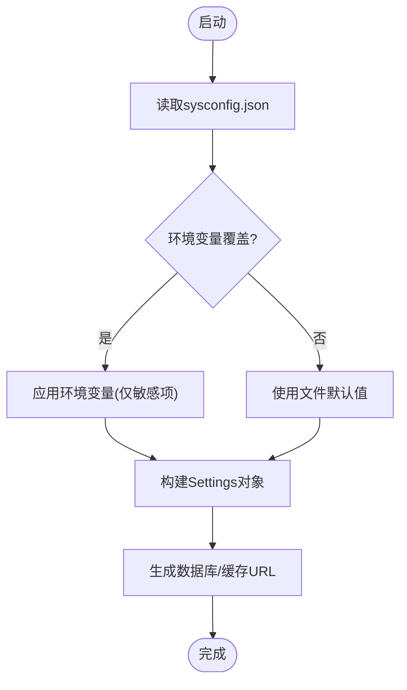
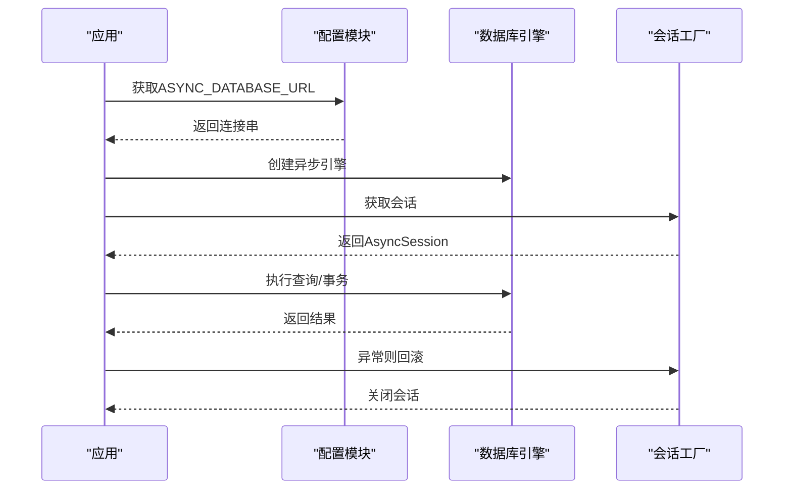
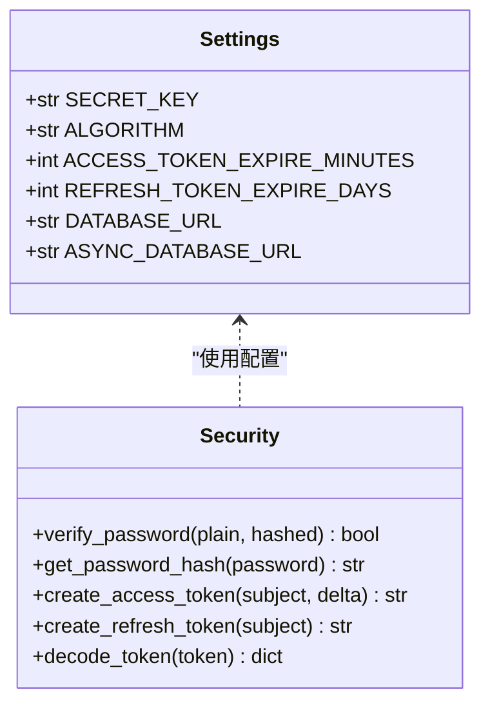
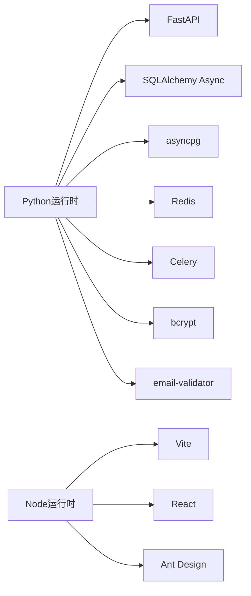

# 生产环境配置

<cite>
**本文引用的文件**
- [backend/app/core/config.py](file://backend/app/core/config.py)
- [backend/sysconfig.json](file://backend/sysconfig.json)
- [docker-compose.yml](file://docker-compose.yml)
- [backend/Dockerfile](file://backend/Dockerfile)
- [frontend/Dockerfile](file://frontend/Dockerfile)
- [backend/alembic.ini](file://backend/alembic.ini)
- [backend/requirements.txt](file://backend/requirements.txt)
- [start.sh](file://start.sh)
- [backend/app/core/security.py](file://backend/app/core/security.py)
- [backend/app/db/session.py](file://backend/app/db/session.py)
- [backend/app/main.py](file://backend/app/main.py)
- [backend/app/api/v1/endpoints/database.py](file://backend/app/api/v1/endpoints/database.py)
- [backend/app/services/config_service.py](file://backend/app/services/config_service.py)
</cite>

## 目录
1. [简介](#简介)
2. [项目结构](#项目结构)
3. [核心组件](#核心组件)
4. [架构概览](#架构概览)
5. [详细组件分析](#详细组件分析)
6. [依赖分析](#依赖分析)
7. [性能考虑](#性能考虑)
8. [故障排除指南](#故障排除指南)
9. [结论](#结论)
10. [附录](#附录)

## 简介
本文件面向生产部署，系统性说明瑞珹教育管理系统的环境配置、数据库连接与安全参数设置，涵盖环境变量管理、配置文件结构与敏感信息保护策略，并对 PostgreSQL 数据库配置、SSL 证书与反向代理进行落地指导。同时提供性能调优参数、内存限制与并发设置建议，以及配置验证方法与常见错误排查流程。

## 项目结构
系统采用前后端分离架构，后端基于 FastAPI + SQLAlchemy Async + Alembic，前端基于 Vite + React。生产部署推荐通过容器编排（如 docker-compose）统一管理服务生命周期与网络拓扑。

图表来源
- [backend/Dockerfile:1-11](file://backend/Dockerfile#L1-L11)
- [frontend/Dockerfile:1-11](file://frontend/Dockerfile#L1-L11)
- [backend/app/main.py:1-52](file://backend/app/main.py#L1-L52)
- [backend/app/core/config.py:36-98](file://backend/app/core/config.py#L36-L98)
- [backend/app/db/session.py:1-26](file://backend/app/db/session.py#L1-L26)
- [backend/alembic.ini:86-90](file://backend/alembic.ini#L86-L90)

章节来源
- [backend/Dockerfile:1-11](file://backend/Dockerfile#L1-L11)
- [frontend/Dockerfile:1-11](file://frontend/Dockerfile#L1-L11)
- [docker-compose.yml:1-33](file://docker-compose.yml#L1-L33)

## 核心组件
- 配置体系：集中于后端配置模块，支持从非敏感配置文件与环境变量加载，敏感信息仅通过环境变量注入。
- 数据库层：异步 SQLAlchemy 引擎与会话工厂，支持 PostgreSQL。
- 安全层：JWT 密钥、算法与过期策略由配置模块提供；密码哈希使用 bcrypt。
- 运行时：FastAPI 提供健康检查与统一响应包装；启动事件中执行参考数据播种。
- 部署：Dockerfile 定义镜像构建；docker-compose 提供开发/演示环境编排；start.sh 提供一键启动与数据库初始化流程。

章节来源
- [backend/app/core/config.py:36-98](file://backend/app/core/config.py#L36-L98)
- [backend/app/core/security.py:1-104](file://backend/app/core/security.py#L1-L104)
- [backend/app/db/session.py:1-26](file://backend/app/db/session.py#L1-L26)
- [backend/app/main.py:1-52](file://backend/app/main.py#L1-L52)
- [start.sh:1-359](file://start.sh#L1-L359)

## 架构概览
生产环境建议采用“反向代理 + 多实例后端 + 数据库 + 缓存”的模式，以实现高可用与横向扩展。

图表来源
- [backend/app/main.py:20-27](file://backend/app/main.py#L20-L27)
- [backend/app/core/config.py:63-76](file://backend/app/core/config.py#L63-L76)
- [backend/app/db/session.py:6-15](file://backend/app/db/session.py#L6-L15)

## 详细组件分析

### 环境变量与配置文件管理
- 非敏感配置：通过 sysconfig.json 维护（如数据库连接参数、LLM/OCR/评分等业务参数），后端在启动时读取该文件并允许环境变量覆盖敏感字段。
- 敏感信息保护：数据库密码、DeepSeek API Key、JWT 密钥等通过环境变量注入，不写入 sysconfig.json；配置服务在保存前会剥离敏感字段。
- 环境文件：配置模块指定 .env 文件用于加载环境变量，便于本地开发与测试。

图表来源
- [backend/app/core/config.py:6-30](file://backend/app/core/config.py#L6-L30)
- [backend/app/services/config_service.py:73-105](file://backend/app/services/config_service.py#L73-L105)

章节来源
- [backend/app/core/config.py:6-30](file://backend/app/core/config.py#L6-L30)
- [backend/app/services/config_service.py:1-105](file://backend/app/services/config_service.py#L1-L105)
- [backend/sysconfig.json:1-48](file://backend/sysconfig.json#L1-L48)

### 数据库连接配置（PostgreSQL）
- 连接字符串：支持同步与异步两种格式，异步引擎用于高性能 I/O。
- 迁移配置：Alembic 默认使用 SQLite 路径，生产应切换为 PostgreSQL 并在部署时执行迁移。
- 连接池与会话：异步会话工厂负责事务与回滚，异常时自动回滚并关闭会话。

图表来源
- [backend/app/core/config.py:55-61](file://backend/app/core/config.py#L55-L61)
- [backend/app/db/session.py:1-26](file://backend/app/db/session.py#L1-L26)

章节来源
- [backend/app/core/config.py:48-61](file://backend/app/core/config.py#L48-L61)
- [backend/app/db/session.py:1-26](file://backend/app/db/session.py#L1-L26)
- [backend/alembic.ini:86-90](file://backend/alembic.ini#L86-L90)

### 安全参数设置（JWT与密码）
- JWT 参数：算法、密钥、访问令牌与刷新令牌有效期均来自配置模块。
- 密码哈希：bcrypt 提供安全的密码存储与校验。
- 认证流程：OAuth2 密钥流，令牌解码与用户类型校验贯穿请求链路。

图表来源
- [backend/app/core/config.py:36-46](file://backend/app/core/config.py#L36-L46)
- [backend/app/core/security.py:16-47](file://backend/app/core/security.py#L16-L47)

章节来源
- [backend/app/core/security.py:1-104](file://backend/app/core/security.py#L1-L104)
- [backend/app/core/config.py:36-46](file://backend/app/core/config.py#L36-L46)

### 缓存与队列（Redis/Celery）
- Redis：主机、端口、数据库索引与可选密码通过环境变量配置，支持连接字符串拼装。
- Celery：消息代理与结果后端默认指向 Redis，适合任务分发与状态追踪。

章节来源
- [backend/app/core/config.py:63-76](file://backend/app/core/config.py#L63-L76)

### 文件上传与OCR/MLOps参数
- 上传目录与最大尺寸：通过环境变量控制，便于在不同磁盘容量的服务器上灵活配置。
- OCR 引擎与语言：默认使用 paddleocr，语言可配置。
- LLM/评分/OCR 并发：通过 sysconfig.json 控制最大并发数与模型选择，避免资源争抢。

章节来源
- [backend/app/core/config.py:77-86](file://backend/app/core/config.py#L77-L86)
- [backend/sysconfig.json:31-42](file://backend/sysconfig.json#L31-L42)

### 反向代理与SSL配置
- 反向代理：建议在生产前置 Nginx/Traefik，统一处理 HTTPS、静态资源与跨域。
- SSL 证书：建议使用自动化 ACME（如 certbot/caddy）签发与续期，避免手动维护。
- 代理到后端：将 /api/* 转发至后端服务，静态资源交由代理处理，减少后端压力。

[本节为概念性指导，无需代码来源]

### 性能调优参数、内存限制与并发设置
- Uvicorn 并发：通过多进程/多实例提升吞吐，结合反向代理实现水平扩展。
- 连接池：根据数据库规格与负载调整连接池大小与超时，避免连接耗尽。
- Redis：合理设置过期策略与内存淘汰策略，避免缓存击穿与雪崩。
- OCR/评分并发：依据硬件能力与模型复杂度调整 sysconfig.json 中的最大并发，防止 OOM。
- 日志级别：生产环境建议提升日志级别，降低 IO 压力。

[本节为通用性能建议，无需代码来源]

## 依赖分析
- 后端依赖：FastAPI、Uvicorn、SQLAlchemy Async、asyncpg、Pydantic Settings、Redis、Celery、bcrypt、email-validator 等。
- 迁移工具：Alembic 默认使用 SQLite，生产需切换为 PostgreSQL 并执行迁移。
- 前端依赖：Vite + React + Ant Design，开发时热更新，生产打包部署。

图表来源
- [backend/requirements.txt:1-27](file://backend/requirements.txt#L1-L27)

章节来源
- [backend/requirements.txt:1-27](file://backend/requirements.txt#L1-L27)
- [backend/alembic.ini:86-90](file://backend/alembic.ini#L86-L90)

## 性能考虑
- 启动与健康检查：后端提供 /health 接口，可用于探活与滚动升级。
- 数据库监控：通过管理端接口可查看数据库版本、大小与表统计，辅助容量规划。
- 并发与限流：结合反向代理与应用层限流策略，避免突发流量冲击。

章节来源
- [backend/app/main.py:50-52](file://backend/app/main.py#L50-L52)
- [backend/app/api/v1/endpoints/database.py:106-144](file://backend/app/api/v1/endpoints/database.py#L106-L144)

## 故障排除指南
- 数据库连接失败
  - 症状：启动阶段无法连接 PostgreSQL。
  - 排查：确认 sysconfig.json 中数据库参数与环境变量覆盖是否正确；使用 psql 手动验证连接；检查防火墙与监听地址。
  - 参考路径：[start.sh:187-196](file://start.sh#L187-L196)
- Alembic 迁移失败
  - 症状：迁移命令报错或数据库表未创建。
  - 排查：确认 alembic.ini 中 sqlalchemy.url 指向 PostgreSQL；若失败，回退到直接建表逻辑；检查数据库权限。
  - 参考路径：[backend/alembic.ini:86-90](file://backend/alembic.ini#L86-L90)，[start.sh:198-217](file://start.sh#L198-L217)
- 后端服务启动超时
  - 症状：/health 无法访问或启动超时。
  - 排查：检查端口占用、依赖安装、环境变量与 sysconfig.json；查看日志输出定位异常。
  - 参考路径：[start.sh:288-303](file://start.sh#L288-L303)
- 健康检查与统一响应
  - 症状：接口返回异常或跨域问题。
  - 排查：确认 CORS 配置与中间件顺序；生产环境建议限制允许源。
  - 参考路径：[backend/app/main.py:20-27](file://backend/app/main.py#L20-L27)
- 配置保存与敏感信息泄露
  - 症状：sysconfig.json 包含敏感字段。
  - 排查：确认配置服务在保存前剥离敏感字段；敏感信息仅通过环境变量注入。
  - 参考路径：[backend/app/services/config_service.py:87-105](file://backend/app/services/config_service.py#L87-L105)

## 结论
生产环境配置的关键在于“配置分层、敏感隔离、可观测性与弹性”。通过环境变量管理敏感信息、以 sysconfig.json 管理非敏感业务参数、配合反向代理与多实例部署，可实现高可用与易维护。建议在上线前完成数据库迁移、SSL 证书部署与性能压测，并建立完善的监控与告警机制。

## 附录

### 环境变量清单（生产建议）
- 数据库相关
  - POSTGRES_SERVER：数据库主机
  - POSTGRES_PORT：数据库端口
  - POSTGRES_DB：数据库名
  - POSTGRES_USER：数据库用户
  - DATABASE_PASSWORD：数据库密码（环境变量）
- 应用安全
  - SECRET_KEY：JWT 密钥（必须强随机且保密）
  - ALGORITHM：JWT 算法（建议 HS256 或 RS256）
  - ACCESS_TOKEN_EXPIRE_MINUTES：访问令牌过期分钟数
  - REFRESH_TOKEN_EXPIRE_DAYS：刷新令牌过期天数
- 缓存与队列
  - REDIS_HOST/REDIS_PORT/REDIS_DB/REDIS_PASSWORD：Redis 连接参数
  - CELERY_BROKER_URL/CELERY_RESULT_BACKEND：Celery 代理与后端
- 文件与 OCR
  - UPLOAD_DIR：上传目录
  - MAX_UPLOAD_SIZE：最大上传字节
  - OCR_ENGINE/OCR_LANG：OCR 引擎与语言
- 其他
  - MODEL_CACHE_DIR：模型缓存目录
  - DEEPSEEK_API_KEY：DeepSeek API Key（敏感）

章节来源
- [backend/app/core/config.py:48-86](file://backend/app/core/config.py#L48-L86)
- [backend/app/services/config_service.py:13-15](file://backend/app/services/config_service.py#L13-L15)

### 配置文件结构与职责
- sysconfig.json：非敏感业务参数（数据库、LLM/OCR/评分、导出上限、系统日志级别等）
- .env：环境变量文件（与配置模块约定一致）
- alembic.ini：迁移工具配置（生产需指向 PostgreSQL）
- docker-compose.yml：开发/演示编排（生产建议使用 Kubernetes/Podman Compose）

章节来源
- [backend/sysconfig.json:1-48](file://backend/sysconfig.json#L1-L48)
- [backend/app/core/config.py:91-94](file://backend/app/core/config.py#L91-L94)
- [backend/alembic.ini:86-90](file://backend/alembic.ini#L86-L90)
- [docker-compose.yml:1-33](file://docker-compose.yml#L1-L33)