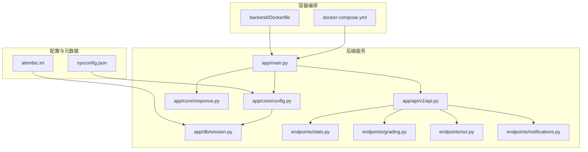
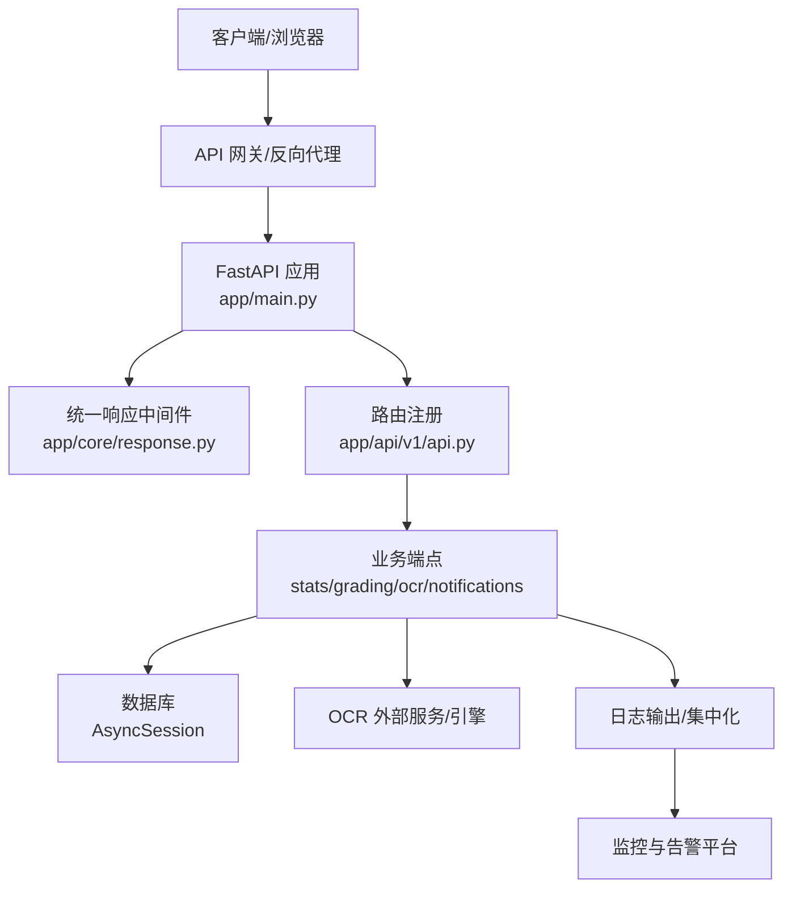
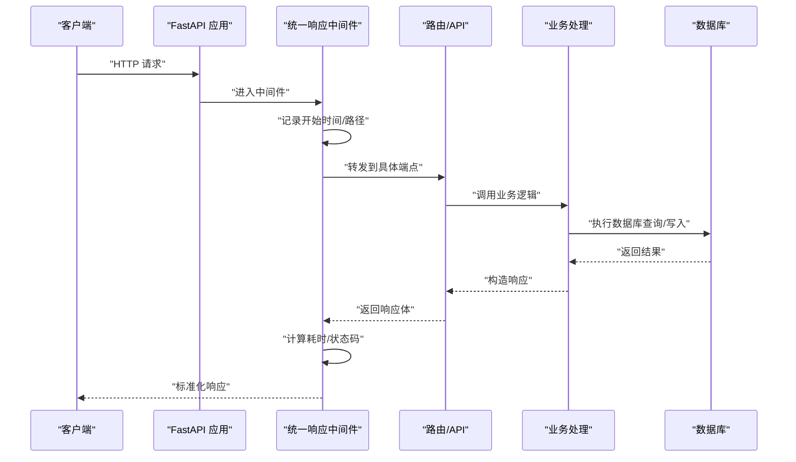
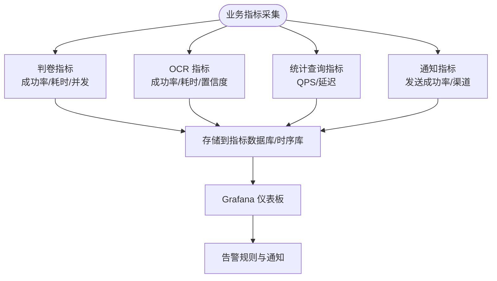
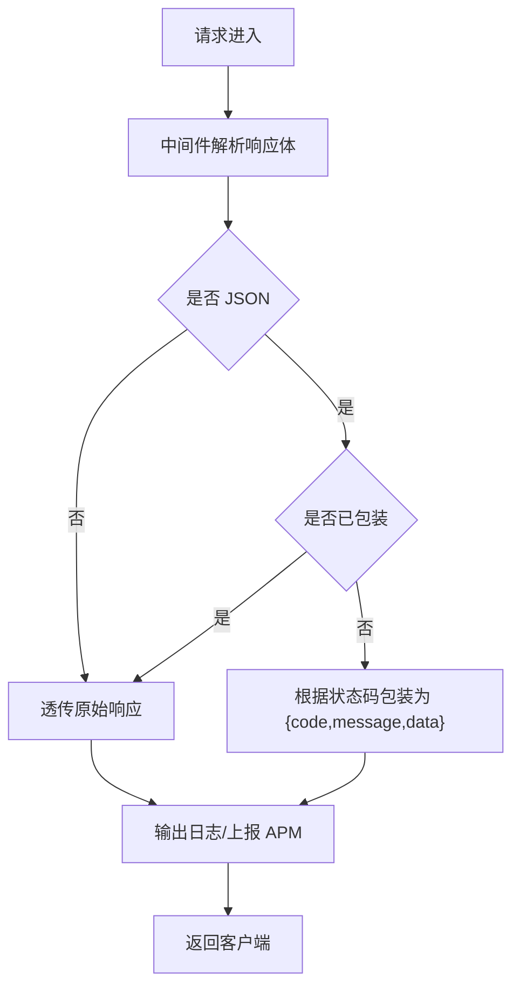
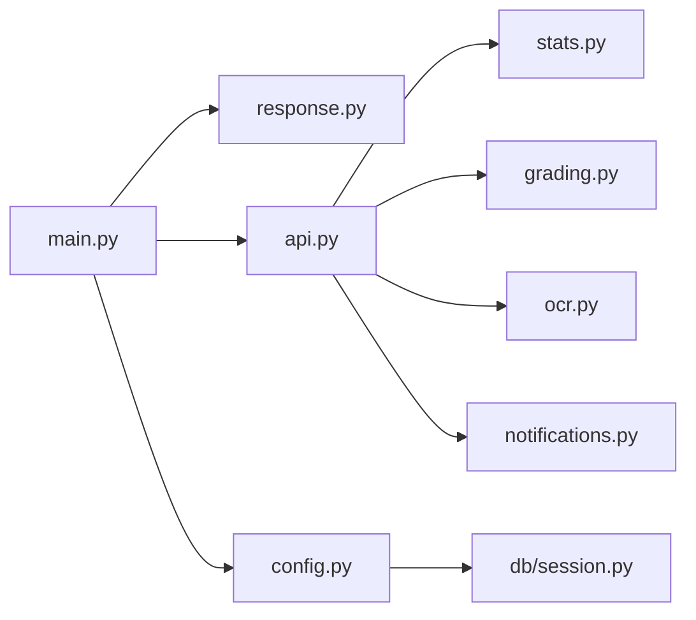

# 监控告警

<cite>
**本文引用的文件**
- [backend/app/main.py](file://backend/app/main.py)
- [backend/app/core/config.py](file://backend/app/core/config.py)
- [backend/app/core/response.py](file://backend/app/core/response.py)
- [backend/app/api/v1/api.py](file://backend/app/api/v1/api.py)
- [backend/app/api/v1/endpoints/stats.py](file://backend/app/api/v1/endpoints/stats.py)
- [backend/app/api/v1/endpoints/grading.py](file://backend/app/api/v1/endpoints/grading.py)
- [backend/app/api/v1/endpoints/ocr.py](file://backend/app/api/v1/endpoints/ocr.py)
- [backend/app/api/v1/endpoints/notifications.py](file://backend/app/api/v1/endpoints/notifications.py)
- [backend/app/db/session.py](file://backend/app/db/session.py)
- [backend/sysconfig.json](file://backend/sysconfig.json)
- [docker-compose.yml](file://docker-compose.yml)
- [backend/Dockerfile](file://backend/Dockerfile)
- [backend/alembic.ini](file://backend/alembic.ini)
</cite>

## 目录
1. [简介](#简介)
2. [项目结构](#项目结构)
3. [核心组件](#核心组件)
4. [架构总览](#架构总览)
5. [详细组件分析](#详细组件分析)
6. [依赖分析](#依赖分析)
7. [性能考虑](#性能考虑)
8. [故障排查指南](#故障排查指南)
9. [结论](#结论)
10. [附录](#附录)

## 简介
本文件面向“瑞珹教育管理系统”的监控与告警建设，围绕应用性能监控（APM）、系统资源监控、业务指标监控三大维度，结合现有代码结构与部署方式，给出可落地的日志采集、错误追踪、性能指标采集方案；并规划告警规则配置、通知渠道设置与故障响应流程，覆盖数据库监控、API 响应时间监控、用户行为监控等关键场景，同时提供监控仪表板配置建议与关键指标定义，解释异常检测思路与自动恢复机制。

## 项目结构
后端基于 FastAPI 构建，采用异步 SQLAlchemy 连接数据库，统一响应中间件包装 API 输出，通过 docker-compose 同时编排前端与后端服务。当前仓库未包含专门的监控与告警组件（如 Prometheus、Grafana、APM Agent、日志聚合平台等），因此本方案以“在现有架构上扩展”为前提，提出可实施的监控与告警路径。

**图表来源**
- [docker-compose.yml:1-33](file://docker-compose.yml#L1-L33)
- [backend/Dockerfile:1-11](file://backend/Dockerfile#L1-L11)
- [backend/app/main.py:1-52](file://backend/app/main.py#L1-L52)
- [backend/app/core/config.py:1-98](file://backend/app/core/config.py#L1-L98)
- [backend/app/core/response.py:1-124](file://backend/app/core/response.py#L1-L124)
- [backend/app/db/session.py:1-26](file://backend/app/db/session.py#L1-L26)
- [backend/app/api/v1/api.py:1-26](file://backend/app/api/v1/api.py#L1-L26)
- [backend/app/api/v1/endpoints/stats.py:1-251](file://backend/app/api/v1/endpoints/stats.py#L1-L251)
- [backend/app/api/v1/endpoints/grading.py:1-143](file://backend/app/api/v1/endpoints/grading.py#L1-L143)
- [backend/app/api/v1/endpoints/ocr.py:1-291](file://backend/app/api/v1/endpoints/ocr.py#L1-L291)
- [backend/app/api/v1/endpoints/notifications.py:1-79](file://backend/app/api/v1/endpoints/notifications.py#L1-L79)
- [backend/sysconfig.json:1-48](file://backend/sysconfig.json#L1-L48)
- [backend/alembic.ini:121-150](file://backend/alembic.ini#L121-L150)

**章节来源**
- [backend/app/main.py:1-52](file://backend/app/main.py#L1-L52)
- [backend/app/core/config.py:1-98](file://backend/app/core/config.py#L1-L98)
- [backend/app/core/response.py:1-124](file://backend/app/core/response.py#L1-L124)
- [backend/app/api/v1/api.py:1-26](file://backend/app/api/v1/api.py#L1-L26)
- [backend/app/db/session.py:1-26](file://backend/app/db/session.py#L1-L26)
- [backend/sysconfig.json:1-48](file://backend/sysconfig.json#L1-L48)
- [docker-compose.yml:1-33](file://docker-compose.yml#L1-L33)
- [backend/Dockerfile:1-11](file://backend/Dockerfile#L1-L11)
- [backend/alembic.ini:121-150](file://backend/alembic.ini#L121-L150)

## 核心组件
- 应用入口与中间件
  - FastAPI 应用实例、CORS 中间件、统一响应包装中间件、健康检查端点。
- 配置中心
  - 数据库连接串（同步/异步）、Redis/Celery、上传目录、OCR 引擎与语言、模型缓存目录、主机与端口等。
- 数据访问层
  - 异步 SQLAlchemy 引擎与会话工厂，提供统一的数据库依赖注入。
- API 路由与端点
  - 教师统计、判卷、OCR、通知等业务端点，作为监控与告警的观测对象。
- 日志与调试
  - Alembic 日志配置示例，可用于后续接入集中式日志平台。

**章节来源**
- [backend/app/main.py:1-52](file://backend/app/main.py#L1-L52)
- [backend/app/core/config.py:36-98](file://backend/app/core/config.py#L36-L98)
- [backend/app/db/session.py:1-26](file://backend/app/db/session.py#L1-L26)
- [backend/app/api/v1/api.py:1-26](file://backend/app/api/v1/api.py#L1-L26)
- [backend/alembic.ini:121-150](file://backend/alembic.ini#L121-L150)

## 架构总览
下图展示从客户端到后端服务、数据库与外部能力（OCR）的整体交互路径，以及可扩展的监控与告警接入点。

**图表来源**
- [backend/app/main.py:1-52](file://backend/app/main.py#L1-L52)
- [backend/app/core/response.py:1-124](file://backend/app/core/response.py#L1-L124)
- [backend/app/api/v1/api.py:1-26](file://backend/app/api/v1/api.py#L1-L26)
- [backend/app/db/session.py:1-26](file://backend/app/db/session.py#L1-L26)
- [backend/app/api/v1/endpoints/ocr.py:1-291](file://backend/app/api/v1/endpoints/ocr.py#L1-L291)

## 详细组件分析

### 应用性能监控（APM）
- 观测目标
  - API 端点吞吐、延迟、错误率、超时率。
  - 关键业务流程：判卷启动、OCR 识别、教师统计查询。
- 实施建议
  - 在统一响应中间件中埋点，记录请求开始时间、结束时间、状态码、耗时，并输出结构化日志。
  - 对判卷与 OCR 等长耗时任务，使用任务队列（Celery/Redis）异步执行，并记录任务入队、开始、完成、失败事件。
  - 使用 OpenTelemetry SDK 或第三方 APM（如 DataDog、Sentry、SkyWalking）采集 Trace/Metrics/Logs。

**图表来源**
- [backend/app/core/response.py:20-101](file://backend/app/core/response.py#L20-L101)
- [backend/app/api/v1/api.py:1-26](file://backend/app/api/v1/api.py#L1-L26)
- [backend/app/db/session.py:18-26](file://backend/app/db/session.py#L18-L26)

**章节来源**
- [backend/app/core/response.py:14-124](file://backend/app/core/response.py#L14-L124)
- [backend/app/api/v1/endpoints/grading.py:19-55](file://backend/app/api/v1/endpoints/grading.py#L19-L55)
- [backend/app/api/v1/endpoints/ocr.py:18-64](file://backend/app/api/v1/endpoints/ocr.py#L18-L64)

### 系统资源监控
- 监控项
  - CPU、内存、磁盘、网络 I/O。
  - 容器与进程级指标（Docker/Compose 场景）。
- 实施建议
  - 使用 cAdvisor/Prometheus Node Exporter 收集容器与节点指标。
  - 结合 Grafana 创建仪表板，按环境（开发/测试/生产）分组展示。
  - 与健康检查端点配合，实现自愈式重启或扩缩容触发。

**章节来源**
- [docker-compose.yml:1-33](file://docker-compose.yml#L1-L33)
- [backend/Dockerfile:1-11](file://backend/Dockerfile#L1-L11)

### 业务指标监控
- 指标定义
  - 判卷任务成功率、平均耗时、并发数上限。
  - OCR 识别成功率、平均耗时、置信度分布。
  - 教师统计查询 QPS、P95/P99 延迟。
  - 通知发送成功率、渠道分布。
- 数据来源
  - 判卷：判卷记录表、提交状态变更。
  - OCR：OCR 上传记录表、状态字段。
  - 统计：教师统计端点访问日志与数据库查询。
  - 通知：通知表状态流转。

**图表来源**
- [backend/app/api/v1/endpoints/grading.py:19-55](file://backend/app/api/v1/endpoints/grading.py#L19-L55)
- [backend/app/api/v1/endpoints/ocr.py:18-64](file://backend/app/api/v1/endpoints/ocr.py#L18-L64)
- [backend/app/api/v1/endpoints/stats.py:17-137](file://backend/app/api/v1/endpoints/stats.py#L17-L137)
- [backend/app/api/v1/endpoints/notifications.py:13-79](file://backend/app/api/v1/endpoints/notifications.py#L13-L79)

**章节来源**
- [backend/app/api/v1/endpoints/grading.py:19-143](file://backend/app/api/v1/endpoints/grading.py#L19-L143)
- [backend/app/api/v1/endpoints/ocr.py:18-291](file://backend/app/api/v1/endpoints/ocr.py#L18-L291)
- [backend/app/api/v1/endpoints/stats.py:17-251](file://backend/app/api/v1/endpoints/stats.py#L17-L251)
- [backend/app/api/v1/endpoints/notifications.py:13-79](file://backend/app/api/v1/endpoints/notifications.py#L13-L79)

### 日志收集与错误追踪
- 日志采集
  - 使用标准输出/错误输出，结合 Docker 日志驱动收集。
  - 推荐接入 ELK/EFK 或云日志服务，对统一响应中间件输出进行结构化解析。
- 错误追踪
  - 中间件捕获未处理异常，返回标准化错误响应。
  - 建议引入 Sentry/OpenTelemetry 自动捕获异常堆栈与上下文。

**图表来源**
- [backend/app/core/response.py:20-101](file://backend/app/core/response.py#L20-L101)

**章节来源**
- [backend/app/core/response.py:14-124](file://backend/app/core/response.py#L14-L124)

### 告警规则配置与通知渠道
- 告警规则建议
  - API 延迟：P95/P99 超过阈值持续 N 分钟。
  - 错误率：接口 5xx 错误率超过阈值。
  - 资源：CPU/内存/磁盘使用率超过阈值。
  - 业务：判卷/OCR 成功率下降、排队积压。
- 通知渠道
  - 邮件、企业微信、钉钉、站内信（通知表支持多通道）。
- 响应流程
  - 告警触发 → 自动派单/升级 → 回滚/扩容 → 复盘与规则优化。

**章节来源**
- [backend/app/api/v1/endpoints/notifications.py:13-79](file://backend/app/api/v1/endpoints/notifications.py#L13-L79)

### 数据库监控
- 监控点
  - 连接池使用率、慢查询、锁等待、事务回滚。
  - 表大小与索引使用情况。
- 实施建议
  - 通过 Alembic 日志级别与 SQL 执行日志定位慢查询。
  - 使用 pg_stat_* 视图与 APM 的数据库面板联动。

**章节来源**
- [backend/app/db/session.py:1-26](file://backend/app/db/session.py#L1-L26)
- [backend/alembic.ini:132-141](file://backend/alembic.ini#L132-L141)

### API 响应时间监控
- 方法
  - 在统一响应中间件中记录请求开始/结束时间，计算耗时并打标签（路径、方法、状态码）。
  - 对关键端点（统计、判卷、OCR）单独建立 P95/P99 指标。
- 可视化
  - Grafana 面板：按端点/用户角色/学科维度拆分。

**章节来源**
- [backend/app/core/response.py:20-101](file://backend/app/core/response.py#L20-L101)
- [backend/app/api/v1/endpoints/stats.py:17-137](file://backend/app/api/v1/endpoints/stats.py#L17-L137)
- [backend/app/api/v1/endpoints/grading.py:19-55](file://backend/app/api/v1/endpoints/grading.py#L19-L55)
- [backend/app/api/v1/endpoints/ocr.py:18-64](file://backend/app/api/v1/endpoints/ocr.py#L18-L64)

### 用户行为监控
- 观察点
  - 登录/登出、答题提交、错题本生成、通知查看等关键动作。
- 实施建议
  - 在鉴权与关键业务端点埋点，结合用户 ID 与会话信息形成行为画像。
  - 与通知渠道联动，推送个性化提醒。

**章节来源**
- [backend/app/api/v1/endpoints/notifications.py:13-79](file://backend/app/api/v1/endpoints/notifications.py#L13-L79)

## 依赖分析
- 组件耦合
  - API 路由集中注册，便于统一中间件与监控接入。
  - 数据库依赖通过异步会话工厂注入，利于测试与监控。
- 外部依赖
  - 数据库（PostgreSQL）、Redis/Celery（任务队列）、OCR 引擎。
- 潜在风险
  - 缺少专门的监控与告警组件，需在现有中间件与日志基础上扩展。

**图表来源**
- [backend/app/main.py:1-52](file://backend/app/main.py#L1-L52)
- [backend/app/core/response.py:1-124](file://backend/app/core/response.py#L1-L124)
- [backend/app/api/v1/api.py:1-26](file://backend/app/api/v1/api.py#L1-L26)
- [backend/app/db/session.py:1-26](file://backend/app/db/session.py#L1-L26)
- [backend/app/core/config.py:36-98](file://backend/app/core/config.py#L36-L98)

**章节来源**
- [backend/app/main.py:1-52](file://backend/app/main.py#L1-L52)
- [backend/app/api/v1/api.py:1-26](file://backend/app/api/v1/api.py#L1-L26)
- [backend/app/db/session.py:1-26](file://backend/app/db/session.py#L1-L26)
- [backend/app/core/config.py:36-98](file://backend/app/core/config.py#L36-L98)

## 性能考虑
- 异步 I/O
  - 使用异步 SQLAlchemy 降低阻塞，提升并发处理能力。
- 中间件开销
  - 统一响应中间件避免重复封装与 JSON 序列化开销。
- 数据库连接
  - 合理配置连接池大小与超时，避免峰值拥塞。
- 任务队列
  - 判卷与 OCR 异步化，限制并发数，防止资源争抢。

**章节来源**
- [backend/app/db/session.py:1-26](file://backend/app/db/session.py#L1-L26)
- [backend/app/core/response.py:14-124](file://backend/app/core/response.py#L14-L124)
- [backend/app/core/config.py:73-86](file://backend/app/core/config.py#L73-L86)

## 故障排查指南
- 健康检查
  - 使用根路径与健康检查端点快速判断服务可用性。
- 日志定位
  - 查看中间件异常捕获与未处理异常日志，结合请求 ID 追踪。
- 数据库问题
  - 检查连接串、连接池状态与慢查询日志。
- 业务异常
  - 判卷/OCR 状态不一致时，核对任务队列与数据库状态一致性。

**章节来源**
- [backend/app/main.py:45-52](file://backend/app/main.py#L45-L52)
- [backend/app/core/response.py:91-101](file://backend/app/core/response.py#L91-L101)
- [backend/app/db/session.py:18-26](file://backend/app/db/session.py#L18-L26)

## 结论
本方案在现有 FastAPI + 异步数据库架构基础上，提出以统一响应中间件为监控抓手、以业务端点为核心观测对象、以日志与 APM 平台为支撑的监控告警体系。通过明确的关键指标、告警规则与通知渠道，可有效保障系统稳定性与业务连续性。后续建议逐步引入专门的监控与告警组件，并完善自动化运维流程。

## 附录
- 监控仪表板建议
  - API 性能：端点级 QPS/延迟/错误率、P95/P99。
  - 业务指标：判卷/OCR 成功率与耗时、教师统计查询性能。
  - 资源监控：CPU/内存/磁盘/IO、容器健康度。
  - 业务行为：登录/答题/通知查看趋势。
- 关键指标定义
  - 延迟：端点响应时间（毫秒）。
  - 吞吐：每秒请求数（QPS）。
  - 错误率：5xx/业务错误占比。
  - 成功率：判卷/OCR 成功次数/总次数。
- 异常检测与自动恢复
  - 基于滑动窗口的阈值检测与趋势分析。
  - 自动恢复：超时重试、熔断降级、扩缩容触发。