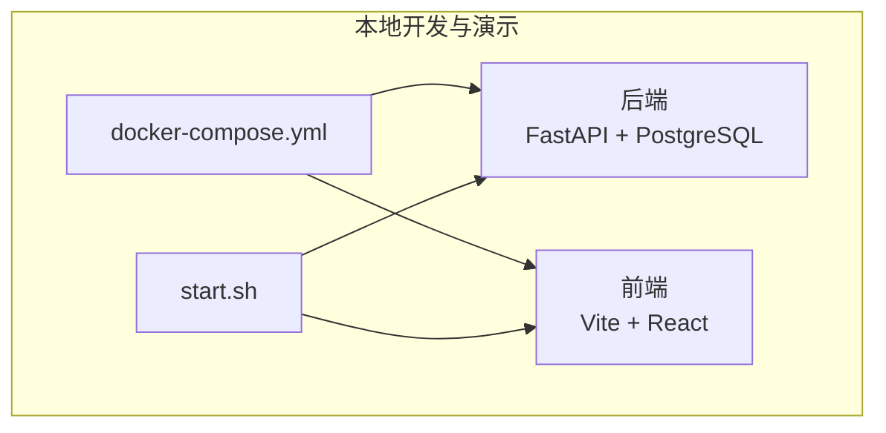
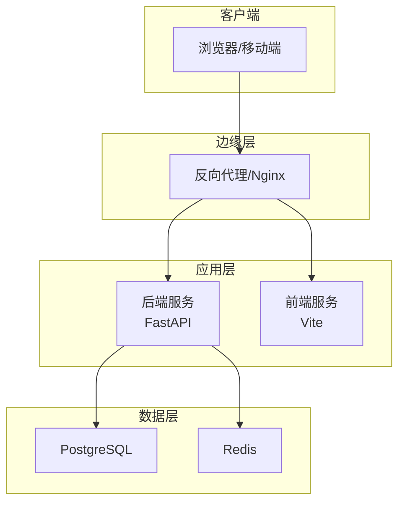
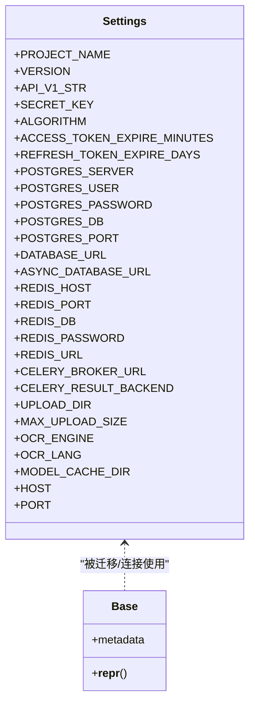
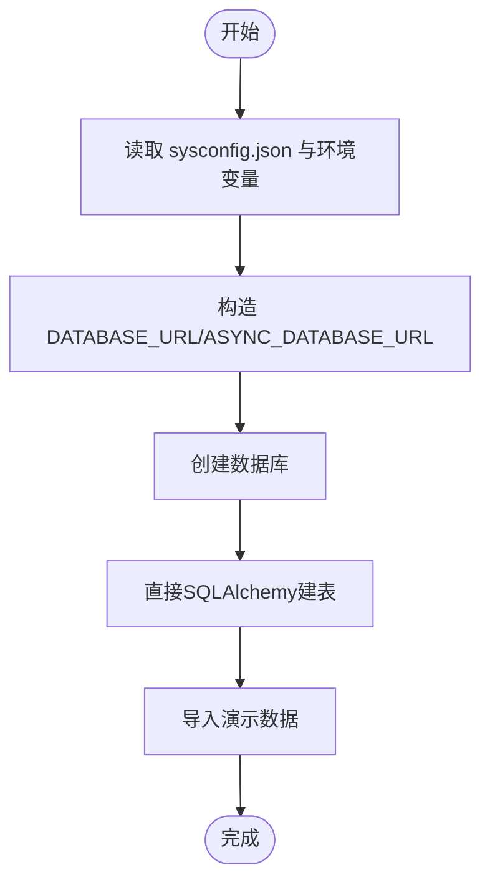
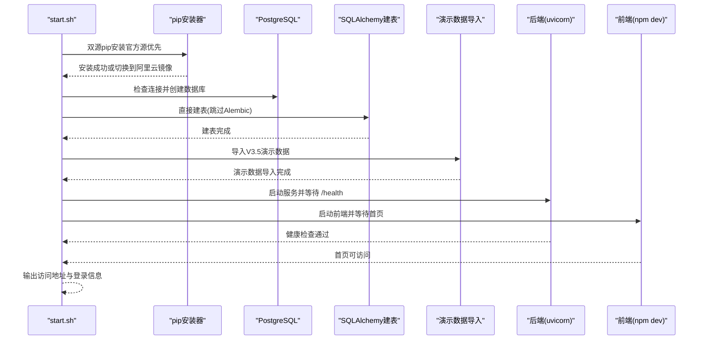

# 部署运维

<cite>
**本文引用的文件**
- [docker-compose.yml](file://docker-compose.yml)
- [start.sh](file://start.sh)
- [backend/Dockerfile](file://backend/Dockerfile)
- [frontend/Dockerfile](file://frontend/Dockerfile)
- [backend/requirements.txt](file://backend/requirements.txt)
- [backend/app/main.py](file://backend/app/main.py)
- [backend/app/core/config.py](file://backend/app/core/config.py)
- [backend/alembic.ini](file://backend/alembic.ini)
- [backend/alembic/env.py](file://backend/alembic/env.py)
- [backend/app/db/base.py](file://backend/app/db/base.py)
- [backend/app/db/session.py](file://backend/app/db/session.py)
- [backend/demo_data.py](file://backend/demo_data.py)
- [backend/sysconfig.json](file://backend/sysconfig.json)
- [.gitignore](file://.gitignore)
</cite>

## 更新摘要
**变更内容**
- 更新了依赖安装可靠性改进章节，详细说明了双源 pip 安装逻辑
- 新增了网络环境优化相关的部署最佳实践
- 完善了故障排除指南中的依赖安装问题解决方案

## 目录
1. [简介](#简介)
2. [项目结构](#项目结构)
3. [核心组件](#核心组件)
4. [架构总览](#架构总览)
5. [详细组件分析](#详细组件分析)
6. [依赖分析](#依赖分析)
7. [性能考虑](#性能考虑)
8. [故障排除指南](#故障排除指南)
9. [结论](#结论)
10. [附录](#附录)

## 简介
本文件面向"瑞珹教育管理系统"的部署与运维团队，提供从开发到生产的全生命周期运维指南。内容涵盖容器化部署（Docker）、生产环境配置与安全加固、CI/CD流程与版本发布策略、负载均衡与高可用、日志与监控告警、备份与灾难恢复、性能监控与容量规划、扩缩容策略、多环境部署与配置管理、变更控制流程等。

## 项目结构
该仓库采用前后端分离的双栈结构：后端基于 FastAPI + PostgreSQL（**直接SQLAlchemy建表**），前端基于 Vite + React；同时提供一键启动脚本与 Docker Compose 编排，便于本地开发与演示。

**图表来源**
- [docker-compose.yml:1-33](file://docker-compose.yml#L1-L33)
- [start.sh:1-372](file://start.sh#L1-L372)

**章节来源**
- [docker-compose.yml:1-33](file://docker-compose.yml#L1-L33)
- [start.sh:1-372](file://start.sh#L1-L372)

## 核心组件
- 后端服务（FastAPI）
  - 应用入口与路由注册、CORS 中间件、统一响应包装中间件、健康检查端点。
  - 配置加载：支持从 sysconfig.json 读取非敏感配置，并允许通过环境变量覆盖敏感字段。
  - 数据库：使用 SQLAlchemy ORM，命名约束统一，异步连接池通过 asyncpg。
  - **数据库初始化**：**直接使用SQLAlchemy建表**，无需Alembic迁移，简化了数据库初始化流程。
- 前端服务（Vite + React）
  - 开发模式下热更新，生产构建产物由反向代理提供静态资源。
- 容器化
  - 后端镜像：Python slim 基础镜像，安装 requirements.txt，使用 uvicorn 启动。
  - 前端镜像：Node Alpine 基础镜像，安装依赖后启动开发服务器。
  - Compose：后端映射 8000，前端映射 3000；后端挂载 sqlite 数据库文件以支持本地演示。
- 一键启动脚本
  - 自动创建/校验 Conda 环境、安装依赖、检查 PostgreSQL、**直接建表**、导入演示数据、启动后端与前端并等待健康检查。

**章节来源**
- [backend/app/main.py:1-74](file://backend/app/main.py#L1-L74)
- [backend/app/core/config.py:1-98](file://backend/app/core/config.py#L1-L98)
- [backend/app/db/base.py:1-21](file://backend/app/db/base.py#L1-L21)
- [backend/app/db/session.py:1-26](file://backend/app/db/session.py#L1-L26)
- [backend/Dockerfile:1-11](file://backend/Dockerfile#L1-L11)
- [frontend/Dockerfile:1-11](file://frontend/Dockerfile#L1-L11)
- [docker-compose.yml:1-33](file://docker-compose.yml#L1-L33)
- [start.sh:1-372](file://start.sh#L1-L372)

## 架构总览
系统采用"容器编排 + 反向代理 + 数据库"的经典三层架构。后端提供 REST API，前端通过反向代理访问；数据库为 PostgreSQL；Redis/Celery 用于任务队列与缓存（在配置中定义）。

## 详细组件分析

### 后端服务（FastAPI）
- 应用初始化
  - 注册 CORS、统一响应包装中间件、包含 API 路由前缀。
  - 启动事件中进行参考数据播种。
- 配置体系
  - 从 sysconfig.json 读取数据库与非敏感配置，支持通过环境变量覆盖敏感项。
  - 提供 DATABASE_URL/ASYNC_DATABASE_URL、Redis、Celery、上传目录、OCR、模型缓存等配置属性。
- 数据库与初始化
  - 使用命名约束的 DeclarativeBase，统一外键/唯一/检查/主键命名。
  - **直接使用SQLAlchemy建表**，通过异步引擎创建所有表结构，无需Alembic迁移。
- 健康检查
  - 提供根路径与 /health 接口，便于探活与编排。

**图表来源**
- [backend/app/core/config.py:36-98](file://backend/app/core/config.py#L36-L98)
- [backend/app/db/base.py:17-21](file://backend/app/db/base.py#L17-L21)

**章节来源**
- [backend/app/main.py:11-74](file://backend/app/main.py#L11-L74)
- [backend/app/core/config.py:36-98](file://backend/app/core/config.py#L36-L98)
- [backend/app/db/base.py:17-21](file://backend/app/db/base.py#L17-L21)

### 前端服务（Vite + React）
- 开发模式：监听源码变化并热更新。
- 生产构建：输出静态资源，由反向代理提供。
- 与后端交互：通过反向代理转发 API 请求至后端服务。

**章节来源**
- [frontend/Dockerfile:1-11](file://frontend/Dockerfile#L1-L11)
- [docker-compose.yml:22-32](file://docker-compose.yml#L22-L32)

### 数据库与初始化（PostgreSQL + SQLAlchemy）
- **数据库初始化流程**
  - **移除了Alembic迁移系统**，改为直接使用SQLAlchemy建表。
  - 通过异步引擎创建所有表结构，包括所有模型定义的表。
  - 简化了数据库初始化流程，减少了迁移复杂性。
- **演示数据导入**
  - 集成了V3.5演示数据导入功能，提供完整的业务数据。
  - 支持清除旧数据并导入标准演示数据。
  - 包含用户、班级、科目、题目、试卷、答题、错题本、家长、激励等全模块数据。
- **模型与命名**
  - app/db/base.py 统一命名约定，减少约束冲突与维护成本。
- **sysconfig.json**
  - 提供数据库连接参数与 LLM/OCR/导出等系统级配置，支持运行时调整（部分功能待实现）。

**图表来源**
- [start.sh:236-290](file://start.sh#L236-L290)
- [backend/app/core/config.py:56-61](file://backend/app/core/config.py#L56-L61)

**章节来源**
- [start.sh:236-290](file://start.sh#L236-L290)
- [backend/app/db/base.py:5-18](file://backend/app/db/base.py#L5-L18)
- [backend/sysconfig.json:1-48](file://backend/sysconfig.json#L1-L48)

### 一键启动脚本（start.sh）
- **功能概览**
  - 初始化 Conda 环境、安装后端依赖、检查并创建数据库、**直接建表**、导入演示数据、启动后端与前端并等待健康检查。
- **关键流程**
  - 读取 sysconfig.json 获取数据库参数，设置 PGPASSWORD。
  - 通过 psql 创建数据库并**直接建表**；**移除了Alembic迁移步骤**。
  - **新增演示数据导入**：执行demo_data.py脚本导入完整的V3.5演示数据。
  - 启动后端（uvicorn）与前端（npm run dev），轮询 /health 与前端首页以判断就绪状态。

**更新** 新增双源 pip 安装逻辑，提高在中国网络环境下的安装成功率

**图表来源**
- [start.sh:204-225](file://start.sh#L204-L225)
- [start.sh:226-372](file://start.sh#L226-L372)

**章节来源**
- [start.sh:1-372](file://start.sh#L1-L372)

## 依赖分析
- 后端依赖
  - Web 框架与服务器：FastAPI、Uvicorn
  - ORM 与数据库：SQLAlchemy、asyncpg、psycopg2-binary
  - 配置与加密：pydantic-settings、python-jose、bcrypt、passlib
  - 任务与缓存：Celery、Redis
  - 文档导出与 OCR：python-docx、fpdf2、pytesseract、Pillow
  - 测试：pytest、pytest-asyncio、httpx
- 前端依赖
  - 构建工具：Vite、TypeScript、React
  - UI 组件：Ant Design
  - 开发体验：ESLint、TypeScript 类型检查

**章节来源**
- [backend/requirements.txt:1-27](file://backend/requirements.txt#L1-L27)

## 性能考虑
- 数据库性能
  - 使用 asyncpg 异步驱动提升并发；统一命名约束减少索引与约束冲突。
  - **直接建表方式简化了数据库初始化，减少了迁移开销**。
  - 建议在生产环境启用连接池与只读副本，对高频查询建立合适索引。
- 应用性能
  - 合理设置上传大小与并发限制（OCR、阅卷等），避免资源争用。
  - 使用 Redis 缓存热点数据与会话，Celery 异步处理耗时任务。
- 前端性能
  - 生产构建开启代码分割与压缩；静态资源由反向代理缓存。
- 监控指标建议
  - CPU/内存/连接数/队列长度/请求延迟/P95/P99/错误率/健康检查失败率。
  - 数据库慢查询、锁等待、连接池饱和度。

## 故障排除指南
- 启动失败
  - 检查 PostgreSQL 是否启动、网络连通性与凭据；查看后端 /health 与 /docs。
  - **直接建表失败时，检查数据库连接配置和权限**。
  - **演示数据导入失败时，检查demo_data.py脚本的数据库连接和依赖**。
- 数据库问题
  - 确认 DATABASE_URL 与 sysconfig.json 中的数据库参数一致；检查权限与网络策略。
  - **确认数据库用户具有创建表的权限**。
- 前端无法访问
  - 确认前端已编译完成，反向代理已正确转发静态资源与 API 请求。
- **依赖安装问题**
  - **在中国网络环境下，pip 官方源可能因 SSL 握手失败导致安装失败**
  - **start.sh 现已内置双源安装逻辑：优先使用官方 PyPI 源，SSL 握手失败时自动切换到阿里云镜像**
  - **如果仍出现安装问题，可手动指定镜像源：pip install -i https://mirrors.aliyun.com/pypi/simple/ --trusted-host mirrors.aliyun.com**
- 日志与审计
  - 后端使用标准日志；建议接入集中式日志收集（如 ELK/Fluentd）与审计日志。

**章节来源**
- [start.sh:204-225](file://start.sh#L204-L225)
- [start.sh:226-372](file://start.sh#L226-L372)
- [backend/app/main.py:72-74](file://backend/app/main.py#L72-L74)

## 结论
本项目提供了清晰的容器化与一键启动能力，**移除了Alembic迁移系统改为直接SQLAlchemy建表**，简化了数据库初始化流程，结合统一配置体系，具备良好的可运维性。**新增的双源 pip 安装逻辑显著提高了在中国网络环境下的依赖安装可靠性**。建议在生产环境中完善 CI/CD、监控告警、备份与灾备、安全加固与变更控制流程，以满足企业级上线要求。

## 附录

### A. Docker 容器化部署
- 后端镜像
  - 基于 Python slim，复制 requirements.txt 并安装依赖，复制源码，使用 uvicorn 启动。
- 前端镜像
  - 基于 Node Alpine，安装依赖后启动开发服务器。
- Compose 编排
  - 映射端口：后端 8000，前端 3000；后端挂载 sqlite 文件以便本地演示。
  - 环境变量：数据库类型、SQLite 路径、密钥、算法、Token 过期时间等。

**章节来源**
- [backend/Dockerfile:1-11](file://backend/Dockerfile#L1-L11)
- [frontend/Dockerfile:1-11](file://frontend/Dockerfile#L1-L11)
- [docker-compose.yml:3-32](file://docker-compose.yml#L3-L32)

### B. 生产环境配置与安全加固
- 密钥与敏感配置
  - 通过环境变量覆盖 sysconfig.json 中的敏感字段（如 SECRET_KEY、DATABASE_PASSWORD）。
- CORS 与安全头
  - 生产环境应限定允许的源、方法与头部，启用 HTTPS、安全 Cookie、HSTS。
- 数据库安全
  - 使用专用账号、最小权限原则、网络隔离、TLS 加密传输。
- 文件上传与存储
  - 限制上传大小与类型，校验文件内容，使用对象存储或安全的本地目录。
- 审计与日志
  - 记录登录、权限变更、敏感操作；集中收集与保留策略。

**章节来源**
- [backend/app/core/config.py:14-30](file://backend/app/core/config.py#L14-L30)
- [backend/app/main.py:20-28](file://backend/app/main.py#L20-L28)

### C. CI/CD 流程与版本发布策略
- 构建阶段
  - 固定基础镜像版本，缓存 pip/npm 依赖，构建前后端产物。
- 测试阶段
  - 单元测试、集成测试、数据库建表一致性检查。
- 发布阶段
  - 多环境（测试/预发/生产）镜像标签策略；蓝绿/滚动发布；回滚机制。
- 版本管理
  - 语义化版本；变更日志；发布说明；热修复流程。

### D. 负载均衡与高可用
- 反向代理
  - Nginx/Traefik/Envoy 转发请求至后端多个实例；健康检查失败自动摘除。
- 数据库高可用
  - 主从复制/集群、读写分离、自动故障转移。
- 缓存与队列
  - Redis 集群/哨兵；Celery 多 worker；消息持久化。

### E. 日志管理、备份与灾难恢复
- 日志
  - 标准输出采集，结构化 JSON；按天切割；保留周期与归档。
- 备份
  - 数据库定时快照；增量备份；二进制日志归档。
- 恢复
  - RPO/RTO 目标；演练恢复流程；切换与验证。

**章节来源**
- [.gitignore:37-42](file://.gitignore#L37-L42)
- [backend/sysconfig.json:44-47](file://backend/sysconfig.json#L44-L47)

### F. 性能监控指标与容量规划
- 指标
  - QPS、响应时间、错误率、并发连接数、CPU/内存、磁盘 IO、队列长度。
- 规划
  - 峰值流量预测、资源弹性伸缩阈值、数据库分片/读写分离策略。

### G. 扩缩容策略
- 自动扩缩容
  - 基于 CPU/内存/队列长度触发；Pod/容器组水平扩展。
- 有状态组件
  - 数据库与缓存需独立扩缩容策略与数据一致性保障。

### H. 多环境部署与配置管理
- 环境隔离
  - 开发/测试/预发/生产四环境；网络与权限隔离。
- 配置管理
  - sysconfig.json 与环境变量分层；敏感配置使用密钥管理服务。
- 变更控制
  - 变更评审、灰度发布、回滚预案、变更记录与审计。

**章节来源**
- [backend/sysconfig.json:1-48](file://backend/sysconfig.json#L1-L48)
- [backend/app/core/config.py:91-94](file://backend/app/core/config.py#L91-L94)

### I. 数据库初始化与迁移策略
- **直接SQLAlchemy建表**
  - 通过异步引擎创建所有表结构，无需Alembic迁移。
  - 简化了数据库初始化流程，减少了迁移复杂性。
  - 适用于开发和演示环境，快速搭建数据库结构。
- **Alembic迁移系统**
  - **已移除**，不再使用Alembic进行数据库版本管理。
  - 如需生产环境的数据库版本控制，建议重新引入Alembic或采用其他迁移方案。
- **演示数据导入**
  - 集成在一键启动脚本中，提供完整的业务数据。
  - 支持清除旧数据并导入标准演示数据。

**章节来源**
- [start.sh:236-290](file://start.sh#L236-L290)
- [backend/app/db/base.py:1-21](file://backend/app/db/base.py#L1-L21)
- [backend/demo_data.py:1-200](file://backend/demo_data.py#L1-L200)

### J. 依赖安装可靠性改进
- **双源 pip 安装逻辑**
  - **优先使用官方 PyPI 源**：`pypi.org` 和 `files.pythonhosted.org`
  - **SSL 握手失败时自动切换**：阿里云镜像源 `mirrors.aliyun.com`
  - **提高中国网络环境下的安装成功率**
  - **增强的 --trusted-host 参数**：确保镜像源的可信性
- **安装流程优化**
  - 分离核心依赖和额外依赖的安装
  - 优先安装核心依赖（fastapi、uvicorn、sqlalchemy、alembic、pydantic、asyncpg）
  - 然后安装额外依赖（asyncpg、email-validator、bcrypt）
  - 每个安装步骤都包含官方源和镜像源的双重保障
- **网络环境适配**
  - 针对中国大陆网络环境的特殊优化
  - 减少因网络问题导致的安装失败
  - 提升开发和部署效率

**章节来源**
- [start.sh:204-225](file://start.sh#L204-L225)