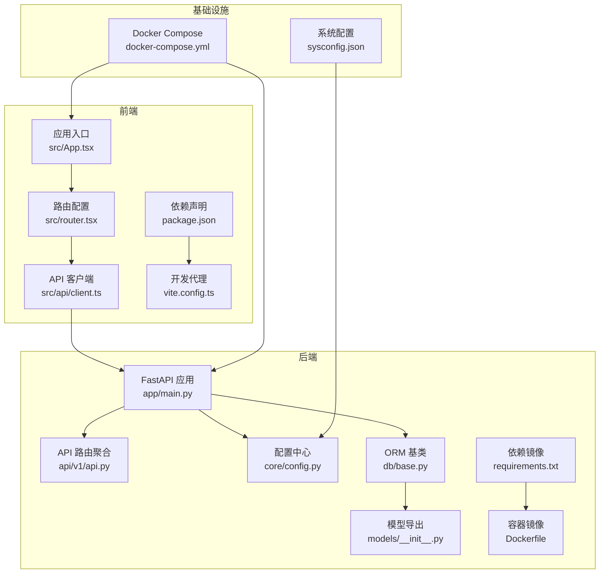
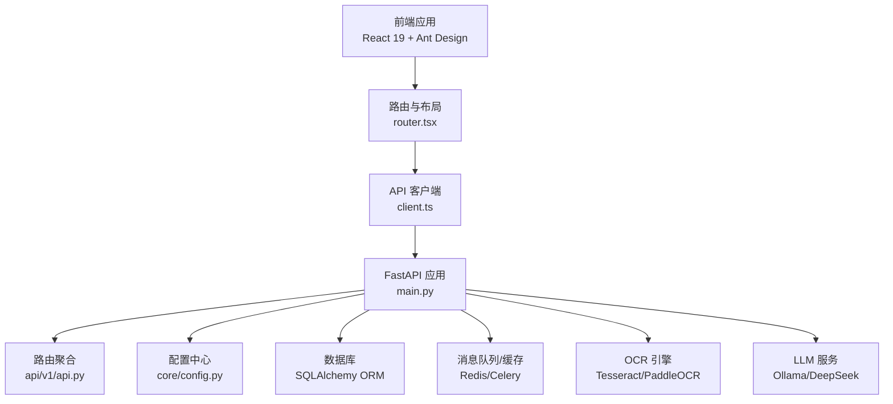
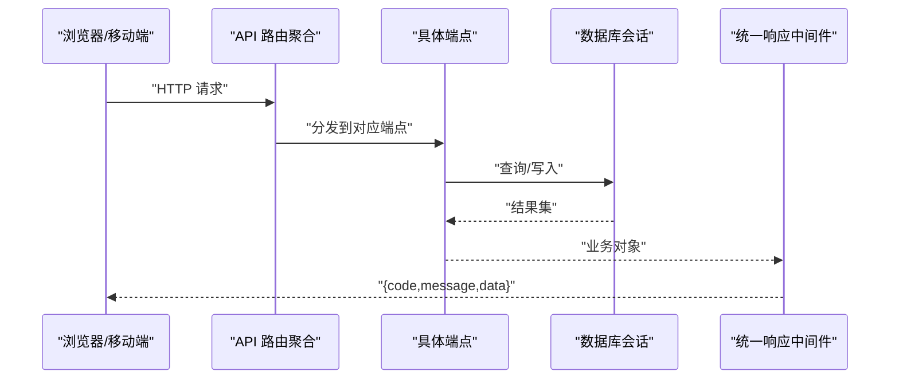
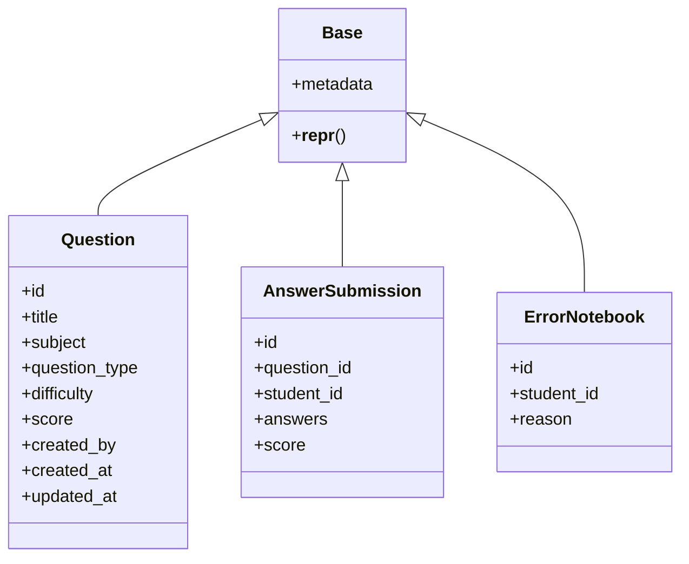
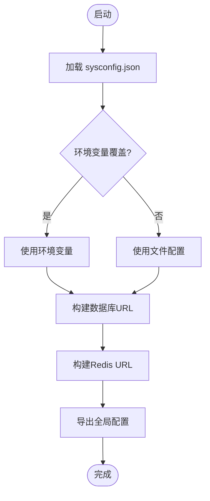
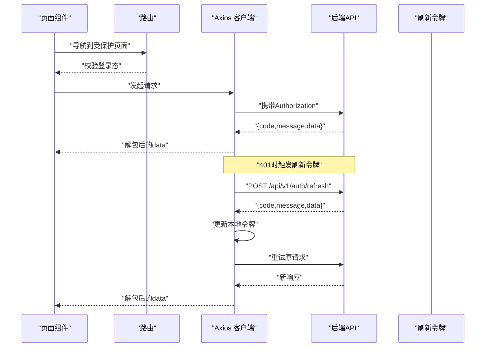
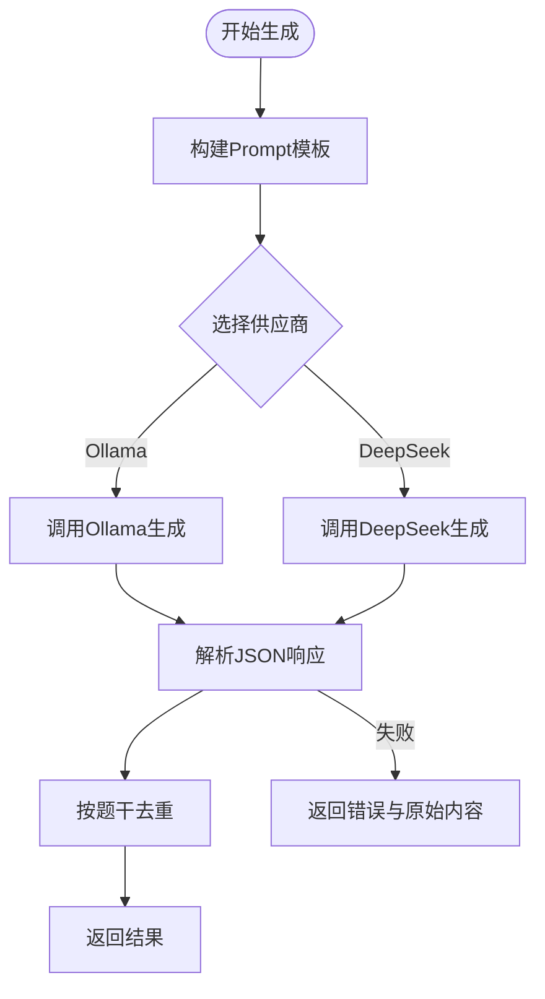
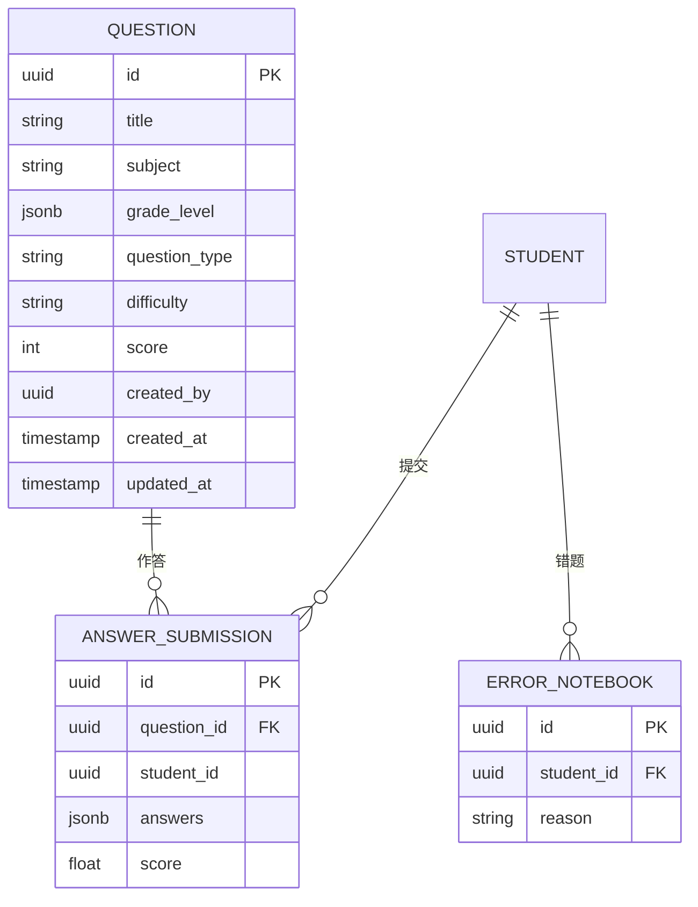
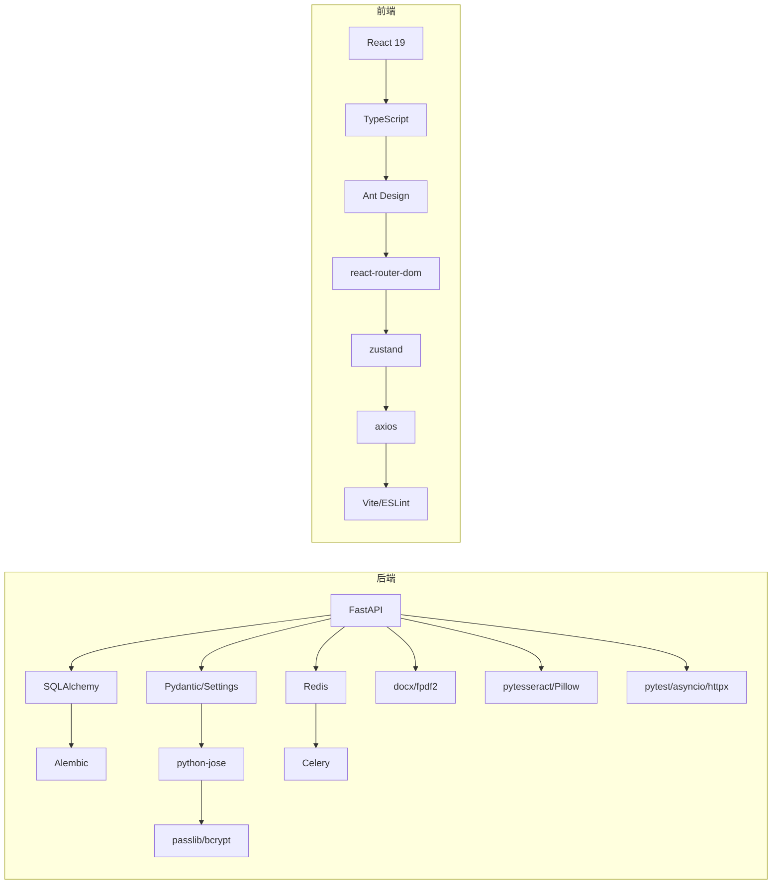

# 技术架构概览

<cite>
**本文档引用的文件**
- [backend/app/main.py](file://backend/app/main.py)
- [backend/app/api/v1/api.py](file://backend/app/api/v1/api.py)
- [backend/app/core/config.py](file://backend/app/core/config.py)
- [backend/app/db/base.py](file://backend/app/db/base.py)
- [backend/app/models/__init__.py](file://backend/app/models/__init__.py)
- [backend/app/schemas/question.py](file://backend/app/schemas/question.py)
- [backend/app/services/llm_service.py](file://backend/app/services/llm_service.py)
- [backend/Dockerfile](file://backend/Dockerfile)
- [backend/requirements.txt](file://backend/requirements.txt)
- [backend/sysconfig.json](file://backend/sysconfig.json)
- [docker-compose.yml](file://docker-compose.yml)
- [frontend/package.json](file://frontend/package.json)
- [frontend/vite.config.ts](file://frontend/vite.config.ts)
- [frontend/src/App.tsx](file://frontend/src/App.tsx)
- [frontend/src/router.tsx](file://frontend/src/router.tsx)
- [frontend/src/api/client.ts](file://frontend/src/api/client.ts)
</cite>

## 目录
1. [引言](#引言)
2. [项目结构](#项目结构)
3. [核心组件](#核心组件)
4. [架构总览](#架构总览)
5. [详细组件分析](#详细组件分析)
6. [依赖分析](#依赖分析)
7. [性能考虑](#性能考虑)
8. [故障排除指南](#故障排除指南)
9. [结论](#结论)

## 引言
本文件为瑞珹教育管理系统的“技术架构概览”，面向开发者与运维人员，系统性阐述后端（FastAPI + SQLAlchemy + Alembic）、前端（React 19 + TypeScript + Ant Design）、数据库（PostgreSQL/SQLite）、容器化（Docker Compose）与API设计（RESTful）等关键架构决策，并解释分层架构、模块化组织与组件交互模式。同时给出开发与生产环境部署差异及技术选型的权衡考量。

## 项目结构
系统采用前后端分离的双仓库结构，通过Docker Compose进行本地联调；后端以FastAPI为核心，按API版本、领域模型、服务层、数据访问层清晰分层；前端基于React 19与Ant Design构建页面与交互，使用Vite作为开发服务器与打包工具。

**图表来源**
- [backend/app/main.py:1-52](file://backend/app/main.py#L1-L52)
- [backend/app/api/v1/api.py:1-26](file://backend/app/api/v1/api.py#L1-L26)
- [backend/app/core/config.py:1-98](file://backend/app/core/config.py#L1-L98)
- [backend/app/db/base.py:1-21](file://backend/app/db/base.py#L1-L21)
- [backend/app/models/__init__.py:1-34](file://backend/app/models/__init__.py#L1-L34)
- [backend/Dockerfile:1-11](file://backend/Dockerfile#L1-L11)
- [backend/requirements.txt:1-27](file://backend/requirements.txt#L1-L27)
- [frontend/src/App.tsx:1-6](file://frontend/src/App.tsx#L1-L6)
- [frontend/src/router.tsx:1-79](file://frontend/src/router.tsx#L1-L79)
- [frontend/src/api/client.ts:1-55](file://frontend/src/api/client.ts#L1-L55)
- [frontend/package.json:1-38](file://frontend/package.json#L1-L38)
- [frontend/vite.config.ts:1-17](file://frontend/vite.config.ts#L1-L17)
- [docker-compose.yml:1-33](file://docker-compose.yml#L1-L33)
- [backend/sysconfig.json:1-48](file://backend/sysconfig.json#L1-L48)

**章节来源**
- [backend/app/main.py:1-52](file://backend/app/main.py#L1-L52)
- [backend/app/api/v1/api.py:1-26](file://backend/app/api/v1/api.py#L1-L26)
- [backend/app/core/config.py:1-98](file://backend/app/core/config.py#L1-L98)
- [backend/app/db/base.py:1-21](file://backend/app/db/base.py#L1-L21)
- [backend/app/models/__init__.py:1-34](file://backend/app/models/__init__.py#L1-L34)
- [backend/Dockerfile:1-11](file://backend/Dockerfile#L1-L11)
- [backend/requirements.txt:1-27](file://backend/requirements.txt#L1-L27)
- [frontend/src/App.tsx:1-6](file://frontend/src/App.tsx#L1-L6)
- [frontend/src/router.tsx:1-79](file://frontend/src/router.tsx#L1-L79)
- [frontend/src/api/client.ts:1-55](file://frontend/src/api/client.ts#L1-L55)
- [frontend/package.json:1-38](file://frontend/package.json#L1-L38)
- [frontend/vite.config.ts:1-17](file://frontend/vite.config.ts#L1-L17)
- [docker-compose.yml:1-33](file://docker-compose.yml#L1-L33)
- [backend/sysconfig.json:1-48](file://backend/sysconfig.json#L1-L48)

## 核心组件
- 后端框架与运行时
  - FastAPI应用在主入口中初始化，注册统一响应中间件与CORS，挂载v1 API路由前缀。
  - 配置中心集中管理数据库、Redis、Celery、上传目录、OCR与模型缓存等参数。
  - Dockerfile定义Python 3.12基础镜像、依赖安装与Uvicorn启动命令。
- 数据层
  - SQLAlchemy ORM基类定义命名规范与元数据，模型导出统一管理。
  - Alembic迁移版本覆盖初始表、省市区扩展、典型题标记、提交状态简化、OCR复审状态、题目标签哈希等演进。
- 前端框架与运行时
  - React 19 + TypeScript + Ant Design，路由按用户角色动态切换页面。
  - Vite开发服务器启用代理到后端8000端口，支持热更新与缓存优化。
  - Axios客户端封装统一请求头、鉴权头注入、响应自动解包与刷新令牌流程。
- 容器化与部署
  - docker-compose编排后端与前端服务，支持SQLite开发模式与卷挂载调试。
  - 生产环境建议替换为PostgreSQL并配置独立网络与持久化存储。

**章节来源**
- [backend/app/main.py:1-52](file://backend/app/main.py#L1-L52)
- [backend/app/core/config.py:1-98](file://backend/app/core/config.py#L1-L98)
- [backend/app/db/base.py:1-21](file://backend/app/db/base.py#L1-L21)
- [backend/app/models/__init__.py:1-34](file://backend/app/models/__init__.py#L1-L34)
- [backend/Dockerfile:1-11](file://backend/Dockerfile#L1-L11)
- [backend/requirements.txt:1-27](file://backend/requirements.txt#L1-L27)
- [frontend/src/App.tsx:1-6](file://frontend/src/App.tsx#L1-L6)
- [frontend/src/router.tsx:1-79](file://frontend/src/router.tsx#L1-L79)
- [frontend/src/api/client.ts:1-55](file://frontend/src/api/client.ts#L1-L55)
- [frontend/package.json:1-38](file://frontend/package.json#L1-L38)
- [frontend/vite.config.ts:1-17](file://frontend/vite.config.ts#L1-L17)
- [docker-compose.yml:1-33](file://docker-compose.yml#L1-L33)

## 架构总览
系统采用前后端分离的三层架构：前端负责UI与交互，后端提供RESTful API与业务逻辑，数据库负责持久化。统一响应中间件确保所有接口返回一致的数据结构；CORS中间件支持跨域；配置中心集中管理环境变量与系统参数；Docker Compose用于本地开发联调。

**图表来源**
- [frontend/src/router.tsx:1-79](file://frontend/src/router.tsx#L1-L79)
- [frontend/src/api/client.ts:1-55](file://frontend/src/api/client.ts#L1-L55)
- [backend/app/main.py:1-52](file://backend/app/main.py#L1-L52)
- [backend/app/api/v1/api.py:1-26](file://backend/app/api/v1/api.py#L1-L26)
- [backend/app/core/config.py:1-98](file://backend/app/core/config.py#L1-L98)
- [backend/app/db/base.py:1-21](file://backend/app/db/base.py#L1-L21)
- [backend/app/services/llm_service.py:1-200](file://backend/app/services/llm_service.py#L1-L200)

## 详细组件分析

### 后端应用与API路由
- 应用初始化：设置标题、版本、OpenAPI路径，注册统一响应中间件与CORS，挂载v1路由前缀。
- 路由聚合：将认证、题库、试卷、阅卷、错题本、自学习、知识树、班级、统计、通知等子路由按前缀与标签组织。
- 启动任务：启动事件中执行参考数据播种，保证系统初始数据可用。

**图表来源**
- [backend/app/main.py:1-52](file://backend/app/main.py#L1-L52)
- [backend/app/api/v1/api.py:1-26](file://backend/app/api/v1/api.py#L1-L26)

**章节来源**
- [backend/app/main.py:1-52](file://backend/app/main.py#L1-L52)
- [backend/app/api/v1/api.py:1-26](file://backend/app/api/v1/api.py#L1-L26)

### 数据库与ORM设计
- ORM基类：定义约束命名规范与元数据，统一约束命名策略，便于维护与迁移。
- 模型导出：集中导出所有领域模型，避免循环导入与遗漏。
- 配置中心：提供同步与异步数据库URL，支持PostgreSQL与Redis集成。

**图表来源**
- [backend/app/db/base.py:1-21](file://backend/app/db/base.py#L1-L21)
- [backend/app/models/__init__.py:1-34](file://backend/app/models/__init__.py#L1-L34)

**章节来源**
- [backend/app/db/base.py:1-21](file://backend/app/db/base.py#L1-L21)
- [backend/app/models/__init__.py:1-34](file://backend/app/models/__init__.py#L1-L34)
- [backend/app/core/config.py:55-71](file://backend/app/core/config.py#L55-L71)

### 配置中心与系统参数
- 配置加载：优先从sysconfig.json读取非敏感配置，支持环境变量覆盖敏感项。
- 数据库与Redis：提供同步/异步数据库URL与Redis连接字符串。
- 文件与OCR：上传目录大小限制、OCR引擎与语言、模型缓存目录。
- 运行参数：主机、端口、安全算法与令牌有效期。

**图表来源**
- [backend/app/core/config.py:6-30](file://backend/app/core/config.py#L6-L30)
- [backend/app/core/config.py:55-71](file://backend/app/core/config.py#L55-L71)
- [backend/sysconfig.json:1-48](file://backend/sysconfig.json#L1-L48)

**章节来源**
- [backend/app/core/config.py:1-98](file://backend/app/core/config.py#L1-L98)
- [backend/sysconfig.json:1-48](file://backend/sysconfig.json#L1-L48)

### 前端路由与API客户端
- 路由策略：基于用户类型（学生/教师/管理员）动态渲染不同页面；登录态校验与重定向。
- API客户端：统一设置基础URL、注入Authorization头；拦截响应自动解包；401时尝试刷新令牌并重试。
- 开发代理：Vite将/api前缀代理至后端8000端口，解决跨域与开发调试问题。

**图表来源**
- [frontend/src/router.tsx:26-42](file://frontend/src/router.tsx#L26-L42)
- [frontend/src/api/client.ts:17-52](file://frontend/src/api/client.ts#L17-L52)
- [frontend/vite.config.ts:8-13](file://frontend/vite.config.ts#L8-L13)

**章节来源**
- [frontend/src/router.tsx:1-79](file://frontend/src/router.tsx#L1-L79)
- [frontend/src/api/client.ts:1-55](file://frontend/src/api/client.ts#L1-L55)
- [frontend/vite.config.ts:1-17](file://frontend/vite.config.ts#L1-L17)

### LLM服务与题库生成
- Prompt工程：针对不同题型构造严格JSON输出模板，确保解析稳定性。
- 多供应商支持：Ollama本地推理与DeepSeek云端API兼容，支持温度与最大生成长度控制。
- 去重与校验：按题干去重，解析失败时返回错误信息与原始响应片段，便于定位问题。

**图表来源**
- [backend/app/services/llm_service.py:54-104](file://backend/app/services/llm_service.py#L54-L104)
- [backend/app/services/llm_service.py:132-179](file://backend/app/services/llm_service.py#L132-L179)
- [backend/app/services/llm_service.py:182-191](file://backend/app/services/llm_service.py#L182-L191)

**章节来源**
- [backend/app/services/llm_service.py:1-200](file://backend/app/services/llm_service.py#L1-L200)

### 数据模型与Schema
- Question模型：包含学科、年级、题型、难度、分数、创建者等字段，支持JSON字段存储答案与元数据。
- Pydantic Schema：对输入/输出进行严格校验，支持correct_answer字段的JSON字符串自动解析与校验。

**图表来源**
- [backend/app/models/__init__.py:1-34](file://backend/app/models/__init__.py#L1-L34)
- [backend/app/schemas/question.py:10-75](file://backend/app/schemas/question.py#L10-L75)

**章节来源**
- [backend/app/models/__init__.py:1-34](file://backend/app/models/__init__.py#L1-L34)
- [backend/app/schemas/question.py:1-75](file://backend/app/schemas/question.py#L1-L75)

## 依赖分析
- 后端依赖
  - Web框架：FastAPI + Uvicorn
  - ORM与数据库：SQLAlchemy + asyncpg/psycopg2 + Alembic
  - 安全与验证：Pydantic + Pydantic Settings + python-jose + passlib/bcrypt
  - 缓存与消息：Redis + Celery
  - 文档导出：python-docx + fpdf2
  - OCR：pytesseract + Pillow
  - 测试：pytest + pytest-asyncio + httpx
- 前端依赖
  - React 19 + TypeScript
  - UI框架：Ant Design 6
  - 路由与状态：react-router-dom + zustand
  - 工具库：dayjs + xlsx
  - 构建与开发：Vite + ESLint + TypeScript

**图表来源**
- [backend/requirements.txt:1-27](file://backend/requirements.txt#L1-L27)
- [frontend/package.json:12-36](file://frontend/package.json#L12-L36)

**章节来源**
- [backend/requirements.txt:1-27](file://backend/requirements.txt#L1-L27)
- [frontend/package.json:1-38](file://frontend/package.json#L1-L38)

## 性能考虑
- 异步数据库访问：通过异步URL与AsyncSession降低I/O阻塞，提升并发吞吐。
- 统一响应中间件：减少前端重复解包逻辑，统一错误处理。
- CORS与代理：开发阶段Vite代理减少跨域开销；生产环境建议精确配置允许源。
- OCR与LLM：限制并发数量与超时时间，避免资源耗尽；对大模型调用增加重试与降级策略。
- 缓存与队列：Redis与Celery用于热点数据与后台任务，缓解峰值压力。

## 故障排除指南
- 后端健康检查
  - 访问根路径与健康检查端点，确认服务正常启动与数据库连接。
- 配置问题
  - 检查sysconfig.json与环境变量是否正确覆盖数据库、Redis、令牌等敏感配置。
- CORS与鉴权
  - 前端401错误时，确认刷新令牌接口可用且响应被正确解包；检查Authorization头是否注入。
- 数据库迁移
  - 使用Alembic版本号顺序与迁移脚本，确保数据库结构与模型一致。
- 容器联调
  - docker-compose中后端端口映射与卷挂载需与实际路径匹配；开发模式可启用SQLite以快速验证。

**章节来源**
- [backend/app/main.py:45-52](file://backend/app/main.py#L45-L52)
- [backend/app/core/config.py:1-98](file://backend/app/core/config.py#L1-L98)
- [frontend/src/api/client.ts:17-52](file://frontend/src/api/client.ts#L17-L52)
- [docker-compose.yml:1-33](file://docker-compose.yml#L1-L33)

## 结论
本系统以FastAPI为骨架，结合SQLAlchemy与Alembic实现高内聚低耦合的数据层；前端采用React 19与Ant Design构建现代化界面；通过Docker Compose实现开发联调与部署一致性。统一响应中间件与CORS配置提升了跨域与用户体验；配置中心与sysconfig.json提供了灵活的参数管理。建议在生产环境替换为PostgreSQL并完善监控与日志体系，持续迭代题库生成与OCR能力。