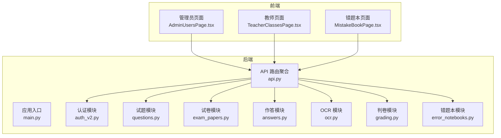
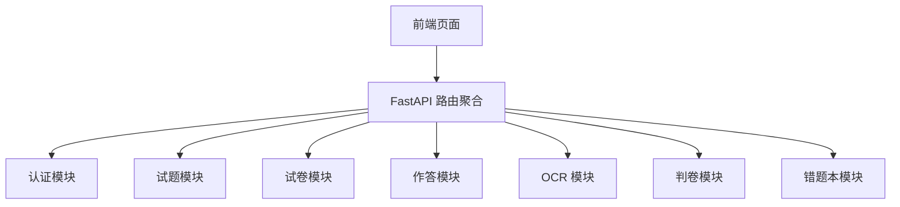
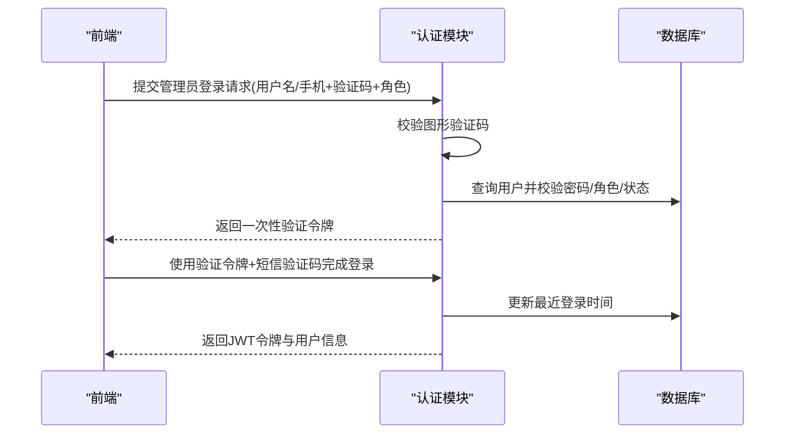
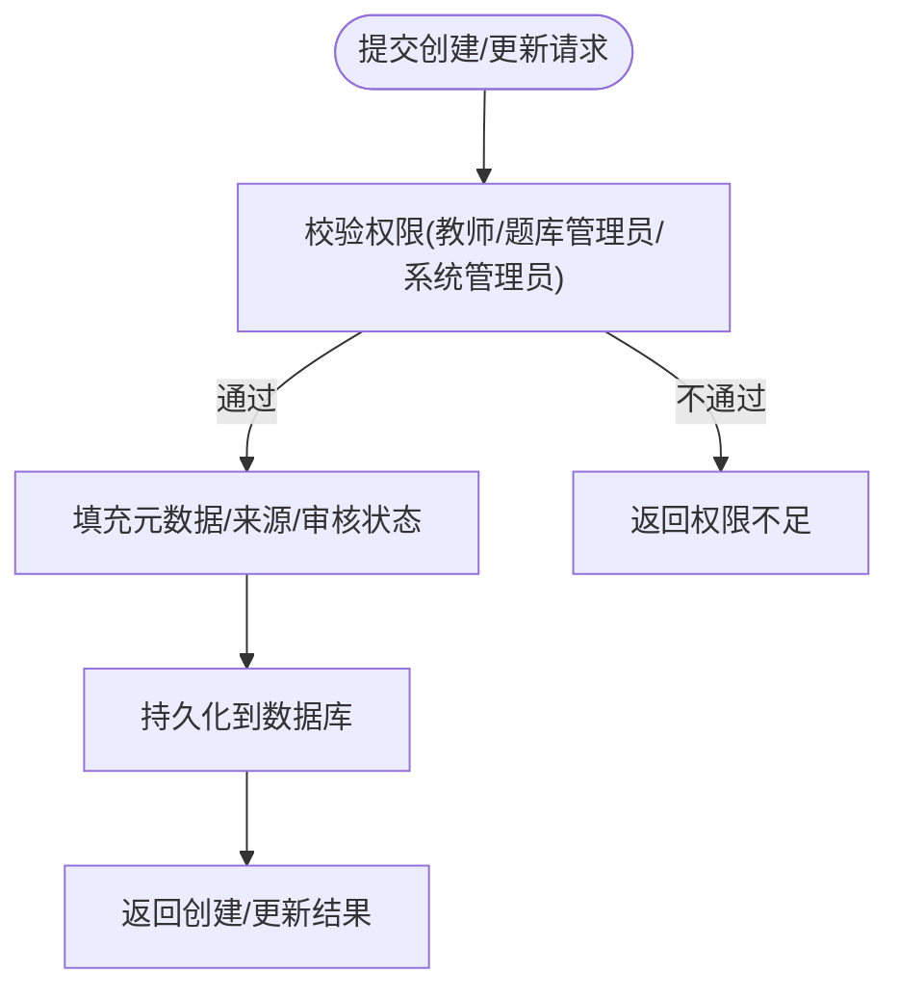
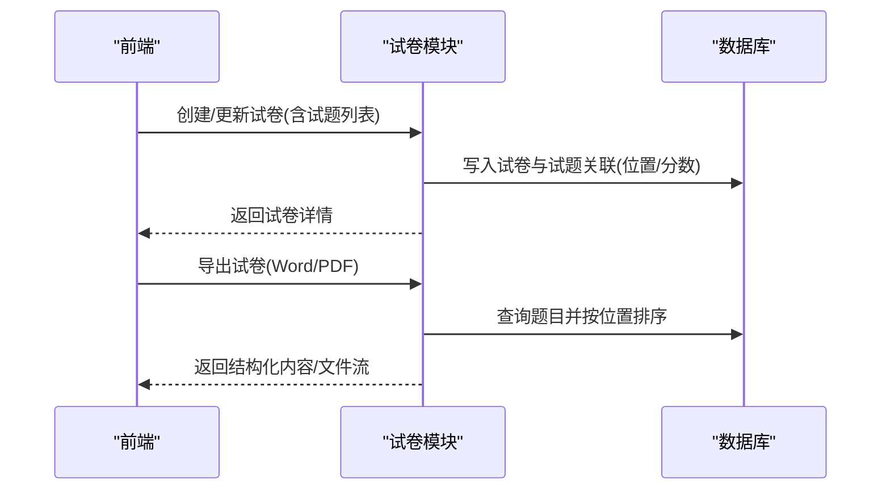
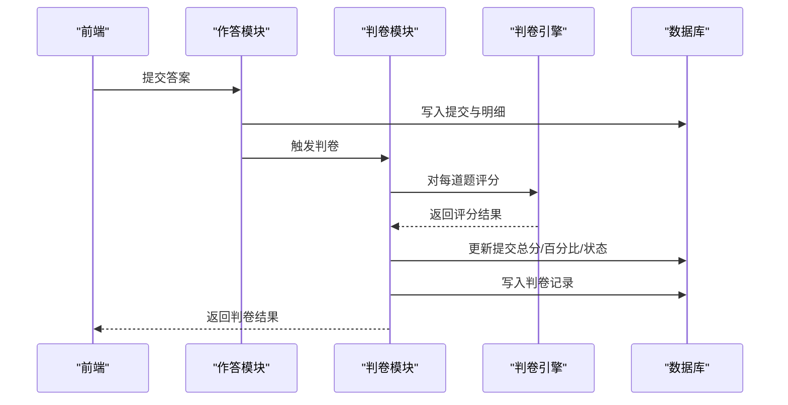
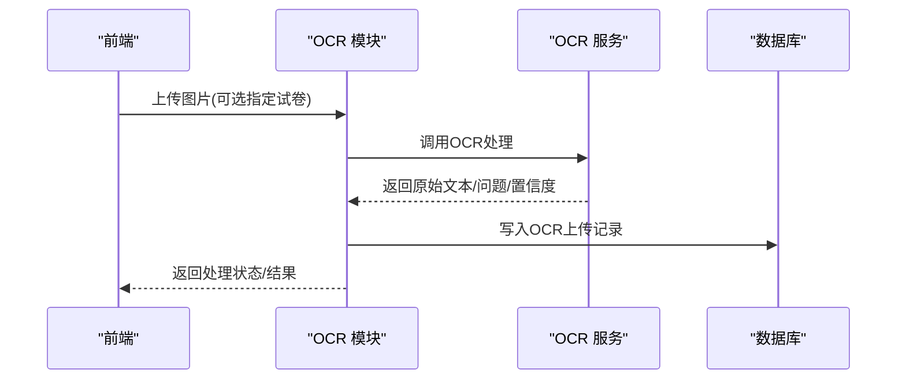
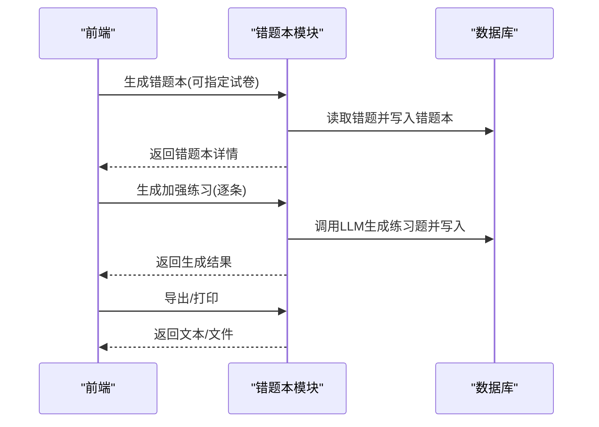
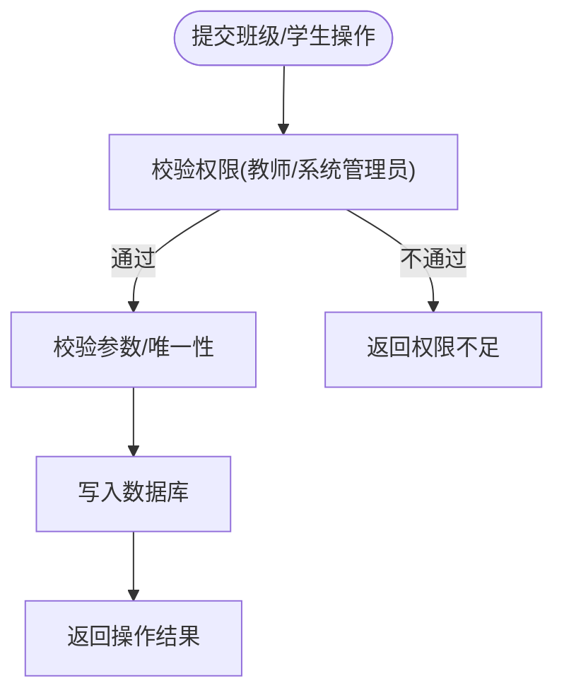
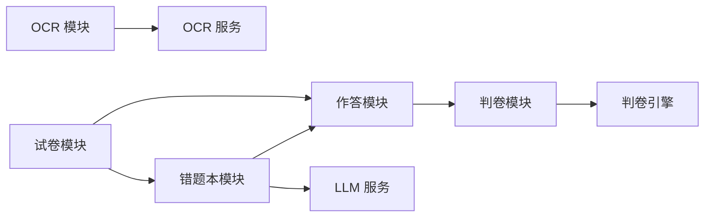

# 核心功能特性

<cite>
**本文档引用的文件**
- [backend/app/main.py](file://backend/app/main.py)
- [backend/app/api/v1/api.py](file://backend/app/api/v1/api.py)
- [backend/app/api/v1/endpoints/auth_v2.py](file://backend/app/api/v1/endpoints/auth_v2.py)
- [backend/app/api/v1/endpoints/questions.py](file://backend/app/api/v1/endpoints/questions.py)
- [backend/app/api/v1/endpoints/exam_papers.py](file://backend/app/api/v1/endpoints/exam_papers.py)
- [backend/app/api/v1/endpoints/answers.py](file://backend/app/api/v1/endpoints/answers.py)
- [backend/app/api/v1/endpoints/ocr.py](file://backend/app/api/v1/endpoints/ocr.py)
- [backend/app/api/v1/endpoints/error_notebooks.py](file://backend/app/api/v1/endpoints/error_notebooks.py)
- [backend/app/api/v1/endpoints/grading.py](file://backend/app/api/v1/endpoints/grading.py)
- [backend/app/services/judge_engine.py](file://backend/app/services/judge_engine.py)
- [backend/app/services/ocr_service.py](file://backend/app/services/ocr_service.py)
- [frontend/src/pages/admin/AdminUsersPage.tsx](file://frontend/src/pages/admin/AdminUsersPage.tsx)
- [frontend/src/pages/teacher/TeacherClassesPage.tsx](file://frontend/src/pages/teacher/TeacherClassesPage.tsx)
- [frontend/src/pages/mistake-book/MistakeBookPage.tsx](file://frontend/src/pages/mistake-book/MistakeBookPage.tsx)
</cite>

## 目录
1. [简介](#简介)
2. [项目结构](#项目结构)
3. [核心组件](#核心组件)
4. [架构总览](#架构总览)
5. [详细组件分析](#详细组件分析)
6. [依赖分析](#依赖分析)
7. [性能考虑](#性能考虑)
8. [故障排查指南](#故障排查指南)
9. [结论](#结论)

## 简介
本文件面向瑞珹教育管理系统，提供核心功能特性的全面说明。系统围绕“教师教学、学生学习、智能评测与个性化提升”展开，覆盖用户认证、试题管理、试卷生成、在线作答、自动判卷、OCR识别、错题本、教师后台管理、系统管理后台等模块。文档强调各模块间的协作关系与数据流转，帮助开发者与使用者快速理解系统能力与边界。

## 项目结构
系统采用前后端分离架构：
- 后端基于 FastAPI，统一响应包装与跨域处理，路由按业务域划分（认证、试题、试卷、作答、OCR、判卷、错题本、教师统计、系统管理等）。
- 前端基于 React + Ant Design，提供教师管理、学生错题本、班级管理、登录与个人资料等页面。

图表来源
- [backend/app/main.py:11-30](file://backend/app/main.py#L11-L30)
- [backend/app/api/v1/api.py:1-26](file://backend/app/api/v1/api.py#L1-L26)

章节来源
- [backend/app/main.py:1-52](file://backend/app/main.py#L1-L52)
- [backend/app/api/v1/api.py:1-26](file://backend/app/api/v1/api.py#L1-L26)

## 核心组件
- 用户认证系统：支持管理员（系统管理员/题库管理员/教师）与学生双通道登录，图形验证码与短信验证码双重校验，支持管理员创建/维护教师账户。
- 试题管理：提供试题增删改查、批量导入导出、典型题标记、按条件检索与过滤。
- 试卷生成：支持手工组卷、关联试题、导出 Word/PDF、按范围/年级/知识点筛选。
- 在线作答：学生提交答案即刻自动判卷，生成判卷记录与通知；支持重判状态变更。
- 自动判卷：规则引擎覆盖单选、多选、填空、主观题评分策略，支持关键词匹配与部分分计算。
- OCR识别：图片上传识别，提取题目与答案，输出结构化结果与置信度，支持人工复核。
- 错题本：自动生成错题本，支持生成加强练习题（基于 LLM）、打印导出、手动录入、试卷复盘。
- 教师后台管理：班级与学生管理、作业/考试统计、错题统计。
- 系统管理后台：用户管理、基础配置、知识树、题型/难度/地区等参考值维护。

章节来源
- [backend/app/api/v1/endpoints/auth_v2.py:1-476](file://backend/app/api/v1/endpoints/auth_v2.py#L1-L476)
- [backend/app/api/v1/endpoints/questions.py:1-434](file://backend/app/api/v1/endpoints/questions.py#L1-L434)
- [backend/app/api/v1/endpoints/exam_papers.py:1-847](file://backend/app/api/v1/endpoints/exam_papers.py#L1-L847)
- [backend/app/api/v1/endpoints/answers.py:1-421](file://backend/app/api/v1/endpoints/answers.py#L1-L421)
- [backend/app/api/v1/endpoints/ocr.py:1-291](file://backend/app/api/v1/endpoints/ocr.py#L1-L291)
- [backend/app/api/v1/endpoints/error_notebooks.py:1-437](file://backend/app/api/v1/endpoints/error_notebooks.py#L1-L437)
- [backend/app/api/v1/endpoints/grading.py:1-143](file://backend/app/api/v1/endpoints/grading.py#L1-L143)
- [backend/app/services/judge_engine.py:1-130](file://backend/app/services/judge_engine.py#L1-L130)
- [backend/app/services/ocr_service.py:1-126](file://backend/app/services/ocr_service.py#L1-L126)
- [frontend/src/pages/admin/AdminUsersPage.tsx:1-128](file://frontend/src/pages/admin/AdminUsersPage.tsx#L1-L128)
- [frontend/src/pages/teacher/TeacherClassesPage.tsx:1-334](file://frontend/src/pages/teacher/TeacherClassesPage.tsx#L1-L334)
- [frontend/src/pages/mistake-book/MistakeBookPage.tsx:1-637](file://frontend/src/pages/mistake-book/MistakeBookPage.tsx#L1-L637)

## 架构总览
系统采用“前端页面 + 后端 API + 数据库”的三层架构。后端以 FastAPI 路由聚合器为中心，按模块拆分接口；服务层封装判卷引擎与 OCR 处理；前端通过统一 API 客户端调用后端接口。

图表来源
- [backend/app/api/v1/api.py:6-26](file://backend/app/api/v1/api.py#L6-L26)

章节来源
- [backend/app/api/v1/api.py:1-26](file://backend/app/api/v1/api.py#L1-L26)

## 详细组件分析

### 用户认证系统
- 功能要点
  - 管理员登录：图形验证码 + 短信验证码 + 角色校验，支持系统管理员、题库管理员、教师三类角色。
  - 学生登录/注册：图形验证码 + 短信验证码，手机号唯一性校验，支持“免密”登录。
  - 管理员管理：系统管理员可创建/查询/更新/删除教师账户，支持学科与年级维度赋权。
  - 个人资料：统一获取/更新个人资料，手机号更新需短信校验。
- 数据流
  - 登录/验证流程：前端提交验证码与凭据 → 后端校验 → 生成 JWT 令牌 → 返回用户类型与基本信息。
  - 管理员操作：系统管理员鉴权 → 查询/更新目标用户 → 写入数据库。

图表来源
- [backend/app/api/v1/endpoints/auth_v2.py:91-183](file://backend/app/api/v1/endpoints/auth_v2.py#L91-L183)

章节来源
- [backend/app/api/v1/endpoints/auth_v2.py:1-476](file://backend/app/api/v1/endpoints/auth_v2.py#L1-L476)

### 试题管理
- 功能要点
  - 创建/更新/删除/查询试题，支持按学科、年级、范围、来源、题型、难度、关键字等过滤。
  - 批量导入/导出，典型题标记与查询。
  - 教师仅可见自身学科范围内的试题。
- 数据流
  - 前端提交创建/更新请求 → 后端校验权限与字段 → 写入数据库 → 返回结果。

图表来源
- [backend/app/api/v1/endpoints/questions.py:17-36](file://backend/app/api/v1/endpoints/questions.py#L17-L36)

章节来源
- [backend/app/api/v1/endpoints/questions.py:1-434](file://backend/app/api/v1/endpoints/questions.py#L1-L434)

### 试卷生成与管理
- 功能要点
  - 创建试卷并可内嵌导入试题，支持导出 Word/PDF。
  - 关联/移除/排序试卷中的试题，按范围/年级/关键字筛选。
  - 学生可查看本人参与过的试卷及最新一次提交状态。
- 数据流
  - 创建/更新/删除试卷 → 维护关联表与子记录 → 导出时按顺序组装题目。

图表来源
- [backend/app/api/v1/endpoints/exam_papers.py:20-64](file://backend/app/api/v1/endpoints/exam_papers.py#L20-L64)
- [backend/app/api/v1/endpoints/exam_papers.py:635-738](file://backend/app/api/v1/endpoints/exam_papers.py#L635-L738)

章节来源
- [backend/app/api/v1/endpoints/exam_papers.py:1-847](file://backend/app/api/v1/endpoints/exam_papers.py#L1-L847)

### 在线作答与自动判卷
- 功能要点
  - 学生提交答案即刻判卷，生成判卷记录与反馈；支持重判状态变更。
  - 判卷引擎覆盖单选、多选、填空、主观题，支持关键词匹配与部分分。
  - 作答完成后发送通知，并根据得分生成错题本。
- 数据流
  - 提交答案 → 写入提交与明细 → 调用判卷引擎 → 计算总分/百分比/反馈 → 写入判卷记录 → 通知与错题本生成。

图表来源
- [backend/app/api/v1/endpoints/answers.py:115-196](file://backend/app/api/v1/endpoints/answers.py#L115-L196)
- [backend/app/api/v1/endpoints/grading.py:19-55](file://backend/app/api/v1/endpoints/grading.py#L19-L55)
- [backend/app/services/judge_engine.py:126-130](file://backend/app/services/judge_engine.py#L126-L130)

章节来源
- [backend/app/api/v1/endpoints/answers.py:1-421](file://backend/app/api/v1/endpoints/answers.py#L1-L421)
- [backend/app/api/v1/endpoints/grading.py:1-143](file://backend/app/api/v1/endpoints/grading.py#L1-L143)
- [backend/app/services/judge_engine.py:1-130](file://backend/app/services/judge_engine.py#L1-L130)

### OCR识别
- 功能要点
  - 图片上传识别，提取题目与答案，输出结构化结果与置信度；置信度低时标记为“需要复核”。
  - 支持查询上传状态与结果，学生仅能查看自己的上传。
- 数据流
  - 上传图片 → 保存临时文件 → OCR 引擎解析 → 结构化结果入库 → 返回状态与结果。

图表来源
- [backend/app/api/v1/endpoints/ocr.py:18-64](file://backend/app/api/v1/endpoints/ocr.py#L18-L64)
- [backend/app/services/ocr_service.py:61-125](file://backend/app/services/ocr_service.py#L61-L125)

章节来源
- [backend/app/api/v1/endpoints/ocr.py:1-291](file://backend/app/api/v1/endpoints/ocr.py#L1-L291)
- [backend/app/services/ocr_service.py:1-126](file://backend/app/services/ocr_service.py#L1-L126)

### 错题本
- 功能要点
  - 自动生成错题本，支持生成加强练习题（基于 LLM），打印导出，手动录入，试卷复盘。
  - 支持批量生成加强练习与批量删除，按日期/学科/关键字筛选。
- 数据流
  - 生成错题本 → 标记提交状态 → 发送通知 → 可选生成加强练习题 → 导出打印。

图表来源
- [backend/app/api/v1/endpoints/error_notebooks.py:22-59](file://backend/app/api/v1/endpoints/error_notebooks.py#L22-L59)
- [backend/app/api/v1/endpoints/error_notebooks.py:199-312](file://backend/app/api/v1/endpoints/error_notebooks.py#L199-L312)
- [frontend/src/pages/mistake-book/MistakeBookPage.tsx:61-81](file://frontend/src/pages/mistake-book/MistakeBookPage.tsx#L61-L81)

章节来源
- [backend/app/api/v1/endpoints/error_notebooks.py:1-437](file://backend/app/api/v1/endpoints/error_notebooks.py#L1-L437)
- [frontend/src/pages/mistake-book/MistakeBookPage.tsx:1-637](file://frontend/src/pages/mistake-book/MistakeBookPage.tsx#L1-L637)

### 教师后台管理
- 功能要点
  - 班级管理：创建/编辑/删除班级，按名称/学科/年级/状态筛选；管理学生（添加现有/手动新增/移除）。
  - 成员管理：支持搜索、分页、批量操作。
- 数据流
  - 前端提交班级/学生操作 → 后端校验权限与唯一性 → 写入数据库 → 返回结果。

图表来源
- [frontend/src/pages/teacher/TeacherClassesPage.tsx:54-73](file://frontend/src/pages/teacher/TeacherClassesPage.tsx#L54-L73)
- [frontend/src/pages/teacher/TeacherClassesPage.tsx:106-137](file://frontend/src/pages/teacher/TeacherClassesPage.tsx#L106-L137)

章节来源
- [frontend/src/pages/teacher/TeacherClassesPage.tsx:1-334](file://frontend/src/pages/teacher/TeacherClassesPage.tsx#L1-L334)

### 系统管理后台
- 功能要点
  - 用户管理：系统管理员可创建/编辑/启停/删除用户，设置角色与默认密码。
  - 基础配置：题型/难度/地区/学科等参考值维护。
- 数据流
  - 管理员操作 → 校验权限 → 写入数据库 → 返回结果。

章节来源
- [frontend/src/pages/admin/AdminUsersPage.tsx:1-128](file://frontend/src/pages/admin/AdminUsersPage.tsx#L1-L128)

## 依赖分析
- 模块耦合
  - 作答模块与判卷模块强耦合：作答提交触发判卷，判卷模块依赖判卷引擎。
  - 错题本模块依赖作答与判卷结果，同时依赖 LLM 服务生成练习题。
  - OCR 模块独立性强，但与作答模块在“拍照扫描录入”场景有交互。
- 外部依赖
  - OCR 服务依赖 Tesseract 与 PIL；若环境缺失则降级提示。
  - 判卷引擎为纯规则实现，不依赖外部模型。
- 循环依赖
  - 当前路由聚合避免了模块间循环导入；服务层相互独立，无循环依赖迹象。

图表来源
- [backend/app/api/v1/endpoints/answers.py:15-196](file://backend/app/api/v1/endpoints/answers.py#L15-L196)
- [backend/app/api/v1/endpoints/grading.py:19-55](file://backend/app/api/v1/endpoints/grading.py#L19-L55)
- [backend/app/services/judge_engine.py:126-130](file://backend/app/services/judge_engine.py#L126-L130)
- [backend/app/api/v1/endpoints/error_notebooks.py:200-312](file://backend/app/api/v1/endpoints/error_notebooks.py#L200-L312)
- [backend/app/api/v1/endpoints/ocr.py:18-64](file://backend/app/api/v1/endpoints/ocr.py#L18-L64)
- [backend/app/services/ocr_service.py:61-125](file://backend/app/services/ocr_service.py#L61-L125)

章节来源
- [backend/app/api/v1/endpoints/answers.py:1-421](file://backend/app/api/v1/endpoints/answers.py#L1-L421)
- [backend/app/api/v1/endpoints/grading.py:1-143](file://backend/app/api/v1/endpoints/grading.py#L1-L143)
- [backend/app/services/judge_engine.py:1-130](file://backend/app/services/judge_engine.py#L1-L130)
- [backend/app/api/v1/endpoints/error_notebooks.py:1-437](file://backend/app/api/v1/endpoints/error_notebooks.py#L1-L437)
- [backend/app/api/v1/endpoints/ocr.py:1-291](file://backend/app/api/v1/endpoints/ocr.py#L1-L291)
- [backend/app/services/ocr_service.py:1-126](file://backend/app/services/ocr_service.py#L1-L126)

## 性能考虑
- 分页与限制
  - 多处接口限制分页大小（如 200），防止超大数据集查询导致资源耗尽。
- 查询优化
  - 使用 SQL 函数计总数与子查询，减少不必要的全表扫描。
- 并发与事务
  - 判卷过程使用原子事务，保证评分一致性；OCR 处理异步写入数据库。
- 缓存与中间态
  - 建议在高频查询（如题型/难度/地区枚举）引入缓存，降低数据库压力。

## 故障排查指南
- 认证相关
  - 验证码错误/过期：检查图形验证码与短信验证码校验逻辑。
  - 角色不匹配：确认登录角色与用户实际角色一致。
- 作答与判卷
  - 作答后未生成错题本：检查提交状态是否为“已生成”，以及判卷百分比阈值。
  - 判卷异常：查看判卷记录状态与反馈，确认题型与标准答案格式。
- OCR 识别
  - 未安装 Tesseract：服务会返回失败并提示安装命令；确保语言包安装。
  - 置信度低：标记为“需要复核”，建议人工校对或重新拍摄。
- 错题本
  - 生成失败：确认是否有错题可生成，或提交状态是否被锁定。
  - 加强练习生成失败：检查 LLM 服务可用性与网络连通性。

章节来源
- [backend/app/api/v1/endpoints/auth_v2.py:100-146](file://backend/app/api/v1/endpoints/auth_v2.py#L100-L146)
- [backend/app/api/v1/endpoints/answers.py:157-196](file://backend/app/api/v1/endpoints/answers.py#L157-L196)
- [backend/app/api/v1/endpoints/grading.py:19-55](file://backend/app/api/v1/endpoints/grading.py#L19-L55)
- [backend/app/services/ocr_service.py:71-78](file://backend/app/services/ocr_service.py#L71-L78)
- [backend/app/api/v1/endpoints/error_notebooks.py:22-59](file://backend/app/api/v1/endpoints/error_notebooks.py#L22-L59)

## 结论
瑞珹教育管理系统围绕“智能评测+个性化提升”构建，具备完善的认证体系、题库与试卷管理、在线作答与自动判卷、OCR识别与错题本闭环。前后端职责清晰、模块边界明确，具备良好的扩展性与可维护性。建议后续完善 OCR 批量上传、判卷模型切换与监控告警、错题本导出 PDF 等功能，持续提升用户体验与系统稳定性。