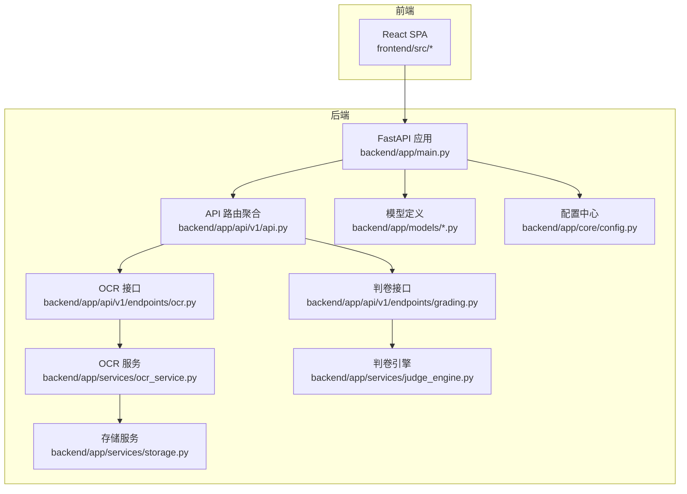
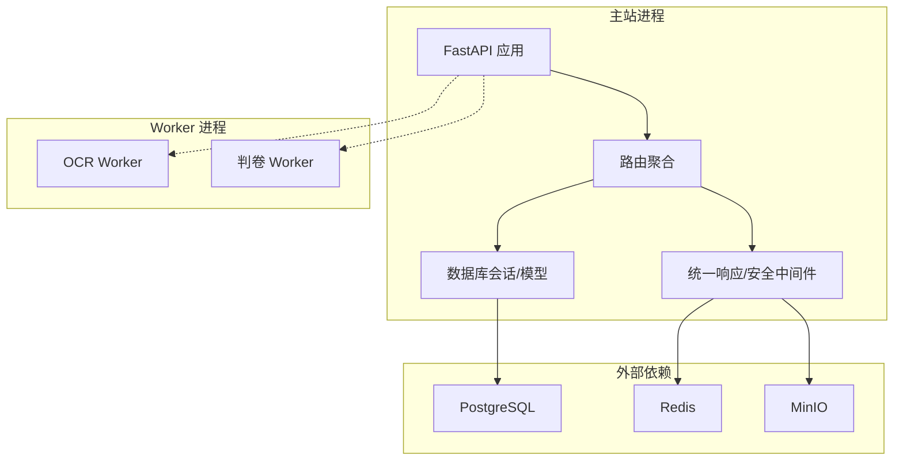
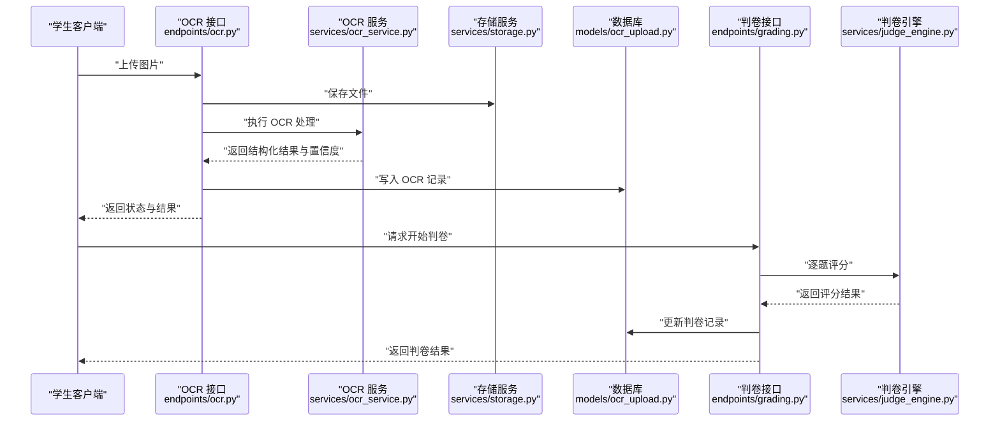
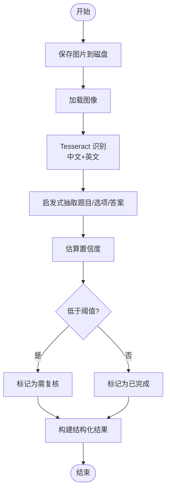
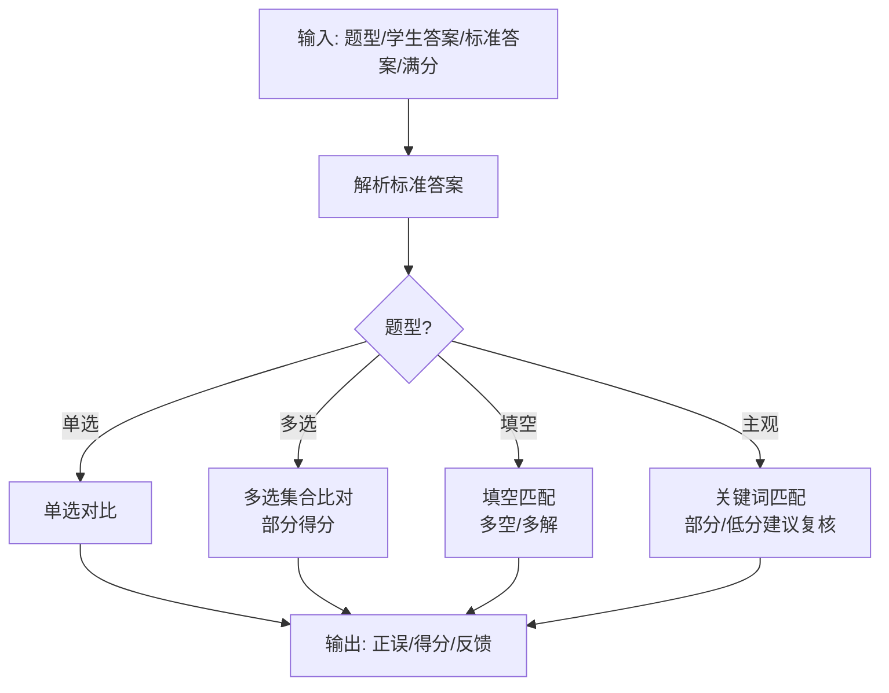
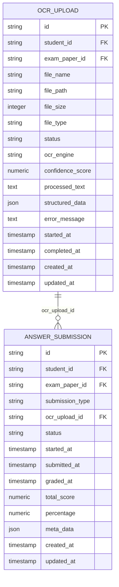
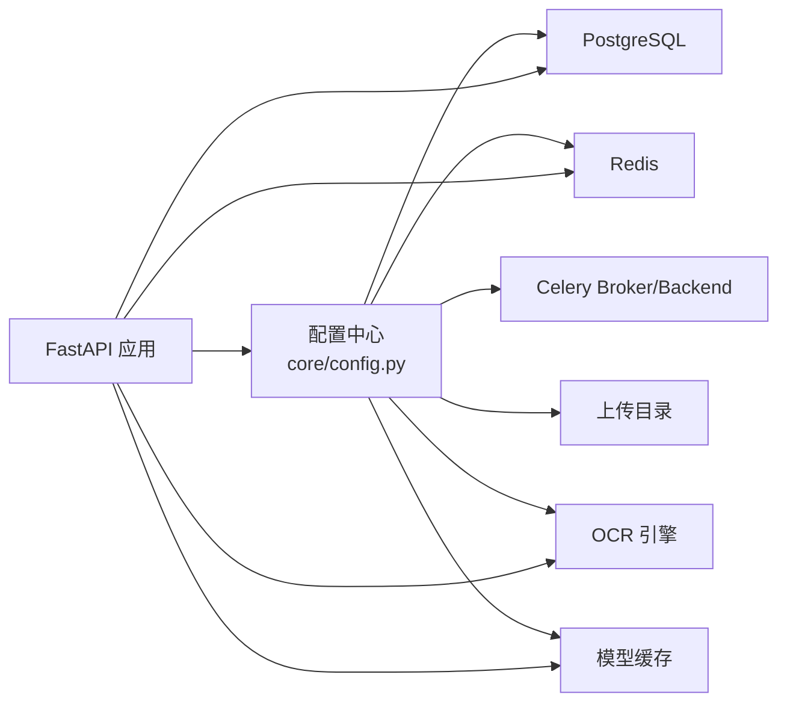

# 系统特色亮点

<cite>
**本文引用的文件**
- [backend/app/main.py](file://backend/app/main.py)
- [backend/app/api/v1/api.py](file://backend/app/api/v1/api.py)
- [backend/app/api/v1/endpoints/ocr.py](file://backend/app/api/v1/endpoints/ocr.py)
- [backend/app/services/ocr_service.py](file://backend/app/services/ocr_service.py)
- [backend/app/api/v1/endpoints/grading.py](file://backend/app/api/v1/endpoints/grading.py)
- [backend/app/services/judge_engine.py](file://backend/app/services/judge_engine.py)
- [backend/app/services/storage.py](file://backend/app/services/storage.py)
- [backend/app/models/ocr_upload.py](file://backend/app/models/ocr_upload.py)
- [backend/app/models/answer_submission.py](file://backend/app/models/answer_submission.py)
- [backend/app/core/config.py](file://backend/app/core/config.py)
- [backend/app/db/base.py](file://backend/app/db/base.py)
- [backend/sysconfig.json](file://backend/sysconfig.json)
- [docs/project-summary.md](file://docs/project-summary.md)
</cite>

## 目录
1. [引言](#引言)
2. [项目结构](#项目结构)
3. [核心组件](#核心组件)
4. [架构总览](#架构总览)
5. [详细组件分析](#详细组件分析)
6. [依赖分析](#依赖分析)
7. [性能考量](#性能考量)
8. [故障排查指南](#故障排查指南)
9. [结论](#结论)
10. [附录](#附录)

## 引言
本系统以“模块化单体 + 独立 Worker 进程”的混合架构为核心，聚焦教育管理场景中的高并发、高复杂度业务，形成四大关键链路闭环：自动判卷、错题本、OCR识别与通知服务。系统在保证快速交付的同时，预留了面向未来的扩展能力，既满足当前教学与评测需求，又为后续引入大模型、分布式计算与容器化编排打下坚实基础。

## 项目结构
后端采用 FastAPI + SQLAlchemy 的模块化单体架构，API 路由按功能域拆分，服务层封装业务逻辑，模型层统一数据契约，配置与系统参数集中管理。前端为 React SPA，通过统一 API 与后端交互。

图示来源
- [backend/app/main.py:1-52](file://backend/app/main.py#L1-L52)
- [backend/app/api/v1/api.py:1-26](file://backend/app/api/v1/api.py#L1-L26)
- [backend/app/api/v1/endpoints/ocr.py:1-291](file://backend/app/api/v1/endpoints/ocr.py#L1-L291)
- [backend/app/api/v1/endpoints/grading.py:1-143](file://backend/app/api/v1/endpoints/grading.py#L1-L143)
- [backend/app/services/ocr_service.py:1-126](file://backend/app/services/ocr_service.py#L1-L126)
- [backend/app/services/judge_engine.py:1-130](file://backend/app/services/judge_engine.py#L1-L130)
- [backend/app/services/storage.py:1-55](file://backend/app/services/storage.py#L1-L55)
- [backend/app/models/ocr_upload.py:1-36](file://backend/app/models/ocr_upload.py#L1-L36)
- [backend/app/models/answer_submission.py:1-37](file://backend/app/models/answer_submission.py#L1-L37)
- [backend/app/core/config.py:1-98](file://backend/app/core/config.py#L1-L98)

章节来源
- [backend/app/main.py:1-52](file://backend/app/main.py#L1-L52)
- [backend/app/api/v1/api.py:1-26](file://backend/app/api/v1/api.py#L1-L26)
- [docs/project-summary.md:61-63](file://docs/project-summary.md#L61-L63)

## 核心组件
- 模块化单体架构：通过 API 路由聚合与服务层解耦，实现高内聚、低耦合；同时将 GPU 密集型任务（OCR/判卷）剥离为独立 Worker，降低主站负载与资源争用。
- OCR 识别与结构化解析：基于 Tesseract 的图像文字识别，结合启发式规则抽取题目、选项与答案，输出结构化结果并带置信度评估。
- 规则驱动判卷引擎：覆盖单选、多选、填空、主观题的评分策略，支持部分得分与人工复核提示，确保客观题快速稳定出分。
- 统一响应与安全中间件：统一 API 响应包装与跨域策略，配合鉴权与权限控制，保障系统安全与一致性。
- 存储与对象化访问：本地或 MinIO 对象存储双栈回退，提供预签名 URL 访问，兼顾开发与生产部署弹性。

章节来源
- [backend/app/api/v1/endpoints/ocr.py:18-64](file://backend/app/api/v1/endpoints/ocr.py#L18-L64)
- [backend/app/services/ocr_service.py:61-126](file://backend/app/services/ocr_service.py#L61-L126)
- [backend/app/services/judge_engine.py:126-130](file://backend/app/services/judge_engine.py#L126-L130)
- [backend/app/main.py:17-27](file://backend/app/main.py#L17-L27)
- [backend/app/services/storage.py:25-55](file://backend/app/services/storage.py#L25-L55)

## 架构总览
系统采用“模块化单体 + 独立 Worker”的混合架构，核心思想是在保持单体应用开发效率的前提下，将 GPU/IO 密集型任务（OCR、判卷）下沉至专用 Worker，避免主站成为性能瓶颈。配置中心与系统参数集中管理，便于在不同环境间切换与扩展。

图示来源
- [backend/app/main.py:11-30](file://backend/app/main.py#L11-L30)
- [backend/app/core/config.py:73-86](file://backend/app/core/config.py#L73-L86)
- [backend/sysconfig.json:35-39](file://backend/sysconfig.json#L35-L39)

章节来源
- [docs/project-summary.md:61-63](file://docs/project-summary.md#L61-L63)
- [backend/sysconfig.json:35-39](file://backend/sysconfig.json#L35-L39)

## 详细组件分析

### OCR 识别与自动判卷链路
系统提供从拍照上传到结构化解析、置信度评估与人工复核的完整链路。OCR 接口负责接收图片、调用 OCR 服务进行识别，并将结果持久化；判卷接口根据提交的答题记录，触发规则引擎进行评分，并生成判卷记录。

图示来源
- [backend/app/api/v1/endpoints/ocr.py:18-64](file://backend/app/api/v1/endpoints/ocr.py#L18-L64)
- [backend/app/services/ocr_service.py:61-126](file://backend/app/services/ocr_service.py#L61-L126)
- [backend/app/services/storage.py:25-55](file://backend/app/services/storage.py#L25-L55)
- [backend/app/models/ocr_upload.py:8-36](file://backend/app/models/ocr_upload.py#L8-L36)
- [backend/app/api/v1/endpoints/grading.py:19-55](file://backend/app/api/v1/endpoints/grading.py#L19-L55)
- [backend/app/services/judge_engine.py:126-130](file://backend/app/services/judge_engine.py#L126-L130)

章节来源
- [backend/app/api/v1/endpoints/ocr.py:18-64](file://backend/app/api/v1/endpoints/ocr.py#L18-L64)
- [backend/app/services/ocr_service.py:20-126](file://backend/app/services/ocr_service.py#L20-L126)
- [backend/app/models/ocr_upload.py:8-36](file://backend/app/models/ocr_upload.py#L8-L36)
- [backend/app/api/v1/endpoints/grading.py:19-55](file://backend/app/api/v1/endpoints/grading.py#L19-L55)
- [backend/app/services/judge_engine.py:126-130](file://backend/app/services/judge_engine.py#L126-L130)

### OCR 服务算法流程
OCR 服务包含图像保存、Tesseract 识别、文本清洗与启发式抽取、置信度估算以及结构化输出。该流程对中文+英文场景进行了针对性优化，并通过阈值判断是否需要人工复核。

图示来源
- [backend/app/services/ocr_service.py:61-126](file://backend/app/services/ocr_service.py#L61-L126)

章节来源
- [backend/app/services/ocr_service.py:20-126](file://backend/app/services/ocr_service.py#L20-L126)

### 判卷引擎评分策略
判卷引擎针对不同题型提供明确的评分逻辑：单选/多选严格比对；填空支持多空与多种可接受答案；主观题基于关键词匹配给出部分分并建议人工复核。所有评分均直接返回分数与反馈，不进行二次归一化，确保透明可控。

图示来源
- [backend/app/services/judge_engine.py:126-130](file://backend/app/services/judge_engine.py#L126-L130)

章节来源
- [backend/app/services/judge_engine.py:126-130](file://backend/app/services/judge_engine.py#L126-L130)

### 数据模型与约束
数据库模型采用统一命名规范与约束，确保数据一致性与可维护性。OCR 上传与答题提交模型分别承载 OCR 结果与判卷过程的关键字段，并通过外键关联支撑完整的业务闭环。

图示来源
- [backend/app/models/ocr_upload.py:8-36](file://backend/app/models/ocr_upload.py#L8-L36)
- [backend/app/models/answer_submission.py:9-37](file://backend/app/models/answer_submission.py#L9-L37)
- [backend/app/db/base.py:5-21](file://backend/app/db/base.py#L5-L21)

章节来源
- [backend/app/models/ocr_upload.py:8-36](file://backend/app/models/ocr_upload.py#L8-L36)
- [backend/app/models/answer_submission.py:9-37](file://backend/app/models/answer_submission.py#L9-L37)
- [backend/app/db/base.py:5-21](file://backend/app/db/base.py#L5-L21)

## 依赖分析
系统依赖清晰，核心包括：Web 框架（FastAPI）、ORM（SQLAlchemy）、数据库（PostgreSQL）、缓存（Redis）、对象存储（MinIO）、OCR 引擎（Tesseract）。配置中心集中管理数据库、Redis、Celery、上传目录、OCR 引擎与模型缓存路径等参数，便于在不同环境灵活切换。

图示来源
- [backend/app/core/config.py:55-98](file://backend/app/core/config.py#L55-L98)
- [backend/sysconfig.json:1-48](file://backend/sysconfig.json#L1-L48)

章节来源
- [backend/app/core/config.py:55-98](file://backend/app/core/config.py#L55-L98)
- [backend/sysconfig.json:1-48](file://backend/sysconfig.json#L1-L48)

## 性能考量
- 并发与吞吐：系统通过配置中心与系统参数控制 OCR 与判卷的最大并发数，避免资源争用导致的性能抖动。
- 资源隔离：将 GPU 密集型任务下沉至独立 Worker，减少主站阻塞，提升整体响应速度。
- 缓存与存储：Redis 作为缓存层，MinIO 提供高可靠对象存储，结合预签名 URL 降低带宽压力。
- 数据库优化：统一命名约束与索引策略，配合异步数据库连接，提升查询与写入效率。

章节来源
- [backend/sysconfig.json:35-39](file://backend/sysconfig.json#L35-L39)
- [backend/app/core/config.py:73-86](file://backend/app/core/config.py#L73-L86)
- [backend/app/services/storage.py:25-55](file://backend/app/services/storage.py#L25-L55)

## 故障排查指南
- OCR 无法识别：检查 OCR 引擎安装与语言包配置，确认接口返回的可用性标识与错误信息。
- 置信度低需复核：当 OCR 状态为“需复核”时，建议人工校验或调整拍摄角度与光线条件。
- 判卷异常：核对标准答案格式与题型映射，确保引擎解析与评分逻辑一致。
- 存储访问失败：若 MinIO 不可用，系统自动回退到本地存储，检查上传目录权限与磁盘空间。
- 权限问题：学生仅能操作自身资源，教师与管理员可查看全部；若出现 403，请确认当前用户角色。

章节来源
- [backend/app/api/v1/endpoints/ocr.py:26-27](file://backend/app/api/v1/endpoints/ocr.py#L26-L27)
- [backend/app/api/v1/endpoints/ocr.py:33-64](file://backend/app/api/v1/endpoints/ocr.py#L33-L64)
- [backend/app/api/v1/endpoints/grading.py:32-33](file://backend/app/api/v1/endpoints/grading.py#L32-L33)
- [backend/app/services/storage.py:11-22](file://backend/app/services/storage.py#L11-L22)

## 结论
本系统以“模块化单体 + 独立 Worker”的前瞻设计，实现了教育管理场景下的高并发、高可用与高扩展性。OCR 与自动判卷两大智能子系统，结合统一的安全与响应机制，显著提升了教学评测效率与用户体验。通过清晰的依赖与配置管理，系统在开发与生产环境中均具备良好的可维护性与可演进性。

## 附录
- 项目总览与迭代规划：包含服务运行清单、指标统计与架构策略，体现模块化单体与 Worker 分离的设计取向。
- 系统参数与默认值：集中于配置中心与系统配置文件，便于按需调整与环境迁移。

章节来源
- [docs/project-summary.md:61-63](file://docs/project-summary.md#L61-L63)
- [backend/sysconfig.json:1-48](file://backend/sysconfig.json#L1-L48)