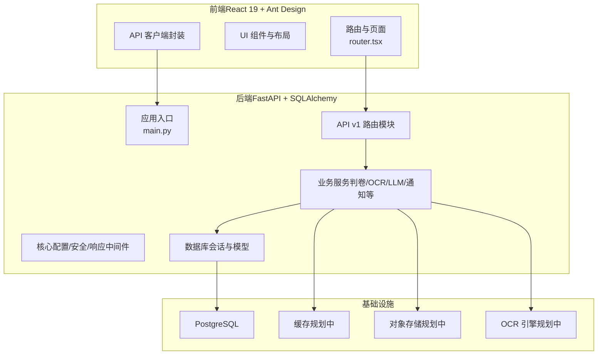
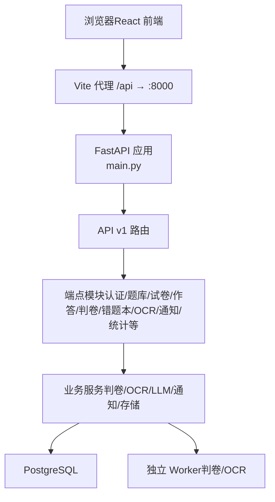
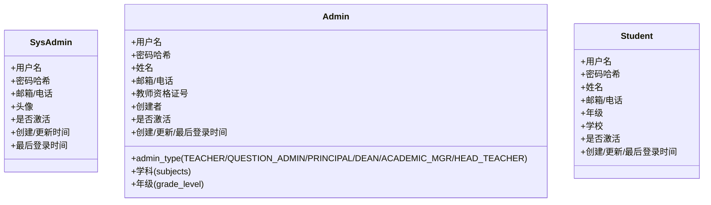
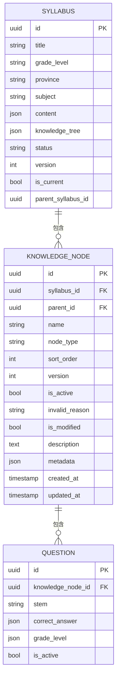
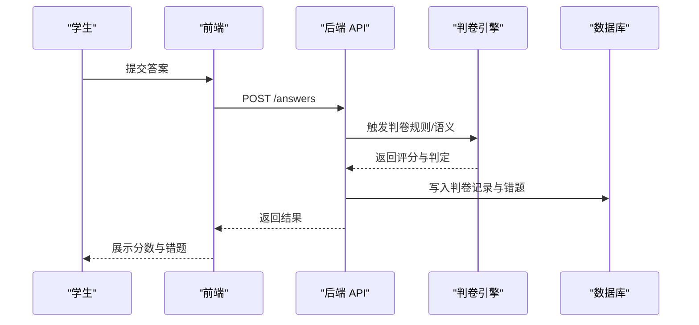
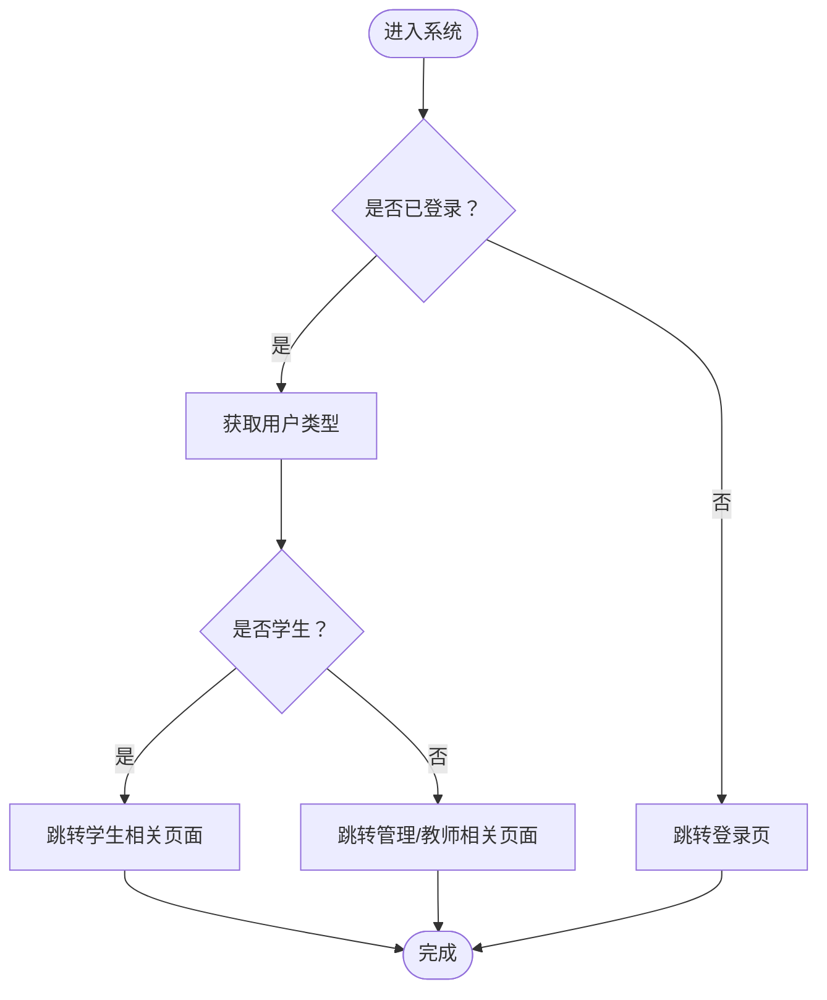
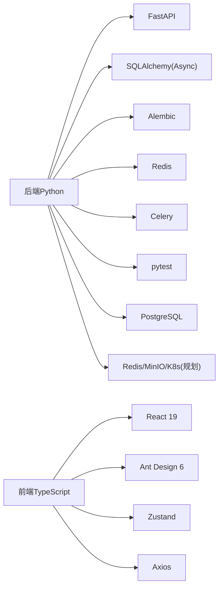

# 项目介绍与背景

<cite>
**本文引用的文件**
- [CLAUDE.md](file://CLAUDE.md)
- [project-summary.md](file://docs/project-summary.md)
- [PROJECT_STATUS.md](file://docs/PROJECT_STATUS.md)
- [requirements-v2.1.1.md](file://docs/requirements-v2.1.1.md)
- [backend-api-plan.md](file://nDocs/backend-api-plan.md)
- [ram-requirements-v2.4.md](file://docs/ram-requirements-v2.4.md)
- [main.py](file://backend/app/main.py)
- [requirements.txt](file://backend/requirements.txt)
- [router.tsx](file://frontend/src/router.tsx)
- [student.py](file://backend/app/models/student.py)
- [admin.py](file://backend/app/models/admin.py)
- [sys_admin.py](file://backend/app/models/sys_admin.py)
- [001_v22_initial.py](file://backend/alembic/versions/001_v22_initial.py)
</cite>

## 目录
1. [引言](#引言)
2. [项目结构](#项目结构)
3. [核心组件](#核心组件)
4. [架构总览](#架构总览)
5. [详细组件分析](#详细组件分析)
6. [依赖分析](#依赖分析)
7. [性能考虑](#性能考虑)
8. [故障排查指南](#故障排查指南)
9. [结论](#结论)
10. [附录](#附录)

## 引言
瑞珹教育管理系统是一个面向“课堂—作业—错题—巩固”的闭环学习平台，致力于通过标准化的题库、智能化的自动判卷、结构化的错题本与可追踪的知识树，帮助学生高效学习、教师精准教学、管理员科学运营。项目当前处于快速演进阶段，已完成核心链路（在线作答、自动判卷、错题本）的落地，并持续完善 OCR、通知、自学调度等能力。

本项目的核心愿景是：让教与学更高效、更透明、更可追踪。通过技术手段降低重复劳动、提升个性化学习效率，同时为教师提供教学分析工具，为管理者提供系统治理能力，最终推动教育资源的优化配置与教学质量的持续提升。

## 项目结构
系统采用前后端分离架构，后端基于 FastAPI + SQLAlchemy（异步）构建，前端基于 React 19 + Ant Design + TypeScript，数据库采用 PostgreSQL。整体目录组织遵循“按层/按功能”划分，便于团队协作与长期维护。

图表来源
- [main.py:11-31](file://backend/app/main.py#L11-L31)
- [router.tsx:44-79](file://frontend/src/router.tsx#L44-L79)

章节来源
- [CLAUDE.md:39-51](file://CLAUDE.md#L39-L51)
- [CLAUDE.md:90-132](file://CLAUDE.md#L90-L132)
- [requirements.txt:1-27](file://backend/requirements.txt#L1-L27)

## 核心组件
- 用户与权限体系：三张用户表（系统管理员、教师/题库管理员、学生），支持角色下拉登录与细粒度 RBAC。
- 试题与试卷：支持多种题型与答案格式，提供高级搜索、典型题标记、适用范围（跨年级/章节/知识点）等能力。
- 自动判卷：规则匹配引擎覆盖单选、多选、填空与主观题关键词匹配，支持评分与错题收集。
- 错题本：判卷后自动生成，支持导出与强化练习。
- 知识树与考纲：版本化知识树，支持父子变更联动失效、分支批量设置有效/无效、版本对比与回滚。
- 管理后台：系统配置（LLM、OCR、数据库）、学科管理、通知与数据库内省等。
- 前端路由：根据用户角色动态跳转至仪表盘、题库、试卷、错题本、教师统计、管理后台等页面。

章节来源
- [CLAUDE.md:133-143](file://CLAUDE.md#L133-L143)
- [CLAUDE.md:144-150](file://CLAUDE.md#L144-L150)
- [CLAUDE.md:151-172](file://CLAUDE.md#L151-L172)
- [PROJECT_STATUS.md:40-51](file://docs/PROJECT_STATUS.md#L40-L51)
- [requirements-v2.1.1.md:9-43](file://docs/requirements-v2.1.1.md#L9-L43)

## 架构总览
系统采用“模块化单体 + 独立 Worker 进程”的混合架构，将 GPU 密集型任务（判卷/OCR）拆分为独立进程，避免过早微服务化带来的运维复杂度。后端通过统一的 API v1 前缀提供服务，前端通过代理将 /api 请求转发至后端。

图表来源
- [CLAUDE.md:90-119](file://CLAUDE.md#L90-L119)
- [main.py:29-31](file://backend/app/main.py#L29-L31)

章节来源
- [CLAUDE.md:61-74](file://CLAUDE.md#L61-L74)
- [backend-api-plan.md:7-14](file://nDocs/backend-api-plan.md#L7-L14)

## 详细组件分析

### 用户与角色体系
系统采用三表分离的用户模型，分别承载不同角色的登录入口与权限边界，配合 JWT 与 RBAC 实现细粒度访问控制。

图表来源
- [sys_admin.py:8-22](file://backend/app/models/sys_admin.py#L8-L22)
- [admin.py:9-27](file://backend/app/models/admin.py#L9-L27)
- [student.py:8-23](file://backend/app/models/student.py#L8-L23)

章节来源
- [CLAUDE.md:133-143](file://CLAUDE.md#L133-L143)
- [router.tsx:24-42](file://frontend/src/router.tsx#L24-L42)

### 知识树与考纲（版本化）
知识树与考纲采用“版本化 + 状态联动”的设计，确保当父节点修改时，子树自动失效并可追溯版本差异，支持分支批量设置有效/无效与版本回滚。

图表来源
- [001_v22_initial.py:308-319](file://backend/alembic/versions/001_v22_initial.py#L308-L319)
- [001_v22_initial.py:345-360](file://backend/alembic/versions/001_v22_initial.py#L345-L360)
- [requirements-v2.1.1.md:84-89](file://docs/requirements-v2.1.1.md#L84-L89)

章节来源
- [requirements-v2.1.1.md:9-43](file://docs/requirements-v2.1.1.md#L9-L43)
- [requirements-v2.1.1.md:93-124](file://docs/requirements-v2.1.1.md#L93-L124)

### 自动判卷与错题本（核心流程）
系统提供从“作答提交 → 规则匹配/语义评分 → 成绩反馈 → 错题收集”的完整链路，支持客观题与主观题的差异化处理。

图表来源
- [backend-api-plan.md:94-111](file://nDocs/backend-api-plan.md#L94-L111)
- [CLAUDE.md:144-150](file://CLAUDE.md#L144-L150)

章节来源
- [backend-api-plan.md:94-111](file://nDocs/backend-api-plan.md#L94-L111)
- [CLAUDE.md:144-150](file://CLAUDE.md#L144-L150)

### 前端路由与页面（角色驱动）
前端根据用户类型动态路由到不同页面，例如学生进入“我的试卷/错题本/典型题”，教师进入“班级管理/统计”，管理员进入“系统配置/题库管理”。

图表来源
- [router.tsx:26-42](file://frontend/src/router.tsx#L26-L42)
- [router.tsx:44-79](file://frontend/src/router.tsx#L44-L79)

章节来源
- [router.tsx:26-42](file://frontend/src/router.tsx#L26-L42)
- [router.tsx:44-79](file://frontend/src/router.tsx#L44-L79)

## 依赖分析
- 后端依赖：FastAPI、SQLAlchemy（异步）、Alembic、Pydantic、Redis、Celery、pytest 等，支撑高性能 API、异步数据库访问、任务队列与测试。
- 前端依赖：React 19、Ant Design 6、TypeScript、Zustand、React Router 7、Axios 等，提供现代化 UI 与状态管理。
- 基础设施：PostgreSQL（生产）、Redis（规划）、MinIO（规划）、Kubernetes（规划）、CI/CD（规划）。

图表来源
- [requirements.txt:1-27](file://backend/requirements.txt#L1-L27)
- [CLAUDE.md:39-51](file://CLAUDE.md#L39-L51)

章节来源
- [requirements.txt:1-27](file://backend/requirements.txt#L1-L27)
- [CLAUDE.md:39-51](file://CLAUDE.md#L39-L51)

## 性能考虑
- 异步数据库访问：使用异步 SQLAlchemy 会话，减少 I/O 阻塞，提升高并发下的响应速度。
- 任务队列：判卷与 OCR 等 CPU/GPU 密集型任务通过 Celery 分离，避免阻塞主请求线程。
- 缓存层：Redis 作为缓存与会话存储（规划中），可显著降低热点数据查询延迟。
- 前端优化：Ant Design 组件按需加载、状态管理集中化，减少不必要的重渲染。
- 数据库索引与查询：对 JSONB 字段与常用筛选字段建立索引，优化复杂查询性能。

## 故障排查指南
- 健康检查：后端提供健康检查端点，可用于容器编排与自动化探活。
- 日志与配置：系统配置集中于运行时配置文件，支持日志级别与导出上限等参数调整。
- 常见问题定位：
  - 数据库迁移失败：检查 Alembic 配置与数据库连接信息。
  - 前端无法访问后端：确认 Vite 代理配置与 CORS 设置。
  - 判卷异常：检查判卷引擎日志与题目答案格式一致性。
  - OCR 未集成：确认 OCR 引擎与 MinIO 配置（规划中）。

章节来源
- [main.py:50-52](file://backend/app/main.py#L50-L52)
- [ram-requirements-v2.4.md:144-166](file://docs/ram-requirements-v2.4.md#L144-L166)

## 结论
瑞珹教育管理系统以“闭环学习”为核心理念，围绕题库、作答、判卷、错题本与知识树构建了完整的教学辅助体系。项目当前已完成核心链路的落地，正在推进 OCR、通知、自学调度与基础设施完善。通过模块化单体 + 独立 Worker 的架构策略，系统在保证可扩展性的同时降低了运维成本。未来将持续完善 AI 驱动的智能出题与个性化学习路径，助力教育数字化转型。

## 附录
- 项目状态与指标：系统概览、运行服务、数据现状与功能矩阵。
- 迭代规划与路线图：四条核心链路、里程碑与技术债务偿还计划。
- API 与数据模型：端点清单、响应规范、版本化知识树与适用范围设计。
- 管理端页面重组：基础参数配置与系统配置的页面结构调整。

章节来源
- [PROJECT_STATUS.md:1-75](file://docs/PROJECT_STATUS.md#L1-L75)
- [project-summary.md:39-87](file://docs/project-summary.md#L39-L87)
- [backend-api-plan.md:16-40](file://nDocs/backend-api-plan.md#L16-L40)
- [requirements-v2.1.1.md:93-196](file://docs/requirements-v2.1.1.md#L93-L196)
- [ram-requirements-v2.4.md:1-75](file://docs/ram-requirements-v2.4.md#L1-L75)