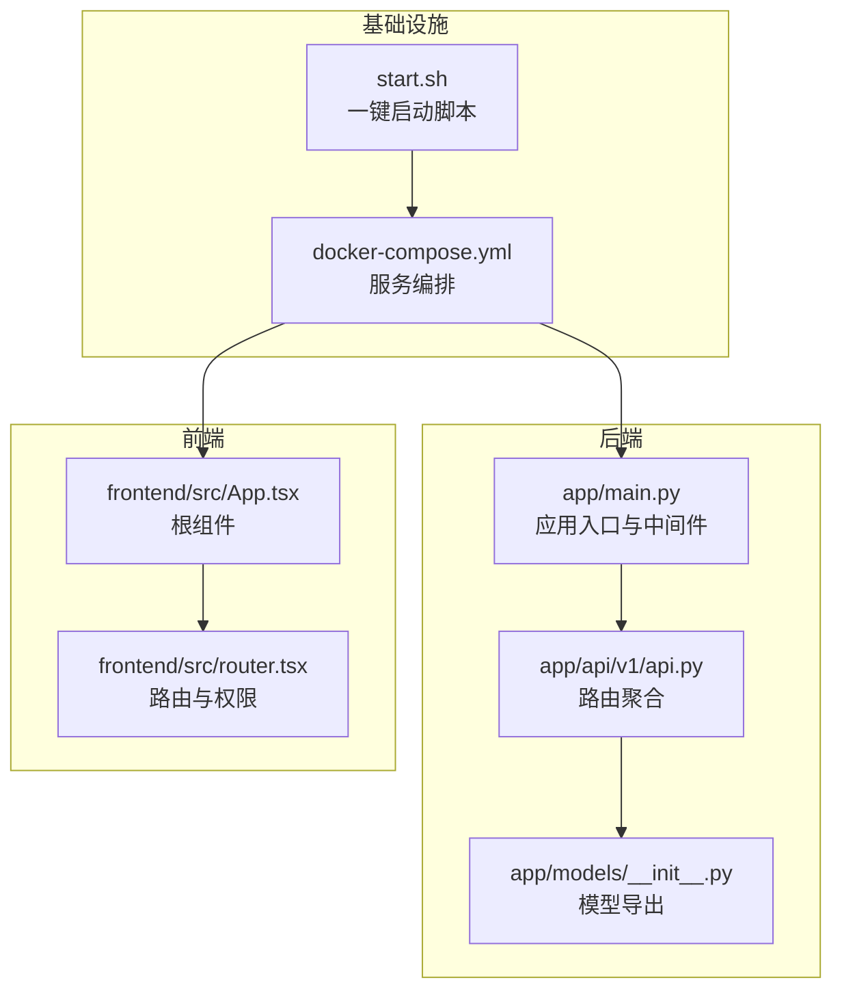
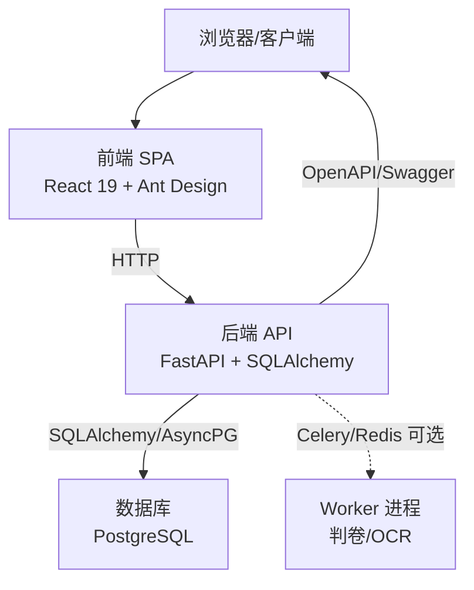
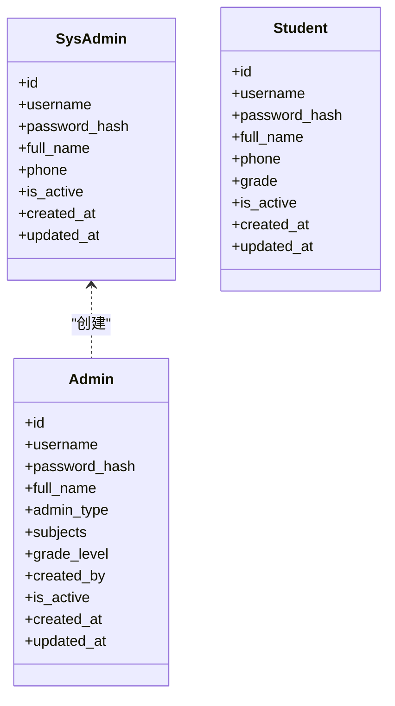
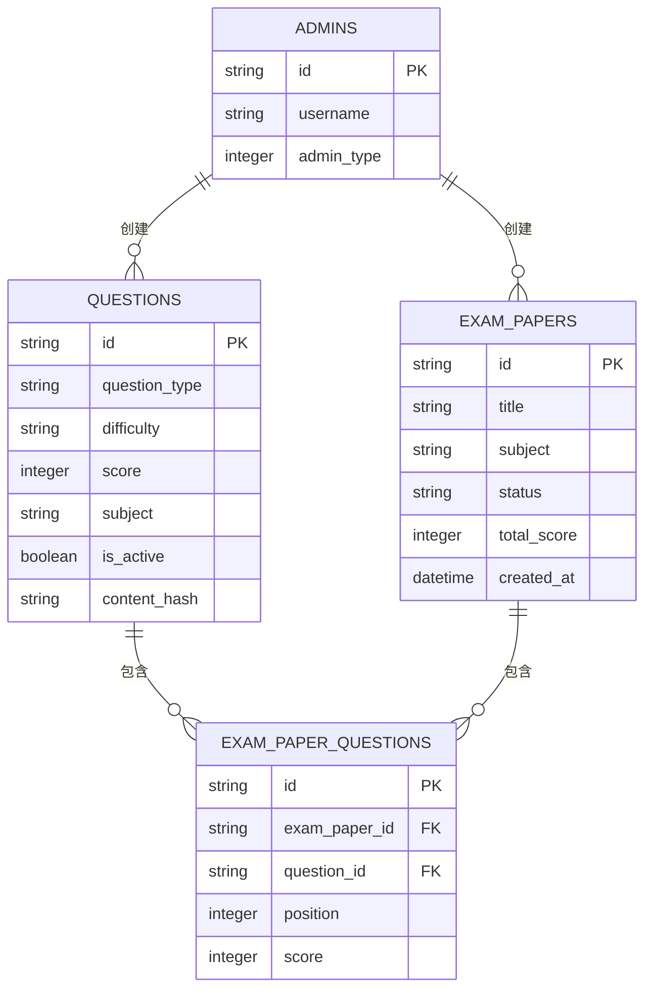
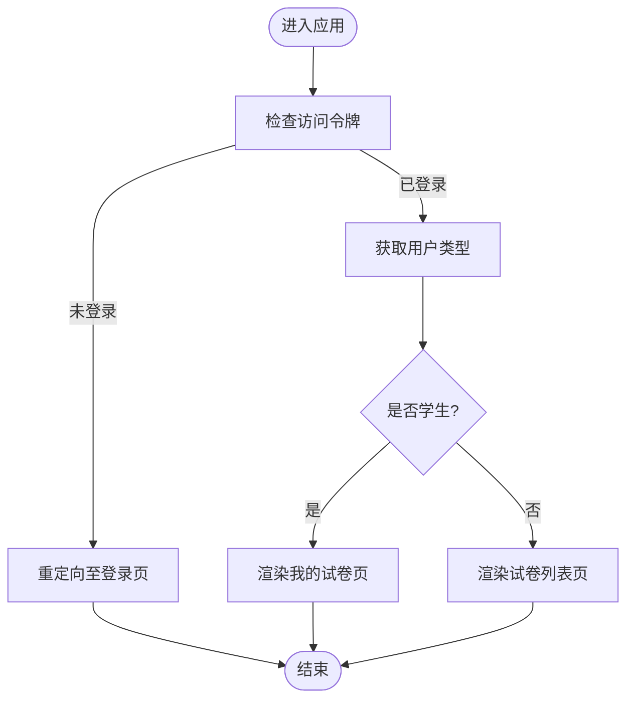
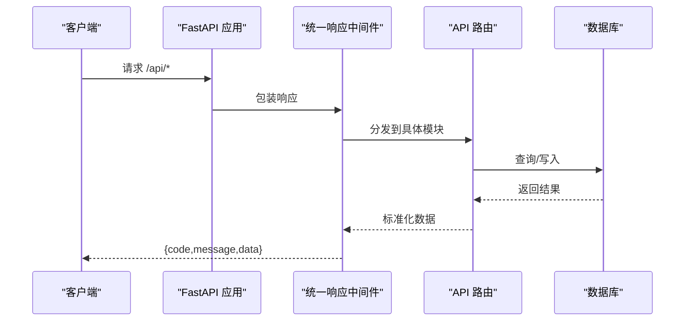
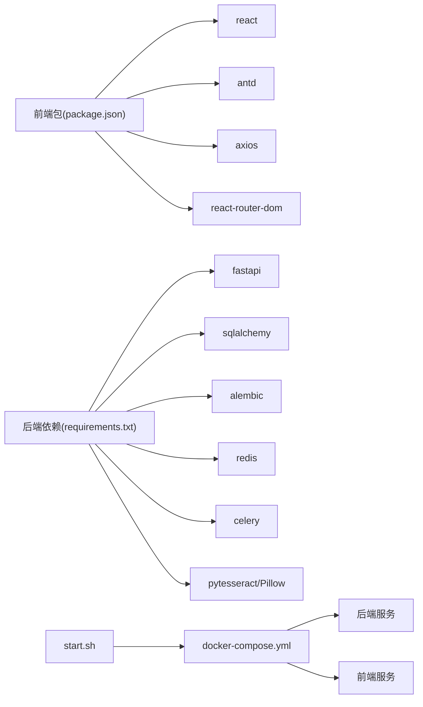

# 项目概述

<cite>
**本文引用的文件**
- [backend/app/main.py](file://backend/app/main.py)
- [backend/app/api/v1/api.py](file://backend/app/api/v1/api.py)
- [backend/app/models/__init__.py](file://backend/app/models/__init__.py)
- [backend/app/models/student.py](file://backend/app/models/student.py)
- [backend/app/models/admin.py](file://backend/app/models/admin.py)
- [backend/app/models/sys_admin.py](file://backend/app/models/sys_admin.py)
- [backend/app/models/question.py](file://backend/app/models/question.py)
- [backend/app/models/exam_paper.py](file://backend/app/models/exam_paper.py)
- [frontend/src/router.tsx](file://frontend/src/router.tsx)
- [frontend/src/App.tsx](file://frontend/src/App.tsx)
- [docker-compose.yml](file://docker-compose.yml)
- [start.sh](file://start.sh)
- [backend/requirements.txt](file://backend/requirements.txt)
- [frontend/package.json](file://frontend/package.json)
- [docs/project-summary.md](file://docs/project-summary.md)
- [docs/PROJECT_STATUS.md](file://docs/PROJECT_STATUS.md)
</cite>

## 目录
1. [引言](#引言)
2. [项目结构](#项目结构)
3. [核心组件](#核心组件)
4. [架构总览](#架构总览)
5. [详细组件分析](#详细组件分析)
6. [依赖关系分析](#依赖关系分析)
7. [性能考虑](#性能考虑)
8. [故障排查指南](#故障排查指南)
9. [结论](#结论)
10. [附录](#附录)

## 引言
瑞珹教育管理系统是一个基于 FastAPI 与 React 的全栈在线教育平台，覆盖试题管理、试卷生成、在线作答、自动判卷、OCR 识别、错题本与通知等核心能力。系统支持多角色用户：学生、教师（管理员）、题库管理员、系统管理员，并围绕“规则匹配 + LLM 语义评分”的双引擎判卷链路构建核心业务闭环。项目当前处于 V2.2 版本，已实现基础认证、题库管理、试卷管理、判卷与错题本等关键模块；OCR 与通知等模块处于待集成阶段，整体具备可运行的开发与演示环境。

## 项目结构
后端采用 FastAPI + SQLAlchemy + Alembic 的模块化单体架构，通过统一响应中间件与路由聚合组织各业务模块；前端采用 React 19 + TypeScript + Ant Design，使用 React Router v7 进行页面路由与权限控制。项目通过 Docker Compose 提供一键启动，配合一键启动脚本实现数据库初始化、迁移与种子数据注入。

**图示来源**
- [backend/app/main.py:1-52](file://backend/app/main.py#L1-L52)
- [backend/app/api/v1/api.py:1-26](file://backend/app/api/v1/api.py#L1-L26)
- [backend/app/models/__init__.py:1-34](file://backend/app/models/__init__.py#L1-L34)
- [frontend/src/App.tsx:1-6](file://frontend/src/App.tsx#L1-L6)
- [frontend/src/router.tsx:1-79](file://frontend/src/router.tsx#L1-L79)
- [docker-compose.yml:1-33](file://docker-compose.yml#L1-L33)
- [start.sh:1-359](file://start.sh#L1-L359)

**章节来源**
- [backend/app/main.py:1-52](file://backend/app/main.py#L1-L52)
- [backend/app/api/v1/api.py:1-26](file://backend/app/api/v1/api.py#L1-L26)
- [frontend/src/router.tsx:1-79](file://frontend/src/router.tsx#L1-L79)
- [docker-compose.yml:1-33](file://docker-compose.yml#L1-L33)
- [start.sh:1-359](file://start.sh#L1-L359)

## 核心组件
- 应用入口与中间件：统一响应包装、CORS、健康检查与启动事件中的参考数据注入。
- 路由聚合：按模块划分的 API 路由，包含认证、题库、试卷、判卷、OCR、错题本、统计、通知等。
- 数据模型：涵盖用户（系统管理员、管理员、学生）、题库、试卷、答题、判卷记录、错题本、通知、知识树等。
- 前端路由与权限：基于用户类型（学生/教师/题库管理员/系统管理员）的页面访问控制与动态路由。
- 基础设施：Docker Compose 编排后端与前端服务，一键启动脚本负责依赖检查、数据库迁移、种子数据与服务启动。

**章节来源**
- [backend/app/main.py:11-52](file://backend/app/main.py#L11-L52)
- [backend/app/api/v1/api.py:6-26](file://backend/app/api/v1/api.py#L6-L26)
- [backend/app/models/__init__.py:27-34](file://backend/app/models/__init__.py#L27-L34)
- [frontend/src/router.tsx:24-42](file://frontend/src/router.tsx#L24-L42)
- [docker-compose.yml:3-33](file://docker-compose.yml#L3-L33)
- [start.sh:171-230](file://start.sh#L171-L230)

## 架构总览
系统采用“模块化单体 + 独立 Worker 进程”的架构策略，将 GPU 密集型任务（判卷、OCR）作为独立 Worker，避免过早微服务化带来的运维复杂度。后端通过统一响应中间件与路由聚合实现高内聚低耦合；前端通过 Ant Design 与路由守卫实现一致的用户体验与权限控制。

**图示来源**
- [backend/app/main.py:11-30](file://backend/app/main.py#L11-L30)
- [backend/requirements.txt:15-17](file://backend/requirements.txt#L15-L17)
- [frontend/package.json:12-22](file://frontend/package.json#L12-L22)

**章节来源**
- [backend/app/main.py:11-30](file://backend/app/main.py#L11-L30)
- [backend/requirements.txt:15-17](file://backend/requirements.txt#L15-L17)
- [frontend/package.json:12-22](file://frontend/package.json#L12-L22)

## 详细组件分析

### 用户与角色模型
系统支持四类角色，分别对应不同的数据表与登录入口，具备差异化权限与功能范围。

**图示来源**
- [backend/app/models/sys_admin.py:8-22](file://backend/app/models/sys_admin.py#L8-L22)
- [backend/app/models/admin.py:9-27](file://backend/app/models/admin.py#L9-L27)
- [backend/app/models/student.py:8-23](file://backend/app/models/student.py#L8-L23)

**章节来源**
- [backend/app/models/sys_admin.py:8-22](file://backend/app/models/sys_admin.py#L8-L22)
- [backend/app/models/admin.py:9-27](file://backend/app/models/admin.py#L9-L27)
- [backend/app/models/student.py:8-23](file://backend/app/models/student.py#L8-L23)

### 题库与试卷模型
题库与试卷是系统的核心数据资产，二者通过关联表建立多对多关系，支持按学科、难度、知识点等维度进行筛选与组卷。

**图示来源**
- [backend/app/models/question.py:10-46](file://backend/app/models/question.py#L10-L46)
- [backend/app/models/exam_paper.py:9-51](file://backend/app/models/exam_paper.py#L9-L51)

**章节来源**
- [backend/app/models/question.py:10-46](file://backend/app/models/question.py#L10-L46)
- [backend/app/models/exam_paper.py:9-51](file://backend/app/models/exam_paper.py#L9-L51)

### 前端路由与权限控制
前端根据用户类型动态选择路由与页面，提供统一的 Ant Design 主题与国际化配置，登录态通过本地存储维护。

**图示来源**
- [frontend/src/router.tsx:24-42](file://frontend/src/router.tsx#L24-L42)

**章节来源**
- [frontend/src/router.tsx:1-79](file://frontend/src/router.tsx#L1-L79)
- [frontend/src/App.tsx:1-6](file://frontend/src/App.tsx#L1-L6)

### 后端 API 聚合与中间件
后端通过统一响应中间件包装所有 /api/* 响应，设置 CORS 并挂载各模块路由；启动事件中完成参考数据注入。

**图示来源**
- [backend/app/main.py:17-30](file://backend/app/main.py#L17-L30)
- [backend/app/api/v1/api.py:6-26](file://backend/app/api/v1/api.py#L6-L26)

**章节来源**
- [backend/app/main.py:17-30](file://backend/app/main.py#L17-L30)
- [backend/app/api/v1/api.py:6-26](file://backend/app/api/v1/api.py#L6-L26)

## 依赖关系分析
- 后端依赖：FastAPI、SQLAlchemy、asyncpg、Alembic、Pydantic、Celery、Redis、OCR 相关库等。
- 前端依赖：React、Ant Design、Axios、Day.js、React Router、Zustand 等。
- 基础设施：Docker Compose 编排后端与前端，一键启动脚本负责数据库准备与服务启动。

**图示来源**
- [frontend/package.json:12-38](file://frontend/package.json#L12-L38)
- [backend/requirements.txt:1-27](file://backend/requirements.txt#L1-27)
- [docker-compose.yml:3-33](file://docker-compose.yml#L3-L33)
- [start.sh:171-230](file://start.sh#L171-L230)

**章节来源**
- [frontend/package.json:12-38](file://frontend/package.json#L12-L38)
- [backend/requirements.txt:1-27](file://backend/requirements.txt#L1-27)
- [docker-compose.yml:3-33](file://docker-compose.yml#L3-L33)
- [start.sh:171-230](file://start.sh#L171-L230)

## 性能考虑
- 判卷性能：客观题规则匹配应在 2 秒内完成评分，主观题采用 LLM 语义评分，结合并发控制与缓存优化。
- OCR 性能：PaddleOCR 集成后通过并发阈值与置信度阈值控制处理吞吐与质量。
- 数据库性能：合理使用索引（如题目类型、难度、学科、激活状态、内容哈希等），避免 N+1 查询，必要时引入 Redis 缓存热点数据。
- 前端性能：按需加载、组件拆分与路由懒加载，减少首屏体积；Ant Design 主题与国际化配置集中管理。

## 故障排查指南
- 后端服务不可达：检查健康检查接口与端口映射，确认 uvicorn 启动参数与日志输出。
- 数据库连接失败：核对 sysconfig.json 中数据库配置，确保 PostgreSQL 正常运行并可创建数据库。
- 前端无法访问：确认前端服务启动与端口开放，留意编译耗时；若长时间未就绪，查看控制台输出。
- 权限与路由问题：检查访问令牌与用户类型判断逻辑，确认路由守卫生效。

**章节来源**
- [backend/app/main.py:50-52](file://backend/app/main.py#L50-L52)
- [start.sh:187-196](file://start.sh#L187-L196)
- [start.sh:275-332](file://start.sh#L275-L332)
- [frontend/src/router.tsx:24-42](file://frontend/src/router.tsx#L24-L42)

## 结论
瑞珹教育管理系统已完成基础认证、题库与试卷管理、判卷与错题本等核心功能，具备可运行的开发与演示环境。下一阶段将重点推进 OCR 与通知链路的集成、完善导出与移动端适配、提升测试覆盖率与部署自动化，持续优化判卷性能与用户体验。

## 附录
- 发展历程与版本规划：参见项目总览与状态报告文档，明确 V1.0 交付摘要、V2.0 迭代规划与当前 V2.2 状态。
- 当前状态指标：API 端点数量、数据库表数量、源文件规模、功能矩阵与用户体系等。

**章节来源**
- [docs/project-summary.md:1-87](file://docs/project-summary.md#L1-L87)
- [docs/PROJECT_STATUS.md:1-75](file://docs/PROJECT_STATUS.md#L1-L75)